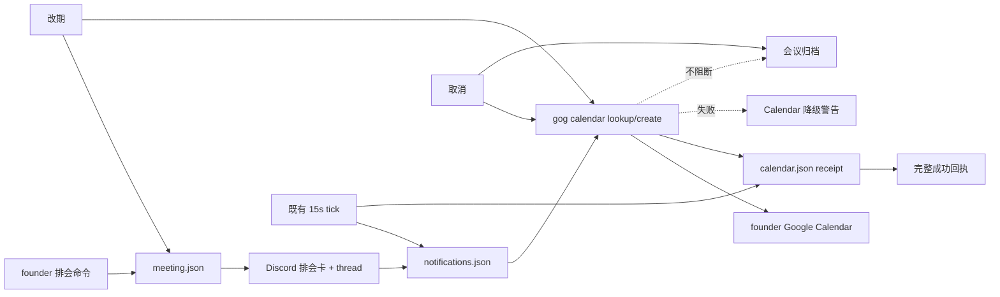

# FLY-2130 Raya 排会同步 Google Calendar — 实施计划
Issue: FLY-2130 (https://linear.app/geoforge3d/issue/FLY-2130/raya会议-排会同步写入-founder-的-google-calendar)
日期: 2026-08-28
基于: research.md

## 0. 目标与成功条件

当 founder 的精确排会命令成功落地 Discord 卡/thread 后，Raya 通过本机 `gog` 把同一场会议投影到 founder Google Calendar；Calendar 创建、改期、取消都幂等、不会静默重复。Calendar 正常时回复普通成功；外部失败时回复明确降级警告，但绝不阻断 FLY-2032 的开始、missed、结束、取消归档或下一次排会。

成功条件：

1. create event 含开始/结束时间、Lead、议题、Discord thread URL；
2. `取消会议` 删除对应 event；
3. `改期会议 [明天] HH:MM [时长 N]` 更新同一 event；
4. crash/retry 不 duplicate；
5. `gog`/OAuth 失败显式、可恢复且不会锁死会议系统；
6. 不新增 dependency，不碰 credential，不部署/重启生产；
7. Raya 全仓 lint/build/typecheck/test 绿，Flywheel full-repo gates 绿。

## 1. 假设与待确认

| 假设 | 当前处理 | 问题 id |
|---|---|---|
| founder account alias = `personal` | env 可覆写，默认 `personal` | `111f2902-d9d7-4520-9ae8-6019aec06819` |
| target calendar = `primary` | env 可覆写，默认 `primary` | 同上 |
| 改期要有用户可达入口 | 精确命令 `改期会议 [明天] HH:MM [时长 N]` | `520d026a-79d2-429f-9fbc-81e6d2c72941` |
| 取消含义 = 删除 Calendar event | 与已有 `取消会议` 一致 | 任务原文 |

两问均非实现阻塞：按表中最小默认前进；若 Lead 回复不同，在写代码前/实现中收窄配置或 parser，不造兼容层。

## 2. 最小架构



没有新 daemon、queue 或 DB。既有 brain 是单写者，既有 serialized controller + tick 提供顺序与 best-effort 重试；Calendar 是可见的 fail-open 外部投影，不是会议 FSM 的 gate。

## 3. 数据合同

新增 `meetings/<meetingId>/calendar.json`：

```ts
interface MeetingCalendarReceipt {
  schemaVersion: 1;
  meetingId: string;
  account: string;
  calendarId: string;
  eventId: string;
  threadUrl: string;
  scheduledAt: string;
  durationMinutes: number;
  syncedAt: string;
  cancelledAt?: string;
}
```

校验：

- meeting id = UUID；所有字符串 trimmed/non-empty；
- `scheduledAt/syncedAt/cancelledAt` = canonical ISO-8601；
- duration positive safe integer；
- `threadUrl` 必须是 `https://discord.com/channels/<snowflake>/<snowflake>`；
- cancelled receipt 不再允许回到 active；
- 读取损坏文件时错误必须带 `meeting calendar receipt is corrupt`，不得当作 missing。

写入复用 contracts 现有 `atomicWrite`，mode 0600。receipt 写后追加：

- `meeting_calendar_synced`（event id、时间、calendar id）；
- `meeting_calendar_cancelled`。

不把 account token 或 email 写入日志；account selector 按配置写 receipt 供审计。

## 4. `gog` adapter

在 Raya brain 新增一个聚焦模块（预计 `apps/brain/src/meeting-calendar.ts`），导出：

```ts
interface MeetingCalendar {
  sync(meeting: Meeting, profile: LeadProfile, threadUrl: string): Promise<void>;
  cancel(meeting: Meeting): Promise<void>;
}
```

factory 配置：`stateDir/gogBin/account/calendarId/timeoutMs`；测试可注入 `run(args)`。

### 4.1 `sync`

1. 读并校验 receipt；若 account/calendar/thread/time/duration 全匹配且未 cancelled，直接返回；
2. 计算显式 lookup window：`min(meeting.scheduledAt, receipt?.scheduledAt)-24h` 到 `max(两者 end)+24h`；
3. 固定调用 `events <calendarId> --private-prop-filter=raya_meeting_id=<id> --from=<start> --to=<end> --max=2 --fields=items(id)`；
4. 多于 1 条 fail-closed；
5. 1 条则 `update`（即使本地 receipt 缺，关闭 create crash window）；
6. 0 条则 `create`；
7. 解析 event id，原子写 receipt + event。

event 内容：

- summary：`Annie × <displayName>：<topic>`；
- from：`meeting.scheduledAt`；
- to：`scheduledAt + durationMinutes`；
- description：Lead、议题、thread URL、meeting id，各占一行；
- private prop：`raya_meeting_id=<meeting.id>`；
- `--visibility=private`（create/update 都固定，避免共享 Calendar 泄露内部议题/thread）；
- 不设 attendee、不自动建 Google Meet、不发 update email。

### 4.2 `cancel`

1. 已有 `cancelledAt` 直接成功；
2. 用 private property 查 0–2 条；
3. 多条 fail-closed；1 条 `delete --force`；0 条视为已删除；
4. 有历史 receipt 时保留必填 `eventId` 并写 `cancelledAt`；如果从未创建成功、lookup 也是 0 条，则不写 Calendar receipt，绝不伪造 event id。

`eventId` 在 receipt schema 中始终必填，没有 optional 分支。

## 5. runtime 接线

### 5.1 配置

`RayaConfig` 增加：

- `meetingCalendarEnabled`：`RAYA_MEETING_CALENDAR_ENABLED`，默认 `true`；显式 `false` 是 OAuth/binary 故障期 kill switch，排会回执必须披露 Calendar 已禁用；
- `gogBin`：`RAYA_GOG_BIN` 或 `/usr/local/bin/gog`，parseConfig 只校验 absolute，不做 exists/executable 的启动期硬依赖；adapter 首次调用由 `execFile` 懒校验并把失败降级成 Calendar warning；
- `meetingCalendarAccount`：`RAYA_MEETING_CALENDAR_ACCOUNT` 或 `personal`；
- `meetingCalendarId`：`RAYA_MEETING_CALENDAR_ID` 或 `primary`。

selector 只允许 1–255 个非 control、非首尾空白、非 `-` 开头字符；account 固定用 `--account=<value>`，calendar id 作为经上述校验的 positional。所有参数走 `execFile(argv)`，永不 shell interpolate。`RayaConfig` 解析 Calendar 值不能因为 gog 未安装而让整个 brain 退出。

### 5.2 排会

`createMeetingRuntime.schedule`：

1. 原样 `scheduleMeeting`；
2. 原样 `deliverMeetingNotifications`；
3. `MeetingRuntimeConfig` 显式新增并由 `cli.ts` 传入 `guildId`；从 notification receipt 取 thread id，构造 `https://discord.com/channels/<config.guildId>/<threadId>`；
4. enabled 时尝试 `calendar.sync`；失败则捕获为 `calendarWarning`，不 throw 到 Discord notification catch；disabled 时直接产生可见 warning；
5. controller 无 warning 返回 `scheduled` + 原 receipt；有 warning 回复「会议已安排，但 Google Calendar 未同步：…」并返回新结果 `scheduled_with_calendar_warning`。

`tick` 在处理 lifecycle 前复用 `ensure notifications`，再对所有尚未 cancelled 的 current meeting best-effort `calendar.sync`。Calendar error 用同一 meeting-id idempotency key 发一条状态 warning/写 error log，然后**继续执行本 tick 的 starting/live/missed/terminal 分支**；绝不因 Calendar return。notification 缺失仍沿 FLY-2032 原 gate，不在本单改变。

### 5.3 改期

contracts 新增专用 `rescheduleCurrentMeeting(stateDir, id, scheduledAt, durationMinutes)`：

- 只接受 current + `status=scheduled`；
- 只改这两个字段；
- validation 后 atomic write；
- 追加 `meeting_rescheduled`；
- 通用 `updateCurrentMeeting` 的 immutable 列表不变。

parser/controller/runtime 新增 `reschedule` 分支。runtime 先写本地新时间，再 best-effort `calendar.sync`；失败保留新时间/旧 receipt并返回 warning，tick 可补，但到点 FSM 不被阻断。成功回执带 Lead、新时间、议题、时长；降级结果单列 `rescheduled_with_calendar_warning`。

### 5.4 取消

`cancel` 顺序：

1. current scheduled → locally cancelled；
2. enabled 时 best-effort `calendar.cancel`，捕获 warning；
3. 无论第 2 步成败都执行 existing `finishTerminal` announce/archive/clear。

若第 2 步失败，controller 回复「已取消会议，但 Google Calendar 未同步：…」并返回 `cancelled_with_calendar_warning`；本地 current 必须已清除，founder 可立刻排下一场。Calendar 失败不伪装为成功，但也不把 repair 责任变成 `meeting.json` 手工清理。

正常 ended/missed 不调用 Calendar delete。

## 6. TDD 顺序

### RED 1 — receipt contract

在 `packages/contracts/src/meeting.test.ts` 先加：

- calendar receipt roundtrip + mode/path；
- corrupt/foreign-id/invalid URL/time/duration 拒绝；
- sync 更新游标；
- cancelled terminal；
- `rescheduleCurrentMeeting` 只允许 scheduled 且不放宽 generic patch。

### GREEN 1

只加 receipt path/read/write 与专用 reschedule primitive。

### RED 2 — `gog` argv/恢复

新 brain test：

- create 字段完整，固定 `--visibility=private`；
- lookup 精确 argv 含 `--fields=items(id)`、显式 `--from/--to`、`--max=2`；
- 已结束 meeting 仍能被 lookup 找回；大跨度改期 window 同时覆盖 receipt 旧时间与 meeting 新时间；
- selector 拒绝 `-` 开头，account 使用 `--account=<value>`；
- lookup 找到已有 event 时不 create；
- duplicate lookup 拒绝；
- matching receipt no-op；
- reschedule update 同一 id；
- manual-delete 后 recreate；
- cancel delete / already absent；
- bad JSON/missing id/nonzero/timeout 显式失败。

### GREEN 2

用 stdlib `execFile` 与最小 JSON parser 实现 adapter，无 npm 依赖。

### RED 3 — runtime/controller

扩展 `meeting.test.ts`：

- schedule 顺序 notification→calendar→reply，thread URL 必须使用 runtime `config.guildId`；
- calendar fail 返回 `scheduled_with_calendar_warning`，tick 仍会 start/miss；kill switch 同样显式 warning；
- reschedule parser、local mutation、Google update、降级 warning 与后续 best-effort 恢复；
- cancel 先尝试 Google delete 再 archive；delete 失败仍清 current 并返回 `cancelled_with_calendar_warning`；
- ended/missed 不 delete；
- controller serialization 仍成立。

### GREEN 3 / REFACTOR

最小接线；删除测试逼出来的重复 formatter/lookup 分支，不提取通用「projection framework」。

## 7. 验证

### Raya focused

```text
pnpm --filter @raya/contracts test
pnpm --filter @raya/brain test
```

### Raya full repo

```text
pnpm lint
pnpm -r build
pnpm typecheck
pnpm test
```

### Flywheel full repo

```text
pnpm lint
pnpm -r build
pnpm test:packages:run
```

本单没有 `scripts/__tests__/*.test.sh` 新增项。若 full repo 因独立现存失败红，必须在 base head 上复现并如实区分，不能把没跑完报成全绿。

### 真机 activation evidence（不由本节点执行）

1. 交互终端 `gog --account=<confirmed> ... calendar calendars` 只读成功；
2. 在无 TTY 的 launchd user bootstrap context 跑同一只读探针（例如 `launchctl asuser $(id -u) <gog-bin> --account=<confirmed> --json --results-only --no-input calendar calendars`），证明 Keychain ACL/锁态在真实调用上下文可用；
3. 在 QA calendar/明确授权窗口排一场未来会议；
4. 读回 event 的 visibility、时间、Lead、议题、thread link；
5. 改期后读回同一 event id；
6. 取消后查询为空；
7. 清理 QA event；
8. 不重启生产，部署走独立 updater 窗口。

2026-08-28 founder 完成 `personal` re-auth 后，Lead 已实测 calendars 列表与 `primary` 事件读取成功；原 `invalid_grant` activation 前置已解除。launchd 无 TTY 探针仍作为部署验证证据执行，不再作为 OAuth blocker。

## 8. Review、PR 与 handoff

1. 三件套提交到 Flywheel branch；
2. 按 codex-author 流程开 `review_design` gate + `request-review`，未 APPROVED 不写代码；
3. 从 Raya `origin/fly-2032-raya-meeting@7743dab` 建独立 worktree/branch；
4. TDD 实现、full gates；
5. Raya exact-head code review：`review_code` gate + `request-review --target-repo ...`，CHANGES 必须修并开新 gate；
6. 开 Raya PR，明确依赖 #5；
7. Flywheel 最后一 commit 新增 `engineering/doc/milestones/FLY-2130.md` 并开 docs PR；
8. 不请求 ship、不 merge、不 restart；
9. 完成 bounded implement node 时走 `complete --route needs_review`，把 code PR 作为主 handoff，并在 summary/report 同时列 docs PR。

## 9. 明确不做

Google SDK/新依赖、credential repair、Google Meet、attendees、双向 sync、Calendar webhook、recurrence、多个 Calendar fan-out、模糊改期、改 Lead/议题、生产 env/plist 永久改动、部署/重启/merge。

## 10. 风险

| 风险 | 处置 |
|---|---|
| `gog` JSON shape 与预期不同 | adapter parser 小而 fail-closed；tests 固定已使用字段；activation 用真只读命令复核 |
| OAuth 日后失效 | 明确报告并 fail-open；不自动修凭据；当前 `personal` 已 re-auth 且只读实测通过 |
| FLY-2032 尚未 merge | 代码 PR 显式依赖 #5，branch 从 exact head 建；不改依赖 worktree |
| create crash 造成 duplicate | private property lookup-before-create |
| founder 手工删/改 event | 下一次 Raya 改期会按真源重建/覆盖；本单不做双向冲突 UI |
| Calendar/OAuth/binary 故障 | 普通成功降级为明确 warning；FSM 继续，kill switch 可关；不得 gate start/missed/cancel/archive |

## 11. Design review 处理记录

| 轮 | verdict | 处理 |
|---|---|---|
| R1 | CHANGES_REQUESTED（4 HIGH + 4 MEDIUM + 2 LOW） | 全部接受：lookup 改 `items(id)` + 显式覆盖旧/新时间窗；Calendar 从 FSM gate 改为 visible fail-open；新增 kill switch 且 gog binary 懒校验；runtime 显式传 `guildId`；receipt `eventId` 始终必填、从未创建则不写 receipt；launchd 无 TTY activation probe；selector 防 flag injection + `--account=value`；create/update 固定 private；结果 taxonomy 单列 Calendar warning。 |
