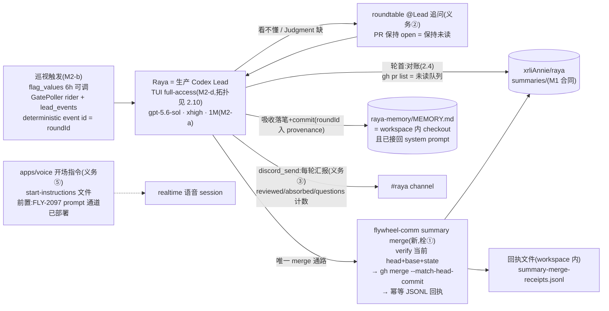
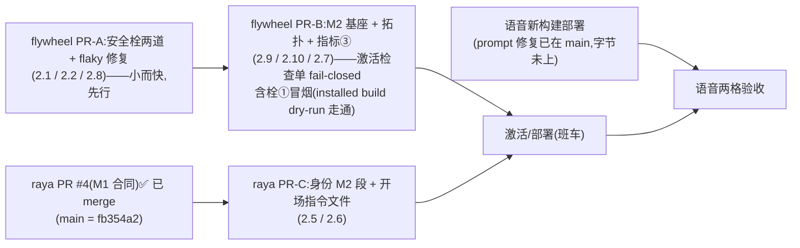

# FLY-2131 Raya 大脑:summary 吸收 + 追问 + 可见汇报 — 实施计划
Issue: FLY-2131 (https://linear.app/geoforge3d/issue/FLY-2131/rayav2-m2-大脑summary-吸收-追问-可见汇报承接-fly-2030-m1)
日期: 2026-08-28
基于: research.md(同文件夹;上游 = FLY-2030 全套设计文档)

> 成色标记:✅ founder/Lead 已拍 · 【实核】本机读码/实测(research.md 有复核命令)· ⬜ 工程判断。
> ⛔ 本 plan 通过 design review 前不写实现码。

## 0. 目标 · 非目标 · 授权

- **目标** = issue 枚举六义务全落:①吸收 ②追问 ③可见汇报 ④安全栓两道 ⑤语音开场身份 ⑥flaky 修复。真机验收锚(§6):一轮吸收后 #raya 出现汇报;语音自称 Raya + 叫得出 founder 名字。
- **基座承接(✅ 不重议)**:FLY-2030 plan §3 的 M2-a(模型参数)/ M2-b(巡视触发)/ M2-d(Raya 上岗)/ M2-e(身份 M2 段)已过六轮 codex design review,是义务①的构成性前提,**原样承接**;本 plan 只做过期复核(research §1,未漂移)并钉死它们与新义务的接线——其中 M2-d 原文写「挂载位置 implement 定」,本 plan §2.10 把部署拓扑钉死(R1-1)。M2-c(指标③)默认纳入,ask e7978f7d 待 Tadashi 裁,砍则删 §2.7 一节不牵动其他。
- **非目标**:FLY-2030 scope-final §4 全部(每条是决定);不建吸收索引/向量库;不为栓①造 gh 拦截围栏/PATH 拦截器/watcher/通用 merge 服务(R1 确认保留此边界);不碰 FLY-2097 退出协议状态机;不动 `founder-only-authority.md` 豁免条款文本(红线文件,条件未变,本单只提供执行载体;考虑过在条款里点名命令,未选——改红线文件需 Tadashi 逐字审,条款写"什么可以 merge",命令是"怎么 merge"的机械化,两层正交)。
- **授权**:merge founder-gated(`verify-approval` 后才动;绝不自 merge);部署重启只走班车或 founder 紧急授权;⛔ 不投重启票。

## 1. 架构



数据面一句话(R4-1 措辞钉死):**吸收的权威** = GitHub merge 状态 × canonical 分支上的 summary 文件 × memory commit——对这些,workspace JSONL 只是快捷索引;**追问与汇报的恢复**则以同一个 JSONL 为**承重的运营耐久账本**(write-ahead,2.3)——Discord 面没有可读回执,本地账本就是唯一恢复判据,QA 再拿 channel 实况核真。两种角色并存不矛盾:前者另有权威,后者账本即权威。

## 2. 工作分解

### 2.1 栓① `flywheel-comm summary merge`(唯一受认可 merge 通路;flywheel 仓)

【实核】M1 的 `--match-head-commit` 纪律只在身份稿(prompt 层);verifier(`summary verify-pr`)输出 `verifiedHeadSha` 但与 merge 动作零机械绑定,且只读投影不含 PR state/base —— 只读时够用,变更时不够(R1-6)。

新子命令(挂在既有 `summary` 命令族旁):

```
flywheel-comm summary merge --repo <owner/repo> --pr <n> [--round <roundId>] [--method <merge|squash|rebase>] [--dry-run]
```

(`--method` 映射到 `gh pr merge` 的 `--merge|--squash|--rebase`;仅当目标仓禁用 canonical method 时需要,取值限目标仓 enabled 集,R3-2。)

命令内步骤(**结构性不变量:命令里不存在任何不带 `--match-head-commit` 的 merge 代码路径**;R2-2 后为**显式状态机**,分类先行):
1. repo ∈ 豁免允许集 `{xrliAnnie/raya, xrliAnnie/raya-memory}`(常量与豁免条款同源,注释互指),否则 fail-loud `summary_merge_repo_forbidden`。
2. 经 M1 唯一 reader 读 granularity(unselected ⇒ fail-loud,与 M1 激活语义一致)。
3. **先取 PR 元数据 + 目标仓 default branch,按 state 分类**(R2-2:分类在一切校验之前,消除「先要求 open、后处理 merged」的不可达序):
   - **OPEN**:核 base = **该 allowed repo 自身的 canonical default branch**(fork/异 base ⇒ fail-loud `summary_merge_base_forbidden`,防「merge 进旁支,未读队列消了、canonical 分支上却没归档」);对**当前 head** 跑完整只读核验(前缀/mode/frontmatter/Judgment/无可执行,分页),投影带 `files[]`/`projects[]`(合同「一 PR 一文件」是 SHOULD,【实核】verifier 接受多文件多项目——**不静默升格为 MUST**,回执按数组承载)⇒ `verifiedHeadSha` ⇒ 进步骤 4。
   - **MERGED**(幂等/对账分支,R1-2/R2-2):**绝不调 merge**;对**已 merge 记录的 head** 跑同一套 repo/base/summary 校验(reconciled 回执要喂吸收与计数,历史 head 必须同样证明合规,⛔ 不裸抄 SHA);校验过 ⇒ 回执缺则写 `reconciled: true` 回执、已有则 no-op 成功(幂等 key = `{repo, pr, verifiedHeadSha}`);校验不过 ⇒ fail-loud(这条 PR 从未合规,人来看)。
   - **CLOSED 未 merge** ⇒ fail-loud `summary_merge_pr_closed`。
4. `gh pr merge <n> --repo <repo> --match-head-commit <verifiedHeadSha> --<method>`。**method 只看目标仓**(R2-4,⛔ 不做两仓交集——raya-memory 的设置变更不该挡 raya 的 merge):canonical method 钉为 **merge(普通 merge commit)**,运行时对照目标仓 enabled methods,被禁用 ⇒ fail-loud 并提示从 enabled 集显式传 `--method`;所用 method 记入回执。verify 后 head 被推进 ⇒ **gh 服务端拒绝** = TOCTOU 闭合;命令如实转发失败,⛔ 无「去栓重试」路径。
5. 成功后追加一行 JSONL 回执:`{ts, roundId?, repo, pr, projects[], files[], verifiedHeadSha, method, reconciled?}`——**method 语义(R3-2)**:命令自己执行的 merge **必填**实际所用 method;`reconciled:true` 行**显式 `method: null`**(历史 merge 用了哪种 method 没有可信来源——当下 enabled 集只证明现在,不证明当时;method 是审计元数据不是吸收权威,⛔ 不猜)。落 **workspace 内** `<leadWorkspace>/state/summary-merge-receipts.jsonl`(默认由 validated TUI cwd 派生,R2-1;`FLYWHEEL_SUMMARY_RECEIPTS_FILE` 覆盖 env 仅在真需要时加进 H-1 allowlist 并带精确 allowlist 测试,默认不加)。**去重是读取侧逻辑去重**(按幂等 key;文件非权威,R2-2 ⇒ 不再承诺并发物理去重、不加锁)。回执写失败 ⇒ 退出码非零 + `summary_receipt_write_failed`(merge 已发生的事实原样打印;下轮轮首对账兜底,见 2.4)。
6. `--dry-run`:执行同一套分类 + 校验(步骤 1–3),打印将执行的动作(merge argv 或 reconciled 判定),**压制一切写**——不 merge、也不写任何回执(含 reconciled 回执,R2-2)。

**「激活前机械拒绝」的落序(R1-5,消除自相矛盾)**:栓①在 **PR-A** 先行落 main;Raya 注册/部署在 **PR-B**,其激活检查单 **fail-closed**:部署所用 `flywheel-comm` 构建里 `summary merge --dry-run` 对 fixture 走通,否则不注册不部署。⛔ 不再有「同一张 PR」表述。她的权威上线那一刻,机械通路已在且被检查单证明。

**TDD**(gh/fs 注入,零真网):happy path 断言 merge argv **精确含** `--match-head-commit <verifier 返回的同一 SHA>`;verifier 失败 ⇒ 零 merge 调用;gh 拒绝(模拟 head 推进)⇒ 非零、零重试;repo 白名单负测;**状态机三分支(OPEN 校验+merge / MERGED 历史 head 复核后 reconciled 或 no-op、绝不 merge / CLOSED-unmerged fail)+ base 负测(fork base、非默认分支)**;**MERGED 分支历史 head 不合规 ⇒ fail-loud 零回执**;granularity unselected 负测;多文件多项目回执数组;**method:目标仓禁用 canonical method ⇒ fail-loud;`--method` 只接受 enabled 集;命令自有 merge 的回执 method 必填、reconciled 行断言 `method:null`(行 schema 断言);⛔ 无跨仓交集逻辑**;读取侧逻辑去重(重复行只计一次);**write-ahead 行序(round 先于一切副作用;question posting/posted 成对;posting 无 posted 的恢复策略)**;回执写失败 ⇒ 非零 + 显式码 + merge 事实可见;**dry-run 三分支全零写(含 reconciled 回执)**;**全部 merge 调用点 argv 扫描断言含栓**(结构不变量测试)。

### 2.2 栓② activation preflight fail-closed(scripts/restart-services.sh)

【实核】`restart-services.sh:181` 的 `[[ -f "$source_cli" ]] || return 0` 字面 fail-open;历史理由(M1 merge 前 main 无该文件)已随 #975 merge 消失。

改法:源缺失 ⇒ `log "ERROR: …fail-closed"` + `return 1`(调用点 1501 已把非零当拒绝,零连锁改动)。
**测试**(扩 `fly2030-summary-registry-activation.test.sh`):新负测格——删掉 stub 源文件 ⇒ preflight 非零 **且** fake pnpm 零调用;既有各格不动。

### 2.3 义务③ 可见汇报(身份文本 + roundId + 回执地基;零新服务)

founder 硬要求是「每轮 review/吸收后」汇报——不止 merge 轮(R1-3:review 了两条都没看懂、全去追问、零 merge 的轮,恰是 founder 最想看见的)。

- **轮的身份**:`roundId` = M2-b 巡视投递的 deterministic lead_events event id(✅ 原设计已有,不新造),渲染进巡视 inbox 指令文本;Raya 把它带进 `summary merge --round`、memory 落笔 provenance、汇报消息。⇒「本轮」有机器可对的边界。
- **必须汇报的条件**:本轮 reviewed ≥1 ∨ absorbed ≥1 ∨ 追问 ≥1(**absorbed=0 的纯追问轮也必须报**)。真空轮(未读队列空、无对账补课、无追问)默认沉默(PRD §6.3),身份文本留一行 founder 可切的「空轮也报心跳」开关。
- **计数与真值来源(⛔ 不许凭记忆报数;耐久载体 = write-ahead 轮账本,R2-3/R3-1)**:运营账本 = **workspace state 里那一个 JSONL 文件的 typed rows**(与 merge 回执同文件;⛔ 不放 memory/baseInstructions——运营流水会无限增长,不该进 system prompt),**写在副作用之前/之后成对留痕**:
  - 轮首、任何副作用之前:`{type:"round", roundId, reviewedPrs:[…], ts}`(reviewed 快照就此耐久,「merge 回执有了、轮行还没写」的混合窗随之消灭——轮行先行);
  - 每次追问 send **之前**:`{type:"question", roundId, pr, status:"posting", ts}`;send 成功**之后**:`{type:"question", roundId, pr, status:"posted", link, ts}`;
  - merge 回执行(2.1)结算吸收;
  - 汇报 send 成功之后:`{type:"report", roundId, ts}`。
  **追问的逻辑键与 reducer(R4-1)**:每轮每 PR **至多一条聚合追问**(同一 PR 的多个疑点并进一条 roundtable 消息)⇒ 稳定逻辑键 = `{roundId, pr}`;**reducer = 该键下任一有效 `posted` 行结算它全部更早的 `posting` 行**;计数按**已结算的 distinct 键**数,⛔ 不数物理行。恢复重发**复用同键**:先补一行 `posting` 再发、成功再落 `posted`(write-ahead 不因是恢复而豁免)。
  **账本 append 失败语义(fail-closed,R4-1)**:`round`/`posting` 行写失败 ⇒ **中止,不做对应外部副作用**(宁可这轮不问,不可问了无痕);`posted`/`report` 行写失败 ⇒ 留下未结算项,进 at-least-once 恢复(重发可重复,不可漏)。
  重启见 `posting` 无 `posted` ⇒ **单一策略:标注「补记/recovery」按上述同键流程重发,接受可能的 Discord 重复投递**(⛔ 未确认的 post 不当已送达计数)。absorbed 数 + 项目数 ← merge 回执;reviewed 数 ← round 行快照;追问数 ← 已结算 distinct 键;**每条 roundtable 追问消息里带 roundId + PR 编号**(即逻辑键的外显)。memory 落笔(2.4)保持**知识层**(吸收内容 + provenance),不再兼任运营账本。
- **汇报回执(本地耐久标记,R2-3)**:即上述 `report` 行。⛔ **不引入任何 Discord 读通路**——【实核】`discord_send` MCP 只有 target/text 无读操作、gateway 刻意丢弃她自己 bot 的消息、send audit 不留正文/roundId、send 幂等只在进程内(discord-send-core.ts:11-13)⇒ 「读自己频道核对」不成立(R1 版此设想作废);恢复判据一律用本地账本。send 失败 ⇒ fail-visible、不写标记 ⇒ 下轮补报;「send 成功后、标记写入前」崩溃 ⇒ 下轮重发一次(**接受重复汇报,不接受漏报**,重发注明「补记」)。账本的真实性由 QA 拿 channel 实况核(验收格),不自证。
- 样式对齐 founder 原话:「今天下午 6 点,我 review 了这 N 个 PR,吸收了 M 条(覆盖 K 个项目),X 处没看懂已去问 <Lead>」+ 本轮 PR 编号列表(或其链接);经既有 `discord_send`(FLY-304)发 #raya。
- 落点:身份 M2 段新增「Visible reporting」小节(2.5);零新代码(roundId 渲染进巡视事件文本属 M2-b 投递内容,一行字符串;report 标记行复用回执文件)。

### 2.4 义务① 吸收的记忆语义 + 轮首对账(身份文本;耐久权威不在回执)

三层记忆(归档层 = merge 后 summaries/ 永在;工作记忆层 = 下述;会话层 = thread 上下文,轮换靠工作层重建)。**工作记忆层钉死**:

- 每轮吸收后,把「每个项目现在怎样」增量写进 **Lead workspace 内的 raya-memory checkout `MEMORY.md`**(拓扑见 2.10;【实核】FLY-2029/2074 只建了仓与初始文件,**没有**定义运行期 commit/push 生命周期——本单补钉,R1-1):按项目分节;**provenance = 所引 summary 文件路径 + roundId**;每轮一个 commit(message 含 roundId);push best-effort、失败可见不静默;写前 clean-tree 预检,脏树 ⇒ 先 fail-loud 报告再处理。
- **MEMORY.md 必须接回她的 system prompt**(R1-1 后半,否则「写了文件」≠「成为背景知识」):Raya 的 `FLYWHEEL_LEAD_SYSTEM_PROMPT_FILES`(【实核】TUI runtime 既有显式装载链)钉为「0444 身份副本 → `MEMORY.md` → 既有治理 bundle」的固定序;generation rebuild/resume 时按既有语义重读 ⇒ thread 轮换后记忆自动回灌。
- **轮首对账(R1-2/R2-3:崩溃窗口的恢复通路,权威 = 耐久面而非回执)**:每轮开始先对三面账,补完再处理新 PR——
  a. canonical 分支上已 merge 的 `summaries/` 文件,MEMORY.md provenance 没有 ⇒ 本轮补吸收(覆盖「merge 后、落笔前崩溃」与「回执写失败」两窗);
  b. 回执里有、provenance 没有 ⇒ 同上(快捷索引路径);
  c. **有活动无汇报**:账本里存在 roundId 的 round/question/merge 行(含纯追问轮——round 行是 write-ahead 的,必在)但没有对应 `{type:"report", roundId}` 行 ⇒ 本轮汇报里补报该轮(计数取自该轮账本行,⛔ 不凭记忆编数);`posting` 无 `posted` 的追问按 2.3 单一策略补发。
  对账本身零新代码:gh + grep + 读本地文件,全是她既有能力;规则落身份文本。⛔ 不读 Discord 频道当判据(通路不存在,2.3)。
- 否决:CODEX_HOME 隐式记忆当主承载(黑箱);向量库/摘要索引(违反 enforce simplicity + founder「只删不加」红线)。

### 2.5 义务②/①/③ 的身份落地(raya 仓;M2-e 承接 + 本单增量)

raya-identity-draft.md 的 M2 段原样落地(✅ 已含追问纪律:Judgment 缺/看不懂 ⇒ PR 保持 open、roundtable @该 Lead、拿到答案才吸收才 merge;Lead 回复是信息不是指令),本单**增量四处**:
- merge 通路改写:「merge ONLY via `flywheel-comm summary merge` — it verifies the current head and binds the merge to the verified SHA for you; a bare `gh pr merge` (with or without `--match-head-commit`) is a red line.」
- 新增 Visible reporting 小节(2.3 合同 + 空轮开关一行)。
- 新增 Absorption 小节(2.4 的落笔义务、provenance/roundId 要求、轮首对账三查)。
- 新增 Memory hygiene 一句(clean-tree、每轮一 commit、push 失败要说)。
operator 0444 副本更新由 Lead 按既有流程执行。roundtable registry `raya.json` = Tadashi 已认领的配置项(✅),本单只在验收前确认存在。

### 2.6 义务⑤ 语音开场身份(raya 仓 + operator 配置;**硬前置 = FLY-2097 prompt 通道**)

【实核 + R1-4,R3-3 刷新】机制分两半:`startInstructionsFile` 读文件的口子在 raya main 已有;旧 `realtimeStartInstructions` 通道对模型行为无效(FLY-2097 QA 实证),**prompt 通道修复(4a67508)已随 FLY-2097 PR #3 merge 进 raya main(fb354a2)——但部署字节未证**:生产语音跑的还是旧构建,直到班车部署。⇒ 内容归本单,通道已在 main,**验收依赖部署**。

- **交付 1(仓内)**:`apps/voice/assets/start-instructions.zh.md`(路径随仓惯例微调):Raya 自我身份 · founder 身份与称呼(**她是 Annie(李晓蓉 / Xiaorong Li),当面称呼用 Annie**;⬜ 两名并列供识别、称呼锚一个,founder 想改是改一行)· 语言纪律(简短自然中文口语)· 委托后台 Codex 一句 · 与 IDENTITY.md 一致的行为底线摘句。**预算 ≤ 6,000 字符**(8,192 上限 − FLY-2097 退出协议追加量;超限 config 拒起是既有校验)。
- **交付 2(operator 步骤,写进部署检查单)**:raya.env 的 `RAYA_VOICE_OPTIONS_JSON` 加 `"startInstructionsFile": "<checkout>/apps/voice/assets/start-instructions.zh.md"`。
- **验收前置(R1-4)**:FLY-2097 PR #3(或其 merge 后继)已 merge 且部署——验收先证三件:部署字节走 `prompt` 通道;组合总长(本单内容 + 退出协议)≤ 8,192;生效的 `startInstructionsFile` 解析到本单 asset。然后先跑一次阳性对照探针,再跑两格身份探针。⛔ 不碰 2097 的退出状态机。
- 测试:仓内内容合同测试(文件存在、非空、长度 ≤ 预算、含「Raya」与「Annie」字面)。

### 2.7 指标③ tokenUsage 记录(承接 M2-c;⚠️ ask e7978f7d 待裁,砍则删本节)

原设计原样(FLY-2030 plan M2-c,R1v2-7 已把接缝钉死):Raya 的 TUI runtime notification demux 监听 `thread/tokenUsage/updated`,按既有 v1 row 合同 append 到 operator 的 `context-usage.jsonl`,只记 Raya 当前 thread;parse/append 失败留显式 unavailable 证据;真机不发该通知才走「③ 暂缺」如实报缺,⛔ 不拿 voice 行冒充。

### 2.8 义务⑥ flaky 修复(summary-registry-cli.test.ts)

【实核】根因:用例 2 未注入 `validateTeamleadCandidate` ⇒ 真 `spawnSync("pnpm",["exec","tsx",…])`,冷编译可超 vitest 5s。
- 用例 2 注入 stub validator(测的是命令逻辑,不是 validator 二进制)⇒ 确定性、亚秒。
- **补配置分支单测**:`FLYWHEEL_TEAMLEAD_PROJECTS_VALIDATOR` 指向轻量 node 脚本 fixture(`process.execPath` 分支,【实核】commands/summary-registry.ts:30-33),不经 pnpm/tsx,快且真 spawn 路径有单测。
- 真 pnpm argv 形状保持由 shell 测试覆盖(【实核】fly2030-summary-registry-activation.test.sh 已断言完整 argv)。⇒ 选「stub spawn」不选「提 timeout」:提 timeout 只是拉长 flaky 窗口,不消除。

### 2.9 基座四件(✅ FLY-2030 plan §3 原文为准,此处只列验收锚与接线)

| 件 | 原设计出处 | 本单接线 |
|---|---|---|
| M2-a 模型参数(gpt-5.6-sol·xhigh·1M) | FLY-2030 plan M2-a(含 GREEN characterization 先行的 TDD 次序、协议映射、真机回执核验) | 【实核】buildThreadParams 仍无口子,原文适用;1M 用 `thread/tokenUsage/updated.modelContextWindow` 实证 |
| M2-b 巡视触发(flag 默认 6h,DB 可调) | FLY-2030 plan M2-b(flag registry 全套 + GatePoller rider + lead_events durable 投递 + deterministic event id) | event id 即 roundId(2.3);巡视事件文本渲染 roundId + 「开始一轮吸收」指令 |
| M2-d Raya 上岗(TUI full-access,FLY-398 硬规) | FLY-2030 plan M2-d(Mufasa TUI launcher 同款;CODEX_HOME/#raya/RAYA_BOT_TOKEN;「挂载位置 implement 定」) | 挂载位置由 §2.10 钉死;激活检查单 fail-closed 含栓①冒烟(2.1);部署走班车 |
| M2-e 身份 M2 段 | raya-identity-draft.md | 2.5 的四处增量叠加其上 |

### 2.10 部署拓扑钉死(R1-1;M2-d 留白的「挂载位置」)

【实核】TUI full-access 约束:单一 `fullAccessProjectRoot` = 唯一 `writable_roots` 条目(mcp-config 精确断言);root 不得与 `~/.flywheel`/state/CODEX_HOME 重叠(runtime:487);而 Raya 现有 code/memory/state/CODEX_HOME 全在 `~/.flywheel/raya/` 下 ⇒ 现状没有任何一个合法 full-access root。钉死如下(⬜ 配置优先,不加通用多 root 能力):

- **Lead workspace parent**(`~/.flywheel` 之外,最终绝对路径 implement/operator 定,约束驱动):
  - `<leadWorkspace>/memory/` = **raya-memory 的 canonical 本地 checkout(整体迁移至此,不开第二克隆——两克隆会造成 brain/Lead 记忆分叉)**;
  - `<leadWorkspace>/state/` = 回执文件等 Lead 运行期产物(2.1 默认路径落此)。
  - `fullAccessProjectRoot = <leadWorkspace>`(单 root 同时覆盖 memory 与 state,sandbox 读不受限,`~/.flywheel/raya/code` 只读照读)。
- **不动**:`~/.flywheel/raya/code`(brain/voice 的家)、CODEX_HOME(`~/.flywheel/raya/codex-home`)、0444 身份副本(root 之外,session 不能改写 constitution 的既有合同保持)。
- **operator 一次性迁移步骤(部署检查单,班车窗口;R2-1:是两处 env,不是一行)**:停 Raya brain/voice → mv memory checkout → `<leadWorkspace>/memory/` → **同时改 raya.env 两处**:`RAYA_MEMORY_FILE=<leadWorkspace>/memory/MEMORY.md` **和** `RAYA_WORKSPACE_ROOTS_JSON` 里的 memory 根条目(code 根保留)——【实核】brain `parseConfig` 会 canonicalize 每个 workspace root、目录缺失即拒起(config.ts:139-145),只改一处 = brain/voice 开机即挂;F4′「memory checkout 是 standalone Raya 的 writable workspace root」性质随 roots 条目一起保住 → 跑 brain/voice config preflight → 起服务 → 跑 TUI 记忆验收格。共写一个 checkout 的并发风险如实记 §5(同一身份、低频、git 可见)。
- env 接线(R2-1 收窄):**prompt files 由 TUI parent runtime 读取并注成 `baseInstructions`,不经 daemon,⛔ 不为它扩 H-1 allowlist**;回执路径默认由 validated TUI cwd 派生(零 env),`FLYWHEEL_SUMMARY_RECEIPTS_FILE` 覆盖项仅真需要时进 H-1 并带精确 allowlist 测试。
- **真机验收格(R1-1)**:在真 TUI sandbox 内写 + commit `MEMORY.md` → generation rebuild/resume → 用「只存在于 MEMORY.md 的事实」提问,她答得出。

## 3. PR 形状与依赖



- **PR-A 先行**:两道栓是 M1 QA 硬性项,不依赖 raya 侧任何 pending。**栓①与 Raya 注册分属 PR-A/PR-B 两张 PR,激活保证由 PR-B 检查单的 fail-closed 冒烟承担**(R1-5,原「同一 PR」表述废除)。
- **PR-C 基于 raya main(fb354a2 起)**——#4 已 merge,身份 M1 段与 summaries/ 合同已在 main。
- **前置状态刷新(R1-5/R2,证据钉到文件/digest,as-of 2026-08-29 00:40Z)**:粒度已拍 ✅(`~/.flywheel/summary-config.json` = per-lead,setBy founder Discord msg 1543035397066588170,setAt 2026-08-28T23:58:13Z);迁移已跑 ✅(receipt 在默认路径,postImageSha256 d942cec7…,16/16 行含 summaryRole);**raya PR #4 已 merge ✅、FLY-2097 PR #3 已 merge ✅**(raya origin/main = fb354a2,founder 授权 msg 1543046861844250634;prompt 通道修复 4a67508 已在 main)。仍 pending:**语音侧新构建的部署**(2.6 验收的「部署字节」前置)、Raya 注册/部署(本单 PR-B+班车)。
- 里程碑账本:最后一张 flywheel PR 的最后一笔新建 `engineering/doc/milestones/FLY-2131.md`,⛔ 不碰 CLAUDE.md。

## 4. 顺序与门

每块 RED→GREEN→REFACTOR(M2-a 例外:GREEN characterization 先行,✅ 原 TDD 次序);flywheel 全仓门 `pnpm lint + pnpm -r build + pnpm test:packages:run` + 新增 shell 测试;raya 侧 `pnpm lint/typecheck/build/test`;每张 PR 过 codex code review(xhigh)循环至 approved;merge founder-gated(`verify-approval`);部署只走班车。

## 5. 风险

| 风险 | 处置 |
|---|---|
| 蓄意绕过红线敲裸 `gh pr merge`(full-access 信任边界) | 机械层管住唯一受认可通路 + 身份红线 + 天然审计面(merge 历史 × 回执互核);**不为本单造 gh 围栏**(R1 确认)——所有 full-access Lead 共有边界,如实写进 founder HTML「诚实边界」 |
| merge→回执→落笔→发声之间崩溃 | 轮首对账三查(2.4)以耐久面为权威收敛;回执幂等 key + reconciled 路径;故障注入测试(§6-8) |
| 汇报数字幻觉 | 计数真值来源逐项钉死(2.3);QA 核数是验收格 |
| brain 与 Lead 共写一个 memory checkout | 同一身份、低频写;git 历史可见;clean-tree 预检把踩踏变成 fail-loud 而非静默覆盖 |
| 语音构建部署 / Raya 注册部署延迟(PR #3/#4 已 merge,R3-3) | 开发不阻塞(fixture);验收格顺延,如实报「前置未齐」 |
| 8,192 开场指令上限被 2097 追加挤爆 | 本单预算 ≤6,000 + 仓内长度合同测试 + 验收实测组合总长;超限拒起是既有 fail-loud |
| 空轮不发被读成「她没在干活」 | 纯追问轮也必报(2.3);真空轮的心跳开关呈 founder |
| M2-c 裁决未回 | 默认纳入;砍 = 删 §2.7,零牵动 |

## 6. 真机验收格(全部要证据留档)

| # | 格 | 证据 |
|---|---|---|
| 1 | 一轮吸收:巡视触发(roundId)→ 列未读 → `summary merge` 全带栓 merge → MEMORY.md 增量 commit(provenance 含 roundId)→ **#raya 出现汇报,计数与回执/快照一致** | channel 消息 + 回执行 + memory commit |
| 2 | 一次真实追问:Judgment 缺/看不懂 ⇒ roundtable @Lead ⇒ 拿到答复 ⇒ 吸收;**纯追问轮(absorbed=0)也出汇报** | roundtable thread 链接 + channel 消息 |
| 3 | 语音三步:先证部署字节走 prompt 通道 + 组合长度 ≤8192 + startInstructionsFile 解析正确,再阳性对照,再两格(自称 Raya + 叫得出 founder) | 部署核验记录 + 探针 transcript |
| 4 | 栓①:verify 后推进 head 的 merge 被拒;fork/异 base 被拒;已 merged 幂等三态 | 命令输出(fixture 仓演练) |
| 5 | 栓②:源缺失 ⇒ preflight 非零且零 mutation | shell 测试 + 真机模拟 |
| 6 | flaky:该测试文件连跑 N=20 全绿 | CI/本地循环日志 |
| 7 | (若 M2-c 在)③ 在跑或如实报缺 | context-usage.jsonl 行 / 显式 unavailable 证据 |
| 8 | 崩溃窗口:三个 post-side-effect 窗各注入一次 ⇒ 重启后轮首对账收敛(不重 merge、不丢吸收、不重回执、不漏汇报);**含「追问 POST 成功、posted 行落笔前崩溃」与「merge 回执后、汇报前崩溃」两格:补报且计数取自 write-ahead 账本,零编造;且该崩溃后连跑两次对账 ⇒ 第二次无未结算项、逻辑追问只计 1(即便 Discord 收到两条)**(R2-3/R3-1/R4-1) | 故障注入记录 + 对账后状态 |
| 9 | TUI 记忆闭环:sandbox 内写+commit MEMORY.md → rebuild/resume → 只在记忆里的事实答得出 | transcript + commit |

## 7. 会过期的结论

见 research.md §5 + §6 + §7 增补(R1/R2 后新实核:live granularity/迁移回执/16 行/单 writable root/`~/.flywheel` overlap 拒绝/prompt files 装载链/raya PR #3・#4 已 merge/`RAYA_WORKSPACE_ROOTS_JSON` 合同/discord_send 无读面)。

## 8. Codex design review 处理记录

**R1(2026-08-28,plan blob 54a15900…,反馈 `/tmp/codex-rescue-design-feedback-flywheel-FLY-2131-plan-round1.md`)= CHANGES REQUESTED,6 项,全部采纳(两项部分收窄);其承重事实主张已本机复核属实(单 writable root 断言、`~/.flywheel` overlap 拒绝、prompt files 装载链、live granularity 已拍、16/16 迁移、回执已落——最后两条在其评审进行中落地,its「receipt absent」快照随即过期):**

| # | 处置 |
|---|---|
| 1 TUI 拓扑与 MEMORY 回灌断裂 | ✅ 新 §2.10:workspace parent(`~/.flywheel` 外)收 memory checkout(整体迁移,不开二克隆)+ state;单 root;brain repoint 一行;prompt files 钉序含 MEMORY.md;env allowlist 接线;验收格 9 |
| 2 merge→回执→落笔→发声崩溃窗 | ✅ 2.1 幂等三态 + reconciled 回执;2.4 轮首对账三查(权威 = 耐久面,回执降级为快捷索引);验收格 8 故障注入 |
| 3 汇报合同窄于 founder 要求 | ✅ 2.3 重写:roundId(复用 M2-b event id)贯穿;纯追问轮必报;计数真值来源逐项钉死;真空轮才沉默 |
| 4 语音验收缺 FLY-2097 通道前置 | ✅ 2.6 增硬前置(PR #3 merge+部署)+ 三步验收(通道字节/总长/解析 → 阳性对照 → 两格);依赖图加 P97 |
| 5 激活形状自相矛盾 + 前置快照漂移 | ✅ 「同一 PR」表述废除,PR-A→PR-B + fail-closed 激活检查单(installed build dry-run 冒烟);§3 前置表按 00:15Z 重钉(粒度✅迁移✅,证据到 digest) |
| 6 mutating 路径缺 base/state 校验与回执形状 | ✅ 2.1 投影扩展(state=open、base=canonical default branch、files[]/projects[] 数组,SHOULD 不升格);method 不立法(implement 读 enabled methods);负测补齐 |

**R2(2026-08-28,plan blob eaf9065b… @ f16128e6a,反馈 `/tmp/codex-rescue-design-feedback-flywheel-FLY-2131-plan-round2.md`)= CHANGES REQUESTED,4 项,全部采纳(R2-3 的「点名 Discord 读通路」以更简的本地耐久标记替代,同满足其耐久/fail-closed 要求);其新情报已实核(raya PR #3/#4 已 merge → fb354a2;`RAYA_WORKSPACE_ROOTS_JSON` 合同 config.ts:139-145 属实):**

| # | 处置 |
|---|---|
| 1 memory 迁移只改一处 env 会拒起 brain/voice;prompt files 不该进 daemon allowlist | ✅ 2.10 迁移检查单改两处 env(`RAYA_MEMORY_FILE` + `RAYA_WORKSPACE_ROOTS_JSON` memory 条目,code 根保留)+ 停/preflight/起/验收次序;prompt files 归 parent runtime,⛔ 不扩 H-1;回执默认路径由 validated cwd 派生零 env |
| 2 状态机不可达(open 前置挡死 merged 分支)、dry-run 会写 reconciled 回执、历史 head 未复核、并发物理去重不可承诺 | ✅ 2.1 重写为分类先行状态机(OPEN/MERGED/CLOSED-unmerged);MERGED 分支绝不 merge、历史 head 过同套合规校验、不过即 fail;dry-run 三分支全零写;去重改读取侧逻辑去重(文件非权威) |
| 3 汇报恢复读不到自己频道(discord_send 无读、gateway 丢自 bot 消息);纯追问轮无耐久证据 | ✅ 2.3/2.4:轮记账(roundId+PR 快照+追问链接+吸收清单)每个活动轮必落笔必 commit(absorbed=0 同);汇报后写本地 `{type:"report",roundId}` 标记;对账 c 改「有活动无标记 ⇒ 补报」;接受重复汇报不接受漏报;roundtable 追问消息带 roundId+PR;⛔ 不引入 Discord 读通路(R1 版设想作废);验收格 8 增追问-崩溃格 |
| 4 method 取两仓交集不确定且跨仓耦合 | ✅ 2.1 只看目标仓;canonical = merge commit,禁用即 fail-loud + `--method` 逃生(限 enabled 集);method 入回执;负测补齐 |

**R3(2026-08-29,plan blob dc8e301e @ 335a2120a,反馈 `/tmp/codex-rescue-design-feedback-flywheel-FLY-2131-plan-round3.md`)= CHANGES REQUESTED,3 项,全部采纳:**

| # | 处置 |
|---|---|
| 1 轮记账非 write-ahead:纯追问轮首问后崩溃三面皆空,不可恢复;merge 回执后、记账前的混合窗同病 | ✅ 2.3 重写为 **write-ahead typed rows**(选其 JSONL 方案,运营账本不进 memory/baseInstructions):round 行先于一切副作用;question posting/posted 成对包夹 send;report 行收尾;`posting` 无 `posted` ⇒ 单一策略「标注补记重发,接受重复」;2.4 对账 c 改读账本;验收格 8 扩两个注入点 |
| 2 `--method` 不在 synopsis;reconciled 行的 method 无可信来源 | ✅ synopsis 加 `[--method <merge\|squash\|rebase>]` + gh flag 映射;命令自有 merge 的 method 必填;reconciled 行显式 `method:null`(审计元数据,⛔ 不猜历史);行 schema 断言入 TDD |
| 3 §2.6/依赖图/风险行/§7 指针残留过期前置措辞 | ✅ 四处刷新(prompt 修复已在 main、字节未上;P4 标已 merge;风险行收窄为部署/注册延迟;指针含 research §7);R1/R2 处置表保留为史料不改写 |

**R4(2026-08-29,plan blob @ 6e54f9f58,反馈 `/tmp/codex-rescue-design-feedback-flywheel-FLY-2131-plan-round4.md`)= CHANGES REQUESTED,1 项,采纳(R3 三项确认落实):**

| # | 处置 |
|---|---|
| 1 追问账本缺稳定标识与确定性 reducer(恢复可能永久重发/重复计数);§1 数据面措辞仍称 JSONL「只是索引」与承重角色矛盾;append 失败语义未钉 | ✅ 选 deletion-friendly 方案:每轮每 PR 至多一条聚合追问,逻辑键 = `{roundId, pr}`,`posted` 结算该键全部更早 `posting`,计数按已结算 distinct 键;恢复复用同键、先 `posting` 再发;§1 措辞改双角色(吸收权威另有其主/追问汇报恢复以账本为权威);append 失败语义钉死(round/posting 失败中止副作用;posted/report 失败留未结算项走 at-least-once);验收格 8 增「双跑对账,第二次零未结算、逻辑问计 1」 |
