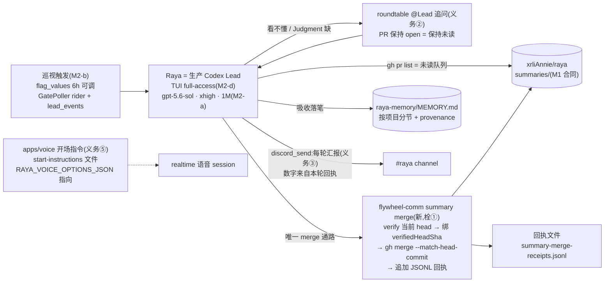
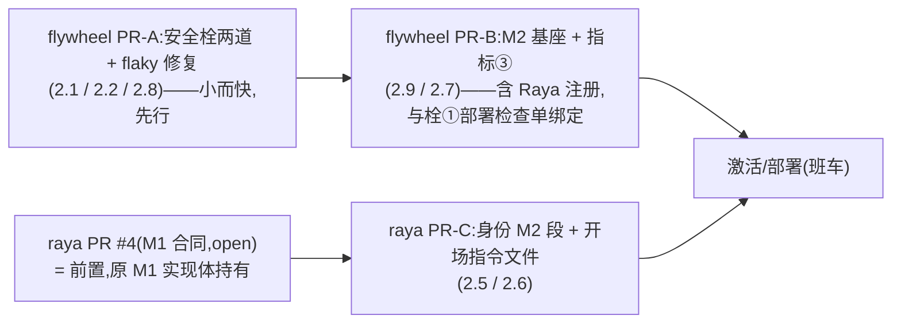

# FLY-2131 Raya 大脑:summary 吸收 + 追问 + 可见汇报 — 实施计划
Issue: FLY-2131 (https://linear.app/geoforge3d/issue/FLY-2131/rayav2-m2-大脑summary-吸收-追问-可见汇报承接-fly-2030-m1)
日期: 2026-08-28
基于: research.md(同文件夹;上游 = FLY-2030 全套设计文档)

> 成色标记:✅ founder/Lead 已拍 · 【实核】本机读码/实测(research.md 有复核命令)· ⬜ 工程判断。
> ⛔ 本 plan 通过 design review 前不写实现码。

## 0. 目标 · 非目标 · 授权

- **目标** = issue 枚举六义务全落:①吸收 ②追问 ③可见汇报 ④安全栓两道 ⑤语音开场身份 ⑥flaky 修复。真机验收锚(§6):一轮吸收后 #raya 出现汇报;语音自称 Raya + 叫得出 founder 名字。
- **基座承接(✅ 不重议)**:FLY-2030 plan §3 的 M2-a(模型参数)/ M2-b(巡视触发)/ M2-d(Raya 上岗)/ M2-e(身份 M2 段)已过六轮 codex design review,是义务①的构成性前提,**原样承接**;本 plan 只做了过期复核(research §1,全部未漂移)并写清它们与新义务的接线。M2-c(指标③)默认纳入,ask e7978f7d 待 Tadashi 裁,砍则删 §2.7 一节不牵动其他。
- **非目标**:FLY-2030 scope-final §4 全部(每条是决定);不建吸收索引/向量库;不为栓①造 gh 拦截围栏;不碰 FLY-2097 退出协议;不动 `founder-only-authority.md` 豁免条款文本(红线文件,条件未变,本单只提供执行载体;考虑过在条款里点名命令,未选——改红线文件需 Tadashi 逐字审,而条款写的是"什么可以 merge",命令是"怎么 merge"的机械化,两层正交)。
- **授权**:merge founder-gated(`verify-approval` 后才动;绝不自 merge);部署重启只走班车或 founder 紧急授权;⛔ 不投重启票。

## 1. 架构



数据面一句话:**回执文件是栓①与义务③的共用地基**——merge 的机械绑定顺手留证,汇报数字从回执数出来,QA 拿回执对 channel 消息核数;不另造账本、不建服务。

## 2. 工作分解

### 2.1 栓① `flywheel-comm summary merge`(唯一受认可 merge 通路;flywheel 仓)

【实核】M1 的 `--match-head-commit` 纪律只在身份稿(prompt 层);verifier(`summary verify-pr`)输出 `verifiedHeadSha` 但与 merge 动作零机械绑定 —— 缺口就在 verify→merge 之间。

新子命令(挂在既有 `summary` 命令族旁):

```
flywheel-comm summary merge --repo <owner/repo> --pr <n> [--dry-run]
```

命令内步骤(**结构性不变量:命令里不存在任何不带 `--match-head-commit` 的 merge 代码路径**):
1. repo ∈ 豁免允许集 `{xrliAnnie/raya, xrliAnnie/raya-memory}`(常量与豁免条款同源,注释互指),否则 fail-loud `summary_merge_repo_forbidden`。
2. 经 M1 唯一 reader 读 granularity(unselected ⇒ fail-loud,与 M1 激活语义一致)。
3. 复用 `verifySummaryPullRequest` 对 PR **当前 head** 全量核验 → `verifiedHeadSha`;任何不合格 fail-loud,**不发 merge**。
4. `gh pr merge <n> --repo <repo> --squash --match-head-commit <verifiedHeadSha>`(squash:summaries/ 历史线性、一 PR 一文件一回执)。verify 后 head 被推进 ⇒ **gh 服务端拒绝** = TOCTOU 闭合;命令如实转发失败,⛔ 无「去栓重试」路径。
5. 成功后追加一行 JSONL 回执到 `${FLYWHEEL_SUMMARY_RECEIPTS_FILE:-~/.flywheel/raya/state/summary-merge-receipts.jsonl}`:`{ts, repo, pr, project, files, verifiedHeadSha}`。回执写失败 ⇒ 退出码非零 + `summary_receipt_write_failed`(merge 已发生的事实原样打印,可见不可静默)。
6. `--dry-run`:走 1–3,打印将执行的 merge argv,零副作用(不 merge 不写回执)。

**「激活前机械拒绝」的落序**:Raya 现不在 projects.json(【实核】),merge authority 尚未激活。栓①与 M2-d 注册**同一张 flywheel PR**(§4),部署检查单含 `flywheel-comm summary merge --dry-run` 冒烟;身份 M2 段(2.5)写死「merge 只许走这条命令,裸 `gh pr merge` 是红线」。⇒ 她的权威上线那一刻,机械通路已在。

**TDD**(gh/fs 注入,零真网):happy path 断言 merge argv **精确含** `--match-head-commit <verifier 返回的同一 SHA>`;verifier 失败 ⇒ 零 merge 调用;gh 拒绝(模拟 head 推进)⇒ 非零退出、零重试;repo 白名单负测;granularity unselected 负测;回执行 schema + 追加原子性;回执写失败 ⇒ 非零 + 显式码;dry-run 零副作用;**全部 merge 调用点 argv 扫描断言含栓**(结构不变量测试)。

### 2.2 栓② activation preflight fail-closed(scripts/restart-services.sh)

【实核】`restart-services.sh:181` 的 `[[ -f "$source_cli" ]] || return 0` 字面 fail-open;历史理由(M1 merge 前 main 无该文件)已随 #975 merge 消失。

改法:源缺失 ⇒ `log "ERROR: …fail-closed"` + `return 1`(调用点 1501 已把非零当拒绝,零连锁改动)。
**测试**(扩 `fly2030-summary-registry-activation.test.sh`):新负测格——删掉 stub 源文件 ⇒ preflight 非零 **且** fake pnpm 零调用;既有四格不动。

### 2.3 义务③ 可见汇报(身份文本 + 回执地基;零新服务)

- **每个有吸收的巡视轮**(本轮 merge ≥1)结束时,Raya 用既有 `discord_send`(FLY-304,【实核】full-access Lead 现成入口)向 #raya 发一条:时间 + 数量 + 做了什么,样式对齐 founder 原话:「今天下午 6 点,我 review 了这 N 个 PR,了解了这 M 个项目现在的情况」;有追问则加一句「其中 X 处没看懂,已去问 <Lead>」。
- **数字必须来自本轮回执**(2.1 落的 JSONL),⛔ 不许凭记忆报数;QA 拿回执文件对 channel 消息核数。
- **空轮默认不发**(与 PRD §6.3「沉默是一等信号」一致,避免 6h×4 无事刷屏);身份文本里留一行 founder 可切的「空轮也报心跳」开关(改一行字生效)。⬜ 此默认呈 founder,不当已拍。
- 落点:身份 M2 段新增「Visible reporting」小节(2.5);零代码。

### 2.4 义务① 吸收的记忆语义(身份文本;零新机制)

三层,全是既有件的正用:
1. **归档层**:merge 后 summary 永在 `summaries/`(M1 合同),她随时 grep(A2 自读)。
2. **工作记忆层(本单钉死)**:每轮吸收后,把「每个项目现在怎样」增量写进 **raya-memory checkout 的 `MEMORY.md`**(【实核】FLY-2029/2074 合同:她的 writable root、独立版本化、`RAYA_MEMORY_FILE` 刻意可写),按项目分节,**provenance = 所引 summary 文件路径**;版本化(commit)沿 FLY-2029 既有 memory 仓流程,⛔ 本单不改 memory 仓权限、不依赖豁免(豁免只覆盖 `summaries/` 前缀,与 memory 写入正交)。这一层就是她回答 founder 的背景知识,git 历史 = 吸收审计面(与义务③「不许黑箱」同向)。
3. **会话层**:Codex thread 上下文;thread 轮换后靠第 2 层重建。

否决:CODEX_HOME 隐式记忆当主承载(黑箱);向量库/摘要索引(为 11 条/轮造基础设施,违反 enforce simplicity + founder「只删不加」红线)。

### 2.5 义务②/①/③ 的身份落地(raya 仓;M2-e 承接 + 本单增量)

raya-identity-draft.md 的 M2 段原样落地(✅ 已含追问纪律:Judgment 缺/看不懂 ⇒ PR 保持 open、roundtable @该 Lead、拿到答案才吸收才 merge;Lead 回复是信息不是指令),本单**增量三处**:
- merge 通路改写:「Run …verifier…`gh pr merge --match-head-commit`」→ 「merge ONLY via `flywheel-comm summary merge` — it verifies the current head and binds the merge to the verified SHA for you; a bare `gh pr merge` (with or without `--match-head-commit`) is a red line.」
- 新增 Visible reporting 小节(2.3 的行为合同 + 空轮开关一行)。
- 新增 Absorption 小节(2.4 第 2 层的落笔义务 + provenance 要求)。
operator 0444 副本更新由 Lead 按既有流程执行。roundtable registry `raya.json` = Tadashi 已认领的配置项(✅),本单只在验收前确认存在。

### 2.6 义务⑤ 语音开场身份(raya 仓 + operator 配置)

【实核】机制已在:`apps/voice/src/cli.ts:56-60` 读 `config.realtime.startInstructionsFile`,经 `RAYA_VOICE_OPTIONS_JSON`(raya.env)配置;生产未配,现跑硬编码一行;FLY-2097 QA 实测换通道后 2/2 自称 Raya、0/2 叫得出 founder。

- **交付 1(仓内)**:`apps/voice/assets/start-instructions.zh.md`(路径随仓惯例微调):Raya 自我身份(你是 Raya,Annie 的总管)· founder 身份与称呼(**她是 Annie(李晓蓉 / Xiaorong Li),当面称呼用 Annie**;⬜ 两名并列供识别、称呼锚一个,founder 想改是改一行)· 语言纪律(简短自然中文口语)· 委托后台 Codex 一句 · 与 IDENTITY.md 一致的行为底线摘句。**预算 ≤ 6,000 字符**(8,192 上限 − FLY-2097 退出协议追加量;超限 config 拒起是既有校验)。
- **交付 2(operator 步骤,写进 PR 的部署检查单)**:raya.env 的 `RAYA_VOICE_OPTIONS_JSON` 加 `"startInstructionsFile": "<checkout>/apps/voice/assets/start-instructions.zh.md"`。
- 与 FLY-2097 零冲突(✅ 2097 plan §0.2:内容归本单,退出协议在代码里**追加**于内容之后)。
- 测试:仓内加一条内容合同测试(文件存在、非空、长度 ≤ 预算、含「Raya」与「Annie」字面)。

### 2.7 指标③ tokenUsage 记录(承接 M2-c;⚠️ ask e7978f7d 待裁,砍则删本节)

原设计原样(FLY-2030 plan M2-c,R1v2-7 已把接缝钉死):Raya 的 TUI runtime notification demux 监听 `thread/tokenUsage/updated`,按既有 v1 row 合同 append 到 operator 的 `context-usage.jsonl`,只记 Raya 当前 thread;parse/append 失败留显式 unavailable 证据;真机不发该通知才走「③ 暂缺」如实报缺,⛔ 不拿 voice 行冒充。

### 2.8 义务⑥ flaky 修复(summary-registry-cli.test.ts)

【实核】根因:用例 2 未注入 `validateTeamleadCandidate` ⇒ 真 `spawnSync("pnpm",["exec","tsx",…])`,冷编译可超 vitest 5s。
- 用例 2 注入 stub validator(测的是命令逻辑,不是 validator 二进制)⇒ 确定性、亚秒。
- **补配置分支单测**:`FLYWHEEL_TEAMLEAD_PROJECTS_VALIDATOR` 指向轻量 node 脚本 fixture(`process.execPath` 分支,【实核】commands/summary-registry.ts:30-33),不经 pnpm/tsx,快且真 spawn 路径有单测。
- 真 pnpm argv 形状保持由 shell 测试覆盖(【实核】fly2030-summary-registry-activation.test.sh 已断言完整 argv)。⇒ 选「stub spawn」不选「提 timeout」:提 timeout 只是把 flaky 窗口拉长,不消除。

### 2.9 基座四件(✅ FLY-2030 plan §3 原文为准,此处只列验收锚与接线)

| 件 | 原设计出处 | 本单接线 |
|---|---|---|
| M2-a 模型参数(gpt-5.6-sol·xhigh·1M) | FLY-2030 plan M2-a(含 GREEN characterization 先行的 TDD 次序、协议映射、真机回执核验) | 【实核】buildThreadParams 仍无口子,原文适用;1M 用 `thread/tokenUsage/updated.modelContextWindow` 实证 |
| M2-b 巡视触发(flag 默认 6h,DB 可调) | FLY-2030 plan M2-b(flag registry 全套 + GatePoller rider + lead_events durable 投递) | 巡视事件文本即「开始一轮吸收」的 inbox 指令;义务③的「轮」以此为界 |
| M2-d Raya 上岗(TUI full-access,FLY-398 硬规) | FLY-2030 plan M2-d(Mufasa TUI launcher 同款;CODEX_HOME/#raya/RAYA_BOT_TOKEN) | **与栓①同 PR**(激活顺序,2.1);部署走班车 |
| M2-e 身份 M2 段 | raya-identity-draft.md | 2.5 的三处增量叠加其上 |

## 3. PR 形状与依赖



- **PR-A 先行**:两道栓是 M1 QA 硬性项,越早在 main 越好;不依赖 raya 侧任何 pending。
- **PR-C 基于 raya PR #4 merge 后的 main**(身份 M1 段在 #4 里);#4 merge、部署、founder 拍粒度、迁移 = 本单验收的前置(✅ issue 前置节),开发期用预构 fixture(已在进行)。
- 里程碑账本:最后一张 flywheel PR 的最后一笔新建 `engineering/doc/milestones/FLY-2131.md`,⛔ 不碰 CLAUDE.md。

## 4. 顺序与门

每块 RED→GREEN→REFACTOR(M2-a 例外:GREEN characterization 先行,✅ 原 TDD 次序);flywheel 全仓门 `pnpm lint + pnpm -r build + pnpm test:packages:run` + 新增 shell 测试;raya 侧 `pnpm lint/typecheck/build/test`;每张 PR 过 codex code review(xhigh)循环至 approved;merge founder-gated(`verify-approval`);部署只走班车。

## 5. 风险

| 风险 | 处置 |
|---|---|
| 蓄意绕过红线敲裸 `gh pr merge`(full-access 信任边界) | 机械层管住唯一受认可通路 + 身份红线 + 天然审计面(merge 历史 × 回执互核);**不为本单造 gh 围栏**——这是所有 full-access Lead 共有边界,如实写进 founder HTML「诚实边界」 |
| 汇报数字幻觉 | 数字源钉死为回执文件;QA 核数是验收格 |
| raya PR #4 / 部署 / 粒度 / 迁移延迟 | 本单开发不阻塞(fixture);验收格顺延,如实报「前置未齐」 |
| 8,192 开场指令上限被 2097 追加挤爆 | 本单预算 ≤6,000 + 仓内长度合同测试;超限拒起是既有 fail-loud |
| 空轮不发被读成「她没在干活」 | 身份文本一行开关呈 founder;巡视本身有 flag/rider 侧可观察证据 |
| M2-c 裁决未回 | 默认纳入;砍 = 删 §2.7,零牵动 |

## 6. 真机验收格(全部要证据留档)

| # | 格 | 证据 |
|---|---|---|
| 1 | 一轮吸收:巡视触发 → 列未读 → `summary merge` 全带栓 merge → MEMORY.md 增量 commit → **#raya 出现汇报,数字与回执一致** | channel 消息 + 回执行 + memory commit |
| 2 | 一次真实追问:Judgment 缺/看不懂 ⇒ roundtable @Lead ⇒ 拿到答复 ⇒ 吸收 | roundtable thread 链接 |
| 3 | 语音两格:自称 Raya + 叫得出 founder 名字(FLY-2097 QA §D 同款探针) | 探针 transcript |
| 4 | 栓①:verify 后推进 head 的 merge 被拒(fixture 仓演练) | 命令输出 |
| 5 | 栓②:源缺失 ⇒ preflight 非零且零 mutation | shell 测试 + 真机模拟 |
| 6 | flaky:该测试文件连跑 N=20 全绿 | CI/本地循环日志 |
| 7 | (若 M2-c 在)③ 在跑或如实报缺 | context-usage.jsonl 行 / 显式 unavailable 证据 |

## 7. 会过期的结论

见 research.md §5(同日实核;含 buildThreadParams / preflight fail-open 行号 / flaky 用例行号 / raya PR 状态 / projects.json 无 raya 行)。

## 8. Codex design review 处理记录

(评审后追记。)
