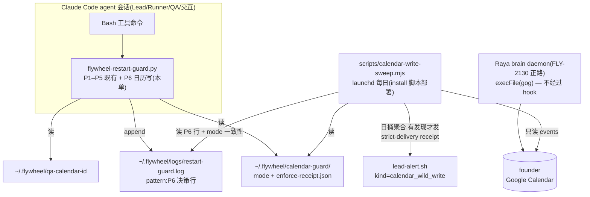

# FLY-2137 founder 日历写入权治理 — 实施计划
Issue: FLY-2137 (https://linear.app/geoforge3d/issue/FLY-2137/治理-founder-的-google-calendar-写入权必须定规矩qa-期间实测第二条未授权写入路agent-自建假会议邮件提醒)
日期: 2026-08-31
基于: research.md

## 0. 目标与成功条件(定性:行为护栏,不是对抗性授权边界)

本单交付三层治理:**Claude 会话面的 CLI 行为护栏(P6)+ 全量审计 + 每日只读检测**,
外加一份 founder 批准的成文规矩。**明确不宣称「唯一写入方已被机器强制」**——机器全局凭据
(gog Keychain / gws credentials.enc)未隔离前,任何同用户进程仍具备事实写能力(§4.4)。
真正的授权边界 = 凭据隔离,本单关闭前必须开出独立 Linear issue 并在 FLY-2137 里挂链,
该 issue 未落地前「唯一写入方」治理目标不算关闭(只算「规矩已立 + 护栏已上 + 检测在跑」)。

成功条件:

1. P6 护栏按真实 CLI grammar 拦截 Claude 会话内 `gog calendar`/`gws calendar` 写方法
   (未知新方法 fail-closed),读方法零误伤,`gws` 非 calendar 服务零误伤;
2. **先 audit 后 enforce**(Lead 硬边界②):合入即 audit(只记账);founder 在规矩草案上
   二选一并留 durable receipt 后才 enforce;enforce 后 mode 状态损坏 = **fail-closed deny**;
3. **v1 无 ACK 特批通道**:agent 会话内不存在任何可自声明的写 primary 旁路;founder 本人
   用普通终端/界面,QA 用测试日历,确有例外需求时由 Lead 回到本规矩公开改名单;
4. 每日 sweep:founder 时区日桶,**≤1 条/天且不丢**(durable receipt + crash/轮转安全),
   零发现零输出(Lead 硬边界①);
5. **不误伤已 ship 功能**(Lead 硬边界③):授权面逐个列名(§1);QA 回归证明 FLY-2130
   排会在 enforce 下仍正常写(§6);
6. 护栏/告警/清扫全链路测试绿,Flywheel full-repo gates 绿(含 kind-contract 启动校验)。

## 1. 规矩草案(founder 批准面,呈现于本单 founder HTML)

**授权写入方显式列名**(Lead 硬边界③):

| 写入方 | 路径 | 标记/审计 | 状态 |
|---|---|---|---|
| Raya 排会同步(FLY-2130) | `com.xrli.raya.brain.plist` daemon → `execFile(gog)` | `raya_meeting_id` private prop + `calendar.json` receipt + 事件审计 | ✅ 唯一授权的**自动**写入方 |
| 会议纪要链路(meeting-notes) | skill + `meeting-notes-scheduler.ts` | — | 本单实审:**零 calendar 引用,不写日历**,列名存档 |
| founder 本人 | Google UI / 本人终端 | — | 不受治理(护栏只装在 Claude 会话) |
| 其他一切 agent | Claude 会话 Bash | 护栏 P6 全量记账 | ❌ 禁止(enforce 后 deny;QA 走测试日历;**无 ACK 旁路**) |

新增写入方 = 回到本名单公开加名 + founder 批准,不允许静默扩权。

**founder 二选一**:【audit 只记账】/【enforce 开拦】。批准动作与状态存储:

- Lead 将批准落为 durable receipt:`~/.flywheel/calendar-guard/enforce-receipt.json`
  `{schemaVersion:1, approvedBy:"founder", discordMsgId, approvedAt, decision:"enforce"}`
  (0600,一次写入,永不删除);同时写 mode 文件 `~/.flywheel/calendar-guard/mode`
  首 token `enforce`(注释附 msg id);
- **护栏读取语义(fail-closed)**:receipt 不存在 → audit(rollout 期);receipt 存在且
  mode 首 token=`enforce` → enforce;receipt 存在且 mode 首 token=`audit`(显式授权回滚,
  同样附 msg id)→ audit;receipt 存在但 mode **缺失/损坏/其他值 → 一律 deny**
  (config-error 文案,审计行 `note:mode_invalid_with_receipt`)——enforce 批准后不存在
  「误删文件静默回 audit」;
- 回滚 = founder 授权后显式把 mode 写回 `audit`(留痕),不是删文件;
- **mode 状态变化的报告语义(统一规则,R2 #4)**:sweep 持久化 `lastObservedMode`
  (+授权 msg id);**每一次 enforce→audit transition(含 founder 授权的回滚)都作为
  finding 聚合报告恰好一次**(附授权 msg id,有则注明「授权回滚」,无则标「未授权降级」);
  持续处于 audit 不重复报;receipt 在而 mode invalid 的 fail-closed 状态每日报告直至修复。

## 2. 架构



## 3. 改动清单

| # | 文件 | 改动 |
|---|---|---|
| 1 | `scripts/hooks/flywheel-restart-guard.py` | P6:grammar 解析 + 读方法 allowlist + mode/receipt 语义 + QA 豁免 target-set 提取(§4) |
| 2 | `scripts/hooks/test-flywheel-restart-guard.py` | P6 测试套(§7 RED 1/2) |
| 3 | `scripts/lead-alert.sh` | kind 白名单 + usage 注释加 `calendar_wild_write` |
| 4 | `packages/teamlead/src/LeadAlertNotifier.ts` | `ALERT_EVENT_TYPES` 加 `calendar_wild_write` |
| 5 | `packages/teamlead/src/bridge/alert-kind-copy.ts` | `titleFor/bodyFor`;severity=warning |
| 6 | `packages/teamlead/src/bridge/kind-contract.ts` | 新 kind 的 `KindContract`:**owner=`claude`(现有 `KindOwner` literal;路由后果=工单归 Claude infra bot,由其按 remediation ref 升级到 eng Lead/founder 裁决 —— R2 #5,不新增 owner 类型)**、posture=`none_escalate`(每日聚合、无自动修复动作),remediation 指向本文件夹 |
| 7 | `packages/teamlead/src/bridge/__tests__/kind-contract.test.ts` + `alert-kind-copy` 测试 | 新 kind 双面(shell↔TS)一致性断言 + title/body/severity 固定 |
| 8 | `scripts/calendar-write-sweep.mjs`(新) | 检测 sweep(§5) |
| 9 | `scripts/com.flywheel.calendar-sweep.plist.template`(新) | 模板(占位:repo/home/node/日志路径) |
| 10 | `scripts/install-calendar-sweep.sh`(新) | render/install/uninstall 合同(§6 步 8;照 `install-log-janitor.sh` 先例:`plutil -lint`、渲染校验、稳定路径、bootout 回滚),CI/QA 不自动装 |
| 11 | `scripts/__tests__/test-calendar-write-sweep.test.sh`(新) | PATH stub gog 的 sweep 测试(§7 RED 3) |
| 12 | `scripts/__tests__/test-install-calendar-sweep.test.sh`(新) | installer 渲染/lint/幂等测试 |
| 13 | `CLAUDE.md` Non-Negotiables | 一行:founder 日历治理规矩 + 指向本文件夹 |

新 alert kind 仅 **1 个**(`calendar_wild_write`)。v1 无 ACK ⇒ 无 `calendar_guard_bypass` kind。
不动 Raya repo;不改 installer/settings/converge(#1 同文件更新,注册面零新增)。

## 4. P6 护栏规格

### 4.1 匹配:按真实 CLI grammar 解析,不做 bag-of-tokens 共现

对每个 segment(复用既有 segment 切分/wrapper 剥离/`bash -c` 一层重扫;grep/rg 只读段
永不供给判定,沿用 `_non_read_segments` 纪律):

1. 剥 wrapper/env 赋值后,首 token basename 必须是 `gog` 或 `gws`,否则本 segment 不进 P6;
2. **gog**:按已知 global flags(`--account/-a --client --enable-commands --color --select
   --fields --json/-j --plain/-p --results-only --dry-run/-n --force/-y --no-input --verbose/-v`,
   区分带值/不带值,支持 `=` 与空格两种形态)剥离后,第一 positional = service。
   service ∉ {`calendar`,`cal`} → 不在 P6 范围。第二 positional = method:
   - **读方法 allowlist**(不拦):`calendars acl permissions perms events list ls event get
     info show search find query freebusy conflicts colors time users team propose-time`;
   - allowlist 之外的**一切** method(含 `create add new update edit set delete rm del remove
     respond rsvp reply focus-time focus out-of-office ooo working-location wl` 与任何未知/
     新增方法)→ 写候选,fail-closed 进决策流;
3. **gws**:同法剥全局 flags(`--sanitize --dry-run --format`,以及 **`--api-version` 带值
   flag 的 `=`/空格两形态** —— R2 #1)后第一 positional = service,并做规范化:
   `calendar` 与 **`calendar:<version>`(严格版本语法 `^calendar:v\d+$`,如 `calendar:v3`)**
   都规范化为 Calendar service(R2 #1 实测 `gws calendar:v3 events insert` 是同一 API 的
   合法直写形态);其他 `<service>` 或 `<service>:<version>` → 不在 P6 范围
   (**顶级 `gws events …` 是 Workspace Events 独立服务,不拦** —— R1 #2 修正);
   Calendar service 的第二 positional = resource/helper:
   - 读 allowlist:`+agenda`,`events list|get|instances`,`calendarList list|get`,
     `calendars get`,`acl list`,`colors get`,`freebusy query`,`settings list|get`;
   - 其余一切(`+insert`、`events insert|update|patch|delete|quickAdd|import|move|watch`、
     `calendars insert|update|patch|delete|clear|transferOwnership`、`calendarList` 写、
     `acl insert|update|patch|delete`、`channels stop`、未知方法)→ 写候选;
4. **只读 introspection 放行**(R2 #1:与「读方法零误伤」一致):segment 含 `-h`/`--help`/
   `--version` token,或 method/子命令为 `help`,按读放行 —— gog(kong)与 gws(clap)的
   help/version 均为短路打印后退出、不执行任何 mutation,实现时以两 CLI 的实测行为为准并在
   测试固定(`gog calendar create --help`、`gws calendar help`、`gog --version` 均不拦);
5. `--dry-run` 不豁免;其余解析歧义(flag 形态异常、positional 缺失)一律按写候选 fail-closed。

### 4.2 QA 测试日历豁免:per-form target-set 提取器

豁免前提:`~/.flywheel/qa-calendar-id` 存在且内容通过格式校验
(`^[A-Za-z0-9._-]+@group\.calendar\.google\.com$`;显式拒绝 `primary`、拒绝含 `@gmail.com`/
`@u.northwestern.edu` 等邮箱形态)。然后按**写形态逐个定义**受影响 calendar 集合:

| 写形态 | target 集合 |
|---|---|
| `gog … create/update/delete/respond <calendarId> …` | 该 positional |
| `gog focus-time/ooo/wl [--flags] [<calendarId>]` | positional;**省略 = primary = 不豁免** |
| `gws calendar +insert [--calendar <id>]` | `--calendar` 值;省略 = primary = 不豁免 |
| `gws calendar events insert/update/patch/delete/quickAdd --params <json>` | JSON 严格解析出 `calendarId`;解析失败/缺失 = 不豁免 |
| `gws calendar events move --params <json>` | `calendarId` **与** `destination` 两者 |
| `calendars/calendarList/acl/import/clear/transferOwnership/watch` 等 | **无提取器 = 永不豁免** |

放行条件:target 集合非空且**每个成员**逐字 == QA id。放行仍写审计行
(`decision:allow, note:qa_calendar`)。QA id 出现在 summary/body 等非 target 位置不构成豁免。

### 4.3 决策流(main() 中 pattern == "P6" 分支)

```
hit(P6 写候选)
 ├─ QA 豁免成立(§4.2) → audit_write(allow, qa_calendar, mode) → allow
 ├─ receipt 不存在(rollout 期,mode 视为 audit)
 │    → audit_write(would_deny, mode:audit) → allow(不发即时告警,进每日聚合)
 ├─ receipt 存在 ∧ mode=audit(显式授权回滚) → 同上 would_deny + allow
 ├─ receipt 存在 ∧ mode=enforce → audit_write(deny) best-effort → deny(CAL_DENY 文案)
 └─ receipt 存在 ∧ mode 缺失/损坏/其他 → audit_write(deny, mode_invalid_with_receipt)
      → deny(CAL_CONFIG_ERROR 文案)
```

- **无 ACK 分支**(R1 #3):`FLYWHEEL_RESTART_GUARD_BYPASS` 对 P6 无效,P6 也不新增任何
  bypass env;P1–P5 行为逐字节不变;
- P6 审计行字段:`mode`、`cli`、`service`、`method`、`targets[]`(提取不出记 `unknown`);
- CAL_DENY 文案(中文)讲清:规矩出处 FLY-2137、唯一授权自动写入方 = Raya、QA 用测试日历、
  例外需 Lead 回名单公开申请、读操作不受限;CAL_CONFIG_ERROR 文案指引修复 mode 文件;
- 判定路径 fail-open / hit 后 fail-closed 的既有总纲不变。

### 4.4 诚实边界(护栏定性,R1 #1)

P6 是 **Claude Code 直接 CLI 行为护栏**,不是对抗性安全边界。不覆盖:agent 把命令写进脚本
再执行、Codex/Gemini 直连 shell、直接读机器凭据调 API。实测事件路径(qa-lead-B,Claude
会话直接 CLI)在覆盖内。检测层(§5)对绕过形态只有启发式发现能力(无关键词则不可见)。
**根治 = 凭据隔离**(Raya 持独立写凭据,agent 上下文不可读):本单实现节点开工时必须开出
独立 Linear issue 并在 FLY-2137/名单文档挂链;founder HTML 如实呈现此边界(不写「唯一写入
方已被机器强制」)。

## 5. 检测 sweep 规格(`scripts/calendar-write-sweep.mjs`)

**输入**:`gog --account personal --json calendar events primary --from <now-7d> --to <now+90d>
--all-pages --fields "items(id,summary,created,updated,creator,extendedProperties,reminders)"`
(account/calendar/窗口 env 可覆写;env 处理照抄 `daily-digest.sh` snapshot/restore 模式)。

**发现类型**(任一非空才发告警):

1. 嫌疑事件:无 `extendedProperties.private.raya_meeting_id` ∧ `created|updated` 晚于事件游标
   ∧ 关键词命中(`FLY-\d+|GEO-\d+|flywheel|raya|discord\.com/channels|QA|验收|测试|Tadashi`,
   常量表);
2. 护栏账本摘要:自 log 游标以来的 P6 行计数(would_deny/deny/qa_calendar,按 mode 分组);
3. **mode transition**(与 §1 统一规则一致):每次 enforce→audit transition(含授权回滚,
   附 msg id)恰好报一次;receipt 在而 mode invalid 的 fail-closed 状态每日报直至修复;
   持续 audit 不重复报(靠 `lastObservedMode` 判 transition)。

**Durable delivery / state 合同(R1 #4)**:

- 单写者:`daily-digest.sh` 同款 atomic `mkdir` lock;拿不到锁即退出;
- 日桶:`America/Los_Angeles` 的 `YYYY-MM-DD`;告警 `--signature calendar-sweep-<PT日期>`
  + 固定 `--lead/--project` ⇒ 同一 PT 日只可能存在一个 eventId;
- **状态机(R2 #2 修正,显式转移规则)**:
  1. run 开始:拿 `mkdir` 锁 → 若 `pendingOutbox.dayBucket ≠ 今日` → **re-bucket**:把旧
     outbox findings 并入今日 snapshot,废弃旧 eventId(它从未取得 receipt = 从未投出,
     并入后今日仍只投一次);
  2. 扫描 + 聚合今日 snapshot(事件嫌疑 + P6 账本摘要 + mode transition + quarantine);
  3. **今日已有 `dayReceipt`**:不发送、不复用旧 receipt、不推进新 finding 之前的游标;
     新 finding 留在 pendingOutbox(明日 re-bucket 后必达 —— 同日第二条宁可延到明日,
     保「≤1 条/天」硬约束);
  4. 今日无 `dayReceipt` 且 snapshot 非空:原子写 outbox → `lead-alert.sh
     --strict-delivery`;**仅 `sent|queued_transient` 算 receipt**;拿到 receipt 才原子推进
     事件游标 + log 游标 + 记 `dayReceipt`;失败(`config_error/dead_lettered/unknown`)
     保留 outbox 与游标、非零退出,同日重跑重试**同一** snapshot/eventId;
  5. **snapshot 为空(完整成功扫描零发现)**:不发送、无 receipt,**本地原子推进两个游标**
     (state 写入即 checkpoint,R2 #2:零发现不能永不 checkpoint);
- state:`~/.flywheel/state/calendar-sweep.json`
  `{schemaVersion:2, dayBucket, dayReceipt, pendingOutbox, eventCursorISO,
    logCursor:{dev,ino,offset}, lastObservedMode, quarantine[], reportedEventIds[≤500 FIFO]}`,
  原子写(temp+rename),0600;
- **日志轮转安全**:logCursor 记 `(dev,ino,offset)`;identity 不匹配时回扫 retained
  generations(`.1`–`.3`)中 identity 匹配的文件读完余量,再从新文件 0 起,按行内 `ts` 去重;
  找不到旧 identity 则从新文件 0 起并在报告中标注 `log_rotation_gap`(fail-loud 不静默);
- **坏 JSONL 合同(R2 #3,可收敛,不 livelock)**:坏行以 `(sha256, 文件 identity, offset,
  发现时间)` 写入 state `quarantine`(durable),并把 `audit_log_parse_error`(计数+样本
  hash)作为**聚合 finding** 进当日 snapshot;该日聚合取得 receipt 后 log 游标**越过坏行**
  继续(quarantine 保留证据,坏行只报一次);坏行之后的有效 P6 行照常聚合;
- fail-loud 定义:gog 非零/超时/JSON 损坏、state 损坏(rename 为 `.corrupt-<ts>` 后重建)
  → stderr + 非零退出,不发半成品告警;
- **report-only**:绝不 create/update/delete;gog 调用固定为上述唯一只读形态;
- body 截断 1500 字符,超出「+N more, see log」。

## 6. 部署与 QA 时序(R1 #6 重排:负测试永不触达真 primary)

1. PR 合入 main;
2. converge:Lead 跑 installer(或下次 Lead 启动自动 converge),**记录部署 hash 证据**
   (`sha256(~/.flywheel/bin/flywheel-restart-guard.py) == sha256(repo source)`)+
   `~/.claude/settings.json` PreToolUse 注册仍指向该路径;
3. audit smoke(不碰真 gog):直接以 hook stdin 合同喂 P6 命中样例(或 PATH no-op `gog`
   stub),验证 `would_deny` 行落账 —— **护栏部署证据先于 founder 决策**;
4. Lead 建 QA 测试日历(非 primary),id 写 `~/.flywheel/qa-calendar-id`,只读验证 id 可查;
5. 向 founder 呈现规矩草案(本单 HTML);founder 二选一;选 enforce 则 Lead 写
   `enforce-receipt.json` + mode 文件(receipt 落库即为批准证据);
6. enforce 验证(QA node 硬证据,全程不触达真 primary):
   a. deny 演练用 **PATH no-op stub** 或指向**确认不存在的 calendarId**:hook 层 deny +
      审计行落盘(失败分支也只会打到 stub/不存在目标);
   b. QA 日历豁免:同形命令指向 QA id → 放行 + `qa_calendar` 落账,事件真实创建后清理;
   c. mode fail-closed:临时移走 mode 文件(receipt 在)→ deny + `mode_invalid_with_receipt`,
      恢复后正常;
   d. **FLY-2130 正路回归**(Lead 硬边界③):真机触发 Raya 排会(明确授权的测试会议),
      事件带 `raya_meeting_id` 创建成功,再走 Raya 取消路径验证清理 —— 结构性隔离
      (hook 层 vs daemon 层)必须实测证实,不接受「结构上测不到」免测;
7. sweep 上线:Lead/founder 在部署窗口跑 `install-calendar-sweep.sh`(渲染+lint+bootstrap
   +`launchctl print` 校验 ProgramArguments)+ 一次手工 smoke;回滚 = 同脚本 uninstall;
8. 回滚边界:mode 显式写回 audit(founder 授权,留痕)/ sweep uninstall / 护栏代码回滚 =
   installer 重放旧版。三者独立。

## Ship 段:PR 登记铁律(Lead 指令 024a555e,FLY-2031/FLY-2203 教训)

本单当前设计的**全部代码改动都在 flywheel 主仓**(§3),预期单一 flywheel PR,无外部仓
伴生 PR。**若实现期间发现任何改动必须落在外部仓(如 raya)**,则以下三条逐字适用:

1. implement 开工时先在 flywheel 主仓开 docs/进度锚 PR(分支 = 本单 flywheel 分支);
2. 会话 PR 登记(`complete --pr`)**必须用 flywheel 锚 PR 号,绝不登记外部仓 PR 号**
   ——登记错仓 = ship 卡永久死锁且事后修不了(FLY-2203);
3. 外部仓 PR 在锚 PR body 里列为伴生,merge 需 founder 单独授权。

## 7. TDD 顺序

### RED 1 — P6 grammar 矩阵(`test-flywheel-restart-guard.py` 追加)
gog:写方法全集(含别名)hit;未知新方法 hit(fail-closed);读方法全集不 hit;
`gog gmail …` 不 hit;flag `=`/空格两形态;`--dry-run` 仍 hit。
gws:`gws calendar +insert`/`events insert`/`calendars transferOwnership`/`acl insert` hit;
**`gws calendar:v3 events insert|update|delete` hit;`--api-version v3` 形态 hit**(R2 #1);
非 Calendar 的 `<service>:<version>` 不 hit;**顶级 `gws events insert` 不 hit**;
`gws gmail/drive` 不 hit;读 allowlist 不 hit。
introspection:`gog calendar create --help`、`gws calendar help`、`gog --version`、
`gws --help` 均不 hit(R2 #1)。
通用:wrapper(`env`/`sudo`)与 `bash -c` 包裹仍 hit;`grep "gog calendar create"` 不 hit。
### GREEN 1 — grammar 解析 + allowlist 实现。
### RED 2 — 决策流与豁免
receipt 缺失 → would_deny+allow;receipt+enforce → deny;receipt+mode 缺失/损坏 → deny
(config error);receipt+显式 audit → would_deny+allow;QA 豁免:target 全等放行、
省略 calendar 不豁免、`--params` JSON 解析失败不豁免、move 双 target 必须全 QA、
QA id 只在 summary 出现不豁免、id 文件缺失/格式非法(primary/邮箱)无豁免;
`FLYWHEEL_RESTART_GUARD_BYPASS` 对 P6 无效;P1–P5 全量既有用例逐字节不回归。
### GREEN 2 — mode/receipt/豁免/文案实现。
### RED 3 — sweep(`test-calendar-write-sweep.test.sh`,PATH stub gog + stub lead-alert)
嫌疑判定矩阵;日桶签名同日两跑/并发(mkdir lock)只出一条;PT↔UTC 边界;
strict-delivery 各结果(sent/queued/config_error/crash)下 outbox 与游标推进/保留;
**状态机三类(R2 #2):①首条 receipt 后同日新增 finding 不再投递、次日 re-bucket 必达;
②昨日 pending outbox 今日恢复 → 并入今日 snapshot、今日实际投递仍 ≤1(旧 eventId 废弃);
③完整零发现扫描本地推进两个游标(无 alert 无 receipt 也 checkpoint)**;
**mode transition(R2 #4):enforce→audit(含授权回滚)恰好报一次、持续 audit 不重复、
invalid 状态每日报**;
**坏 JSONL(R2 #3):坏行 quarantine + parse_error 聚合 finding、receipt 后游标越过坏行、
坏行后的有效 P6 行仍聚合、重跑不 livelock、只报一次**;
轮转(inode 变 + 新文件更长)不丢 P6 行;state 损坏重建 fail-loud;零发现零输出;
reportedEventIds FIFO;gog 失败非零退出不发告警。
### GREEN 3 — sweep 实现;kind 全链(shell 白名单 + union + copy + kind-contract)与双面
一致性测试;installer 渲染/lint/幂等测试(RED/GREEN 4)。
### REFACTOR — 删测试逼出的重复;不抽「通用治理框架」。

## 8. 验证

```text
python3 scripts/hooks/test-flywheel-restart-guard.py
bash scripts/__tests__/test-calendar-write-sweep.test.sh
bash scripts/__tests__/test-install-calendar-sweep.test.sh
pnpm lint && pnpm -r build && pnpm test:packages:run
```

## 9. 明确不做

凭据隔离(另立 blocking issue,§4.4);ACK 特批通道(v1 删除);gmail/drive 等其他写面;
sweep 自动删除;sweep dead-man 心跳;Codex/Gemini 直连 shell 拦截;Raya repo 改动;
CI/QA 自动安装 plist;Bridge 内嵌 patrol。

## 10. 风险

| 风险 | 处置 |
|---|---|
| P6 误伤未来合法链路 | audit 先行 + 每日聚合 would_deny;enforce 由 founder 显式批 |
| grammar 解析与 CLI 新版漂移 | 未知方法 fail-closed(deny 而非放过);deny 文案引导上报;风险登记 brew 升级跟进 |
| enforce 后 mode 文件被删 | fail-closed deny + sweep 降级 finding(R1 #3 修正) |
| sweep 告警丢/重 | 日桶签名 + strict receipt + outbox 重试同一 eventId(R1 #4 修正) |
| kind 合同两端漂移 | kind-contract + 双面一致性断言(R1 #5 修正) |
| QA 负测试误写真日历 | 演练全程 stub/不存在 id,真写只发生在 QA 日历与 Raya 正路(R1 #6 修正) |
| 启发式漏报 | 已定性为行为护栏 + 检测,根治挂凭据隔离 issue(R1 #1 修正) |

## 11. Design review 处理记录

| 轮 | verdict | 处理 |
|---|---|---|
| R1 | CHANGES_REQUESTED(6 HIGH + 1 MEDIUM) | 全部接受:①治理定性降为「行为护栏+审计+检测」,凭据隔离另立 blocking issue,HTML 不再宣称机器强制唯一写入方;②改真实 grammar 解析 + 读方法 allowlist(未知方法 fail-closed),顶级 `gws events` 移出范围,`transferOwnership`/`acl`/`clear` 纳入,QA 豁免定义 per-form target-set 提取器(`--params` JSON 严格解析、move 双 target、省略=primary=不豁免、格式校验拒 primary/邮箱);③v1 删除 ACK,enforce 批准落 durable receipt,receipt 在而 mode 无效 = fail-closed deny,降级算 finding;④sweep 落 durable delivery 合同(PT 日桶签名、mkdir 单写者、strict receipt 才推游标、outbox 重试、log (dev,ino,offset) 轮转安全、fail-loud);⑤改动清单补 kind-contract.ts/测试,并因删 ACK 收敛为单一 kind `calendar_wild_write`;⑥QA 时序重排:converge hash 证据→stub 化 audit smoke→建 QA 日历→founder receipt→enforce→stub/不存在 id 做 deny 演练(不触达真 primary)→QA 日历回归→Raya 正路真机回归含清理;⑦补 `install-calendar-sweep.sh` 渲染/lint/回滚合同与测试。另按 Lead 指令 024a555e 增补 Ship 段 PR 登记铁律。 |
| R2 | CHANGES_REQUESTED(3 HIGH + 2 MEDIUM) | 全部接受:①`gws calendar:<version>`(严格 `^calendar:v\d+$`)规范化为 Calendar service,`--api-version` 进 global-flag 表,`-h/--help/--version/help` 定义为只读 introspection 放行(两 CLI 实测短路语义,测试固定);②sweep 状态机显式化:同日已有 receipt 则新 finding 延到明日 re-bucket(≤1 条/天保住)、跨日 pending 并入今日 snapshot 废弃旧 eventId、零发现扫描无 receipt 也本地推进游标;③坏 JSONL 走 durable quarantine + `audit_log_parse_error` 聚合 finding,receipt 后游标越过坏行,不 livelock;④mode 语义统一:一切 enforce→audit transition(含授权回滚)恰好报一次,state 持久化 lastObservedMode;⑤kind owner 用现有 literal `claude` 并写明路由后果,不新增 owner 类型。 |
