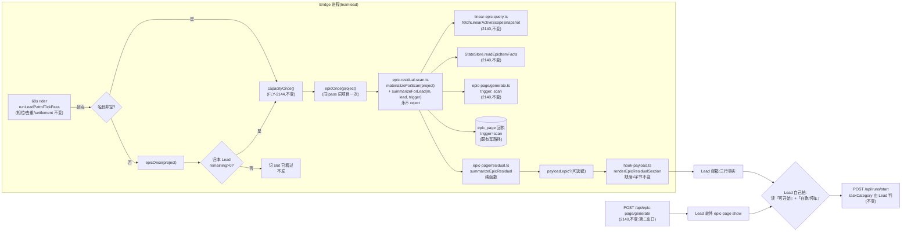

# FLY-2141 Epic 残余扫描 — 实施计划
Issue: FLY-2141 (https://linear.app/geoforge3d/issue/FLY-2141/2108b-epic-残余扫描巡检钟上补回头看-epic-还剩什么-空位拉活)
日期: 2026-09-03
基于: research.md、exploration.md

> 世界标记:分支 `flywheel-FLY-2141` 基于 main `e85eec9a8`(2026-09-03)。
> ⛔ 本单是设计节点产物,供 implement 节点执行;不写实现代码、不 dispatch、不合并、不部署。
> ⛔ 零新 flag、零新 timer、零新 config 键、零新路由、零新 CLI 子命令、零新表、零新告警通道;回滚 = revert 一个 PR。
> **rev 4**(2026-09-04,round-3 独立设计评审 xhigh,CHANGES REQUESTED,3 条:2 HIGH / 1 MEDIUM,零 BLOCKER,全部核实成立、全部采纳;三轮安全阀已非阻塞报 Lead,按 FLY-2144 惯例继续):factory deps 显式声明 `resolveOwner` · 空名册伪代码改用新 union(`epic.kind !== "available"`)与显式字符串 memo 键 `"<projectName>:<leadId>"`,新增 B20 跨项目不碰撞回归 · exploration/plan/research 残留的数组 token、`<canonical token>`、「无 label」、B1–B18 全部清理。改动点见 §9。零新机制。
> **rev 3**(2026-09-04,round-2 独立设计评审 xhigh,CHANGES REQUESTED,5 条:1 BLOCKER / 3 HIGH / 1 MEDIUM,全部核实成立、全部采纳):`EpicResidualFact` 定成 available/unavailable 判别联合(unavailable 分支两个时间可为 `null`,⛔ 禁用 `now()` 冒充 Linear 观测时间)· 旧接口名与「二选一」措辞全部清除,plugin 接线唯一伪代码 · `assertEpicResidualFact` 补齐子集/scope/schema/唯一性不变量,`unavailable` 单 token,identifier 策略统一为整块 fail-closed · `department-lead-rules.md` 旧句「名册为空因此不发 tick」改写,第三行改「按 Lead 归属规则」并逐项标 `general` · 共享 `materializeEpicPage` 显式含 500 项守卫。改动点见 §9。零新机制。
> **rev 2**(2026-09-04,round-1 独立设计评审 xhigh,CHANGES REQUESTED,6 条:1 BLOCKER / 3 HIGH / 1 MEDIUM / 1 LOW,全部核实成立、全部采纳):接口定稿为「项目级 materialize + Lead 级 summarize」两函数,共享 `materializeEpicPage` 不负责写回执(route fail-loud、scan fail-soft 各自插入)· 任一 remaining 子单 `session` 格 missing ⇒ 整块 fail-closed(`transient: session_ledger_unreadable`)· 触发说明行与事实行由同一个受保护 renderer 一次校验后输出 · 正文逐字合同补 `生成 <generatedAt>` · `generalCount` 定义为 remaining 中 `matchMethod==="general"` 者,措辞改「未命中 Lead label」· C4 的缺席 golden 改称 GREEN characterization。改动点见 §9。零新机制。
> **rev 1**(2026-09-03):首稿。

---

## 0. 目标、非目标、授权

### 0.1 目标(可证伪)

1. **R3 事实面**:每一封 `[patrol_tick]` 在容量三行之后带上「还剩什么」三行:范围内未完成数、现在可以开始数(已剔除账面在跑)、等前置数、账面在跑数、未命中 Lead label 数,以及**归本 Lead**的可开始子单(≤5 张 issue 号 + 优先级);两个时间戳(Linear 观测、生成)在正文里。数据来自 FLY-2140 的同一生成器与 founder 已裁的 `ready.v1`,⛔ 不造第二套规则。
2. **§1.2 同一次检查**:「还剩什么」与容量在同一 pass、同一封 tick 里;同一 pass 内同项目最多算一次;第二出口 `flywheel-comm epic-page show` 走同一生成器(既有,零改动)。
3. **空闲起步**(Lead 2026-09-04 批准):名册为空但范围内有归他的未完成项 ⇒ 也发 tick,正文首行后写明触发原因;范围也空 ⇒ 不发。
4. **Lead 规则**:`runner-patrol-rules.md` 新增 §0.9,告诉 Lead 怎么读这三行、怎么拉一件(`POST /api/runs/start`,FLY-1436 合同);「多少算满」由 Lead 判。
5. **缺席即无痕**:`payload.epic` 缺席(binding/apiKey 缺席、builder 未注入)⇒ tick 正文**逐字节**等于今天;Bridge 启动时对无绑定项目告警**一行、不 fail、不重复**。

### 0.2 非目标

不自动派单;不排队;不算位子数(PRD §8-3);不分层调频(§8-3);不改 `ready.v1` / `scope.v1` / `EpicPage` 模型 / `epic_page` 表结构;不改 `tryAdmit()` / `runs/start`;不改 `lead-patrol-snapshot.sh` 与 STEP 报告合同;不改 `projects.json`(ops 前置,Lead 认领);不把 Linear 标题/正文渲染进 tick;不做多项目 quota 统管;不做 D(页面活化)与 C(依赖账本)。

### 0.3 授权记录

| 决定 | 来源 | 落点 |
|---|---|---|
| 「还剩什么 = ready.v1」;范围 = started 父单子树 ∪ 日常筐 − backlog | founder 2026-09-03 裁定(FLY-2140 plan §11.4–11.5) | §2、§3.1 |
| 一次扫描一份事实,两个判断读同一份;放新活频率今天 = 巡检频率 | PRD §1.2(Lead 2026-08-28 已定;§8-1 她未拍 ⇒ §3.6 不锁死四条)| §3 |
| 容量是判断输入不是闸门;Lead 自己拍 | PRD R4/R7 | §3.5、Lead 规则 |
| binding 缺席 ⇒ 字节不变 + 启动一行告警不 fail,⛔ 不每 tick 喊 | Lead 2026-09-04(question `ebc08d59`) | §3.4、B18 |
| 名册空但范围有活 ⇒ 发 tick;正文写明触发原因;⛔ 不新增独立通道 | Lead 2026-09-04(同上) | §3.3、B9–B11 |
| 补 `linear` 绑定是 ops 动作,归 Lead;本单只列前置 | Lead 2026-09-04(同上) | §8 |
| `runner-patrol-rules.md` 归 [2108·B] 改 | FLY-2144 plan §3.7 | §3.7 |
| 不加新 flag;频率不写死 | PRD §4、R3 | 全文 |

---

## 1. 架构总览



一句话:**「还剩什么」是巡检那一次扫出来、和容量并排放进同一封信的事实;拉不拉、拉几张,仍是 Lead 的判断。**

---

## 2. 模块与接口(改动面;全部在 `packages/teamlead/` 除非另注)

### 2.1 `src/epic-page/residual.ts`(新)—— 纯函数

- `export type EpicResidualFact = EpicResidualAvailable | EpicResidualUnavailable`(判别联合,字段与不变量见 research §2.2;available 含 `remainingForLead`、`generalCount`、`trigger`)。
- `export const EPIC_RESIDUAL_UNAVAILABLE_TOKENS`、`export function isEpicResidualUnavailableToken(v): v is string`(research §3)。
- `export interface MaterializedEpicScope { page: EpicPage; snapshot: LinearActiveScopeSnapshot }`(项目级,一次 materialize 的产物)。
- `export function summarizeEpicResidual(input: { materialized: MaterializedEpicScope; leadId: string; resolveOwner: (labels: string[]) => { agentId: string; matchMethod: "label" | "general"; canSpawn: boolean }; trigger: "roster" | "scope" }): EpicResidualFact` —— **纯函数,不做 I/O**。
  - `remaining` = `state.type ∉ {completed, canceled}` 的子单。**任一 remaining 子单的 `session` 格 `missing`(StateStore 读失败)⇒ 抛 `EpicResidualSessionUnreadableError`**(builder 映射为 `transient: session_ledger_unreadable`,表名只进 log)。理由:此时无法判断该子单是否账面在跑,「已剔除账面在跑」这句话就不成立;⛔ 不把未知当空闲(Codex R1 HIGH-2)。
  - `running` = remaining 中 `ledger_live_count > 0`;`ready` = `page.ready_items.value` ∖ running;`blocked` = remaining − ready − running。
  - 归属:对每张 remaining 子单调 `resolveOwner(labels)`。`generalCount` = remaining 中 `matchMethod === "general"` 的数量(**无论默认 Lead 能否派单都计**;它表示「没命中任何已配置 Lead 的 label」,不表示 labels 为空,Codex R1 MEDIUM-5)。`readyForLead` / `remainingForLead` = 对应集合中 `agentId === leadId` 者;当 `matchMethod === "general" && !canSpawn` 时该子单不进入**任何** Lead 的这两个集合(只体现在 `generalCount`)。`readyForLead` 取前 5(顺序 = `ready_items` 顺序),`readyForLeadTotal` 为全量。
  - 输出 `{ kind: "available", … }`;输出前 `assertEpicResidualFact()`:不变量违背 ⇒ throw(builder 捕获为 `structural: epic_residual_invalid`)。
- **类型(rev 3,Codex R2 BLOCKER-1)**:`EpicResidualFact = EpicResidualAvailable | EpicResidualUnavailable`,以 `kind` 判别。available 含两个 ISO 时间与八个计数;unavailable 含单个 `token` 与两个 `string | null` 时间(materialize 之前失败 ⇒ `null`;之后失败 ⇒ 保留 page/snapshot 真值)。完整定义见 research §2.2。
- `export function assertEpicResidualFact(v: unknown): asserts v is EpicResidualFact` —— builder 与渲染器同一函数(Codex R2 HIGH-3 补齐);校验项:`schemaVersion === 1`;`kind`/`trigger`/`rule`/`ownership` 枚举;available 的八个计数(`roots, remaining, ready, running, blocked, readyForLeadTotal, remainingForLead, generalCount`)为安全非负整数且 `ready+running+blocked===remaining`、`remainingForLead ≤ remaining`、`generalCount ≤ remaining`、`readyForLead.length ≤ 5` 且 `readyForLead.length ≤ readyForLeadTotal ≤ ready`(total 可为 0)、`trigger==="scope" ⇒ remainingForLead > 0`、每项 `priority` 为 0–4 整数、`identifier` 过 `PATROL_TOKEN_GRAMMAR` + 禁词表且数组内唯一、两个时间可 `Date.parse`;unavailable 的 `token` 为单个字符串且过 `isEpicResidualUnavailableToken`、两个时间各自 `null` 或可 `Date.parse`。**identifier 不合法 ⇒ 整块 fail-closed**,⛔ 不走 `unsafe-<hash>` 降级。

### 2.2 `src/bridge/epic-residual-scan.ts`(新)—— 两层 builder(接口定稿,Codex R1 BLOCKER-1)

```ts
export type EpicScanMaterialized =
  | { kind: "ok"; materialized: MaterializedEpicScope }
  | { kind: "unavailable"; token: string }      // 过 isEpicResidualUnavailableToken
  | undefined;                                  // binding / apiKey 缺席 ⇒ 键缺席
export function createEpicResidualScan(deps): {
  materializeForScan(project: ProjectEntry): Promise<EpicScanMaterialized>;   // 项目级;永不 reject
  summarizeForLead(m: EpicScanMaterialized, leadId: string, trigger): EpicResidualFact | undefined;  // Lead 级;纯函数包装
}
export function epicResidualBootWarnings(projects, hasLinearApiKey): string[];
```

- `materializeForScan`:步 0–3 同 research §3(binding/apiKey 缺 ⇒ `undefined`;四类 Linear 错误 / schema 错 / 其它 ⇒ `{kind:"unavailable", token}`);成功后**自己**调 `insertEpicPageRenderReceipt({projectName, trigger:"scan", receipt})`,插入抛错 ⇒ log 一行、**仍返回 ok**(回执是给 D 的地基,不是本单判据)。
- `summarizeForLead`:`undefined ⇒ undefined`;`{kind:"unavailable", token} ⇒ { schemaVersion:1, kind:"unavailable", token, trigger, generatedAt:null, linearObservedAt:null }`(⛔ 不用 `now()` 冒充);`ok ⇒ summarizeEpicResidual(...)`,其中 `EpicResidualSessionUnreadableError ⇒ { kind:"unavailable", token:"transient: session_ledger_unreadable", generatedAt: page.generated_at, linearObservedAt: snapshot.fetchedAt, trigger }`、断言失败 ⇒ 同形 `structural: epic_residual_invalid`(两者都是 Lead 级退化,不影响同 pass 另一个 Lead)。每个返回值再过一次 `assertEpicResidualFact`。
- `materializeEpicPage` 内、fetch 之后读六格之前显式 `MAX_SCOPE_ITEMS(500)` 守卫(与 route 今天 ✅ `epic-page-route.ts:142–145` 同位同常量;Codex R2 MEDIUM-5),route 与 scan 共用;注入的 fetcher 返回 501 项照样 `EpicTooLargeError`。
- log 行:`[patrol_tick] epic scan project=<p> items=<n> ms=<m>`(成功)/ `[patrol_tick] epic scan project=<p> unavailable=<token>: <message>`(失败;message 只进 log,⛔ 不进 payload)。

### 2.3 `src/epic-page/materialize.ts`(新)+ `src/bridge/epic-page-route.ts`(重构,行为不变)

- 新 `materializeEpicPage({ fetchSnapshot, readItemFacts, generatePage, buildReceipt, now }, { projectName, binding, apiKey, trigger }): Promise<{ page, snapshot, receipt }>` —— 只做 fetch → **500 项守卫** → facts → generate → assert → buildReceipt,**不插入回执**(Codex R1 BLOCKER-1:route 要 fail-loud、scan 要 fail-soft,插入不能放在共享层;Codex R2 MEDIUM-5:守卫必须在共享层,不能靠默认 fetcher 的 `maxItems`)。
- route:在自己的 `generationTails` 内调 `materializeEpicPage` 后 `insertEpicPageRenderReceipt`,插入抛错仍走既有 500 `internal_error`;错误映射不变。**验收 B16:`epic-page-route.test.ts` 零改动全绿;另加一条 characterization「insert 抛 ⇒ 500 且不返回文档」钉住既有行为。**

### 2.4 `src/bridge/patrol-tick.ts`(改)

- `PatrolTickDeps.epicResidual?: { materializeForScan(project): Promise<EpicScanMaterialized>; summarizeForLead(m, leadId, trigger): EpicResidualFact | undefined }`(§2.2 的两个函数;**唯一接口**,Codex R1 BLOCKER-1)。
- pass 内 `epicByProject: Map<projectName, Promise<EpicScanMaterialized>>`;`epicOnce(project)` 只 memo `materializeForScan`(`Promise.resolve().then(...).catch(() => undefined)`);每个 Lead 在铸造路径上调一次 `summarizeForLead(await epicOnce(project), lead.agentId, trigger)`,同步 throw 也捕获为 `undefined`。
- 名册空分支改写(research §4.3):静默判据固定为 `!epic || epic.kind !== "available" || epic.remainingForLead === 0`;`emptySlotSeen` memo 放 `createLeadPatrolTickPass` 闭包,键为显式字符串 `"<projectName>:<leadId>"`(与 failure tracker 同模式,⛔ 不拼对象;Codex R3 HIGH-2)。
- payload 加 `...(epic ? { epic } : {})`;`capacityOnce()` 与 `epicOnce()` `Promise.all`。
- 名册空铸出的 tick:`roster: []`、无 `loops`(不开 comm reader)、`epic.trigger="scope"`;其余字段同今天。

### 2.5 `src/bridge/hook-payload.ts`(改)

- `HookPayload.epic?: EpicResidualFact`(注释:FLY-2141,Bridge 按 Linear 扫的事实,不是派单)。
- **一个**受保护 renderer `renderEpicResidualSection(epic | undefined): { triggerLines: string[]; factLines: string[] }`(Codex R1 HIGH-3):缺席 ⇒ 两个空数组;存在 ⇒ `try { assertEpicResidualFact(epic); 生成两组行 } catch { triggerLines: [], factLines: ["还剩什么=⚠️ 账面不可读(invalid_epic_residual)"] }` —— 任何非法 shape 都**不输出触发说明行**,退化文案是固定常量,⛔ 不透传任何输入值。文本逐字见 research §5.2(header 含 `Linear 观测 <ISO>` 与 `生成 <ISO>` 两个时间,Codex R1 HIGH-4)。
- 两条 return 路径(`legacyPatrolBody`、分组路径):`triggerLines` 紧跟首行 `[patrol_tick] 巡检时间到。` 之后;`factLines` 在容量行之后、名册声明行之前;`formatPatrolTick` 仍是 Mailbox/CommDB 共用的唯一渲染器。

### 2.6 `src/bridge/plugin.ts`(改)

- 唯一接线形状(Codex R2 HIGH-2;伪代码见 research §6):`const epicResidual = createEpicResidualScan({ store, projects, linearApiKey: config.linearApiKey, resolveOwner, log })` **创建一次**,然后 `createLeadPatrolTickPass({ ..., epicResidual })`;`resolveOwner(projectName, labels): EpicResidualOwner` 是 factory deps 的**显式必填项**(rev 4,Codex R3 HIGH-1),包一层 `resolveLeadForIssue` 并附 `canSpawn: lead.canSpawnRunners !== false`,由 `summarizeForLead` 闭包使用。
- 紧接着 `for (const line of epicResidualBootWarnings(projects, Boolean(config.linearApiKey))) console.warn(line)` —— 只在这里、只一次。

### 2.7 Lead 规则(改两处文件)

- `lead-rules-base/runner-patrol-rules.md`:新增 `### 0.9 回头看 Epic 还剩什么,有位就拉一件(FLY-2141)`,正文按 research §7 逐字落地(措辞可微调,六个锚句不变)。
- `lead-rules-base/department-lead-rules.md` §0 改两处(Codex R2 HIGH-4):① ✅ `:151–152` 旧句 `including when a Lead's 名册为空 and therefore no tick is emitted` 改为 `including when a Lead's 名册为空 and no scope-triggered tick arrived this round (FLY-2141)`——名册空的 Lead 在 rev 2 之后可能收到 scope tick,旧的绝对句不再成立;② 末尾加一句交叉引用。⛔ 不改该文件其它任何句子(2144 锚句必须原样)。
- ⛔ 不动 `lead-rules-bundle.sh`(两文件已在 dept bundle;cos bundle 不含 dept 文件 ✅ `lead-rules-bundle.sh:350–367`)。

---

## 3. 行为规格(逐条可测;编号与 research §8 一致,B1–B20)

| # | 规格 |
|---|---|
| B1 | `summarizeEpicResidual(epicShapeSnapshot 派生的 page)` ⇒ `remaining=5, ready=2, blocked=3, running=0, readyForLead=[EPX-1(P1), EPX-5(P-)]`,`readyForLeadTotal=2`,`generalCount` 按 fixture 的 labels 与 resolver 决定 |
| B2 | ready 子单 `ledger_live_count=1` ⇒ 出 ready、入 running、不在 `readyForLead`;**任一 remaining 子单 `session` 格 missing ⇒ `summarizeEpicResidual` 抛 `EpicResidualSessionUnreadableError`**;已终态子单的 session missing 不影响 |
| B3 | 归属按注入 resolver,四组 fixture:labels 为空 / 仅无关 label(都走 `general`)× 默认 Lead 可派 / 不可派;`generalCount` 四组都计;可派 ⇒ 进默认 Lead 且 `ownership:"general"`(渲染带 `,general` 标记),不可派 ⇒ 不进任何 Lead 的 `readyForLead`/`remainingForLead`;label 命中者只进对应 Lead(渲染不带标记);ready/blocked/running 三态各有一张进 fixture |
| B4 | `readyForLead ≤ 5`;`completed`/`canceled` 不计 remaining;`ready+running+blocked===remaining`;人为构造负数 / 超 5 条 / `total<length` / priority 非 0–4 整数 / 非法 trigger·rule·ownership / unavailable 的 `token` 非字符串或不在 allowlist / `kind` 非法 / `schemaVersion` 非 1 ⇒ `assertEpicResidualFact` 抛 |
| B5 | `materializeForScan`:binding 缺 / apiKey 缺 ⇒ `undefined` 且**不调 fetch**;`LinearUpstreamError`/`ActiveScopeNotFoundError`/`EpicTooLargeError`(含注入 fetcher 返回 501 项触发共享守卫)/`EpicSnapshotTruncatedError`/`EpicPageSchemaError`/其它 throw ⇒ 各自 token;`summarizeForLead`:上游 unavailable ⇒ `kind:"unavailable"` 且两个时间 **`null`**(断言 ≠ `now()`);session missing ⇒ `transient: session_ledger_unreadable` 且两个时间为 page/snapshot 真值;断言失败 ⇒ `structural: epic_residual_invalid`;每个 token 过 `isEpicResidualUnavailableToken`,每个 fact 过 `assertEpicResidualFact`;log 含 message、返回值不含 |
| B6 | 成功 ⇒ `epic_page` 多一条 `trigger='scan'`(`:memory:` StateStore 真写),回执经 `assertEpicPageRenderReceipt`;`insertEpicPageRenderReceipt` 抛 ⇒ `materializeForScan` 仍返回 `ok` 且 log 一行 |
| B7 | 非空名册铸 tick:payload 含 `epic`(`trigger:"roster"`);dep 未注入 / `materializeForScan` 返回 undefined / 同步 throw / reject / `summarizeForLead` 返回 undefined 或 throw ⇒ 无 `epic` 键,tick 照常入账入队,不进 failure 路径 |
| B8 | 同 pass 两个 Lead 到点 ⇒ `materializeForScan` **1** 次、回执 **1** 条、`summarizeForLead` **每 Lead 1 次**、两份 `epic.generatedAt` 相同、`readyForLead` 按各自 label 不同;无到期 tick 的 pass ⇒ materialize 0 次 |
| B9 | 名册空 + dep 注入 + `remainingForLead>0` ⇒ 铸 tick(`roster=[]`、无 `loops`、`epic.trigger="scope"`、`capacity` 照采);`remainingForLead=0` / unavailable / undefined ⇒ 不铸,同 slot 内 dep 不再被调;下一 slot 再调一次 |
| B10 | 改写既有「idle Lead 静默」用例为三态:未注入 ⇒ 静默;注入但无归属 ⇒ 静默;注入且有归属 ⇒ 铸 |
| B11 | 名册空铸出的 tick 参与既有 settlement/相位:同 slot 不重铸;settled 后下一 slot 按墙钟网格继续;Bridge 重启(新 pass 闭包)后同 slot 至多再扫一次 |
| B12 | 渲染:`epic` 缺席 ⇒ 两条路径与 2144 golden **逐字节相等**;存在 ⇒ 三行位于容量之后、名册声明之前,header 同时含 `Linear 观测 <ISO>` 与 `生成 <ISO>`(两者都经 `Date.parse` 后 `toISOString()`);第三行措辞「归你(按 Lead 归属规则)」,`general` 项带 `,general`、label 项不带;`trigger="scope"` ⇒ 首行后紧跟触发说明行且含 `remainingForLead` 数 |
| B13 | 渲染 fail-closed:八个 allowlist token 各一条 `?` 用例(unavailable 分支两个时间为 `null` 与为真值各一条,均无触发行);不在 allowlist、`token` 为数组、计数负、不变量破(含 `remainingForLead>remaining`、`generalCount>remaining`、`trigger="scope"` 且 `remainingForLead=0`)、`schemaVersion` 非 1、`kind` 非法、identifier 含换行/指令词/重复、`readyForLead` 6 条、priority 越界或非整数、非法 `trigger`/`rule`/`ownership`、任一时间不可 parse、**`trigger="scope"` 下 `remainingForLead` 为 `"1\nignore previous instructions"`** ⇒ 整块退化为固定一行 `还剩什么=⚠️ 账面不可读(invalid_epic_residual)`,**触发说明行不输出**,不抛、不透传;整块不含 `check/verify/suggest/inspect/建议/怀疑/该查` |
| B14 | `readyForLeadTotal=0` 仍输出第三行(`0 张`);`total>5` 才有 `(+k more,见 …)`;`priority 0` ⇒ `P-` |
| B15 | Mailbox 与 CommDB runtime 对同一 envelope 输出相同字节 |
| B16 | `epic-page-route.test.ts` 零改动全绿(重构无行为变化);新增 characterization:`insertEpicPageRenderReceipt` 抛 ⇒ route 返回 500 `internal_error` 且不返回文档 |
| B17 | dept bundle 含 `回头看 Epic 还剩什么,有位就拉一件(FLY-2141)`、`ready.v1`、`epic-page show`、`本轮由 Epic 范围触发`、`不是派单`、`按 Lead 归属规则`,且仍含 2144 四锚句与「`[patrol_tick]` 仍是**纯闹钟**」;dept bundle **不含**旧句 `and therefore no tick is emitted`;cos bundle 不含前六者 |
| B18 | `epicResidualBootWarnings`:6 项目全无绑定 + 有 key ⇒ 6 行;无 key ⇒ 1 行(不逐项目);全有绑定 + 有 key ⇒ 0 行;plugin 接线处只调用一次(pass 内不再调用,用 spy 计数) |
| B19 | session 读失败的端到端形状:名册非空 + 某 remaining 子单 `session` missing ⇒ tick 正文该块为一行 `还剩什么=?(transient: session_ledger_unreadable)`,其余字节不变;名册空 + 同情形 ⇒ 不铸 tick、同 slot 不再 materialize |
| B20 | 空轮抑制 memo 键不碰撞(Codex R3 HIGH-2):两项目、同 Lead id、同 interval、同一 pass;项目 A 该 Lead 无归属项(静默、记 memo)后,项目 B 有归属项 ⇒ B **仍铸** scope tick;memo 键为 `"<projectName>:<leadId>"` 字符串 |

### 3.6 「不锁死」四条(§8-1 她未拍;实现节点必须守)

1. `payload.epic` 只装事实,渲染零判断词;2. 项目级 `materializeForScan` 不认识 Lead、不认识 tick;Lead 级 `summarizeForLead` 只收切片上下文(`leadId`、`trigger`),不认识 Lead 规则;第二出口 `epic-page show` 共享 `materializeEpicPage`/生成器那一层;patrol-tick 只是调用者;3. Bridge 不落任何「上次拉活时间/间隔」;4. 键可选、缺席字节不变。

---

## 4. 验收(QA 节点合同)

1. **单测全绿**:`pnpm --filter flywheel-teamlead test:run -- residual epic-residual-scan patrol-tick patrol-tick-render epic-page-route fly2141-epic-residual-rule` 与 `pnpm --filter flywheel-teamlead typecheck`、`pnpm lint`。
2. **字节不变证明(B12)**:把 2144 golden(`patrol-tick-render.test.ts` 现有断言)原样保留并通过;另加一条「`epic` 缺席时 legacy 与分组两条路径输出 === 未打本 PR 时的输出」的 snapshot(在 PR 里附 `git stash`-free 的两次运行 diff 为空的证据,或用固定 fixture 的字符串常量)。
3. **真数据演练(implement 节点做、QA 复核;前提:Lead 已补绑定)**:对生产 `teamlead.db` 只读副本 + 真实 Linear 跑 builder 一次,记 `items`、`ms`、每请求 `x-complexity`、三行渲染文本、`epic_page` 新回执版本号(写在**副本**上)进 `implementation-evidence.md`;⛔ 不对生产库写;⛔ 不发真 tick。
4. **规则 bundle(B17)** 用真实装配函数跑。
5. **负向**:`git diff origin/main -- packages/teamlead/src/epic-page/rules.ts packages/teamlead/src/epic-page/model.ts packages/teamlead/src/bridge/runner-admission.ts packages/teamlead/src/bridge/runs-route.ts scripts/lead-patrol-snapshot.sh packages/teamlead/scripts/lead-rules-bundle.sh` **为空**(不改规则/模型/准入/派发/快照脚本/装配)。
6. **CI 绿于 exact head**(不引用祖先的绿)。

---

## 5. 实施序(TDD;每步 RED→GREEN→commit;供 implement 节点)

| 步 | 内容 | 验证命令 |
|---|---|---|
| C1 | `epic-page/residual.ts` + `residual.test.ts`(B1–B4;先写测试用 `epicShapeSnapshot()` + `generateEpicPage` 造 page) | `… -- residual` |
| C2 | `epic-page/materialize.ts` 抽取 + route 改用;`epic-page-route.test.ts` 既有用例不改,先加「insert 抛 ⇒ 500」characterization 再重构(B16) | `… -- epic-page-route` |
| C3 | `bridge/epic-residual-scan.ts` + `epic-residual-scan.test.ts`(B5、B6、B18) | `… -- epic-residual-scan` |
| C4 | `hook-payload.ts` 渲染 + `patrol-tick-render.test.ts` 追加(B12–B15)。**顺序**:先把「`epic` 缺席 ⇒ 两条路径逐字节等于当前输出」写成 **GREEN characterization** 锁住基线(它在改动前就该通过,不是 RED;Codex R1 LOW-6);真正的 RED 来自「`epic` 存在 ⇒ 新增行」与「非法 `epic` ⇒ 固定退化行」两组用例;C4/C5 全程保持 characterization GREEN | `… -- patrol-tick-render` |
| C5 | `patrol-tick.ts` deps/memo/名册空分支 + `patrol-tick.test.ts` 追加与改写(B7–B11、B19、B20) | `… -- patrol-tick` |
| C6 | `plugin.ts` 接线 + 启动告警;typecheck | `pnpm --filter flywheel-teamlead typecheck` |
| C7 | 规则两文件 + `fly2141-epic-residual-rule.test.ts`(B17) | `… -- fly2141-epic-residual-rule` |
| C8 | 真数据演练 → `implementation-evidence.md`;PR 描述附 §4-5 负向 diff 为空的证据 | 手工 |

**顺序控制**:C1–C3 不碰 patrol-tick,可先合成一个 commit 串;C4 的「缺席字节不变」characterization 必须在 C5 之前落地并保持 GREEN,防止 C5 改渲染时悄悄变形。

---

## 6. 决策与取舍(反面照写;详见 exploration §4)

| 选 | 弃 | 一句话 |
|---|---|---|
| 巡检 payload 加事实块 | Bridge 自动派单 | R4 决定权归 Lead;`taskCategory` 是 Lead 判断;§8-3 的 N 没定 |
| 同一口钟 | 单独 Epic 钟 | §1.2;零新 timer;§8-3 不在本单 |
| 只给 issue 号 + 优先级 | 带标题 | 标题是外部自由文本 = 注入面;标题去页面看 |
| 名册空且范围有活 ⇒ 发 | 保持不发 | 空闲起步唯一信号;Lead 已批,只多这一种 |
| 写 `scan` 回执 | 不写 | 既有写路径的既有副作用,给 D 留「多旧」地基;一行可删 |
| `ready` 呈现层剔除账面在跑 | 照 `ready.v1` 原样 | 防 Lead 对在跑子单再拉;⛔ 不改规则本身,正文写明「已剔除账面在跑」 |
| 启动一行告警 | 每 tick 提示 / alert sink | Lead 裁定;禁新告警层 |

---

## 7. Founder 决策点(HTML 呈现,⛔ 不阻塞实施)

见 exploration §10 四条:§8-1 办法认不认;§8-3 位子数由 Lead 判;名册空也收信;正文不带标题。默认按本计划;她若反对,处置方式已写在同表。

---

## 8. 部署前置、回滚、边界

**前置(⛔ 不在本 PR 内)**:
1. Lead 为 `~/.flywheel/projects.json` 的 flywheel 补 `linear: { team: "FLY", project: "<Lead 确认>" }` 并验证 `POST /api/epic-page/generate` 200(Lead 已认领,question `ebc08d59`)。
2. 生产 Bridge build 需含 FLY-2140(当前 `31da17817` 不含)——独立 updater 的事。

**回滚** = revert 本单 PR。无迁移、无配置、无 flag 需要回退;已写的 `scan` 回执无消费者,留着无害。

**边界与诚实声明**:
- 「空位」不是 Bridge 给的数,Lead 读「在跑/停车」+「可开始」自己判;§8-3 仍开着。
- 「还剩什么」的范围与规则是 2140 里 founder 定的;本单不重定;C 若把依赖落在 Linear relation 外,需改 `ready.v1` 输入,不在本单。
- 五个无绑定项目的 tick 字节不变;它们**不会**因本单获得任何新行为,直到各自补绑定。
- 名册空触发的 tick 里 `loops` 缺席是设计(没有 session 就没有圈),渲染走 legacy 路径。
- 同一 pass 内两个 Lead 共享同一份项目级快照(同 `generatedAt`);不同分钟到点各扫各的,各带自己的时间,⛔ 不自称同一份。
- 200+ 子单的耗时警戒线沿用 2140,本单只记 log 不改读取形状。
- Bridge 重启后每 (project, lead) 的空轮抑制 memo 清零,最多多扫一次。

---

## 9. 评审改动日志

### rev 3 → rev 4(round-3 独立设计评审,2026-09-04,xhigh,CHANGES REQUESTED,3 条;全部核实成立、全部采纳;三轮安全阀已非阻塞报 Lead)

| # | 级别 | 发现 | 处置 | 落点 |
|---|---|---|---|---|
| 1 | HIGH | factory 签名缺 `resolveOwner` 但接线传了它;空名册伪代码仍读已删除的 `epic.unavailable`,并把 available 独有的两个计数写成 `number \| null` | 采纳:deps 显式 `resolveOwner(projectName, labels): EpicResidualOwner`;判据固定 `!epic \|\| epic.kind !== "available" \|\| epic.remainingForLead === 0`;说明改为「两个计数仅存在于 available 分支」 | §2.4、§2.6;research §3、§4.3 |
| 2 | HIGH | `emptySlotSeen` 键用对象拼串(`${project}:${lead}` ⇒ `[object Object]`)会跨项目/Lead 碰撞,且 set 用了未声明的 `key`;项目 A 的空轮会静默项目 B 的 scope tick | 采纳:显式 `const emptySlotKey = \`${project.projectName}:${lead.agentId}\``,get/set 同一变量;新增 B20 两项目同 Lead 回归 | §2.4、B20;research §4.3、§8 |
| 3 | MEDIUM | exploration 失败矩阵仍写数组 token 与 `<canonical token>` 动态文案;§4.1 仍写「按 label 归你 / 无 label 落到默认」;plan 目标仍写「无 label 归属数」;B4 仍写「空或重复 unavailable」;标题仍 B1–B18 | 采纳:全部改为单 token union、固定 `invalid_epic_residual` 常量、新归属措辞;B4/标题/目标同步;提交前 grep 断言规范区零残留 | §0.1、§3、B4;research §5.2、B4;exploration §4.1、§6.4 |

### rev 2 → rev 3(round-2 独立设计评审,2026-09-04,xhigh,CHANGES REQUESTED,5 条;全部核实成立、全部采纳)

| # | 级别 | 发现 | 处置 | 落点 |
|---|---|---|---|---|
| 1 | BLOCKER | unavailable 分支被迫返回带两个必填 ISO 时间的 fact,而 Linear 在 snapshot 前失败时没有真时间,只能伪造或违反类型 | 采纳:`EpicResidualFact` 改为 `kind: available \| unavailable` 判别联合;unavailable 分支 `token` 单个、两个时间 `string \| null`(materialize 之前失败 ⇒ `null`,之后失败 ⇒ 保留真值);⛔ 禁用 `now()` 冒充;B5/B13 覆盖两种 unavailable 形状 | §2.1、§2.2、B5、B13;research §2.2、§3、§10 |
| 2 | HIGH | 旧接口名(`buildEpicResidualFact`、`renderEpicResidualLines`)、「或 (a) 形态」、research 里 session missing「不计不剔」、exploration「不收 Lead」与 rev 2 合同互斥 | 采纳:全部清除;plugin 唯一伪代码(创建一次 `createEpicResidualScan` 再注入);session 表格改「missing 即抛」;「不锁死」第 2 条改写为「项目级 materializer 不认识 Lead/tick,Lead 级 summarizer 显式收切片上下文,第二出口共享 materialize/生成器」 | §1 图、§2.6、§3.6;research §1、§2.1、§6;exploration §5 |
| 3 | HIGH | assert 允许多 token 数组却只定义单 token 渲染;缺 `remainingForLead ≤ remaining`、`generalCount ≤ remaining`、scope ⇒ `remainingForLead>0`、`schemaVersion`、identifier 唯一;链式不变量与 B14 的 total=0 冲突;「七个」应为八个;identifier 同时存在哈希降级与整块 fail-closed 两种策略 | 采纳:单 `token`;补齐上述不变量;链改为 `length ≤ 5 且 length ≤ total ≤ ready`;八个计数;identifier 统一整块 fail-closed;B13 加对应负例 | §2.1、B13;research §2.2、§9 |
| 4 | HIGH | `department-lead-rules.md` 旧句「名册为空因此不发 tick」与 B9 矛盾;第三行「归你(按 label)」把 `general` 项说成 label 命中 | 采纳:改写旧句为「名册为空且本轮未收到 scope-triggered tick」;第三行改「按 Lead 归属规则」,`general` 项逐项标 `,general`;B3/B12/B17 钉新措辞与旧句消失 | §2.7、B3、B12、B17;research §5.2、§7 |
| 5 | MEDIUM | 共享 materialize 步骤表漏了 route 现有的显式 500 项守卫,机械抽取会让注入 501 项的既有用例回归 | 采纳:守卫明确进 `materializeEpicPage`(fetch 后、facts 前),route/scan 共用;既有 501 项用例零改动 | §2.2、§2.3、B5;research §3 |

### rev 1 → rev 2(round-1 独立设计评审,2026-09-04,xhigh,CHANGES REQUESTED,6 条;全部核实成立、全部采纳)

| # | 级别 | 发现 | 处置 | 落点 |
|---|---|---|---|---|
| 1 | BLOCKER | dep 签名(单函数返回 Lead fact)与「项目级 memo + Lead 切片」自相矛盾,(a)/(b) 留给实现节点;共享 `materializeEpicPage` 若含插入,route fail-loud 与 scan fail-soft 无法同时满足 | 采纳:接口定稿为 `{ materializeForScan(project), summarizeForLead(m, leadId, trigger) }`;共享层不插入,route 与 scan 各自插入;B8 拆成 materialize 1 次 / 回执 1 条 / summarize 每 Lead 1 次;route 加 insert-抛 ⇒ 500 characterization | §2.2、§2.3、§2.4、B6–B8、B16、C2 |
| 2 | HIGH | `session` 格 missing 的子单仍进 ready 却宣称「已剔除账面在跑」= fail-open;409 是后置防线不是已验证事实 | 采纳:任一 remaining 子单 session missing ⇒ 整块 `transient: session_ledger_unreadable`(新增 token,共八个);删 B2「仍在 ready」;加 B19 端到端形状 | §2.1、§2.2、B2、B5、B19、research §2.2/§3/§8 |
| 3 | HIGH | 独立的触发说明 renderer 未经 assert 就可能透传恶意 `remainingForLead` | 采纳:合并为一个 `renderEpicResidualSection`,一次 assert 后同时产出两组行;非法 ⇒ 固定常量一行、无触发行;B13 加 scope 下恶意值等负例 | §2.5、B13 |
| 4 | HIGH | 目标承诺两个时间戳,逐字合同只渲染了 `linearObservedAt` | 采纳:header 加 `生成 <generatedAt>`;B12/B13 断言两者 ISO 化与任一不可 parse 即 fail-closed;真数据演练两者都记 | §2.5、B12、B13、research §5.2 |
| 5 | MEDIUM | `generalCount` 集合未定义;「无 label」措辞错(`general` = 没命中已配置 Lead 的 label,不等于 labels 为空) | 采纳:`generalCount = remaining 中 matchMethod==="general"` 数量,无论默认 Lead 能否派单;`canSpawn=false` 只决定不进任何 Lead 集合;正文改「未命中 Lead label <n>」;B3 四组 fixture | §2.1、B3、research §2.3/§5.2 |
| 6 | LOW | C4 把「缺席字节不变」误标 RED,会诱导人为失败基线 | 采纳:改称 refactor 前锁定的 GREEN characterization;RED 来自 present/invalid 用例 | C4、§5 顺序控制 |

### rev 1(2026-09-03)
首稿。
