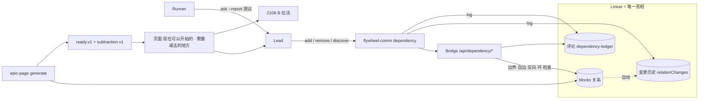

# FLY-2142 依赖账本 — 探索
Issue: FLY-2142 (https://linear.app/geoforge3d/issue/FLY-2142/2108c-依赖账本初始批次-三类动态更新减法不许丢)
日期: 2026-09-04
基于: 无(上游输入 = `product/doc/FLY-1969-auto-scheduling-operating-model/prd.md` v2.4 R2;FLY-2140 `plan.md` §11 与 `design-correction.md` §9 记录的 founder 2026-09-03 裁定;main 头 `e85eec9a8` 上已合入的 epic-page 代码)

> 世界标记:[main] = 本分支 `flywheel-FLY-2142` 头 `e85eec9a8`(= 派发时的 `origin/main`),工作区干净;[prd] = prd.md v2.4;[linear] = Linear GraphQL 直读,as-of **2026-09-04T03:51:13Z**(本单用 `~/.flywheel/.env` 的 key 亲手查,不是转述)。
> 成色:✅ = 本单亲手核过原件(文件+行号或命令输出);📖 = 引自上游文档、未复核;⬜ = 未知,进 research 或留白;🔶 = 本单的建议/默认值,可被推翻。

---

## 0. 一句话

**账本不是一本新账,而是 Linear 里已经存在的 `blocks` 关系 + Linear 自带的变更历史;本单给它加三件事:三条能写的路(加边 / 删边 / 建单加边)、一个能读回来的口(谁在什么时候为什么改了)、和一个让「减法」永远不会被漏掉的守卫(页面点名所有该减没减的地方)。** ⛔ 不新建第二本真相,⛔ 不自动删边,⛔ 不改 founder 已裁定的 `ready.v1`。

---

## 1. 本单在 Epic 里的位置

Epic FLY-2108 五张子单,本单是 **C**:

| 子单 | 状态 [linear] | 对本单的意义 |
|---|---|---|
| A · FLY-2140 页面内容模型 + 首版 | **Done**(PR #1044 已合入 main) | 本单的**消费者**与**约束来源**:页面的 `blocked_by` 格、`ready.v1`、`dependents.v1` 都已在跑;本单只能**追加**字段(FLY-2140 plan §10 冻结点) |
| B · FLY-2141 残余扫描 + 空位拉活 | Backlog,未开工,无文档夹 | 本单的**消费者**:它读同一次生成里的 `ready_items` 与本单新增的审阅格 |
| **C · FLY-2142(本单)** | Backlog,被 2140 挡(已解除)、挡 2143 | — |
| D · FLY-2143 页面活化 | Backlog,未开工 | 本单写进 Linear 的东西(关系 + 评论)天然在 D 的事件/扫描面上 |
| E · FLY-2144 容量输入 + dag-resolver 退役 | **Done**(PR #1043) | 无代码接口 |

**PRD R2 原文(prd.md L212-223 ✅)**:拆 Epic 时先做初步标定、划好批次;执行中 Lead 动态发现三类:**漏掉的 / 不需要做的 / 新发现的**,实时更新。⚠️「不需要做的」不许漏 —— 另两类是加,它是减;**只能加不能减的记录会单调变紧,最后没有一件事能被派出去。**

**PRD §8 转工程侧的那条(L452 ✅)**:「dependency 的三类更新由谁来记」—— 本单定。

---

## 2. 已核事实(每条都决定一个设计取舍)

### 2.1 founder 2026-09-03 的裁定把「批次」拿掉了,只剩「依赖」(📖 FLY-2140 plan §11 / design-correction §9;本单读的是文档,不是录音)

> 「基本上不用分所谓的 batch,做完一件补一件……**唯一要理清的就是 dependency。**」
> 「它就像一个数据库或者 DAG……Lead 去执行的时候,更多是看**当前所有没有 dependency 的事情,抓一个排在前面的来做**。」
> 「对 Lead 来说,这其实是把 Linear 里的东西又拿出来做了一遍,增加了 multiple source of truth。」

由此 FLY-2140 §11.2 / §11.4 定下(已实现、已合入):**Linear 是范围、状态、优先级和 `blocked_by` 边的唯一真相;页面是按请求生成的只读投影,不写新的计划数据库。**

⇒ 对本单的直接含义:
1. issue 标题里的「**初始批次**」按新裁定读成「**拆 Epic 时在 Linear 登记的初始 `blocks` 边集合**」;第一波能做什么由 `ready.v1` 推出来,⛔ 不再有 batch 这个对象。
2. 「账本」若做成 StateStore 里的一张依赖表,就是 founder 亲口点名的那个坏处。⛔ 不做。
3. 三类更新的**落点只能是 Linear 关系本身**。

### 2.2 main 上依赖是怎么读、怎么判的(✅ 逐行核过)

| 事实 | 出处 |
|---|---|
| 「谁挡着我」只读 `inverseRelations` 里 `type === "blocks"` 的 `issue`;每条带 `stateType` 与 `inScope` | `packages/teamlead/src/bridge/linear-epic-query.ts:385-394` |
| `ready.v1`:范围内 ∧ 非 backlog/completed/canceled ∧ **每一条 `blocked_by` 的 blocker 状态都是 `completed`** | `packages/teamlead/src/epic-page/rules.ts:20-42` |
| 「谁在等我」(`blocks` 格)由全部 `blocked_by` 反推,规则 `dependents.v1` | `epic-page/generate.ts:188-210` |
| 页面根格只有 `done_definition / founder_items / ready_items / gaps`;schema 守卫是**精确键集**,多一个键就拒 | `epic-page/model.ts:337-342, 366-380` |
| `epic_page` 表只写 source-only 回执;守卫用正则拒绝任何 `batch / next / ready / order` 字段 | `epic-page/receipt.ts:22-23` |
| 卡片上「等谁」一行对每个 blocker 打印 `状态:<type>` 小字,但**没有任何地方汇总「哪些 blocker 已取消却仍在挡人」** | `epic-page/render-html.ts:155-175` |

### 2.3 🔴 main 上今天已经存在「减法丢失」的形状

FLY-2140 exploration §3.1 把「取消一张子单」当成 R2 的减法:「取消一张 = 不需要做的 … 自动体现」。但 `ready.v1` 只认 `completed`:

```
Y blocks X;Lead 把 Y 取消(不需要做了)
⇒ Y 离开 ready 集(对)
⇒ X 仍然 blocked_by [Y: canceled] ⇒ X 永远不 ready(减法在下游丢了)
⇒ 页面只在 X 卡片小字里写「状态:canceled」,没有汇总、没有提醒
```

这正是 PRD R2 那句警告的实例:加法(登记 Y blocks X)进去了,减法(Y 不做了)没有传到 X。**本单的守卫(§4.3)就是为这个形状而设。**

### 2.4 Linear 能不能当账本(✅ SDK 60.0.0 类型 + 真数据)

| 能力 | 事实 | 出处 |
|---|---|---|
| 加边 | `client.createIssueRelation({ issueId, relatedIssueId, type: "blocks" })`;`issueId` 是挡人的那张,`relatedIssueId` 是被挡的那张 | `@linear/sdk/dist/_generated_sdk.d.ts:21835`;`IssueRelationCreateInput` `_generated_documents.d.ts:7532-7541` |
| 删边 | `client.deleteIssueRelation(id)`;`id` 从被挡 issue 的 `inverseRelations.nodes[].id` 取到 | `_generated_sdk.d.ts:21842`;本单查询已拿到每条关系的 `id` 与 `createdAt` |
| 关系类型 | 枚举只有 `blocks / duplicate / related / similar` | `_generated_documents.d.ts:7566-7571` |
| **变更历史** | `issue.history.nodes[].relationChanges[] = { identifier, type }`,每条带 `createdAt` 与 `actor` | `_generated_sdk.d.ts:5454, 5997-6003`;**真数据(FLY-2143)**:`2026-09-03T02:35:28Z Xiaorong Li ab FLY-2142`(登记 2142 挡 2143)、`2026-09-04T02:35:45Z actor=null br FLY-2140`(2140 完成,系统记「blocker 已解」) |
| 历史码含义 | 观测到 `ab` = 加了一个 blocker、`br` = blocker 已解决(系统事件);**删边的码尚未观测到**(本单没有在生产 Linear 做写操作) | ⬜ research 定:实现期在 Lead 授权的测试单上做一次加/删,记下删边的码 |
| 评论 | `client.createComment({ issueId, body })` 已在 `/api/linear/comment` 代理里用 | `bridge/plugin.ts:3801-3876` |

⇒ **Linear 自己就记「谁、何时、加/删了哪条边」。** 它不记的只有两样:这次改动属于三类里的**哪一类**,以及**为什么**。这两样用一条固定前缀的评论补上(§4.2),评论也在 Linear 里 —— 账本仍是一本。

### 2.5 Lead 今天怎么写 Linear(✅)

| 通道 | 事实 | 出处 |
|---|---|---|
| Bridge 代理(推荐给 Lead 的方式,GEO-187:agent 不持有 `LINEAR_API_KEY`) | 已有 `create-issue / update-issue / comment` 三个写代理 + `issue / issues / comments` 三个读代理,全部 `tokenAuthMiddleware(config.apiToken)`;写代理带 `projectName` 时用 `issueMatchesBinding` 做项目边界检查 | `plugin.ts:3411-4030`;`linear-scope.ts:113-123` |
| Linear MCP(`mcp__linear-api__*`) | Lead 规则里用 `save_issue / get_issue / list_issues / save_comment / list_comments`;**官方文档没有列出关系增删工具**(本单 WebFetch `linear.app/docs/mcp` 只见「finding, creating, and updating objects」) | `lead-rules-base/runner-patrol-rules.md:296-346`;⬜ MCP 是否能改关系未证实,本单不依赖它 |
| `create-issue` 代理**不支持 `parentId`** | `client.createIssue({teamId,title,description,priority,labelIds,projectId})` | `plugin.ts:3623-3630` ⇒「新发现的」要建子单需补这一格 |
| flywheel-comm 已有 `epic-page generate|show|render`,走 `POST /api/epic-page/generate`,token 来自 `TEAMLEAD_API_TOKEN` | `packages/flywheel-comm/src/commands/epic-page.ts` | 本单新 CLI 沿用同一 deps 注入形状与 envelope 合同 |

### 2.6 FLY-2108 的真实依赖图 [linear] as-of 2026-09-04T03:51Z(✅)

```
FLY-2140 (Done) ──blocks──▶ FLY-2141 (Backlog)
FLY-2140 (Done) ──blocks──▶ FLY-2142 (Backlog)
FLY-2140 (Done) ──blocks──▶ FLY-2143 (Backlog)
FLY-2141        ──blocks──▶ FLY-2143
FLY-2142        ──blocks──▶ FLY-2143
FLY-2144 (Done)   无边
```

四条边全部由 Lead 于 2026-09-03T02:35:24–38Z 手工登记(actor = Xiaorong Li);Epic 本身 **FLY-2108 仍在 Backlog**。
按 `ready.v1` 手算:2141、2142 的 blocker 都已 completed ⇒ ready = [2141, 2142];2143 等 2141/2142。

### 2.7 ⚠️ 两条运维前置(不在本单代码范围,但没有它们整条链跑不起来)

| 前置 | 事实 | 谁动 |
|---|---|---|
| `projects.json` 的 `flywheel` 条目**没有 `linear` 绑定** | 本单读 `~/.flywheel/projects.json`:keys 里无 `linear`;FLY-2140 evidence L12 同样记录 | Lead 补 `{team:"FLY", project:"Flywheel", label:"Flywheel"}`;否则 epic-page 与本单的写路径都 404 `project_unbound` |
| FLY 团队**零个** `started` 且有子单的顶层父单,也**没有**标题含「日常」的常驻父单 | 本单直查 `issues(filter: started ∧ parent null ∧ children>0)` = 空;`title contains 日常` 只命中一张已取消的 QA 单;FLY-2140 evidence L1095 同结论 | Lead 把 FLY-2108 拖到 In Progress,并建一个「日常」父单;否则 `scope.v1` fail-loud `active_scope_not_found` |

已在 2026-09-04 04:0x Z 以非阻塞 ask(`0cb88a08`)报给 Lead。

---

## 3. 关键问题与选项

### Q1 · 「账本」放哪?

| 选项 | 内容 | 判 |
|---|---|---|
| **A(采纳)Linear 关系 + Linear 历史 + 固定前缀评论** | 边 = `blocks` relation;谁/何时 = `IssueHistory.relationChanges`;哪一类/为什么 = 评论 `[dependency-ledger] …` | ✅ 一本真相(founder 裁定);零新表;D 的事件/扫描面天然覆盖;A 页面已在读它 |
| B StateStore 新表 `dependency_ledger`(边 + 三类 + 理由),Linear 只是镜像 | 账本齐整、可查询 | ⛔ founder 点名的 multiple source of truth;两边不同步时 `ready.v1` 读哪个?FLY-2140 §11.2 已废除「把计算后的顺序写入 StateStore」 |
| C 仓库文件 `engineering/doc/<epic>/deps.md` | git 历史免费 | ⛔ 每改一次一个 PR;页面读不到;与 Linear 两账 |
| D Epic 描述正文里维护一个依赖列表 | 零工具 | ⛔ FLY-2140 §2.2 的教训:正文里的依赖不是结构化事实,页面不许从正文猜 |

### Q2 · 「不需要做的」这个减法,落成什么动作?

| 选项 | 内容 | 判 |
|---|---|---|
| **A(采纳)删边是一等公民** | `dependency remove --blocker Y --blocked X --reason …` ⇒ `deleteIssueRelation` + 评论;取消 issue 仍是 Linear 原生动作,但**取消 ≠ 减法**,页面要把「已取消却仍挡人」点出来(Q3) | ✅ 减法有专门的动词;每次减法都留下为什么 |
| B 改 `ready.v1`:blocker `canceled` 也算解除 | 一行代码,取消即释放 | ⛔ 静默替 Lead 做决定:Y 取消可能是「被 Z 取代」,X 应改指 Z 而不是放行;且 `ready.v1` 是 founder 裁定后 A 单钉住的规则,本单不改兄弟单的合同。已作为问题报 Lead,Lead 若裁定改,本单在 plan 阶段吸收 |
| C 由 Bridge 自动删「blocker 已取消」的边 | 自动化 | ⛔ 自动写 Linear 真相,违反「Lead 是决策者」;错删不可见 |

### Q3 · 「减法不许丢」怎么在结构上保证?

一句话:**减法不能靠记性,得靠页面每次都点名。** 新增一个派生格(规则 🔶 `subtraction.v1`),每次生成页面时算,内容只有三种、都能从已有格推出:

| 形状 | 判定(全部来自已有 Cell) | 页面上说的话 |
|---|---|---|
| `canceled_blocker` | 某范围内子单 `blocked_by` 里有 `blocker_state_type === "canceled"` | 「X 还在等已取消的 Y —— 删这条边,或改指别的单」 |
| `dependency_cycle` | 范围内 `blocked_by` 边构成的图有强连通分量(Tarjan) | 「A、B 互相等,谁都不会 ready —— 至少删一条边」 |
| `all_blocked` | `ready_items` 为空 ∧ 范围内存在非终态子单 | 「N 件没做完、0 件能开始 —— 依赖记录已经收死,去审边」 |

它是**派生格**:出处 = `/items/i/blocked_by`、`/items/i/state`、`/ready_items` + 规则号;不写 Linear、不写 StateStore(回执守卫本来就拒绝派生格)。`all_blocked` 是 PRD R2 那句「最后没有一件事能被派出去」的**直接探测器**。

**不做**:自动删边;把「blocker 在 backlog / 范围外」当成减法候选(那是「还没排」,不是「不需要」;列出来会把真依赖误导成待删)。

### Q4 · 由谁来记?(PRD §8 转给本单的那条)

| 角色 | 能做什么 | 不能做什么 |
|---|---|---|
| **Lead** | 唯一的写者:拆 Epic 时登记初始边;执行中用三个动词更新 | — |
| Runner / IC | 发现依赖时用**既有** `flywheel-comm ask --report` 说给 Lead(自由文本,⛔ 不为此新造报告词汇) | 不直接写关系(runner 令牌本来就打不开 master 路由,与 epic-page 同一权限边界) |
| Bridge | 提供写代理、边界检查、环检查、评论;生成页面时算审阅格 | **永远不从正文推断依赖、不自动加边删边** |
| founder | 看页面上的「需要减法的地方」 | — |

### Q5 · 「新发现的」需要建新单,怎么做才不越界?

`dependency discover --parent <Epic> --title … [--blocks X | --blocked-by Y]…`:
1. 建子单 = 给既有 `/api/linear/create-issue` **追加可选 `parentId`**(identifier → uuid,并检查父单在项目绑定内),其余 team / project / scope-label 逻辑一字不动;
2. 然后逐条走 `add`。
两步不是原子的:建单成功、加边失败 ⇒ 返回 `ok:false, created:<identifier>, failed_edges:[…]`,⛔ 不回滚删单(删 issue 是破坏性动作;留下的单在页面上可见,Lead 补边即可)。

### Q6 · 加边前要不要查环?

要。环 = 两张单永远不 ready,而且不会自己暴露。做法:从 `blocker` 沿「谁挡着它」(`inverseRelations` blocks)向上有界遍历(🔶 ≤200 个节点、总 deadline 20s,与 epic-page 同量级);碰到 `blocked` ⇒ 409 `dependency_cycle` 并给出路径;超界 ⇒ 422 `cycle_check_unbounded`,不写。上界远大于页面本身 500 子单的天花板,实际不会撞到。自边(`blocker === blocked`)与反向边已存在(`blocked` 已挡 `blocker`)在遍历前直接拒。

---

## 4. 方向建议(供 research / plan 展开)

### 4.1 三条写路 + 一个读口(Bridge 路由,master token)

| 动词 | 三类里的哪一类 | 路由(🔶) | Linear 动作 |
|---|---|---|---|
| `add` | 漏掉的 | `POST /api/dependency/add` `{projectName, blocker, blocked, reason}` | 边界 + 自边/反向/环检查 → `createIssueRelation(blocks)` → 评论到 `blocked` |
| `remove` | **不需要做的** | `POST /api/dependency/remove` 同形 | 找到 relation id → `deleteIssueRelation` → 评论到 `blocked` |
| `discover` | 新发现的 | CLI 组合:`create-issue`(+`parentId`)→ N 次 `add` | 见 Q5 |
| `log` | 读回账本 | `GET /api/dependency/log?projectName&issue` | `issue.history` 过滤 `relationChanges` ∪ 评论里 `[dependency-ledger]` 前缀,按时间合并 |
| `show` | 现状 + 待减法 | 复用 `POST /api/epic-page/generate`(json),CLI 侧只打印 `ready_items` 与 `dependency_review` | 不新增路由 |

写路径**先写真相(关系)再写记录(评论)**;评论失败 ⇒ 响应仍 `ok:true` 但带 `comment: {ok:false, error}`,CLI stderr 警示、退出码 0 —— Lead 要的那条边已经在了,记录可补。

### 4.2 评论(账本条目)的固定形状

```
[dependency-ledger] not_needed: FLY-2141 blocks FLY-2143 — removed
reason: 2141 的扫描面已并入 2143 自己的 scan 路径
by: flywheel-eng-lead · 2026-09-05T01:02:03Z
```
第一行固定 = 前缀 + 三类 token(`missed | not_needed | discovered`)+ 边 + 动作;`log` 就靠这个前缀把评论认回来。理由是 Lead 写的自由文本,只做长度与控制字符校验。

### 4.3 页面新增派生格 `dependency_review`(追加,不改既有格)

- `model.ts`:`ROOT_CELLS` 追加 `dependency_review`;`RULE_IDS` 追加 `subtraction.v1`;守卫要求它存在且每条 entry 的 `kind ∈ {canceled_blocker, dependency_cycle, all_blocked}`。
- `generate.ts`:在 `ready_items` 之后算;`from` 列出它读的全部 Cell 路径。
- `render-html.ts` / `render-markdown.ts`:新小节「依赖需要减法的地方」,放在「现在可以开始的」之后、范围总览之前;零条时也渲染「0 处」(与 founder 格同一原则:不隐藏);`labels.ts` 加标签。
- B(FLY-2141)读同一次生成的 `ready_items` + 这一格,决定拉谁、以及要不要先提醒 Lead 审边。

### 4.4 流程图



---

## 5. 与兄弟单的接口

| 单 | 本单给它的 | 本单不做的 |
|---|---|---|
| A(页面) | 追加一个根格 `dependency_review` + 一个规则号 + 一个小节;`blocked_by` 的来源与形状不变 | 不改 `ready.v1`、`dependents.v1`、`scope.v1`、回执、路由签名 |
| B(拉活) | `ready_items` 不变;新增 `dependency_review` 供它判断「是拉活还是先提醒 Lead 审边」 | 不扫、不拉、不碰巡检钟 |
| D(活化) | 关系与评论都在 Linear,D 的事件/扫描面自动覆盖;`log` 的时间线可作 D 的「这一格何时变的」来源 | 不做事件订阅、不做过期告警 |
| E | 无 | — |

---

## 6. 验收怎么证伪(plan 里落成测试)

1. **减法真的减了**:fixture 里 `Y blocks X`,`Y` 置 canceled ⇒ 页面 `dependency_review` 含 `canceled_blocker{X, Y}` 且 `ready_items` 不含 X;调用 `remove(Y, X)` 后再生成 ⇒ 审阅格为空、`ready_items` 含 X。
2. **全部收死会报警**:三张非终态子单两两成环 ⇒ `dependency_cycle` 列出三张;`ready_items = []` ⇒ `all_blocked`。
3. **加不进环**:已有 `A blocks B`,请求 `add(B, A)` ⇒ 409,Linear 零写入(spy);`add(A, A)` ⇒ 400。
4. **边界**:两端任一张不在项目绑定内 ⇒ 403,零写入;`projectName` 缺失 ⇒ 400(写路径不允许无边界)。
5. **账本读得回**:`log` 对 fixture 历史 `ab / br / <删边码>` + 两条前缀评论,输出按时间合并的条目,未知码原样标 `unknown(<code>)`。
6. **真数据演练**(实现节点,需 Lead 授权在测试单上写):在 FLY 里建两张一次性测试单,`add → show → remove → log` 各一次,记下删边的历史码。
7. **不越界**:`ready.v1` / `dependents.v1` 测试原样全绿;`epic_page` 回执守卫对含 `dependency_review` 的文档仍通过(派生格不进回执)。

---

## 7. 诚实边界

- 本单保证:每一次依赖变更都有动词、有理由、有时间、有人;每一次生成页面都点名该减没减的地方。
- 本单**不能**保证 Lead 看到点名后一定去减 —— 那是 R6「可见但不打扰」的边界,页面只负责可见。
- 本单**不**判断「某条依赖是不是真的不需要」,那是 Lead 的判断;工具只让判断落地且可追溯。
- 环检查是有界遍历,不是全图证明;上界(200 节点)在实际规模下等价于全图。
- Linear MCP 能否改关系未证实;本单的路径不依赖它。

---

## 8. 当前位置

```
FLY-2142 —— 依赖账本
├─ A. 账本放哪                 ✅ Linear 关系 + 历史 + 前缀评论(§3 Q1)
├─ B. 减法落成什么动作         ✅ 删边一等公民;取消≠减法(Q2)
├─ C. 减法不许丢怎么保证       ✅ 页面派生格 subtraction.v1(Q3)
├─ D. 由谁来记                 ✅ Lead 写,Runner 提议,Bridge 不推断(Q4)
├─ E. 新发现的怎么建单         ✅ create-issue 追加 parentId + add(Q5)
├─ F. 与 A/B/D 的接口          ✅ §5
└─ G. 合同与实施序             → research.md / plan.md
```
