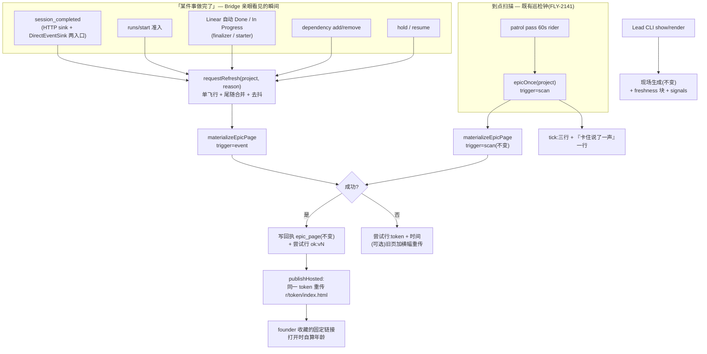

# FLY-2143 Epic 页面活化 — 探索
Issue: FLY-2143 (https://linear.app/geoforge3d/issue/FLY-2143/2108d-epic-页面活化事件扫描双路更新过期自报卡住上页可见)
日期: 2026-09-05
基于: 无(上游输入 = `product/doc/FLY-1969-auto-scheduling-operating-model/prd.md` v2.4 R5/R6/§1.2;FLY-2140/2141/2142 三单的 exploration / plan / design-correction / milestone;本分支 `flywheel-FLY-2143` 头 `79f6fc39b` = `origin/main` 的代码)

> 成色标记:✅ = 本单亲手核过原件(文件+行号或命令输出);📖 = 引自上游文档、未复核;⬜ = 未知,进 research 或留白;🔶 = 本单的建议/默认值,可被 Lead 推翻。
> Linear MCP 本会话 401,issue 正文取自 `.claude/skills/linear-issue-context/SKILL.md`(Bridge 注入,与 Lead 派发词逐字一致 ✅)。

---

## 0. 本单是什么

Epic FLY-2108 五张子单里的 **D**,前三张已 ship(✅ `engineering/doc/milestones/FLY-2140.md` / `FLY-2141.md`;FLY-2142 PR #1075 已合入 `1f2500d8a`):

| 子单 | 给了什么 | 本单接着用 |
|---|---|---|
| A · FLY-2140 | 页面内容模型(`Cell` = 值 + 出处 + `observed_at` + `source_updated_at`);每次请求现场生成;`epic_page` 表只存**渲染回执**(何时生成、trigger、来源摘要),⛔ 不存页面值;`generator.trigger` 三值 `manual/event/scan`;`items[].signals: []` 预留位 | 年龄可算;`event` 触发值已预留;`signals` 是 R6 的落点 |
| B · FLY-2141 | 巡检钟(patrol tick)上每轮 `materializeForScan(project)`(trigger=`scan`),同 pass 同项目一次;tick 正文三行「还剩什么」;失败走稳定 `unavailable` token | 扫描路**已经存在**,本单只在其后追加动作 |
| C · FLY-2142 | Linear 是依赖账本唯一事实源;`dependency_review` 格;Bridge 写路由 `add/remove/discover/note` | 账本写动作是「某件事变了」的事件源之一 |

**本单要做的三件(issue 正文逐字)**:
1. 双路更新:某件事做完就触发更新 + 到点扫描同步核对。两条都在是互兜,⛔ 不是冗余。
2. 过期自报:页面必须能表达「我这一格是什么时候的」——说不出自己多旧的页面和错的页面在她眼里一样。
3. R6:IC 卡住「说一声」落在 Epic 页面上(第一顺位收件人 = Lead),⛔ 不是每次卡住都发她。

**硬边界(继承)**:⛔ 不加新 flag(prd.md L176 📖;FLY-2141 plan §0.3 ✅「不加新 flag;频率不写死」);⛔ 不新增独立 Lead 通道(Lead 2026-09-04 裁定,FLY-2141 plan §0.3 ✅);⛔ 不写死谁用谁不用;通用主语 = 任意 Lead + 任意项目;每格必有出处;⛔ 不从 Linear 正文推断事实。本单是设计节点:不写实现代码、不合并、不部署。

---

## 1. 先把五个词钉住

| 词 | 她的原话 / 出处 | 本单的定义 |
|---|---|---|
| **活** | 「初始定好后**持续更新**」(prd.md R5 ✅ L286) | 页面不是一次性快照;它有一条持续被刷新的时间线,读者拿到的永远是**最近一次成功刷新**的那份 |
| **过期** | 「页面 outdated 会有负面影响」(她自己点的代价 ✅ L292);「每一格能说出自己是什么时候的」(✅ L302) | ⛔ 本单**不定义**「多旧算过期」(那是读者的判断);本单只保证页面在**每一层**都能说出自己多旧 |
| **hybrid** | 「某件事做完了就触发更新 + 到点扫描时同步检查」(✅ L288) | 事件路 = Bridge 亲眼看见的状态变化立刻触发再生成;扫描路 = 既有巡检钟到点再生成。**任一条失灵另一条兜住** |
| **卡住 / 说一声** | 「让他自己尝试修,但卡住时要跟我说一声」(R6 ✅ L318);「是『说一声』,不是求救,也不是静默重试到死」(✅ L326) | 卡住 = **IC 自己声明**的卡住(不是 Lead 或 Bridge 从沉默推断的 —— `stuck-runner-remanage.md` ✅ L3-5 明令禁止从时长/pane 不变推断);说一声 = IC 已经在现有渠道留下的那条声明 |
| **看得到 / 不打扰** | 「她想看的时候看得到」✅ vs「它主动来找她」⛔(✅ L320-324);「第一顺位是那个 Lead…落在 Epic 页面上,⛔ 不是每次卡住都发一条给她」(✅ L332-333) | 卡住信号进**页面**和**Lead 的 tick**;⛔ 不向 founder 频道发任何消息 |

---

## 2. 现状审计(全部 ✅ 亲核)

### 2.1 页面今天怎么「活」

```
读者            入口                                          时机          滞后
Lead(CLI)      flywheel-comm epic-page show/render → POST     想看就发       0(现场生成)
Lead(tick)     patrol_tick 正文「还剩什么」三行                 到点(默认 60m) ≤1 周期
founder        Lead 手动 render → publish-report 托管快照       Lead 想给才有  无上限(快照永不更新)
```

- `POST /api/epic-page/generate` 每次调用都 `materializeEpicPage()`:拉 Linear 快照 → 读 StateStore 六格 → 生成 → 写回执(`packages/teamlead/src/bridge/epic-page-route.ts` L148-178)。同项目串行(`generationTails`,L146)。trigger 恒 `manual`。
- 扫描路:`patrol-tick.ts` L198-220 `epicOnce(project)` 同 pass 同项目只物化一次,trigger=`scan`,成功后写回执(`epic-residual-scan.ts` L129-141);失败映射为 8 个稳定 token(`residual.ts` L44-53)。巡检节奏:GatePoller 3 s 一 tick(`plugin.ts` L9871)× 每 20 tick 一次 patrol pass(`gate-poller.ts` L310)= 60 s rider;每 Lead 按 `interval_minutes` 相位到点(默认 60,范围 10..1440,`packages/config/src/patrol-config.ts` L9-11)。
- **事件路不存在**:`trigger: "event"` 只在类型和守卫里(`model.ts` L118、`receipt.ts` L18),全仓无生产写点。
- `epic_page` 表 = 只写回执:`version / generated_at / trigger / source_digest` + 来源列表(`StateStore.ts` L2007-2012、L9532-);存储守卫拒绝任何计算顺序字段(`receipt.ts` L22-24)。没有渲染代码回读它(FLY-2140 plan §11.5 ✅)。

### 2.2 页面今天怎么说自己多旧

- 每格:`observed_at`(我们何时看到)+ `source_updated_at`(来源自己说何时变的),HTML 审计格里带相对时间(`render-html.ts` L83-90 `relativeTime(iso, now)`)。
- 页头:只有一行 `生成时间: <generated_at>`(`render-html.ts` L350;Markdown 同,`render-markdown.ts` L259)。⛔ **没有**「相对现在多旧」「上次刷新是哪条路」「下一次到点扫描预计何时」「上次刷新失败了没有」。
- `now` 是 Bridge 渲染时刻:CLI 现场生成时年龄恒 ≈0;**托管快照被打开时,页面不知道自己已经多旧**(HTML 自带 `default-src 'none'` CSP、无脚本,`render-html.ts` L342)。
- 生成失败时(Linear 不可达 → 502 `linear_unavailable`,L84-86):**说不出「上次成功是什么时候」**。FLY-2140 exploration §5 否决「只算不存」的理由正是这一条(✅ L207),但最终实现把存储降成了回执 —— 回执里有 `generated_at`,只是没人回读。

### 2.3 「卡住说一声」今天真实落在哪

| IC 的动作 | 落点(表 / 字段) | 库 | 页面今天读不读 |
|---|---|---|---|
| `flywheel-comm complete --route blocked --summary …` | `sessions.status='blocked'` + `decision_route='blocked'`(`event-route.ts` L1663、L1719;`sessions` 列 L3436、L3445) | StateStore | 只读 `status`(session 格 `latest[].status`),⛔ 不投影 `summary`/`last_error`(FLY-2140 plan L50 泄漏哨兵 ✅) |
| turn-ended hook `runner-stopped` 报告(reason = `done/awaiting_approval/blocked/quota/context_full/error`,`runner-stopped.ts` L328-383) | CommDB `questions` 行,`kind='report'`,id `rstop-<32hex>`,正文前缀 `RUNNER-STOPPED kind=runner_stopped `(`runner-stop-report.ts` L7-19;`db.ts` L1657-1660) | CommDB | 不读 |
| `flywheel-comm ask`(非阻塞问题)/ `gate question`(阻塞) | CommDB `questions`(`ask.ts` L38 `insertQuestion`),Lead 端 `pending` 可列未答 | CommDB | 不读 |
| DAG run 被 hold | `workflow_run.status='held'`(`StateStore.ts` L21090)+ `latest_hold_reason`(L45029) | StateStore | 读 `run[].status`,不读 hold reason |

Bridge 侧**没有**「session_stuck」这类活的推断事件(`lead-runtime.ts` L19 注释:legacy,no longer emitted ✅)。⇒ R6 的信源只能是 **IC 自己的声明**,这与 `stuck-runner-remanage.md` 的禁令一致。

### 2.4 「某件事做完了」在 Bridge 里是哪几个瞬间

| 瞬间 | 代码点 | 备注 |
|---|---|---|
| runner 收工(HTTP sink) | `event-route.ts` L1586- `session_completed` 分支(route ∈ auto_approve/needs_review/blocked/ship_attempt_failed/no_code/pr_handoff/phase_design_complete) | 同一 payload 有**两个**入口(FLY-2148 教训,`MEMORY` ✅):DAG 入册节点在 L690/L723 附近先返回 |
| runner 收工(直连 sink) | `DirectEventSink.ts` L628 `emitCompleted` | 生产主路径(`post-merge.ts` 头注释 ✅) |
| PR 合并 → Linear 自动 Done | `linear-issue-finalizer.ts`(只在 `runPostShipFinalization` 内,merged 证据后) | Bridge **自己**改 Linear 的两个点之一 |
| 派单开始 → Linear In Progress | `linear-issue-starter.ts` | 另一个 |
| 派单 / 准入 | `POST /api/runs/start` → `upsertSession`(`StateStore.ts` L7680) | 「账面执行体」格变 |
| 依赖账本写入 | `POST /api/dependency/*`(FLY-2142) | Linear 关系变 ⇒ `ready.v1` 可能变 |
| hold / resume | workflow hold 路由(`hold.ts` L26-27) | `run` 格 + R6 信号变 |
| founder 在 Linear 手动拖单 / 改关系 / 取消 | **Bridge 看不见**(全仓无 Linear webhook 摄入,`grep -i webhook` 只命中 Vercel/deploy) | 只能靠扫描路 —— 这正是「两条都要在」的实证 |

### 2.5 托管页面的机制(founder 看的那份)

- `POST /api/reports/publish`:每次 `randomHex(16)` 新 token(`report-registry.ts` L410),上传 blob `r/<token>/index.html`,gateway 按 token 取 blob、`useCache:false`(`report-gateway-runtime.ts` L56-58);保留 14 天,以 blob `uploadedAt` / registry `createdAt` 计(`report-retention.ts` L1-8、`report-blob-store.ts` L96-125)。
- registry 在本地也保存每份 HTML 文件(commit ① 写文件,L15-17 头注释)。
- 支持交互脚本:`<script nonce="__CSP_NONCE__">` 占位由 `injectHeadMeta` 铸 nonce 并注入匹配 CSP(L545-578);**若 HTML 自带 CSP meta 则不注入**(头注释 L21-24)—— Epic 页面今天自带 CSP,所以托管后也无脚本。
- 没有「稳定别名 / 覆盖同一 token」的能力(`grep -i "latest|alias"` 在 `reports-route.ts` 零命中)。

---

## 3. 过期的三张脸(问题分解)

| 脸 | 谁在问 | 今天 | 本单要补的 |
|---|---|---|---|
| **① 读者副本多旧** | 打开托管页 / 读 tick 三行的人 | 托管页不知道自己被打开时多旧;tick 三行带两个时间戳(已够) | 托管页打开时**自己算年龄**(nonce 脚本;无脚本时退化为静态「生成于」);页头写清是哪条路刷的 |
| **② 观测多旧** | 每一格 | `observed_at` 已有 | 页头汇总「来源最旧观测」+「下一次到点扫描预计」 |
| **③ 上次为什么没刷成** | 生成失败时 | 502,什么都说不出 | 记录每次刷新**尝试**(成功 → 回执;失败 → 稳定 token + 时间),让页面/CLI 能说「上次成功 X;自那以后 N 次失败(token)」 |

第三张脸是她那句「说不出自己多旧的页面和错的页面一样」的直接对应:**失败也要留痕**,否则「刷新没跑」和「刷新跑了没变化」同痕迹(`MEMORY` 两状态一痕迹族 ✅)。

---

## 4. 方案选项与取舍

### 4.1 页面在哪里「活」(决定事件路给谁看)

| 选项 | 好处 | 代价 | 判 |
|---|---|---|---|
| **A 只让 Lead 的入口活**:CLI 现场生成 + tick 三行;founder 仍靠 Lead 手动 publish 快照 | 零新机制 | 事件路对读者**没有消费者**(Lead CLI 本来就 0 滞后);founder 的那份永远是快照,「持续更新」对她不成立 | ⛔ 违背 R5「持续更新」的读者主语(她自己) |
| **B 每次事件/扫描后重新 publish 一份新快照并发到 Discord** | 用现成 publish-report | 每小时一条消息 = 「打扰」;URL 每次变,她收藏不了 | ⛔ 违背 R6「不打扰」 |
| **C 每项目一个固定托管地址,Bridge 就地重传** 🔶 | founder 收藏一次链接永远最新;⛔ 不发消息;event/scan 两路都写同一个地址;14 天保留随每次刷新续期 | report-registry 要支持「指定 token 重发」;blob `put` 需 overwrite;StateStore 新增一张小表存 `project → token` | ✅ **采纳(待 Lead Q1 确认,question `3608d499`)** |

C 的诚实边界:托管页是**投影副本**(她点过的代价);它靠三层自报(§3)而不是靠「永不过期」来回答她;Bridge 停刷 14 天链接会死 —— 页面死在喂它的管线之后,而不是活得比管线久(那才是假新鲜)。

### 4.2 事件路怎么接(在哪儿触发)

| 选项 | 好处 | 代价 | 判 |
|---|---|---|---|
| **甲 在 StateStore 写方法里挂钩子**(`upsertSession` 等) | 一处覆盖所有 | StateStore 变成有副作用的层;sql.js 事务里做异步 I/O;`upsertSession` 被心跳等高频路径调用,噪音大 | ⛔ |
| **乙 挂在 `events` 审计表 `insertEvent`** | 也是一处 | 审计事件种类不等于「页面会变」的集合,要再过滤;耦合审计语义 | ⬜ research 里数一次 `insertEvent` 种类,若恰好等价再考虑 |
| **丙 枚举 Bridge 的「页面会变」站点,各调一次 `requestRefresh(project, reason)`** 🔶 | 每个触发点有名字、可测、可数;漏一个由扫描路兜(这正是双路的意义) | 站点列表要维护;必须覆盖 **两个** `session_completed` 入口 | ✅ **采纳** |

`requestRefresh` 自身:每项目**单飞行 + 尾随合并**(沿用 `generationTails` 形状)+ 短去抖(🔶 5 s,不新增 flag,常量),保证一串事件只打一次 Linear;失败不抛、只记尝试。

### 4.3 过期怎么自报(§3 三层落点)

- 数据层:不动(A 已给)。
- 页面层:新增页头 **freshness 块**(JSON `freshness` 派生格 + HTML/Markdown 渲染):`generated_at`、`trigger`、`refresh_reason`(事件名或 `scan`/`manual`)、上一次成功刷新(版本 + 时间)、自上次成功以来失败尝试(次数 + 最近 token + 时间)、来源最旧 `observed_at`、`next_scan_expected_at`(由 patrol 相位算出的**预计**,标明是预计)。规则号 🔶 `freshness.v1`,标注「未获 founder 裁定的默认规则」。
- 读者层:托管 HTML 去掉自带 CSP、改用 `__CSP_NONCE__` 脚本,打开时显示「你打开时它已 N 分钟旧」并每分钟更新;脚本被拦或无 JS 时静态文字仍在。⛔ 不引外部资源。
- 失败层:StateStore 新表 🔶 `epic_page_refresh`(project, attempted_at, trigger, reason, outcome = `ok:<version>` | `<unavailable token>`);成功一行 + 回执一行,失败只有尝试行。CLI `epic-page status` 🔶 打印最近成功/失败。**失败时托管页要不要重传带「刷新失败于 X」横幅的旧页**:见 §4.5。

### 4.4 卡住怎么上页(R6)

信源 = §2.3 表里的 IC 声明,三类(待 Lead Q2 确认,question `4965e285`):

| `signals[].kind` 🔶 | 来源 | provenance | 展示字段(全部有界) |
|---|---|---|---|
| `declared_blocked` | 该子单最新 session `status='blocked'` 或 `decision_route='blocked'` | `statestore:sessions` | `execution_id8`、`since`(source_time)、`route` |
| `runner_stopped` | CommDB `questions` kind=report、id `rstop-*`、正文前缀合法、reason ∈ `blocked/quota/context_full/error`(⛔ `done`/`awaiting_approval` 不算卡住) | 🔶 新 kind `commdb:questions` | `execution_id8`、`reason`(枚举)、`since`、`answered`(bool) |
| `question_pending` | CommDB `questions` 发给该 Lead、来自该子单 execution、未回答(含 gate) | `commdb:questions` | `execution_id8`、`question_id`、`since`、`blocking`(gate 与否) |
| `run_held` | `workflow_run.status='held'` | `statestore:workflow_run` | `run_id`、`hold_reason` token、`since` |

⛔ 不投影 `summary` / `last_error` / 问题正文(泄漏哨兵约束延续);要看原话去 Lead 收件箱。页面上新增「卡住说了一声的」总览格(`stuck_items` 🔶 派生,规则 `signals.v1`)排在「现在可以开始的」之后;每张子单卡多一行「说了一声」。tick 正文在 B 的三行后加**一行**(不是新通道):「卡住说了一声的 N 张:FLY-x(declared_blocked,2h)…」。⛔ 不向 founder 发消息;她打开托管页就看到。

### 4.5 刷新失败时托管页怎么办

| 选项 | 判 |
|---|---|
| 不动托管页(它的 `generated_at` 本来就诚实,读者层脚本会算出年龄越来越大) | ✅ **v1 底线** |
| 重传旧 HTML 并注入「刷新于 X 失败(token)」横幅(registry 本地存有上次 HTML) | 🔶 v1 纳入但列为可裁掉的最后一块:它是 §3 第三张脸在 founder 面前的唯一表达;代价是「重传旧内容」要防把横幅当成新数据(横幅只写失败事实,`generated_at` 不变) |

### 4.6 扫描路要改什么(几乎不改)

B 的 `materializeForScan` 已在每轮生成 trigger=`scan` 的页面并写回执。本单只在成功后追加 `publishHosted(page)`、失败后追加「记尝试」;tick 三行后加 §4.4 那一行。⛔ 不改 `ready.v1` / `scope.v1` / 巡检相位 / 空名册逻辑 / `unavailable` token 集(只**追加**发布相关 token)。

---

## 5. 采纳形态(总图)



**数据结构增量(全部 additive)**:
- `EpicPage.freshness`(派生格,`freshness.v1`)+ `EpicItem.signals: Signal[]`(从恒空扩为有界结构)+ `EpicPage.stuck_items`(派生,`signals.v1`)+ provenance 新 kind `commdb`。
- StateStore:`epic_page_publication(project_name PK, token, first_published_at, last_published_at, last_version)`;`epic_page_refresh(project_name, attempted_at, trigger, reason, outcome)`(append-only,有保留上限)。
- report-registry:`stagePublish(project, html, title, { token? })` —— 指定 token 时就地更新 entry(`createdAt` 刷新),blob `put` overwrite。
- 回执表 `epic_page` **不变**(仍只写来源)。

---

## 6. 与兄弟单 / 既有合同的接口

| 对象 | 本单给 / 改 | 本单**不**做 |
|---|---|---|
| A 的内容模型 | 只追加字段与 provenance kind;`schema_version` 保持 1(消费者忽略未知字段;⬜ research 核 `assertEpicPage` 的 exact-keys 是否要求 bump) | 不改任何既有格、规则号、回执守卫 |
| B 的扫描路 | 成功后追加发布、失败后追加记尝试;tick 加一行 | 不改相位、空名册、`ready.v1`、token 集语义 |
| C 的账本 | 写路由成功后调 `requestRefresh` | 不改账本合同 |
| E(FLY-2144)容量 | 无 | 页面不显示容量 |
| Lead 规则 `runner-patrol-rules.md` §0.9 | 追加:第四行怎么读;`epic-page status` 怎么看新鲜度;卡住信号是 IC 声明不是 Bridge 推断 | 不改 STEP 1–6 |
| founder | 一个固定链接(由 Lead 用既有 `founder-html-delivery` 规则发一次) | ⛔ 不新增任何自动发往她的消息 |

---

## 7. 验收怎么证伪(plan 里落成测试)

1. **事件路**:对夹具项目触发每一个 §2.4 站点各一次 ⇒ `epic_page` 新增 trigger=`event` 回执各一条,且同项目 10 ms 内连发 20 个事件只产生 1–2 次物化(合并)。漏挂一个站点 = 该站点用例红。
2. **扫描路兜底**:关掉全部事件站点(mock)⇒ 下一轮 patrol 后回执 trigger=`scan` 出现、托管 blob 被重传。
3. **过期自报**:Linear mock 502 ⇒ CLI `status` 打印「上次成功 vN@T,自那以后 1 次失败 transient: linear_unavailable@T2」;托管页 HTML 含 `generated_at` 与 nonce 脚本,静态文字在脚本被拦时仍可读(`--self-check` 对隐藏态必须变红,`MEMORY` 教训 ✅)。
4. **R6**:夹具 session `status=blocked` ⇒ 该子单 `signals` 含 `declared_blocked`;CommDB 一条未答 `rstop-*`(reason=quota)⇒ `runner_stopped`;`reason=done` ⇒ ⛔ 不出现;tick 正文多且只多一行;founder 频道零消息(负控)。
5. **不泄漏**:夹具 `summary`/`last_error`/问题正文放哨兵串,`JSON.stringify(page)` 与 HTML 都不含。
6. **稳定地址**:两次发布同一项目 ⇒ 同一 token、registry 一条 entry、`createdAt` 前进、blob 路径相同。
7. **两状态一痕迹**:「没跑」vs「跑了没变」⇒ `epic_page_refresh` 行数不同(前者 0 行)。

---

## 8. 开放问题

| # | 问题 | 状态 |
|---|---|---|
| Q1 | 稳定托管地址(§4.1 C)要不要做;不做则事件路无读者 | 已问 Lead(`3608d499`),默认按 C 继续 |
| Q2 | Epic 生成器能否读 CommDB 作为 R6 信源(§4.4 三类中的两类) | 已问 Lead(`4965e285`),默认按三类继续 |
| Q3 | Vercel blob `put` 覆盖同路径的确切开关(`allowOverwrite`)与 gateway 缓存 | ⬜ research 核 SDK 版本 |
| Q4 | `assertEpicPage` 的 exact-keys 与 `signals` 恒空断言:追加字段是否需要 `schema_version: 2` | ⬜ research |
| — | PRD §8 三条 founder 开放问题(§8-1 一次扫描两判断、§8-2 哪些可放、§8-3 怎么算做完)| ⛔ 本单不碰、不当已定 |
