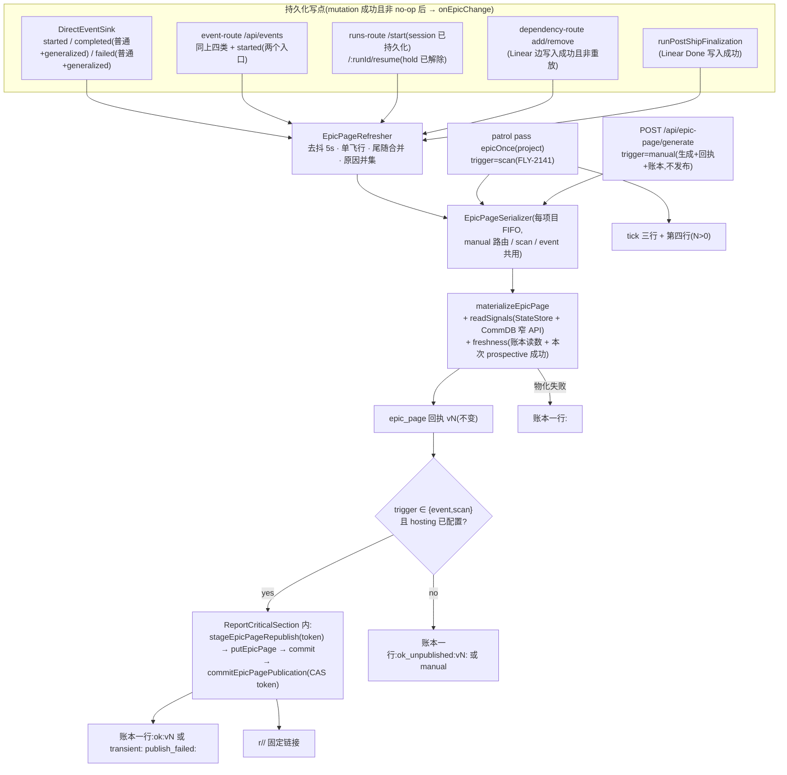

# FLY-2143 Epic 页面活化 — 实施计划
Issue: FLY-2143 (https://linear.app/geoforge3d/issue/FLY-2143/2108d-epic-页面活化事件扫描双路更新过期自报卡住上页可见)
日期: 2026-09-05
基于: research.md(同文件夹;含 Lead 对 Q1 `3608d499` / Q2 `4965e285` 的逐字裁定);Codex design review R1–R4(见 review-log)

> 行号基于分支头 `79f6fc39b`(= `origin/main`)。本计划是 implement 节点的唯一输入;implement 不得改本文件,返工走 `design-correction.md` 增量。**本版(R1–R4 修订)在 §2.1/§2.2/§2.3/§2.4/§3/§5 处取代 research.md 的对应段落**(research §2.2 站点清单、§3.1 账本词表、§4.1 Signal 形状、§5.1 表结构);冲突以本文为准。

---

## 0. 目标 / 非目标 / 授权

### 0.1 目标(可证伪)

| # | 目标 | 证伪方式 |
|---|---|---|
| G1 | **双路更新**:Bridge 亲眼看见的「某件事做完」(持久化写点)触发页面再生成(trigger=`event`);既有巡检扫描(trigger=`scan`)继续到点再生成;两路写同一份刷新账本与同一个托管地址 | 关掉任一路,另一路仍在 ≤1 巡检周期内把托管页刷到最新;两路都关,`epic_page_refresh` 零新行 |
| G2 | **过期自报**:数据层(每格 `observed_at`,不变)、页面层(`freshness` 格)、读者层(托管页打开时自算年龄)、失败层(刷新账本)四层都能说出自己多旧;生成失败时能说出「上次成功是何时、之后失败几次、最近失败 token」 | Linear mock 502 时 `status` 给出 `last_published`/`last_generated` 与 `publish_failures_since_last_published`;托管 HTML 脚本被拦时静态 `generated_at` 仍可读,脚本在时年龄文本随时间变化 |
| G3 | **R6 卡住上页**:IC 自己声明的卡住(四类)出现在子单卡与「卡住说了一声的」总览格;「正当等 founder」单独显示不计入;tick 只在 N>0 时多且只多一行;founder 频道零消息 | 夹具五类信号各一 ⇒ 页面/tick 逐项断言;负控:`reason=done` 报告与 `waiting_founder` 不进 `stuck_items`;Discord 发送 mock 调用数 = 0 |
| G4 | **稳定托管地址**:每项目一枚固定 token;事件/扫描刷新都就地重传同一路径;保留期从最后一次成功刷新起算;通用报告语义不变 | 两次刷新同 token、registry 一条 entry、`createdAt` 前进;两次 `POST /api/reports/publish` 仍得两个不同 token |

### 0.2 非目标

不做多项目 quota、分层调频、Linear webhook、刷新失败横幅重传(research §3.4)、给通用 `stagePublish`/`putReport` 加覆盖、新 flag/配置键、新 Lead 事件类型、告警器、向 founder 自动发消息、存页面值、改 `ready.v1`/`scope.v1`/`subtraction.v1`/巡检相位/空名册逻辑、改 `projects.json`、改 `CLAUDE.md`、通用「publication 子系统」。hold **创建**不触发事件(≤1 周期滞后,已知边界);manual 生成不发布固定页(§2.3)。

### 0.3 授权记录

| 决定 | 来源 | 落点 |
|---|---|---|
| 双路 hybrid、每格出处、过期自报 | founder,PRD R5(✅ L286-305) | 全文 |
| 卡住可见不打扰;第一顺位 Lead;不每次发她 | founder,PRD R6(✅ L316-333) | §4、§6 |
| 稳定托管地址 + 四条边界(最小结构 / 窄 API / 就地刷新 age-only / 不做备选) | Lead Q1 `3608d499`(research §0 逐字) | §2.4、A-①②③④ |
| 三类信号含 CommDB + 四条边界(只读有界 fail-soft / 只投影 kind·时间·exec 前 8 位·枚举 reason / waiting_founder 分流 / tick 一行不发 founder) | Lead Q2 `4965e285`(research §0 逐字) | §2.1、§4、B-①②③④ |
| `signals: []` 是 FLY-2140 冻结的预留位,D 只能**填值**不能改形状 | FLY-2140 plan L178-180 | §2.1 |
| 不新增独立 Lead 通道;binding 缺席字节不变 + 启动一行 | Lead 2026-09-04(FLY-2141 plan §0.3) | §3.4、§6 |
| `freshness.v1`、`signals.v1` 为未获 founder 裁定的默认规则 | 本单 | 渲染标注 |

---

## 1. 架构



新文件:`packages/flywheel-comm/src/epic-page-signals.ts`(CommDB 窄 API 的 DTO/文法,供 db.ts 与 teamlead 共享类型)、`packages/teamlead/src/epic-page/signals.ts`、`packages/teamlead/src/epic-page/freshness.ts`、`packages/teamlead/src/bridge/epic-page-refresher.ts`(串行器 + 刷新器)、`packages/teamlead/src/bridge/epic-page-publisher.ts`、`packages/teamlead/src/bridge/report-critical-section.ts`。改动文件见 research §1。

---

## 2. 合同(稳定身份与显示标签)

### 2.1 内容模型增量(`model.ts`)

```ts
// RULE_IDS 追加
"freshness.v1" | "signals.v1"
// MISSING_REASONS 追加
"commdb_error" | "commdb_truncated"
// Provenance 追加(与 statestore 同形)
| { kind: "commdb"; table: string; key: Record<string, string> }
// gaps.face 追加
"signals_statestore" | "signals_commdb"

export const SIGNAL_KINDS = ["declared_blocked","runner_stopped","question_pending","run_held","waiting_founder"] as const;
export const STOP_REASONS = ["blocked","quota","context_full","error"] as const;
export const ID8_GRAMMAR = /^[A-Za-z0-9._-]{1,8}$/;      // opaque 前缀,不假设 hex(既有账本值如 `exec-a-l`)

/** 冻结的 `items[].signals` 裸数组只填值不改形状;每条自带出处与观察时间(审计元数据,非业务投影)。 */
export interface Signal {
  kind: SignalKind;
  since: string;                 // RFC3339 UTC(键名不以 _at 结尾)
  execution_id8: string;         // ID8_GRAMMAR;= 承载该信号的身份前 8 位:session execution id;run_held 时为当前节点 execution id,无则 run_id
  reason?: StopReason;           // 仅 runner_stopped
  provenance: Provenance;        // statestore | commdb(同一 kind 只有一种来源)
  observed_at: string;
}
// EpicItem.signals: Signal[]                                       ← 形状不变(冻结),从恒空改为可填
// EpicItem 追加(必填):来源健康格,两来源分开表达「查了、查到 n 条 / 查失败」
signal_sources: {
  statestore: Cell<{ signals: number }>;   // missing ⇒ statestore_error,gaps face signals_statestore
  commdb:     Cell<{ signals: number }>;   // missing ⇒ commdb_error,gaps face signals_commdb
};
// generator 追加(additive):reasons: RefreshReason[] —— 单一导出 `REFRESH_REASONS` 闭集(§2.2.3),非空、去重、字典序;manual ⇒ 恰 ["manual"],scan ⇒ 恰 ["scan"];守卫拒绝未知串/重复/非规范序(M0 负控);receipt、账本序列化/解析、页面三处共用同一定义
// EpicPage 根键追加(必填):
freshness: FreshnessSection;             // §2.2.3:一组各自带出处的 Cell,⛔ 不是一个 Cell(Cell.value 内禁 *_at 键,`model.ts` L184-196)
stuck_items: Cell<Array<{ item: string; kind: Exclude<SignalKind,"waiting_founder">; since: string; execution_id8: string }>>;
//   derived signals.v1,from = 实际 Signal 来源节点 `/items/i/signals/j`(每条进入 stuck 的 signal 各一指针)+ 两个 signal_sources Cell;pointer guard 仅对 `signals.v1` 窄扩为「Cell 或合法 Signal 来源节点(有 kind/provenance/observed_at、无 value)」,其它 rule 仍只接受 Cell(M0 负控);排序:since 升序 → identifier → kind
```

**归并(确定性、总排序)**:第一阶段在 CommDB 窄 API 内完成 —— SQL `ORDER BY created_at, id`(row id 只用于排序,不返回),按 `(完整 execution id, kind)` 归并:`question_pending`/`waiting_founder` 取最早行;`runner_stopped` 取最新行的 `reason` 与 `since`;返回值已无重复 `(exec, kind)`。第二阶段在 teamlead:按 `(execution_id8, kind)` 归并前缀碰撞,取最早 `since`;`since` 相等 ⇒ 完整 execution id 字典序小者;仍相等 ⇒ `reason` 按 `STOP_REASONS` 枚举序。StateStore 两类同法(`declared_blocked` 取最新 session 行,`run_held` 取 run_id 字典序小者)。同 exec 的 `waiting_founder` 与 `question_pending` 是不同 kind,并存。M3 RED:同前缀、同 since、不同 reason ⇒ 结果与输入顺序无关。

守卫(`assertEpicPage`):`signals` 仍是数组,每项 exact-keys(`reason` 仅 `runner_stopped` 可有且必有)、枚举、`since`/`observed_at` 时间戳、`execution_id8` 文法、`provenance` 只允许 `statestore`/`commdb`;同 item 内 `(kind, execution_id8)` 唯一;`signal_sources.*` 是 Cell 且 `value.signals` = 该来源 signal 计数(missing 时该来源 signal 必为 0 条);`stuck_items` 必须等于按 `signals.v1` 重算且其 `from` 覆盖每条计入的 signal(M0 RED:signals 内容变、count 不变 ⇒ 指针集必变);`freshness` 逐叶断言:`current` 精确 `statestore epic_page`、`last_generated/last_published/publish_failures/last_failure/last_publish_failure` 精确 `statestore epic_page_refresh`、`hosted` 精确 `statestore epic_page_publication`、只有 `oldest_source/next_scan` 是 `derived freshness.v1`;`schema_version` 仍 `1`。`stripTimestamps` 不动(`since` 保留进 digest)。回执(`receipt.ts`):`buildEpicPageRenderReceipt` 的 visitor 增加显式分支——`signals[]` 条目(有 `provenance`+`observed_at`、无 `value`)也作为 source 记入 `sources`(path `/items/i/signals/j`);`assertEpicPageRenderReceipt` 接受 `commdb` provenance。

### 2.2 StateStore 增量

#### 2.2.1 表

```sql
CREATE TABLE IF NOT EXISTS epic_page_publication (
  project_name       TEXT PRIMARY KEY,
  token              TEXT NOT NULL UNIQUE CHECK (length(token) = 32),
  first_published_at TEXT,
  last_published_at  TEXT,
  last_version       INTEGER CHECK (last_version IS NULL OR last_version > 0),
  CHECK ((first_published_at IS NULL) = (last_published_at IS NULL)
     AND (first_published_at IS NULL) = (last_version IS NULL))     -- 预留态三者全 NULL;已发布态三者全非 NULL
);
CREATE TABLE IF NOT EXISTS epic_page_refresh (
  project_name TEXT NOT NULL,
  attempted_at TEXT NOT NULL,
  trigger      TEXT NOT NULL CHECK (trigger IN ('manual','event','scan')),
  reason       TEXT NOT NULL,
  outcome      TEXT NOT NULL,
  created_at   TEXT NOT NULL DEFAULT (datetime('now'))
);
CREATE INDEX IF NOT EXISTS idx_epic_page_refresh_project_at ON epic_page_refresh(project_name, attempted_at DESC);
```

#### 2.2.2 方法

- `reserveEpicPageToken(projectName): { token }` —— 无行则插入预留态(随机 32-hex);有行返回既有 token;token 永不变。
- `commitEpicPagePublication({ projectName, token, publishedAt, version })` —— CAS:`WHERE project_name=? AND token=?`;不匹配 ⇒ throw(`epic_page_publication_token_mismatch`);首次成功写 `first_published_at`。
- `getEpicPagePublication(projectName): { token, published: boolean, first_published_at?, last_published_at?, last_version? } | undefined`。
- **迁移兼容(M1)**:`migrateEpicPage()`(`StateStore.ts` L5230-5295)重建旧全页文档回执时,legacy generator 无 `reasons` ⇒ 迁移专用归一化 `reasons = [legacy trigger]`;新生成回执仍强制严格校验(⛔ 不全局放宽)。既有迁移回归扩展为断言归一化 reasons 与重开成功。
- `getNextEpicPageVersion(projectName): number`(`MAX(version)+1`;只允许在共享串行器内调用);`insertEpicPageRenderReceipt` 追加可选 `expectedVersion`,分配值不等 ⇒ throw `epic_page_version_drift`(attempt 记 `transient: epic_scan_failed`)。
- **变更结果合同(M1,§2.9 依赖)**:`recordEnrolledTerminalSignal` 返回值追加 `statusChanged: boolean`;新增 `upsertSessionReturningChange(...)` (或让 `upsertSession` 返回 `{ statusChanged }`,现返回 `void`,L7680-7697) —— 均按**页面相关状态迁移**定义(absent/pending→running、新终态 = true;重复 running、terminal→running 免疫、重复终态、generalized/legacy 重放 = false;附带写 event/teardown 事实不算变化)。七种情形在挂钩前先钉 RED。
- `insertEpicPageRefresh({ projectName, attemptedAt, trigger, reasons: RefreshReason[], outcome })` —— 事务内保留每项目最近 200 行;`reasons` 去重排序逗号连接;`outcome` 经 `parseEpicPageRefreshOutcome` 校验。**一次 attempt 恰好一行**(§2.3.3)。
- `getEpicPageFreshness(projectName): EpicPageFreshnessRead` —— **两条读模型分开**:
  - `last_generated`:最近一条 `ok:*` **或** `ok_unpublished:*` 行 `{version, attempted_at, trigger}`(「上次成功生成」);
  - `last_published`:最近一条 `ok:*` 行 `{version, attempted_at, trigger}`(「固定页上次成功发布」);
  - `publish_failures_since_last_published`:自最近 `ok:*` 行之后、`trigger ∈ {event,scan}` 的非 `ok:*` 行数(含物化失败与 `publish_failed`/`too_large`;**`ok_unpublished:*` 不清零、不计入**);
  - `last_publish_failure`:与上一条同集合同窗口的最近一行 `{attempted_at, token}`;`last_failure`:全局最近一条非 `ok*` 行;`last_attempt`:最近一行。
  反例 2:v1 `ok` → v2 event `publish_failed:blob` → v3 manual `linear_unavailable` ⇒ `publish_failures=1`、`last_publish_failure=v2 的 token`、`last_failure=v3 的 token`。
  **页面 vs status 的时间基准**:页面内的 prior 格描述「本版成功之前」的历史(成功重试后的页面仍显示 count=1);status 是 live 读数(同一时刻 count=0);标签必须把页面这组写成「本版之前」。
  反例必须钉:v1 `ok` → v2 event `publish_failed` → v3 manual `ok_unpublished` ⇒ `last_published=v1`、`publish_failures_since_last_published=1`、`last_generated=v3`。

#### 2.2.3 词表(闭集,单一导出 `EPIC_PAGE_REFRESH_OUTCOMES` + `parseEpicPageRefreshOutcome`)

| outcome | 含义 |
|---|---|
| `ok:<n>` | 物化 + 回执 vN + 固定页发布成功(Blob + registry + publication commit 三者都成) |
| `ok_unpublished:<n>:manual` | manual 路:物化 + 回执 vN,按设计不发布 |
| `ok_unpublished:<n>:skipped_hosting_not_configured` | event/scan 路:物化成功,hosting 未配置或 gateway 未迁移 |
| `ok_unpublished:<n>:skipped_hosting_unsupported` | event/scan 路:hostOverride 后端,Epic 固定页不支持 |
| `transient: publish_failed:stage` / `:blob` / `:registry` / `:publication` | 物化成功、回执已写,发布在 §2.4 的 P1–P4 相位失败(`last_published` 不前进;P2 起 Blob 状态为 unknown) |
| `structural: epic_html_too_large` | 物化成功,HTML > 512 KiB,不上传 |
| residual 的 8 个 token(`residual.ts` L44-53) | 物化失败 |
| `skipped: project_unbound` / `skipped: linear_not_configured` | 进程内每项目各最多一行 |

`reason` 词表(闭集):`session_started, session_completed, session_failed, run_started, run_resumed, linear_done, dependency_changed, scan, manual`。

`FreshnessSection` 形状(每个叶子是 Cell,时间只出现在 Cell 的 `observed_at`/`source_updated_at`,⛔ value 内无 `*_at` 键):
```ts
freshness: {
  current:  Cell<{ version: number; trigger: string; reasons: string[] }>;  // statestore epic_page {project_name, version};observed_at = source_updated_at = generated_at(prospective);`reasons` 同时写进 render receipt(`EpicPageRenderReceipt.reasons`,规范化去重排序)并存于 `epic_page.receipt` 列,守卫断言 generator.reasons === receipt.reasons === current.value.reasons(M0 RED:reasons 改而 receipt 未改 ⇒ 拒绝)
  last_generated: Cell<{ version: number; trigger: string }>;   // statestore epic_page_refresh {project_name};source_updated_at = 该行 attempted_at;无 ⇒ missing no_prior_generation
  last_published: Cell<{ version: number; trigger: string }>;   // statestore epic_page_refresh;source_updated_at = 该行 attempted_at;无 ⇒ missing no_prior_publication
  publish_failures: Cell<{ count: number }>;                     // statestore epic_page_refresh(= publish_failures_since_last_published)
  last_failure: Cell<{ token: string }>;                         // 全局最近非 ok* 行(任意 trigger);source_updated_at = attempted_at;无 ⇒ missing no_prior_failure
  last_publish_failure: Cell<{ token: string }>;                 // 与 publish_failures 同集合同窗口(event/scan 且晚于 last_published);无 ⇒ missing no_prior_failure;页面「最近失败 token」只用这一格,⛔ 不与 last_failure 拼句
  hosted: Cell<{ token8: string; published: boolean; last_version: number | null }>;  // statestore epic_page_publication {project_name};source_updated_at = last_published_at(已发布时);无行 ⇒ missing no_publication
  oldest_source: Cell<{ path: string }>;                         // derived freshness.v1,from = 全部 source Cell 指针;value 指向 observed_at 最早的那格(时间读该格)
  next_scan: Cell<{ expected_in_seconds: number } >;             // derived freshness.v1,from ["/freshness/current"];相对 current.observed_at;无可派 Lead ⇒ missing no_scan_schedule
}
```
`MISSING_REASONS` 追加:`no_prior_generation | no_prior_publication | no_prior_failure | no_publication | no_scan_schedule`(根格 missing 不进 `gaps`;`gaps` 只覆盖 item faces,`rules.ts` 不变)。语义:托管页的 `current` 就是它自己这一版;其余格描述**它之前**发生了什么。发布失败的字节不可见(除 §2.4 列明的 post-commit 相位),失败由 `status` 与下一版页面带出。

### 2.3 串行器 / 刷新器 / manual 路(`epic-page-refresher.ts`)

#### 2.3.1 串行器
`EpicPageSerializer.run(projectName, op)`:每项目 FIFO promise 链(从 `epic-page-route.ts` L146-165 `generationTails` 抽出);路由、scan、refresher 注入**同一实例**(plugin 构造一次)。

#### 2.3.2 刷新器
```ts
export const EPIC_PAGE_REFRESH_DEBOUNCE_MS = 5_000;   // 常量,⛔ 非 flag
createEpicPageRefresher(deps): { requestRefresh(projectName, reason): void; flushForTest(): Promise<void> }
```
语义:`requestRefresh` 永不抛、不返回 Promise;unbound / 无 key ⇒ 进程内每项目只记一次 `skipped:*` 行并 log 一次;去抖窗内合并原因;飞行中再来 ⇒ 标记尾随一次;每次实际 attempt = `serializer.run(project, attempt)`。

#### 2.3.3 一次 attempt 的固定顺序(event / scan 共用;manual 只到第 ③ 步)
① 串行器内 `vN = getNextEpicPageVersion(project)`;**恰一次** `materialize(trigger, vN)`(含 signals、freshness 读数;`freshness.current = vN`)—— 抛 ⇒ 账本一行 `<unavailable token>`,结束(M3/M7 断言每 attempt `materialize` 调用恰一次)。
② `insertEpicPageRenderReceipt({expectedVersion: vN})`;drift ⇒ `transient: epic_scan_failed` 并记账,结束。
③ manual ⇒ 账本 `ok_unpublished:vN:manual`,返回文档(路由行为:回执不变 + 新增账本行 + 使用共享串行器;**不发布、不延长 TTL**;CLI `generate/show/render` 全部沿此语义)。
④ event/scan:按 §2.4 后端真值表 —— 不可发布 ⇒ `ok_unpublished:vN:skipped_hosting_not_configured` / `:skipped_hosting_unsupported`;可发布 ⇒ `publishHosted(page)` ⇒ 成功 `ok:vN`,失败**透传相位 token** `transient: publish_failed:stage|blob|registry|publication` 或 `structural: epic_html_too_large`。
⑤ 账本恰好一行(上述任一分支写且只写一次;用 `settled` 标志断言)。

### 2.4 发布器、临界区、registry / blob 窄 API

```ts
// report-critical-section.ts:最小进程内互斥(promise mutex),⛔ 不是通用发布子系统
export interface ReportCriticalSection { run<T>(op: () => Promise<T>): Promise<T>; }
```
- 使用者(三个,plugin 构造一个实例注入):`createReportsRouter` 的 publish 链(替换其私有 promise chain,行为不变)、Epic publisher(覆盖 stage → 上传 → commit → publication commit 全窗口)、Blob sweep(`plugin.ts` L5820-5846,覆盖 list → delete 全窗口)。
- `ReportRegistry.stageEpicPageRepublish(projectName, html, token, title?)`:token 必须匹配 `REPORT_TOKEN_RE`;**先**用同 token 替换既有 entry(`createdAt=now`、`bytes`、`title`),**再**做 age-only prune(与 `stagePublish` 同一段 prune 代码);无既有 entry ⇒ 新建。commit 三步不变。⛔ 无 count/bytes 分支。唯一非测试调用方 = publisher(A-② grep)。
- `VercelBlobReportStore.putEpicPage(token, html)` = `putReportObject(token, html, true)`;`putReport` 仍 `false`。
- `publishHosted(page)`(publisher):
  1. `token = store.reserveEpicPageToken(project)`(预留态可重试);
  2. `html = renderEpicPageHtml(page)`;> 512 KiB ⇒ `structural: epic_html_too_large`;
  3. `criticalSection.run(async () => { staged = registry.stageEpicPageRepublish(...); await blob.putEpicPage(token, staged.html); staged.commit(); store.commitEpicPagePublication({project, token, publishedAt: now, version: page.freshness.current.value.version}); })`。
- **后端真值表(与 `reports-route.ts` L270-293 一致)**:
  | `blobStore` | `registry.hosting().provider === "vercel-blob"` | `hostOverride` | Epic 固定页 |
  |---|---|---|---|
  | 无 | — | 无 | 不发布:`ok_unpublished:vN:skipped_hosting_not_configured`(启动一行) |
  | 有 | 否(gateway 迁移未完成) | 无 | 不发布:同上 token(⛔ 不得 CAS 成 published) |
  | 有 | 是 | 无 | 发布;URL = Blob gateway(`reportUrlForToken` 只在此后端有效) |
  | — | — | 有(QA override,走 `deployFiles`,不碰 Blob) | Epic 不支持:`ok_unpublished:vN:skipped_hosting_unsupported`;status `url:null`、`published:false` |
  只有实际可服务的后端才允许 publication CAS。测试:「blob token 有但 hosting marker 缺」「hostOverride active」两例都不得 published。
- **失败语义按相位,只写可观测事实(诚实边界:稳定覆盖架构没有跨 Blob / registry / SQLite 的原子切换)**:
  | 相位 | 失败后可观测状态 | 动作 | outcome |
  |---|---|---|---|
  | P0 `reserveEpicPageToken` 后、stage 前(渲染/大小检查) | publication:首次可能从「无行」变为「预留行」;三个 published 字段不前进;Blob/registry 不变 | 无 | `structural: epic_html_too_large` 等 |
  | P1 `stageEpicPageRepublish` 抛 | 同上;`staged` 不存在 | ⛔ 无 `staged` 可 abort | `transient: publish_failed:stage` |
  | P2 `putEpicPage` 抛(调用前失败、网络超时、或上传后返回值校验失败 `report-blob-store.ts` L158-180) | registry 与 published 字段不前进;**Blob 状态 = unknown / may already be overwritten**(不得断言旧页不变) | `staged.abort()`(commit 未开始) | `transient: publish_failed:blob` |
  | P3 `staged.commit()` 抛 | `commit()` 入口先置 `done=true`(`report-registry.ts` L441-445),本地文件/registry 可能部分写入;Blob 已覆盖 | ⛔ **不调 abort**(必抛 `already called`);保留原异常 | `transient: publish_failed:registry` |
  | P4 registry 已 commit,publication CAS 抛 | 新字节可见、registry 已刷新;publication 落后 | 无 | `transient: publish_failed:publication` |
  所有相位:token 保留、`last_published` 不前进、每 attempt 恰一行、下次同 token 重试收敛(P2–P4 重试 = 幂等覆盖 / 重写 entry / CAS)。commit 三步(`report-registry.ts` L446-470)不变,⛔ 不改 `done` 语义。M6 至少覆盖:first-ever reservation、stage throw、Blob 调用前失败、Blob 已上传但返回值校验失败、registry commit throw、publication CAS throw,每条断言 Blob(含 unknown)/registry/publication(含预留行)/账本四态与唯一 outcome。
- sweep ABA:sweep 与 publisher 互斥后,sweep 快照的 `createdAt` 与其删除动作之间不再有 Epic 覆盖;另加测试「entry 恰好 14 天旧时 republish ⇒ 新 entry/新 Blob 不被同一轮 prune/sweep 删除」。

### 2.5 路由 / CLI

- `GET /api/epic-page/status?projectName=` 挂 `masterOnlyAuthMiddleware`(与 `/api/dependency` 同一中间件,`plugin.ts` L4263-4266;scoped/Gemini ⇒ 403,`apiToken` 未配置 ⇒ 503):返回 `{ freshness: EpicPageFreshnessRead, publication: { token8, published, url: string | null, last_published_at, last_version } | null, next_scan_expected_at }`;`url` 由与 `reports-route.ts` L89-97 相同的 helper(抽成 `reportUrlForToken(registry, token)`,只按 Blob gateway 构造;hostOverride 后端下 Epic 恒未发布)生成,**仅当 `published=true`**,否则 `null`。⛔ 不生成页面、不读 Linear、不读 Blob。页面正文只显示 `token8`。
- `POST /api/epic-page/generate`:语义见 §2.3.3 ③;失败响应(422/502)体追加 `last_generated` 与 `last_published`(不改状态码与既有 `error` 值)。
- CLI:`flywheel-comm epic-page status [--project]` → 打印 JSON(含完整 `url`,供 Lead 首次投递);`show/render/generate` 不变。用法串同步。

### 2.6 CommDB 窄 API(`packages/flywheel-comm/src/db.ts` + `epic-page-signals.ts`)

```ts
export interface EpicPageSignalRow { kind: "runner_stopped" | "question_pending" | "waiting_founder"; execution_id: string; since: string; reason?: StopReason; question_id_present: true }
CommDB.listEpicPageSignals(input: { executionIds: string[]; createdAfter: string; limit: number }): EpicPageSignalRow[]
```
- 一条参数化 SQL(research §4.3 形状 + 窗口函数/子查询在 SQL 内完成第一阶段归并,`ORDER BY created_at, id`);**上界按承诺的基数定义**:硬钳 `executionIds.length ≤ 500`(= `MAX_EPIC_SCOPE_ITEMS`),输出上界 = `executionIds.length × 3`(三种 CommDB kind,每 `(exec, kind)` 至多一行,最大 1500);归并后仍触到上界 ⇒ 返回 `truncated: true`,teamlead 把 `signal_sources.commdb` 标为 missing `commdb_truncated`(新增闭集 reason),⛔ 不把部分结果当健康。回归:>500 条重复原始行排在某个有效 exec 之前不得挤掉它;500 个 exec × 两种并存 kind 全部返回。
- 分类在 CommDB 内完成:`rstop-*` + 前缀 + `reason=` 正则 ⇒ `runner_stopped`(`done`/`awaiting_approval` 丢弃);`relay_state='protected' AND checkpoint<>''` ⇒ `waiting_founder`;其余未答 ⇒ `question_pending`。**返回值不含 `content`/`checkpoint`/`id`**;teamlead 永远看不到自由文本。
- teamlead 侧 `readSignals`:`CommDB.openReadonly(commDbPathForProject(project))` → `try { listEpicPageSignals } finally { close() }`;缺库/busy/旧 schema/throw ⇒ `signal_sources.commdb` missing `commdb_error`。
- 测试两侧:flywheel-comm(SQL 边界、LIMIT、时间窗、旧 schema、`done` 丢弃、protected 分流、泄漏:content 含哨兵 ⇒ 返回值 JSON 不含);teamlead(fail-soft、close 必调)。

### 2.7 显示标签(`labels.ts` 追加,中文)

`section.stuck`「卡住说了一声的」· `section.waiting_founder`「在等 founder 的」· `page.signal_none`「无」· `page.freshness`「这页多旧」· `freshness.trigger.event/scan/manual`「事件触发 / 到点扫描 / 手动」· `freshness.current`「本版」· `freshness.last_generated`「上次成功生成」· `freshness.last_published`「固定页上次成功发布」· `freshness.failures`「本版成功之前,上次成功发布之后失败 {n} 次,最近 {token} @ {at}」(页面用 `last_publish_failure`)· `freshness.next_scan`「下一次到点扫描预计」· `freshness.oldest_source`「来源最旧观测」· `freshness.hosted`「固定页 {token8} 上次发布 {at}」· `freshness.opened_age`「你打开时它已 {minutes} 分钟旧」· `signal.kind.*` 五个中文名(「IC 声明卡住」「runner 停机({reason})」「有问题等 Lead 回」「run 被 hold」「在等 founder」)· `tick.stuck_line`「- 卡住说了一声的 {n} 张:{items}」。

### 2.8 tick 与残余事实

`EpicResidualAvailable` 追加 `stuckForLead: number`、`stuckForLeadItems: Array<{identifier, kind, since}>`(≤5,按 since 升序);`assertEpicResidualFact` 校验非负、子集、≤5、枚举、`kind ≠ waiting_founder`。`renderEpicResidualSection`:`stuckForLead > 0` 时在 `readyLine` 后追加一行,否则不追加(N=0 时 tick 正文与 FLY-2141 golden **逐字节相同**)。

### 2.9 事件矩阵(按持久化投影,不按 HTTP 状态码)

统一入口 `onEpicChange(projectName, reason)`(= `refresher.requestRefresh`,无抛)。规则:**某个持久化投影真的发生了状态改变,且不是幂等重放/no-op/被拒**时调用一次。implement 用 `grep -n "upsertSession(\|recordEnrolledTerminalSignal(\|insertWorkflowRun\|resumeWorkflowHold\|finalize"` 逐一定位,并在 `implementation-notes.md` 列出每个挂点的文件:行与对应测试。

| reason | 投影变化 | 必挂(两个入口都要) | 不挂(钉测试) |
|---|---|---|---|
| `session_started` | sessions 新行 / `status→running` | `DirectEventSink.emitStarted`;`event-route` `session_started` 分支 | 重复 started(幂等) |
| `session_completed` | sessions 终态写入,或 generalized 节点 `recordEnrolledTerminalSignal` 返回 `statusChanged` | `DirectEventSink.emitCompleted` **普通路径**与 **generalized 早返回路径**各一(在 `return` 前);`event-route` 普通路径与 generalized/DAG 路径各一 | `phase_design_complete` 被拒早返回(`DirectEventSink` L640-645);terminal-immune(`statusPreserved`);invalid route 跳过;non-running `no_code` 跳过 |
| `session_failed` | 同上 | 同上两入口 × 普通/generalized | 同上 |
| `run_started` | generalized:`resolveWorkflowTemplateSelection` 内 `materializeWorkflowRun` 已持久化 active run(`workflow-template-selection.ts` L246-282、L366-415);legacy:session 已 `upsertSession` | generalized:selection 返回且 `replayed === false` 后**立即**挂(不看之后的 202/409/429);legacy:session 持久化后挂 | materialization **之前**的 admission 拒绝(429)、真正 replay(`replayed === true`)、参数校验 400;为「materialization 后分别落到 202/409/429」各补正例 |
| `run_resumed` | hold 解除已持久化 | `/:runId/resume` 200 且 receipt 非重放 | 400/409;重放同 request-id |
| `linear_done` | **真实** `updateIssue` 成功返回(`MarkDoneResult` 新增 `changed: boolean`,仅该分支为 true;fresh read 发现已 `completed` 的 `already_completed` ⇒ `done:true, changed:false`) | **所有 owner**:finalizer 调用签名增加显式 `context: { projectName }`(post-ship 用 `opts.projectName`,deferred sweep 用 `operation.project_name`,`land-linear-done-sweep.ts` L215-235);工厂接受 `onChanged({projectName})`,只在 `changed===true` 时调;基线六个生产构造表达式(`DirectEventSink.ts` L1265、`event-route.ts` L2393/L2811、`merge-ship-gate.ts` L572、`external-merge-reconcile.ts` L492、`plugin.ts` L6531 供 land executor 与 deferred sweep 共用)全部传入;wiring 测试逐点断言「真实 update 一次」「deferred sweep 传对项目」 | `already_completed`(changed=false)⇒ **零次**(RED);canceled 拒绝;失败;`done:false` |
| `dependency_changed` | Linear relation 写入成功且非幂等重放 | `dependency-route` add/remove 2xx 且 `result.body.replayed !== true`(implement 核实现有幂等返回形状,不存在则以「写边调用实际发生」为准) | 403/400/502;幂等重放 |

---

## 3. 分块与 TDD 顺序(每块 RED → GREEN → 定向绿)

| 块 | 内容 | RED 用例(先写) | 文件 |
|---|---|---|---|
| **M0 模型 + 回执** | §2.1 全部;fixture 扩展(`epic-shape.ts` 加 `signalsFixture()`、`signalSourcesFixture()`、`freshnessFixture()`) | `signals` 改成 Cell 红;每 kind 非法键红(`route`/`hold_reason`/`question_id` 出现即红);`execution_id8` = `exec-a-l` 通过、含空格红;`since_at` 红;`signal_sources` 缺红;commdb missing 且 statestore signals 仍在 ⇒ 通过且 gaps 只含 `signals_commdb`;`stuck_items` 与重算不一致红;回执 `sources` 含 `/items/0/signals/0`(commdb)与 statestore 两种;`schema_version:2` 红 | `model.test.ts`、`receipt.test.ts` |
| **M1 StateStore** | §2.2 两表 + 七方法(`getNextEpicPageVersion`、`expectedVersion` drift)+ outcome parser + 保留登记 | 迁移两次幂等;预留态插入满足 CHECK;`commit` token 不匹配 throw;预留→失败→成功首插 `first_published_at`;201 行保留 200;freshness 读模型在「无行 / 只有失败 / 反例 1(ok→publish_failed→manual ok_unpublished)/ 反例 2(ok→publish_failed:blob→manual linear_unavailable:`last_publish_failure`≠`last_failure`)/ hosting 未配置」五形状;非法 outcome/reason 拒绝;`expectedVersion` 不符 throw;legacy 迁移 reasons 归一化;七种 `statusChanged` 情形 | `statestore-epic-page.test.ts`、`fly-2006-database-retention-sweep.test.ts`、`scripts/__tests__` |
| **M2a CommDB 窄 API** | §2.6 flywheel-comm 侧 | 五种行分类;`done` 丢弃;LIMIT/时间窗/executionIds 上限;旧 schema(缺 `relay_state` 列)throw;返回值不含 content 哨兵 | 新 `packages/flywheel-comm/src/__tests__/epic-page-signals.test.ts` |
| **M2b 信号读取** | `signals.ts`:StateStore 两类(`getEpicPageSignalFacts`)+ CommDB 调用 + `signal_sources` | 五类各一;CommDB throw ⇒ `commdb_error` 且 statestore 信号保留;StateStore throw ⇒ `statestore_error`;`close()` 必调(spy);`run_held` 的 `execution_id8` 回退到 run_id 前缀 | 新 `signals.test.ts` |
| **M3 生成 + freshness** | `generate.ts`/`materialize.ts` 接新输入(signals、freshness 读数、prospective 版本);`freshness.ts`(§2.2.3 九个 Cell;`next_scan` 复用 `scheduledAtOrBefore`) | golden 更新;九个 Cell 各自 provenance 正确、value 内无 `*_at`(旧 guard 负控仍红);`oldest_source.path` 指向最早格;无 Lead ⇒ `no_scan_schedule`;`stuck_items` 排序与归并(同 exec 两条普通问题 ⇒ 一条;两 full id 同前缀 ⇒ 一条);`current.version` = 注入的 vN | `generate.test.ts`、`drill.test.ts`、新 `freshness.test.ts` |
| **M4 渲染** | 页头 freshness 块 + 年龄脚本(去自带 CSP,`__CSP_NONCE__`)+ 两个总览格 + 卡内行;Markdown;labels | 无 CSP meta、恰一个 nonce 脚本、脚本无 `innerHTML`/`fetch`/外链;`data-generated-at`;哨兵不入 HTML;只显示 `token8`;零信号「无」;fail→成功重试后的页面文案含「本版之前」且 count=1 | `render.test.ts` |
| **M5 临界区 + registry/blob 窄 API** | §2.4 | A-②、A-③;同 token 两次 ⇒ 一条 entry;替换先于 prune(14 天旧 republish 不被删);`putReport` overwrite=false;普通 publish×Epic 并发、两项目 Epic 并发、sweep×overwrite 受控并发(fake clock + 手动 resolve)⇒ 无丢 entry、无误删 | `report-registry*.test.ts`、新 `report-critical-section.test.ts`、blob store 测试 |
| **M6 发布器 + 账本顺序** | `publishHosted`;§2.3.3 ④⑤;§2.4 相位表 | first-ever success ⇒ `ok:v1` 且 publication 已发布;P0–P4 各相位(§2.4 列出的六个中断点)断言 Blob(含 unknown)/registry/publication(含预留行)/账本四态与唯一 outcome、P3 起不调 abort 且不抛第二异常;fail→retry ⇒ 同 token 同路径收敛;后端真值表两个负例;>512 KiB | 新 `epic-page-publisher.test.ts` |
| **M7 串行器 + 刷新器 + manual 路** | §2.3 全部;路由改用共享串行器并写 manual 账本行 | 20 次 `requestRefresh`(10 ms 内)⇒ ≤2 次物化且 reasons 并集完整;尾随;失败记账不抛;unbound 一次;`flushForTest`;manual 不调 publisher、写 `ok_unpublished:vN:manual`;每 attempt 恰一行(`settled` 断言) | 新 `epic-page-refresher.test.ts`、`epic-page-route.test.ts` |
| **M8 事件矩阵接线 + 装配** | §2.9;plugin 构造 serializer/criticalSection/publisher/refresher 并注入 | 每格「必挂」一个正例、每格「不挂」一个负例;event-route 同 payload 入册/未入册各发一次(FLY-2148 判别式);DirectEventSink 普通/generalized 各一 | 既有各路由/sink 测试文件 + `epic-residual-plugin-wiring.test.ts` |
| **M9 扫描路 + tick** | scan 成功后 publish、失败记账;residual 两字段;第四行 | 成功 ⇒ publish 1 次 + `ok:vN`;失败 ⇒ token 行、无 publish;`stuckForLead=0` ⇒ 逐字节 golden;>0 ⇒ 多且只多一行;`waiting_founder` 不计 | `epic-residual-scan.test.ts`、`patrol-tick-render.test.ts`、`residual.test.ts` |
| **M10 status 路由 + CLI + 规则** | §2.5;`runner-patrol-rules.md` §0.10;README 行 | status master-only(scoped 403、无 apiToken 503);未发布 ⇒ `url:null`;发布后 `url` 含完整 token 且刷新后不变;不读 Linear;失败响应带 `last_generated`/`last_published`;CLI JSON;规则 grep | `epic-page-route.test.ts`、flywheel-comm `epic-page.test.ts` |
| **M11 端到端 + 证据** | 内存 Bridge:突发事件 ⇒ ≤2 次物化 + 同 token 发布;事件全 no-op ⇒ 扫描兜底;两路全关 ⇒ 零行;Linear 502 ⇒ status;托管 HTML `--self-check` | §5 A/B/C | 新 `epic-page-liveness.e2e.test.ts` |

每块结束:`pnpm --filter teamlead typecheck`(涉及 flywheel-comm 时同样)、定向 vitest(`VITEST_MAX_THREADS=4`,⛔ 排除 `**/tmux-viewer.macos.test.ts`)、`pnpm lint`。全部块后:`pnpm -r build`、`pnpm test`(同排除)。

---

## 4. 失败路径与负向守卫

| 情形 | 行为 | 守卫用例 |
|---|---|---|
| Linear 不可达 | event/scan:`transient: linear_unavailable` 一行;manual 路由 502 + `last_generated`/`last_published` | M7/M10 |
| CommDB 缺席 / busy / schema 旧 | `signal_sources.commdb` missing + gaps;StateStore 信号保留;页面照常 | M2b |
| StateStore 信号读失败 | `signal_sources.statestore` missing + gaps | M2b |
| hosting 未配置 / gateway 未迁移 / hostOverride | `ok_unpublished:vN:skipped_hosting_*`;⛔ 不 CAS published;启动一行;页面/tick 照常 | M6 |
| stage / Blob / registry / publication 失败 | 按 §2.4 相位表(P1–P4)记可观测事实;token 保留;重试收敛;P3 起不调 abort | M6 |
| HTML > 512 KiB | `structural: epic_html_too_large` | M6 |
| 同项目事件风暴 | ≤2 次物化 | M7 |
| 事件挂点异常 | `requestRefresh` 内 try/catch;调用方响应不受影响 | M7/M8 |
| 非法 / 非本项目 token 传入窄 API | 拒绝,registry 零写 | M5(A-②) |
| 并发 publish / sweep | 临界区串行;无丢 entry、无误删 | M5 |
| 自由文本进页 | 类型上不存在;哨兵四处断言;CommDB DTO 不含 content | M0/M2a/M4/M9 |
| N=0 时 tick 变化 | 逐字节 golden | M9 |
| founder 消息 | Discord 发送 mock 调用数 0 | M11 |
| 版本预读与回执不一致(`epic_page_version_drift`) | 记 `transient: epic_scan_failed`,不发布 | M7 |

外部输入校验:`GET /status` 的 `projectName` 走 `resolveProject`;CommDB 查询参数化且上限硬钳;`content` 只在 CommDB 内做前缀/`reason=` 识别;HTML 沿用 `escapeHtml`,脚本只用 `textContent`。

---

## 5. 验收(实现体逐条附证据到 `implementation-evidence.md`)

**A · 稳定地址(Lead Q1 边界)**
- A-①:`epic_page_publication` 一表五列(+ 表内 CHECK);无其它新表/列服务发布;无 `Publication*` 通用导出;临界区文件 ≤ 60 行且只导出一个接口 + 一个工厂。
- A-②:`stageEpicPageRepublish` 非测试调用点恰 1 处(publisher);非 `REPORT_TOKEN_RE` 或不属于该项目 publication 的 token ⇒ 拒绝;两次 `POST /api/reports/publish` ⇒ 两个不同 token;`putReport` 的 `allowOverwrite` 断言为 `false`;`putEpicPage` 非测试调用点恰 1 处。
- A-③:两次刷新 ⇒ 同 token、一条 entry、`createdAt` 单调前进、blob pathname 相同;`isReportExpired` 以新 `createdAt` 计;插入 1000 条未过期 entry 后再刷新 entry 数 = 1001;entry 恰 14 天旧时 republish ⇒ 新 entry 与新 Blob 存活;sweep×overwrite 并发不误删。
- A-④:无「不做稳定地址」备选分支/flag。

**B · 信号(Lead Q2 边界)**
- B-①:CommDB 以 `openReadonly` 打开且 `finally close()`;SQL 含 `LIMIT` 与 `created_at >=`;上限硬钳;CommDB 抛错时页面仍 200、`gaps` 含 `signals_commdb/commdb_error`、statestore 信号仍在。
- B-②:`Signal` 业务字段恰为 `{kind, since, execution_id8, reason?}`(+ `provenance`/`observed_at` 审计元数据);哨兵不入 JSON/MD/HTML/tick;CommDB DTO 无 `content`。
- B-③:`protected + checkpoint<>'' + 无 response` ⇒ `waiting_founder`,不入 `stuck_items`、不计 `stuckForLead`;同 exec 另有普通未答问题 ⇒ 两条并存。
- B-④:tick 行只在 N>0;`GUARDRAIL_EVENT_TYPES`/`RETRYABLE_LEAD_EVENT_TYPES` diff 为空;Discord 零调用。

**C · 双路与过期**
- C-①(接线):§2.9 每个「必挂」格一个正例(callback 被调且 reason 正确)、每个「不挂」格一个负例;两个入口分别覆盖。
- C-②(突发):同项目 5 s 内八次调用覆盖七种 event reason(`dependency_changed` 两次)⇒ 物化 ≤2 次、账本 ≤2 行、reasons 并集恰为七元素。
- C-③(顺序):代表性八次调用(同上七种 + `dependency_changed` 重复一次),两次之间推进时钟 > 去抖且等待 settle ⇒ 恰好八行,每行一个 reason;§2.9 全分支覆盖归 C-①,⛔ 不声称站点只有八个。
- C-④(兜底):事件挂点全 no-op ⇒ 下一轮 patrol 后出现 `scan` 行与发布;两路全关 ⇒ 零新行。
- C-⑤(失败自报):Linear 502(scan)⇒ `publish_failures_since_last_published` 递增、`last_publish_failure.token` 与 `last_failure.token` 分别正确、`last_published` 保持;manual `ok_unpublished` 不清零;成功发布后的页面 `current` = 新版本、`publish_failures.count` = 重试前失败数且文案为「本版之前」;status 同刻 count=0。
- C-⑥(读者层):托管 HTML 无脚本执行时 `generated_at` 文本存在;脚本执行(jsdom + 假时钟)后年龄文本变化;`--self-check` 对「元素隐藏/脚本被拦」两态必须变红。
- C-⑦:`next_scan_expected_at` = 用同一相位函数独立算出的值;manual 生成不改变 publication 与 registry(TTL 不延长)。

**D · 通用门**:定向测试全绿;`pnpm -r build`、`typecheck`、`lint` exit 0;PR body 写明 CLI 合同变更(新增子命令 `status`、新增 CommDB 方法;无删除/改名 ⇒ 不触发 FLY-1914 sweep);全仓 `pnpm test` 排除 macOS tmux viewer 用例并写明;`implementation-notes.md` 列出 §2.9 每个挂点的文件:行、runs-route 每个 202/200 分支的归类、`latest_hold_reason` 词表核实结果(仅用于日志,不进页)。

---

## 6. 迁移 / 回滚 / 运维前置

- **迁移**:两表 `CREATE IF NOT EXISTS`,无回填;`epic_page` 回执表不变;旧 Bridge 读新库无碍;新 Bridge 读旧库自动建表。
- **回滚边界**:整单按 PR 回滚;残留两张表无读者(FLY-2006 登记覆盖);固定页停止刷新,14 天后过期;founder 收藏链接 404(与今天快照同语义)。⛔ 无破坏性迁移。
- **运维前置(不属本单)**:生产 `projects.json` 六项目无 `linear`(Codex R1 亦核 ✅)⇒ 生产今天不会生成/刷新/发布;`BLOB_READ_WRITE_TOKEN` 已配置;首个固定链接由 Lead 从 `epic-page status` 取 `url`,用 `founder-html-delivery` 发**一次**。
- **诚实边界(写进 founder HTML)**:hold 创建不触发事件;发布不是原子切换(§2.4:P2 后 Blob 状态未知,P3/P4 新字节可能先于账本可见);blob 60 s 缓存;Bridge 停摆 14 天链接失效;「多旧算过期」由读者判;`freshness.v1`/`signals.v1` 未获 founder 裁定;manual 生成不刷新固定页。

---

## 7. Lead 规则增量(`runner-patrol-rules.md` §0.10,归本单)

- 第四行「卡住说了一声的 N 张」= IC 自己声明的卡住(四类)的 Bridge 读数;⛔ 不是 Bridge 从沉默推断;先去自己收件箱读原话(`flywheel-comm pending` / rstop 报告),再决定是否介入;「在等 founder」不在这一行。
- 固定链接:`flywheel-comm epic-page status` 取 `url`(master token);首次用 `founder-html-delivery` 发一次,之后 ⛔ 不重复发;想给「此刻快照」仍可 `render` + `publish-report`(新 token,14 天);`show/render/generate` 不刷新固定页。
- 新鲜度:`status` 的 `publish_failures_since_last_published > 0` 时先看 token 再看页(manual 生成不会清零这个数);⛔ 不引用超过一个巡检周期的读数(沿用 §0.9)。
- README `runner-patrol-rules.md` 行摘要追加「FLY-2143 Epic 页面新鲜度与卡住行」。

---

## 8. 交付物清单

代码(§3 各块)、测试、`implementation-evidence.md`(RED/GREEN + §5 逐条)、`implementation-notes.md`(§5 D 所列)、Lead 规则 §0.10、CLI 用法串、保留登记、PR body(变更摘要 + 测试计划 + Linear 链接 + CLI 合同说明)。⛔ 不含 `CLAUDE.md`、`projects.json`。

---

## 9. Residue / known limitations(Lead 2026-09-05 收口裁定:新面 finding 记此、不实现)

- 发布不是跨 Blob / registry / SQLite 的原子切换;本单只按 §2.4 相位记可观测事实并靠同 token 重试收敛,不另做原子 cutover。
- hold **创建**不触发事件(≤1 巡检周期滞后)。
- hostOverride(QA)后端不支持 Epic 固定页(`skipped_hosting_unsupported`)。
- Blob `cacheControlMaxAge: 60`:固定 URL 最多 60 s 读到上一版字节;页面年龄以 `generated_at` 计。
- 刷新失败横幅重传(research §3.4)不做。
- Codex R1–R4 的全部 finding 已折入 §2–§5;R4 两条 HIGH(legacy 迁移 reasons 归一化、CommDB 上界与 `commdb_truncated`)为前轮修正的延续,已按 Lead 收口裁定折入而非扩机制。
