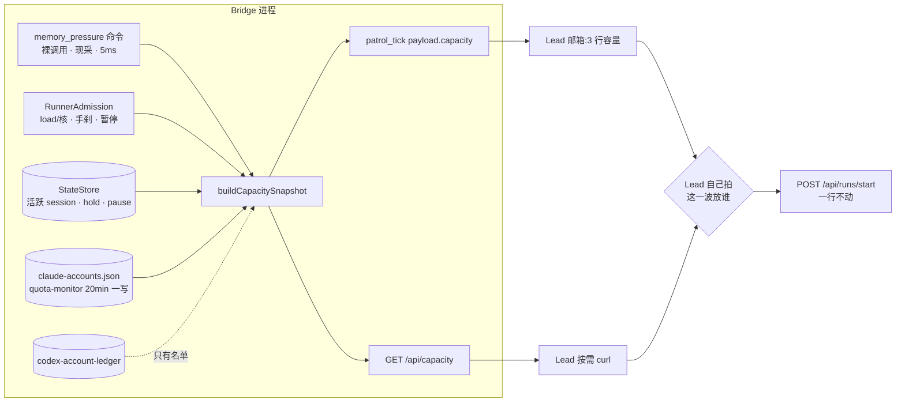

# FLY-2144 派发容量输入 + dag-resolver 退役 — 探索
Issue: FLY-2144 (https://linear.app/geoforge3d/issue/FLY-2144/2108e-派发判断的容量输入quota-机器内存当前值可读-附-dag-resolver-退役)
日期: 2026-09-02
基于: 无

---

## 0. 一句话

Lead 决定「这一波放谁出去」时,今天读不到一份写着「机器内存现在怎样、额度池现在怎样、这两个数是几分钟前的」的东西 —— 额度已经被守护进程每 20 分钟采一次写在本机文件里,内存则只要裸调一次 macOS 自带的 `memory_pressure` 命令(5 毫秒)就有,只是没有一个出口把它们放到 Lead 眼前。本单 = 开这个出口(R4),顺手把一个已无生产消费者的包(`dag-resolver`)删掉(R8)。⛔ 不建闸门、不建队列、不加 flag。

---

## 1. 依据与边界

### 1.1 上游原文(FLY-1969 PRD v2.4,她逐节勾过)

**R4 · 决定「这一波做谁」的两个输入**
> 她的原话:Lead 定时检查推进,**综合两件事**决定这一波派哪几个:① dependency ② 资源容量(quota、机器 memory)
> ⇒ 要求:Lead 做这个判断时,拿得到 quota 和机器 memory 的当前情况。
> ⚠️ 形状:容量从「一道闸门」变成 **Lead 的一个判断输入**(他读它,自己拍)。⛔ 不再要求「系统自动拒绝 + 排队」。
> 花明显资源 → Lead 按 quota 自己拍,不用问她。

**R8 · 清理:`dag-resolver` 退役**
> 生产消费者只剩类型 `DagNode`(`Blueprint.ts` / `PreHydrator.ts`);`DagResolver` 类的非测试消费者只有未被实例化的 `DagDispatcher`。
> ⇒ 清理债务,可以排在任何位置,不阻塞任何一条。⚠️ 没有 founder 可见面。

**issue 附加约束**:⚠️ 内存口径只认 `memory_pressure`(既有裁定)。

### 1.2 本单不做什么(直接从 PRD 抄边界)

| 不做 | 出处 |
| --- | --- |
| 自动拒绝 / 排队 / 新的 admission 拒绝理由 | R4「不再要求那套」;v1.9→v2.0 台账「派发闸作废」 |
| 多项目 quota 统管 | PRD §6 留白,触发条件是「开始同时推第二个项目」 |
| 新 feature flag | PRD §4 non-goals「加任何新 flag 违反现行铁律」 |
| 改负载阈值 / 接通内存闸 | PRD §9「负载阈值 + 内存腿已独立转工程侧,不在本单」 |
| 「什么时候该找她」规则 | 她明确否掉 |
| 页面 / Epic 内容 / 拉活逻辑 | 那是 [2108·A/B/D] |

---

## 2. 现状审计(本单自己核的代码事实,非转述)

### 2.1 机器内存:数已经在采,但只有「刹车」在读,Lead 读不到

| 事实 | 出处 |
| --- | --- |
| **真实内存压力传感器已在生产跑**:`readMemoryPressure()` 跑 `vm_stat`,算 `freePct = (free+inactive)/Σ7桶` 与 `Swapouts` 计数器增量;三态 `healthy: true/false/null`,`inPressure` 迟滞(2 tick 触发、证明健康才解除) | `packages/teamlead/src/bridge/machine-watermark.ts`(FLY-1082 → FLY-1142 根治) |
| 它的消费者只有 `FleetSensors.swapTick()`:压力确认 → 写 durable 行 `fleet_pressure_hold`(手刹)+ 工单;健康证明 → 解手刹 | `fleet-sensors.ts` §SWAP;`StateStore.setFleetPressureHold / getFleetPressureHold / clearFleetPressureHold` |
| `FleetSensors` 对外只露 `lastWatermark`(一个 `"41.3% free"` 字符串,给 server-loss 通知用)与 `lastEvaluation`(内部 recovery probe 用),**没有任何 HTTP / CLI / 事件把读数交给 Lead** | `fleet-sensors.ts:188`;`plugin.ts:11296` |
| 另有一条**独立**的内存口径:`RunnerAdmissionController.availableMemBytes()`(darwin `vm_stat` free+inactive+speculative 绝对字节),**默认关闭**(`FLYWHEEL_RUNNER_MIN_FREE_MEM_MB=0`),文件头明说 `os.freemem()` 类口径在 macOS 不可信 | `runner-admission.ts` 文件头与 `tryAdmit()` |
| 派发前的资源判据今天 = `pressure_hold` > `admission_paused`(FLY-1638 部署刹车)> 内存闸(关)> 负载/核 > 8.0 | `runner-admission.ts tryAdmit()`,顺序即优先级 |
| 生产两个阈值 env 都没设,走默认;本机 18 核 48 GiB ⇒ 负载 144 才拒 | FLY-1969 research §5(2026-08-21 核)、FLY-1986 exploration §1.1 |
| 传感器采样节拍:挂在 GatePoller 的 lead-reconcile tick 上(FLY-1142 plan 记为 ≈30s) | `plugin.ts:11512 tickFleetSensors` |

**判(Lead 2026-09-02 纠正后)**:「内存口径只认 memory_pressure」= **macOS 命令 `memory_pressure` 输出的那一个数 `System-wide memory free percentage`**(founder 2026-08-13 裁定,由 Lead 转述;明确排除 `vm_stat` 的 Pages free / free% —— macOS 故意把它压到接近零,恒低无意义 —— 也排除 `vm.swapusage`)。
本单据此核实:
- 裸调用 `/usr/bin/memory_pressure`(**无任何参数**)只读、5ms 返回、exit 0,末行即 `System-wide memory free percentage: 75%`(2026-09-02 19:40 本机实测,48 GiB / 18 核,load1 6.35)。
- ⚠️ **同一个命令带 `-l` / `-p` / `-S` / `-s` 会真的施加或模拟内存压力**(man page 原文)。采样器必须以空 argv 调用、不经 shell、带超时;设计里要有一条负向守卫测试钉死「argv 恒为空」。
- Bridge 今天**没有**任何代码读这个命令(全仓 grep 只命中 FLY-342 语音实验的手工记录)⇒ 需要**新增一个只读采样器**,读数带 `observedAt`。
- 「紧张」参考线 free% < ~15%(Lead 给的参考),**只作标注,不作闸门**。
- ⛔ 不复用 `MemoryPressureMonitor.lastEvaluation`(vm_stat 口径)作为本单的内存输入;FLY-1142 传感器继续只管手刹,两者并存但各管各的,快照里可以**旁注**手刹是否置位(那是派发前会撞到的事实),但内存「当前值」只有一个来源。

> 更正记录:本探索初稿曾把口径判成 FLY-1142 传感器读数(理由是「与手刹同源」),已被 Lead 在 question `8be11d15` 的答复中纠正;原判作废,上面是现行结论。

### 2.2 额度(quota):数也在采,存在一个 JSON 里,Lead 同样读不到

| 事实 | 出处 |
| --- | --- |
| **额度守护进程已在生产跑**(`flywheel-quota-monitor`,pid 45051,2026-09-01 起):活跃账号每 20 分钟查一次官方 usage API(≥70% 加速到 10 分钟),全部候选账号每 60 分钟扫一遍 | `account-heal/quota-monitor.ts`、`quota-monitor-config.ts` 默认值;`~/.flywheel/quota-monitor.health.json` |
| 每次观测经 `applyObservation()` 写进 `~/.flywheel/claude-accounts.json` 每个账号的 `observedFiveHPct / observedSevenDPct / lastObservedAt / weeklyResetAt / quotaExhaustedUntil` | `account-store.ts:562-588` |
| 本刻实况(2026-09-03T02:16Z 观测):5 个 Claude 账号全部 16 分钟内有观测;活跃账号 personal 5h 9% / 7d 30%,其余四个 5h ≤11% | `claude-accounts.json`(只读) |
| `account-ledger.json` 里设计了 `balance` 快照,但**生产里 5 个账号都没有 balance**,只有 auth/capEvents ⇒ 真正活着的额度源只有上面那个 store | `~/.flywheel/account-ledger.json`;`account-ledger.ts buildAccountSummary()` 也是「store 更新就用 store」 |
| 已有两个**人读**的出口:`flywheel-claude-quota-guard` 拒绝切换时打印池状态(含 `(stale)` 判据 = 24h);`flywheel-account-summary` 给 Codex Infra Bot 日报打一行一账号。**两个都不是给 Lead 派发判断用的,也都没接进巡检** | `quota-guard-cli.ts:513-570`;`account-summary-cli.ts` |
| **Codex 账号没有数值额度源**:`codex-account-ledger/*.json` 只有 profile/plan/mode/lastObservedAt;撞额度只能从 pane 文本检出(`usage_limit` 工单) | `~/.flywheel/codex-account-ledger/`;`runner-quota-detector.ts` |

**判**:quota 的「当前值」= `claude-accounts.json` 里每账号的 `observed*` 三元组,**一个源,已经在写,只差读出来**。Codex 侧要**如实写「无数值源」**,不能编一个。

### 2.3 Lead 今天在哪里做「这一波做谁」的判断,以及那里现在有什么

| 面 | 现在有什么 | 缺什么 |
| --- | --- | --- |
| **`patrol_tick` 事件**(每 60 分钟,Bridge → Lead 邮箱) | `roster`(名下未终结 runner)+ `loops`(每 issue 的 TURN/返工/land/门的账面圈)| **零容量字段**。`HookPayload` 没有 memory / quota / load 任何一项 |
| **`formatPatrolTick()`**(两套 Lead runtime 共用的渲染) | 「巡检时间到 + 🔴 账面异常 + 名册」 | 同上,无容量行 |
| **`flywheel-patrol-snapshot`**(Lead 每次巡检必跑的六步 + DWELL 快照) | STEP 1-6 + STEP DWELL,合同被 `lead-patrol-snapshot.test.sh` 逐段钉死 | 没有容量段;而且规则明写「六个 numeric STEP 编号不变」 |
| **`GET /health`**(无鉴权) | `sessions_count`、`admissionPause`、liveness、event-loop | 无内存读数、无 quota、无 hold |
| **`GET /api/triage/data`**(FLY-21,Bearer) | `capacity: { running, inflight, total, max: null }`(FLY-123 P4 后 `max` 永远 null) | 只有「跑着几个」,没有「机器和额度还剩多少」 |
| **`GET /api/admission`**(仅在 pause 激活时有意义) | quiescence 快照 | 不是容量 |
| **Lead 规则**(`runner-patrol-rules.md` / `department-lead-rules.md`) | 巡检六步、派发走 `POST /api/runs/start` | 没有一句告诉 Lead「派发前看哪份容量、怎么读」 |

**判**:PRD §1.2「巡检和放新活共用同一次检查」在代码上的落点就是 **`patrol_tick` 那个 payload** —— 它已经是「一次扫描出一份事实」的载体。容量应当**作为它的一个字段**随 tick 一起到 Lead 手上;再给一个**按需读**的 HTTP 出口,供 tick 之间(比如某个 runner 刚跑完、Lead 想立刻补位)使用。两个出口读**同一个 builder**。

### 2.4 `dag-resolver` 的真实消费者(R8 前提复核 —— 有偏差)

PRD 的量法只扫了 `packages/`。本单全仓再扫一次(2026-09-03T02:35Z,`grep -rl "flywheel-dag-resolver|DagDispatcher|DagResolver"`,排除 node_modules/dist/docs):

| 消费者 | 形态 | 判 |
| --- | --- | --- |
| `packages/edge-worker/src/Blueprint.ts`、`PreHydrator.ts` | `import type { DagNode }`;生产代码只用 `node.id`(Blueprint 5 处、PreHydrator 3 处),`blockedBy` 在非测试代码**零引用** | PRD 说对了:只剩类型 |
| `packages/edge-worker/src/DagDispatcher.ts` | `import type { DagNode, DagResolver }`;`packages/` 内**无人 new 它** | PRD 说对了 |
| 25 个 `packages/edge-worker/src/__tests__/*.test.ts` | `import type { DagNode }` 造 `{ id, blockedBy: [] }` 喂 `Blueprint.run` | 只改 import 路径 |
| `DagDispatcher.test.ts`(825 行)、`parallel-dispatch-e2e.test.ts`(193)、`e2e-core-loop.test.ts`(271) | 真 `new DagResolver / new DagDispatcher` | 随类一起退役;`e2e-core-loop` 的「单 issue → Blueprint → git 检查」那一段可不靠 resolver 保留 |
| **`scripts/run-project.ts`(225 行)、`scripts/smoke-test.ts`(339 行)** | **真 `new DagResolver(...)` + `new DagDispatcher(...)`**,从 `dist/` 路径直接 import | ⚠️ **PRD 漏了这里**。它们是 v0.1 手动入口(`npx tsx scripts/run-project.ts <project>`),未接 CI、未接 package.json、README/docs 零引用,最后实质改动 2026-04-11 / 2026-05-05。Bridge 生产派发走的是 `teamlead/bridge/run-dispatcher.ts`,与它们无关 |
| `scripts/lib/setup.ts:64-65` | re-export `DagDispatcher` / `DispatchResult`;文件本身被 `run-issue.ts`(不用 DAG)和 FLY-2121 测试(只用 `loadSetupProjectConfig`)使用 | 删这两行即可,不动其余 |
| `scripts/package-onboard.sh:47` `PO_PACKAGES`、`scripts/package-onboard-files.allow:123-124` | 客户 MVP 打包清单含 `dag-resolver` | 必须同步删,否则打包脚本找不到包 |
| `packages/edge-worker/package.json`、`pnpm-lock.yaml` | `"flywheel-dag-resolver": "workspace:*"` | 删依赖、重生成 lock |
| `docs/CONTRIB.md`(包表、依赖图、目录树)| 文档 | 同步 |
| `packages/core/src/{constants,adapter-types,tmux-viewer,flywheel-error-types,AdapterRegistry}.ts`、`scripts/e2e-tmux-runner.ts:7` | **只是注释**提到 DagDispatcher | 顺手改措辞,让残留守卫可以严 |
| 插件 fork `~/.claude/plugins/cache/*` | 0 命中;`~/Dev/claude-plugins-official/external_plugins` **该 root 不存在,未检查** | 按 CLAUDE.md FLY-1914 规矩如实登记 |
| `LinearGraphBuilder`、`LinearIssueData` | 只有 `e2e-core-loop.test.ts` 用 | 随包退役 |

**判**:R8 在 `packages/` 内成立;但要**真的删掉 `DagResolver` 类**,`scripts/run-project.ts` 与 `scripts/smoke-test.ts` 必须一起退役(它们没有 DAG 就跑不起来)。这是**范围放大一小格**,已向 Lead 非阻塞确认(§6);默认按「一并删」推进。

---

## 3. 关键问题与选项

### Q1 · 内存「当前值」用哪个口径?

| 选项 | 内容 | 判 |
| --- | --- | --- |
| **C(裁定)** macOS `memory_pressure` 命令 | 裸调用,取末行 `System-wide memory free percentage: NN%` 一个数 + `observedAt`;Bridge 内新增只读采样器,每次读快照时**现采**(5ms,无需缓存/定时器) | ✅ founder 2026-08-13 裁定(Lead 转述);零新状态;⚠️ 必须空 argv + 超时 + 负向守卫 |
| A FLY-1142 传感器读数 | `freePct`(vm_stat)、`swapoutDelta`、三态 `healthy` | ⛔ Lead 明确排除 vm_stat 口径作本单输入;它继续只服务手刹 |
| B `availableMemBytes()` 绝对 MB | runner-admission 那条腿 | ⛔ 默认关、文件头自陈不可移植;会造第二本账 |
| D Lead 侧自己跑命令 | 不经 Bridge | ⛔ Lead 规则要写死一条本机命令;Codex Lead 无 shell 权限时读不到;与 tick 里的数两账 |

### Q2 · quota「当前值」用哪个口径?

| 选项 | 判 |
| --- | --- |
| **A(默认)** 读 `claude-accounts.json` 每账号 `observedFiveHPct / observedSevenDPct / lastObservedAt / weeklyResetAt / quotaExhaustedUntil` + `activeAccount` | ✅ 唯一活着的源;守护进程已在写;零新网络请求 |
| B 现场调 usage API | ⛔ 违反 FLY-871 R1 红线(不得为读数去 refresh 空闲账号);多一次网络;和守护进程两账 |
| C 读 `account-ledger.json` balance | ⛔ 生产里是空的 |
| Codex | **如实标 `unavailable(structural: codex_no_usage_api)`**,只列账号名/plan/mode/lastObservedAt | 不编数 |

### Q3 · 放在哪里让 Lead 读到?

| 选项 | 判 |
| --- | --- |
| **A(默认)** 一个 builder(`buildCapacitySnapshot()`)+ 两个出口:① `patrol_tick` payload 新字段 `capacity` 并由 `formatPatrolTick` 渲染成 3 行;② `GET /api/capacity`(Bearer,和 `/api/triage/data` 同鉴权)按需读 | ✅ 符合 §1.2「一次扫描一份事实」;tick 之间也能读;一个 builder 两个出口 |
| B 只加 HTTP,不进 tick | ⛔ Lead 得记得去查;§1.2 落空 |
| C 只进 tick,不加 HTTP | ⛔ 某 runner 跑完、Lead 想立刻补位时,手上是最长 60 分钟前的数 |
| D 塞进 `flywheel-patrol-snapshot` 作第七段 | ⛔ 六步合同被测试钉死,规则明写「numeric STEP 不变」;快照是「Lead 独立信源」,而容量的权威源在 Bridge 进程内(swapout 基线) |
| E 塞进 `/health` | ⛔ `/health` 无鉴权;额度百分比不该无鉴权外露 |
| F 新增 `flywheel-comm capacity` 子命令 | 可选,不默认:Lead 规则里已有 `curl -H "Authorization: Bearer …" $BRIDGE_URL/api/…` 模式;少一个要维护的 CLI 契约(FLY-1914) |

### Q4 · 「过期要说出来」怎么落?(PRD R5 的判据搬到这里)

每一格带 `observedAt` / `sampledAt` 与 **age**;快照本身带 `generatedAt`。⛔ 不许有「说不出自己多旧」的格。`stale` 布尔按一个写在 payload 里的常量给出(`staleAfterMinutes`),读者看得见规则。传感器读数失败 = `healthy: null` + `freePct: null`,不是 0。

### Q5 · 形状守则:怎样保证它「是输入不是闸门」?

- 只**读**:builder 不写 StateStore、不写 store、不发工单、不改 `tryAdmit()`。
- 不新增 `AdmissionReason`。
- 派发路径(`POST /api/runs/start` → `RunnerAdmissionController`)**一行不动**。
- Lead 规则只加「派发前读它、怎么读」,不加「读到 X 就必须停」。

### Q6 · `DagNode` 类型去哪?

只剩 `id` 在用,但 25 个测试按 `{ id, blockedBy }` 造对象。**默认**:在 edge-worker 本地建 `src/dag-node.ts`,形状原样 `{ id: string; blockedBy: string[] }`,名字不变(稳定身份),测试只改 import specifier。⛔ 不放进 `flywheel-core`(只有 edge-worker 用,放 core 是扩散)。

---

## 4. 方向建议(供 research / plan 展开)

**交付面清单(草)**
1. `packages/teamlead/src/bridge/capacity-snapshot.ts`:builder + 类型 `CapacitySnapshot`;输入全部注入(store、admission、内存采样器、账号 store 路径、clock)。
2. `packages/teamlead/src/bridge/machine-free-pct.ts`:只读采样器,`execFile("/usr/bin/memory_pressure", [])` + 超时,解析末行百分比;失败返回 `null` + 稳定原因 token。
3. `RunnerAdmissionController`:露一个只读 `probe()`(load1 / cpuCount / perCore / 阈值 / 当前决定),不改 `tryAdmit()`。
4. `patrol-tick.ts`:payload 加 `capacity?: CapacitySnapshot`;`hook-payload.ts` `formatPatrolTick` 渲染。
5. `plugin.ts`:`GET /api/capacity`(tokenAuth)。
6. `lead-rules-base/runner-patrol-rules.md`(或 department-lead-rules):「派发前读容量」一小节 + curl 模板;附对应内容合同测试。
7. R8:删包、删类、删两个 v0.1 脚本、改 onboard 清单/allow、改 CONTRIB、本地 `DagNode`、25 个测试 import、残留守卫。

---

## 5. 与兄弟单的接口

| 兄弟单 | 关系 |
| --- | --- |
| [2108·B] 空位拉活(FLY-2141) | **它读本单的 `CapacitySnapshot`**(同一个 builder、同一次 tick),这样「巡检」和「放新活」天然读同一份事实(§1.2)。本单不做「拉活」本身 |
| [2108·C] 依赖账本(FLY-2142) | 无代码接口;PRD R4 的另一半输入,由 Lead 自己综合 |
| [2108·A/D] 页面 | 若页面想显示容量,读同一个 `/api/capacity`;本单不改页面 |

---

## 6. 开放问题 → 已由 Lead 拍板(question id `8be11d15-652c-4127-9547-b4879a658d4c`,2026-09-02)

1. 内存口径:**纠正**为 macOS `memory_pressure` 命令的 `System-wide memory free percentage`(见 §2.1 判、Q1-C)。本探索初稿的 Q1-A 作废。
2. R8 范围:**按默认**,同 PR 删 `scripts/run-project.ts`、`scripts/smoke-test.ts` 与 `setup.ts` 的 `DagDispatcher` 导出,保留 `run-issue.ts`,不留兼容层。

---

## 7. 我没查的 / 盲区

- FleetSensors 真实采样节拍只从 FLY-1142 plan 引用(≈30s),research 阶段核 `plugin.ts:11512` 的挂载 tick。
- 生产 Bridge 进程的 `FLYWHEEL_RUNNER_*` env 沿用 FLY-1969 research 2026-08-21 的核验,本单没重核。
- `~/Dev/claude-plugins-official/external_plugins` 不存在,插件 fork 源未检查(按 FLY-1914 规矩如实登记)。
- Linear MCP 本会话 401;issue 正文靠 `~/.flywheel/.env` 里的 key 直接查 GraphQL 拿到,与 skill 注入的正文一致。
