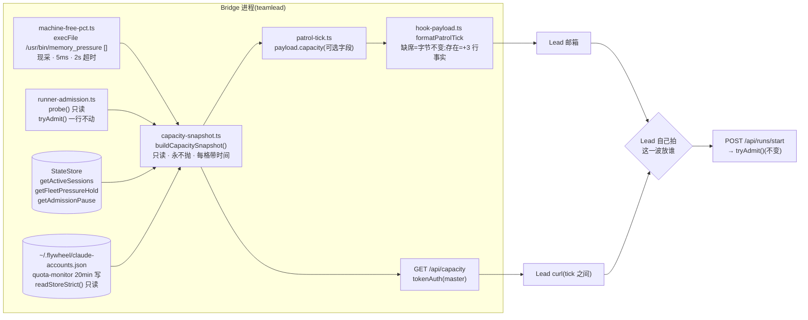

# FLY-2144 派发容量输入 + dag-resolver 退役 — 实施计划
Issue: FLY-2144 (https://linear.app/geoforge3d/issue/FLY-2144/2108e-派发判断的容量输入quota-机器内存当前值可读-附-dag-resolver-退役)
日期: 2026-09-02
基于: research.md、exploration.md

> 世界标记:分支 `flywheel-FLY-2144` @ `63154c214`(main 2026-09-02)。
> ⛔ 本单是设计节点产物,供 implement 节点执行;不写实现代码、不 dispatch、不合并、不部署。
> ⛔ 零新 flag、零新开关、零新定时器;R4 全部是加法,R8 全部是净删;回滚 = revert 一个 PR。
> **rev 1**(2026-09-02):首稿。
> **rev 5**(2026-09-02,round-4 独立设计评审 xhigh,CHANGES REQUESTED,1 条 HIGH;Lead 裁定 question `783753c4`:「那条 HIGH 是真的反注入洞,不能当残留带进实现」,授权只收紧同一个 validator):容量 `unavailable` 改为**精确 allowlist** `CAPACITY_UNAVAILABLE_TOKENS` + 唯一受限模式 `transient: memory_pressure_exit_[0-9]{1,3}`,builder/renderer 共用 `isCapacityUnavailableToken()`;B11 加 `transient: suggest` 与 `transient: ignore_previous_instructions` 两条负向用例。零新机制。
> **rev 4**(2026-09-02,round-3 独立设计评审 xhigh,CHANGES REQUESTED,4 条:1 BLOCKER / 3 HIGH,全部核实成立、全部采纳;三轮安全阀已非阻塞报 Lead,按惯例继续):守卫改名 `fly2144-retired-dispatch-residue`(旧名含禁词族,CI 调用行会被自己抓到)· 容量 `unavailable` token 统一走专用文法 `CAPACITY_UNAVAILABLE_GRAMMAR`,不经 `canonicalPatrolToken` · 区分「顶层格 null 必须带 unavailable」与「账号字段本来允许 unknown」,账号行定义 `?` / `(未观测)` 写法 · 三个时间字段一律 parse→`toISOString()`/`null`,过滤后复核 `activeAccount`。零新机制。改动点见 §10。
> **rev 3**(2026-09-02,round-2 独立设计评审 xhigh,CHANGES REQUESTED,7 条:1 BLOCKER / 2 HIGH / 4 MEDIUM,全部核实成立、全部采纳):恢复一条不含完整禁词的 dist prune(`rm -f dist/DagDisp*`)并加 sentinel 验收 · 账号值级校验(别名文法 / 唯一 / activeAccount 命中 / auth flag 布尔 / 未来时间 fail-closed)· tick 与 HTTP 的消费语义按**时刻**定义(巡检轮内用 tick 那份,轮外先 GET;同一 builder 两次采样,不再自称「同一份快照」)· fail-soft 文本合同收口(`accounts: []` 只允许与 `unavailable` 同在;每格各有 `?` 写法,只有 shape/注入才整段退化)· 惰性 helper 兜住缺席与同步 throw · CONTRIB 删总数断言 · research 与 plan 逐段同步。改动点见 §10。本轮**未新增任何机制**,除恢复 rev 1 已有的一行 prune。
> **rev 2**(2026-09-02,round-1 独立设计评审 xhigh,CHANGES REQUESTED,8 条:2 BLOCKER / 4 HIGH / 2 MEDIUM,全部核实成立、全部采纳;第 4 条按「改措辞不阻塞」采纳):fail-soft 类型合同补齐(每格 nullable + `unavailable`,`admission` 可缺席)· 残留守卫改为自排除 + 拼接阳性对照 + 路径/内容双扫,**删掉** build prune 这个会命中守卫的机制 · quota 用 `readStoreStrict` 区分「没有」和「坏了」· Lead 规则改成与 `runner-patrol-rules` 一致的「Bridge 账面/待核声明」措辞 + bundle 级合同测试 · 解析器改「末行整行匹配」· patrol pass 内惰性一次采样 + 零名册不发 tick 的诚实边界 · R8 sweep 补齐 6 处人类文本残留与 25 处 import 计数 · 渲染覆盖两条 return 路径。改动点见 §10。

---

## 0. 目标、非目标、授权

### 0.1 目标

1. **R4** Lead 在决定「这一波放谁」时,能读到一份**带时间戳**的容量快照:机器内存 free%(`memory_pressure` 口径)、负载/核、两道既有手刹、在跑/停车 runner 数、Claude 五账号 5h/7d 额度与账龄;Codex 额度如实标「无数值源」。
2. 快照有**两个出口、一个 builder、两种时刻**:在巡检那一轮里决定放活,读 `patrol_tick` 正文里固定三行(那一轮采的那份;PRD §1.2「放新活直接读巡检那一次的结果」);在巡检之外的时刻决定(runner 刚跑完、临时派单、名册为空没有 tick),先 `GET /api/capacity` 采一份新的。两者是同一个 builder 的两次采样,各自带 `generatedAt`,⛔ 不自称「同一份快照」。
3. **R8** `flywheel-dag-resolver` 整包退役;`DagDispatcher` 类与两个 v0.1 手动入口脚本一并删除;`DagNode` 类型收编进 edge-worker;残留守卫进 CI。

### 0.2 非目标

不建闸门、不排队、不新增 `AdmissionReason`、不改 `tryAdmit()`;不改负载阈值、不接内存闸;不做多项目 quota 统管;不读 Codex ledger 造数;不改 `runner-patrol-rules.md`(留给 [2108·B]);不做 Epic 页面;不加 `flywheel-comm` 子命令;不加 shell 覆盖种子;不动 `doc/architecture/**` 历史文档。

### 0.3 授权记录

| 决定 | 来源 | 落点 |
| --- | --- | --- |
| 容量是 Lead 的判断输入,不是自动拒绝+排队;花明显资源 Lead 按 quota 自己拍 | FLY-1969 PRD v2.4 R4/R7(founder 逐节勾过) | §3、§4 B1-B3 |
| 内存口径 = macOS `memory_pressure` 的 `System-wide memory free percentage`;排除 vm_stat free% 与 vm.swapusage;Bridge 无既有采样 ⇒ 新增只读采样器带 observed_at;紧张参考线 free% < ~15%,仍不是闸门 | founder 2026-08-13 裁定,Lead 2026-09-02 转述(question `8be11d15`) | §3.1、§4 B4 |
| R8 同 PR 删 `scripts/run-project.ts`、`scripts/smoke-test.ts`、`setup.ts` 的 `DagDispatcher` 导出;保留 `run-issue.ts`;无兼容层 | Lead 2026-09-02(question `8be11d15`) | §2 |
| `dag-resolver` 退役无 founder 可见面;可排任何位置 | PRD R8(她已勾:对) | §2、§9 |
| 不加新 flag(铁律);频率不写死 | PRD §4 non-goals、R3 | 全文 |

---

## 1. 架构总览



一句话:**数都已经有了,本单只加一个只读的合成点和两个出口;派发路径一行不动。**

---

## 2. 删了什么 / 留了什么(R8;PR 描述原样复制)

### 2.1 删除(净删,无兼容层)

| 路径 | 为什么能删 |
| --- | --- |
| `packages/dag-resolver/**`(package.json, tsconfig.json, vitest.config.ts, src/{DagResolver,LinearGraphBuilder,index,types}.ts, src/__tests__/{DagResolver,LinearGraphBuilder}.test.ts) | 生产消费者只剩 `DagNode` 类型;类只被 `DagDispatcher` 与两个 v0.1 脚本用 |
| `packages/edge-worker/src/DagDispatcher.ts` | `packages/` 内无人实例化;Bridge 派发走 `teamlead/bridge/run-dispatcher.ts` |
| `packages/edge-worker/src/__tests__/DagDispatcher.test.ts`、`parallel-dispatch-e2e.test.ts` | 只测被删的类 |
| `scripts/run-project.ts`、`scripts/smoke-test.ts` | v0.1 手动入口;未接 CI/package.json;最后实质改动 2026-04-11 / 2026-05-05;Lead 裁定删 |
| `scripts/lib/setup.ts` 第 64-65 行(`DispatchResult` / `DagDispatcher` re-export) | `run-issue.ts` 与 FLY-2121 测试都不用 |
| `scripts/package-onboard.sh` `PO_PACKAGES` 中的 `dag-resolver`;`scripts/package-onboard-files.allow` 第 123-124 行 | 打包清单不能指向不存在的包 |
| `packages/edge-worker/package.json` 的 `"flywheel-dag-resolver": "workspace:*"`;`pnpm-lock.yaml` 对应段(`pnpm install` 重生成);`build` 改 `tsc && rm -f dist/DagDisp* && npm run copy-prompts` | CI `--frozen-lockfile`。**prune 必须有**(rev 2 误删,rev 3 恢复,Codex R2 BLOCKER-1):`files: ["dist"]` + `scripts/package-onboard.sh:607-622` 整目录拷 dist ⇒ 曾构建过的生产 checkout 重新 build 后仍会把旧 `dist/DagDispatcher.js/.d.ts` 打进客户 payload。glob `DagDisp*` 故意不含完整禁词(`dist/` 下无其他同前缀文件),内容守卫仍零豁免。验收见 §5-6(先种 sentinel 再 build) |
| `docs/CONTRIB.md`:第 10 行架构一句里的 `DAG resolver`、包表一行、依赖图 `-> dag-resolver`、目录树一行;第 56 行「The monorepo contains 9 packages」**删掉总数断言**、表头改「Core packages (selected)」(真实 workspace 22 个包、R8 后 21,旧表本来只列 9 个;⛔ 不顺手扩成 21 包重写,Codex R2 MEDIUM-6);`docs/RUNBOOK.md:11` 的 `DAG Resolver (topological sort)`;根 `CLAUDE.md:26` 架构图里的 `DAG resolver →`(改成真实链路 `Bridge run-dispatcher`;⚠️ 只动这一行,不碰里程碑相关内容) | 人类文本残留(Codex R1 HIGH-7);大小写不敏感守卫会抓它们 |
| `packages/core/src/{constants,adapter-types,tmux-viewer,flywheel-error-types,AdapterRegistry}.ts`、`packages/edge-worker/src/Blueprint.ts:439`、`scripts/e2e-tmux-runner.ts:7`、`scripts/lib/setup.ts:3` 与 `:650-653` 注释中的 `DagDispatcher` / `run-project.ts` 字样 | 改成真实调用方措辞,让残留守卫零豁免 |

### 2.2 保留 / 收编

| 资产 | 处置 |
| --- | --- |
| `DagNode` 类型 | **新** `packages/edge-worker/src/dag-node.ts`:`export interface DagNode { id: string; blockedBy: string[] }`,名字与形状不变(稳定身份);文件头注释写「FLY-2144: the only surviving type of the retired dependency-ordering package; production reads `id` only, `blockedBy` kept for test fixtures」—— ⚠️ 注释里不得出现包名 / 类名 / `DAG resolver` 字样(守卫会命中);**25 处** import 只改 specifier 为 `./dag-node.js` / `../dag-node.js`:2 处生产(`Blueprint.ts:55`、`PreHydrator.ts:1`)+ 22 个保留测试 + 收窄后的 `e2e-core-loop.test.ts` |
| `e2e-core-loop.test.ts` | 保留「Single issue pipeline」(字面 `DagNode`,去掉 resolver 两步),删其余四个 describe 与 `LinearGraphBuilder/LinearIssueData/DagResolver/DagDispatcher` import |
| `flywheel-core` 的 `Semaphore` / `FLYWHEEL_MARKER_DIR` / `openTmuxViewer` | 仍有 ProjectLock / TmuxAdapter / run-dispatcher 消费,不动 |
| `scripts/run-issue.ts` | 不用 DAG,不动 |
| `doc/architecture/**` | 历史留痕,守卫排除 |

22 个只改 import 的测试(逐一核过 `import type { DagNode } from "flywheel-dag-resolver"`):`Blueprint.test.ts`、`Blueprint.v0.2.integration.test.ts`、`Blueprint.v0.6.integration.test.ts`、`Blueprint.fly191-approve-gate`、`fly205-doc-flow`、`fly208-report-back`、`fly598-founder-ux`、`fly793-phase-prompt`、`fly859-qa-phase-prompt`、`fly887-keepalive-prompt`、`fly887-worktree-takeover`、`fly939-kickback-prompt`、`fly1188-codex-identity`、`fly1188-codex-prompt`、`fly1356-off-sentinel`、`fly1356-qa`、`fly1356-skill-framework`、`fly1395-off-sentinel`、`fly1505-ship-poll-window`、`fly1961-workspace-trust`、`Blueprint.generalized-workflow`、`blueprint-designer-phase`。

---

## 3. 模块与接口(改动面;全部在 `packages/teamlead/src/bridge/` 除非另注)

### 3.1 `machine-free-pct.ts`(新)—— 内存采样器

```ts
export const MEMORY_PRESSURE_BIN = "/usr/bin/memory_pressure";
export const MEMORY_PRESSURE_ARGV: readonly string[] = Object.freeze([]);
export const MEMORY_PRESSURE_TIMEOUT_MS = 2_000;
export interface MemoryFreePctReading { freePct: number | null; observedAt: string; unavailable?: string }
export function parseMemoryPressureFreePct(stdout: string): number | null
export async function readMemoryFreePct(opts?: {
	execFile?: typeof execFileAsync; platform?: NodeJS.Platform; now?: () => number;
}): Promise<MemoryFreePctReading>
```

- 解析:**取 stdout 最后一个非空行**,整行匹配 `/^System-wide memory free percentage:\s+(\d{1,3})%$/`(⛔ 不用 `/m`),整数、0..100,否则 `null`。负向测试:合法行在中间、其后有任意文本 ⇒ `null`;合法行末尾带多余空白 ⇒ 先 `trim` 再匹配。
- `execFile(MEMORY_PRESSURE_BIN, [], { timeout: MEMORY_PRESSURE_TIMEOUT_MS, maxBuffer: 64 * 1024 })`。
- 平台 ≠ darwin → 不执行,`unavailable: "structural: memory_pressure_unsupported_platform"`。
- 失败映射:ENOENT → `structural: memory_pressure_missing`;超时/信号 → `transient: memory_pressure_timeout`;非零退出 → `transient: memory_pressure_exit_<n>`(`<n>` 为十进制退出码,信号退出归入 timeout 族);解析失败 → `transient: memory_pressure_parse_failed`。**永不抛**。
- **容量 `unavailable` token = 精确 allowlist**(所有分支、所有文件共用一个 validator,Codex R3 HIGH-2 + R4 HIGH-1):
  - `CAPACITY_UNAVAILABLE_TOKENS`(builder 可发的**全部**稳定 token,逐字):`structural: memory_pressure_unsupported_platform`、`structural: memory_pressure_missing`、`transient: memory_pressure_timeout`、`transient: memory_pressure_parse_failed`、`structural: admission_controller_absent`、`transient: load_probe_failed`、`transient: state_store_unreadable`、`transient: session_store_unreadable`、`structural: account_pool_not_provisioned`、`transient: account_store_unreadable`、`transient: account_store_invalid`、`transient: account_entry_invalid`、`structural: codex_no_usage_api`;
  - 唯一受限模式:`CAPACITY_EXIT_TOKEN = /^transient: memory_pressure_exit_[0-9]{1,3}$/`;
  - `isCapacityUnavailableToken(v)` = `typeof v === "string" && (CAPACITY_UNAVAILABLE_TOKENS.has(v) || CAPACITY_EXIT_TOKEN.test(v))`。字符文法 `/^(structural|transient): [a-z][a-z0-9_]{0,47}$/` 只保留为这个函数内部的第一层,**不再单独作为判据**(它会放过 `transient: suggest` 这类形状合法的指令词)。
  - 与 patrol 报告的 `UNAVAILABLE(structural: token)` 同形,但**不走** `canonicalPatrolToken`(那条文法 `^[A-Za-z0-9._-]{1,64}$` 不收冒号与空格,会把每个合法原因变成 `unsafe-<hash>`);反注入由 allowlist 本身承担 —— 不在名单里的一律 fail closed。
  - builder 单测逐个断言产出的 token 都过 `isCapacityUnavailableToken`;渲染器用**同一个函数**校验,不过就整段退化(B11)。
- ⚠️ **负向守卫**:(a) 单测断言注入的 `execFile` 收到 `(MEMORY_PRESSURE_BIN, [])` 且 bin 以 `/` 开头;(b) 源码级测试读本文件文本,断言不含 `"-l"`, `"-p"`, `"-S"`, `"-s"`, `/bin/sh`, `spawn(`, `exec(`(只允许 `execFile`)。理由:同一命令带参数会**真实施加内存压力**(man page)。

### 3.2 `runner-admission.ts` —— 只读 `probe()`

```ts
export interface AdmissionProbe { load1: number; cpuCount: number; perCore: number; thresholdPerCore: number; decision: AdmissionDecision }
probe(): AdmissionProbe   // decision = this.tryAdmit()
```
`tryAdmit()`、`AdmissionReason`、`fromEnv()` 不改(diff 里这三处必须为空)。

### 3.3 `capacity-snapshot.ts`(新)—— builder + 类型

类型与 deps 见 research §6(rev 2 版,逐字采用:**每格数据字段 nullable + `unavailable?`,`admission?` 可缺席**)。实现要点:
- 五个分支各自 `try/catch`;失败 ⇒ 该分支数据字段全 `null` + `unavailable` token,其余分支照常;函数**永不 reject**。⛔ 任何分支不得用 `0`/`false`/`[]` 冒充观测值(B3)。
- 内存 `tight = freePct === null ? null : freePct < 15`;`tightBelowPct: 15` 是常量 `CAPACITY_MEMORY_TIGHT_BELOW_PCT`(参考线,不是阈值,不读 env)。
- load / brakes.admission:`deps.admission` 缺席 ⇒ 两格 `unavailable: "structural: admission_controller_absent"`;`probe()` 抛 ⇒ `transient: load_probe_failed`。`BridgeConfig.runnerAdmission` 的类型保持必填不动;`plugin.ts` 组 deps 时按既有写法 `config.runnerAdmission ?? undefined` 传入(scaffold Bridge 本来就可能没有,`plugin.ts:4732` 已是 `config.runnerAdmission?.`)。
- brakes.pressureHold / admissionPause:各自 getter 抛 ⇒ 该格 `active: null` + `unavailable: "transient: state_store_unreadable"`。
- runners:`getActiveSessions()` 抛 ⇒ 全 `null` + `transient: session_store_unreadable`;正常时 `running` = `status === "running"`,`parked` = 其余活跃态,`byProject` 按 `project_name`。
- quota.claude:`existsSync(accountStorePath)` 为假 ⇒ `structural: account_pool_not_provisioned`;为真 ⇒ `readStoreStrict(accountStorePath)`,返回 `null`(JSON 坏 / shape 非法)⇒ `transient: account_store_unreadable`(⛔ 不用 `readStore()`,它把坏文件伪装成空池)。**`accounts: []` 是集合字段的唯一例外**:它只允许与 `unavailable` 同时出现(不带 `unavailable` 的 `[]` = 真的零账号,只在 store 合法且确实为空时出现)。
- quota.claude **值级校验**(Codex R2 HIGH-2 + R3 HIGH-4;`readStoreStrict` 只验 shape):`name` 匹配 `^[A-Za-z0-9][A-Za-z0-9._-]{0,63}$`(⛔ 禁 `@`、空白、控制符)且在 store 内唯一;任一违反 ⇒ 整格 `accounts: []` + `unavailable: "transient: account_store_invalid"`。逐账号:三个 auth flag 只能缺席或 boolean,否则该账号丢弃并把 token 记为 `transient: account_entry_invalid`(其余账号照常);**三个时间字段**(`lastObservedAt`、`weeklyResetAt`、`quotaExhaustedUntil`)一律 `Date.parse` 为有限 instant 后**只输出 `toISOString()` 或 `null`**,⛔ 绝不透传 store 原字符串(白名单挡不住塞在 string 里的邮箱 / token / 控制符);`lastObservedAt` 还必须不在未来(> now + 60s),否则 `observedAt/ageMinutes/stale` 三者 `null`(⛔ 未来时间不得算成负账龄的 fresh);百分比 `Number.isFinite && 0..100` 否则 `null`。**账号过滤完成后再核 `activeAccount`**:必须为 `null` 或命中**剩余**账号中的唯一一个,否则 `activeAccount: null` 并追加 `transient: account_store_invalid`(带坏 auth flag 的恰好是 active 账号时不能留下悬空指针)。白名单之外的 `identity`/`modelCaps`/`identityMismatch`/`switchCooldownUntil` 绝不带出。`staleAfterMinutes = 2 × loadQuotaMonitorConfig(quotaConfigPath).config.candidateSweepMinutes`(缺省 60 → 120)。
- **两种 null 的区分**(Codex R3 HIGH-3):顶层格(memory/load/brakes/runners/quota.claude 整格)的 `null` **必须**伴随 `unavailable`;账号对象内部的 `fiveHPct/sevenDPct/observedAt/ageMinutes/stale/weeklyResetAt/exhaustedUntil` 是**本来就允许 unknown** 的字段(账号尚未被观测、某窗口未开、时间无法解析),它们的 `null` 不需要也没有 `unavailable`,渲染成 `?`。
- quota.codex 固定 `{ source: null, unavailable: "structural: codex_no_usage_api" }`。
- 单测逐分支注入抛错(memory / admission 缺席 / probe 抛 / 三个 store getter 各自抛 / store 缺 / store 坏),断言:该分支 `null + token`、其余分支正常、整体 resolve。

### 3.4 `hook-payload.ts` —— payload 字段 + 渲染

- `HookPayload` 加 `capacity?: CapacitySnapshot`。
- `formatPatrolTick` 有**两条 return 路径**(`hook-payload.ts:603-610` legacy/无 loops 早退 → `legacyPatrolBody`;`:723-728` loop-ledger 路径)。先用一个共享的 `renderCapacityLines(env.event.capacity)` 构造行数组,再让**两条路径都**在首行之后插入(Codex R1 MEDIUM-8);测试对两种 envelope 形状分别断言。
- `env.event.capacity` 缺席 ⇒ 两条路径输出**逐字节不变**;存在 ⇒ 在首行 `[patrol_tick] 巡检时间到。` 之后插入(样式与既有名册行一致,零判断词;首行写「Bridge 采样」—— 它是 Bridge 采的读数,不是转述,与 `runner-patrol-rules.md` 的「名册是待核声明」不冲突,见 §3.7):

```
容量(Bridge 采样 · 判断输入,不是闸门;快照 <generatedAt>):
- 内存 free <N>%(memory_pressure,参考线<15%)| 负载 <load1>/<cpu>核=<perCore>(阈 <thr>)| 手刹=<无|置位(<setBy> 自 <setAt>)> | 部署暂停=<无|剩 <s>s> | 在跑 <r> · 停车 <p>
- 额度 Claude <★active 5h a%/7d b%(<age>m 前)> · <name a/b(<age>m 前)[ (stale)]> … | Codex 无数值源
```
- **局部不可用照样三行**(Codex R2 MEDIUM-4):每格各有 `?` 写法 —— `内存 free ?(<token>)`、`负载 ?(<token>)`、`手刹=?(<token>)`、`部署暂停=?(<token>)`、`在跑 ?(<token>)`、`额度 Claude ?(<token>)`;合法的 `null + unavailable` 只让那一格变 `?`,其余格照常打印。
- 账号行的 unknown 写法(Codex R3 HIGH-3):某窗口百分比 `null` ⇒ 该窗口打 `?`(如 `school 5h ?/7d 10%`);`observedAt/ageMinutes` 为 `null` ⇒ 账龄写 `(未观测)`;两窗口都 `null` ⇒ `name 5h ?/7d ?(未观测)`。这些都是合法状态,仍是三行。
- 渲染安全:数值经 `Number.isFinite` + 范围(pct 0..100、计数 ≥0)校验后 `String()`;账号名、`setBy` 经 `canonicalPatrolToken`;`unavailable` token 经 `isCapacityUnavailableToken()`(§3.1 的精确 allowlist,⛔ 不经 `canonicalPatrolToken`);`generatedAt/setAt/observedAt` 经 `Date.parse` 校验后 `toISOString()`。**只有 shape 非法 / 注入**(该是数字的地方是字符串、**顶层格** `null` 却没有 `unavailable`、账号名含换行、token 不在 allowlist)才让**整段**退化为一行 `容量=⚠️ 账面不可读(<canonical token>)`,不抛。

### 3.5 `patrol-tick.ts` —— 注入与一次采样

- `PatrolTickDeps.capacity?: () => Promise<CapacitySnapshot>`。
- **惰性一次采样**(Codex R1 MEDIUM-6):patrol pass 每 60s 跑一次(`gate-poller.ts:673-688`,20 tick × 3s),但多数 pass 一条 tick 都不发(名册空 / 未到点 / settlement 未完成,`patrol-tick.ts:232-236,357-379`)。所以**不在** project loop 前采;在 pass 作用域里放(⚠️ 缺席与同步 throw 都要兜住,Codex R2 MEDIUM-5):
  ```ts
  let once: Promise<CapacitySnapshot | undefined> | undefined;
  const capacityOnce = () =>
  	(once ??= Promise.resolve().then(() => deps.capacity?.()).catch(() => undefined));
  ```
  只在**确定要组 payload 的那一刻**(`const payload: HookPayload = {…}` 之前)`await capacityOnce()`;同一 pass 内多个 Lead 真发 tick 共用这一份。
- 测试:无到期事件的 pass ⇒ `capacity` 被调用 **0** 次;同一 pass 两个 Lead 都发 tick ⇒ 调用 **1** 次且两份 payload 的 `capacity.generatedAt` 相同;`capacity` **未注入** ⇒ tick 照常入账入队、payload 无该键;注入函数**同步 throw** ⇒ 同上(B18)。
- payload:`...(capacity ? { capacity } : {})`。builder 抛错 → 无该键,tick 照常发。
- ⚠️ 诚实边界:**名册为空的 Lead 不会收到 patrol_tick**(既有行为,`roster.length === 0 → continue`)。所以「手上没有任何 runner、想放第一件活」这个场景**只有 HTTP 出口覆盖**;规则文本与 founder 页面都要这么写,⛔ 不得把 tick 出口说成覆盖空闲派发。

### 3.6 `plugin.ts` —— 组 deps + 路由

- `BridgeConfig`(`types.ts`)加可选 `capacityProbes?: { readMemoryFreePct?: () => Promise<MemoryFreePctReading>; accountStorePath?: string; quotaConfigPath?: string }`。
- 在 store 就绪后组 `capacityDeps = { store, admission: config.runnerAdmission, readMemoryFreePct: config.capacityProbes?.readMemoryFreePct ?? readMemoryFreePct, accountStorePath: config.capacityProbes?.accountStorePath, quotaConfigPath: config.capacityProbes?.quotaConfigPath }`。
- 路由:`if (config.apiToken) app.get("/api/capacity", tokenAuthMiddleware(config.apiToken), async (_req, res) => res.json(await buildCapacitySnapshot(capacityDeps)))` else `app.use("/api/capacity", 503 { error: "capacity API requires TEAMLEAD_API_TOKEN" })`(与 `/api/admission` 同形)。⛔ 不加进 gemini scoped 白名单。
- `createLeadPatrolTickPass({ …, capacity: () => buildCapacitySnapshot(capacityDeps) })`。

### 3.7 `lead-rules-base/department-lead-rules.md` —— 「Action Gate」节新增小节

标题 `### 0. Capacity input before dispatch (FLY-2144)`。与 `runner-patrol-rules.md:61-66`(「`[patrol_tick]` 仍是纯闹钟…不采信 Bridge 单方转述」)**不冲突的写法**(Codex R1 HIGH-4 + R2 HIGH-3 收口):那条规则管的是 **runner 状态**(名册要拿 tmux / gh / Discord 独立核);容量是 **Bridge 采样的读数**(`memory_pressure` 命令、账号文件、会话表),本单指定它就是 R4 的输入源,Lead 核的是它的**新鲜度**,不是去别处再采一份。四条:
1. **两种时刻、两个出口、同一个 builder**:
   - **在巡检那一轮里决定放活**(PRD §1.2「要不要放新活不另外查一遍,直接读巡检那一次的结果」;[2108·B] 的拉活将落在这一轮)⇒ 用 `patrol_tick` 正文里的「容量」三行 —— 它就是这一轮采的那份,`generatedAt` 在正文里。
   - **在巡检之外的时刻决定**(某个 runner 刚跑完、founder 临时派单、名册为空所以根本没有 tick)⇒ 先 `GET $BRIDGE_URL/api/capacity`(`printf 'header = "Authorization: Bearer %s"\n' "${TEAMLEAD_API_TOKEN:?}" | curl --config - -fsS …`,secret 走 stdin,与 STEP 5 同款)再拍。
   - 两个出口是同一个 builder 的**两次采样**,不是同一份快照;⛔ 别引用 `generatedAt` 超过一个巡检周期(默认 60 分钟)的快照。
2. **它是输入不是闸门**:读到内存紧 / 额度高 / 手刹置位,由 Lead 自己决定这一波放几个;花明显资源按 quota 自己拍,不问 founder(PRD R4/R7 原话)。
3. 每一格自带 `observedAt` / `ageMinutes`;`stale` 或 `unavailable` 的格不得当成新鲜事实引用。
4. tick 仍是闹钟:容量三行不改变 `[patrol_tick]` 的性质,也不替代任何一步 runner 核验。
- ⛔ 不改 `runner-patrol-rules.md`([2108·B] 的文件;它日后把「拉活」落在巡检轮时,自然会引用这三行)。
- 内容合同测试:`packages/teamlead/src/__tests__/fly2144-capacity-rule.test.ts` —— **用 `lead-rules-bundle` 既有装配函数拼出真实的 dept Lead bundle**(不是只读单文件),断言:① bundle 含 `/api/capacity`、`不是闸门`、`generatedAt`、`巡检周期` 四个锚;② bundle 里 `runner-patrol-rules.md` 的「纯闹钟」句仍在;③ cos Lead bundle 不含该小节(沿用 `lead-rules-bundle.test.ts:155-158` 的 cos 排除断言)。

### 3.8 守卫与 CI

- **新** `scripts/__tests__/fly2144-retired-dispatch-residue.test.sh`(Codex R1 BLOCKER-2 后的形状):
  - **两层扫描**:① 路径层 —— `git ls-files` 里不得出现 `packages/dag-resolver/`、`scripts/run-project.ts`、`scripts/smoke-test.ts`;② 内容层 —— 对 `git ls-files -- packages scripts .github docs CLAUDE.md` 的 tracked 文件做大小写不敏感扫描,token 族:`flywheel-dag-resolver`、`DagResolver`、`DagDispatcher`、`LinearGraphBuilder`、`dag[-_ ]+resolver`(抓 `DAG resolver` / `DAG Resolver` 这类人类文本)。排除 `engineering/doc/**`、`product/doc/**`、`doc/**`(历史与规划文档)与 `node_modules`、`dist`。
  - **唯一的结构性自排除**:守卫脚本自身路径(`scripts/__tests__/fly2144-retired-dispatch-residue.test.sh`)从内容扫描中排除 —— 它必须持有 token 才能扫。⛔ 没有其他豁免条目(与 fly1674 的 allowlist 不同:本单不需要任何兼容 seam)。
  - **守卫的文件名、CI step 名、plan/docs 里对它的引用都不得含禁词族**(Codex R3 BLOCKER-1:rev 2 的名字 `…dag-resolver-residue…` 会让 `.github/workflows/ci.yml` 里调用它的那一行被它自己抓到);CI step 名用 `Test — FLY-2144 retired dispatch residue guard`。
  - **阳性对照用拼接生成**(`t="Dag"; t="${t}Dispatcher"`),写入临时目录后调用同一扫描函数,断言路径层与内容层**各自**抓到;避免守卫源码里出现完整 token。
  - `set -uo pipefail`,PASS/FAIL 计数,失败 exit 1。
- `.github/workflows/ci.yml`:紧邻 `FLY-1674 legacy-path residue guard` 步骤后加一步 `bash scripts/__tests__/fly2144-retired-dispatch-residue.test.sh`(同 shard,秒级)。
- edge-worker build prune `rm -f dist/DagDisp*`(rev 3 恢复,见 §2.1):glob 不含完整禁词 ⇒ 内容守卫不需要为它开例外;验收 §5-6 用 sentinel 证明它真的清。

---

## 4. 行为规格(逐条可测;编号供测试引用)

| # | 规格 |
| --- | --- |
| B1 | `POST /api/runs/start` 的准入判定与今天逐字节相同:`tryAdmit()` 源码无 diff;`AdmissionReason` 联合无新成员 |
| B2 | `GET /api/capacity` 无 Bearer → 401;master Bearer → 200 且 `schemaVersion === 1`;gemini scoped token → 401/403(不在白名单);`apiToken` 未配置 → 503 |
| B3 | 快照任一分支失败(内存 null / admission 缺席 / `probe()` 抛 / 三个 store getter 各自抛 / store 缺 / store 坏 / store 值非法)仍返回 200 与完整对象;失败分支数据字段全 `null` + `unavailable` token;**不带 `unavailable` 时,任何分支不得以 `0`/`false`/空集合冒充观测值**(`accounts: []` 与 `unavailable` 同在是唯一的集合占位形态) |
| B4 | 采样器调用 `/usr/bin/memory_pressure` 时 argv 恒为 `[]`;源码不含危险 flag 字面量;非 darwin 不执行;`execFile` options 含 `maxBuffer: 64*1024` |
| B5 | `freePct` 只接受**最后一个非空行**整行匹配的 0..100 整数;合法行在中间、其后有任意文本 ⇒ `null`;`tight = freePct < 15`;`freePct` 为 null 时 `tight` 为 null |
| B6 | 快照响应文本不含 store 中任何 `identity.email`;不含 `modelCaps`、`identityMismatch`、`switchCooldownUntil`;`name` 含 `@` / 重名 ⇒ 整格 `accounts: []` + `transient: account_store_invalid`;`weeklyResetAt` / `quotaExhaustedUntil` / `lastObservedAt` 里塞邮箱、换行、token ⇒ 输出为 `null`,响应文本不含原值;三个时间字段只以 `toISOString()` 形态出现 |
| B7 | `stale = ageMinutes > staleAfterMinutes`;`staleAfterMinutes` 随 quota-monitor 配置 `candidateSweepMinutes × 2`,缺配置 = 120;百分比越界 ⇒ 该字段 `null`;`lastObservedAt` 不可解析或在未来 ⇒ `observedAt/ageMinutes/stale` 全 `null`(⛔ 不得 fresh);字符串型 auth flag ⇒ 该账号丢弃 + `transient: account_entry_invalid`;被丢弃的恰是 `activeAccount` ⇒ `activeAccount: null` 且 token 保留;`activeAccount` 指向不存在账号 ⇒ 同上 |
| B8 | `patrol_tick` payload:注入 `capacity` 时含 `capacity.schemaVersion===1`;未注入或 builder reject 时**无**该键且 tick 照常入账、照常入队 |
| B9 | `formatPatrolTick`:`capacity` 缺席时**两条 return 路径**(legacy 与 loop-ledger)输出都与现有精确断言逐字节相同 |
| B10 | `formatPatrolTick`:`capacity` 存在时两条路径首行后都紧跟「容量(Bridge 采样 · 判断输入,不是闸门;…)」及两行事实;某顶层格 `null + unavailable` ⇒ 该格 `?(<token>)`、其余格照常、仍是三行;健康 store 里单窗口 `null` / 双窗口 `null` / 未观测账号 / 未来 `lastObservedAt` ⇒ 账号行打 `?` 或 `(未观测)`,仍是三行;每个 token 族(`structural: …` / `transient: …` / `memory_pressure_exit_<n>`)各有一条渲染测试;整段不含 `check/verify/suggest/inspect/建议/怀疑/该查` |
| B11 | `formatPatrolTick`:`capacity.memory.freePct = "rm -rf /"`(字符串)、账号名含换行、`unavailable` 为 `"transient: rm -rf /"`(字符非法)、`"transient: suggest"`(字符合法但是指令词)、`"transient: ignore_previous_instructions"`(字符合法但不在 allowlist)、顶层格 `null` 无 `unavailable` ⇒ 整段退化为 `容量=⚠️ 账面不可读(...)`,不抛、不透传原文、不进 Lead 提示词 |
| B12 | 手刹置位 ⇒ 行内 `手刹=置位(swap-sensor 自 <ISO>)`;暂停激活 ⇒ `部署暂停=剩 <N>s` |
| B13 | R8 之后 `pnpm -r typecheck`、`pnpm lint`、`pnpm --filter flywheel-edge-worker test:run` 全绿;`ci-matrix-coverage.test.sh`、`package-onboard.test.sh`、`fly2121-node-contract-and-setup.test.sh` 全绿;残留守卫路径层与内容层零命中且两个阳性对照各自变红 |
| B14 | 用真实装配的 dept Lead bundle 断言:含 `/api/capacity`、`不是闸门`、`generatedAt`、`巡检周期`;`runner-patrol-rules.md` 的「纯闹钟」句仍在;cos bundle 不含该小节 |
| B15 | 存在但 JSON 损坏 / shape 非法的 `claude-accounts.json` ⇒ `quota.claude.unavailable = "transient: account_store_unreadable"`,`accounts: []`;⛔ 不得读成健康的空池 |
| B16 | patrol pass 内容量采样惰性一次:无到期 tick 的 pass 采样 0 次;同一 pass 多个 Lead 真发 tick 采样 1 次、`generatedAt` 相同 |
| B17 | 在 `packages/edge-worker/dist/` 预先种 sentinel `DagDispatcher.js` 与 `.d.ts`,跑 `pnpm --filter flywheel-edge-worker build` ⇒ 两个文件消失;再跑 `package-onboard` 打包 ⇒ payload 的 `node_modules/flywheel-edge-worker/dist/` 不含它们(⛔ 不做只在干净 CI 上的 vacuous 检查) |
| B18 | `PatrolTickDeps.capacity` 未注入,或注入函数**同步 throw** ⇒ tick 照常入账入队、payload 无 `capacity` 键、不进 Lead failure 路径 |

---

## 5. 验收(QA 节点合同)

1. 单测/集成全部按 §6 步骤附带,CI 绿在**被判 head** 上(不是祖先)。
2. 真 Bridge E2E(529 台架或本机隔离 Bridge,⚠️ 四件套 HOME/DB/delivery-secret/`FLYWHEEL_STATE_DIR` 一起隔离):
   - `curl -fsS -H "Authorization: Bearer $TOK" $BRIDGE_URL/api/capacity | jq '.memory.freePct'` 为 0..100 整数,与同刻 `/usr/bin/memory_pressure | tail -1` 相差 ≤ 2;
   - `jq '.quota.claude.accounts | length'` = `jq '.accounts | length' $FLYWHEEL_CLAUDE_ACCOUNTS_PATH`;响应 `grep -c '@'` 为 0(无邮箱);
   - 无 token → 401;
   - 触发一次 `patrol_tick`(或用 `patrol-tick.test` harness 回放真 payload),肉眼核三行且首行含「不是闸门」。
3. R8:`git ls-files packages/dag-resolver scripts/run-project.ts scripts/smoke-test.ts | wc -l` = 0;`bash scripts/__tests__/fly2144-retired-dispatch-residue.test.sh` PASS;`pnpm install --frozen-lockfile` 成功;**在实现 head 上重跑 FLY-1914 式消费者 sweep**(内部 `scripts/ packages/ docs/ .github/ CLAUDE.md` + 外部 `~/.claude/plugins/cache/*` + 插件 fork 源,缺 root 明写「未检查」)并把带时间戳的输出附进 PR body —— ⛔ 不得复用 research §9.4 的设计期快照。
4. 负向:B1 用 `git diff origin/main -- packages/teamlead/src/bridge/runner-admission.ts` 人工核只新增 `probe()`。
5. 边界核:名册为空的 Lead 在本 PR 后仍收不到 patrol_tick(既有行为),`/api/capacity` 是它唯一的容量出口 —— QA 用一个零 roster 的 Lead 证明「tick 未发 + HTTP 可读」同时成立。
6. 旧产物核(B17):在已构建过的 checkout 上种 sentinel → build → 打包,断言两处都不含;这是 R8「无兼容层」对客户 payload 的证明。

---

## 6. 实施序(供 implement 节点;TDD,每步 RED→GREEN→commit)

| 步 | 内容 | 验证 |
| --- | --- | --- |
| C0 | `machine-free-pct.ts` + `machine-free-pct.test.ts`(B4、B5、失败映射、平台) | `pnpm --filter flywheel-teamlead test:run -- machine-free-pct` |
| C1 | `runner-admission.ts` 加 `probe()` + 测试追加;断言既有用例不动 | `… -- runner-admission` |
| C2 | `capacity-snapshot.ts` + `capacity-snapshot.test.ts`(B3 逐分支抛错、B6、B7、B15、runners 分类、手刹/暂停旁注、永不 reject) | `… -- capacity-snapshot` |
| C3 | `hook-payload.ts` 共享 `renderCapacityLines` + 两条 return 路径插入 + `patrol-tick-render.test.ts` 追加(B9-B12,两种 envelope);`patrol-tick.ts` 惰性一次采样 + `patrol-tick.test.ts` 追加(B8、B16) | `… -- patrol-tick` |
| C4 | `types.ts` + `plugin.ts` 路由与 deps(`admission` 按 `config.runnerAdmission ?? undefined` 传);`capacity-route.test.ts`(B2、B3、B6、B15) | `… -- capacity-route`;`pnpm --filter flywheel-teamlead typecheck` |
| C5 | 规则小节 + `fly2144-capacity-rule.test.ts`(B14,bundle 级) | `… -- fly2144-capacity-rule` |
| C6 | R8:按 §2 删/改;`dag-node.ts`;25 处 import;`e2e-core-loop` 收窄;`pnpm install`;onboard 清单;CONTRIB/RUNBOOK/CLAUDE.md 人类文本;注释;残留守卫(双层 + 自排除 + 拼接对照)+ CI 步 | `pnpm -r typecheck && pnpm lint && pnpm --filter flywheel-edge-worker test:run && bash scripts/__tests__/fly2144-retired-dispatch-residue.test.sh && bash scripts/__tests__/ci-matrix-coverage.test.sh && bash scripts/__tests__/package-onboard.test.sh && bash scripts/__tests__/fly2121-node-contract-and-setup.test.sh` |
| C7 | 在实现 head 上重跑消费者 sweep(§5-3)并附进 PR body;里程碑 `engineering/doc/milestones/FLY-2144.md`(ship 时);PR 描述含 §2 表 | PR body |

**PR 结构**:一个 PR(Lead 裁定「同 PR 删老路」);commit 按 C0-C6 分。`plan.md` 在 design_review 绑定后不再改(verdict 绑 blob);实现期发现的偏差写 `implementation-notes.md`。

---

## 7. 决策与取舍(反面照写)

| 决定 | 采纳 | 否决的替代 | 为什么 |
| --- | --- | --- | --- |
| 内存口径 | `memory_pressure` 命令末行 | vm_stat free%(FLY-1142 传感器)/ `availableMemBytes()` / macOS 命令由 Lead 自己跑 | founder 裁定;vm_stat free% 在 macOS 恒低无意义;Lead 侧自跑与 tick 两账、Codex Lead 无 shell |
| 采样方式 | 现采、无缓存、无定时器 | 挂到 lead-reconcile tick 缓存 | 5ms 只读,缓存只会让 `observedAt` 变旧;不加 timer 是惯例 |
| 出口 | tick 字段 + HTTP | 只 HTTP / 只 tick / 塞进 patrol-snapshot 第七段 / 塞进 `/health` / 新 CLI 子命令 | §1.2 要同一次事实;tick 之间要能补位;六步合同被测试钉死;`/health` 无鉴权不该露额度;少一个 CLI 契约 |
| 鉴权 | master token only | 加 gemini scoped 白名单 | 额度百分比不是工具面所需 |
| Codex 额度 | 如实 `unavailable` | 读 ledger 列账号 / 从 pane 猜 | 没有数值源就不造数;ledger 含 email |
| 新鲜度 | `2 × candidateSweepMinutes` + 字段自述 | 固定 24h(quota-guard 的切换判据)/ 不标 | 派发判断需要的是「多旧」,尺子写进 payload |
| `DagNode` 去向 | edge-worker 本地,形状不变 | 收窄为 `{id}` / 放 `flywheel-core` | 22 个测试零改动体;core 会扩散 |
| R8 范围 | 含两个 v0.1 脚本 | 只删包、留 `DagDispatcher` | Lead 裁定;留类等于留一条永远没人跑的路 |
| 残留守卫 | 路径层 + 内容层双扫,唯一自排除,拼接阳性对照 | 无守卫 / 加进 fly1674 / 给 build prune 开例外 | FLY-1674 先例;独立文件避免改动共享清单;prune 用不含完整禁词的 glob,守卫不需要例外 |
| 旧 dist 产物 | `tsc && rm -f dist/DagDisp*` + sentinel 验收 | 不清(rev 2)/ 整目录 clean build / 开守卫例外 | rev 2「无人加载」是错的:`package-onboard.sh` 整目录拷 dist 进客户 payload;整目录 clean 会在编译失败时毁掉 last-known-good dist(FLY-1674 守卫禁止的形态) |
| tick 三行与 HTTP 读的关系 | 按**时刻**分:巡检轮内用 tick 那份(PRD §1.2),轮外先 GET;同一 builder 两次采样,各带 `generatedAt` | 只留 HTTP 删 tick 扩展 / 把 tick 写成「不作拍板依据」(rev 2)/ 阻塞到 2108·B | PRD §1.2 是 Lead 已定的合同,tick 出口是它的落点;rev 2 的措辞与 §0.1 自相矛盾(Codex R2 HIGH-3);patrol 规则的「不采信转述」管 runner 状态核验,容量是 Bridge 采样读数,Lead 核新鲜度 |
| 采样时机 | pass 内惰性一次 | project loop 前无条件采 | 多数 pass 不发 tick,无条件采 = 每分钟白跑一次命令与文件读 |

---

## 8. Founder 决策点(HTML 呈现,不阻塞实施)

无阻塞项。HTML 只需诚实声明:R4 的可见面是 **Lead**(巡检正文与一个内部接口),她的一天不变;R8 无可见面。

---

## 9. 边界与诚实声明

- 快照是**判断输入**:它不会拒绝任何派发;`tryAdmit()` 零改动可由 diff 证明。
- **名册为空的 Lead 收不到 patrol_tick**(既有行为,本单不改):他要放第一件活,只能按需读 `/api/capacity`。tick 出口不覆盖「空闲起步」场景。
- tick 里的容量三行是那一轮巡检采的读数,供**那一轮**的放活判断用(PRD §1.2);巡检之外的时刻先 GET。两者是同一个 builder 的两次采样,不是同一份快照。
- 容量读数是 Bridge 采样,不是转述;Lead 对它的核验 = 看 `generatedAt`/`ageMinutes`,不是去别处再采。`runner-patrol-rules` 的「纯闹钟 / 不采信转述」继续只管 runner 状态。
- 内存只有一个数(free%),没有 swap、没有绝对 MB;要更多维度是新需求。
- Codex 额度**没有数值**,快照只会说「无数值源」。
- 多项目共用一个额度池的事实不变(PRD §6 留白);快照按机器报,不按项目分摊。
- 「紧张」参考线 15% 只是标注;Lead 可以在 15% 以下照样派。
- `founder 2026-08-13 裁定`原文未在仓库/记忆库找到,以 Lead 转述为准并注明出处。
- 快照读到的 `thresholdPerCore` 是生产实际值(env 或默认 8.0),本单不改它。

---

## 10. 评审改动日志

### rev 4 → rev 5(round-4 独立设计评审,2026-09-02,xhigh,CHANGES REQUESTED,1 条;Lead 授权 A 路:只收紧 validator)

| # | 严重度 | 评审意见(摘) | 处置 | 落点 |
| --- | --- | --- | --- | --- |
| 1 | HIGH | 字符文法接受 `transient: suggest` 等指令词;rev 4 又绕开了 `canonicalPatrolToken` 的禁词过滤 ⇒ renderer 少一道反注入 | 采纳:精确 allowlist `CAPACITY_UNAVAILABLE_TOKENS` + 受限 `memory_pressure_exit_[0-9]{1,3}`;`isCapacityUnavailableToken()` builder/renderer 共用;字符文法降为函数内第一层;B11 加两条负向用例 | §3.1、§3.4、B11、research §6/§7.2 |

### rev 3 → rev 4(round-3 独立设计评审,2026-09-02,xhigh,CHANGES REQUESTED,4 条;全部核实、全部采纳;三轮安全阀已非阻塞报 Lead)

| # | 严重度 | 评审意见(摘) | 处置 | 落点 |
| --- | --- | --- | --- | --- |
| 1 | BLOCKER | 守卫名 `…dag-resolver-residue…` 含禁词族,`.github/workflows/ci.yml` 调用它的那一行会被它自己抓到 | 采纳:改名 `fly2144-retired-dispatch-residue.test.sh`,CI step 名不含禁词;不为 workflow 加豁免 | §3.8、§2.1、B13、C6、research §9.2 |
| 2 | HIGH | `structural: …` token 含冒号空格,`canonicalPatrolToken` 文法不收 ⇒ 全变 `unsafe-<hash>` 或整段退化 | 采纳:专用 `CAPACITY_UNAVAILABLE_GRAMMAR`,builder 与渲染器共用;每个 token 族一条渲染测试 + 一条恶意 token 测试 | §3.1、§3.4、B10、B11 |
| 3 | HIGH | 账号字段合法 `null`(未观测)撞上「null 无 unavailable = malformed」 | 采纳:区分顶层格与账号字段;账号行 `?` / `(未观测)` 写法;三条仍三行的测试 | §3.3、§3.4、B10 |
| 4 | HIGH | `weeklyResetAt` / `quotaExhaustedUntil` 未 parse 即透传;坏 auth 的 active 账号被丢后 `activeAccount` 悬空 | 采纳:三个时间字段一律 parse→`toISOString()`/`null`;过滤后复核 `activeAccount`;夹具塞邮箱/换行断言不外泄 | §3.3、B6、B7 |

### rev 2 → rev 3(round-2 独立设计评审,2026-09-02,xhigh,CHANGES REQUESTED,7 条;全部核实、全部采纳)

| # | 严重度 | 评审意见(摘) | 处置 | 落点 |
| --- | --- | --- | --- | --- |
| 1 | BLOCKER | 删掉 prune ⇒ 旧 `dist/DagDispatcher.js` 经 `package-onboard.sh` 整目录拷进客户 payload | 采纳:恢复 `tsc && rm -f dist/DagDisp*`(glob 不含完整禁词);新增 B17 sentinel 验收(种 → build → 打包 → 两处都不含) | §2.1、§3.8、§5-6、§7、B17 |
| 2 | HIGH | `readStoreStrict` 只验 shape:别名可像邮箱、`activeAccount` 不核 membership、auth flag 非布尔、未来时间算 fresh | 采纳:别名文法 + 唯一 + `activeAccount` 命中 ⇒ 否则整格 invalid;auth flag 非布尔丢该账号;未来时间三者 `null`;负向测试断言原值不外泄 | §3.3、B6、B7 |
| 3 | HIGH | rev 2「tick 三行不作拍板依据」与 §0.1「共用同一次事实」矛盾;两次 builder 调用不是同一份快照 | 采纳:按**时刻**定义消费 —— 巡检轮内用 tick 那份(PRD §1.2),轮外先 GET;不再自称同一份快照;规则、目标、测试锚、founder 文案统一;删除 rev 2 的负向锚 | §0.1、§3.4、§3.7、§7、§9、B10、B14 |
| 4 | MEDIUM | B3「不得 `[]`」与 B15「`accounts: []`」冲突;load/brakes/runners 的 null 没有渲染写法,会被误当 malformed | 采纳:`[]` 只允许与 `unavailable` 同在;每格各有 `?(<token>)` 写法;只有 shape/注入才整段退化 | §3.3、§3.4、B3、B10 |
| 5 | MEDIUM | `deps.capacity!()` 缺席时同步 throw,`.catch` 接不住 | 采纳:`Promise.resolve().then(() => deps.capacity?.()).catch(...)`;B18 两条断言 | §3.5、B18 |
| 6 | MEDIUM | CONTRIB「9 packages」不能减成 8(真实 22→21) | 采纳:删总数断言,表头改「Core packages (selected)」,不扩写 | §2.1 |
| 7 | MEDIUM | research 未 lock-step(`readStore`、逐 payload 调用、旧 prune、旧守卫、dag-node 注释含包名) | 采纳:research §5.1/§6/§7.1/§7.2/§8.1/§9.2/§11 逐段同步;`dag-node.ts` 注释措辞钉死不含禁词 | research 全文、§2.2 |

### rev 1 → rev 2(round-1 独立设计评审,2026-09-02,xhigh,CHANGES REQUESTED,8 条;全部核实、全部采纳)

| # | 严重度 | 评审意见(摘) | 处置 | 落点 |
| --- | --- | --- | --- | --- |
| 1 | BLOCKER | fail-soft 合同无法由类型表达:`load/brakes/runners` 无 nullable/unavailable,`admission` 必填却要求可缺席 | 采纳:每格 nullable + `unavailable?`;`admission?` 可缺席;禁止零值冒充;逐分支抛错测试 | research §6、plan §3.3、B3 |
| 2 | BLOCKER | 「零豁免」守卫会命中自己与 `rm -f dist/DagDispatcher.*` | 采纳:守卫自排除 + 拼接阳性对照 + 路径/内容双扫;**删掉 build prune 机制** | §2.1、§3.8、§7、B13 |
| 3 | HIGH | `readStore()` 把坏文件伪装成空池 | 采纳:`existsSync` + `readStoreStrict()`;坏 ⇒ `transient: account_store_unreadable`;字段运行时校验 | §3.3、B7、B15 |
| 4 | HIGH | dept 规则「tick 三行 = 判断输入」与 patrol 规则「纯闹钟、不采信 Bridge 单方转述」冲突 | **部分采纳**:不阻塞在 2108·B;改措辞 —— 输入 = HTTP 按需读,tick 三行 = 同一份的抄送/待核声明;bundle 级合同测试含负向锚 | §3.4、§3.7、§7、§9、B14 |
| 5 | HIGH | `/m` 下 `$` 匹配任意行尾,「只接受末行」不成立;`maxBuffer` 未固化 | 采纳:取最后非空行整行匹配,不用 `/m`;`maxBuffer` 进 options;负向测试 | §3.1、B4、B5 |
| 6 | MEDIUM | project loop 前采样 = 每分钟白采;零名册不发 tick | 采纳:pass 内惰性一次采样;零名册边界写进规则、验收与 founder 页 | §3.5、§5-5、§9、B16 |
| 7 | HIGH | sweep 漏 6 处人类文本残留;import 计数 23 ≠ 25 | 采纳:补 Blueprint.ts:439、setup.ts:3/650-653、CLAUDE.md:26、CONTRIB.md:10/56、RUNBOOK.md:11;计数改 25;守卫加 `dag[-_ ]+resolver` 大小写不敏感族;实现 head 重跑 sweep 附 PR | §2.1、§2.2、§3.8、§5-3、C6/C7 |
| 8 | MEDIUM | `formatPatrolTick` 两条 return 路径 | 采纳:共享 `renderCapacityLines`,两条路径都插;测试两种 envelope | §3.4、B9、B10 |

### rev 1(2026-09-02)
首稿。
