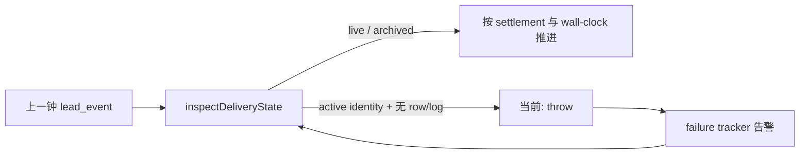

# FLY-2165 mailbox 撕裂 identity 自愈 — 探索
Issue: FLY-2165 (https://linear.app/geoforge3d/issue/FLY-2165/病根-mailbox-清理不盖-identity-归档章-inspectdeliverystate-硬抛-patrol-tick)
日期: 2026-08-29
基于: 无

## 1. 问题不是「重启后少发一钟」，而是永久进度障碍

`patrol_tick` 用 `lead_events` 保存上一钟，再用 `MailboxQueue.inspectDeliveryState()`
判断上一钟是否仍在投递、已终结，或从未入队。正常归档会留下两件永久证据：

1. `mailbox_log(event='archived')` 的完整行快照；
2. `mailbox_identity.archived_at` 从 `NULL` 单向盖章。

事故数据只有永久 identity，没有 live row，也没有 log。`inspectDeliveryState()` 对这个形状硬抛，
`patrol_tick` 每轮重新读取同一条上一钟并再次硬抛；单 Lead 的 failure isolation 只能保护别的 Lead，
不能让这条 Lead 自己跨过坏账。因此一次重启把短暂数据撕裂变成了无限重试同一障碍。

## 2. 主键级取证

### 2.1 当前生产库只读核对

对 `/Users/xiaorongli/.flywheel/comm/flywheel/comm.db` 的只读查询得到：

| 形状 | 数量 |
|---|---:|
| `identity.archived_at IS NULL` + 无 live `mailbox` + 零 `mailbox_log` | 63,914 |
| 上述坏账且 `mailbox_archive` 有同 id 原行 | 63,914 |
| 可由 ACKED/DEAD 且合法 terminal timestamp 无损重建 | 63,911 |
| DEAD 但 `dead_at` 缺失，不能诚实伪造 terminal settlement | 3 |

这与 issue 记录的事故前 63,916 完全相符：止血已修两条，剩 63,914 条。

### 2.2 删除绕过者已确认

`engineering/doc/FLY-2136-mailbox-deadscan-hotloop/design-correction.md` 记录：
2026-08-29T01:21Z 的止血事务把 66,272 条终态行 `INSERT INTO mailbox_archive` 后
直接 `DELETE FROM mailbox`，没有调用 `archiveFamily()`，所以没有 log 快照，也没有 identity 归档章。

仓内现有常驻路径不是绕过者：

- `MailboxQueue.archiveFamily()`：同一 immediate transaction 内 snapshot → content-ref intent →
  identity CAS → delete；
- `scripts/lib/fly-2006-mailbox-archive.mjs`：与 runtime 做 parity 的相同四步；
- `mailbox-migration.ts` 与 `receipt-teardown-closeout.ts`：均先写证据和 identity 再删 live row。

真正病根是 schema 只保护 identity 永久、log append-only、insert 必须有 active identity，
却没有保护 `DELETE mailbox`。任何人工 SQL 或未来脚本都能再次绕过归档合同。

## 3. 成功条件与边界

本单必须同时满足：

1. 任意 raw `DELETE mailbox` 若没有 archived snapshot 与 identity stamp，SQLite 自身拒绝；
2. `inspectDeliveryState()` 对既有撕裂记录返回可穷举的 `torn_identity`，不再抛；
3. `patrol_tick` 遇到上一钟 torn 时，不 replay 同一个 poisoned id；当前 slot 不重复，旧 slot 则
   mint `after-<previous.seq>` 新钟，下一轮可继续；
4. 提供一次性、默认 dry-run、apply 前强制 SQLite backup 的修复工具，只按 preserved
   `mailbox_archive` 的真实 terminal row 写 archived snapshot + identity stamp；3 条缺 terminal time
   的记录保持 torn 并在 receipt 中显式计数；
5. 不删除 `mailbox_archive`，不修改生产库，不部署或重启服务；本 PR 只交付机制、工具和测试。

## 4. 三种方案

### A. schema guard + typed degradation + wall-clock advance + evidence repair（推荐）

把防绕过放在 SQLite trigger，覆盖 runtime、脚本与人工 SQL；reader 保持只读，只报告 torn；
patrol 用已有 wall-clock slot 判断是否推进；repair 工具从 preserved 原行恢复合同证据。

优点：根因、运行时韧性、历史坏账三层都闭环；不把修复副作用藏进 reader。缺点：需要同时修改
comm schema、typed consumers、patrol 与运维脚本。

### B. `inspectDeliveryState()` 自动补章

reader 看到 torn 后立即写 log/stamp，再返回 archived。

拒绝：该 API 被 `CommDB.openReadonly()` 使用；多数 torn identity 自身没有 state/timestamp，只有
`mailbox_archive` 这个事故特有表保存史实。读操作写库会破坏边界，并诱导伪造 settlement。

### C. 只在 `patrol_tick` catch 后跳过

捕获异常并 mint 下一钟。

拒绝：其他 `inspectDeliveryState()` consumers 仍会硬抛，raw DELETE 仍可继续制造坏账，63,914 条
历史 debt 也没有恢复；这是症状绕行，不是归档合同修复。

## 5. 明示假设

- `mailbox_archive` 是一次性止血纪念表，不成为新的常驻归档协议；常驻仍统一走
  `mailbox_log + mailbox_identity`。
- torn 不等价于 ACKED/DEAD；缺少可信 terminal timestamp 时绝不猜。
- patrol 的 durable `lead_event` + `scheduled_at` 是 cadence authority。torn 只影响 mailbox
  settlement evidence，因此用 slot 推进可以至多漏一钟，不会在同一 slot 双发。
- 数据 repair 的执行与部署属于后续受控运维窗口；本 implement node 不触碰生产写状态。
