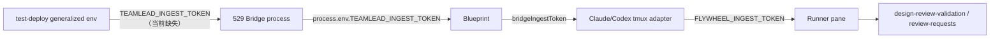

# FLY-2174 QA 房环境尾账 — 探索
Issue: FLY-2174 (https://linear.app/geoforge3d/issue/FLY-2174/fly-2165-尾账-3-条缺终态戳裁决-slot-membership-conflict-test-deploy-alerts-env)
日期: 2026-08-31
基于: 无

## 背景

FLY-2165 的 QA 在真实 529 房中确认主修复有效，同时留下五类边界项。本实现节点收到 Lead 的聚焦令：先修直接阻塞 FLY-2211 真机验收的两把钥匙，其余项目只在本阶段有明确、低风险证据时处理。

本阶段的首要交付是：

1. `scripts/test-deploy.sh --alerts` 不再把 v2 carrier 已拥有的 canonical Lead identity 字段重复塞进 `launchEnvironment`，从而让 Lead 能通过 `identity_launch_env_conflict` fail-closed 门启动。
2. generalized 529 Bridge 获得与 master API token 不同的 slot-local ingest token，使 Blueprint 能把它投影为 Runner 的 `FLYWHEEL_INGEST_TOKEN`，让 design validation 与 review-request 路径有 Bearer 凭据。

## 已核证现状

### `--alerts` 的 identity 冲突

`scripts/test-deploy.sh` 的 alerts 分支把两项追加到 `LEAD_EXTRA_ENV`：

- `FLYWHEEL_PROJECTS_FILE=${SLOT_DIR}/flywheel-projects.json`
- `${BOT_TOKEN_ENV}=${TEST_BOT_TOKEN}`

随后 `qa_slot_start_lead` 又建立自己的 canonical projects registry，并把同一个 bot token 写入 mode `0600` 的 wrapper env file。`scripts/flywheel-lead-wrapper-v2.sh` 明确拒绝 manifest 提供 `FLYWHEEL_PROJECTS_FILE`、`FLYWHEEL_PROJECTS`、`FLYWHEEL_SUMMARY_CONFIG_HOME`、`DISCORD_BOT_TOKEN` 或 canonical `BOT_TOKEN_ENV`。因此 alerts 分支必然在 carrier 投影 identity 前退出；QA 看到的首个报错是 `FLYWHEEL_PROJECTS_FILE identity_launch_env_conflict`，即使只删这一项，bot token 仍会成为下一项冲突。

`lead-alert.sh` 仍需要 projects registry 与 bot token，但它们已经由 v2 carrier 的 canonical projects file 和 wrapper env file 提供，不需要再经 `LEAD_EXTRA_ENV` 复制。

### generalized Runner 缺 ingest 凭据

generalized 分支当前只生成 `TEST_TEAMLEAD_API_TOKEN`，并把它作为 `TEAMLEAD_API_TOKEN` 启动 Bridge。Bridge 的 ingest 边界读取另一项 `TEAMLEAD_INGEST_TOKEN`，且配置合同要求两者不同。

数据流如下：

因为起点缺失，Blueprint 得到 `undefined`，两个 tmux adapter 都按合同省略 `FLYWHEEL_INGEST_TOKEN`。`flywheel-comm await-codex-gate` 随后在 Runner 内 fail-closed。

## 锁定边界

- 三条 torn identity 缺 terminal 时间戳：修复工具拒绝伪造是正确行为；采用创建时间保守归档还是永久豁免需要 founder 裁决。本节点不替 founder 写入终态。
- 63,914 条生产历史坏账：已有修复收据显示 63,911 条可修、3 条不可修，并实测约 19 分钟；停服修复窗和生产执行不属于 implement 节点权限。
- slot `membership_conflict`：现有证据标明为 FLY-2165 前置问题。首要两项完成后才继续追查，且不以猜测改 membership 解析。
- TMPDIR：当前 `test-deploy.sh` 已通过 `qa_generalized_safe_tmpdir` 将超长 runner TMPDIR 收敛到 `/tmp`，并同时投影给 Lead 与 Bridge。除非聚焦测试证明仍有未覆盖的启动边界，本节点不重复改造。
- 不修改 pinned design 之外的产品行为，不部署、不合并、不安排生产窗口。

## 明示假设

1. 529 房可以为 ingest 边界生成独立的 slot-local 随机凭据；不得复用 master API token。
2. alerts shell path 依赖的 canonical projects registry 与 bot token 应继续由 wrapper-v2 的单一 identity source 提供。
3. 普通非-generalized 房必须在 Bridge exec boundary 显式 scrub ambient production ingest bearer，才能可靠维持 tokenless ingest 行为；不能把当前继承行为当作安全前提。
4. 验收先以 hermetic 进程环境与 carrier manifest 断言覆盖，再由真实 `--alerts --generalized` 房验证 design gate 与 backend=`codex-tmux` implement worker；`test-deploy.sh` 没有 `--codex-runner` 参数。

## 成功判据

- hermetic alerts 用例证明 Lead manifest 中没有 identity-owned duplicate，Lead 能越过 wrapper-v2 identity gate。
- generalized Bridge 的 live env 含非空 `TEAMLEAD_INGEST_TOKEN`，且与 `TEAMLEAD_API_TOKEN` 不同；测试输出不泄露 token 字节。
- 既有 alerts channel、claims/queue/dead-letter 隔离与 bot route 仍保持。
- 聚焦测试、所有新增 `scripts/__tests__/*.test.sh`、全仓 lint/build/package tests 通过。
- code review 通过后创建 PR；不执行 merge 或 deploy。
