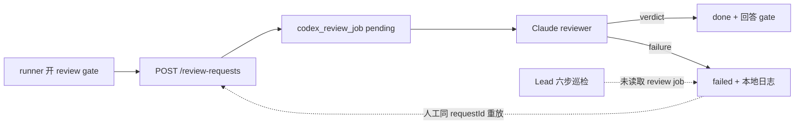

# FLY-2177 Review 失败恢复 — 探索
Issue: FLY-2177 (https://linear.app/geoforge3d/issue/FLY-2177/巡检缺口-code-review-job-failed-后无人重试无人告警-review-任务层纳入巡检面2155-空等5小时)
日期: 2026-08-30
基于: 无

## 1. 事故与用户损失

FLY-2155 的 code review R2 在 2026-08-29 23:49 左右因 Claude 订阅额度失败。失败行已经写进 `codex_review_job`，gate 继续 fail-close；但此后五小时既没有自动重试，也没有进入 Lead 六步巡检快照。直到 founder 追问，才有人沿既有正门用同一 `requestId` 手工重放，任务随即恢复并完成。

这不是“失败没被记录”，而是“记录后没有 consumer”。它与 FLY-2152 的“verdict 落库但无人推送”同族：持久化事实不等于事实已经被消费或送达。

## 2. 当前链路

已存在的恢复能力是正确的：`requestId` 是幂等键，`accept()` 对同绑定的 failed job 会重新验证 gate，再把同一行 `failed → running`。缺的是触发者和可靠可见性。

## 3. 方案比较

### A. 只补巡检 finding

在 STEP 4 读取 `codex_review_job.status='failed'`，排除 `head_moved` 与 `gate_answered_externally`，告诉 Lead 用同 `requestId` 重放 `POST /review-requests`。

优点是改动小、覆盖所有失败种类。缺点是修复速度仍受巡检频率与 Lead 消费速度限制；像 FLY-2155 这种 reset 后即可恢复的 quota failure 仍可能继续空等。

### B. Bridge 对可证明 quota reset 的失败定时重试，巡检补告警

Bridge 只在诊断同时满足两个条件时排期：

1. 明确是 Claude usage/subscription quota cap，不把 “not your usage limit” 或普通 rate limit 误判为 cap；
2. 诊断中能解析出绝对 reset 时刻或可转换为绝对时刻的 reset 文案。

排期沿用同一 `requestId`、持久化 retry 时刻和次数；到点后先重验 gate 与 code review frozen head，再进入现有 per-execution 串行队列。巡检 STEP 4 同时展示所有非无效化类 failed job，作为自动机制失效或不可自动分类时的安全网。

该方案直接补上 consumer，并保留人工正门，因此选择 B。

## 4. 锁定边界

- 不把 reviewer failure 变成 verdict；gate 始终 fail-close。
- 不改 `POST /review-requests` 的幂等绑定，也不创建新 request/新 round。
- 不自动重试 `head_moved`、`gate_answered_externally`、普通 429、无 reset 时刻或无法高置信识别的失败。
- 自动重试有小而固定的次数上限；最终失败必须通过现有 routed Lead alert 可见。
- Bridge 重启后必须从数据库恢复尚未到期/已到期的 retry 排期，不能靠内存 timer 作为唯一事实。
- 巡检保持只读，不直接修改 job，不直接调用重试接口。
- 不触碰 Claude/Lead 全局账号配置，不切模型，不重启 Bridge。

## 5. 公开 seam

批准计划将以下公开边界作为 TDD seam：

1. `ReviewRequestCoordinator.accept/redriveOnBoot/stop` 的可观察 job、review invocation、gate response 与 alert 行为；
2. `StateStore` 的 review-job schema 和状态转换方法；
3. `scripts/lead-patrol-snapshot.sh` 生成的 STEP 4 报告文本。

测试不绑定私有调用顺序；时间、timer、review subprocess、CommDB 与 routed alert 是系统边界，可通过依赖 seam 或 hermetic fixture 控制。

