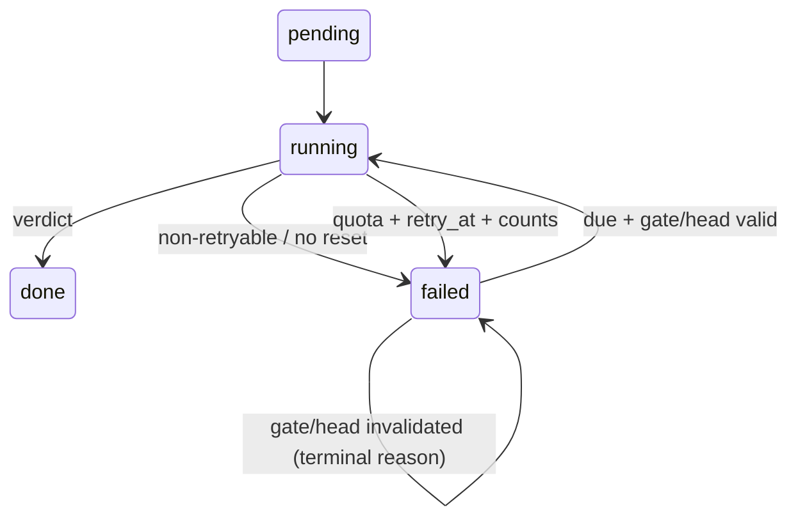

# FLY-2177 Review 失败恢复 — 实施计划
Issue: FLY-2177 (https://linear.app/geoforge3d/issue/FLY-2177/巡检缺口-code-review-job-failed-后无人重试无人告警-review-任务层纳入巡检面2155-空等5小时)
日期: 2026-08-30
基于: research.md

## 1. 目标与验收

补齐 `codex_review_job.failed` 的两个 consumer：

1. Bridge 对可证明 reset 时刻的 Claude usage/quota failure，按同 `requestId` 持久化、定时、有限次自动重试；
2. Lead routed alert 与六步巡检 STEP 4 能看到仍然 failed 的 review job，并给出同 `requestId` 重放 `POST /review-requests` 的正门。

验收时必须证明：FLY-2155 形状不会在 reset 后静默空等；同时 gate/head 已失效、普通 429、无法解析 reset 的失败不会被盲目自动重跑。

## 2. 不变量

- reviewer failure 永不生成 APPROVED/CHANGES verdict；review gate 保持关闭。
- `request_id` 仍是唯一幂等键；自动 retry 不创建新 job、不增加 round。
- code head authority 仍来自持久 worktree 的 `git rev-parse HEAD`，不信任 payload。
- per-execution 串行队列不变，不增加 coordinator-wide 并发状态机。
- 自动恢复受 store-managed default-on kill switch `review_quota_auto_retry` 控制，Bridge 运行中可即时关闭。
- 所有外部输入（failure raw、reset 文案、timezone）有长度/格式/时间范围校验；无法证明即不自动重试。
- routed alert 不发送 evidence tail 或 `failure_raw`，只给持久行定位与恢复动作。
- patrol 只读；owner attribution 任一歧义继续使整个 STEP fail-closed。
- 不改 `/review-requests` HTTP contract，不改 runner contract，不触碰 `CLAUDE.md`。

## 3. 文件范围

预计修改：

- `packages/teamlead/src/StateStore.ts`
- `packages/teamlead/src/bridge/review-quota-retry.ts`（新增纯 parser）
- `packages/teamlead/src/bridge/review-request-coordinator.ts`
- `packages/teamlead/src/bridge/review-governance-effects.ts`
- `packages/teamlead/src/bridge/infra-event-router.ts`
- `packages/teamlead/src/bridge/flag-store-runtime.ts`
- `packages/teamlead/src/bridge/plugin.ts`
- `packages/teamlead/src/LeadAlertNotifier.ts`
- `packages/teamlead/src/bridge/kind-contract.ts`
- `packages/teamlead/src/bridge/alert-kind-copy.ts`
- `packages/config/src/feature-flags/registry.ts`
- `packages/config/src/feature-flags/store-policy.ts`
- 对应的 teamlead tests
- `scripts/lead-patrol-snapshot.sh`
- `scripts/__tests__/lead-patrol-snapshot.test.sh`
- 本文件夹 full docs/progress
- 最后一提交 `engineering/doc/milestones/FLY-2177.md`

若实现中发现需要修改 HTTP payload、CommDB schema、workflow engine 或 quota account switching，视为超出批准范围，先停下问 Lead。

## 4. TDD 垂直切片

每个切片严格执行：先写一个公开 seam 的失败测试并实际看到预期红，再写最小实现并看到绿；不先批量铺测试。

### Slice 1 — quota reset parser

**Red**：新增纯函数测试，逐个钉住现网 `failure_raw` 精确 fixture：session `5:10pm`、session `12am`、weekly `Aug 26 at 7pm`、可选 `progress saved`；再补普通 429、仅 marker、`not your usage limit`、坏 timezone、过去/超 8 天 reset。

**Green**：新增 `review-quota-retry.ts`：

- 要求 JSON envelope `api_error_status=429` 与 `You've hit your session|weekly limit` 同时成立；
- 仅解析现网已观察的 IANA wall-clock/month-day 语法，不从 TUI/相对时间猜测；
- 注入 `now`；
- 只返回合理未来窗口（最长不超过 8 天）的 epoch ms，否则 null。

### Slice 2 — durable retry fields/state transitions

**Red**：StateStore 测试覆盖新库默认列、legacy 表缺列迁移、failure attempt 单调计数、schedule CAS/上限、claim 清 retry_at、complete/terminal fail 清排期、boot list 顺序。

**Green**：

- schema + 缺列迁移新增 `retry_at`、`auto_retry_count`、`failure_attempt_count`；
- `CodexReviewJob` 暴露字段；
- reviewer failure 用单次条件 UPDATE 原子写 failure、递增 `failure_attempt_count`，在预算允许时同时递增 `auto_retry_count` 并写 `retry_at`；
- 新增 `listScheduledCodexReviewJobs()`；
- `claim/complete/fail` 保持状态机并正确处理 retry_at。

持久自动计数上限固定为 3；StateStore 用条件 UPDATE 做最终并发边界。alert event id 使用每次 failure 都递增的 attempt count，不使用仅在可排期时才变化的 auto count。

### Slice 3 — coordinator timer 与 reset 后重试

**Red**：从现有“quota 不重试”测试拆出 genuine cap + reset 场景，注入 fake clock/timer，断言：首次失败 row 已排期、未到点不 invoke、到点后同 requestId 再 invoke并可 done；多个同 reset request 的目标时刻有稳定 0..5min 分散。

**Green**：

- coordinator deps 增加窄 clock/timer seam；
- 维护 requestId→timer handle map；
- deps 增加 call-time `quotaAutoRetryEnabled()`；关闭时不为新 failure 排期，已排期 timer 不 spawn且低频重读开关；
- failure 时 parser 成功、reset 仍早于 bound gate expiry、StateStore 预算 CAS 成功，则按 `reset + 60s grace + hash(requestId)%5min` 注册 timer；
- timer 到点调用已有 enqueue，不走新执行通路；
- `stop()` 清所有 timer；超长 delay 分段/重算，不能超过 Node timer 上限。

### Slice 4 — retry 前 gate/head 重验与 boot replay

**Red**：分别证明 restart 恢复 future/due retry；reset 晚于 gate TTL 不排期；gate answered/expired/missing/mismatch 与 code head moved 时 timer 到点不 spawn并落具体无效化 reason。

**Green**：把 gate probe 收紧为 `{state, expiresAt}`，timer callback 每次重读 job，检查 due/status/kill switch；用具体 gate state、`tryDeriveHead()` 重新证明 binding，再 enqueue。answered 映射 `gate_answered_externally`，expired/missing/mismatch 保留 `gate_*`。`redriveOnBoot()` 除原 pending/running/outbox 外，恢复 `listScheduledCodexReviewJobs()`。

### Slice 5 — structured Lead alert

**Red**：coordinator 测试断言首次排期和最终/不可排期 failure 都 emit `review_job_failed`；production effect 测试断言 owning Lead、warning、按 failure-attempt 稳定的 event id，且 secret/raw evidence 不进 body；infra router 测试断言有绑定时进 issue thread、无绑定 fail-safe ticket。kind registry 的全覆盖测试先红。

**Green**：

- `ReviewAlertKind`/`ALERT_EVENT_TYPES`/kind contract/copy switches 加 `review_job_failed`，并加入 `ISSUE_PROGRESS_KINDS`；
- `createReviewAlertEmitter()` 映射 warning title；
- `failReviewerOutcome()` 先持久化，再 emit routed alert；alert sink 失败只记日志，不改变 fail-close job 状态。

event id 采用 `review-failed:<requestId>:<failureAttemptCount>`，手工 retry 即使从未排期也形成新 generation。body 只含 issue/type/round/reason/retryAt 或 same-request recovery，不含 raw tail。

### Slice 5b — managed kill switch wiring

**Red**：registry/store authoring guard 与 flag-store runtime 测试先证明未登记/未接线失败；coordinator fake clock 测试证明运行中从 ON 切到 OFF 会阻止 due timer spawn，恢复 ON 后同一持久排期可继续。

**Green**：按 flag authoring runbook 原子加入 registry、`STORE_MANAGED_FLAGS`、default-on codec、命名 wrapper 与 plugin call-time dep；不直接读取 `process.env`，不新增豁免。

### Slice 6 — patrol STEP 4

**Red**：在 hermetic real StateStore/CommDB fixture 插入：own live/recent eligible failed、own terminal/old/non-live excluded reason、foreign Lead、foreign project、含 secret failure_raw；再插入大量缺 CommDB session 的历史 failed rows。期望历史 rows 在 attribution 前被裁掉，eligible 行仍出现完整 requestId 与 same-request recovery；当前候选 owner ambiguity 继续 fail-closed。

**Green**：在 STEP 4 SQL 先构造 `failed_review_candidates`：job/session project 相符、存在同 execution 的 live StateStore session、最近 24h、排除 `head_moved/gate_answered_externally/gate_answered/gate_expired/gate_mismatch`；只有裁剪后的 execution/issue 进入 `attribution_subjects`，再 union `REVIEW_JOB_FAILED ... recovery=POST /review-requests same requestId`。不读取/输出 failure_raw。

## 5. Retry 精确语义

常量：

- `MAX_AUTO_RETRIES = 3`
- `RESET_GRACE_MS = 60_000`
- `MAX_RETRY_JITTER_MS = 300_000`
- `GATE_EXPIRY_SAFETY_MS = 60_000`
- `MAX_RESET_HORIZON_MS = 8 days`

状态流：



排期 row 在等待期间保持 `status='failed'`，使巡检与运营查询能看见；`retry_at` 区分“已有 consumer 接手”与“无人接手”。reset 太晚、gate TTL 不足、flag OFF、parser 不确定或预算耗尽时不写 retry_at。

## 6. Patrol finding 形状

示例（不包含 raw）：

```text
REVIEW_JOB_FAILED issue=FLY-2155 request=d1d1e9ba-8337-484b-b159-91887e26e987 type=code round=2 reason=nonzero_exit updated=2026-08-30 00:01:00 retry_at=2026-08-30T00:11:00.000Z recovery=POST_/review-requests_same_requestId
```

候选只取 live StateStore session + 最近 24h；再排除明确不能用同 request 重放的 `head_moved`、`gate_answered_externally`、`gate_answered`、`gate_expired`、`gate_mismatch`。`gate_missing` 保留：CommDB 短暂不可读恢复后，同 request 正门仍可能成功。Lead 使用提示前仍由 `/review-requests` 的 gate/binding 校验 fail-close。

## 7. Commit 与 restart-resilience

小提交顺序：

1. full docs + approved plan；
2. parser tests+implementation；
3. StateStore tests+schema/state；
4. coordinator timer/boot tests+implementation；
5. routed alert tests+registry；
6. patrol shell test+SQL；
7. review fixes（如有）；
8. PR 内容全部完成后，`engineering/doc/milestones/FLY-2177.md` 作为 literal last commit。

每批后运行 `flywheel-comm progress` 更新 cursor/chunk。任何重启都从 committed code + progress.md 恢复。

## 8. 验证与 gate

聚焦验证：

- teamlead parser/StateStore/coordinator/review alert/kind tests；
- `pnpm -r build` 后 `bash scripts/__tests__/lead-patrol-snapshot.test.sh`；
- mutation/negative guard：去掉 genuine-cap guard、去掉 gate/head preflight、去掉 failed-review SQL union 时对应测试必须红。

全仓硬门按顺序执行：

1. `pnpm lint`
2. `pnpm -r build`
3. `pnpm test:packages:run`
4. 每个新增 `scripts/__tests__/*.test.sh`（本任务不预计新增文件；修改的现有 shell test 仍单独执行）

随后按 runner contract 通过 `codex:rescue` 发起 code review，注册 `review_code` gate；blocking finding 修复后必须新开 gate/新 review round。通过后再 push/open PR，立刻重查 inbox，最后提交 milestone，push exact head，运行 implement completion route：

```text
complete --route needs_review --pr <NUMBER>
```

不 dispatch QA、不申请 ship、不 merge、不部署。
