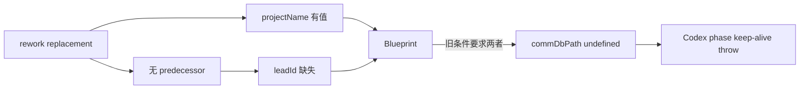

# FLY-2182 替换体 CommDB 路径 — 探索
Issue: FLY-2182 (https://linear.app/geoforge3d/issue/FLY-2182/引擎急-codex-tmux-替换体-spawn-必挂-引擎-reworkreplacement-派发不带-leadid)
日期: 2026-08-29
基于: 无

## 1. 问题边界

generalized workflow 的 rework replacement 已经有确定的 `projectName`、execution identity、node role 与 Codex runtime dispatch，但它不一定有 predecessor session。当前 `WorkflowEngineDispatcher` 只从 predecessor execution 解析 `leadId`；因此以 founder rework 的 `base_revision` 重铸 replacement 时，合法出现 `projectName` 有值而 `leadId` 缺失。

`Blueprint` 却用 `ctx.leadId && ctx.projectName` 共同决定是否计算 `commDbPath`。Codex phase keep-alive 在 daemon spawn 前要求 CommDB session 注册，收到 `undefined` 后 fail-loud：

这解释了 FLY-2152 implement@5 replacement `2690f045`：凭证配置已经正确，但进程尚未真正启动就因 CommDB 注册前置条件失败。

## 2. 已确认事实

- `packages/teamlead/src/bridge/workflow-engine-dispatcher.ts` 始终从 `workflow_run.project_name` 写入 replacement 的 `StartRequest.projectName`。
- 同一文件的 `leadId` 只在找到 predecessor execution 时调用 `resolveLeadId`；base-revision replacement 不依赖 predecessor，故字段可缺失。
- 仓内已有 replacement 专用的 `resolveWorkflowReplacementLeadIntent`（FLY-2018）：只接受 run 项目配置内的 Lead；优先合法的 `workflow_run.selected_by`，否则用 `resolveLeadForIssue(project, labels)` 选项目内 Lead。它不会产出 `unassigned` 或跨项目 global fallback。
- `packages/edge-worker/src/Blueprint.ts` 生成的路径只读取 `$HOME`、`projectName`，从未把 `leadId` 放进目录结构。
- Bridge 的 `commDbPathForProject(projectName)` 与 `defaultGetCommDbPath(projectName)` 都证明 CommDB 的定位键是项目，不是 Lead。
- `packages/claude-runner/src/CodexTmuxAdapter.ts` 对 phase keep-alive 缺失 CommDB 的 fail-loud 守卫是正确保护：resident phase 的 doorbell/park/TURN 生命周期依赖这条注册，不应放宽。

## 3. 方案比较

### A. replacement 派发链补 `leadId`

保留 predecessor-label Lead 为第一选择；它缺失时复用 FLY-2018 的 replacement Lead intent。生产 resolver 校验项目成员资格，补齐后不仅 `commDbPath` 恢复，Blueprint 的 ask/inbox/gate 指令、CommDB `lead_id`、TURN wait/wake 升级也都有项目内 Lead。resolver 无法给出合法 intent 时继续留空，让既有 phase keep-alive 守卫 fail-loud。

### B. Blueprint 仅以 `projectName` 推导 `commDbPath`

删除多余的 `ctx.leadId &&` 条件可以解除当前 pre-spawn throw，但 replacement 仍会以 `lead_id=NULL` 注册：prompt 不含 ask/inbox/gate 的真实 Lead，TURN wait/wake 无法升级告警。这会把确定性 fail-loud 换成更难观察的哑跑；同时全局改变所有“有 projectName、无 leadId”的普通 session，blast radius 超出 replacement。

### C. 放宽 Codex phase keep-alive 守卫

会让 resident phase 在没有 doorbell/park/TURN 账本的情况下继续运行，制造更难诊断的半活体，不符合 FLY-887/FLY-1269 的 fail-closed 契约。

## 4. 结论

选择 A。最小实现是：给 dispatcher 注入现有 replacement Lead intent resolver，并在 predecessor Lead 解析结果为 `undefined` 时用 `??` fallback。Blueprint、adapter、路径规则、resolver 本体和 schema 全部不改。

spawn 失败后 workflow node 的半铸/`running` 幽灵属于已在 FLY-2072 台账记录的通用 launch settlement 问题。本单不扩成第二套回滚机制；已有 `releaseFailedWorkflowLaunch`/unlaunched recovery 继续负责该类故障，本单直接消除这条确定性的 pre-spawn 失败源。
