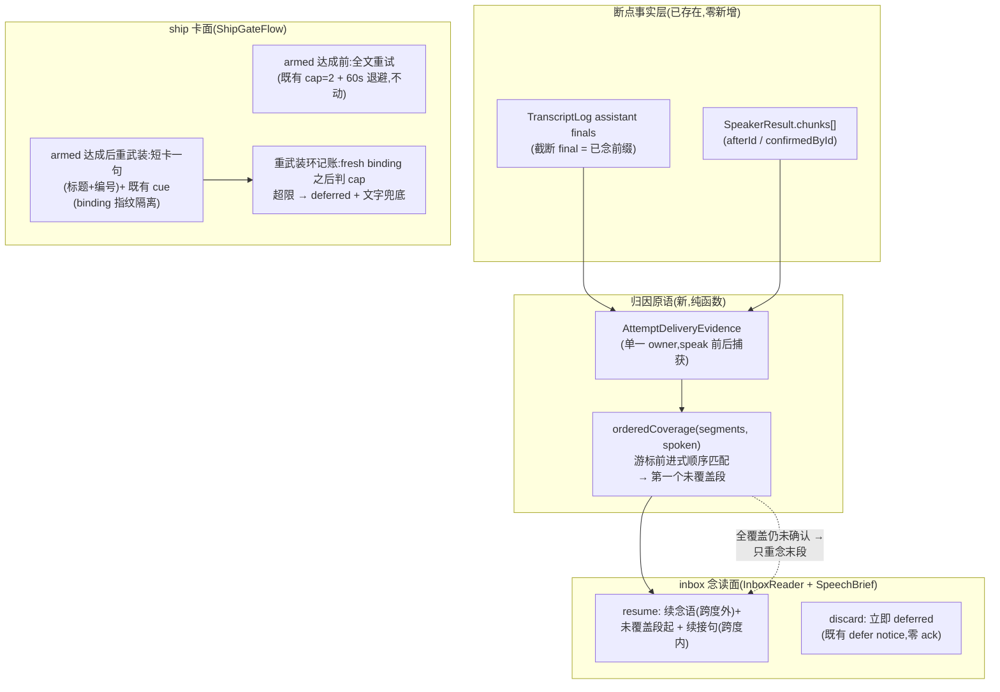

# FLY-2205 插嘴后旧稿不整篇重念 — 实施计划
Issue: FLY-2205 (https://linear.app/geoforge3d/issue/FLY-2205/raya语音-插嘴后旧稿重念一遍被打断的内容不该从头再来)
日期: 2026-08-31
基于: research.md、exploration.md

> 世界标记:[raya-main] = raya `origin/main` `1c71cd2`(当前产品 = 逐轮对话 + VoiceTextMirror,无自定义打断层)。回滚基线 = 1c71cd2 行为。
> 成色:🔶 = 占位/推断,founder 一纠正即作废;⬜ = 未知。
> ⛔ 本计划不设任何验收阈值数字;新增时间/次数量全走 `RAYA_VOICE_OPTIONS_JSON` 可改项,默认值全部 🔶(既有硬编码合同如 `MAX_ATTEMPTS_PER_SESSION=2`、`inboxRetryBackoffMs` 默认值保持不动,本单不把它们变成新配置)。
> ⛔ 本单是设计节点产物,供 implement 节点执行。改动全部在 raya 仓;ship 走 flywheel 主仓锚 PR 铁律(FLY-2203/verdict7 血训:`complete --pr` 只登记 flywheel 锚 PR 号)。
> ⛔ **激活门(Codex R1-1/R2-3/R3-2,三条全要,缺一 `resume` 不开)**:① FLY-2178 C2 人工听样裁决为「非可听切断」;② C5 backlog 探针数据已产出并呈 founder(见 §6 C5b);③ founder 在「transcript best-effort 可能跳过未真听到的多段内容」原文告知下的知情选择回执。裁决前代码可合入但 flag 保持 off。本单**不得**自行放宽 2178 的任何证伪停机门。
> ⚠️ **SUPERSEDED（2026-08-31 founder 终裁；header 激活门）**：上条三项激活门已全部作废；策略已写死恒开且没有运行时开关。第二项「真机播放积压数据先摆给你看」未执行；此处只保留原设计合同，不表示 founder 已对 transcript best-effort 残余面作知情同意。当前事实见 `../milestones/FLY-2205.md`。

---

## 0. 目标、非目标、授权

### 0.1 目标

被打断/未确认的念读稿**再次交付时不整篇重念**。具体两面:

1. **inbox 念读稿(speechBrief 三段)**:重试时从**断点段落**继续(带一句跨度外续念语),断点由顺序覆盖归因(transcript 文本层,零声学零阈值)得出;founder 可切换为「直接作废」。
2. **ship 卡**:卡完整交付过一次(**armed 达成**)之后,武装态被打断的重武装**不整卡重念**,改为短卡一句(标题+编号)+ 既有 cue;并给这个今天**零记账零退避**的环补上有界性(cap,超限文字兜底 + 本场判 deferred)。verdict6 follow-up#2 的原话建议「重复上限或改短提示」两个都取。

### 0.2 非目标

不判条目命运、不定「何时回来」(四值仲裁/空闲门/队尾归 FLY-2178);不修 assistant final 间歇缺失(归 FLY-2159,final 缺失时本单退化为全文 = 今天行为);不动 Bridge / brain / `@raya/contracts`(ack 四值与 at-least-once 重播零改动,断点状态全内存态);不做跨 session 断点持久化(下场重播仍是全文,崩溃恢复合同);不动 ship 词表/宽容匹配/武装 cue 时序(qa⑥ 已验面);不动拒绝旁白文本(qa⑥③ 已验差分面);不动 relay readback / OutboxWatcher 旁白(短文本,无实录痛点,写进诚实边界);不动 20ms 常开流与 R16 硬门;不为 QA bot 引入任何权限面;不扩大文字通道原文暴露面(FLY-2030 前置缺口,复用既有 `summary()` 形状);**「要点一句后作废」形态移出本单实施范围**(Codex R1-8:未被选中的分支不预建;她若点名要,走 design-correction 增量补)。

### 0.3 授权记录

| 决定 | 来源 | 约束 |
|---|---|---|
| 「被打断的内容不该从头再来」独立成单;可接受形态:断点续 / 只补要点 / 作废进下一轮,设计段定 | issue 正文(founder 实测痛点,90 秒实录) | 以她的实际体感为准;founder HTML 决策点定默认形态;设计段裁定实施 断点续+作废 两形(要点形移出,理由见 §5) |
| 「重复上限或改短提示」 | verdict6 follow-up#2(✅ [qa]/verdict6.txt:43) | ship 卡两个都做 |
| 「当前这轮停了就停了,等我说完新问题进下一轮」 | 她对 2178 的语义定义(issue 引用) | 被打断轮不得以「从头再来」还魂;本单管内容,时机归 2178 |
| 与 2178 实现互不阻塞,QA 联测 | issue 边界 | 基线 1c71cd2,不依赖 2178 未合入分支产物;联测合同见 §4 |
| flag 默认 off 直到 founder 轮 PASS | FLY-2031/2178 惯例 | flag off = 1c71cd2 行为,以独立差分 oracle 证明(D1) |

> ⚠️ **SUPERSEDED（2026-08-31 founder 终裁；§0.3 授权表）**：上表「flag 默认 off」授权被随后直令取代。最终授权是「写死+删旋钮」：策略恒开、无开关，回滚仅靠 `git revert` 到 immutable `1c71cd2` 基线。

## 1. 架构总览



一句话:**断点交给 transcript 归因(覆盖窗截断在她开口那一刻),内容交给分段渲染,ship 卡交给短卡 + 上限;命运与时机一概不碰(归 2178)。** flag off 时以上全部不存在。

## 2. 模块与接口(改动面,全部 raya 仓)

### 2.1 配置(`apps/voice/src/config.ts`,全走 `RAYA_VOICE_OPTIONS_JSON`)

| 配置 | 默认(🔶) | 说明 |
|---|---|---|
| `rereadPolicyEnabled` | `false` | 总开关。off = 与 1c71cd2 行为一致(D1 独立差分证明);on 才装配下述一切 |
| `rereadPolicyMode` | `"resume"` | `"resume"` \| `"discard"`;只作用于 inbox 念读稿(ship 卡不受 mode 影响);枚举外取值(含 `"recap_discard"`)⇒ config fail-closed 拒起 |
| `shipRearmCap` | `2` | 每条 ship 卡在**同一 binding 指纹**下每 session 允许的重武装次数;超限 ⇒ deferred + 文字兜底 |

⛔ 三个 key 在 flag off 时允许存在但无行为;非法值一律拒起。
⛔ **组合互斥守卫(Codex R2-2,R3-1 修正)**:options JSON 原始值中 **三条同真** `rereadPolicyEnabled=true ∧ bargeInEnabled=true ∧ rereadPolicyMode="discard"` ⇒ config fail-closed 拒起(按原始 option 值判,不依赖 2178 是否已合入;组合世界只支持 `resume`,见 §4)。⛔ `rereadPolicyEnabled=false` 时守卫**绝不触发**——本单三 key 在 flag off 时保持惰性,不得成为 2178-only 配置的启动依赖(`{rereadPolicyEnabled:false, rereadPolicyMode:"discard", bargeInEnabled:true}` 必须可启动);config 测试覆盖全真值表(D1 相关格 + 双开+discard 拒起格)。

> ⚠️ **SUPERSEDED（2026-08-31 founder 终裁；§2.1 配置表）**：本节保留历史设计形状；当前实现已删除 `rereadPolicyEnabled`，只保留 `rereadPolicyMode` 与 `shipRearmCap`。策略恒开后，互斥守卫按可达的 `rereadPolicyMode="discard" ∧ bargeInEnabled=true` 两键组合 fail-closed。

### 2.2 归因原语(新:`apps/voice/src/speech/Coverage.ts`)

- `comparableSpeech()` 从 `InboxReader.ts` **原样搬入**本模块并导出(行为零变化,InboxReader 改 import;搬家由既有确认路径测试钉住)。
- `orderedCoverage(segments: string[], spoken: string): number`:
  - `spoken` = **覆盖窗**内 assistant finals 文本按到达序拼接后 `comparableSpeech` 归一化;
  - 逐段(每段先 `comparableSpeech`)做**游标前进式**匹配,**单一坐标系(Codex R2-4)**:`indexOf(segment, cursor)`,命中则 `cursor = 命中起点 + segment.length`(**同为 UTF-16 code units**,⛔ 不得用 `Array.from(...).length` 混入 code-point 计数——astral 字符会把游标推进到命中段内部,造成后段假命中;D3 收录该反例);段文本重复时取游标之后的首个命中,⛔ 不取游标之前的早期重复(Codex R1-5);
  - 返回第一个未命中段的下标(0..segments.length);空归一化段视为覆盖;
  - 纯函数,零 IO,零阈值。(presenter 的确认跨度仍按 code points 计,两处坐标系各自内部一致,互不换算。)
- **覆盖窗定义(Codex R1-1 收紧)**:该 attempt 的 `firstAfterId` 之后、**下列最早者**之前的 assistant finals:①该窗内第一个 user entry(她开口那一刻起,后续 final 的音频可能已被服务端截断或没播到她耳朵,一概不计);②失败处置时刻。⇒「user final 先到、旧完整 final 后到」的形态下,后到的旧 final **不计覆盖**,fail-closed 回退到更早断点/全文(D9)。
- **「final = 可听覆盖」是待证假设,不是已证事实(Codex R1-1)**:runtime 只见 transcript,看不见音频截断。FLY-2178 C2 当前 `awaiting_human_audio_review`(`canStartC3=false`),呼吸臂已出现〈刺激窗内 303ms 可听间隙 + assistant final 完整 + 无 user final〉待人听裁决——若裁定为真可听切断,即 2178 P-B0 第二停机条件命中(false-spoken 形存在),「窗内 final ⇒ 已听到」在无 user final 的窗内也不成立。**激活门(三条,全要)**:`resume` 模式 flag-on 押在:① 2178 C2 该裁决为「非可听切断」(裁定命中或不可归因 ⇒ 本单 stop-and-report,resume 不激活,归因假设重议),⛔ 不擅自放宽 2178 任何门;② backlog 探针数据(上条「残余风险」②)已取得并呈 founder;③ founder 在「transcript best-effort 可能跳过未真听到的多段内容」原文告知下仍选 resume 的**知情回执**(她不接受时的安全替代:2178 off 世界用本单 `discard`;2178 on 世界用其 `bargeInAutoResume="next-session"`,本单 mode 保持 resume——R3-1)。三条门是 flag-on 的**规范性验收项**(§6 C5b),不是建议。代码合入不受此门阻塞(flag off 零行为)。
- 形态预期(如实):[raya-main] 原生世界若确认「不停口」,assistant final 多为完整形 ⇒ 覆盖常呈全有全无,resume 退化为「末段 clamp 或全文」;截断 final 带来的**中段断点**主要在 2178 停口世界出现 —— resume 的完整价值随 2178 落地兑现,本单先把渲染与归因铺好。
- **残余风险(Codex R2-3 更正,⛔ 无上界,不再声称「单段尾部」)**:transcript final 的到达时刻是**生成完成**时刻,不是播放完成时刻;`Downlink` 的 `FrameQueue` 积压无上界(`Downlink.ts:29,75`;`targetFrames` 只管播放流补帧)。⇒ 完整 final 可以早于她开口到达,而多段内容仍堵在本地队列未播 —— 覆盖窗判「已覆盖」的段中,她实际没听到的可能**不止一段**。两点如实补充:
  - [raya-main] 原生管线**不掐播放**(r17c:她出声期间可听帧仍占 78–80%),排队音频最终都会播进房间(teardown 除外)——「没听到」在今天主要表现为「在她说话时播完 / 离房时被丢」;真正会整段蒸发的形态出现在 2178 Layer 1 flush 的组合世界,而那个世界里恢复渲染由 2178 的仲裁记录喂 coverage(§4),flush 事实可由其闩锁事件参与归因。
  - 结构性受限:精确的「可听栅栏」需要 outputAudio 带响应身份做逐段音频归属,上游协议不提供(与 2178 R2-2 记载的同一缺口)——本单不假装能修。
  ⇒ 处置:①「resume 是 transcript 层 best-effort,可能跳过她没真听到的多段内容」这句话原文进 founder HTML,作为 Q1 选 resume 的前提告知(她若不接受:2178 off 世界用本单 `discard`;2178 on 世界用其 `bargeInAutoResume="next-session"`);②激活门(见下)追加一项 backlog 探针(实测子步 = §6 C5b):真房实测典型念读的「final 到达 → 播放完成」间隙与积压形状,数据进 founder HTML 做预期管理;③对抗规格 D22:完整 pre-user final + 多段本地积压 ⇒ 行为 = 按窗判定(clamp 规则),evidence 带 `resumeFrom/coverage 依据`可审计,文档不得声称更强保证。

### 2.3 attempt 交付证据(单一 owner;Codex R1-5)

`InboxReader` 每次注入前固定、失败时封口一份 `AttemptDeliveryEvidence`(内存态,generation-bound):

```ts
interface AttemptDeliveryEvidence {
  generation: number;          // 装配时的 session generation
  itemId: string;
  resumeBase: number;          // 本次注入的起始段下标(全文注入 = 0)
  segments: string[];          // 本次实际渲染的段序列(speak 调用前固定)
  firstAfterId: string | null;  // speak 结果首 chunk 的 afterId;无进入确认阶段的 chunk ⇒ null
  completedChunkResults: number; // = chunks.length:进入确认阶段并 settle 的 chunk 数。
                                 // ⚠️ 这不是「append 已发出」的真值(Codex R2-6):append sent 后、
                                 // 确认 settle 前被 invalidate ⇒ status="dropped" 且本值=0,
                                 // 即使语音已注入 —— 本字段只作分派守卫,不作注入审计
  status: SpeakerResult["status"];
}
```

- 数据来源全部现成:`SpeakerResult.chunks[]`(`Speaker.ts:35-45`)与 `TranscriptLog`(via 新增 `InboxReaderOptions.transcripts` 注入,窄只读);⛔ 不改 `Speaker` 返回形状。
- 覆盖计算在**失败处置时刻**执行恰一次:窗按 §2.2 截断;分派守卫 = `status === "unconfirmed"`(蕴含 `completedChunkResults > 0`);`failed`/抛错/零 completed chunk ⇒ **coverage 不计算,resumeFrom 不动**(fail-closed;D19/D20);`dropped`(含 append-sent-后-invalidate 形)⇒ 整体 no-op(D18/D20 分别测「append 未发」与「append 已发但 invalidate」两形);绝对断点 = `resumeBase + orderedCoverage(...)`。
- TranscriptLog 游标不可用(id 已被淘汰/`entriesAfter` 异常)⇒ coverage=0 处理,resumeFrom 不动(D19)。

### 2.4 续念渲染(`apps/voice/src/inbox/SpeechBrief.ts`)

`renderInboxSpeech(item, remaining, resumeFrom = 0)`:

- `resumeFrom = 0` ⇒ 输出与现行**逐字节一致**(text 与 confirmStart=0/confirmEnd=全文,D2);
- `resumeFrom ∈ [1, 段数-1]` ⇒ `text = RESUME_PREFIX + segments[resumeFrom..] + 既有续接句尾`;`confirmStart = len(RESUME_PREFIX)`,`confirmEnd = len(text)` —— 续念语在**跨度外**、正文与续接句在跨度内(沿用 2178 R1-9 已定规则);
- `RESUME_PREFIX` 🔶 `「刚才被打断了,接着说：」`(常量,不进配置;无数字,不触 `internal_identifier` 校验;founder HTML 可改措辞);
- 入参守卫:`resumeFrom` 超界抛错(调用方 clamp,见 §2.5)。

### 2.5 InboxReader(`apps/voice/src/inbox/InboxReader.ts`)

- **失败分类学(Codex R1-4,写死)**:
  - `status === "unconfirmed"`(蕴含 `completedChunkResults > 0`)⇒ **内容级中断**,才进入 coverage 计算与 mode 分派;
  - `failed` / 抛错(注入前基础设施失败)⇒ 既有 retry 链**逐字节不变**,零 coverage 零 mode 副作用;
  - `dropped`(invalidate/Draining)⇒ 记账走既有路径(flag off 等价),**零 mode 副作用、零新 speak、零 notice、零事件**;
  - flag off ⇒ 全部走今天的 `noteAttemptFailure`,分类学不存在。
- `AttemptState` += `resumeFrom: number`(初始 0;**只单调前进**:`max(旧, 新)`;generation 切换/invalidate 即随整个 map 弃置)。
- 内容级中断的 mode 分派:
  - `resume`:走既有重试链(count/nextAt/cap **一概不变**),仅下次渲染带 `resumeFrom`(clamp:全覆盖未确认 ⇒ `段数-1`,只重念末段,⛔ 不凭归因直接 ack —— ack 仍只由确认交付写,D8);
  - `discard`:立即 `deferred=true` + 既有 defer notice(needsDecision 条目,文本逐字节复用)→ 零 ack,下场全文重播。
- **generation-bound 取消(Codex R1-4)**:`InboxReader` 新增 `invalidate()`:置 token 失效、清 timer、弃置 attempts/evidence 状态;所有 `await` 续段(coverage 计算、mode 分派、defer notice、ack、evidence 事件)执行前检查 token,失效即 no-op。runtime 在 teardown(`stopBehaviorModules`)时调用,先于/伴随 `speaker.invalidate()`;悬挂中的 `speak()` 以 `dropped` 归来时按上面分类学 no-op(D18)。flag off 时 `invalidate()` 仅清 timer(= 今天的 `stop()` 行为)+ token(token 只被 flag-on 路径读取,零行为差)。
- ship 分支新增处置:`processShipGate` 返回新值 `"deferred"` ⇒ `deferred=true` + 既有 defer notice 恰一次;`"retry"/"unavailable"/异常` 的既有处置零变化。
- flag off ⇒ 本节全部不执行,行为逐字节 = 1c71cd2。

### 2.6 ShipGateFlow(`apps/voice/src/approval/ShipGateFlow.ts`)

- 新内存态(实例级,`invalidate()` 时清空;⛔ 不跨 session generation 存活):

```ts
interface ShipRearmState {
  fingerprint: { questionId: string; prHeadSha: string; issueId: string; prNumber: number };
  delivered: boolean;   // 本指纹下卡是否完整交付过(armed 达成)
  cycles: number;       // 本指纹下武装态中断次数
}
// Map<itemId, ShipRearmState>
```

- **写入点(Codex R1-3)**:`delivered=true` **只在** `prepare()` 即将返回 `"armed"` 的单一转移点写入(cue confirmed 且 `this.armed?.item.id === item.id` 检查已过)。prompt confirmed 但后续任何一步失败(`transcript_during_audible_tail` / `inactive_before_approval_cue` / `transcript_before_approval_cue` / `approval_cue_not_confirmed` / `approval_cue_context_lost` / `prompt_cursor_missing`)⇒ 不写,下次仍整卡(D10)。
- **指纹隔离与判序(Codex R1-2)**:cap 判定移到 `prepare()` 内、**fresh `getGateBinding()` 成功之后**:
  1. 取 fresh binding → 与存量 `fingerprint` 比对(四元同 `sameBinding`);
  2. **不同** ⇒ 原子重置该 item 状态(`delivered=false, cycles=0`)→ 整卡路径,全新预算(D12);
  3. **相同且 `cycles > shipRearmCap`** ⇒ 记 `reread_ship_capped` ⇒ 返回 `"deferred"`(D13;InboxReader 落 deferred 后 `canAttempt=false`,不再有后续 binding 轮询);
  4. 相同且未超限且 `delivered` ⇒ 短卡路径;否则整卡。
- **defer 之后的 binding 变化(Codex R2-1,合同收窄,如实)**:落 `deferred` 后本 session 不再触达该 item(既有 `canAttempt` 语义),⇒ **defer 之后**同一 item 的指纹变化在本 session 观察不到,要等下场 at-least-once 重播时以全新状态整卡处理。指纹隔离保证的是「**capped 判定那一刻**用的是 fresh binding」(defer 前的指纹变化必然被步骤 1-2 捕获并重置),⛔ 不承诺「defer 后仍实时感知新授权」——那需要给 capped 条目加只读轮询路径,本单按简单优先不建;新 gate 消息本就铸新 item id,不受此限。此收窄写进 D12/D13 与 founder HTML 预期管理。
- 武装态中断记账:**六种 reason 全部计数**(`unrecognized_founder_final` / `non_founder_final` / `assistant_final` / `speech_injected` / `transcript_order_lost` / `arm_expired`),`cycles+1` 挂在当前指纹状态上(cap 管环的圈数,不管责任归属)。
- 短卡文本 🔶:`「刚才那张发布确认卡还在等你：「{title}」,{issueIdentifier} 这一单、PR {chineseInteger(prNumber)}。」`;title/identifier/prNumber 全部来自**本次 fresh** context/binding(不缓存内容);其余流程(promptCursor、audible-tail 等待、transcript 清洁检查、cue 注入与 onBeforeInject 武装、identifier confirm 守卫)**逐字节不变**。
- 拒绝旁白 `narrateRejectedResponse` 文本与时序**零改动**;短卡由下一轮 poll 经 Speaker FIFO 注入,天然排在旁白之后。
- `ShipGateProcessResult` 扩一值 `"deferred"`;flag off ⇒ map 不装配、新值不返回、prompt 恒整卡。

### 2.7 evidence 事件族(单一 enum 单一 owner;⛔ 不复用 r1 `barge_in_*`,不撞 2178 `barge_*`)

| 事件 | 时机 | 字段 |
|---|---|---|
| `reread_resumed` | resume 渲染注入时(`resumeFrom > 0`) | `itemId, resumeFrom, segmentsTotal, attempt` |
| `reread_discarded` | discard mode 落 deferred 时 | `itemId` |
| `reread_ship_short_card` | 短卡注入时 | `itemId, cycle` |
| `reread_ship_capped` | cap 超限判 deferred 时 | `itemId, cycles` |

每转移恰一行;flag off 全程零 `reread_*` 事件。

## 3. 行为规格(逐条可测;编号供测试引用)

| # | 场景 | 规格 | 测 |
|---|---|---|---|
| D1 | `rereadPolicyEnabled=false`(默认) | **独立差分 oracle(Codex R1-7,不依赖 2178)**:C1 在 immutable `1c71cd2` 生成可复现 baseline semantic trace(入库,带 SHA 出处与再生成命令);新 build + flag off 回放逐项比对:speech append 文本/顺序、ack `{id,how}`、attempt/backoff/defer 事件、ship prompt/cue/interruption 事件、文字 fallback、终态清理、零 `reread_*`;只排除**具名**非确定字段(时间戳/bootId/transcript id)。该差分是 C4/C5 **硬门** | golden trace 差分 + 全包回归 |
| D2 | resume 渲染 | `resumeFrom=0` 输出逐字节 = 现行;`resumeFrom=1/2` ⇒ 前缀跨度外、`segments[resumeFrom..]`+续接句跨度内、span 按 code points 重算正确;超界抛错 | presenter 单测 |
| D3 | 顺序覆盖归因 | 全覆盖/零覆盖/断在段2/乱序(段3先现而段2未覆盖 ⇒ 返回 1)/**段文本重复(游标前进,不取早期重复)**/**astral CJK 重叠反例(Codex R2-4:游标推进按 UTF-16 units,`「𠀀A𠀁」+「𠀁」` 形不得假命中)**/paraphrase 不命中/多 final 拼接/空 final/空段视为覆盖;`comparableSpeech` 搬家后既有确认测试零绿改 | Coverage 单测 |
| D4 | 念读中她插话(段2 处),60s 后重试 | attempt#1 unconfirmed、`count=1`、`resumeFrom=1`;attempt#2 注入 = 前缀+段2起,confirmed ⇒ ack=spoken;`reread_resumed{resumeFrom:1}` 恰一行 | fake timers 集成 |
| D5 | resume 注入再被打断 | `count=2` ⇒ `deferred{attempt_cap}` + 既有 defer notice;`resumeFrom` 单调前进不回退;零 ack | fake timers 集成 |
| D6 | 确认窗超时且零 assistant final(2159 形态) | 归因零覆盖 ⇒ 重试为全文(= 今天行为);⛔ 不挂死 | fake timers |
| D7 | `discard` mode | 内容级中断即 deferred + 既有 defer notice,零 ack 零新语音;`reread_discarded` 恰一行;下场全文重播 | 集成 |
| D8 | 三段全覆盖但未确认(插话在续接句处) | `resumeFrom` clamp 到 段数-1,重念末段;⛔ 不凭归因 ack | 单测+集成 |
| D9 | **对抗性覆盖窗(Codex R1-1)**:user final 先到,「完整旧 final」后到 | 后到 final 不计覆盖(窗截断于窗内首个 user entry);resumeFrom 停在 user entry 前 finals 支持的断点,或全文;⛔ 不得跳过段2/3 | Coverage+集成 |
| D10 | ship 卡 armed 达成前的**全部真 retry reason**(`prompt_not_confirmed`/`prompt_cursor_missing`/`transcript_during_audible_tail`/`transcript_before_approval_cue`/`approval_cue_not_confirmed`/`approval_cue_context_lost`) | 逐个断言:`delivered` 不写、下次仍整卡、既有 cap/退避不变、与 flag off 行为一致。**`inactive_before_approval_cue` 移出 retry 表(Codex R2-5:基线在 `prepareRetry` 前即因 `!active` 返回 `"dropped"`,`ShipGateFlow.ts:435-439,461`)**:单独 teardown 测试断言零 `delivered` 写、零 retry 记账、新 generation 里整卡 | ShipGateFlow 集成 |
| D11 | armed 后 `unrecognized_founder_final` | 拒绝旁白文本逐字节不变;下一轮 poll 注入**短卡**(含 fresh title+identifier+PR 中文数字)而非整卡;audible-tail/cue/armed 时序不变;`reread_ship_short_card{cycle:1}` 恰一行 | ShipGateFlow 集成 |
| D12 | binding 指纹隔离 | 四元任一变化(在 **defer 之前**被 `prepare()` 观察到)⇒ 原子重置(`delivered=false, cycles=0`)⇒ 整卡 + 全新预算;**反例(Codex R1-2)**:旧指纹已到/超 cap、尚未落 defer → 指纹变化 → 必须整卡且 `cycles=0`,⛔ 不得先返回 deferred;**post-defer 收窄(Codex R2-1)**:已落 deferred 后指纹再变化 ⇒ 本 session 不感知(`canAttempt=false`,零 binding 轮询),下场全新状态整卡 —— 断言本场零触达、下场重播;`invalidate()`/generation 切换 ⇒ 状态清空 | 集成 |
| D13 | 重武装环 cap | 判定在 fresh binding 之后、指纹相同前提下:第 `cap+1` 次中断后 `process()` ⇒ `"deferred"` + `reread_ship_capped` 恰一行;InboxReader 落 deferred + defer notice 恰一次;本场不再念、**不再有任何 binding 轮询(post-defer 指纹变化按 D12 收窄合同处理)**;零终态 ack ⇒ 下场重播 | 集成 |
| D14 | 六种武装态中断 reason | 全部计入 `cycles`(含 `arm_expired` 定时器路径与 `speech_injected` 注入路径) | 单测 |
| D15 | qa⑥ 已验面回归 | 拒绝旁白零编造词扫描、武装时序(prompt 零「说确认」话术→armed→cue)、宽容匹配 23 例 —— 全部不变绿改 | 既有测试 |
| D16 | evidence 完备性 | 每转移恰一行,字段齐;flag off 零 `reread_*`;事件族恰四个名 | 单测 |
| D17 | 多条 speakable 中 resume 条目 | 续接句 remaining 计数按队列位置正确;interItemWait 语义不变 | 集成 |
| D18 | **teardown 竞争(Codex R1-4)**:悬挂 `speak()` → HumanLeft/Draining → late resolve(`dropped`);**含 append-sent-后-invalidate 形(Codex R2-6:语音已注入但 `completedChunkResults=0`)** | `InboxReader.invalidate()` 后:零新 speak、零 notice、零 ack、零 `reread_*`、零状态写;timer 无泄漏;无终态 ack 条目下场全文重播 | 竞争集成(fake timers) |
| D19 | coverage evidence 边界(Codex R1-5) | append failed/onBeforeInject 抛错/零 completed chunk(`status=failed`)⇒ coverage 不计算,resumeFrom 不动;TranscriptLog 游标淘汰/异常 ⇒ 同 fail-closed;多 chunk 文本跨 chunk 归因正确;**与 D18 的 dropped 形分开测(append 未发 vs 已发)** | 单测 |
| D20 | 失败分类学 | `failed`/抛错 ⇒ 既有 retry 链,零 mode 副作用;`dropped`(两形)⇒ 零 mode 副作用零新事件;仅 `status="unconfirmed"` 进 mode 分派 | 单测+集成 |
| D21 | 与 2178 联测四形(两 flag 全开 ⇒ 必为 `resume`,组合互斥守卫已禁 discard;2178 合入后执行) | true interrupt / false trigger(未超其 cap)/ zero-final timeout(未超其 cap)/ 第二次 true interrupt(撞 `MAX_ATTEMPTS_PER_SESSION=2`)—— 逐形断言:恰一次 2178 transition;交付次数按其处置表恰烧 **1/0/0/1**;defer notice 恰 **0/0/0/1**(Codex R2-2 更正:2178 世界只有 attempt_cap 才 defer);resume 渲染由 coverage 喂、烧数/队位零第二写者 | 联测(C5/QA 轮) |
| D22 | **对抗性积压形(Codex R2-3)**:完整 assistant final 早于 user entry 到达,且注入内容多段仍在本地 FrameQueue 积压 | 行为 = 按覆盖窗判定(全覆盖 ⇒ 末段 clamp);⛔ 文档/事件不得声称她已听到;`reread_resumed` 事件带 `resumeFrom/segmentsTotal` 可审计;该形数据进 backlog 探针与 founder HTML | Coverage+集成(文档化行为) |

静音语义 S1–S9、R16 硬门、20ms 常开流原样有效;D 系列不得引入绕过路径。

## 4. 与在飞单的组合矩阵(QA 联测合同)

| | 2178 off | 2178 on(其 flag) |
|---|---|---|
| **2205 off** | 1c71cd2 基线(双 D1 差分) | 2178 现设计:恢复注入 = 前缀+原三段 |
| **2205 on** | 本单全部行为,时机 = 既有退避链 | **单一 owner 合同(Codex R1-6,见下)** |

**组合世界的单一 owner 合同**:2178 flag on 时,其 attempt 记录/四值仲裁/处置表是 burn(交付次数)、队位、生命周期的**唯一写者**;本单在该世界**退出记账与 mode 分派**(不走第二次 `noteAttemptFailure` 语义),只保留两件纯物:①覆盖归因(`AttemptDeliveryEvidence` + `orderedCoverage`,由 2178 的 attempt record 在其转移点调用/携带);②续念渲染(`renderInboxSpeech(resumeFrom)`,替换其 D3/D15 的「原三段」,恢复前缀合并为一个)。`resumeFrom` 在组合世界挂在 2178 的 attempt 记录上(generation-bound,随其 cancel/settle 弃置);单飞世界挂在本单 `AttemptState`。后合入的一方完成接线;接线属被动适配,不改两单各自语义;D21 四形是接线的验收门。
**组合世界只支持 `resume`(Codex R2-2)**:本单退出 mode 分派后,`"discard"` 在该世界没有消费者,而 2178 的 `true_interrupt` 合同(`bargeInAutoResume` 默认 `"auto"`)会照常续念 —— 一个公开配置值不得存在「无定义效果」的支持格。处置 = §2.1 组合互斥守卫:`bargeInEnabled=true ∧ rereadPolicyMode="discard"` 直接拒起。她若要组合世界里的「作废」体感,那是 2178 的 `bargeInAutoResume="next-session"` 决策点(其 Q1),⛔ 本单不代答、不改其冻结 plan。

- 迟到旧 final 误确认新注入的残余风险面 ≤ 今天全文重念(续念文本是旧文后缀 vs 全等),本单不修;2178 响应终止屏障落地后闭合。
- QA 联测轮编号续 FLY-2031/R17+ 台账;2178 未合入时先测左列两格,不阻塞本单 founder 轮(resume 激活门见 §2.2,仍押 2178 C2 裁决)。
- 本单**不改回来时机**:2205 on + 2178 off 时,重试仍可能落在她说话/对话进行中(今天既有行为);时机优化归 2178 空闲门 —— 写进 founder HTML 预期管理。

## 5. 决策与取舍(反面照写)

| 决策 | 取 | 主要反面(如实) |
|---|---|---|
| 断点 = 段落粒度(transcript 归因) | 零声学零阈值,段落边界是既有校验合同 | 粒度粗:段内被打断 ⇒ 该段整段重念(≤200 code points);字符级续会从半句开口且对 paraphrase 极脆,不取 |
| 覆盖窗截断于窗内首个 user entry | 「她开口之后到的 final」一概不计,对抗音频截断形 fail-closed(D9) | 残余面**无上界**(R2-3 更正):完整 final 可早于她开口而多段仍堵在无上界本地积压 ⇒ resume 是 transcript 层 best-effort,可能跳过未真听到的多段;**flag-on 押三条激活门回执(header/§2.2/§6 C5b 同文,R3-2)**;她不接受时的安全替代:2178 off 世界用本单 `discard`,2178 on 世界用其 `bargeInAutoResume="next-session"`(本单 mode 保持 resume,R3-1) |
| ship capped 后 binding 变化本场不感知 | defer 即静默(canAttempt 语义),零新轮询路径,简单优先(R2-1) | 同 item 在 defer 后换头/换 question 要等下场才见新卡;新 gate 消息铸新 item 不受限;收窄合同写进 D12/D13 与 HTML |
| 组合世界拒绝 discard(互斥守卫) | 公开配置不许有无定义效果的格(R2-2);2178 世界的「作废」体感归其 `bargeInAutoResume` 决策 | 她在组合世界少一个本单侧选项;换取零双写者、不动 2178 冻结合同 |
| resume 激活押 2178 C2 人工裁决 | false-spoken 形若实存,「final=已听到」不成立,跳段即丢内容 | 激活时点不由本单控制;代价 = flag 多等一个裁决;代码合入不受阻 |
| 全覆盖未确认 ⇒ 只重念末段 | 守住「ack 只由确认交付写」的合同 | 她可能重听一遍末段(≤200 cp);换取零 ack 语义弯曲 |
| ship 卡 armed 达成前保持全文重试 | 卡是授权核对物,完整交付优先;既有 cap+退避已有界;`delivered` 只在 armed 转移点写(R1-3) | 首读被打断后她会再听一遍整卡(有界:至多 2 次/60s 间隔);张力如实呈给 founder |
| ship 状态按 binding 指纹隔离,cap 判在 fresh binding 之后 | **defer 之前**被 fresh 读观察到的指纹变化必得重置+整卡+全新预算(R1-2);defer 之后的同 item 指纹变化等下场(R2-1/R3-3 收窄,⛔ 无「永远 fresh」承诺);全新 gate 消息铸新 item id 不受限 | capped 条目在指纹不变时仍会做一次 binding 取数才落 deferred(恰一次,随后 canAttempt 挡住) |
| 重武装环 cap 记全部六种 reason | 系统自扰(assistant_final/speech_injected)的环同样失控过;cap 管圈数不管归属 | 系统性自扰会更快耗尽 cap ⇒ 表现为「这场不再催」;可观察(`reread_ship_capped`),flag off 可回滚 |
| 「要点一句后作废」移出本单 | 未被选中的分支不预建(R1-8);其诚实形态本就 = 作废+一句(ack 合同不许「补要点后判已念」) | 她若在 HTML 上点名要它,走 design-correction 增量补,多一轮往返 |
| 断点状态全内存态 | contracts 零改动,崩溃回落 at-least-once | 崩溃/下场 ⇒ 全文重播;她的「不重念」只在 session 内成立(诚实边界,HTML 预期管理) |
| 事件族全新 `reread_*` 命名 | 与 r1 `barge_in_*`、2178 `barge_*` 永不混淆 | 跨单取证要认三族名 |
| flag 默认 off + 独立差分 oracle | 生产零行为变化有证据,回滚 = flag off;不依赖 2178 台架合入时序(R1-7) | 自建 baseline trace 台架一份(若 2178 台架先合入可共享采集器,不作为前提);多一个 flag 生命周期(ship 后按 FLY-1091 纪律收) |

> ⚠️ **SUPERSEDED（2026-08-31 founder 终裁；§5 决策表）**：上表「默认 off / 关 flag 回滚」决策已失效。当前策略写死恒开且无 flag 生命周期；回滚证明改为把 FLY-2205 变更 `git revert` 到 immutable `1c71cd2` 语义基线。

## 6. 实施序(供 implement 节点;TDD,每步 RED→GREEN→commit)

| 步 | 内容 | 依赖 |
|---|---|---|
| C1 | 配置三 key + 校验(枚举 fail-closed)+ `comparableSpeech` 搬家共享 + `orderedCoverage`(D3)+ **baseline semantic trace 台架**(在 1c71cd2 生成入库,D1 oracle) | — |
| C2 | `AttemptDeliveryEvidence` owner(D19/D20)+ resume 渲染(D2)+ InboxReader 失败分类学/resume/discard/`invalidate()` token(D4–D9、D17、D18) | C1 |
| C3 | ShipGateFlow:`ShipRearmState` 指纹隔离/armed 转移点写 `delivered`/短卡/cap 判序/`"deferred"` 结果值 + InboxReader 处置(D10–D14) | C1 |
| C4 | evidence 事件族(D16)+ qa⑥ 已验面回归(D15)+ **D1 差分硬门** + 本地门全绿(lint/build/typecheck/全测) | C2/C3 |
| C5a | QA bot 台架轮(组合矩阵左列;2178 已合则加 D21 四形) | C4 |
| C5b | **backlog 探针(R3-2,激活门②的产出方)**:隔离已知念读稿在真房跑,记录〈transcript final 到达时刻,bot 侧可听完成时刻,积压形状〉;⛔ 无数值判据,产物 = 数据本身,进 founder HTML;owner = QA bot 台架轮(排期归 Lead,FLY-2031 惯例) | C5a |
| C5c | founder 轮 → **flag-on 验收清单(规范性,三项回执缺一不开)**:① 2178 C2 裁决「非可听切断」;② C5b 探针数据已呈她;③ 她对 best-effort 残余面原文的知情选择回执。C2 停机或任一回执缺失 ⇒ `resume` 保持 off | C5b |

部署变更:**无**(无新 env、无 contracts 改动、无权限变更;仅 options JSON 可选项)。raya 仓 PR 为伴生 PR,flywheel 锚 PR 承载 docs/进度,合并各需 founder 单独授权(FLY-2203)。

## 7. Founder 决策点(HTML 呈现,不阻塞实施)

- **Q1** `rereadPolicyMode` 默认:断点续念(🔶 推荐)还是直接作废?「要点一句后作废」按设计评审意见移出本单——她若要,增量补。
- **Q2** ship 短卡措辞:保留「标题+编号」一句(推荐,核对语义不降级)还是更短?
- **Q3** 续念语措辞:🔶「刚才被打断了,接着说:」她可改。
- **预期管理(如实告知)**:① 下场重播仍是全文(崩溃恢复合同,改它要动 contracts,另立单);② 本单不改「什么时候回来念」,重试时机优化归 2178;③ ship 卡在从未完整念完(armed 达成)时仍会整卡重试(授权核对物,有界);④ resume 的开启押三条激活门:2178 C2 人工听样裁决 + backlog 探针数据 + 她的知情选择(§2.2);⑤ **resume 是按转写记录的 best-effort:她开口前已「生成完」但还堵在播放队列里的内容,可能不止一段被判已念过而不重念** —— 她若不接受这个残余面,安全替代:2178 未开时用本单 discard,2178 开着时用其「下场再念」选项;flag-on 押 §6 C5c 三项回执;⑥ ship 卡催促被限次停掉之后,同一张卡当场换头/换问题不会再被念出,要等下次进房(新卡不受限)。

## 8. Round 1 设计审查处理记录

Codex Round 1(2026-08-31,xhigh,CHANGES REQUESTED,8 条)7 条接受、1 条部分接受:

- R1-1(BLOCKER)transcript final ≠ 已听到,C2 false-spoken 形待裁 → §2.2 覆盖窗截断于窗内首个 user entry(D9 对抗测试);「final=可听覆盖」降为待证假设;resume 激活门押 2178 C2 人工裁决,命中即 stop-and-report,不放宽 2178。
- R1-2(BLOCKER)cap 按 itemId 记账且判在 fresh binding 之前 → `ShipRearmState` 按 binding 指纹隔离;cap 判序移到 fresh `getGateBinding()` 之后;指纹变化原子重置全新预算;D12 加已 capped 反例。
- R1-3(BLOCKER)`cardDelivered` 写点早于 armed → `delivered` 只在 `prepare()` 即将返回 `"armed"` 的单一转移点写;D10 扩到全部 pre-arm retry reason。
- R1-4(BLOCKER)InboxReader 无 generation-bound 取消,mode 误吞 Draining/传输失败 → 新增 `invalidate()` token + 失败分类学写死(仅 `unconfirmed ∧ injected` 进 mode;`failed`/抛错走既有;`dropped` no-op);D18 改真竞争测试,D20 新增。
- R1-5(HIGH)coverage 证据无接口 owner → §2.3 `AttemptDeliveryEvidence` 单一 owner;orderedCoverage 游标前进式匹配;D19 边界族(空 chunks/append failed/游标淘汰 fail-closed)。
- R1-6(HIGH)组合世界可能双烧计数 → §4 单一 owner 合同:2178 on 时其记账唯一,本单退出记账与 mode 分派只留纯归因+渲染;`resumeFrom` 挂宿主明确;D21 四形联测。
- R1-7(HIGH)D1 缺独立差分 oracle → C1 自建 baseline semantic trace(不依赖 2178 合入时序),比对投影与具名排除字段写死,设为 C4/C5 硬门。
- R1-8(MEDIUM,部分接受)三 mode 预建扩面 → `recap_discard` 移出本单(实施 resume+discard 两形);拒绝「Q1 前置为 C2 阻塞」部分:本 DAG 的 founder review 不阻塞 successor 实施,她若选中已移出形态走 design-correction 增量 —— 以「少建」而非「等待」满足该条的精神。

## 9. Round 2 设计审查处理记录

Codex Round 2(2026-08-31,xhigh,CHANGES REQUESTED,6 条)全部接受,零拒绝:

- R2-1(BLOCKER)capped+deferred 后 binding 变化永不可见,与「永远 fresh」承诺矛盾 → 合同显式收窄:defer 后本 session 不感知指纹变化,下场全新状态整卡;指纹隔离只保证 capped 判定那一刻 fresh;不建 capped 只读轮询路径(简单优先);§2.6/D12/D13/§5/§7 对齐。
- R2-2(BLOCKER)组合世界 `discard` 无消费者、D21 notice 计数不可能 → §2.1 组合互斥守卫(`bargeInEnabled=true ∧ mode="discard"` 拒起,按原始 option 值判);组合格只支持 resume;「作废」体感归 2178 `bargeInAutoResume` 决策,不代答不改其冻结 plan;D21 改按其处置表逐形写实(烧 1/0/0/1,notice 0/0/0/1)。
- R2-3(HIGH)「残余面 = 单段尾部」无据(FrameQueue 无上界;final 到达 = 生成完成 ≠ 播放完成)→ 撤回单段声明;残余面如实改为「可能多段」;激活门扩为三条(C2 裁决 + backlog 探针 + founder 知情选择);新增 D22 对抗积压形;注明可听栅栏的结构性缺口(outputAudio 无响应身份,同 2178 R2-2)与原生世界「全有全无」形态预期。
- R2-4(HIGH)orderedCoverage 混用 UTF-16 偏移与 code-point 长度 → 匹配统一 UTF-16 坐标系(cursor = matchStart + segment.length);presenter 跨度独立保持 code points;D3 收录 astral CJK 重叠反例。
- R2-5(MEDIUM)`inactive_before_approval_cue` 实为 dropped 非 retry → 移出 D10 retry 表,单独 teardown 测试(零 delivered 写、零 retry 记账、新 generation 整卡)。
- R2-6(MEDIUM)`injected := chunks.length>0` 不是 append 真值 → 字段改为 `completedChunkResults`(仅分派守卫,注明 append-sent-后-invalidate 形 = dropped+0);⛔ 不改 Speaker 返回形状;分派守卫 = `status==="unconfirmed"`;D18/D19 把「append 未发」与「已发但 invalidate」分形测试。

## 10. Round 3 设计审查处理记录

Codex Round 3(2026-08-31,xhigh,CHANGES REQUESTED,3 条)全部接受,零拒绝:

- R3-1(BLOCKER)互斥守卫漏了 `rereadPolicyEnabled=true` 条件,2205-off + 2178-on + 存量 discard 值会拒起,破坏 flag-off 惰性合同 → 谓词改为三条同真才拒起;config 测试覆盖全真值表(2205-off 格必须可启动);「不接受 best-effort」的替代指引改为条件式(2178 off ⇒ 本单 discard;2178 on ⇒ 其 next-session,本单保持 resume)。
- R3-2(HIGH)三条激活门只在 §2.2/§7 描述,未进规范性实施序 → header 门横幅、§5 行、§6 全部改为三条同文;C5 拆 C5a/C5b/C5c:C5b = backlog 真房探针子步(owner=QA bot 台架轮,产物=数据本身,无数值判据),C5c = flag-on 三项回执验收清单(缺一不开);D22 保持合成测试,真房测量归 C5b。
- R3-3(MEDIUM)§5 仍留「新 binding 永远拿全新预算」绝对句,与 R2-1 收窄矛盾 → 改为限定式:defer 前 fresh 读观察到的变化必得重置整卡;defer 后等下场;新 gate 消息新 item 不受限。
