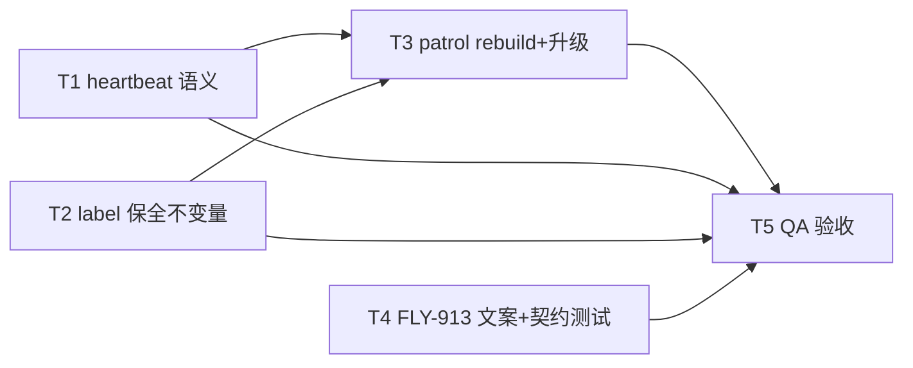

# FLY-2207 cmux-watcher 进程生命周期三病 — 实施计划

Issue: FLY-2207 (https://linear.app/geoforge3d/issue/FLY-2207/可见性watcher-cmux-watcher-进程生命周期三病查询超时累积死死了无人发现复活被-fly-913-误伤8-31)
日期: 2026-08-31
基于: research.md

## 0. 目标与不做什么

**目标**(对应验收:watcher 被 kill -9 后 ≤10min 自动回来并补齐死窗期 runner 的
workspace,founder 无感):

1. 病 1:watcher「活着但慢」不再被 patrol 误杀;bootout 后的恢复流程**永不**把
   label 留在卸载态(label 保全不变量)。
2. 病 2:恢复收敛 → 零消息;恢复不收敛 ≥10min → 走**既有** escalation face
   一集一响(禁新增告警层)。
3. 病 3:自动复活通道 = Bridge patrol(FLY-913 hook 管辖之外,与 updater 同平面,
   无需改护栏判定);人肉正门 = `flywheel-cmux-autostart`,用回归测试钉成契约,
   并在 P1 deny 文案里指路。

**不做**:不治 cmux app 的慢(FLY-2063 族);不做视图级重建(FLY-1976);
不给其他 com.flywheel.* label 任何自动恢复扩权;不改 FLY-913 的判定矩阵;
不新建守护进程/告警层;不写新的补窗逻辑(补窗由 watcher 起动 reconcile 既有行为承担,
仅在 QA 里断言)。

## 1. 稳定标识与显示名(single source of truth)

| 项 | 值 | 说明 |
|---|---|---|
| launchd label | `com.flywheel.cmux-watcher`(既有,唯一恢复对象,硬编码) | restart-cmux-watcher.sh:127 已有 |
| heartbeat 文件格式 | `pid\|seq\|state` 三字段(**不变**) | 新增写点只刷新 mtime/复用格式 |
| heartbeat 新写点状态词 | seq=`call`,state=`bounded` | 自由字段,消费者不解析语义 |
| 新恢复模式 CLI | `restart-cmux-watcher.sh --rebuild` | 与既有 `--recover --expected-owner` 并列 |
| 新告警 kind | `cmux_watcher_unrecovered` | AlertEventType 联合类型追加;escalation face 专用 |
| 新 env 旋钮 | `FLYWHEEL_CMUX_WATCHER_ESCALATE_SECONDS`(默认 600)、`FLYWHEEL_CMUX_WATCHER_REBUILD_DISABLED`(默认未设=启用)、`FLYWHEEL_CMUX_STRAGGLER_WAIT_SECONDS`(默认 25) | 均登记 feature-flags/truth.ts(FLY-1781 治理) |
| patrol 判决新字段 | `recovery: "tuple_restart" \| "rebuild" \| null` | 替代裸 `recover: boolean` 的语义扩展(布尔保留、由 recovery 派生,兼容既有测试) |

## 2. 任务分解

### T1 sync.sh:bounded 调用出口写心跳(病 1 上游)

文件:`scripts/flywheel-cmux-sync.sh`

1. `--watch` 模式入口(watch_loop 启动前)设 `CMUX_WATCH_HEARTBEAT_ACTIVE=1`。
2. `_cmux_bounded_spawn` 返回前(rc 判定之后、return 之前)追加:
   `[[ "${CMUX_WATCH_HEARTBEAT_ACTIVE:-0}" == "1" ]] && watcher_write_heartbeat call bounded`
   —— 覆盖成功/超时/失败三种出口;非 watch 调用(install/one-shot)零影响。
3. 语义结果:「pass 在推进」= 心跳新鲜;真挂死(不在 bounded 调用里的死循环/阻塞)
   仍会 300s 过期 → patrol 保留对真挂死的处置力。
4. **负向护栏**:不动 `watcher_write_heartbeat` 本体;不动三字段格式;
   不在 bounded spawn 内引入新的外部命令(纯内建,避免慢路径叠加)。

测试(`scripts/test-cmux-sync.sh` 既有夹具内加 case):
- 用 timeout 夹具让连续 3 次调用各超时 2s,断言期间 heartbeat mtime 至少推进 3 次;
- 非 watch 模式跑同路径,断言 heartbeat 文件不被创建。

### T2 restart-cmux-watcher.sh:label 保全不变量 + 残影处置(病 1 中/下游)

文件:`scripts/lib/restart-cmux-watcher.sh`

1. **不变量(本任务的验收核心)**:`launchctl bootout` 成功后的一切路径,
   必须以「尝试 `launchctl bootstrap`」结束 —— 删除 §research 2.3 列出的
   「bootout 成功 → return 0(不 bootstrap)」分支。
2. 残影处置(在 bootout 后、bootstrap 前):
   a. census remaining 非空时,逐 pid 判定 straggler:
      pid ≠ expected-owner pid(或 owner 已不在)且 pid ≠ heartbeat pid;
   b. 每次发信号前重验:`cmux_process_command_for_pid` + `cmux_mutator_command_matches`
      (防 pid 复用,沿用既有 tuple 重验模式);TERM → 宽限 → KILL;
   c. 总等待上限 `FLYWHEEL_CMUX_STRAGGLER_WAIT_SECONDS`(默认 25 ≥ 20s 看门狗自然寿命);
   d. **残影仍在也照样 bootstrap**(互斥权威是 FLY-129 lease,census 只是候选发现);
      此情形 outcome detail 注明 `stragglers_survived=<pids>`。
3. `--rebuild` 模式(patrol job_absent 用):无 expected-owner;
   前置 = plist 为常规文件 + `launchctl print` 确认 label 缺失;
   census 残影按 2 处置 → bootstrap → 既有 probe 循环;
   bootstrap 报错但事后 `launchctl print` 可查询 → 判 `healthy`(updater 并发收敛)。
4. census rc=2(process table 不可信)时:`--recover` 维持既有 fail-closed 拒 bootout
   (改动前行为);但**已 bootout 后**的 rc=2 不再阻止 bootstrap(不变量优先)。
5. 回滚边界:本文件独立可 revert;不改 census 库、不改 plist、不改 autostart。

测试(`scripts/__tests__/restart-cmux-watcher.test.sh` 既有夹具内加 case):
- 同 argv 残影夹具(真实进程,模拟 `set -m` 看门狗)存活时:断言仍执行 bootstrap
  (PATH stub launchctl 记录调用序列),outcome ≠ 搁浅;
- straggler TERM 前 argv 已变(pid 复用模拟):断言拒发信号但仍 bootstrap;
- `--rebuild`:label 缺失 → bootstrap;label 已在(already bootstrapped 报错)→ healthy;
- 不变量负向:遍历全部失败注入点(wait 漂移、census rc=2、straggler 存活),
  断言「bootout 成功却未调 bootstrap」的执行序列不存在。

### T3 patrol:job_absent 自动重建 + 不收敛升级(病 1 下游 + 病 2 + 病 3 机器面)

文件:`packages/teamlead/src/bridge/cmux-watcher-patrol.ts`、`plugin.ts`,
kind 三件套:`LeadAlertNotifier.ts`、`bridge/kind-contract.ts`、`bridge/infra-event-router.ts`、
`bridge/alert-kind-copy.ts`

1. classifier:`job_absent` 判决携带 `recovery: "rebuild"`(alert 保持 true);
   `stalled` 携带 `recovery: "tuple_restart"`;其余 null。纯函数性质不变。
2. runPass:`recovery === "rebuild"` 且 episode 未尝试过 且
   `FLYWHEEL_CMUX_WATCHER_REBUILD_DISABLED` 未设 → spawn
   `restart-cmux-watcher.sh --rebuild`(复用 runHostCmuxWatcherRecovery 的
   进程组/超时包装,150s 外层超时不变);per-episode 至多一次(沿用
   recoveryEpisodes latch)。
3. 升级(C1):patrol 维护 per-episode firstUnhealthyMs(branch ∈
   {job_absent, stalled, owner_missing, heartbeat_missing} 的连续代);
   连续不健康 ≥ `FLYWHEEL_CMUX_WATCHER_ESCALATE_SECONDS`(600s)且本 episode
   已发过 ticket 且(若适用)恢复已尝试 → 通过同一 alert 闭包发
   eventType=`cmux_watcher_unrecovered`(severity severe,body 带最近
   verdict/recovery detail),per-episode 一次。
4. kind 接线:`cmux_watcher_unrecovered` 加入 AlertEventType 联合 +
   LeadAlertNotifier kind 列表 + kind-contract(owner=claude, arc=human_by_design)+
   **infra-event-router escalation 特例**(与 workflow_engine_escalation 同分支:
   rawSink + founder mention;无 founder id 时按既有 fail-safe 落 Claw mailbox)+
   alert-kind-copy 文案两处。**cmux_watcher_stalled 的 ticket 路由不变。**
5. C2:`/health` liveness components 增加只读行 `w4_cmux_watcher`
   (branch、heartbeat_age_ms、job.ok、last_recovery outcome)——
   patrol 暴露 `lastDecision` getter,plugin 的 liveness builder 消费;零告警。
6. 回滚边界:REBUILD_DISABLED env 为紧急杀开关(patrol 退回 alert-only);
   kind 追加为纯增量,revert 安全。

测试(`packages/teamlead/src/bridge/__tests__/cmux-watcher-patrol.test.ts` 扩展):
- classifier 矩阵新行:job_absent→rebuild、park 优先级不变、
  真挂死(heartbeat 过期且非 job_absent)仍 tuple_restart;
- runPass:rebuild 每 episode 一次;新一代 job_absent(generation 变更)重新武装;
- 升级:600s 未收敛才发、healthy tick 重置 episode、一集一响;
- 路由:`cmux_watcher_unrecovered` 走 rawSink+mention,`cmux_watcher_stalled`
  仍走 ticketSink(infra-alert-wiring 既有测试文件加断言);
- REBUILD_DISABLED=1 → 只告警不 spawn。

### T4 FLY-913:人肉正门契约(病 3 人面)

文件:`scripts/hooks/flywheel-restart-guard.py`、`scripts/hooks/test-flywheel-restart-guard.py`

1. deny 分支:P1 命中且命令串含 `com.flywheel.cmux-watcher` → DENY_REASON 追加一行:
   「cmux watcher(显示层 sidecar)人肉正门:`bash ~/.flywheel/bin/flywheel-cmux-autostart`
   (label 缺失才 bootstrap,幂等;Bridge patrol 通常已自动恢复,先
   `launchctl print gui/$UID/com.flywheel.cmux-watcher` 查看)」。
   **判定结果不变,仅文案**。
2. 回归测试钉契约:
   - `bash ~/.flywheel/bin/flywheel-cmux-autostart` 与
     `bash <repo>/scripts/flywheel-cmux-autostart.sh` → allow(无 hit);
   - `launchctl bootstrap gui/501 ~/Library/LaunchAgents/com.flywheel.cmux-watcher.plist`
     → deny 且 reason 含指路行;
   - 既有矩阵全量回归(该测试文件自带)。
3. 部署:install-restart-guard.sh 既有 Tier-1 收敛(cp,零重启)。

### T5 QA / 验收证据(独立 QA 节点执行,plan 只锁定证据形状)

1. **进程死、label 在**:隔离 env(HEARTBEAT/LOCK_DIR 覆盖)真机演练
   `kill -9 <watcher pid>` → 断言 ≤60s(KeepAlive+Throttle 30s)新 pid 上岗、
   lease 重建、heartbeat 恢复。
2. **label 消失(8-31 主形态)**:演练脚本(命令串不含 launchctl 的封装,
   全程隔离 env)执行 bootout-and-strand → 断言 patrol 在 ≤3 tick(≈3min)内
   rebuild,`launchctl print` 可查询,全程无 founder 面消息(alert_threads /
   unified channel 零新增)。
3. **不收敛升级**:REBUILD_DISABLED=1 + label 缺失 ≥600s →
   断言恰一条 `cmux_watcher_unrecovered` 走 escalation face。
4. **补窗**:死窗期造一个新 runner session(隔离台架)→ watcher 复活后断言
   reopen-sweep 为其建出 workspace(既有行为,不改代码只取证)。
5. **慢而不死**:stub cmux 连续超时 ≥6min → 断言 heartbeat 持续推进、
   patrol 全程无 stalled 判决、watcher 不被 bootout。
6. CI:全部 T1–T4 单测挂既有套件(ci-structure.test.sh 登记项按需更新);
   QA PASS 前按纪律拉 exact head 的 CI 结论。

## 3. 实施顺序与回滚

- T1/T2/T4 相互独立、各自可单独 revert;T3 依赖 T2 的 `--rebuild` CLI。
- 单 PR 交付(改动同域强相关),但按文件划分 commit,支持逐层回退。
- 紧急降级:`FLYWHEEL_CMUX_WATCHER_REBUILD_DISABLED=1`(patrol 侧回到 alert-only,
  等价改动前行为 + T1/T2 的无害加固)。
- 部署:shell 侧走既有安装收敛(watcher 本体在下次 watcher 重启时生效——
  patrol/updater 的正常 restart 即可;不手动 kickstart);TS 侧随 00:00/12:00 班车。
  **本节点不执行部署**(Flywheel 自托管红线:merge 与 deploy 分离,updater 独享部署窗)。

## 4. 风险与负向护栏清单

| 风险 | 护栏 |
|---|---|
| rebuild 与 updater 班车并发双 bootstrap | "already bootstrapped" → print 可查询即判收敛(T2.3) |
| rebuild 风暴 | per-episode 一次 + storm gate 在 job 内兜底(分层不变) |
| straggler 误杀无辜进程 | 信号前 argv 重验 + lease/heartbeat pid 双排除;验证不过=不发信号 |
| 心跳新写点掩盖真挂死 | 只在 bounded 调用出口写;非调用路径挂死仍 300s 过期 |
| escalation 噪音 | 600s 阈值 + 一集一响 + healthy 即重置 |
| 护栏红线 | FLY-913 判定矩阵零改动;仅 deny 文案 + 回归契约测试 |
| kind 扩散 | 新 kind 仅 escalation face 消费;ticket 族行为字节不变 |

## 5. 验收对照(issue 原文 → 证据)

| 验收 | 证据 |
|---|---|
| kill -9 后 ≤10min 自动回来 | T5.1(label 在:≤60s)、T5.2(label 消失:≤3min) |
| 补齐死窗期出生 runner 的 workspace | T5.4 |
| founder 无感 | T5.2 断言零 founder 面消息;不收敛才 T5.3 一响 |
| 死了有人发现 | T3 升级(既有 escalation face,禁新增告警层达成) |
| 复活不被 FLY-913 误伤 | 机器面:Bridge 平面天然不经 hook(research §2.6);人面:T4 契约 |
| 「label 为何消失」待查项 | research §2.2–2.3 已闭合(bootout+census 残影拒 bootstrap 单向门) |
