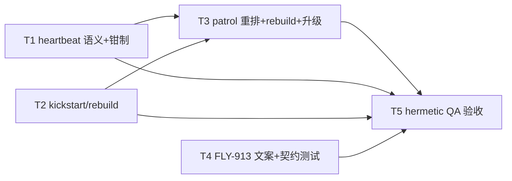

# FLY-2207 cmux-watcher 进程生命周期三病 — 实施计划

Issue: FLY-2207 (https://linear.app/geoforge3d/issue/FLY-2207/可见性watcher-cmux-watcher-进程生命周期三病查询超时累积死死了无人发现复活被-fly-913-误伤8-31)
日期: 2026-08-31
基于: research.md
修订: R3(R2 吸收 Codex Round 1 全部 7 条;R3 吸收 Round 2 全部 4 条:
probe 权威改为 lease+heartbeat(census 仅诊断)、unhealthyGeneration 冷启动定义、
T5.4 补窗 hermetic 缝隙枚举、PING/CALL 双钳制测试)
Status: codex-approved(2026-08-31,3 轮;评审记录在同文件夹 design-review/)

## 0. 目标与不做什么

**目标**(对应验收:watcher 被 kill -9 后 ≤10min 自动回来并补齐死窗期 runner 的
workspace,founder 无感):

1. 病 1:watcher「活着但慢」不再被 patrol 误杀;patrol 的恢复动作**永不让 label
   离开受管态**(stalled → 原地 kickstart;job_absent → bootstrap 重建)。
2. 病 2:恢复收敛 → 零消息;恢复不收敛 ≥10min → 走**既有** escalation face
   一集一响(禁新增告警层)。
3. 病 3:自动复活通道 = Bridge patrol(FLY-913 hook 管辖之外,与 updater 同平面,
   护栏判定零改动);人肉正门 = `flywheel-cmux-autostart`,用回归测试钉成契约,
   并在 P1 deny 文案里指路。

**不做**:不治 cmux app 的慢(FLY-2063 族);不做视图级重建(FLY-1976);
不给其他 com.flywheel.* label 任何自动恢复扩权;不改 FLY-913 的判定矩阵;
不新建守护进程/告警层;不写新的补窗逻辑(补窗由 watcher 起动 reconcile 既有行为承担,
仅在 QA 里断言);不加 `/health` 新组件(Codex R1 #7,按「只删不加」砍掉原 C2);
不引入任何 straggler 清杀状态机(Codex R1 #3:互斥权威是 FLY-129 lease,
`set -m` 看门狗残影寿命 ≤ call timeout,自然收尾)。

## 1. 稳定标识与显示名(single source of truth)

| 项 | 值 | 说明 |
|---|---|---|
| launchd label | `com.flywheel.cmux-watcher`(既有,唯一恢复对象,硬编码) | restart-cmux-watcher.sh:127 已有 |
| heartbeat 文件格式 | `pid\|seq\|state` 三字段(**不变**) | 新增写点只刷新 mtime/复用格式 |
| heartbeat 新写点状态词 | seq=`call`,state=`bounded` | 自由字段,消费者不解析语义 |
| 新恢复模式 CLI | `restart-cmux-watcher.sh --rebuild` | 与既有 `--recover --expected-owner` 并列 |
| 新告警 kind | `cmux_watcher_unrecovered` | AlertEventType 联合类型追加;escalation face 专用 |
| 新 env 旋钮 | `FLYWHEEL_CMUX_WATCHER_ESCALATE_SECONDS`(默认 600)、`FLYWHEEL_CMUX_WATCHER_REBUILD_DISABLED`(默认未设=启用) | 登记 feature-flags/truth.ts(FLY-1781 治理);R1 版的 STRAGGLER_WAIT 旋钮随 straggler killer 一起删除 |
| patrol 判决新字段 | `recovery: "kickstart" \| "rebuild" \| null` | 语义化替代裸布尔;既有 `recover: boolean` 保留、由 recovery 派生(兼容既有测试) |
| escalation 身份 | `unhealthyGeneration`(跨 branch 稳定键,见 T3.3) | founder event id 的唯一来源 |

## 2. 任务分解

### T1 sync.sh:bounded 调用出口写心跳 + timeout 上界(病 1 上游)

文件:`scripts/flywheel-cmux-sync.sh`

1. **激活点在 `--watch` dispatcher 调用 `watch_main` 之前**设
   `CMUX_WATCH_HEARTBEAT_ACTIVE=1`(Codex R1 #6:必须覆盖 `watch_main` 进入
   `watch_loop` 前的完整 `sync_additive_bootstrap` cold-start reconcile,
   那一段同样是串行 cmux 调用密集区)。
2. `_cmux_bounded_spawn` 返回前(rc 判定之后、return 之前)追加:
   `[[ "${CMUX_WATCH_HEARTBEAT_ACTIVE:-0}" == "1" ]] && watcher_write_heartbeat call bounded`
   —— 覆盖成功/超时/失败三种出口;非 watch 调用(install/one-shot)零影响。
3. **timeout 上界钳制**(Codex R1 #6):`CMUX_PING_TIMEOUT_SECONDS` /
   `CMUX_CALL_TIMEOUT_SECONDS` 的既有校验(:291-296)加固定上界 60s
   (含 kill grace 后仍远低于 300s stale 阈值;固定钳制,不加新旋钮):
   超界回落默认值并 log 一行 WARN。
4. 语义结果:「pass 在推进」= 心跳新鲜;真挂死(不在 bounded 调用里的死循环/阻塞)
   仍会 300s 过期 → patrol 保留对真挂死的处置力。
5. **负向护栏**:不动 `watcher_write_heartbeat` 本体;不动三字段格式;
   不在 bounded spawn 内引入新的外部命令(纯内建,避免慢路径叠加)。

测试(`scripts/test-cmux-sync.sh` 既有夹具内加 case):
- timeout 夹具连续 3 次调用各超时 2s,断言期间 heartbeat mtime 至少推进 3 次;
- cold-start:进入 watch_loop 前的 bootstrap reconcile 段内 bounded 调用也推进心跳;
- 钳制(Codex R2 #4,表驱动、PING 与 CALL 双覆盖):
  `FLYWHEEL_CMUX_CALL_TIMEOUT` / `FLYWHEEL_CMUX_PING_TIMEOUT` 各测
  `60`(接受)与超界值(回落各自默认 + 预期 WARN);
- 非 watch 模式跑同路径,断言 heartbeat 文件不被创建。

### T2 restart-cmux-watcher.sh:stalled 原地 kickstart + job_absent 重建(病 1 中/下游)

文件:`scripts/lib/restart-cmux-watcher.sh`

设计原则(Codex R1 #3):**label 永不因 patrol 动作离开受管态**。达成方式不是
「bootout 后保证 bootstrap」(中间仍有 crash/outer-timeout 窗口),而是
**stalled 路径根本不 bootout**:

1. `--recover --expected-owner <tuple>`(patrol stalled 用)改为**原地重启**:
   a. 既有 expected-owner tuple 重验(pid+incarnation+mode+nonce,防 pid 复用,
      逻辑不变);
   b. `launchctl kickstart -k gui/$UID/com.flywheel.cmux-watcher`
      (仓库已有先例:bridge/launchctl.ts 将 kickstart -k 定义为
      idempotent/reversible restart-in-place)—— label 全程 loaded;
   c. **probe 权威重定义**(Codex R2 #1):判 `healthy` 的充分条件 =
      新 lease owner tuple 有效(pid 存活 + incarnation 匹配)∧ heartbeat pid
      与之匹配 ∧ owner pid ≠ 被 kickstart 的旧 pid —— **census 计数降级为
      诊断信息**(同 argv 看门狗残影可与健康新 watcher 共存最长
      call-timeout 上界 + kill grace ≈ 61s,不得再作 `count==1` 否决);
      probe tries/interval 保持默认,不再需要 PROBE_TRIES=60 拐棍;
   d. **删除**:bootout、`_crw_wait_for_expected_owner_exit`、
      post-shutdown census 否决、以及 R1 版曾提议的 straggler TERM/KILL 状态机
      —— census 仅保留 probe 内的计数用途。看门狗残影由超时自然收尾;
      唯一 mutator 权威始终是 FLY-129 lease(新 watcher 起动即重验/重建,
      11:08:59 有实证)。
2. `--rebuild`(patrol job_absent 用):
   a. 前置:plist 为常规文件 + `launchctl print` 确认 label 缺失;
   b. **marker fence**(Codex R1 #1):bootstrap 之前重查 maintenance、
      `.qa-teardown`、`.ops-rebuild` 三个 park marker,任一存在 → 无 mutation,
      outcome=`parked`(计划性拆除不抢建);
   c. `launchctl bootstrap` → 既有 probe;bootstrap 报错但事后 `launchctl print`
      可查询 → 判 `healthy`(updater 并发收敛);
   d. 不杀任何进程;若 census/probe 观测到既存活跃 mutator(异常的无 launchd
      裸 watcher 形态),outcome detail 注明,交 patrol 告警,不 kill。
3. updater 的 `restart_cmux_watcher()`(restart-services.sh:2823 消费,deploy 时
   需要 bootout+bootstrap 以拾取重渲染的 plist)**保持既有行为不动**;
   其 bootout→bootstrap 间的 crash 残留窗口从此由 patrol 的 `--rebuild` 兜底
   (这是对既有缺口的净收敛,不是新机制)。
4. 回滚边界:本文件独立可 revert;不改 census 库、不改 plist、不改 autostart。

测试(`scripts/__tests__/restart-cmux-watcher.test.sh` 既有夹具内加 case):
- `--recover`:PATH-stub launchctl 断言调用序列 = kickstart -k(无 bootout);
- **残影共存**(Codex R2 #1 决定性用例):新 owner tuple + heartbeat 全部有效、
  同 argv 旧候选存活 >30s → 仍判 `healthy`(census 仅出现在 detail 里);
- `--recover` tuple 重验失败(owner 换代/pid 复用)→ 拒绝 kickstart(既有语义);
- `--rebuild`:label 缺失 → bootstrap;label 已在(already bootstrapped 报错)→
  healthy;三种 park marker 各自 fence 住(含「sensor 判定后、bootstrap 前
  marker 出现」的竞态注入);
- 负向:全套路径中不存在任何 bootout 调用(stub 记录断言)。

### T3 patrol:park 优先 + job_absent 自动重建 + 跨 branch 升级(病 1 下游 + 病 2 + 病 3 机器面)

文件:`packages/teamlead/src/bridge/cmux-watcher-patrol.ts`、`plugin.ts`,
kind 四件套:`LeadAlertNotifier.ts`、`bridge/kind-contract.ts`、
`bridge/infra-event-router.ts`、`bridge/alert-kind-copy.ts`

1. **classifier 优先级重排**(Codex R1 #1):fresh/expired park 的判定移到
   `!job.ok` **之前**;park 存在时无论 job 状态一律 `parked`/`parked_expired`
   (recovery=null)—— 计划性拆除(QA teardown / ops rebuild)绝不触发重建。
   `job_absent` 判决携带 `recovery: "rebuild"`;`stalled` 携带
   `recovery: "kickstart"`;其余 null。纯函数性质不变。
2. **重试语义**(Codex R1 #2):保持既有「只在 recovery.ok 时落 latch」——
   失败在后续 tick(60s cadence)自然重试;`--rebuild` 幂等 + storm gate 在
   job 内兜底,无风暴面。`FLYWHEEL_CMUX_WATCHER_REBUILD_DISABLED` 未设时启用
   rebuild spawn(复用 runHostCmuxWatcherRecovery 的进程组/150s 外层超时包装)。
3. **跨 branch 稳定升级身份**(Codex R1 #4 + R2 #2 冷启动定义):新增与
   branch-ticket 去重**分离**的 `unhealthyGeneration`,规则:
   **当前 verdict ∈ {job_absent, stalled, owner_missing, heartbeat_missing} 且
   generation 为 null → 创建**(固定 firstSeenMs + key;含 Bridge 进程启动后的
   首个 patrol 观测 —— 冷启动直入不健康态同样开钟);
   经由任何非 healthy/非 park 的过渡 verdict(含 owner_starting、event_backlog、
   legacy_no_heartbeat)**保持**;仅在 verified healthy 或任一 park verdict
   **清零**。持续 ≥ `FLYWHEEL_CMUX_WATCHER_ESCALATE_SECONDS`(600s)且本代
   已发过 ticket → 以该稳定 key 为 event id 发一条
   `cmux_watcher_unrecovered`(severity severe,body 带最近 verdict/recovery
   detail),**每代一次**。
4. kind 接线:`cmux_watcher_unrecovered` 加入 AlertEventType 联合 +
   LeadAlertNotifier kind 列表 + kind-contract(owner=claude,
   arc=human_by_design)+ **infra-event-router escalation 特例**(与
   workflow_engine_escalation 同分支:rawSink + founder mention;无 founder id
   时按既有 fail-safe 落 Claw mailbox)+ alert-kind-copy 文案两处。
   随之更新(Codex R1 #4):full-union routing 测试、router 注释、plugin 启动
   日志的 `founder-auto-mention=` 描述(不再是 workflow_engine_escalation-only)。
   **cmux_watcher_stalled 的 ticket 路由字节不变。**
5. 回滚边界:REBUILD_DISABLED env 为紧急杀开关(patrol 退回 alert-only);
   kind 追加为纯增量,revert 安全。

测试(`packages/teamlead/src/bridge/__tests__/cmux-watcher-patrol.test.ts` 扩展):
- classifier 矩阵:`job_absent + 每一种 park` → parked(不 rebuild);
  job_absent(无 park)→ rebuild;stalled → kickstart;
- runPass:rebuild 首次失败、第二 tick 重试成功(同一 generation;Codex R1 #2);
  成功后 latch,不再重复;新一代重新武装;
- 升级:`stalled → job_absent → owner_missing` 连续迁移跨过 600s **恰好一响**
  (Codex R1 #4);healthy 清零后新代重新计时;600s 内收敛零升级;
  (Codex R2 #2 补三例)冷启动直入 job_absent 即开钟;
  `unhealthy → owner_starting → owner_missing` 保持原 key/时间;
  park 清零后,后续新不健康代从零起钟;
- 路由:`cmux_watcher_unrecovered` 走 rawSink+mention,`cmux_watcher_stalled`
  仍走 ticketSink(infra-alert-wiring 既有测试文件加断言);
- REBUILD_DISABLED=1 → 只告警不 spawn。

### T4 FLY-913:人肉正门契约(病 3 人面)

文件:`scripts/hooks/flywheel-restart-guard.py`、`scripts/hooks/test-flywheel-restart-guard.py`

1. deny 分支:P1 命中且命令串含 `com.flywheel.cmux-watcher` → DENY_REASON 追加一行:
   「cmux watcher(显示层 sidecar)人肉正门:`bash ~/.flywheel/bin/flywheel-cmux-autostart`
   (label 缺失才 bootstrap,幂等;Bridge patrol 通常已自动恢复,先
   `launchctl print gui/$UID/com.flywheel.cmux-watcher` 查看)」。
   **判定结果不变,仅文案**。
2. 回归测试钉契约:
   - `bash ~/.flywheel/bin/flywheel-cmux-autostart` 与
     `bash <repo>/scripts/flywheel-cmux-autostart.sh` → allow(无 hit);
   - `launchctl bootstrap gui/501 ~/Library/LaunchAgents/com.flywheel.cmux-watcher.plist`
     → deny 且 reason 含指路行;
   - 既有矩阵全量回归(该测试文件自带)。
3. 部署:install-restart-guard.sh 既有 Tier-1 收敛(cp,零重启)。

### T5 QA / 验收证据 —— hermetic 优先(Codex R1 #5 重写)

原则:**生产 label / 生产 Bridge / 生产 launchd 一概不碰**;一切状态机行为用
PATH-stub launchctl + 隔离文件 env + fake clock/sink 取证。真机动作仅在
founder 明确授权的维护窗口内、走既有带审计的 bypass 合同执行,且不属于本 issue
的默认验收路径。

1. **进程死、label 在**(hermetic):restart 测试夹具内以真实进程模拟 watcher 死,
   PATH-stub launchctl 断言 `--recover` 全程无 bootout;**launchd 调度契约单独
   断言渲染后 plist 的 KeepAlive=true + ThrottleInterval=30**(Codex R2 #3:
   PATH stub 证不了 launchd 调度,plist 契约测试补上);
   真机 kill -9 演练**仅**列为维护窗口可选项(绑定精确 pid,founder 授权,
   审计留痕),不阻塞验收。
2. **label 消失(8-31 主形态)**(hermetic E2E):stub launchctl 返回
   「label 缺失」→ 断言 patrol 在 ≤3 tick(fake clock)内 spawn `--rebuild`、
   stub 记录 bootstrap 调用、恢复后零 founder 面消息(fake sink 断言
   ticket-only);
3. **不收敛升级**(hermetic):stub 持续缺失 + fake clock 推进 600s →
   断言恰一条 `cmux_watcher_unrecovered` 进 escalation face(fake sink),
   branch 迁移不重置时钟;
4. **补窗**(Codex R2 #3 重写,hermetic):在 `scripts/test-cmux-sync.sh`
   既有 hermetic 夹具上扩展,显式枚举并隔离全部持久缝隙:
   `HOME`(watcher 的 durable 文件根)、`FLYWHEEL_STATE_DIR`、
   `FLYWHEEL_CMUX_WATCHER_LOCK_DIR`(默认 /tmp 固定路径,必须覆盖)、
   `FLYWHEEL_CMUX_WATCHER_HEARTBEAT`、`FLYWHEEL_CMUX_MAINTENANCE_MARKER`、
   `EVENT_FILE`、隔离 tmux socket(`tmux -S`)与 stub cmux socket;
   529 台架仅在需要真 runner fixture 时用来**造 session 数据**,不承担隔离;
   断言主体:watcher 冷启动的 `sync_additive_bootstrap`(watch_main 进入
   watch_loop 之前的 additive reconcile)为死窗期出生的 runner 建出
   workspace —— **不依赖 reopen-sweep**(那是 app socket 换代路径,
   与本生命周期无关);
5. **慢而不死**(hermetic):stub cmux 连续超时,fake clock 推进 ≥6min →
   断言 heartbeat 持续推进、patrol 全程无 stalled 判决;
6. CI:全部 T1–T4 单测挂既有套件(ci-structure.test.sh 登记项按需更新);
   QA PASS 前按纪律拉 exact head 的 CI 结论。

## 3. 实施顺序与回滚

- T1/T2/T4 相互独立、各自可单独 revert;T3 依赖 T2 的 `--rebuild` CLI 与
  `--recover` 新语义。
- 单 PR 交付(改动同域强相关),按文件划分 commit,支持逐层回退。
- 紧急降级:`FLYWHEEL_CMUX_WATCHER_REBUILD_DISABLED=1`(patrol 退回 alert-only;
  kickstart 路径行为等价改动前的「恢复尝试」但更安全 —— 永不卸载 label)。
- 部署:shell 侧走既有安装收敛(watcher 本体在下次 watcher 重启时生效 ——
  patrol/updater 的正常 restart 即可;不手动 kickstart);TS 侧随 00:00/12:00 班车。
  **本节点不执行部署**(Flywheel 自托管红线:merge 与 deploy 分离,updater 独享部署窗)。

## 4. 风险与负向护栏清单

| 风险 | 护栏 |
|---|---|
| rebuild 与 updater 班车并发双 bootstrap | "already bootstrapped" → print 可查询即判收敛(T2.2c) |
| rebuild 与计划性拆除(QA teardown / ops rebuild)争抢 | classifier park 优先 + shell 侧 bootstrap 前 marker fence 双保险(T3.1 + T2.2b) |
| rebuild 重试风暴 | 幂等 bootstrap + 60s cadence + storm gate 在 job 内兜底;成功才 latch |
| kickstart 误杀健康 watcher | 既有 expected-owner tuple 重验不变;heartbeat 语义修复(T1)使「慢」不再进入 stalled |
| 心跳新写点掩盖真挂死 | 只在 bounded 调用出口写;非调用路径挂死仍 300s 过期 |
| 超大 timeout 旋钮重现假 stalled | T1.3 固定 60s 上界钳制 |
| escalation 噪音/漏响 | 跨 branch `unhealthyGeneration` 稳定身份;600s 阈值;每代一次;healthy/park 清零 |
| 护栏红线 | FLY-913 判定矩阵零改动;仅 deny 文案 + 回归契约测试 |
| kind 扩散 | 新 kind 仅 escalation face 消费;ticket 族行为字节不变 |
| QA 碰生产 | T5 全 hermetic;真机动作仅维护窗口 + founder 授权 + 审计 bypass 合同 |

## 5. 验收对照(issue 原文 → 证据)

| 验收 | 证据 |
|---|---|
| kill -9 后 ≤10min 自动回来 | label 在:KeepAlive ≤30s(T5.1);label 消失:patrol ≤3 tick rebuild(T5.2) |
| 补齐死窗期出生 runner 的 workspace | T5.4 |
| founder 无感 | T5.2 断言零 founder 面消息;不收敛才 T5.3 一响 |
| 死了有人发现 | T3.3/T3.4 升级(既有 escalation face,禁新增告警层达成) |
| 复活不被 FLY-913 误伤 | 机器面:Bridge 平面天然不经 hook(research §2.6);人面:T4 契约 |
| 「label 为何消失」待查项 | research §2.2–2.3 已闭合(bootout+census 残影拒 bootstrap 单向门);修法 = stalled 路径根除 bootout(T2.1)+ job_absent 可重建(T2.2) |
