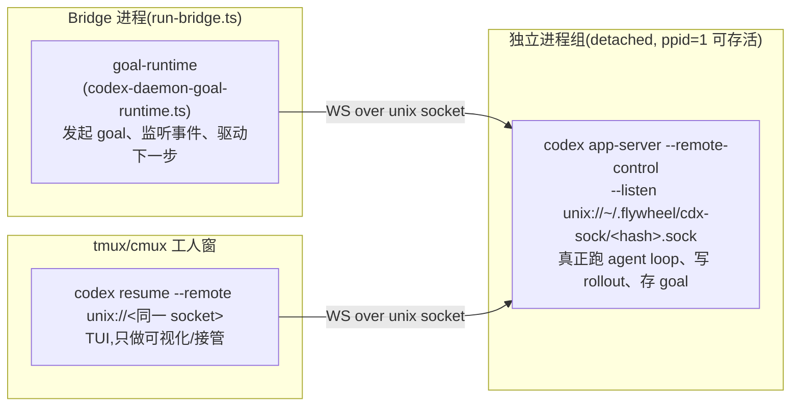

# FLY-2211 重启波与 codex runner 传输后台 — 探索

Issue: FLY-2211 (https://linear.app/geoforge3d/issue/FLY-2211/引擎重启隔离-重启波会间接杀死-codex-runner工人窗不动但其-app-server-broker-随波死tui-失去传输后-10)
日期: 2026-08-31
基于: 无

## 0. 一句话结论(与 issue 原始结论不同,证据在 §2)

8-31 四杀的直接死因**不是**「重启波杀死 broker → TUI 失去传输后超时退出」。真实时间线是:**重启波本身没有杀死任何 runner 侧进程**;波后 11–21 分钟(12:12:29/33/36 与 12:22:32),四对「TUI + app-server daemon」在 turn 进行中被**同时、瞬间、无声地终止**,而全系统所有有账本的 kill 路径当时都可证明没有动手。本单要修的病根因此分成两层:
1. **归属断裂(结构病根,确定)**:Bridge 重启后,在飞的 codex 执行体变成「无主进程」——没有任何组件重新接管、监控、驱动它们;死了要 9–19 分钟才被发现,活着也会在 goal 结束时搁浅。
2. **无痕杀手(直接死因,未归因)**:存在至少一条**不留任何审计痕迹**的 kill 路径,在波后条件下成对杀死 TUI+daemon。当前证据不足以点名,设计上用「归属恢复 + 击杀归因仪表」来同时覆盖「防再犯」与「下次点名」。

## 1. 架构底图:一个 codex 工人是三个进程

关键事实(全部有代码/实测支撑):
- **daemon 是 detached spawn**(`codex-daemon-runtime.ts:924-941`,`detached:true` 自成进程组),Bridge 死掉**设计上就不带走它**;`reapOrphanPid` 机制(FLY-1188 HIGH-3)整个就是为「Bridge 重启后旧 daemon 还活着」这个预期形态建的。
- **agent loop 与 rollout 写盘都在 daemon 里**,不在 TUI 里。TUI 只是 remote-control 客户端。⇒「rollout 停写时刻 = daemon 死亡时刻」,不是 TUI 死亡时刻。
- **goal 存活在 daemon 侧**(goals_1.sqlite,`thread/goal/updated` 事件):Bridge 死后 daemon 会继续自主推进当前 goal —— 这正是四个体在 12:00–12:12 期间继续写 rollout 的原因。
- Bridge 关闭路径(`run-bridge.ts:130` → `bounded-shutdown` → `RetryDispatcher.drain()/teardownRuntimes()`)对 runner 只做 drain 等待,`teardownRuntimes` 只关 hookServer/auditLogger(`run-infra.ts:602-605`);20s 超时后 force-exit。**没有任何 shutdown 分支去杀 daemon/TUI/窗**。

## 2. 8-31 四杀重建(证据链)

| 时刻 (PDT) | 事件 | 证据 |
|---|---|---|
| 11:59–12:01 | 班车 updater 构建 + 重启 Bridge(12:01:23 请求,12:01:51 健康)+ 12:01:54–12:05:13 Lead 波 | /tmp/flywheel-updater.log |
| 12:00:30 | 老 Bridge `Shutting down...` → 20s drain 超时 → `forcing exit(1)` | /tmp/flywheel-bridge.log:42397-42399 |
| 12:00–12:12 | 四个 daemon **健康地继续跑 turn、写 rollout**(证明波没杀它们) | rollout mtime;codex logs_2.sqlite 中 pid:5754 持续到 19:12:30Z |
| 12:01:52 | 新 Bridge re-adoption pane 探针:四窗 pane 全活 | issue 取证 |
| 12:12:24–12:30 | FLY-2204:TUI(pid 11904)最后日志 19:12:24Z,daemon(pid 5754)最后日志 19:12:30Z,**turn 进行中、无任何错误/关闭日志,瞬间静默** | logs_2.sqlite(home 3b7dc487) |
| 12:12:29/33/36 | 2204/2178/2205 三对 TUI+daemon 死;窗随 pane 进程退出关闭 | rollout mtime + issue 取证 |
| 12:22:32 | 2190 一对死 | 同上 |
| 12:21:53–12:35 | HeartbeatService `declareZombie`(pane probe absent x2)才把会话翻成 failed —— **死后 9–19 分钟** | sessions.last_error=`zombie: … pane probe absent x2`;session_events `state_transition zombie_reap` 19:21:53/54, 19:31:52 |
| 12:21:58 起 | workflow 引擎的失败节点替换 + Lead 抢救:换体新 execution(新 socket、新 daemon)陆续起,**替换体全部存活至今** | sessions 表 + `codex daemon spawned` 日志 12:09–12:54 |

### 2.1 排除表:所有有账本的 kill 路径当时都没动手

| 嫌疑 | 排除证据 |
|---|---|
| 重启波脚本(restart-services.sh) | 只按定位到的 Bridge PID 发 TERM/KILL;无任何按名扫杀(pkill/killall 全仓仅 restart-guard 的正则) |
| Bridge shutdown | drain-only(§1);且死亡发生在老 Bridge 死后 11–21 分钟 |
| FLY-2169 codex-runner-orphan-reaper | fail-closed:active(readopt candidates)集合把四个 running 会话整体跳过——死亡**之前**四体零事件、死亡**之后**才开始出 `identity_mismatch`(19:21:54 起);全天无 `orphan_reaped` 事件 |
| cmux-watcher / flywheel-cmux-sync | 12:12/12:22 窗口日志:只拆 issue-* 占位 view,对 FLY-22xx 标题全部 `cleanup refused / preflight-refused` |
| MCP descendant reaper | 只杀 MCP 分类器精确命中的进程,30min 门,有独立审计事件流 |
| zombie reaper / crash reaper | 只做检测与 FSM 翻转,不发信号(HeartbeatService.declareZombie 为 detect-only) |
| launchd 进程组清理 | daemon detached 自成 pgid/session,TUI 在 tmux 会话里,都不在 Bridge job 的进程组 |
| OOM / jetsam / SIGBUS(二进制被替换) | 无 DiagnosticReports;codex 0.151.0 release 文件 8-29 后未变,current 符号链接 12:26 才被重指(死亡之后) |

### 2.2 未解释的节律(留给归因仪表)

死亡两批分别落在 Bridge 5 分钟维护 tick(19:11:53、19:21:54)之后 36–43 秒;第四个(2190)恰好在其 daemon 满 2 小时年龄后的第一个 tick 才死。这两个对齐强烈暗示凶手是「与维护 tick 同拍、带年龄门」的某条**未审计**路径,但所有已知同拍组件都有账本且账本干净。**结论:系统里存在杀伤不留痕的路径;在点名之前,任何『不杀名单』式修法都没有可挂靠的对象。**

### 2.3 issue 原始「关键证据」的更正

`cxc-6txBR3`(pid 31668)不是 codex 工人的传输后台。它是 **Claude Code openai-codex 插件(codex-companion)的 app-server-broker.mjs**,由某个 Claude 会话在 FLY-2204 worktree 里唤起(env 带 CLAUDE_CODE_*,socket 在 $TMPDIR/cxc-*/broker.sock)。工人 TUI 的真实传输是 `~/.flywheel/cdx-sock/<hash>.sock` 上的 detached daemon。cxc broker 的 11:59:38 重生属于另一条子系统线(顺带发现:它继承了 runner 的 CODEX_HOME 并活过了 execution 生命周期——单独立卫生 issue,不进本单范围)。

## 3. 病根分解:founder 的问题该怎么回答

founder 问:「重启不就重启 bridge 吗,跟 worker 有什么关系?」——按设计,daemon/TUI 确实与 Bridge 生命周期解耦(§1)。真正的关系断在:

**G1(确定,结构):Bridge 重启后没有任何组件重新接管在飞 codex 执行体。**
- goal-runtime 对象随老 Bridge 死亡;新 Bridge 没有「连回活 daemon」的路径(`codex-daemon-transport.ts:63`:reconnection is a level up——但 level 上没人做);恢复合同只有「reap 孤儿 + 新 daemon + thread/resume」,且只在显式重派时触发。
- 后果 a:体死了没人立刻知道 —— 只能等 pane 探针 x2 连败(5min tick),实测 9–19 分钟。
- 后果 b:体活着也是「工作着的死人」—— goal 完成事件 `targeted_connections=0` 发给空气,节点永远不推进,最终照样搁浅。
- 后果 c:无主窗口期内,体暴露给任何清理者/杀手,死了就是裸损失。

**G2(未归因,直接死因):无痕杀手。** §2.2。修法上分两翼:
- 防:归属恢复(G1 的修法)让「被杀」降级为「分钟级可自愈事件」——goal-runtime 现成的 `daemon died mid-goal — restart + resume thread`(codex-daemon-goal-runtime.ts:551-561)就是为 daemon 横死设计的,只是波后没有 runtime 在场。
- 查:kill 路径审计收敛 + 死亡现场快照,下一波直接点名。

## 4. 修理方向评估(对 issue 的 A/B/C)

| 方向 | 评估 |
|---|---|
| A) 重启波不杀名单 | **不成立**:波本身没杀;凶手未点名,名单没有挂靠点。其精神保留为「kill 路径审计收敛」:所有 flywheel 杀伤动作必须先写账再发信号(现状:`reapCodexDaemonForSession` 不传 logger,`createDefaultKillGroup` 的 logger 可选 ⇒ 存在静默杀口) |
| B) TUI 失去传输后重连而非退出 | **不对症**:实测 TUI 不是超时退出,而是与 daemon 同刻死;且 TUI 行为在上游 codex 二进制里,不是我们的改动面 |
| C) 波后主动重建 broker + 重接 | **方向正确,泛化为本设计主体**:Bridge 启动时对每个在飞 codex 会话执行「re-own(重新归属)」——优先无损接管活 daemon(需 research 验证 app-server 二连接语义),不可行则用现成 reap+respawn+thread/resume 换体续跑;并把 codex 会话死亡检测从「pane x2 连败(≥10min)」提速为「socket 活性探针(现成 `probeCodexDaemonLiveness`)进 heartbeat tick」 |

## 5. 本设计做什么 / 不做什么

做:
1. **启动期 codex 会话 re-own reconciler**(结构修复,G1)。
2. **codex 会话快速死亡检测**(socket 探针进既有 heartbeat pass)。
3. **kill 路径审计收敛 + 死亡现场快照**(G2 归因仪表)。
4. 真机重启波验收方案(含「谋杀演练」:手工 SIGKILL 一个 daemon 组,验证分钟级自愈)。

不做:
- 不在本单内点名/追杀未知杀手(仪表就位后由下一次事件点名)。
- 不改 codex 二进制 / TUI 行为(上游)。
- 不动 cxc companion broker 生命周期(另立卫生 issue)。
- 不动 claude vendor runner(pane 即进程,已随 re-adoption 天然重启安全)。
