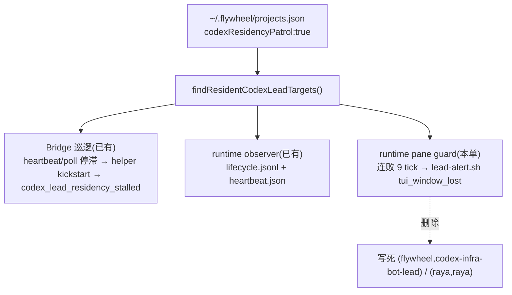

# FLY-2239 Codex Lead 全员 cutover — 实施计划
Issue: FLY-2239 (https://linear.app/geoforge3d/issue/FLY-2239/cutover-resident-codex-lead-全员切换2216-ship-后名册-opt-in-激活五步-pane-告警对齐)
日期: 2026-09-05
基于: research.md

> 成色:✅ Lead 已裁(ask e4d85416)· 【实核】本机只读 · ⬜ 工程判断。本 plan 的代码改动面只有一处(pane 告警名册化);其余是窗口合同与收官记录。

## 0. 目标 · 非目标 · 授权

- **目标**:让「被看住」对名册里每个 opt-in 的 Codex Lead 是同一个整体——业务活体巡逻(已有)+ pane 丢失告警(本单名册化)——并把三位 Lead 的 cutover 收官成一张可核的状态卡:Raya 按 FLY-2259 runbook 激活;mufasa-lead 与 codex-infra-bot-lead 按 research §4 各做一次真机假死→自愈→真告警演练;InfraBot 纳入决策与 founder 原话落页。
- **非目标**:不改巡逻分类器/阈值/helper/wrapper/plist 模板;不改 `~/.flywheel/projects.json`(两位已 opt-in,Raya 由 2259 registrar 改);不复制 2259 runbook;不修 research §7 三条顺带发现(另立单);不动 `com.xrli.raya.brain`(原样)。
- **授权边界**:实现节点只写代码/测试/文档,零生产 mutation;演练与 Raya 窗口由 Lead(Tadashi)在 founder 在场时执行;强停授权 = founder 2026-09-05 06:54:46Z 原话(research §0 第 4 条,Lead 指令 `2239-auth-20260905T0700`),**仅限 mufasa-lead 与 codex-infra-bot-lead、仅限演练所需次数**;⛔ `claude-infra-bot-lead`(Claw)零触碰;不动 Bridge、任何 runner、任何 plist;Bridge 重启只走班车或单次 `request-restart.sh` 票。

## 1. 架构(一句话 + 图)

pane guard 与 lifecycle observer 从此用**同一把尺子**(`findResidentCodexLeadTargets` 三元匹配 `projectName/leadId/leadKey`)决定装不装;名册是唯一真相源。



稳定身份(全文只用这些名字):lead key `<project>-<lead>`(`growth-mufasa-lead`、`flywheel-codex-infra-bot-lead`、`raya-raya`)· launchd label `com.flywheel.lead.<key>` · 状态目录 `~/.flywheel/state/codex-lead/<lead>/brain/` · pane 告警 kind `tui_window_lost`(标题 `Codex Lead <project>/<lead> TUI window not visible`)· 巡逻告警 kind `codex_lead_residency_stalled`(`machine/codex-lead-residency`)· 都投 #flywheel-alerts 统一通道 · latch 文件 `<stateDir>/tui-window-lost-episode.json`(格式不变)。

## 2. 工作分解

### 2.1 代码:pane 告警名册化(唯一代码改动;TDD,先红后绿)

| 文件 | 改动 |
|---|---|
| `packages/teamlead/src/lead-backends/codex/tui-window-alert.ts` | `CreateTuiWindowAlertGuardOptions` 加 `leadKey: string`、`projects: ReadonlyArray<ProjectEntry>`;`createTuiWindowAlertGuard` 用 `findResidentCodexLeadTargets(opts.projects).find(三元)` 替换 `:284-287` 的两个字面量;不匹配 ⇒ `null`(零日志);`fire()` 标题改为 `Codex Lead ${projectName}/${leadId} TUI window not visible`,删 `:166-168` displayName;装上成功时 `log("tui-window-alert: silent-no-pane guard ARMED for <project>/<lead> (roster opt-in, threshold=<K>)")`;文件头注释「Scoped to the exact canonical…」改为名册语义。import 名册函数与 `ProjectEntry` 类型(与 runtime 同路径 `../../resident-codex-lead-roster.js`、`../../ProjectConfig.js`)。 |
| `packages/teamlead/src/lead-backends/codex/codex-lead-tui-runtime.ts:482` | 调用加 `leadKey: config.leadKey, projects: residentCodexLeadProjects`;`:478-481` 注释「non-null only for the canonical InfraBot identity」改为「non-null only for a roster opt-in target」。 |
| `packages/teamlead/src/bridge/alert-kind-copy.ts:276` | 该 case 从不被路由(注释已说明,仅为 switch 穷尽),字符串由 `"Infra Bot TUI window not visible"` 改为 `"Codex Lead TUI window not visible"`——消掉最后一处镜像词汇。 |
| `packages/teamlead/src/lead-backends/codex/__tests__/tui-window-alert.test.ts` | 见 2.2 |
| `packages/teamlead/scripts/__tests__/raya-activation-preflight.test.sh:28,74-97` | **既有直接消费者**(Codex R1-1):它 import 已构建的 `tui-window-alert.js` 并直接调 `createTuiWindowAlertGuard`,夹具 `projects.json` 无 `codexResidencyPatrol`。改三处:① 第 28 行夹具 raya 行加 `"codexResidencyPatrol":true`;② node 片段改为读 `$T/projects.json` 解析成 `projects`、`leadKey: env.FLYWHEEL_LEAD_KEY`(launcher 经 `canonical-lead-identity.sh:167` 导出)一并传入;③ 断言不变(`armed`),并加一格负控:同一 env 但 projects 传 `[]` ⇒ `disabled`。 |
| `codex-lead-tui-runtime.ts:161` + `__tests__/codex-lead-tui-runtime.test.ts:36` | 名册读失败的 warning 文案由 `…roster unavailable; observer disabled` 改为 `…roster unavailable; lifecycle observer and pane-loss guard disabled`(Codex R1-4:同一份空名册现在同时关两路保护,文案必须说全);既有断言同步改。 |

不动:`scripts/lead-alert.sh`、`LeadAlertNotifier.ts` union、`kind-contract.ts`、三个 launcher、`test-tui-window-lost-alert.sh`(标题是它的输入夹具)、2259 runbook 文件。

### 2.2 测试(顺序固定;每条先证红)

夹具:`roster(...)` 返回一个 `ProjectEntry[]`,默认含 `flywheel/codex-infra-bot-lead`(full-access)、`raya/raya`(full-access)、`growth/mufasa-lead`(companion)三行 opt-in;`opts(over)` 组装 `createTuiWindowAlertGuard` 入参(默认 `env:{FLYWHEEL_ROOT:"/x"}`、`exists:()=>true`、`leadKey` 由 project/lead 派生)。

| # | 用例 | 红的方式 |
|---|---|---|
| T1 | 改 `:127`:标题 = `Codex Lead flywheel/codex-infra-bot-lead TUI window not visible` / `Codex Lead raya/raya TUI window not visible` | 改前输出 "Infra Bot…" |
| T2 | 改 `:206`:opt-in 的 full-access 行 ⇒ 非 null | 改前无 `projects` 字段编译红 |
| T3 | **新**:opt-in 的 companion 行(mufasa 形状)⇒ 非 null | 改前 null(这是本单修的缺口) |
| T4 | **新**:同一 lead 行 `codexResidencyPatrol` 缺省/false ⇒ null(InfraBot 与 mufasa 各一格) | 改前 InfraBot 格非 null |
| T5 | 改 `:217`:同名 lead 别 project ⇒ null;**新** 同 project 同 lead 但 `leadKey:"raya-other"` ⇒ null(专护第三元) | 后者改前不存在 |
| T6 | **新**:`projects: []` ⇒ null 且 log 未收到任何行 | — |
| T7 | **新**:`backend:"claude-code"` 但旗 true ⇒ null(用真名册函数,不 mock) | — |
| T8 | **新**:装上时 log 收到恰一条含 `ARMED for raya/raya` 与 `threshold=9` | 改前无此行 |
| T9 | 改 `:244` 改名,断言不变(非名册 Lead + retired env ⇒ null) | — |
| T10 | 其余 14 个既有用例:夹具补字段后全绿(不改断言) | 编译红 → 绿 |
| T11 | 壳测试 `raya-activation-preflight.test.sh`:真 launcher 投影 env + opt-in 夹具 ⇒ `armed`;同 env + 空 roster ⇒ `disabled`(7 → 8 格) | 改前已构建的 JS 工厂会忽略多传的 `projects`/`leadKey`(不抛错),`armed` 格照旧绿;**红在新加的负控格**:空 roster 在旧实现下仍 `armed`(Codex R2-5) |
| T12 | `codex-lead-tui-runtime.test.ts:36` 断言新文案 | 改前旧文案红 |

变异验证(实现节点必做,结果写进实现证据;Codex R1-5 定序):**先把绿的实现提交成一个 commit `<green-sha>`**,再:① 把 `find` 里的 `leadKey` 比较删掉 ⇒ 只有 T5 第二格红;② 把 `if (!target) return null` 删掉 ⇒ T4/T6/T7 红;③ 每次还原后 `git diff --exit-code <green-sha> -- packages/teamlead/src/lead-backends/codex/tui-window-alert.ts` 为空(对准绿提交,不是改前 HEAD),并重跑目标测试绿。三段齐才算变异验证有效(记忆库 feedback_a_silent_replace_miss_reported_as_done 末节)。

聚焦门(先 build 再 shell):

```bash
pnpm --filter flywheel-teamlead build
pnpm --filter flywheel-teamlead exec vitest run src/lead-backends/codex/__tests__/tui-window-alert.test.ts   # 18 → 25 格
pnpm --filter flywheel-teamlead exec vitest run src/__tests__/resident-codex-lead-roster.test.ts src/lead-backends/codex/__tests__/codex-lead-tui-runtime.test.ts src/bridge/__tests__/resident-codex-lead-patrol.test.ts
bash packages/teamlead/scripts/__tests__/raya-activation-preflight.test.sh   # 7 → 8 格;import 的是 dist,必须在 build 之后
bash packages/teamlead/scripts/test-tui-window-lost-alert.sh      # shell 去重夹具不变,必须仍绿
pnpm lint && pnpm -r build
```

全仓(Codex R1-6:写成可执行命令,不写散文):

```bash
pnpm --filter './packages/*' --filter '!flywheel-core' test:run
pnpm --filter flywheel-core exec vitest run --passWithNoTests --exclude "**/tmux-viewer.macos.test.ts"
```

第二行显式排除 `packages/core/test/tmux-viewer.macos.test.ts`(它真开 Terminal.app 并向 founder 屏幕弹辅助功能授权窗;记忆库红线),排除事实写进实现证据;其余全绿;最终硬门 = PR exact head 的 GitHub CI。

### 2.3 文档物料(随本 PR 进仓)

- `engineering/doc/FLY-2239-codex-lead-cutover/founder-design.html`(设计节点合同;含收官状态卡)。
- `engineering/doc/FLY-2239-codex-lead-cutover/cutover-status.md`:收官表(research §6 字段),实现节点建初版(三位全部「演练 = 未做」),窗口后由持棒者按 design-correction.md 附录规则更新。
- 不新增脚本(founder「只删不加」;演练用 research §4 的参数化片段,由 Lead 手工执行)。

### 2.4 窗口合同(Lead 执行;实现/QA 节点不跑)

顺序建议(⬜):**先 land 本 PR → 班车部署 → 两位存量 Lead 演练 → Raya 2259 窗口**。理由:演练触发的 kickstart 让两位用新字节出生,收官表的「ARMED 行」一次拿到;Raya 第一次出生就是名册驱动。若 Raya 窗口因 founder 时间先开,则收官表 Raya 行「pane 告警来源 = 旧 allowlist,班车 N+1 后换名册」如实写。

每位存量 Lead 一次演练 = research §4 **D0–D5 全过且 D6 未进入**(D6 是失败分支;已按 Lead 指令 `2239-auth-20260905T0700` 改写:强停前先写 label/pid/T0/预期自愈路径;逐分钟记录;**10 分钟未自愈 = FAIL**,立即用该 Lead 自己的 launchd job `launchctl kickstart -k` 拉起,停止后续强停、ask Lead;「已自愈」= research D1 的完整收敛元组:exact 新 pid/lstart + 绑定它的 online heartbeat + 代号/载体号都换 + T0 绑定的 pre_mutation 回执,只换 pid 不算;实核巡逻周期 60 s,最坏推算 ≈ 7.5 分钟);串行,先 mufasa 后 InfraBot;任一 FAIL 即停。

Raya = 2259 runbook **§4.0–§4.10 为成功路径**;§4.11(R1–R5 逆序回滚)只在 runbook 各节点名的失败分支里进入,不是成功路径的一部分(Codex R1-2)。Raya 的告警证据按本单合同补一小段 overlay(Codex R1-3):2259 §4.10 只收一条 `STALL_ALERT_URL`,而巡逻对一次假死发 `detected` 与 `recovery` 两条独立事件(`resident-codex-lead-patrol.ts:686-719`,event id 各异);overlay 分两半(Codex R2-2):**§4.10 的 `kill -STOP` 之前**对 claims.db 按 target+phase 拍快照——`event_id LIKE 'codex_lead_residency_stalled:raya-raya:detected:%'` 与 `…:recovery:%` 各一个计数写入 `claims.before`(Bridge 把这类 claim 记在 fleet lead id `codex-lead-residency` 下,target/phase 只在 `event_id` 里);**§4.10 之后**再拍 `claims.after`,要求 detected、recovery **各恰好 +1**(恰两条新 `raya-raya` event id),并把两条 URL 各写一行到 `$EVIDENCE/recovery-drill.alert.detected.url` / `.recovery.url`,分别绑到对应 phase。overlay 写在本单 `cutover-status.md` 的 Raya 行说明里,不改 2259 文件。存量两位的 D4 用同一套 target+phase 过滤(research §4 D4),并发的别家 residency 告警不会造成假过/假失败。

每次演练后 Lead 得到的事实包(ask 给 Lead 更新她的计划页):`lead key · T0_at · 收敛时刻 · 新 pid/generation · receipt 行号 · detected/recovery 两条告警 URL · verify rc · ARMED 行时间戳 · 证据目录`。

## 3. 验收标准(逐条可核)

1. `tui-window-alert.test.ts` 25/25 绿;`raya-activation-preflight.test.sh` 8/8 绿;`codex-lead-tui-runtime.test.ts` 绿(新文案);变异验证三段齐(对准 `<green-sha>`);`test-tui-window-lost-alert.sh` 绿;lint/build 绿;全仓两条命令绿(core 显式排除 GUI 用例);PR exact head CI 绿。
2. `grep -n "codex-infra-bot-lead\|\"raya\"" packages/teamlead/src/lead-backends/codex/tui-window-alert.ts` = 0 行(身份字面量全清)。
3. 部署后每位 opt-in Lead 下一代日志含 `guard ARMED for <project>/<lead>`;未 opt-in 的 TUI Lead 日志**无** ARMED 行且行为字节兼容(负控:QA 用 529 隔离房起一个未 opt-in 的 Codex slot 断言无 ARMED 行、有 `real TUI up`)。
4. mufasa-lead、codex-infra-bot-lead 各一次真机演练 **D0–D5 全过、D6 未进入**(含强停前记录、逐分钟日志、10 分钟内完整收敛元组),证据目录与两条真 Discord 告警 URL 进 `cutover-status.md`;演练结论 PASS/FAIL 写进交付文档;FLY-2263 的前置只在 QA 判 PASS 后成立。
5. Raya 分两个边界(Codex R2-3):**激活完成** = 2259 runbook §4.0–§4.9 逐节谓词通过,以 §4.7 的「活了」证据为准(`com.flywheel.lead.raya-raya` running、pane 在、heartbeat online、exact probe、回一句),§4.9 关出生窗口,§4.11 未被进入;**FLY-2239 收官** = 班车 N+1 之后 §4.10 先证巡逻已观察本代、再完成演练,且 overlay 收到 detected/recovery 两条 URL 与 target 绑定的 claims 前后计数;两个边界分两行进 `cutover-status.md`,Raya 行只有第二个边界过了才标「完成」。
6. founder-design.html 含:InfraBot 纳入原话两条链接 + 「Claw ≠ codex-infra-bot-lead」歧义并排说明 + Lead 裁定;pane 对齐决策(O1)已落地;收官状态卡。
7. 事实包已 `ask --report` 给 Lead(每位一次)。

## 4. 回滚边界

- 代码:revert 本 PR ⇒ 回到两身份 allowlist;latch 文件格式不变,无迁移。
- 演练:D6 路径 = 10 分钟到点用该 Lead 自己的 launchd job `launchctl kickstart -k` 拉起(新代 online 即恢复);kickstart 已由巡逻发生则新代已 online,无需回滚。
- Raya:2259 §4.11 R1–R5 逆序。
- 名册/plist/巡逻:本单零改动,无回滚项。

## 5. 安全与边界核查

- 进标题的 `projectName/leadId` 已过 `SAFE_IDENTIFIER_RE`;告警走 `execFile` 数组参数,不经 shell;`lead-alert.sh` 再核 lead 在名册内。
- guard 唯一写点仍是 0600 latch 文件;不读 stdin、不写名册。
- 名册读失败 ⇒ observer 与 guard **同时**不装(同一份 `residentCodexLeadProjects`),不会出现「有告警没心跳」或反之。
- 未 opt-in Lead:`createTuiWindowAlertGuard` 返回 null 的路径零日志、零文件,与今天字节兼容。

## 6. 依赖与前置

- FLY-2216、FLY-2259 已在 main(【实核】`79f6fc39b` 为 Bridge buildSha)。
- 演练前置 = research §4 D0(机器安静:ENOSPC 已恢复、24h 无 crash_loop、Bridge 健康)。
- 顺带发现三条(research §7)由 Lead 分单:lifecycle.jsonl 无界增长;TUI 载体下 turn 事件从不写入 ⇒ `turn_stalled` 死代码;`infra_bot_down` 传感器未配置 codex job。

## 7. 任务序(实现节点)

1. T1–T12 红 → 实现 2.1(含 preflight 壳测试与 runtime 文案)→ 绿 → 提交 `<green-sha>` → 变异验证三段。
2. `alert-kind-copy.ts:276` 一行 + 注释同步。
3. `cutover-status.md` 初版(三位「未演练」)。
4. 聚焦门 + lint + build + 全仓(排除 macOS GUI 用例)。
5. PR:body 含变更摘要、测试计划、消费者 sweep 不适用说明(本单不删/改 CLI 子命令)。
