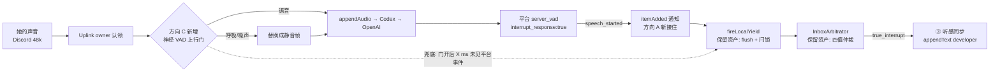

# FLY-2249 barge-in v2 平台触发重做 — 探索
Issue: FLY-2249 (https://linear.app/geoforge3d/issue/FLY-2249/raya语音-barge-in-v2正确方向重做-消费平台-speech-started-触发现被静默丢弃保留停口恢复资产检测确认层按)
日期: 2026-09-02
基于: 无(上游输入 = founder 2026-09-01 20:59 PT 裁定、`engineering/doc/FLY-2247-bargein-mature-options/`{research,plan,synthesis}、`~/.flywheel/artifacts/fly2247-dr-report.md`、FLY-2178 三轮真房记录 `~/.flywheel/artifacts/fly2178-legacy/ROOM-attempt{17,18,19}.md`)

> 世界标记:[raya-main] = raya `origin/main` **`1c71cd2`**;[2178] = raya `fly-2178-bargein-redesign` 头 **`61b41a1`**(PR raya#13 **CLOSED 未合并**;flywheel 锚 PR #1006 同样 CLOSED);[codex] = `~/Dev/codex-oss` `origin/main` **`eb10d91e`(2026-09-02)**,本单已按它**重核**了 FLY-2247 引用的全部协议面结论(FLY-2247 pin 的是 7 月的 `49025589`);[bin] = 装机 `codex-cli 0.152.1`。
> 成色:✅ = 本单亲手核过原件(文件+行号或命令输出);📖 = 引自上游文档、未复核;⬜ = 未知,需探针;🔶 = 占位/推断。

---

## 0. 本单是什么

founder 2026-09-01 20:59 PT 裁定:FLY-2178 的**自研能量/密度检测层方向错误**,关单重开。本单 = 正确方向的重做,方向由 FLY-2247 研究地面真相给定:

| # | 方向(issue 原文) | 本单如何理解 |
|---|---|---|
| ① | 触发源 = OpenAI session 的 `input_audio_buffer.speech_started`(一直在推送,Raya 只认 5 个 method 静默丢弃)——接住当**第一触发源** | 止声(她耳朵里停)的**主触发器**改为平台事件,不再是本地规则门 |
| ② | 确认层(真插话 vs 呼吸/附和)按 FLY-2247 选型:本地神经 VAD / 专用分类器 / 组合,**不再自研能量密度规则** | 判别力放进模型,不放进手调常数;`BargeGate` 六组常数与 WebRTC VAD 是被替换对象 |
| ③ | 听感同步:Codex 的 `conversation.item.truncate` 纠正路不可达,「她听到哪儿」无人同步——**正面处理** | 不能只写「已知缺口」;要给出今天就能落的补偿 + 上游请求 |

**保留资产(FLY-2178 遗产,不重做)**:耳侧停口 0.55s 的下行冲刷链路(`Downlink.interruptVoice()` + 抑制闩锁)、被打断条目恢复(`InboxArbitrator` / `InboxReader` 处置表 / `Speaker.suspendInbox`,真房 9/9)、真房测量体系与 QA 判据(耳侧数据为准 / N=3 指纹断言 / 呼吸哨兵;attempt-19 教训:探针 Opus tap 若用字节模式 Transform 会破坏包边界)。

**验收(founder)**:真房耳侧 —— 打断生效 <1000ms(已有链路保证)+ 呼吸/附和**零误触**(平台触发 + 确认层)+ 打断后守静;全链到最后节点。

**本单边界**:设计节点,不写实现代码;不 dispatch implement/QA;不合并、不部署。

## 1. 先把靶子摆清楚:三件被 FLY-2178 揉在一起的事,现在是四件

FLY-2247 plan §1 把 barge-in 拆成三个职责。本单的审计把它们各自的「今天谁在做」核了一遍,并补上 issue ③ 要求正面处理的第四件:

| 职责 | 今天谁在做([2178] `61b41a1`) | 出处 ✅ | 本单动不动 |
|---|---|---|---|
| **停生成**(服务端不再产出) | OpenAI `server_vad` + `interrupt_response: true` **自动做**,Codex 硬编码、不可配;Raya 既否决不了也看不见 | [codex] `methods_v2.rs:101-104`、`protocol.rs:185-194`(`TurnDetectionType` 只有 `ServerVad`);出站枚举无 `response.cancel`(`protocol.rs:50-95`) | ⛔ 动不了(上游) |
| **触发器**(谁喊「她开口了」) | 本地 `WebRtcSpeechDetector`(mode 3)+ `BargeGate`(密度 7/10 / 迟疑窗 800 / 连续段 80 / 锚段 240 / sustain 350 / grace 1000) | [2178] `pipeline/BargeGate.ts:1-7`、`runtime.ts:564-577` | **换**:主触发器改为平台事件(①) |
| **止声**(她耳朵里停) | `fireLocalYield()` → `Downlink.interruptVoice()`(flush FrameQueue + 换流)+ `suppressVoice()` 闩锁(后续 delta 丢弃只计数,11s 硬上界)→ inbox `arbitrate("local_yield")` | [2178] `runtime.ts:931-976`、`Downlink.ts:98-138` | **保留**(资产) |
| **条目命运 / 恢复** | `InboxArbitrator` 四值(`true_interrupt` / `yield_no_burn` / `false_trigger` / `cancelled`)只认 founder-attributed user final;`false_trigger` 走响应终止屏障后重排队首;`Speaker.suspendInbox()` 硬门 `pendingKey.startsWith("inbox:")` | [2178] `InboxArbitrator.ts:31-38,126-174`、`InboxReader.ts:705-840`、`Speaker.ts:237-259` | **保留**(资产);只加一个 `cause` 值 |
| **听感同步**(她实际听到哪儿 → 会话上下文) | **没有人做**。Codex 自己那条 truncate 分支判等恒假(`speech_started.item_id` 是 user item id,truncate 只收 assistant item id);Raya transport 发不出 truncate | [codex] `realtime_conversation.rs:2151-2176`;[2178] `RealtimeTransport.ts:55-79`(只有 start/appendAudio/appendText/appendSpeech) | **新建**(③) |

⇒ 一句话:**服务端已经是判官,而且我们否决不了它。** 这条结构事实(FLY-2247 research §1.5)决定了本单所有候选方向的形状:任何本地判决只要**与平台判决不一致**,就会留下一个不一致态。两种不一致态的代价如下,它们不对称:

| 不一致态 | 发生条件 | 她听到什么 | 会话上下文 |
|---|---|---|---|
| **本地掐了、平台没掐** | 本地触发器误触(呼吸),而平台 VAD 没把它当语音 | Raya 突然静音;服务端仍在产的那段回答被闩锁压掉 ⇒ **普通对话轮次的内容就这么没了**(inbox 条目有恢复路,对话轮次没有) | 模型以为自己讲完了,她其实一个字没听到 |
| **平台掐了、本地没掐** | 平台 VAD 触发(呼吸或真语音),本地触发器没到门槛 | Raya 把本地队列里已收下的尾巴放完(100ms 起、随积压可到秒级)然后**词中静音** | 模型的回答被截断,但「截到哪儿」无人知道(第四职责) |

这张表是本单选方向的判据:**要么让本地判决与平台判决在结构上一致,要么让不一致的那一格变得可逆。**

## 2. 一条被 FLY-2247 两份文档都没点破的杠杆:我们决定平台听到什么

FLY-2247 research §1.5 的推论是「平台误触 ⇒ 我们否决不了 ⇒ 只能推上游 `threshold`」。synthesis §6 的修正是「本地检测器当快路,平台事件降为佐证」。两份文档都把平台 VAD 当成一个**只能被动接收结论**的黑盒。

但审计 `Uplink` 时核到一件事 ✅:**平台 VAD 只判我们 `appendAudio` 送上去的字节。** `Uplink.pushPcm48Stereo()` 把 owner 的 48k 立体声帧下混成 24k 单声道、进 jitter(prebuffer 3 帧)、再由 20ms 时钟 `tick()` 逐帧 `appendAudio`;mic 关闭时送 `PCM24_MONO_SILENCE`(`Uplink.ts:70-116`)。⇒ 「常开 20ms 流、静音也是一帧」本来就是既有合同(R16 硬门)。

⇒ 如果在**音频进平台之前**放一个本地神经 VAD 门:呼吸帧被替换成静音帧送上去,平台 VAD 看到的就是静音 ⇒ **不发 `speech_started`、不取消 response**。误触在**源头**归零,而不是事后补救。这正是 DR 报告「Noise handling: Neural VAD plus optional denoise/voice isolation —— prevents garbage from reaching interruption state machine」那一行,也是 Pipecat 把 Krisp 放在 VAD **之前**的位置。

这条杠杆同时解决了 §1 表里的两个不一致态:
- 本地门只决定「让不让平台听到」,**不再独立触发止声** ⇒ 「本地掐了、平台没掐」这一格**结构上消失**;
- 平台看到的都是本地门确认过的语音 ⇒ 「平台掐了、本地没掐」退化为「本地漏检」(软声漏检 = 平台也听不见 = 不打断),代价是**漏打断**而不是**误掐** —— 这是 founder 验收里明确排的序(零误触 > 灵敏)。

反面(如实):
- 软声 / 轻声打断若 Silero 没过门,平台**根本听不见她** ⇒ 比今天更迟钝(今天平台会直接掐)。漏检率必须用 c-full 语料量出来,不能只量误触率(FLY-2247 R6-1 同一条警告)。
- 门控要一个前瞻窗(Silero 需要几帧证据),上行会多 ~60–100ms 延迟;若门控只在 Raya 出声期间开启,这个延迟只落在 barge-in 反应上,不落在她正常提问的往返上 —— 但「开/关切换」要处理时间线连续性(§4 方向 C 反面)。
- Silero 对呼吸**不是零误触**(DR 报告原话:"even Silero v6 is not noise proof … breathing is unusually difficult")⇒ 门后仍需要既有的转写仲裁兜住剩余误触;门只是把误触率压到一个数量级以下,不是压到零。「零误触」的验收判据要写成**真房 N 次呼吸臂平台 `speech_started` 计数 = 0**,由新接住的通知直接计数,而不是靠推断。

## 3. 现状审计里改变决策的硬事实

### 3.1 基线分支:保留资产今天不在 main 上 ✅

| 事实 | 出处 |
|---|---|
| raya `origin/main` = `1c71cd2`;`fly-2178-bargein-redesign` 头 `61b41a1` **领先 54 提交、落后 0**(`git rev-list --left-right --count origin/main...61b41a1` = `0 54`)| `~/.flywheel/raya/code` |
| PR raya#13(FLY-2178)**CLOSED 未合并**;flywheel #1006 CLOSED 未合并 | `gh pr list` / `gh pr view 1006` |
| 同一区域另有两条 **OPEN** 分支:raya#11 FLY-2205(inbox 续念不全重念)、raya#10 FLY-2159(realtime 无 final 恢复);FLY-2178 QA 用的联测头是 `fly-2178-2205-integration-c907f5dc-v2@41655e8` | 同上 |
| `61b41a1` 相对 main 的改动面:`BargeGate.ts` / `WebRtcSpeechDetector.ts` / `RealtimeTap.ts` 新增,`Downlink.ts +95` / `runtime.ts +508` / `InboxReader.ts +675` / `Speaker.ts +212` / `InboxArbitrator.ts +242`,以及 `probes/fly2178-*` 全套探针;**`RealtimeTransport.ts` / `AppServerClient.ts` 未动** | `git diff --stat origin/main...61b41a1` |

⇒ 「保留资产」= 保留 `61b41a1` 这 54 个提交的产品部分。**实现基线只能是从 `61b41a1` 开分支**(可干净快进到 main),不是从 main 重做。已作为非阻塞问题报 Lead(2026-09-02,id `17e0529f`),本文按此假设写;若 Lead 另有裁定,只改基线一行,设计不变。

### 3.2 Codex 端(按 `origin/main eb10d91e` 重核,与 FLY-2247 结论一致 + 一条新发现)✅

| 事实 | 出处 |
|---|---|
| `server_vad` + `interrupt_response: true` + `silence_duration_ms: 500` 仍硬编码;`threshold` / `prefix_padding_ms` 未传;`TurnDetectionType` 仍只有 `ServerVad`;`thread/realtime/start` 参数虽多了十来个可选项(`clientManagedHandoffs` / `model` / `initialItems` / `realtimeStartInstructions` …),**仍无 turn_detection 透传位** | `methods_v2.rs:101-104`、`protocol.rs:185-194`、`app-server-protocol/src/protocol/v2/realtime.rs:197-250` |
| 出站枚举仍无 `response.cancel`;`conversation.item.truncate` 仍只在 Codex 内部裸发且判等恒假 | `protocol.rs:50-95`;`realtime_conversation.rs:2151-2176` |
| app-server 把三种事件投成同一个 `thread/realtime/itemAdded`:`{type:"input_audio_buffer.speech_started", item_id}`、`{type:"response.cancelled", response_id}`、普通 conversation item;通知结构 `{threadId, item}`(camelCase)⇒ **能过 Raya 现有的 threadId 过滤**,只是落不到任何分支 | `bespoke_event_handling.rs:503-560`;`v2/realtime.rs:389-392` |
| **新核到**:`thread/realtime/appendText {text, role}` → `Op::RealtimeConversationText` → `handle_text_input` → **只发 `conversation.item.create`,不发 `response.create`**;`role` 支持 `user / developer / assistant`。⇒ developer 文本项是**纯上下文注入、不会让 Raya 开口**。Raya 生产已在用它(meeting 开场 `【系统提示】…不要复述这条系统提示`,`runtime.ts:675`) | `turn_processor.rs:1282-1307`;`realtime_conversation.rs:762-785,2037-2047`;`protocol/protocol.rs:479-484` |
| `thread/realtime/appendSpeech {text}` → `StandaloneSpeech` → V2 下 = `conversation.item.create(role user)` + `response.create` ⇒ 这是「让 Raya 念一段」的既有路径(inbox 注入) | `realtime_conversation.rs:1006-1029,2237-2250` |

⇒ 第四职责(听感同步)**今天就有一条不依赖上游的补偿路**:真打断落定后,用 `appendText(developer)` 把「她实际听到的截止位置」写进会话上下文。它不是 truncate(模型的 assistant item 仍是完整的),但能让下一轮的模型知道「上一句只被听到前半段」。上游 truncate 仍要推,但不再是「不推就无解」。

### 3.3 Raya 端现有链路的几个精确数字 ✅

| 项 | 值 | 出处 |
|---|---|---|
| 上行:48k 立体声 20ms 帧(3840B)→ `onVoiceFrame` tap(**下混前**,给 VAD)→ `Downmix48to24` → jitter(`uplinkPrebufFrames` 3 / `uplinkMaxQueueFrames` 12)→ 20ms `tick()` `appendAudio` | `Uplink.ts:70-116`;`config.ts:373-392` |
| 下行:24k 单声道 delta → `Up24to48Stereo` → `FrameQueue`(**无上界**)→ `tick()` 按 `downlinkTargetFrames` 5(100ms)喂 PassThrough | `Downlink.ts:83-96,140-177` |
| 闩锁:`suppressVoice()` 期间 delta **丢弃只计数**(不缓冲);`SUPPRESSION_MAX_MS` 11s 自动释放 | `Downlink.ts:12,91-94,122-138` |
| 释放路径:conversation scope 在 founder user final 时 `finishLocalYieldSuppression("user_final")`;inbox scope 经 InboxReader 屏障;`suppression_bound` 走 1s 硬界终止屏障 | `runtime.ts:1520-1528,1120-1180` |
| `RealtimeTap` 每行只写 `{ts, kind: method}`,测试禁止写 params ⇒ 落盘分不出 `speech_started` | `RealtimeTap.ts:54-58` |
| 既有 evidence 事件族:`barge_yield_local{phase: fired\|released}` / `barge_gate_frames` / `barge_item_transition` / `barge_item_resumed` / `speech_detector_*` / `realtime_tap_failed` | `runtime.ts`、`InboxReader.ts:948-975` |
| 真房既有读数([2178] attempt 17/18):耳侧停口 **466/563/544/543/563/570/730ms**(n=7,全 <1000);呼吸 3/3 零触发(本地门);4a 迟疑低密度 1/3 达标;attempt-19 全部臂零入向帧 = 探针字节模式 Transform 破坏 Opus 包边界(`61b41a1` 已改 `objectMode: true`) | `ROOM-attempt17/18/19.md`;`probes/c9-voice-emitter.mjs:61-62` |
| r25 C2 探针(平台原生行为,`bargeInEnabled=false`):真语音重叠 → 旧 final **truncated** 且 tap 在刺激后 ~410ms 出现间隙(= 平台确实取消);**合成**呼吸 → 无切断、final 完整、无 user final(= 平台 VAD 对**那一个合成样本**不触发);短促非语义发声 → tap 209ms 间隙但无可听切断、final 完整 | [2178] `evidence/c2-true-room-probes.md` |

⚠️ r25 的呼吸是 ffmpeg 合成的粉噪近似,**不是**真人呼吸;FLY-2031 r2 那次真实灾难(10 次触发 5 次纯假)发生在 r1 的 Discord 边沿触发器上,平台 VAD 对**真实**呼吸的反应至今 ⬜ 未测(FLY-2247 P1 (c) 仍然成立)。

## 4. 候选方向(按 §1 的判据逐个过;⭐ = 取向;反面照写)

### 方向 A —— 只接平台事件当触发器(FLY-2247 R1a + R1b 直连)

- 做法:`RealtimeTransport` 加 `itemAdded` 分支识别 `speech_started` / `response.cancelled`;runtime 在有可打断音频时把 `speech_started` 接到 `fireLocalYield()`;确认层 = 既有转写仲裁(user final 10/10)+ 附和词表。
- 优点:改动最小(~10 行 transport + 一个 cause);止声与停生成**天然一致**(平台掐了我们立刻冲);耳侧 ≈ 平台往返(📖 150–217ms 旧值)+ 20ms flush。
- ⛔ 反面:**对呼吸零抑制**。平台对呼吸误触时 response 已死,我们只是把尾巴冲得更快;对话轮次没了,inbox 条目靠重念。founder 验收「呼吸/附和零误触」这一条**它自己达不成**,只能等上游 R6-1(`threshold`)。⇒ 必要但不充分。

### 方向 B —— 本地神经 VAD 当快路,平台事件当佐证(FLY-2247 synthesis §6)

- 做法:换 Silero,砍规则,本地门 ~100–150ms 触发本地止声;平台事件只记 evidence / 兜底。
- 优点:耳侧最快(DR 预算 ~100–200ms)。
- ⛔ 反面:**制造 §1 表的第一种不一致态**。本地误触(Silero 对呼吸非零)⇒ 本地闩锁压掉服务端仍在产的回答 ⇒ 对话轮次内容丢失、上下文错;而且平台对同一段音频**照样会判**,两套判官各判各的。它还与 founder 裁定「平台 = 第一触发源」相反。synthesis §6 的延迟论证本身是对的(平台在链路上更靠后),但它没算「本地快路判错的代价由谁付」。

### 方向 C ⭐ —— 上行门控 + 平台触发 + 本地兜底(本单取向)

- 做法(三段):
  1. **上行神经 VAD 门**(新 `pipeline/UplinkSpeechGate.ts`):Silero VAD(ONNX,16kHz,512 样本 = 32ms 定帧)跑在 `Uplink` 的 owner 帧上,带前瞻窗(🔶 4–5 个 20ms 帧)与起点回填;判「非语音」的帧在**送 `appendAudio` 之前**替换为静音帧;判「语音」的帧原样送出(含回填的起点帧)。门控**只在 Raya 有可打断音频时**按**整个 utterance** 生效(`speakingStart(owner)` 时采样 `hasInterruptibleAudio()`,持到 `speakingEnd`),Raya 静默期上行路径逐字节不变(R16 硬门)。
  2. **平台事件接住**(方向 A 全部):`speech_started` = 止声主触发器;`response.cancelled` = 响应终止屏障的**精确信号**(存在时优先于「等截断 final / 超时」;不存在时回落既有屏障)。
  3. **本地兜底触发**:门判语音后 🔶 600ms 内未见 `speech_started`(WS 慢 / 丢 / 平台没判)⇒ 走既有 `fireLocalYield(cause:"local_fallback")`。这一条**继承** FLY-2178 那条 <1000ms 的保证,不让它退化。
- 优点:呼吸不进平台 ⇒ 误触在源头归零;止声与停生成一致;耳侧预算 = 前瞻(80–100ms)+ 上行 jitter(60ms)+ 平台往返(150–217ms 旧值)+ flush(≤20ms)≈ **300–400ms** ⬜(<1000 ✅;DR 的 <300 ✗,如实)。
- 反面:
  - **漏检 = 漏打断**(§2)。软声、气声开头的句子若 Silero 没过门,平台听不见;必须量漏检率(c-full),并让 `threshold` / 前瞻长度可配。
  - **新增原生依赖** `onnxruntime-node`(1.29.0,N-API v6,darwin-arm64 预编译 dylib 44MB,npm 包 112MB)✅ 已核;或 `sherpa-onnx-node`(1.13.7,含 Silero + TEN VAD,darwin-arm64 可选依赖)。attempt-18 趟过一次 `webrtcvad` 的 node-gyp,这次是预编译二进制,风险形状不同但要在 Node 25.6.1 arm64 上实装验证 ⬜。装载失败 ⇒ **fail-open 为直通**(平台听到全部音频 = 今天的行为)+ 显式 evidence,不得让 voice 进程起不来。
  - **门控切换的时间线**:utterance 级采样避免了中途切换;但一个 utterance 内前瞻窗引入 L 帧延迟,`speakingEnd` 时要把窗内残帧按判决冲进 jitter(jitter `maxFrames` 12 帧 ≥ L,不溢出)。
  - Silero 非零误触 ⇒ 转写仲裁与附和词表**仍是必要的第二层**,门不是终点。
  - `BargeGate` 六常数与 `WebRtcSpeechDetector` 成为死代码(§6)。

### 方向 D(可选叠加,不进本单验收)—— 可逆本地暂停

- 做法:门判语音的**同时**让 `Downlink` 进入「暂停喂帧、保留队列(有界 🔶 400ms)」态;平台 `speech_started` 在 🔶 400ms 内到达 ⇒ 转为 flush;未到达 ⇒ 续播(她听到一个 ~0.4s 的顿)。
- 优点:把耳侧压到门延迟 + 已写入 PassThrough 的 ≤100ms ≈ **150–250ms**,逼近 DR 预算;且**可逆**,不再有「本地掐了平台没掐」的内容丢失(只是顿一下)。
- 反面:`Downlink` 要新增暂停/续播原语 + FrameQueue 上界(synthesis A1/A2);多一个状态、多一组时序测试;续播时的「顿」是新的听感现象,要 founder 听样带判。⇒ **列为 Phase 3 / flag 默认 off**,等方向 C 的真房数字出来再决定要不要。

### 确认层选型(issue ②,按 FLY-2247 / DR 报告收口)

| 候选 | 裁决 | 理由 |
|---|---|---|
| 路 4 专用 barge-in 分类器(LiveKit adaptive / Krisp IP) | ⛔ 今天接不上 | adaptive 要 aligned-transcript STT(Raya 的 STT 在 Codex 里,只拿得到 `transcript/delta`);Krisp IP 专有且绑 Pipecat(FLY-2247 §4.1、DR 报告) |
| 路 3 LLM 判意图 | ⛔ 不进热路径 | 五家成熟栈没有一家把通用 LLM 放在 VAD → 止声之间(DR 报告);FLY-2247 R4 |
| 路 2 本地神经 VAD(Silero v5/v6) | ⭐ **声学确认层,放在平台之前**(方向 C 第 1 段) | 唯一今天可离线、MIT、<1ms/帧、对噪声显著强于 WebRTC 的选项;TEN VAD 作**挑战者**留给 c-full 语料横评,不进本轮 |
| 转写仲裁(既有 user final) | ⭐ **命运确认层**(保留) | [2178] r2 10/10 对齐;这是 VAD 级信号永远无权写条目命运的结构保证 |
| 附和词表(≤20 词,partial / final 均查) | ⭐ **零成本增量** | 「嗯 / 对 / 哈哈 / okay」单独出现 ⇒ 判 `false_trigger` 走恢复;Vapi `acknowledgementPhrases` 同形;LLM 判语义留作后置 |

⇒ **组合 = Silero(进平台之前的声学门)+ 转写仲裁(既有)+ 附和词表(新,窄)**。三层各管一件事,没有一层是手调形态规则。

### 听感同步(issue ③)

| 路 | 做不做 | 内容 |
|---|---|---|
| S1 记录「她听到哪儿」 | ⭐ 必做 | 每次止声落定时算 `heardMs`(= 已收 delta 时长 − flush 掉的帧时长 − 闩锁丢弃的 delta 时长)并对齐到当时已到的 assistant 转写文本前缀;evidence `barge_heard_position{heardMs, heardTextPrefix, droppedMs}`。这是任何同步手段的前置,也是 QA 核「她听到哪儿」的尺子 |
| S2 本地补偿 | ⭐ 本单做(真打断后) | `appendText(developer)`:「你上一句话用户只听到「…」为止就被打断了;不要复述,不要接着说,等她说完再按她的新问题回答。」—— 路径已核为**只建 item 不触发 response**(§3.2),生产已在用。⚠️ 只在 `true_interrupt` 落定后发,`false_trigger` 不发(那时要恢复的是内容,不是上下文);ship 保护窗内不发 |
| S3 上游 truncate 透传 | ⭐ 推(本单只写请求,不阻塞) | 与 FLY-2247 R6-1/R6-2/R6-3 并列为第四台阶;S1 的 `heardMs` 就是将来 `audio_end_ms` 的来源 |

反面:S2 的 `heardMs → 文本前缀` 是按 delta 到达时序**估算**的(误差 ≈ 一个转写 delta 的粒度),不是逐字对齐;developer 项占上下文 token(每次几十 token,可忽略);若模型无视「不要接着说」,会违反「守静」验收 ⇒ 提示语要与 meeting 开场提示同一口径,并进 QA 臂(打断后 N 秒内 Raya 出声 = FAIL)。

## 5. 保留资产的边界(哪些字节不动)

| 资产 | 不动 | 可动(本单) |
|---|---|---|
| 下行冲刷链路 `Downlink.interruptVoice()` / `suppressVoice()` / `releaseVoiceSuppression()` / 11s 硬界 | 语义、时序、返回值 | 无(方向 D 若做,是**新增**暂停原语,不改这三条) |
| `fireLocalYield()` / `finishLocalYieldSuppression()` / 终止屏障 | flush→闩锁→arbitrate 的顺序、`barge_yield_local` 两行合同 | `cause` 枚举加 `platform_speech_started` / `local_fallback`;`response.cancelled` 可作屏障的快路信号 |
| `InboxArbitrator` / `InboxReader` 处置表 / `Speaker.suspendInbox` | 四值、计数、屏障、lease、hold 全部 | `InboxArbitrationCause` 加一个值;附和词表在 `observe(entry)` 前过滤 |
| 真房测量体系(`probes/fly2178-bargein-room-run.mjs` / `c9-voice-emitter.mjs` objectMode tap / `assertStableTransportFingerprints` N=3) | 判定器、双端指纹合同、耳侧数据为准 | 新增臂:平台事件计数(呼吸臂 = 0 / 真语音臂 ≥ 1)、`speechOnsetAt → audibleStopAt` 统一尺子、漏检臂(软声) |
| `RealtimeTap` | 现有 `{ts, kind}` 行 | **加一列** `itemType`(仅 `itemAdded` 的 `params.item.type` 这个非敏感枚举,不写 payload)—— 否则 P1 (a) 无法离线复核 |

## 6. 会变成死代码的东西(设计节点只列,不删;删除在 plan 里作为显式步骤)

- `pipeline/BargeGate.ts` 的密度 7/10、迟疑窗 800、连续段 80、锚段 240、`hasCoherentHesitationPattern()`、跨 epoch 候选保留(attempt-19 `c830885`)—— 方向 C 下**没有调用者**(本地兜底只需要「门开了 X ms 还没见平台事件」一个计时器)。
- `pipeline/WebRtcSpeechDetector.ts` + `webrtcvad` 依赖 —— 被 Silero 替换。
- `bargeInSustainMs` / `bargeInYieldGraceMs` 两个配置 key —— 语义变为兜底计时器 / 门 re-arm,名字要不要沿用归 plan(倾向改名,避免「同名不同义」)。

⚠️ 这些删除会让 [2178] 的 `BargeGate.test.ts`(291 行)、`WebRtcSpeechDetector.test.ts`(120 行)与 `runtime.test.ts` 里的门控用例失去被测对象;plan 要给出替换测试,不是只删。

## 7. 开放问题(归 Lead / founder;都不阻塞 research/plan 起草)

| # | 问题 | 我的建议 | 状态 |
|---|---|---|---|
| Q1 | 实现基线:从 `61b41a1` 开新分支,还是先合 raya#13? | 从 `61b41a1` 开 `fly-2249-bargein-v2`,最终 PR 以 main 为 base | ✅ **Lead 已裁定同意**(ask `17e0529f`,2026-09-02),并加三条硬约束:① 同一 PR 必须**删除**自研检测与密度调参层(删,不是留旋钮、不是禁用),只保留三样资产 + 平台 `speech_started` 消费 + research 选型的确认层,plan 与 PR 描述逐项列「删了什么 / 留了什么」;② 与 raya#10(FLY-2159)/#11(FLY-2205)/#12(FLY-2204)先就绪先合,2249 若后合就 rebase 到当时的 main,设计不假设它们的状态,有实际冲突文件面在 plan 里点名;③ flywheel 侧锚 PR 照旧,raya PR 附属登记。⇒ §6 的「死代码只列不删」按 ① 升级为**本单必删**,plan 承接 |
| Q2 | 门控范围:只在 Raya 出声期间,还是常开? | **只在出声期间**(utterance 级采样)。常开会给她每次提问加 ~80–100ms 往返,是 80% 主线的代价 | 设计取向 |
| Q3 | 方向 D(可逆暂停)进不进本单? | 不进验收;plan 里作 Phase 3 / flag off,等方向 C 真房数字 | 设计取向 |
| Q4 | 误触落定为 `false_trigger` 的**普通对话轮次**,要不要 `appendSpeech` 请模型接着说? | **本单不做**。方向 C 把误触压到源头后,这条是安全网;且它会重新生成而非续接(DR 报告明说),听感未知。记为后续单 | 设计取向 |
| Q5 | 上游 Codex 四台阶(`threshold` / `response.cancel` / `interrupt_response` 可配 / `truncate` 透传)要不要本单开 issue? | 要,plan 里作为「上游请求」交付物,不阻塞任何本地步骤 | 设计取向 |
