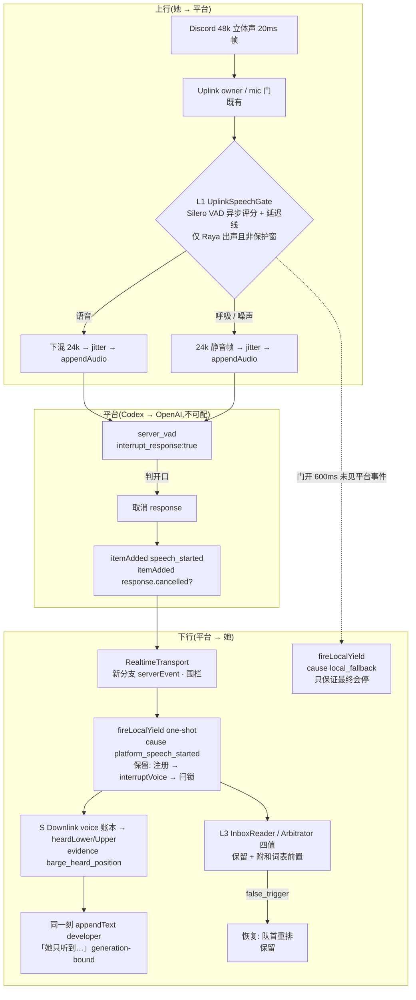

# FLY-2249 barge-in v2 平台触发重做 — 实施计划
Issue: FLY-2249 (https://linear.app/geoforge3d/issue/FLY-2249/raya语音-barge-in-v2正确方向重做-消费平台-speech-started-触发现被静默丢弃保留停口恢复资产检测确认层按)
日期: 2026-09-02
基于: research.md、exploration.md

> 世界标记:[raya-main] `1c71cd2` · **实施基线 [2178] `61b41a1`**(Lead 2026-09-02 裁定,ask `17e0529f`)· [codex] `origin/main eb10d91e` · [bin] 0.152.1。
> 成色:🔶 = 占位默认值,c-full 语料 / 真房一出即作废;⬜ = 未知,探针裁决。
> ⛔ 本单是设计节点产物,供 implement 节点执行;不写实现代码、不 dispatch、不合并、不部署。
> ⛔ 所有新增时间/阈值量走 `RAYA_VOICE_OPTIONS_JSON` 可改项;默认值全部 🔶;**不新增任何能量/密度/形态类规则**(founder 裁定 + Lead 硬约束 ①)。
> **rev 3**(2026-09-02,收口轮 —— Lead 规则:机制只减不增):吸收 round-2 独立设计评审 10 条(3 BLOCKER / 4 HIGH / 3 MEDIUM,全部接受,零拒绝)。本轮**删掉**了 epoch 桥接机制与其旋钮、删掉了兜底路径的 <1000ms 承诺、删掉了一条无法实现的围栏断言、把有状态的 Silero 封装改成纯函数;没有新增任何机制。
> **rev 4**(2026-09-02,round-3 之后;Lead 裁定 round 3 封顶、不再审):round-3 的 5 条(2 BLOCKER / 1 HIGH / 1 MEDIUM / 1 LOW)全部核实成立、全部接受;其中 4 条是**文本合同错误**(字节域混用、差分合同过窄、research 残留、预算数字)已在本 rev 直接改正,1 条(`end()` 与在飞第 K 块的规范矛盾)按「只减」原则**删掉过强保证**并把替代做法列为待 Lead 裁的决策。全部 5 条同时进 **§5.1 实现节点 RED 清单**。rev 4 **未经**复审。
> **rev 5**(2026-09-02,Lead 裁定 R-2 + 授权 round 4 复核轮):采纳「`end()` 遇在飞的决定块时把残帧再持有 ≤1 tick(20ms)等结果落地」(Lead:这是既有路径的时序纠错,不是新检测器);D-GATE10 改为锁住 20ms 上限;R-2 关闭。round 4 的审稿范围写死为「复核 round-3 五处文本合同修正 + 这条 20ms 持有」,其余章节不重开。
> **rev 6**(2026-09-02,round-4 之后):round 4 判 CHANGES REQUESTED,4 条**全部是 rev 5 遗留的文本一致性问题**(20ms 持有与旧句并存、D-GATE9 冲突、D-GATE1/8 前提未同步、evidence 缺 `heldMs`、C2 漏 D-GATE10、持有期内新 `begin()` 未定义;§9/research 的 D-BYTES 旧句;research §7.1 残句与 `max(0,…)`;预算摘要)。rev 6 全部改正;按 Lead 规则**不再开第五轮**,以 `complete --route blocked` 交 Lead 裁下一步。改动点见 §11。

---

## 0. 目标、非目标、授权

### 0.1 目标(对应 issue ①②③ + founder 验收)

1. **平台 `speech_started` 成为止声的第一触发源**(①):`RealtimeTransport` 接住 `thread/realtime/itemAdded`,runtime 把 `input_audio_buffer.speech_started` 接到既有 `fireLocalYield()`;本地只保留一个「等平台」的兜底超时。
2. **确认层按 research 选型**(②):Silero VAD(ONNX)做**上行门控** —— 呼吸/噪声在送平台之前被替换成静音,平台听不到就不会掐;转写仲裁(既有)+ 附和词表做命运确认。自研 `BargeGate` 六组常数、迟疑模式与 `WebRtcSpeechDetector` **整体删除**。
3. **听感同步正面处理**(③):Downlink 内建只读 voice 账本(按字节核销),止声那一刻估算「她听到哪儿」的**区间**并记 evidence;同一刻用 `appendText(developer)` 把它写进会话上下文(尽力赶在平台自动建下一轮之前);上游 truncate 透传作为第四台阶请求。
4. **保留三样资产语义不退化**:0.55s 下行冲刷链路、被打断条目恢复、真房测量体系。

### 0.2 非目标

不实现方向 D(可逆本地暂停,exploration §4)—— 决策点 Q1;不做误触后**普通对话轮次**的自动续说(Q2);不动 `@raya/contracts` / Bridge / brain;不修 FLY-2159 / 不吸收 FLY-2205(各自 PR 独立,先就绪先合);不引入 turn_detection 配置(协议不暴露);不做多人房 per-speaker 状态机;不做跨 Discord speaking epoch 的门状态桥接(rev 3 删除,见 §3.4);不改 20ms 常开流 / 静音语义 / R16 硬门;不为 QA bot 引入任何 ship/relay 权限面;不承诺 <300ms 耳侧停口;**不为本地兜底路径承诺 <1000ms**(它只保证「平台缺席时最终会停」)。

### 0.3 授权记录

| 决定 | 来源 | 约束 |
|---|---|---|
| FLY-2178 自研能量/密度检测层方向错误,关单重开;平台 `speech_started` 当第一触发源;确认层按 FLY-2247 选型 | founder 2026-09-01 20:59 PT | 本单全部 |
| 基线 = 从 `61b41a1` 开新分支 `fly-2249-bargein-v2`,最终 PR base = raya main;**同一 PR 必须删除自研检测与密度调参层(删,不是留旋钮、不是禁用)**;plan 与 PR 描述逐项列「删了什么 / 留了什么」 | Lead 2026-09-02(ask `17e0529f`) | §2 |
| 与 raya#10/#11/#12 先就绪先合;2249 后合就 rebase;设计不假设它们的状态;冲突文件点名 | 同上 | §6.3 |
| **只用本 issue 自己的 raya worktree,绝不在生产目录 `~/.flywheel/raya/code` 切分支或改动**;producer 登记的 PR 锚必须是 flywheel 主仓 PR,raya PR 只作附属登记;raya PR merge 需 founder 另行授权,ship 报告分开写两仓状态 | Lead 2026-09-02 lead-instruction `9d2c69ff` ①②③ | §6.1 C0、§6.2 |
| 官方 Silero v6.2 的 `inputMetadata` 是动态维度,不能推导 576;保留该模型并校验名称/类型/state 形状,按上游合同固定 512+64,`create()` 预热 fail-loud | Lead 2026-09-02 ruling `0b22b374-8d46-42ff-bb2e-2cf6471e342e` | §3.4 |
| r3 必须是收口轮(机制只减不增);r3 不过就交一页增删清单 | Lead 2026-09-02(ask `f53bd620` 回复) | §11 |
| 验收房 `voice-test-2`;founder 不当首测;耳侧数据为准 | FLY-2031/2178 惯例 | §5 |

## 1. 架构总览



一句话:**平台听到什么由本地神经门决定;止声由平台事件同步;命运由转写决定;她听到哪儿由我们记账并第一时间告诉模型。** 没有一层是手调形态规则;没有一个本地判决能与平台判决背道而驰(本地门在平台之前,兜底只在平台缺席时)。

## 2. 删了什么 / 留了什么(Lead 硬约束 ①;PR 描述原样复制这张表)

### 2.1 删除(净删,不留旋钮、不留禁用开关)

| 文件 / 符号 | 内容 | 为什么能删 |
|---|---|---|
| `apps/voice/src/pipeline/BargeGate.ts` + `BargeGate.test.ts` | 密度 7/10 滑窗、迟疑窗 800、连续段 80、锚段 240、`hasCoherentHesitationPattern()`、跨 epoch 候选保留、`sustainMs`/`yieldGraceMs` 门 | founder 裁定方向错误;§3 之后没有调用者 |
| `apps/voice/src/pipeline/WebRtcSpeechDetector.ts` + 测试;`webrtcvad` 依赖(`apps/voice/package.json`、lockfile、`pnpm-workspace.yaml` 的 `onlyBuiltDependencies` 项) | GMM VAD mode 3、48k 定帧、node-gyp 原生编译 | 被 Silero 替换 |
| `runtime.ts`:`bargeGate` 字段与装配、`speechDetector*` 族(`speechDetectorUtterance`、`resetSpeechDetector`、`finishSpeechDetectorUtterance`、`observeVoiceFrame` 里的 VAD 分支)、`onUtterance → barge_gate_frames` | 规则门的 runtime 接线 | 同上;`PcmFingerprint` 指纹**保留**并挂到门之前(§3.4) |
| `config.ts`:`bargeInSustainMs`、`bargeInYieldGraceMs` | 规则门的两个时长 | **fail-closed**:options JSON 里出现这两个 key ⇒ 拒起并写明「已在 FLY-2249 删除」(D-CFG) |
| evidence 事件 `barge_gate_frames`、`speech_detector_pcm_fingerprint`(改名见 §3.4)、`speech_detector_start_failed / frame_failed / degraded / utterance_summary / reset_failed` | 规则门的证据族 | 被 `uplink_gate_*` 族替换 |
| `fireLocalYield` 的 `cause: "sustained_speech"` | 规则门触发原因 | 替换为 `platform_speech_started` / `local_fallback` |

### 2.2 保留(语义不动;允许的改动逐项列出,每项都有回归测试钉住)

| 资产 | 不动 | 本单允许的改动 |
|---|---|---|
| `Downlink.interruptVoice()` / `suppressVoice()` / `releaseVoiceSuppression()` / `SUPPRESSION_MAX_MS` 11s / `audibleTailSnapshot()` | flush 顺序、换流、闩锁语义、11s 硬界、既有返回字段 | **只读 voice 账本**(§3.6):新增计数器与 `interruptVoice()` 返回值的**追加**字段;不改任何既有字段与行为(D-REG 钉住) |
| `runtime.fireLocalYield()` → `finishLocalYieldSuppression()` → 终止屏障(`LOCAL_YIELD_*` 常数、`barge_yield_local{phase:fired|released}` 两行合同) | **既有顺序:先 `inboxReader.localYield()` 注册仲裁,注册失败即 fail-closed 不冲;然后才 `interruptVoice()` → `suppressVoice()`**(`runtime.ts:931-978`);时序、字段 | `cause` 枚举值替换;**one-shot latch 早退**放在注册之前(§3.5);fired 行追加 `heardLowerMs / heardUpperMs` |
| `InboxArbitrator` 四值 / `InboxReader` 处置表、屏障、lease、hold / `Speaker.suspendInbox()` / `holdCodeSpeech()` | 四值、计数、屏障、lease、hold 全部;**assistant final 的既有分支(置 `oldResponseFinalId`、推进屏障)原样** | `InboxArbitrationCause` 加两个值替换 `"local_yield"`;`InboxReader.observe()` 开头前置附和词表(**只作用于当前 active attempt 相关的 founder user final**,§3.5);`observeResponseCancelled()` 持久化 `oldResponseEnded`(§3.5) |
| `Uplink` 的 owner 认领 / `setMicOpen` / `tick()` 20ms 常开流 | owner 语义、mic 语义、20ms 时钟 | ① `pushPcm48Stereo()` 从「tap 旁路 + 无条件下混」改成「串行门 → 按判决下混或静音」;② **jitter 在 `speakingStart/End` 不再 flush**(只 flush 两个部分帧累加器)—— 有意的行为改变,见 §3.4 与 D-BYTES |
| `RealtimeTap` | `{ts, kind}` 行 | 加一列 `itemType`(§3.3) |
| `RealtimeTransport.appendText()` | 语义(只建 item) | 加 `expectedSessionGeneration` 参数(§3.6) |
| 真房台架 `probes/fly2178-bargein-room-run.mjs` / `c9-voice-emitter.mjs`(`objectMode` tap)/ `assertStableTransportFingerprints` N=3 / `fly2031-voice-experience*` 判定器 | 判定器、双端指纹、耳侧数据为准 | 新增臂(§5);`--stimuli` 加 `backchannel` / `soft_speech` |
| ship / readback 保护信号(`bargeInProtected`) | 语义 | 平台触发受它约束;**门控模式选择也受它约束**(保护窗内直通,§3.4) |

## 3. 模块与接口(改动面)

### 3.1 配置(`apps/voice/src/config.ts`,全部走 `RAYA_VOICE_OPTIONS_JSON`)

| key | 🔶 默认 | 校验 | 说明 |
|---|---|---|---|
| `bargeInGateMinSpeechMs` | `200` | 正整数,**≤ 500**(K ≤ 16) | 开门所需连续语音时长;K = ⌈value/32⌉ 个 Silero 正块;**延迟线 L = ⌈(511 + 512K) / 320⌉ + 1 帧**(任意块相位下的最坏起点 + 1 帧异步提交余量;100 ⇒ 9 帧、200 ⇒ 14 帧 280ms、300 ⇒ 19 帧),由此派生、不单独配 |
| `bargeInGateThreshold` | `0.5` | (0,1) | Silero 语音概率阈值;关门迟滞固定 `threshold − 0.15`、连续 100ms(不做旋钮) |
| `bargeInPlatformFallbackMs` | `600` | 正整数,`≥ bargeInGateMinSpeechMs` 且 **≤ 1000** | 门开后等平台 `speech_started` 的超时,超时走 `local_fallback`;**只是可用性兜底,不承诺耳侧时延**(§4 D-TRIG5、§9) |
| `bargeInBackchannelWords` | research §6 的 20 词 | 字符串数组,每项 ≤ 8 字,≤ 64 项 | 覆盖默认词表(整表替换) |
| `bargeInHeardPositionNote` | `true` | 布尔 | 止声时是否发 developer 补偿项(§3.6);evidence 记账**不受**此项影响 |
| `uplinkMaxQueueFrames`(既有) | `12` → **`24`** | 新增校验 `≥ uplinkPrebufFrames + L + 4`,不满足 fail-closed | jitter 不再在 epoch 边界 flush + 延迟线残帧一次性入队的余量 |
| `bargeInSustainMs` / `bargeInYieldGraceMs`(既有) | **删除** | 出现即 fail-closed | 错误文本:`RAYA_VOICE_OPTIONS_JSON.bargeInSustainMs was removed in FLY-2249 (rule-based barge gate deleted); use bargeInGateMinSpeechMs` |

两个时长旋钮(minSpeech / fallback)+ 一个阈值,全部有成熟栈同名参数对应(Vapi `voiceSeconds`、LiveKit `min_interruption_duration`、Silero `min_speech/min_silence`),**没有一个是形态规则**。rev 2 的 `bargeInGateBridgeMs` 已删除(§3.4)。其余 `bargeIn*` key 与 `debugRealtimeTap` 不变。

### 3.2 `codex/RealtimeTransport.ts` —— 接住 `itemAdded`,并给破坏性事件加围栏

```ts
export type RealtimeServerEvent =
  | { type: "speech_started"; itemId: string | null }
  | { type: "response_cancelled"; responseId: string | null }
  | { type: "item_added"; itemType: string | null };
interface RealtimeEvents { …; serverEvent: (event: RealtimeServerEvent, generation: number) => void; }
```

- `handleNotification` 新增分支 `message.method === "thread/realtime/itemAdded"`:取 `params.item`(record 校验);`item.type` 非字符串 ⇒ `item_added{itemType:null}`;`"input_audio_buffer.speech_started"` ⇒ `speech_started`;`"response.cancelled"` ⇒ `response_cancelled`;其它 ⇒ `item_added{itemType}`。**不读、不透传 item 的其它字段**。
- **围栏**:`speech_started` / `response_cancelled` 只在 `this.active && typeof params.threadId === "string" && params.threadId === this.threadId && this.generation !== null` 时投出;pending start 期间、`closed` 之后、threadId 缺失或非字符串 ⇒ **丢弃,不投、不报协议错误**。`item_added` 计数沿用既有宽松过滤。
- **围栏的诚实边界(round-2 MEDIUM-9)**:线上通知不带 Raya 的 generation;transport 只能把**收到时**的当前 generation 贴上去。「同 thread、旧 generation 的通知在新 session active 之后才到」这种情况 transport **无法区分**,本单**不声称**能挡。今天 `V2WebSocketTransport` 在 `cli.ts:165` 只构造一次、`start()` 二次绑定会抛错(`RealtimeTransport.ts:149-169`)⇒ session 重启是否复用同一实例 ⬜ 由 implement 在 C1 核实并记入 evidence;围栏只承诺 `active` 与 threadId 相等两条,不承诺 generation 级隔离。
- `appendText(text, role, expectedSessionGeneration)`:generation 不匹配 ⇒ 返回 `"dropped:stale-generation"`(与 `appendSpeech` 同形),不再抛错;既有调用点(meeting 开场)传当前 generation。
- 测试(`RealtimeTransport.test.ts`):三种 item 各一条;缺 `item` / `item.type` 非字符串 / 其它 threadId / **threadId 缺失 / start pending 期间 / closed 之后迟到 / generation 为 null** ⇒ 破坏性事件零投出;`item_id` 缺失 ⇒ `null`;零 `protocolViolation`;`appendText` stale generation ⇒ dropped。

### 3.3 `codex/RealtimeTap.ts` —— 加一列

行格式:`{ts, kind}` → 当 `kind === "thread/realtime/itemAdded"` 时追加 `itemType: params.item?.type`(仅字符串枚举,其它值写 `null`)。`RealtimeTap.test.ts` 的「不得写 params」断言收窄为「除 `itemType` 外不得写 params」,并新增断言 `itemType` 只能是字符串或 null、**不含 `item_id` / 正文**。

### 3.4 `pipeline/UplinkSpeechGate.ts`(新)+ `pipeline/SileroVad.ts`(新)+ `Uplink` 串行化

**`SileroVad`**(ORT 封装,**异步、无副作用**,单一职责;round-2 BLOCKER-2):
- `static async create(modelPath): Promise<SileroVad>` → `InferenceSession.create(modelPath, { executionProviders:["cpu"], intraOpNumThreads:1 })`;校验 `session.inputNames / inputMetadata` 的名称、类型与 state 形状 `[2,"",128]`。官方 v6.2 该 metadata 的 `input` 维度是动态值,因此按上游 v6.2 合同固定 `512` 个当前样本 + `64` 个上下文 = `576`;常量旁注明上游 commit `be95df9` 与模型 SHA。`create()` 跑一块全零预热,不匹配即 fail-loud(错误含模型 SHA 与实际 metadata),随后按本节既有启动降级路径让平台触发单独工作。此字面合同修正由 Lead ruling `0b22b374-8d46-42ff-bb2e-2cf6471e342e` 授权。
- `async score(chunk16k: Float32Array /*512*/, prior: SileroState): Promise<{ probability: number; next: SileroState }>` —— **纯函数形态**:state(`[2,1,128]` + 64 样本上下文)由调用方持有并传入,封装内不保存任何跨调用状态;迟到的 Promise 因此**不可能**回写到别的链路。
- 模型文件:vendored 到 `apps/voice/models/silero_vad.onnx`(MIT,随 PR 带 LICENSE 摘录),**SHA-256 写死在 `SileroVad.ts`,create 时校验**。
- **失败生命周期(round-2 MEDIUM-10)**:`create()` / 输入形状 / SHA 这类**确定性启动失败** ⇒ 本 session 直接 fail-open 直通一次、记 `uplink_gate_degraded{reason:"startup", …}`,**不重试**;`score()` 异常 / 推理滞后 / 队列溢出这类**瞬时失败**按 utterance 计数,连续 🔶 3 次 ⇒ 本 session 永久直通。
- 依赖:`onnxruntime-node@1.29.0`(精确版本);`pnpm-workspace.yaml` 的 `onlyBuiltDependencies` **以 `onnxruntime-node` 替换 `webrtcvad`**。
- ⚠️ **主线程阻塞是真实风险(round-2 HIGH-7)**:onnxruntime-node 的 `run()` 是 Promise 外观下的 `setImmediate(() => 同步 native run)`(microsoft/onnxruntime#26968),**会占用事件循环**;「零 await」不等于「零 stall」。⇒ C2 必须在 pin 的 1.29.0 + 生产 Node/arch 上,用真模型连续评分 **同时跑 20ms `AudioClock`**,记录单次 `run()` 的 max / p99 与 missed ticks;🔶 预算:单次 ≤ 5ms、missed ticks = 0。超预算 ⇒ **停下上报 Lead**(候选出路是 worker_thread 执行器,但那是新增机制,不在本 plan 内预设)。

**`UplinkSpeechGate`**(纯逻辑 + 一个异步评分依赖;fake VAD 与 fake 时钟可注入):
- **生命周期 = 一个 Discord speaking epoch(chain)**。`begin(mode)` 开链、`end()` 结链;链结束 ⇒ 递增 token、丢弃延迟线以外的一切状态(Silero state、正块累计、分块器余样本)。**不做跨 epoch 桥接**(rev 3 删除 rev 2 的 `bargeInGateBridgeMs`):它本质上是一条「按 Discord 事件间隔决定语音连续性」的时间形态规则,与本单「判别力只在模型里」的立场冲突;删掉它同时消解了 BLOCKER-1 的余样本相位问题(每条链的分块器从空开始)与 BLOCKER-2 的状态所有权冲突。**代价如实**:被 Discord 切成多段、每段都短于 minSpeech 的迟疑短语**开不了门**,平台听到静音,这次不打断;她需要连续说 ≥ minSpeech 才能打断 Raya。D-GATE8 与 QA D 臂按此重写,校准轮(C7.5)可据数据调低 minSpeech。
- 执行模型:
  1. `push(frame48k, atMs)` 同步:帧进延迟线(长度 L)与 16k 分块器;每凑齐 512 样本产生 chunk 序号 c,进**推理队列**(有上界 🔶 L+8 个 chunk,满了 ⇒ 本链 degraded)。
  2. 推理循环:同一时刻至多一个 `score()` 在飞;完成后**若 token 仍匹配**,原子提交 `decision[c]` 与 `state`;token 不匹配 ⇒ 结果整体丢弃(state 也不写)。**不在音频时钟上 await**。
  3. `takeDue(): Array<{frame, speech}>` 同步:返回已到期(延迟满 L 帧)的帧,每帧的 `speech` 取「覆盖该帧的最后一个 chunk 已提交的门状态」;若该 chunk 尚未提交(推理滞后 > L 帧)⇒ 本链转 degraded(直通,后续帧原样),记 `uplink_gate_degraded{reason:"inference_lag"}`。
  4. `end()`(链结束,**唯一合同**):**无在飞 score** ⇒ 立即把延迟线残帧按已提交的门状态吐出、递增 token、丢弃链状态。**有在飞 score** ⇒ 把残帧与链状态再持有**最多 1 个 tick(20ms)**,token 在持有期内**不**递增:在飞结果在期限内落地 ⇒ 提交它,按其结果吐出(开门 ⇒ 残帧全部按语音放行并回填;关门 ⇒ 静音);超过 1 tick 仍未落地 ⇒ 按已提交状态吐出、记 `endedWithScoreInFlight:true, heldMs=20`,递增 token,之后落地的结果按旧 token 丢弃。**持有期内同 owner 新的 `begin()` 到达** ⇒ 先**强制结清旧链**(按已提交状态吐出、`endedWithScoreInFlight:true, heldMs=已过毫秒`、递增 token 恰一次),再开新链;一个 gate 实例任一时刻只有一条链持有 token。持有期间上行时钟照常每 tick 发一帧(残帧只是晚 ≤1 tick 进 jitter,jitter 余量 `≥ prebuf + L + 4` 已含)。这是既有路径的时序纠错(Lead 2026-09-02 裁定 R-2),不是新检测器;剩余的诚实边界 = 推理连 20ms 都没落地(超出 C2 的 5ms 预算 4 倍)或持有期内被新 epoch 抢断时,该链按静音吐出并留下 evidence,QA D 臂作阴性对照。
- 开门/关门:开门 = 连续 K = ⌈minSpeechMs/32⌉ 个 chunk 概率 > threshold;关门 = 连续 ≥100ms 的 chunk 概率 < threshold−0.15。**L = ⌈(511 + 512K)/320⌉ + 1**:语音起点可以落在任意 chunk 相位(前面最多 511 个非语音样本占着当前块),第 K 个正块的最后一个样本最晚落在第 ⌈(511+512K)/320⌉ 个 20ms 帧,再加 1 帧异步提交余量 ⇒ 开门时**起点所在帧仍在延迟线内**,开门瞬间延迟线内全部帧标 `speech:true`(起点回填无损)。
- 模式:`begin(mode)`,`mode ∈ {gated, passthrough}`,由 runtime 在 owner `speakingStart` 时给定;`passthrough` 零延迟、零推理。
- evidence(每链一行,由 runtime 写):`uplink_gate_utterance{mode, opened, openAtMs?, framesTotal, framesSilenced, framesPassed, maxProb, minSpeechMs, threshold, degraded?, framesSilencedBeforeDegrade?, endedWithScoreInFlight, heldMs}`;`uplink_gate_degraded{reason, consecutive}`。

**`Uplink` 的串行化与 epoch 边界**:
```
今天: voiceFrames.take() → onVoiceFrame(frame)            // 旁路 tap
      downmix.push(chunk) → frames → jitter                 // 无条件
      speakingStart(owner 空时)/speakingEnd: flush voiceFrames + frames + jitter
改后: voiceFrames.take() → pcmFingerprint?.observe(frame)  // 指纹仍在门之前
      gate.push(frame, now); for {frame, speech} of gate.takeDue():
        (speech ? downmix.push(frame) : PCM24_MONO_SILENCE) → frames → jitter
      speakingStart/speakingEnd: 只 flush voiceFrames + frames;jitter 不 flush(残帧由 tick 排空)
      setMicOpen(false): 丢弃延迟线(mute 语义不变)
```
- jitter 不再在 epoch 边界 flush 是**有意的行为改变**,影响有两处(round-3 HIGH-3 更正):① 她每句话末尾原本被丢掉的 ≤ jitter 深度的尾帧现在会送达;② `JitterBuffer.flush()` 还会把 `playing` 置回 false(`JitterBuffer.ts:55-58`),不 flush 之后,若下一 epoch 在「空取 tick」之前开始,它的首帧**不再经过 `prebufferFrames` 预缓冲**,静音/语音帧的相对位置随之变化。D-BYTES 的差分合同按此收紧:差异**只允许发生在 epoch 边界窗内**,且**非静音 PCM 的相对顺序不变**;两种既有状态(下一 epoch 在空 tick 之前 / 之后开始)分别覆盖。
- **保护窗**:owner `speakingStart` 时若 `shipGateFlow.bargeInProtected || readbackGate.bargeInProtected` ⇒ `mode = passthrough`,**不论 Raya 是否在出声**;ship 的单字「对」、readback 的「不对 / 等等 / 取消」不得被门静音(D-TRIG4 端到端断言 appendAudio 字节)。
- 指纹事件改名 `uplink_pcm_fingerprint`(字段不变)。

### 3.5 runtime 接线

| 事件 | 动作 | 守卫 |
|---|---|---|
| `serverEvent{speech_started}` | 取消兜底计时器;若 Live phase 且 generation 匹配且 `hasInterruptibleAudio()` 且 `!protected()` ⇒ `fireLocalYield("platform_speech_started")`;否则只记 `barge_platform_event{type:"speech_started", acted:false, reason}` | reason ∈ `no_interruptible_audio / protected / already_yielded / stale_generation / not_live` |
| `serverEvent{response_cancelled}` | 记 `barge_platform_event{type:"response_cancelled"}`;`inboxReader.observeResponseCancelled(generation)`:active attempt 在 reading / awaiting_reply / arbitrating / false_barrier 任一阶段且 generation 匹配 ⇒ 持久化 `oldResponseEnded=true, oldResponseEndCause:"cancelled"`,进入 false_barrier 时消费(等价于观察到旧响应终点,`settleFalseTrigger(active,"final")` 快路);无 active attempt / 旧 generation ⇒ 只记 evidence | ⬜ 事件可能永不到达;不到达时一切走既有屏障 |
| `serverEvent{item_added}` | 仅计数进 `barge_platform_event{type:"item_added", itemType}` | 无 |
| 门 `opened`(gate 回调) | 若无在飞兜底计时器 ⇒ 启动一个,绑定 `(generation, yieldToken)`;到期仍未见 `speech_started` 且 `hasInterruptibleAudio()` 且 `!protected()` ⇒ `fireLocalYield("local_fallback")` | **计时器唯一归属**:同 generation 内至多一个;取消点 = `speech_started` 到达 / yield 已发生 / user final settle / suppression bound / Draining / transport close / generation 切换;`speakingEnd` **不**取消 |
| `speakingStart(owner)` | `mode = protected() ? "passthrough" : hasInterruptibleAudio() ? "gated" : "passthrough"`;`uplink.beginUtterance(mode, nowMs)` | 替换今天的 `resetSpeechDetector` / `bargeGate.speakingStart` |
| `speakingEnd(owner)` | `uplink.endUtterance(nowMs)` ⇒ 写 `uplink_gate_utterance` 行 + 指纹行 | 替换 `bargeGate.speakingEnd` / `finishSpeechDetectorUtterance` |
| `fireLocalYield(cause)` | **顺序(round-2 HIGH-5,按 `61b41a1` 既有顺序写实)**:① one-shot latch:若 `localYieldSuppressed` 且 latch 的 generation == 当前 ⇒ 早退并记 `barge_platform_event{acted:false, reason:"already_yielded"}`;② `inboxReader.localYield(cause)` 注册仲裁 —— 返回 `failed` ⇒ **fail-closed:不 flush、不闩锁**,只记既有的 `barge_yield_local{scope:"inbox_failed"}` 行;③ `interruptVoice()`;④ `suppressVoice()`;⑤ 取 Downlink voice 账本估算 heard 区间写进 `barge_yield_local{phase:"fired", heardLowerMs, heardUpperMs, droppedMs}` + `barge_heard_position`;⑥ 若 `droppedMs > 0 && bargeInHeardPositionNote && !protected() && !ledgerUnknown` ⇒ **立即**发 developer 补偿项(§3.6);⑦ 取消兜底计时器 | latch 清理点 = `finishLocalYieldSuppression`(任何 cause)/ Draining / generation 切换 |

`InboxArbitrationCause`:`"local_yield"` → `"platform_speech_started" | "local_fallback"`(`InboxReader.localYield(cause)` 透传);`barge_item_transition.cause` 因此多两个值、少一个值。

**附和词表前置(含守卫,round-2 HIGH-4)**:`InboxReader.observe(entry)` 开头(在 `releaseLocalYield(...,"user_final")` 与 `arbitrator.observe(entry)` **之前**),**仅当** `entry.role === "user"` 且 `entry.speakerUserId ∈ founderUserIds` 且 `entry.sessionGen` 为当前 generation 且存在 active barge attempt 且 `entry.id` 在该 attempt 的 `injectedAtId` 之后 时才判 `isBackchannelOnly(entry.text)`:命中 ⇒ 记 `barge_backchannel_ignored{transcriptId, chars}` 并 `return`(既不释放闩锁也不递交仲裁;窗满 ⇒ `false_trigger`)。**assistant final 与任何不满足上述条件的 entry 原样进入既有逻辑**(assistant 的「好的」必须仍能置 `oldResponseFinalId` / 推进屏障)。runtime 的 conversation-scope 释放(`runtime.ts:1520-1528`)**不查词表**。

### 3.6 Downlink voice 账本 + `speech/HeardPosition.ts`(新)+ developer 补偿项

**Downlink 只读账本**(不改 flush / 闩锁语义;round-2 BLOCKER-3 按字节核销):
- 计量单位 = **字节,且只用一个字节域(round-3 BLOCKER-1 更正)**:Downlink 先把 24k 单声道 delta 经 `Up24to48Stereo` 变成 **48k 立体声**再入 `FrameQueue`、再写 PassThrough(`Downlink.ts:42-45,83-96,156-166`;一帧 = 3840B,`Silence.ts:1-2`),所以账本**全部在 48k 立体声域**记,换算 **192 B/ms**;输入 delta 的 24k 字节(48 B/ms)**不进账本**。
- `acceptedVoiceBytes`:`upsample.push(chunk)` 的**输出**字节(即真正 `queue.push` 的 48k 立体声字节;stale / suppressed 分支 return 前**不**计)。
- `queuedVoiceBytes` = `queue.depth() × 3840 + queue.residueBytes()` —— `FrameQueue` 新增只读 `residueBytes()`(不足一帧的 voice 余量,`flush()` 会把它删掉,所以必须计入)。
- `passThroughVoiceBytes`:维护一个**写入种类 deque** `{kind: voice|silence|bed, bytes}`,每次 `stream.write()` 入队;每次 `tick()` 与 `interruptVoice()` 先按**实际观测增量**核销:`consumedTotal = writtenTotalBytes − bufferedBytesNow`,`consumedDelta = consumedTotal − lastReconciledConsumedTotal`(**单调水位,不重复扣历史**),从队首扣掉 `consumedDelta` 字节(队首条目被部分消费时按剩余字节保留),然后 `lastReconciledConsumedTotal = consumedTotal`。核销后 deque 里 voice 条目的字节和 = `passThroughVoiceBytes`;**deque 与真实 backlog 同寿命,不设固定长度**。
- 不变量:`acceptedVoiceBytes ≥ queuedVoiceBytes + passThroughVoiceBytes`;不成立、或 `bufferedBytesNow > deque 字节和`、或 `consumedDelta < 0` ⇒ `ledgerUnknown:true`,**禁止发 developer 补偿项**。
- epoch 起于 idle 后第一个被接受的 delta;止于 `lastVoiceFrameAtMs + bufferedFrames×20 + audibleTailPadMs` 到期、或 `interruptVoice()` / `stop()`;**不止于 assistant final**。
- `interruptVoice()` 返回值**追加** `acceptedVoiceBytes`、`queuedVoiceBytes`、`passThroughVoiceBytes`、`ledgerUnknown`(既有三个字段不变)。

**`HeardPosition`**(runtime 持有,generation 切换清空):
- 检查点:C1 修好 delta 解析后,assistant `transcript{final:false}` 每条到达记 `(acceptedVoiceBytesNow, transcriptSoFar)`(delta 增量拼接;`done` 与拼接不一致 ⇒ 以 done 为准并记 `transcript_delta_mismatch`;空 delta 忽略)。
- `estimate(cleared)`:`droppedMs = (queuedVoiceBytes + passThroughVoiceBytes) / 192`;`heardUpperMs = acceptedVoiceBytes/192 − droppedMs`;`heardLowerMs = max(0, heardUpperMs − discordPipelineMs)`(🔶 100,F 臂校准);`heardTextPrefix` = `acceptedVoiceMs ≤ heardLowerMs` 的最后一个检查点(保守);`checkpointLagMs`。检查点里的 `acceptedVoiceBytesNow` 与账本同域(48k 立体声)。
- evidence `barge_heard_position{cause, heardLowerMs, heardUpperMs, acceptedVoiceMs, droppedMs, checkpointLagMs, heardTextPrefixChars, ledgerUnknown}`(**只写字符数不写正文**)。

**developer 补偿项**(时点 = `fireLocalYield` 第 ⑥ 步):
- 条件:`droppedMs > 0 && bargeInHeardPositionNote && !protected() && !ledgerUnknown`;同一 yield token 至多一条。
- 文本 = research §7.2(含前缀尾 ≤40 字、约几秒、「不要复述这条提示;如果她接着问新问题,只回答新问题」)。
- 路径:`transport.appendText(text, "developer", generation)`;`AppServerClient.request()` 在返回 Promise 前**同步** `writeControl()`(`AppServerClient.ts:148-169`),所以请求字节在本 tick 内就出去了;返回 stale ⇒ `barge_heard_note_failed{reason:"stale_generation"}`;异常 ⇒ `barge_heard_note_failed{message}`,不重试;返回后再核 yield token。
- **顺序合同(诚实,round-2 MEDIUM-8)**:它**可以**先于平台在她停口后自动建的下一轮 response,但不是保证 —— `silence_duration_ms 500` 是服务端从**她实际停口**起算的窗,不是 Raya 收到往返之后的剩余量;短句可能在通知到达前就已经结束。A′ 臂只把「append RPC ack 时刻 vs 第一条新 response 音频/转写时刻」当**代理**指标记录(app-server 不投影 `ResponseCreated`,无法直接证明顺序)。它不用于验收「守静」。

### 3.7 `inbox/Backchannel.ts`(新)

`isBackchannelOnly(text, words): boolean` —— 归一化(NFKC、去标点/空白、小写)后整段 ∈ 词表(允许同词重复拼接)。接入点与守卫见 §3.5。

### 3.8 协议修复:transcript delta

`RealtimeTransport.handleNotification` 对 `thread/realtime/transcript/delta` 读 `params.delta`,对 `transcript/done` 读 `params.text`(Codex 投影字段不同,`bespoke_event_handling.rs:541-563`);今天两者都读 `text` ⇒ **所有 `final:false` 事件从未发出**。修复后 user/assistant partial 第一次可见;runtime 只有 HeardPosition 消费 assistant partial,其它既有消费者仍只看 `final`(D-REG 钉住)。

### 3.9 探针与台架(`probes/`)

- `fly2178-bargein-room-run.mjs`:`PROBE_STIMULI` 加 `backchannel`、`soft_speech`;每轮读 realtime tap 的 `itemType` 列统计 `speech_started`;新增断言族(§5)。文件名保留,内部 issue 标记加 `FLY-2249`。
- `c9-voice-emitter.mjs`:不动。
- 新增 `probes/fly2249-gate-calibrate.mjs`:**手动校准 CLI**(不进 `test:qa`、不进 CI):把 WAV 语料喂 `UplinkSpeechGate`(真 Silero),输出每样本 `opened / openAtMs / maxProb / framesSilenced`,并对一组候选 (minSpeech, threshold) 网格给出误触率 / 漏检率表。
- 新增 `apps/voice/src/pipeline/SileroVad.smoke.test.ts`:**确定性离线冒烟**(进 `pnpm -r test`):加载 vendored 模型、校验 SHA;**阳性样本 = 仓内已 hash 的真实语音 WAV(如 `true-speech.wav`)连续 ≥ 10 块**,断言冻结的可复现概率区间(模型 SHA 固定后一次性记录);全零块只断言 finite 且 < 0.1(**不用合成正弦,神经 VAD 正确拒绝纯音不该让冒烟失败**);在 ORT 不支持的 OS/arch 上 `it.skipIf` 并**打印显式 skip 原因**。
- 新增 `apps/voice/src/pipeline/SileroVad.clock.test.ts`(或 C2 的一次性脚本,产物入 evidence):真模型连续评分 + 20ms `AudioClock` 并跑,输出 `run()` max/p99 与 missed ticks(§3.4 预算)。

## 4. 行为规格(逐条可测;编号供测试引用)

| # | 场景 | 规格 | 测 |
|---|---|---|---|
| D-EVT1 | transport 收到 `itemAdded{speech_started,item_id}`(active、threadId 匹配) | `serverEvent{type:"speech_started", itemId}` 恰一次,generation 正确;`item_id` 缺失 ⇒ `null` | transport 单测 |
| D-EVT2 | `itemAdded{response.cancelled}` / 普通 item / `item.type` 非字符串 / 缺 `item` | 分别 `response_cancelled` / `item_added{itemType}` / `item_added{null}` / 忽略;零 `protocolViolation` | transport 单测 |
| D-EVT2b | 破坏性事件在 threadId 缺失 / 非字符串 / 其它 thread / start pending / closed 之后 / generation 为 null 时到达 | **零投出**,零 `protocolViolation`;普通 `item_added` 在其它 thread 被过滤 | transport 单测 |
| D-EVT3 | `debugRealtimeTap=true` 时收到上述通知 | 行含 `itemType`(字符串或 null),**不含** `item_id` / 正文 / 其它 params | tap 单测 |
| D-EVT4 | `transcript/delta{delta}` 与 `transcript/done{text}` | 分别投 `final:false`(text=delta)与 `final:true`;既有只看 final 的消费者行为不变 | transport 单测 + runtime 回归 |
| D-EVT5 | `appendText(text,"developer",gen)` 在 stale generation | 返回 `dropped:stale-generation`,不发 RPC;meeting 开场调用点传当前 generation 行为不变 | transport 单测 |
| D-TRIG1 | Raya 在念读(inbox scope),`speech_started` 到达 | 顺序:`localYield("platform_speech_started")` 注册 → `interruptVoice()` → `suppressVoice()`;`barge_yield_local{phase:"fired", cause, heardLowerMs, heardUpperMs}` 恰一行;`barge_heard_position` 一行;兜底计时器被取消 | runtime 集成(fake transport,调用顺序 spy) |
| D-TRIG1b | 同上但 `localYield()` 返回 `failed` | `interruptVoice` / `suppressVoice` **0 次**;既有 `scope:"inbox_failed"` 行 | 同上 |
| D-TRIG2 | conversation scope,`speech_started` 到达,随后 founder user final | 同上;user final ⇒ `finishLocalYieldSuppression("user_final")`,其后第一个 delta 可听(顺序断言,继承 [2178] D8) | 同上 |
| D-TRIG3 | Raya 静默(无可打断音频),`speech_started` 到达 | 零 flush、零闩锁;`barge_platform_event{acted:false, reason:"no_interruptible_audio"}` | 同上 |
| D-TRIG4 | ship / readback 保护窗内:①她开口 ⇒ 门 mode=passthrough,`appendAudio` 字节与无门时逐字节相同(用最短合法词「对」「取消」的 PCM);②`speech_started` 到达 ⇒ 零 flush,`acted:false, reason:"protected"`;S3 词表等既有语义不变 | 端到端字节断言 + ShipGateFlow/ReadbackGate 集成 |
| D-TRIG5 | 门开后 `bargeInPlatformFallbackMs` 内无 `speech_started` | `fireLocalYield("local_fallback")` 恰一次;之后 `speech_started` 迟到 ⇒ latch 早退,`already_yielded` 一行,**零第二次 `interruptVoice()`**(spy 断言)。**本条只证明可用性与 one-shot,不证明耳侧时延**(§9) | fake timers |
| D-TRIG6 | 门开后 `speech_started` 在超时前到达 | 计时器取消,`local_fallback` = 0 | fake timers |
| D-TRIG7 | `speech_started` 到达但 generation 已切换 / Draining / 非 Live | 忽略;零副作用;evidence reason 记实 | 集成 |
| D-TRIG8 | **两个回调反序**:fallback 到期与 `speech_started` 同 tick、两个 epoch 各开一次门、重复/迟到 `itemAdded` | 全部竞争同一 latch:恰一次 flush、恰一条 fired 行、恰一个计时器;清理点(user final / suppression bound / Draining / close / generation 切换)后 latch 与计时器都不残留 | 集成(两种顺序各一) |
| D-GATE1 | gated 链,真语音帧序列(fake VAD 概率 0.9),**语音起点遍历 chunk 相位 0 / 1 / 256 / 511 样本,minSpeech ∈ {100,200,300}**,且第 K 块的 score 在 `end()` 之前或 `end()` 后 ≤1 tick 内落地 | 在该前提下开门前**没有任何原始语音帧被永久替换**(开门时起点帧仍在延迟线内);之后逐帧放行;上行 24k 序列 = 无门时同序列的下混结果,只是晚 L 帧 | gate 单测(参数化) |
| D-GATE2 | gated 链,呼吸(fake VAD 概率 0.2) | 全部帧替换为 `PCM24_MONO_SILENCE`;`opened=false`;`end()` 残帧同为静音;jitter `droppedOverflow` = 0 | gate + Uplink 集成 |
| D-GATE3 | 概率序列:K−1 个正块后转负 | 不开门;全部静音(按 32ms chunk 计,不按 20ms 帧计) | gate 单测 |
| D-GATE4 | passthrough 链 | 零延迟、零推理调用;上行字节与 `61b41a1` 同输入逐字节相同(D-BYTES) | Uplink 差分 |
| D-GATE5 | 链中途 `setMicOpen(false)` | 延迟线丢弃;mute 语义与既有一致;迟到 Promise 不提交 | Uplink 单测 |
| D-GATE6 | ①`create()` / 形状 / SHA 失败;②`score()` 抛错;③推理队列溢出;④推理滞后 > L 帧 | ① ⇒ 本 session 直通一次、`uplink_gate_degraded{reason:"startup"}`、不重试;②③④ ⇒ 本链转 passthrough、`uplink_gate_degraded{reason}` 恰一行、`framesSilencedBeforeDegrade` 记实、下条链重试、连续 3 次后本 session 永久直通;进程不退出 | 注入失败/延迟的 fake VAD |
| D-GATE7 | 模型文件 SHA 不符 | 视同 ① 路径,错误文本含期望/实际 SHA 前 8 位 | 单测 |
| D-GATE8 | Discord 把一次迟疑语音切成 3 个 epoch,每段 < minSpeech | **每链独立**:三段都不开门、全部静音、零 `speech_started`(这是接受的代价,不是缺陷);其中一段 ≥ minSpeech 且第 K 块 score 在 `end()` 之前或 `end()` 后 ≤1 tick 内落地 ⇒ 该段开门并放行;Silero state 不跨链 | gate 单测 + 集成 |
| D-GATE9 | 异步提交时序:帧到期时判决已提交 / 未提交;迟到 Promise 在**持有期结束、token 已前进之后**才返回 | 已提交 ⇒ 按判决;未提交 ⇒ degraded 直通;持有期内返回的结果**提交**(见 D-GATE10),持有期结束后返回的结果(含 state)**整体丢弃**;控制流用 fake 时钟证明 tick 不等待 Promise(**主线程阻塞由 §3.4 的真模型时钟测试单独证明**) | gate 单测 |
| D-GATE10 | **精确交错**:前 K−1 块已提交(门关)、第 K 块在飞时 `end()` 到达;四形:①结果在 5ms 内落地且为正;②结果在 5ms 内落地且为负;③结果 25ms 才落地;④持有到第 8ms 时同 owner 新的 `begin()` 到达 | ①残帧全部按语音放行(起点回填)、`opened=true`、`heldMs ≤ 20`;②残帧按静音吐出、`opened=false`;③**恰在 20ms 上限**按已提交状态(静音)吐出、`endedWithScoreInFlight:true, heldMs=20`,迟到结果按旧 token 丢弃;④旧链立即按已提交状态强制结清、`endedWithScoreInFlight:true, heldMs=8`、token 恰前进一次、新链正常开始;四形下上行时钟每 tick 恰发一帧、持有期内 token 不变 | gate 单测(fake 时钟 + 可控 Promise) |
| D-BYTES | **差分回放**:同一录制 owner 帧序列 + 同一 fake 时钟,在 `61b41a1` 与新头上跑 passthrough;两种既有状态各一份录制(下一 epoch 在 jitter 空取 tick **之前** / **之后**开始) | 差异**只允许出现在 epoch 边界窗内**(旧 epoch 尾帧现在送达 + 下一 epoch 首帧的预缓冲位置变化);**非静音 PCM 的相对顺序不变**、边界窗之外逐字节相同;golden diff 必须恰好是边界窗内的集合,其它任何差异 FAIL | golden 差分(继承 [2178] D1 方法) |
| D-ARB1 | inbox 念读被 `speech_started` 打断,窗内 founder final =「你等一下」 | `true_interrupt`,`cause:"platform_speech_started"`;交付 +1、队尾;`barge_item_transition` 恰一行 | InboxReader 集成 |
| D-ARB2 | 同上但 founder final =「嗯」 | `barge_backchannel_ignored` 一行;**闩锁未释放**、arbitrator 未收到该 final;窗满 ⇒ `false_trigger`;条目队首、交付不变、屏障后重注 | 同上(spy `releaseLocalYield`) |
| D-ARB2b | **assistant final =「好的」**;非 founder user final =「嗯」;旧 generation 的 user final =「嗯」;无 active attempt 时的 user final =「嗯」 | 全部**不**被词表拦截,原样进入既有逻辑(assistant 的「好的」照常置 `oldResponseFinalId` / 推进屏障) | 同上 |
| D-ARB3 | `response_cancelled` 在 reading / arbitrating 阶段早到,随后判 `false_trigger` | `oldResponseEnded` 已持久化 ⇒ 进入 false_barrier 立即走 `settleFalseTrigger(active,"final")` 快路;不等 `speechConfirmTimeoutMs` | fake timers |
| D-ARB4 | `response_cancelled` 从未到达 / 旧 generation 到达 / 无 active attempt | 一切走既有屏障;旧 generation 与无 attempt 只记 evidence | 同上 |
| D-HEARD1 | 接受 3 个 delta(各 100ms;上采样后各 19200B,`acceptedVoiceBytes = 57600`),期间 2 个转写检查点;flush 时队列 2 帧(7680B)+ 余量 960B、PassThrough 里 voice 1 帧(3840B)+ 静音 4 帧 | `droppedMs = (7680 + 960 + 3840) / 192 = 65`;`heardUpperMs = 300 − 65 = 235`;`heardLowerMs = 135`;`heardTextPrefix` = `≤ 135ms` 的最后检查点;静音帧**不**计入;不变量成立;字段齐、不含正文 | Downlink 账本单测 + 估算器单测 |
| D-HEARD2 | 闩锁期间到达的 delta;assistant final 之后、尾巴内的打断 | 前者不计入 `acceptedVoiceBytes`;后者账本仍在(epoch 不因 final 结束)且能估算 | Downlink 单测 |
| D-HEARD2b | **消费者停滞**使 PassThrough backlog 达 `6×targetFrames`;**非 20ms 对齐的 delta** 留下余量;**队首帧被部分消费**;**连续多个 tick 不消费**(核销增量为 0,不得重复扣历史) | deque 按增量核销后 `passThroughVoiceBytes` 仍精确;余量计入 `queuedVoiceBytes`,`droppedMs > 0` 触发补偿项;部分消费的队首按剩余字节计;若不变量破 / `bufferedBytes > deque 字节和` ⇒ `ledgerUnknown:true` 且不发补偿项 | Downlink 单测(四条反例) |
| D-HEARD3 | `fireLocalYield` 且 `droppedMs > 0` 且 `!ledgerUnknown` | `appendText(…,"developer",gen)` 恰一次、在 fired evidence 之后同步发出;文本以 `【系统提示】` 开头、含前缀尾 ≤40 字、含「不要复述」;`bargeInHeardPositionNote=false` ⇒ 不发但 evidence 照记 | 集成 |
| D-HEARD4 | `droppedMs = 0` / `ledgerUnknown` / 保护窗内 / transport closed / stale generation / 同 token 第二次 | 不发;stale ⇒ `barge_heard_note_failed{reason:"stale_generation"}`;异常 ⇒ `barge_heard_note_failed{message}`,不重试 | 集成 |
| D-CFG | options 含 `bargeInSustainMs` / `bargeInYieldGraceMs` / `bargeInGateBridgeMs`;`bargeInGateMinSpeechMs > 500`;`bargeInPlatformFallbackMs < minSpeech` 或 `> 1000`;`uplinkMaxQueueFrames < prebuf + L + 4`;词表项 > 8 字 | 全部 fail-closed,错误文本写明 | config 单测 |
| D-DEAD | 全仓 grep | `BargeGate`、`WebRtcSpeechDetector`、`webrtcvad`、`sustained_speech`、`barge_gate_frames`、`speech_detector_`、`bargeInGateBridgeMs` **零命中**(测试与 fixtures 一并清) | CI grep 守卫脚本 |
| D-REG | [2178] 既有 D2–D7 / D10a / D10b / D13 / D14 / D18 / D20 / D21 全套 + Downlink 既有测试 | 不变绿改(只改 cause 名;Downlink 返回值追加字段不破坏既有断言) | 既有套件 |
| D-CLOCK | 全部新路径 | 20ms 常开流不断、`clock:stall = 0`、静音语义 S1–S9 不变(R16 硬门);**真模型评分与 AudioClock 并跑,`run()` max ≤ 5ms、missed ticks = 0**(§3.4) | 既有时钟测试 + 新 clock 测试 + 真房 H 臂 |

## 5. 真房验收(QA 节点合同;判据全文见 research §8)

### 5.1 实现节点 RED 清单(round-3 残留,Lead 2026-09-02 裁定:round 3 封顶、不再审;剩余项在此列出报 Lead 裁)

| # | 来源 | 内容 | rev 4 处置 | 实现节点动作 | 待 Lead 裁 |
|---|---|---|---|---|---|
| R-1 | round-3 BLOCKER-1 | Downlink 账本混用 24k 单声道(48 B/ms)与 48k 立体声(192 B/ms)字节域;每 tick 重复扣累计消费量;D-HEARD1 算式不成立 | ✅ 文本已改正(§3.6 单一 48k 立体声域、增量水位核销、不变量、D-HEARD1/2b 重写) | 先写 D-HEARD1 / D-HEARD2b 四条反例 RED,再实现账本 | 否(纯更正) |
| R-2 | round-3 BLOCKER-2 | `end()` 时若决定开门的第 K 块在飞,链的全部语音前缀被静音,与 D-GATE1/8 的无条件保证矛盾 | ✅ rev 4 删掉无条件保证;**rev 5 按 Lead 裁定采纳「残帧再持有 ≤1 tick 等结果」**;rev 6 把它写成 §3.4 第 4 点的唯一合同(含持有期内新 `begin()` ⇒ 先强制结清旧链),D-GATE1/8/9/10 与 evidence(`heldMs`)对齐,C2 含 D-GATE10 | 先写 D-GATE10 四形 RED | **已裁(采纳)**;D 臂作阴性对照量 `endedWithScoreInFlight` 次数 |
| R-3 | round-3 HIGH-3 | 不 flush jitter 还会改变下一 epoch 的预缓冲位置,D-BYTES「唯一差异 = 尾帧」过窄 | ✅ 文本已改正(§3.4、D-BYTES 收紧为「边界窗内 + 非静音 PCM 相对顺序不变」,两种状态各一份录制) | 先录两份 golden,再改 Uplink | 否(纯更正) |
| R-4 | round-3 MEDIUM-4 | research §6/§7.1 仍残留 rev 2 的 frame/ring/`receivedAudioMs` 账本与无守卫词表文本 | ✅ research 已按 rev 4 同步(删旧文) | 以 plan 为准;research 只作背景 | 否 |
| R-5 | round-3 LOW-5 | 预算数字沿用旧的 232ms 门开;新公式下最坏 ≈ 276ms ⇒ 主路径 ≈ 686–753ms、兜底 ≈ 1076ms | ✅ 文本已改正(§7/§9、research §4/§5) | QA 用真房实测,不用预算 | 否 |

⚠️ rev 4/5 的这些更正由 Lead 授权的 **round 4 复核轮**只复核这五处 + R-2 的 20ms 持有,其余章节不重开;结论见 §11。

**前置**:C8 之前必须先跑 **校准轮**(§6.1 C7.5):用 `fly2249-gate-calibrate.mjs` 对真人语料(呼吸 / 附和 / 软声 / 真语音 / **迟疑分段语音**各 ≥ 3 段,优先 founder 本人在常用麦克风上的录音;不足时用 QA 合成样本并标注)出误触率 / 漏检率表,**选定并提交默认值**,再在 exact head 跑真房。

| 臂 | 硬判据(任一不过 = FAIL) |
|---|---|
| A 真语音 ×5 | `speech_started` ≥1/轮;`speechOnsetAt → audibleStopAt` **<1000ms** 全部;`local_fallback` = 0 |
| B 呼吸 ×3(哨兵,优先真人录音) | 平台 `speech_started` = **0**;门 `opened` = 0;`barge_yield_local` = 0;播报连续 |
| C 附和 ×3(「嗯」「对」「哈哈」真人录音) | 平台 `speech_started` = **0**(硬门;founder 可显式接受某个非零预算,否则不过);同时报 `false_trigger` 处置数 |
| D 软声 / 迟疑 ×3 | 门 `opened` 且 `openAtMs − onset ≤ 🔶 400ms` 且 `speech_started` ≥1(漏检率与 B/C 成对报);**迟疑分段样本单独报开门率**(rev 3 删桥接后的诚实代价) |
| E 打断后守静 | 止声到她下一句 user final 之间 Raya 零音频、零 assistant final;developer 补偿项 = 1 当且仅当 `droppedMs > 0 && !ledgerUnknown`,否则 = 0 |
| F 听感位置 | bot 侧录音最后可听词落在 `[heardLowerMs, heardUpperMs]` 对应的文本区间内(人工核);据此校准 `discordPipelineMs`;`ledgerUnknown` = 0 |
| G 恢复回归 | 9/9 `spoken` |
| H 仪器 | `detectorFaults=0`;`samples=3` 指纹全等;`uplink_gate_degraded` = 0;`droppedOverflow` = 0;`clock:stall` = 0 |
| 轴 A′ | 只记录:`response.cancelled` / `truncate` 出不出现;`speech_started − gateOpenAt` 分布(给 fallback 定上界用);`appendText` ack 时刻 vs 第一条新 response 音频/转写时刻(代理指标) |

纪律(继承):耳侧数据为准;呼吸臂 n=1 不宣布通过;对照组也是零 ⇒ 什么都没证明(仪器活性先证);探针 Transform 必须 `objectMode`;QA 判决前拉 exact head 的 CI。

## 6. 实施序(供 implement 节点;TDD,每步 RED→GREEN→commit)

### 6.1 步骤

| 步 | 内容 | 依赖 | 规格 |
|---|---|---|---|
| C0 | **只在本 issue 自己的 worktree 工作**:`git -C ~/.flywheel/raya/code worktree add ~/.flywheel/raya/worktrees/raya-FLY-2249 -b fly-2249-bargein-v2 61b41a1`(这是 git 元数据操作,不改生产目录的 checkout);此后所有命令在该 worktree 内执行,**绝不在 `~/.flywheel/raya/code` 切分支或改动**(Lead `9d2c69ff` ①)。记录部署前 raya main 的 exact revision(回滚锚)。flywheel 锚 PR(docs + progress)。`pnpm add onnxruntime-node@1.29.0` + `onlyBuiltDependencies` 换项 + 干净安装验证(生产机 = 本机 darwin-arm64 Node 25.6.1;记录 `postinstall` 行为、二进制加载、模型文件在 build 产物中的绝对路径、SHA、LICENSE)—— **装不上就停,上报 Lead,不换方案** | — | — |
| C1 | transport:`serverEvent` + 围栏 + `appendText` generation 参数 + **transcript delta 字段修复** + tap `itemType` | C0 | D-EVT1–5 |
| C2 | `SileroVad`(async 纯函数,SHA 守卫,预热)+ **真模型 + AudioClock 并跑的阻塞测量(超预算即停并上报)** + `UplinkSpeechGate`(异步推理队列、token 提交、延迟线 L 公式、链 = epoch、degraded)+ `SileroVad.smoke.test.ts` + 校准 CLI 跑仓内既有 WAV 出第一组数 | C0 | D-GATE1–3、D-GATE6–10、D-CLOCK |
| C3 | `Uplink` 串行化 + epoch 边界不 flush jitter + runtime `speakingStart/End` 改接(含保护窗 passthrough)+ **删除** `BargeGate` / `WebRtcSpeechDetector` / 相关 runtime 与 config + D-CFG + D-DEAD 守卫 + **Downlink 只读 voice 账本(字节核销 deque + FrameQueue.residueBytes)** | C2 | D-GATE4–5、D-BYTES、D-CFG、D-DEAD、D-HEARD1–2b |
| C4 | runtime 平台触发接线(**按既有 fireLocalYield 顺序**)+ one-shot latch + 兜底计时器唯一归属 + cause 改名 + `HeardPosition` 估算器 + fired 行字段 | C1, C3 | D-TRIG1–8、D-REG |
| C5 | 附和词表前置(含守卫)+ `observeResponseCancelled` 持久化 | C4 | D-ARB1–4 |
| C6 | developer 补偿项(止声时立即发)+ 文本映射 | C4 | D-HEARD3–4 |
| C7 | 台架新臂 + 全仓门禁(lint / build / contracts / voice / brain / `test:qa`)+ PR 描述贴 §2 表 + 上游请求 issue 文本(§10) | C5, C6 | D-CLOCK |
| C7.5 | **校准轮**:真人语料 → 校准 CLI → 选定默认值并提交 | C7 | §5 前置 |
| C8 | 独立 QA 真房(§5,exact head)→ founder 轮 | C7.5 | — |

### 6.2 PR 结构(Lead 硬约束 ③ + FLY-2178 铁律)

- flywheel 主仓锚 PR:分支 `flywheel-FLY-2249`,内容 = 本文件夹 docs + progress + milestone;`complete --pr` **只登记这个号**。
- raya PR:`fly-2249-bargein-v2` → `main`,在锚 PR body 列为伴生;**merge 需 founder 单独授权**;ship 报告分开写两仓状态;PR 描述**原样贴 §2 删/留表**与 §6.3 冲突文件。

### 6.3 rebase 与冲突面(Lead 硬约束 ②)

先就绪先合;2249 若后合,rebase 到当时的 main。同文件重叠(本机 diff 核实):`runtime.ts` / `config.ts`(#10/#11/#12 都碰)、`InboxReader.ts`(#11)、`RealtimeTransport.ts`(#10 加 `createResponse()`)。同文件 ≠ 必然文本冲突,但**语义复验必要**:rebase 后必须重跑 D-REG、D-BYTES,以及本单新增的 generation 围栏(D-EVT2b/5)、保护窗(D-TRIG4)、heard 账本(D-HEARD1–2b)、补偿项时序(D-HEARD3–4)四组测试,不得只看 CI 绿。

### 6.4 部署与迁移

- 新依赖 `onnxruntime-node`(npm 包 112MB,解包 296MB);vendored 模型 ~2MB。部署机 `pnpm install` 时间与磁盘在 C0 记录。
- **无持久化状态、无 contracts 改动、无 env 新增**;配置只有 options JSON 可选项(+ 两个 key 的 fail-closed 删除 + `uplinkMaxQueueFrames` 默认值变更)。
- 回滚边界 = **回到 C0 记录的部署前 exact main revision**(不假设它仍是 `1c71cd2`);数据库/配置无迁移。分支内没有「关掉门」的运行时开关 —— Lead 硬约束 ①的直接后果;degraded 直通只是故障路径,不是功能开关。

## 7. 决策与取舍(反面照写)

| 决策 | 取 | 主要反面(如实) |
|---|---|---|
| 平台事件当止声主触发 | 与「停生成」天然一致 | 耳侧多一个平台往返;平台判错我们否决不了(靠 L1 让它少判错) |
| 神经门放在**平台之前** | 误触在源头归零;不制造「本地掐了平台没掐」的不一致态 | 漏检 = 漏打断;门控期 +L 帧(~280ms)上行延迟;`end()` 撞上在飞的第 K 块要多持有 ≤20ms(R-2 已裁);新增 112MB 原生依赖;ORT `run()` 占主线程,要实测 |
| 两个时长旋钮 + 一个阈值 | 与成熟栈参数同形,可用语料校准 | 默认值 🔶,c-full 之前是猜的;调高 = 拿漏检换误触 |
| **删除 epoch 桥接**(rev 3) | 少一个时间形态规则、少一个旋钮;链的状态所有权干净;起点回填公式在任意相位成立 | 被 Discord 切碎、每段短于 minSpeech 的迟疑短语开不了门 ⇒ 不打断(D 臂单独报) |
| jitter 不再在 epoch 边界 flush | 延迟线残帧能送达;她每句话末尾不再被截 | 有意的行为改变,D-BYTES 要把它写成唯一允许的差异 |
| 本地兜底只剩一个超时,**只保证可用性** | A=否 / B=否 都有「最终会停」的路;不与平台抢跑 | 兜底路径耳侧 ≈ onset + 276 + 600 + 200 ≈ 1076ms,**不满足 <1000**;A 臂要求它 = 0 |
| developer 补偿项在止声那一刻发 | 最大化赶在平台自动建下一轮之前 | 顺序是尽力而为不是保证;估算是区间不是点;模型可能不理会 |
| 听到位置给区间、账本按字节核销 | 诚实:Discord 播放链之后的部分我们看不见;不足一帧的余量与停滞积压都算进去 | F 臂要人工核一次,校准 `discordPipelineMs`;映射不成立时宁可不发补偿项 |
| 附和词表只改处置、只看 founder user final | 零延迟零成本;不碰 assistant final 的屏障逻辑 | 改不了平台已掐;附和进不进平台靠 minSpeech;平台会对「嗯」生成一条新回答 |
| 拒绝方向 B(本地快路) | 避免与平台背道而驰、避免对话轮次内容丢失 | 放弃 DR 的 <300ms 目标 |
| 方向 D 不进本单 | 先拿方向 C 的真房数字 | 耳侧停在 ≈686–753ms 量级 |
| 净删 `BargeGate` / WebRTC | founder 裁定 + Lead 硬约束 | 291+120 行测试随之删;替换测试在 D-GATE / D-TRIG 族 |

## 8. Founder 决策点(HTML 呈现,不阻塞实施)

- **Q1** 方向 D(可逆本地暂停,耳侧 ~150–250ms、代价是误触时「顿一下」)要不要作为下一单?建议:等本单 A 臂数字。
- **Q2** 普通对话轮次被误触掐断后,要不要让 Raya 自动重新生成接着说(`appendSpeech`)?建议:不做,先看方向 C 把误触压到多少。
- **Q3** `bargeInGateMinSpeechMs` 默认 200 还是 100 / 300:由校准轮(C7.5)的误触率 / 漏检率表(**含迟疑分段样本的开门率**)+ 她听样带定;C 臂「附和零误触」是硬门,除非她显式接受某个非零预算。
- **Q4** 上游四台阶要不要以 GeoForge 名义开 Codex issue(§10 文本已备)。

## 9. 边界与诚实声明

- 本单**没有跑任何真房探针**;§5 的时延预算是推导(research §5),平台往返 150–217ms 是旧版本 n=2 的数,**必测**。
- 「呼吸零误触」的可达性押在 Silero 对真人呼吸的表现上;DR 报告明说 Silero 对呼吸**非零误触**。本单能保证的是:误触的**上界由神经模型 + minSpeech 决定,不再由手调常数决定**,且每一次误触都可被 `speech_started` 计数直接看见。
- **迟疑分段的短语可能打不断 Raya**(rev 3 删除桥接的代价):她要连续说 ≥ minSpeech 才能打断;校准轮与 D 臂给出这个代价的量。
- **本地兜底路径不满足 <1000ms**:它只保证平台缺席时最终会停(≈1.08s 量级:276 + 600 + 200);<1000ms 的验收只对平台主路径(A 臂,预算 ≈ 686–753ms)承诺。
- **`end()` 撞上在飞的决定块**(R-2,已裁):残帧再持有 ≤1 tick 等结果;若推理连 20ms 都没落地(超出 C2 的 5ms 预算 4 倍),这条链仍按静音吐出并记 `endedWithScoreInFlight` —— 这是剩余的诚实边界,D 臂作阴性对照。
- **ORT 推理占主线程**是已知风险;C2 用真模型 + 20ms 时钟实测,超预算即停并上报,不在本 plan 内预设 worker 方案。
- 「她听到哪儿」只能给**区间**:Downlink 之后的 Discord 播放链里还有我们看不见的 ~100ms 量级;F 臂校准;映射不成立时标 `ledgerUnknown` 并不发补偿项。
- developer 补偿项对「下一轮不复述」的效果是**尽力而为**:顺序不保证(500ms 静默窗从她实际停口起算,短句可能在通知到达前已结束)、模型不一定理会、A′ 只有代理指标;它不用于验收守静。
- transport 围栏**挡不住**「同 thread、旧 generation、新 session active 后才到」的通知;依赖实例生命周期,不声称 generation 级围栏。
- `response.cancelled` 到不到、`appendText(developer)` 在真机上是否真的不触发 response,都只有静态源码证据(research §2.2 / §7.2),真房 A′ / E 臂裁决。
- 上行门控只在 Raya 出声且非保护窗时生效;她**正常提问**的路径与 `61b41a1` 在 epoch 边界窗之外逐字节相同(D-BYTES:差异仅限边界窗内 —— 旧 epoch 尾帧现在送达 + 下一 epoch 首帧的预缓冲位置变化,非静音 PCM 相对顺序不变);「Raya 刚说完、她紧接着开口」这一边界(`audibleTailPadMs` 500ms 窗)会被门控覆盖,多 +L 帧延迟 —— 这是设计选择,不是缺陷。
- 与 raya#10/#11/#12 的合并顺序不由本单决定;rebase 后的语义复验是确定会发生的工作量,不是风险。
- 本 plan 经四轮独立设计评审(11 → 10 → 5 → 4 条,全部接受);round 4 为 Lead 授权的复核轮,**最终评审结论仍是 CHANGES REQUESTED**(4 条文本一致性,rev 6 已改正、未经复审);§5.1 RED 清单交实现节点;按 Lead 规则本节点以 `blocked` 收口,由 Lead 裁下一步。

## 10. 上游请求文本(交付物,不阻塞)

> **Codex app-server: expose realtime turn-detection / cancellation controls for `thread/realtime/*` v2 clients.** Today `methods_v2.rs` hardcodes `server_vad { interrupt_response: true, create_response: true, silence_duration_ms: 500 }`; `RealtimeOutboundMessage` has no `response.cancel`; `conversation.item.truncate` is only sent internally and never fires for v2 (`speech_started.item_id` is a user item id, the equality against the assistant item id is always false). Requested, as four independently shippable steps: (1) `turnDetection.threshold` passthrough on `thread/realtime/start`; (2) `thread/realtime/cancelResponse` (→ `response.cancel`; no-op error when nothing to cancel); (3) `turnDetection.interruptResponse: bool` (requires 2); (4) `thread/realtime/truncate { itemId, audioEndMs }` so a client that owns playout can report the actually-heard position. Client context: Discord voice bot where breath/backchannel false triggers destroy responses and the model never learns where the listener stopped hearing.

## 11. 评审改动日志

### rev 5 → rev 6(round-4 复核轮,2026-09-02,xhigh,CHANGES REQUESTED,4 条;按 Lead 规则不再审)

| # | 级别 | 评审指出 | 处置 |
|---|---|---|---|
| 1 | BLOCKER | 20ms 持有在 §3.4 / D-GATE 行 / evidence / C2 不是同一合同:item 4 新旧句并存;D-GATE9「end 后返回即丢弃」与 D-GATE10 冲突;D-GATE1/8 前提仍写「end 之前」;evidence 无 `heldMs`;C2 止于 D-GATE9;持有期内新 `begin()` 未定义 | ✅ 接受。item 4 重写为唯一合同(含新 `begin()` ⇒ 先强制结清旧链、token 恰前进一次);D-GATE9 改为「持有期结束后返回才丢弃」;D-GATE1/8 前提统一为「end 之前或 end 后 ≤1 tick 内落地」;evidence 加 `heldMs`;C2 加 D-GATE10;D-GATE10 加第四形 |
| 2 | MEDIUM | §9 与 research 仍说 D-BYTES 唯一差异只是旧尾帧 | ✅ 接受。三处统一为「边界窗内 + 非静音 PCM 顺序不变」 |
| 3 | MEDIUM | research §7.1 仍含 `receivedAudioMs` / 固定环 / 整帧残句;`heardLowerMs` 缺 `max(0,…)` | ✅ 接受。research §7.1 只保留最终字节域合同;加 `max(0,…)` |
| 4 | LOW | §7 摘要仍写 ~600–700ms;research 余量 250 与 300 并存 | ✅ 接受。统一为 ≈686–753ms / 余量 ~250ms |

**形状**:4 条全部是我 rev 5 改动后没同步干净的文本;没有一条改变机制。评审按 Lead 规则到此为止(4 轮:11 → 10 → 5 → 4),最终评审结论仍是 CHANGES REQUESTED;rev 6 的更正未经复审。

### rev 4 → rev 5(Lead 裁定,2026-09-02;非评审轮)

| # | 来源 | 内容 | 处置 |
|---|---|---|---|
| A | Lead 裁 R-2 | 采纳「`end()` 遇在飞 score 时残帧再持有 ≤1 tick(20ms)」,写进 plan 并加交错测试锁 20ms 上限;D 臂仍作阴性对照 | ✅ §3.4 第 4 点、D-GATE10 三形、§5.1 R-2、§7/§9 同步 |
| B | Lead 授权 | round 4 = 复核轮,只复核 round-3 五处文本修正 + (A);APPROVED ⇒ design-review.json ⇒ gate ⇒ complete;不过 ⇒ `complete --route blocked`,不再审 | 执行中 |

### rev 3 → rev 4(round-3 独立设计评审,2026-09-02,xhigh,CHANGES REQUESTED,5 条;Lead 封顶,不再审)

| # | 级别 | 评审指出 | 处置 |
|---|---|---|---|
| 1 | BLOCKER | 账本混用 24k 单声道与 48k 立体声字节域;`consumed` 每 tick 重复扣;D-HEARD1 算式错 | ✅ 接受。§3.6 统一 48k 立体声域(192 B/ms)、增量水位核销、不变量;D-HEARD1/2b 重写(R-1) |
| 2 | BLOCKER | `end()` 丢弃在飞的第 K 块 ⇒ 整段前缀被静音,与 D-GATE1/8/9 矛盾 | ✅ 接受。按「只减」删掉无条件保证,D-GATE1/8 加前提,新增 D-GATE10 与 evidence 字段;替代做法(残帧持有 ≤1 tick)列为 R-2 待 Lead 裁 |
| 3 | HIGH | 不 flush jitter 还改变下一 epoch 预缓冲;D-BYTES 合同过窄 | ✅ 接受。§3.4 / D-BYTES 收紧(R-3) |
| 4 | MEDIUM | research 残留 rev 2 的 ring/frame/`receivedAudioMs` 与无守卫词表 | ✅ 接受。research §6/§7.1 同步(R-4) |
| 5 | LOW | 预算沿用 232ms 门开;新公式下 ≈ 276ms | ✅ 接受。§7/§9 与 research §4/§5 数字更新(R-5) |

**形状**:5 条里 4 条是文本合同的算术/措辞错误,1 条是规范矛盾;没有一条要求新机制。评审到此封顶(Lead 2026-09-02 裁定),剩余项以 §5.1 RED 清单交实现节点与 Lead。

### rev 2 → rev 3(round-2 独立设计评审,2026-09-02,xhigh,CHANGES REQUESTED,10 条;收口轮:机制只减不增)

| # | 级别 | 评审指出 | 处置(减 / 改,无增) |
|---|---|---|---|
| 1 | BLOCKER | `L=⌈1.6K⌉+1` 只覆盖分块器从空开始;若跨 epoch 保留余样本,任意相位下界是 `⌈(511+512K)/320⌉+1` | ✅ 接受。**删桥接** ⇒ 每链分块器从空开始;仍按任意起点相位取最坏值 **L = ⌈(511+512K)/320⌉+1**(200 ⇒ 14 帧);D-GATE1 起点相位遍历 0/1/256/511 样本 |
| 2 | BLOCKER | `end()` / 桥接 / 在飞 Promise / 有状态 Silero 封装互相冲突;桥接本身是时间形态规则 | ✅ 接受。**删 `bargeInGateBridgeMs` 与桥接机制**(链 = 一个 epoch);`score()` 改**纯函数**(state 由 gate 持有、token 匹配才提交);`end()` 不等在飞块、结果整体丢弃(诚实:链尾 ≤32ms 可能按上一块判);D-GATE8 改为「每链独立、短段开不了门是接受的代价」;D 臂单独报迟疑分段开门率 |
| 3 | BLOCKER | 固定长度写入种类环覆盖不了停滞积压;`FrameQueue` 余量被 flush 但不计;队首部分消费 | ✅ 接受。账本改**字节核销 deque**(`consumed = writtenTotal − bufferedNow`,与 backlog 同寿命);`FrameQueue.residueBytes()`;映射不成立 ⇒ `ledgerUnknown` 且不发补偿项;D-HEARD1 按字节重写、新增 D-HEARD2b 三条反例 |
| 4 | HIGH | 词表前置无 role/scope 守卫,会吞 assistant「好的」 | ✅ 接受。守卫 = user role + founder + 当前 generation + active attempt + 注入点之后;assistant final 原样;新增 D-ARB2b |
| 5 | HIGH | rev 2 把 `fireLocalYield` 写成 flush→闩锁→注册,与 `61b41a1` 的「先注册、失败即不冲」相反 | ✅ 接受。§2.2 / §3.5 / D-TRIG1 按既有顺序写实;新增 D-TRIG1b(注册失败 ⇒ 零 flush) |
| 6 | HIGH | 600ms 兜底兑现不了 <1000ms;minSpeech 上限 1000 让兜底可超 2s;A 臂又要求兜底 = 0 | ✅ 接受(取删承诺一侧)。兜底改为**只保证可用性**,§0.2/§3.1/§7/§9 明写 ≈1.03s;`minSpeech ≤ 500`、`fallback ≤ 1000` 校验;A′ 记 `speech_started − gateOpenAt` 分布供日后定上界 |
| 7 | HIGH | 「Promise + 零 await」≠ 不阻塞主线程(onnxruntime#26968:`setImmediate` 包同步 native run) | ✅ 接受。research §3.4 更正;C2 加真模型 + AudioClock 并跑测量(max ≤ 5ms、missed ticks = 0),超预算即停并上报;D-CLOCK 补 |
| 8 | MEDIUM | 「≥500ms 余量」与 A′ 证明口径不准 | ✅ 接受。§3.6 改写:500ms 从她实际停口起算、短句例外;A′ 改为代理指标(append ack vs 第一条新 response 音频/转写);同步修 research §7.2 |
| 9 | MEDIUM | 「同 thread 旧 generation 通知零投出」无法由线上合同实现 | ✅ 接受。删该断言;§3.2 明写依赖实例生命周期,不声称 generation 级围栏 |
| 10 | MEDIUM | 冒烟阳性样本不该用正弦;research 残留文本(每链清零 vs 桥接、speakingStart/End 不变、队列 12→16、E 臂)冲突;`create()` 失败生命周期两处不一致 | ✅ 接受。冒烟改用仓内已 hash 真实语音 WAV 连续多块 + 冻结概率区间;research 四处同步;启动类失败 session 级一次性直通、瞬时失败 utterance 级三振 |

**增删清单(Lead 规则)**:删 —— 桥接机制 + `bargeInGateBridgeMs`、兜底的 <1000ms 承诺、无法实现的 generation 围栏断言、有状态 Silero 封装、固定长度写入环;改 —— L 公式、账本按字节核销、词表守卫、fireLocalYield 顺序写实、失败生命周期、冒烟样本、A′ 口径;增 —— **无新机制**(只增测试用例与一次性测量)。

### rev 1 → rev 2(round-1 独立设计评审,2026-09-02,xhigh,CHANGES REQUESTED,11 条)

每条我都回到 raya `61b41a1` / codex `eb10d91e` 源码核过才接受;零拒绝。

| # | 级别 | 评审指出 | 处置 |
|---|---|---|---|
| 1 | BLOCKER | `onnxruntime-node` 的 `create()` / `run()` 都是 Promise,plan 把推理写成同步热路径 | ✅ 接受。§3.4 异步执行模型(rev 3 再改为纯函数 + token 提交) |
| 2 | BLOCKER | L=minSpeech/20 不足以无损回填;`Uplink.speakingEnd/Start` 会 flush 刚冲进 jitter 的残帧 | ✅ 接受。L 公式(rev 3 再修为任意相位最坏值);jitter 在 epoch 边界不再 flush;rev 2 曾加桥接旋钮,**rev 3 删除** |
| 3 | BLOCKER | `heardMs = received − totalFrames×20` 不表示听到位置 | ✅ 接受。Downlink 只读 voice 账本 + heard 区间(rev 3 再改为字节核销) |
| 4 | BLOCKER | assistant partial 转写今天根本没投出来 | ✅ 接受。research §7.1 更正;§3.8 协议修复;D-EVT4 |
| 5 | BLOCKER | developer 补偿项时点太晚;`appendText` 无 generation 绑定 | ✅ 接受。止声那一刻立即发;`appendText` 加 generation;E 臂不再用它验收守静 |
| 6 | HIGH | `fireLocalYield` 没有早退,会重复 flush | ✅ 接受。one-shot latch + 计时器唯一归属;D-TRIG5/8 |
| 7 | HIGH | 保护窗不保护 ship「对」/ readback「不对/等等/取消」不被门静音 | ✅ 接受。保护窗内 passthrough;D-TRIG4 字节断言 |
| 8 | HIGH | 词表放在 arbitrator 里晚于闩锁释放;`response_cancelled` 早到会丢 | ✅ 接受。词表前置(rev 3 加守卫);`observeResponseCancelled` 持久化 |
| 9 | HIGH | C 臂无硬门;缺校准前置;D 无时延界;E 与 D-HEARD3 矛盾 | ✅ 接受。C 臂 `speech_started = 0` 硬门;C7.5 校准轮;D 臂 ≤400ms;E 臂 iff |
| 10 | MEDIUM | 破坏性 itemAdded 围栏 fail-open | ✅ 接受。§3.2 围栏(rev 3 收窄声称范围) |
| 11 | MEDIUM | `onlyBuiltDependencies` 未换项;探针进/不进 test:qa 矛盾;C0 只测开发机;rollback 假设 main 不变 | ✅ 接受。换项;校准 CLI + 冒烟测试分开;C0 记录 arch/路径/SHA/LICENSE 与回滚锚;rollback 改为记录的 exact revision |

同轮并入 Lead lead-instruction `9d2c69ff` ①:独立 worktree 约束进 §0.3 与 C0。
