# FLY-2249 barge-in v2 平台触发重做 — 调研
Issue: FLY-2249 (https://linear.app/geoforge3d/issue/FLY-2249/raya语音-barge-in-v2正确方向重做-消费平台-speech-started-触发现被静默丢弃保留停口恢复资产检测确认层按)
日期: 2026-09-02
基于: exploration.md

> 世界标记同 exploration.md:[raya-main] `1c71cd2` · [2178] `61b41a1` · [codex] `origin/main eb10d91e`(2026-09-02)· [bin] 0.152.1 · [silero] `snakers4/silero-vad` master(v6.2,2025-12-10)。
> 成色:✅ 亲手核过原件;📖 引自上游文档未复核;⬜ 未验需探针;🔶 占位默认值,c-full 语料一出即作废。
> 本文只记**可执行的合同与数字**;取舍理由在 exploration.md §4,实施序在 plan.md。

---

## 1. 结论先行:三层各管一件事

| 层 | 机制 | 位置 | 回答的问题 |
|---|---|---|---|
| **L1 声学门**(新) | Silero VAD(ONNX)上行门控,判「非语音」的帧在送平台之前替换成静音 | `Uplink` 下混之前 | 这段声音**要不要让平台听到** |
| **L2 平台触发**(新接住) | `thread/realtime/itemAdded{type:"input_audio_buffer.speech_started"}` → `fireLocalYield()` | `RealtimeTransport` → runtime | 平台**已经掐了**,本地何时同步止声 |
| **L3 命运仲裁**(保留 + 窄增量) | founder-attributed user final + 附和词表 → 四值处置 | `InboxArbitrator` / `InboxReader` | 这次打断是**真的**吗;条目怎么办 |
| **S 听感同步**(新) | Downlink 只读 voice 账本 → 止声那一刻估算「听到哪儿」区间 → 同一刻 `appendText(developer)` 补偿 | Downlink / runtime | 模型要知道**她只听到哪儿** |
| **F 本地兜底**(收窄自 [2178]) | 门开后 X ms 未见平台事件 ⇒ 既有 `fireLocalYield()` | runtime | 平台慢/丢/不判时**最终会不会停**(只保证可用性,不保证 <1000ms,round-2 HIGH-6) |

被删的:`BargeGate` 六组常数与迟疑模式、`WebRtcSpeechDetector` + `webrtcvad`(Lead 硬约束 ①,plan §「删了什么」逐项)。

## 2. L2 平台事件:可执行合同 ✅

### 2.1 线上通知形状

app-server 对三种 realtime 事件投同一个 method([codex] `bespoke_event_handling.rs:503-560`;结构体 `v2/realtime.rs:389-392`,`rename_all = "camelCase"`):

```json
{"jsonrpc":"2.0","method":"thread/realtime/itemAdded",
 "params":{"threadId":"<thread>","item":{"type":"input_audio_buffer.speech_started","item_id":"<user-item-id|null>"}}}
{"jsonrpc":"2.0","method":"thread/realtime/itemAdded",
 "params":{"threadId":"<thread>","item":{"type":"response.cancelled","response_id":"<id|null>"}}}
{"jsonrpc":"2.0","method":"thread/realtime/itemAdded",
 "params":{"threadId":"<thread>","item":{ ...普通 conversation item,type 为 "message" 等... }}}
```

- `params.threadId` 存在 ⇒ **能过** Raya 现有的 threadId 过滤(`RealtimeTransport.ts:280-287`),只是 `handleNotification` 没有该 method 的分支 ⇒ 落空返回。
- `item_id` 是「说话停止后**将要**创建的 user item」的 id(OpenAI 官方合同,FLY-2247 research §1.4 ✅)⇒ 对我们只是关联键,不用于任何判等。
- `RealtimeEvent::ResponseDone(_) => {}`、`ResponseCreated(_) => {}` **不投影** ⇒ Raya 看不到 response 的开始/结束,只看得到 `response.cancelled`(若上游真的发)与 assistant `transcript/done`。

### 2.2 `response.cancelled` 到不到,⬜ 未验

Codex `protocol_v2.rs:65` 按字面 `"response.cancelled"` 解析;OpenAI GA Realtime 的取消常以 `response.done{status:"cancelled"}` 表达(📖)。Codex 的 v2 协议是否另有 `response.cancelled` 事件,本单**没有运行时观测**。⇒ 设计只把它当**可选的快路屏障信号**:到了就用(比等截断 final 精确),没到就回落既有「截断 final / `speechConfirmTimeoutMs`」屏障(FLY-2178 R3-1)。QA 臂记录它到没到(§8 轴 A')。

### 2.3 事件序与既有闩锁的关系

平台在**判定开口的那一刻**取消 response;`speech_started` 通知与「已在飞的最后几个 `outputAudio/delta`」走同一条 WS → app-server → stdio 通道,顺序不保证。⇒ `speech_started` 触发 flush 之后,**仍可能有零星 delta 到达** —— 这正是 [2178] `suppressVoice()` 闩锁存在的理由(Codex R1-1:一次性 flush 挡不住同响应后续 deltas)。保留资产在这里**原样够用**,不需要新机制。

### 2.4 transport 层改动的形状

`RealtimeTransport` 新增一个事件 `serverEvent`(与 `outputAudio` / `transcript` 并列,generation-bound):

```ts
type RealtimeServerEvent =
  | { type: "speech_started"; itemId: string | null }
  | { type: "response_cancelled"; responseId: string | null }
  | { type: "item_added"; itemType: string | null };   // 其它 item,只给 evidence 计数
```

- 只解析 `params.item.type`(字符串枚举)与两个 id 字段;**不透传 item 全文**(普通 conversation item 可能含转写正文,不进 evidence)。
- `RealtimeTap` 加一列 `itemType`(仅当 method 为 `itemAdded`),其余行不变;`RealtimeTap.test.ts` 的「不得写 params」断言改为「除 `item.type` 外不得写 params」。理由:FLY-2247 round-6 HIGH —— 不加这一列,P1 (a) 的离线复核分不出哪条是 `speech_started`。
- 与 raya#10(FLY-2159)的冲突面:它在同文件加 `createResponse()`(`thread/realtime/createResponse`,✅ 已核 diff),与本单的 `itemAdded` 分支不在同一 hunk,但**同文件**;先合者优先,后者 rebase(plan §冲突面)。

## 3. L1 声学门:可执行合同

### 3.1 Silero VAD 的输入合同(✅ 按 `utils_vad.py` 与模型目录核过)

| 项 | 值 |
|---|---|
| 模型文件 | `src/silero_vad/data/silero_vad.onnx`(另有 `silero_vad_16k_op15.onnx` / `silero_vad_half.onnx` / `silero_vad_op18_ifless.onnx` / `silero_vad_openvino_16k.onnx`);许可 **MIT**;版本 v6.0(2025-08-25)/ v6.2(2025-12-10,加 ifless ONNX) |
| 采样率 | 16 kHz(或 8 kHz);48k 不支持 ⇒ **必须重采样** |
| 分块 | **512 样本 @16k = 32ms**(8k 为 256);错误码原文 `Provided number of samples is … (Supported values: 256 for 8000 sample rate, 512 for 16000)` |
| 上下文 | 每块前面**拼 64 个样本的上文**(8k 为 32)⇒ ONNX `input` 形状 `[1, 576]` |
| 状态 | `state` `[2, 1, 128]` float32,每块输入上一块的输出状态;`sr` int64 |
| 输出 | `output` `[1,1]` 语音概率;`stateN` `[2,1,128]` |
| 规模 | ~260K 参数,JIT ~2MB;官方称 30ms+ 块单线程 **<1ms** |
| 参考默认(Python `get_speech_timestamps`) | `threshold 0.5`;`min_speech_duration_ms 250`;`min_silence_duration_ms 100`;关门用 `threshold − 0.15` 的迟滞 📖 |

⚠️ 实装时**从模型元数据读输入名与形状**(`session.inputNames` / `inputMetadata`),不写死 576;v6.2 的 ifless 变体形状可能不同 ⬜。

### 3.2 运行时选择 ✅

| 候选 | 版本 | 事实 | 裁决 |
|---|---|---|---|
| `onnxruntime-node` | 1.29.0 | N-API v6(Node 25 ABI 稳定);npm 包内含 `bin/napi-v6/darwin/arm64/libonnxruntime.1.29.0.dylib`(43.9MB)+ `onnxruntime_binding.node`;包 111.7MB / 解包 296MB(含 win/linux 二进制);有 `postinstall`(`script/install`,mac 上应为 no-op ⬜) | ⭐ **主选**:直接控模型输入,零中间层 |
| `sherpa-onnx-node` | 1.13.7 | 含 Silero + TEN VAD 封装,darwin-arm64 为可选依赖 | 备选;若 c-full 要横评 TEN VAD 再引入 |
| `@ricky0123/vad-node` | 0.0.3 | 绑旧版模型(v4 语义)且几乎不更新 | ⛔ |
| `ten-vad` | — | npm **无此包名**(404);TEN VAD 官方给 C / Python / WASM | 挑战者留后置 |
| `webrtcvad` | 1.0.1 | 现用;GMM 2011;mode 3 已是最激进档 | **删** |

装载失败的合同:`InferenceSession.create()` 或首块推理抛错 ⇒ 门进入 `degraded` 态 = **直通**(平台听到全部音频,等于今天的行为),记一条 `uplink_gate_degraded{message}`,voice 进程**不得**因此起不来。形状照抄 [2178] `speech_detector_degraded`(`runtime.ts:1044-1067`)。

### 3.3 重采样与分块对齐

- 输入:`Uplink.onVoiceFrame` 给的 48k 立体声 20ms 帧(960 样本/声道,3840B)。
- 下混:左右平均(与 `WebRtcSpeechDetector.isSpeech()` 同法)。
- 48k → 16k:整数抽取 ×3,前置短 FIR 低通(🔶 31 抽头,截止 ~7kHz);不复用 `Downmix48to24`(那是 ×2)。
- 对齐:每 20ms 帧 → 320 个 16k 样本;**8 帧(160ms)= 2560 样本 = 恰好 5 个 Silero 块**。⇒ 门的判决时钟是 32ms,帧时钟是 20ms,前瞻窗以帧计。

### 3.4 门的状态机与参数(两个时长旋钮 + 一个阈值,没有形态规则)

```mermaid
stateDiagram-v2
    [*] --> PassThrough: speakingStart(owner) 且 无可打断音频
    [*] --> Gated: speakingStart(owner) 且 hasInterruptibleAudio()
    Gated --> Gated: 帧入延迟线(L 帧)\nSilero 逐块评分
    Gated --> Open: 连续 ≥ minSpeechMs 的块 > threshold\n⇒ 延迟线内全部帧按语音放行(起点回填)
    Open --> Open: 帧原样放行
    Open --> Gated: 连续 ≥ minSilenceMs 的块 < threshold-0.15\n⇒ 回到静音替换
    Gated --> [*]: speakingEnd ⇒ 无在飞 score 立即按已提交态吐残帧;有在飞 score 持有 ≤1 tick 等结果
    Open --> [*]: speakingEnd
    PassThrough --> [*]: speakingEnd
```



| 参数 | 🔶 默认 | 依据 | 备注 |
|---|---|---|---|
| `bargeInGateMinSpeechMs` | **200** | Vapi `voiceSeconds 0.2`;LiveKit `min_interruption_duration 0.5`(vad 档);Silero `min_speech_duration_ms 250` | 开门所需的连续正块数 K = ⌈minSpeechMs / 32⌉(200 ⇒ 7 块 = 224ms)。**延迟线长度不能按 20ms 帧数直接等于 minSpeechMs**(round-1 BLOCKER-2),也不能只按分块器从空开始算(round-2 BLOCKER-1):语音起点可落在任意块相位(当前块里最多已有 511 个非语音样本),第 K 个正块的最后一个样本最晚落在第 ⌈(511+512K)/320⌉ 个 20ms 帧,再加 1 帧异步提交余量 ⇒ **L = ⌈(511 + 512K) / 320⌉ + 1**(100 ⇒ 9 帧;200 ⇒ 14 帧 280ms;300 ⇒ 19 帧)。只有这样开门时起点帧仍在线内,起点回填才**无损**;D-GATE1 要对起点相位 0/1/256/511 样本断言「开门前没有任何原始语音帧被永久替换」。上限 500ms(K ≤ 16) |
| `bargeInGateThreshold` | **0.5** | Silero 默认 | c-full 校准;调高 = 拿漏检换误触抑制(与 R6-1 同一条警告) |
| 关门迟滞 | `threshold − 0.15`,连续 100ms | Silero 默认 | 不做旋钮 |
| 门控范围 | utterance 级:`speakingStart(owner)` 时采样;`protected()`(ship / readback 保护窗)⇒ **直通**(round-1 评审 HIGH-7:ship 的单字「对」、readback 的「不对 / 等等 / 取消」不得被门静音);否则 `hasInterruptibleAudio()`(`runtime.ts:981-991` 现成)⇒ 门控,不然直通 | exploration Q2 | 直通路径上行字节与 `61b41a1` 在 epoch 边界窗之外相同;边界窗内允许两类差异(旧 epoch 尾帧不再被 jitter flush 丢掉 + 下一 epoch 首帧的预缓冲位置变化),非静音 PCM 相对顺序不变(见下) |

- **为什么是 utterance(链)级而不是帧级切换**:帧级切换会在链中途插入/抽掉 L 帧,时间线不连续;链级只在她开口那一刻决定一次。Discord 把迟疑语音切成多个 speaking epoch([2178] attempt-18 发现)⇒ 每个 epoch 各是一条链、各判一次 mode;判据(Raya 是否还在出声)在一次 barge-in 里是稳定的。
- **延迟线冲刷与 epoch 边界(round-1 BLOCKER-2 第二半 + round-3 HIGH-3)**:今天 `Uplink.speakingEnd()` 与 owner 为空时的 `speakingStart()` 都会 **flush jitter**(`Uplink.ts:53-59,62-68`)⇒ 若门在 `speakingEnd` 把 ≤L 帧残帧冲进 jitter,它们会在下一个 tick 前被删掉;短 epoch 的下一次 `speakingStart` 再删一次。⇒ 设计改为:**jitter 在 epoch 边界不再 flush**(只 flush 两个部分帧累加器 `voiceFrames` / `frames`),残帧由 20ms 时钟自然排空;这是 `Uplink` 的一处**有意的行为改变**,影响两处:① 她每句话末尾原本被丢掉的 ≤ jitter 深度的尾帧现在会送达;② `JitterBuffer.flush()` 还会把 `playing` 置回 false(`JitterBuffer.ts:55-58`),不 flush 后若下一 epoch 在空取 tick 之前开始,其首帧不再经 `prebufferFrames` 预缓冲。D-BYTES 的差分合同因此写成「差异仅限 epoch 边界窗内、非静音 PCM 相对顺序不变、窗外逐字节相同」,两种既有状态各一份录制。jitter 上界改为配置校验 `uplinkMaxQueueFrames ≥ uplinkPrebufFrames + L + 4`(默认 12 → **24**)。
- **ORT 推理是异步接口,但不等于不占主线程(round-1 BLOCKER-1 + round-2 HIGH-7)**:`onnxruntime-node` 的 `InferenceSession.create()` 与 `session.run()` 都返回 Promise,没有同步 run ⇒ 门不能在音频时钟上 `await`;执行模型为:Live 前异步预热 session;每个 owner 一条串行推理队列(pending 有上界,🔶 L+8 帧);推理完成后按**媒体序号**提交判决;帧离开延迟线时用「截至该帧已提交的最新判决」;若某帧到期时其判决尚未提交(推理滞后 > L 帧)⇒ 该链起 degraded 直通(fail-open,与今天字节相同)并记 evidence;mute / Draining / generation 切换后迟到的 Promise 按 token 丢弃;`speakingEnd` 时若有在飞 score,链再持有 ≤1 tick 等它落地(plan §3.4 第 4 点唯一合同),持有期结束后返回的结果才丢弃。⚠️ **我 rev 2 写的「推理在 ORT 线程池,主线程只做编组,`clock:stall` 不受影响」是错的**:Node binding 的 `run()` 是 `setImmediate(() => 同步 native run)`(microsoft/onnxruntime#26968),每块推理都占事件循环;Silero 官方 <1ms/块的数字是别的机器上的,**必须在 pin 的 1.29.0 + 生产 Node/arch 上用真模型与 20ms `AudioClock` 并跑实测**(plan C2:单次 max ≤ 5ms、missed ticks = 0,超预算即停并上报)。
- **对正常提问的影响**:零(不在门控范围内)。**对 barge-in 的影响**:+minSpeechMs 的上行延迟,进 §5 预算。
- **链 = 一个 Discord speaking epoch(round-2 BLOCKER-2 收口)**:每链开始时 Silero state、正块累计、分块器余样本全部为空;链结束丢弃一切(有在飞 score 时先按 plan §3.4 第 4 点持有 ≤1 tick 等它落地,再丢弃)。⚠️ round-3 BLOCKER-2:若在飞的正是**决定开门的第 K 块**,`end()` 会把延迟线里这条链的**全部语音前缀(≤ L 帧)**按静音吐出、链不开门 —— 代价不是「链尾 ≤32ms」;plan rev 4 已删掉无条件的「起点无损」保证(D-GATE1/8 加前提、新增 D-GATE10);**rev 5 按 Lead 裁定采纳**「`end()` 遇在飞 score 时残帧再持有 ≤1 tick(20ms)等结果落地」,D-GATE10 **四形**锁住 20ms 上限(第四形 = 持有期内同 owner 新的 `begin()` 到达 ⇒ 先按已提交状态强制结清旧链、`endedWithScoreInFlight:true, heldMs=已过毫秒`、token 恰前进一次,再开新链;一个 gate 实例任一时刻只有一条链持有 token)。rev 2 曾加「短 gap 内跨 epoch 保留门状态」的桥接旋钮,**rev 3 删除**:它本质上是按 Discord 事件间隔判语音连续性的时间形态规则,与「判别力只在模型里」冲突,且与在飞 Promise / 状态所有权互相打架。**代价如实**:被 Discord 切碎、每段短于 minSpeech 的迟疑短语开不了门 ⇒ 平台听到静音 ⇒ 不打断;她需要连续说 ≥ minSpeech;校准轮与 D 臂给这个代价量数。`SileroVad.score()` 改为纯函数 `score(chunk, priorState) → {probability, nextState}`,state 由 gate 持有、token 匹配才提交,迟到结果不可能污染下一链。

### 3.5 门与既有 `onVoiceFrame` tap 的关系

今天 `Uplink.pushPcm48Stereo()` 先把 48k 帧交给 `onVoiceFrame`(VAD),再**无条件**下混进 jitter(`Uplink.ts:79-91`)。门要改成:48k 帧 → 门(延迟线 + Silero)→ 按判决把 **24k 下混帧或 24k 静音帧** 推进 jitter。⇒ `Uplink` 从「tap 旁路」变成「串行门」,这是 `Uplink.ts` 的两处结构改动之一;另一处是 **`speakingStart/End` 不再 flush jitter**(只 flush 两个部分帧累加器,否则门在 `end()` 冲出的残帧会在下一个 tick 前被删掉,round-1 BLOCKER-2);`setMicOpen` / `tick()` 不变。PCM 指纹(`PcmFingerprint`,attempt-18 的双端断言)继续挂在**门之前**的 48k 帧上 —— 它验的是「进 VAD 的字节 == 发射字节」,门之后的静音替换是设计行为不是传输缺陷。

## 4. F 本地兜底:收窄后的合同

- 触发条件:门进入 `Open` 后 🔶 **600ms** 内没有 `speech_started` 到达(计时器在 `speech_started` 到达时取消)。
- 动作:既有 `fireLocalYield()`,`cause: "local_fallback"`;之后的闩锁 / 仲裁 / 释放全部走 [2178] 原路。
- 覆盖的失效:WS 慢或丢通知(B=否)、平台没判(她的软声过了 Silero 没过 server_vad)、轴 A=否(「排队不丢」为真:平台不取消)。
- ⛔ **它不满足 <1000ms(round-2 HIGH-6;数字按 round-3 LOW-5 更新)**:onset → 门开最坏 ≈ 276ms((511+7×512)/16 ≈ 256 + 20 异步提交)+ 等平台 600ms + fire → 耳侧 ≈ 200ms ≈ **1076ms**。这条路只保证「平台缺席时最终会停」(可用性),<1000ms 的验收只对平台主路径(A 臂)承诺;A 臂同时要求兜底触发 = 0。配置校验 `minSpeech ≤ 500`、`fallback ≤ 1000` 把最坏值钉死在 ~1.9s 以内;A′ 臂记录 `speech_started − gateOpenAt` 分布,供日后按实测 p95 给 fallback 定更紧的上界。
- 不覆盖的:门没开(漏检)⇒ 什么都不发生 = 不打断。这是 §「反面」里明写的代价。
- 为什么不是 350ms:600 = 门开之后再给平台一个往返(150–217ms 旧值 ×2 余量),不与平台抢跑;真房若量到 `speech_started − gateOpenAt` 的 p95 更小,可调低。⚠️ 它**不是**密度/形态规则,只是一个「等平台」的超时。

## 5. 时延预算(预测,⬜ 由真房裁决)

统一尺子(FLY-2247 §3.2):`speechOnsetAt → audibleStopAt`,onset 用离线标注真值。

| 段 | 预算 | 依据 |
|---|---|---|
| 门开(任意起点相位下的最坏:(511 + 512K)/16 + 异步提交) | ≈ 256 + ≤20 = **≤ 276** | §3.4(K=7;round-3 LOW-5 更正,旧值 232 偏乐观) |
| 延迟线放行 | 0(帧已在线内,回填即发;起点帧本身晚 L=14 帧 = 280ms 到平台,已含在「门开」里) | §3.4 |
| jitter 稳态 | ~60 | `uplinkPrebufFrames` 3 |
| 平台往返(appendAudio → server_vad → `speech_started` 回到 Raya) | 📖 150–217(codex 0.148/0.149,n=2,突发注入;**必测**) | [2178] S4/S5 |
| `fireLocalYield` → 耳侧静音(含 Discord 播放管线) | ~200 | attempt-17:gate yield 后耳侧停口 ≈ 200ms(583−380 量级) |
| **合计(平台主路径)** | **≈ 686–753ms**(minSpeech=200);若校准轮允许 minSpeech=100 ⇒ ≈ 586–653 | 对照今天 466–730(n=7);<1000 ✅,余量 ~250ms |
| 兜底路径(平台缺席) | ≈ 276 + 600 + 200 ≈ **1076ms**,**不满足 <1000**,只保证最终会停 | §4 |

⇒ <1000ms ✅(有 ~250ms 余量);DR 的 <300ms ✗ —— 那要方向 D(可逆暂停)才够得着,本单不承诺。**呼吸零误触与 <300ms 在今天的链路上是二选一**,founder 验收选了前者。

## 6. L3 命运仲裁的窄增量:附和词表

- 位置(round-1 HIGH-8 更正 + round-2 HIGH-4 守卫):纯函数 `isBackchannelOnly(text)` 归一化(去标点/空白/全半角)后**整段**命中词表 ⇒ true。接入点在 `InboxReader.observe()` 开头(在 `releaseLocalYield(...,"user_final")` 与 `arbitrator.observe(entry)` **之前** —— `InboxReader.ts:218-233` 先释放再递交,放在 arbitrator 里顺序反了),**且只对满足全部守卫的 entry 判**:`role === "user"`、`speakerUserId ∈ founderUserIds`、`sessionGen` 为当前 generation、存在 active barge attempt、`entry.id` 在该 attempt 的 `injectedAtId` 之后;命中 ⇒ 记 `barge_backchannel_ignored`、既不释放闩锁也不递交 arbitrator(窗满自然 `false_trigger`)。assistant final 与任何不满足守卫的 entry **原样进既有逻辑**(assistant 的「好的」必须仍能置 `oldResponseFinalId` / 推进屏障)。
- 词表(🔶 ≤20 词,配置可覆盖,默认):`嗯 / 嗯嗯 / 哦 / 对 / 对对 / 好 / 好的 / 行 / 是 / 是的 / 哈哈 / 啊 / 唔 / okay / ok / yeah / uh-huh / mm-hmm / right / 明白`。
- 效果:命中 ⇒ 该 user final **不算** interposed final(仲裁窗继续,窗满 ⇒ `false_trigger` ⇒ 条目走恢复路,不烧交付);未命中 ⇒ 原路 `true_interrupt`。conversation scope 的闩锁释放(`finishLocalYieldSuppression("user_final")`)**不受词表影响** —— 平台已取消 response,她的「嗯」之后不会有旧回答要压,释放是安全的。
- 诚实边界:词表只改**处置**,改不了**平台已经掐了**这件事;附和不进平台要靠 §3.4 的 minSpeech(短促「嗯」≈150–250ms,200ms 门槛只能挡一部分)。真房臂「附和 ×3」要分别数:平台 `speech_started` 次数(L1 挡住了多少)与 `false_trigger` 处置数(L3 兜住了多少)。

## 7. S 听感同步:估算器与补偿的合同

### 7.1 `heardMs` 估算(evidence `barge_heard_position`)

- 音频计量:由 Downlink 账本在真正入队处累计,单位字节、单一 48k 立体声域(见下);runtime 事件入口不做任何音频累计(闩锁期间的 delta 会被错误计入)。
- ⛔ **更正(round-1 评审 BLOCKER-4)**:我原写「transport 已把 assistant `transcript/delta` 投出来」**是事实错误**。Codex 对 delta 通知投影的字段是 `delta`(`bespoke_event_handling.rs:541-551`),`done` 才是 `text`;而 Raya 对两者一律读 `params.text`(`RealtimeTransport.ts:333-353`)⇒ 今天 **assistant / user 的 `final:false` 事件一条都发不出来**。⇒ C1 必须同时修这个协议缺口(delta 读 `params.delta`、done 读 `params.text`,加协议单测),HeardPosition 才有检查点可用;顺带 user 的 partial 转写也会第一次可见(附和词表可提前到 partial 上判,本单不做)。
- 转写检查点:每个 assistant delta 到达时记 `(acceptedVoiceBytesNow, transcriptSoFar)`(与账本同域),`transcriptSoFar` 由 delta 增量拼接;`done` 到达时与拼接文本不一致 ⇒ 以 `done` 为准并记 `transcript_delta_mismatch`;空 delta 忽略;generation 切换清空。
- **Downlink 只读 voice 账本(最终合同,与 plan §3.6 同义;三轮评审的更正历史见 plan §11)**:单一字节域 = 48k 立体声(Downlink 先 `Up24to48Stereo` 再入队,`Downlink.ts:42-45,83-96`;一帧 3840B,192 B/ms)。`acceptedVoiceBytes`(上采样后真正入队的字节;stale / suppressed 分支 return 前不计)、`queuedVoiceBytes`(`depth()×3840 + residueBytes()`,`FrameQueue` 新增只读 `residueBytes()`)、`passThroughVoiceBytes`(写入种类 deque `{kind, bytes}`,每 tick / interrupt 按增量核销 `consumedDelta = (writtenTotal − bufferedNow) − lastReconciled`,单调水位不重复扣;deque 与真实 backlog 同寿命);不变量 `accepted ≥ queued + passThrough`,破则 `ledgerUnknown` 且不发补偿项;`interruptVoice()` 返回值**追加**这些字段,既有字段不变;epoch 止于可听尾巴结束或 interrupt/stop,**不止于 assistant final**。
- 听到位置只能给**区间**:`droppedMs = (queuedVoiceBytes + passThroughVoiceBytes)/192`;`heardUpperMs = acceptedVoiceBytes/192 − droppedMs`;`heardLowerMs = max(0, heardUpperMs − discordPipelineMs)`(Discord player / Opus 编码链里已出 PassThrough 但未必播出的部分,🔶 100ms,F 臂校准)。`heardTextPrefix` 取 `acceptedVoiceMs ≤ heardLowerMs` 的最后一个检查点(保守:宁可少报听到的,不多报);误差 ≈ 一个转写 delta,**不是逐字对齐**;evidence 同时写 `heardUpperMs / heardLowerMs / droppedMs / checkpointLagMs / ledgerUnknown`。
- 三处落定都记:`speech_started` 触发、`local_fallback` 触发、`suppression_bound` 强制终止。

### 7.2 developer 补偿项(只在真打断后)

⇒ **改为在止声那一刻立即发**(`fireLocalYield` 内、evidence 之后):`AppServerClient.request()` 在返回 Promise 前同步 `writeControl()`(`AppServerClient.ts:148-169`),请求字节本 tick 就出去,所以它**可以**先于平台自动建的下一轮 response。但这是**尽力而为的顺序**,不是保证(round-2 MEDIUM-8):`silence_duration_ms 500` 是服务端从**她实际停口**起算的窗,不是 Raya 收到往返之后的剩余量;短句可能在通知到达前就已经结束。app-server 不投影 `ResponseCreated`,顺序无法直接观测;A′ 臂只记**代理指标**「appendText RPC ack 时刻 vs 第一条新 response 音频/转写时刻」。
- 内容(🔶 口径与 meeting 开场提示同族):`【系统提示】你上一段话用户只听到「…{heardTextPrefix 尾 40 字}」为止(约 {heardLowerMs/1000} 秒)就被打断了,后面的内容她没有听到。不要复述这条提示;如果她接着问新问题,只回答新问题。`
- 路径:`transport.appendText(text, "developer", expectedSessionGeneration)` = `conversation.item.create{role:developer}`,**不触发 response** ✅([codex] `handle_text_input`);生产已用同路径(`runtime.ts:675`)。⚠️ 今天的 `appendText` 是三个写接口里**唯一不带 `expectedSessionGeneration`** 的(`RealtimeTransport.ts:257-266`)⇒ 本单给它加 generation 参数(stale ⇒ `dropped:stale-generation`),异步任务在 reconnect 后不得把旧前缀写进新 session;调用返回后再核一次 yield token。
- 负向守卫:ship / readback 保护窗内不发;每次 yield 至多一条(与 one-shot latch 同 token);`droppedMs = 0`(没有未听到的尾巴)不发;transport 不 active 时静默跳过并记 `barge_heard_note_failed`;文本只含 Raya 自己的转写前缀,不含任何 user 侧文本。
- 验收形状:「打断后守静」由平台取消 + 本地闩锁保证,**不由这条提示保证**;E 臂只验两件:止声到她下一句 user final 之间 Raya 零音频、零 assistant final;developer 项恰 1 条当且仅当 `droppedMs > 0`。提示对「下一轮不复述」的效果只能在更长的对话里观察,不作硬门。

### 7.3 上游请求(S3)

与 FLY-2247 R6 并列成四台阶:R6-1 `server_vad.threshold` 可配 / R6-2 `response.cancel` 透传 / R6-3 `interrupt_response` 可配(必须先有 R6-2)/ **R6-4 `conversation.item.truncate` 透传(`audio_end_ms` 由 §7.1 的 `heardMs` 供给)**。本单交付 = 一份可直接贴到 Codex 仓的 issue 文本(plan 附),不阻塞任何本地步骤。

## 8. 真房验收尺子与臂(承接 [2178] 台架 + FLY-2247 P1)

台架 = `probes/fly2178-bargein-room-run.mjs`(`objectMode` tap 已修,`assertStableTransportFingerprints` N=3 保留)+ QA bot 房 `voice-test-2`。新增的判据全部**由新接住的 `speech_started` 直接计数**,不靠推断。

| 臂 | 刺激 | 硬判据 | 记录 |
|---|---|---|---|
| A 真语音 ×5 | 既有 true-speech WAV | `speech_started` ≥1;耳侧 `speechOnsetAt → audibleStopAt` **<1000ms** 全部;`local_fallback` 触发数 = **0**(平台正常时兜底不得抢跑) | 平台往返实测(`speech_started` 到达 − onset),裁决 §5 预算 |
| B 呼吸 ×3(哨兵) | 优先真人呼吸录音(c-full 素材);其次 `breath-approx.wav`(合成,下限) | 平台 `speech_started` = **0**;门 `Open` 次数 = 0;`barge_yield_local` = 0;播报连续 | 这是 FLY-2247 P1 (c) 的 c-min/c-full;只有 c-full 够格支持「零误触」结论 |
| C 附和 ×3 | 「嗯」「对」「哈哈」各 ~200ms 真人录音 | 平台 `speech_started` = **0**(硬门,round-1 评审 HIGH-9;founder 可显式接受某个非零预算);同时报 `false_trigger` 处置数;条目零永久 defer | 默认值由校准轮(plan C7.5)先定,真房只验 |
| D 软声 / 迟疑 ×3 | 轻声「你等一下」;被 Discord 切碎的迟疑短语(每段 < minSpeech) | 软声:门 `Open` 且 `openAtMs − onset ≤ 🔶 400ms`、`speech_started` ≥1(漏检率)。迟疑分段:**按耳侧量** —— 记 `speechOnsetAt → audibleStopAt`(Raya 到底停没停、多久停),同时记开门率与 `speech_started` 次数;本设计承认它可能不停,所以这一臂**只量化不设过线**,数据交 founder 裁(Lead 2026-09-02:验收是耳朵侧真听感,不是 bot 侧事件) | 与 B/C 成对,拿漏检换误触的两个率一起出;是删桥接的代价的量化 |
| E 打断后守静 | A 的每一轮 | 自止声起到她下一句 user final 之间 Raya 音频帧 = 0、无 assistant final(由平台取消 + 闩锁保证);developer 补偿项 = 1 当且仅当 `droppedMs > 0 && !ledgerUnknown`,否则 = 0 | 验 §7.2 |
| F 听感位置 | A 的每一轮 | bot 侧录音最后可听词落在 `[heardLowerMs, heardUpperMs]` 对应的文本区间内(人工核);据此校准 `discordPipelineMs` | 验 §7.1 估算误差 |
| G 恢复回归 | 既有 9 条目 | 9/9 `spoken`,零永久 defer | 资产不退化 |
| H 仪器活性 | 每轮 | `detectorFaults=0`、`samples=3` 指纹全等、`uplink_gate_degraded` = 0 | attempt-18/19 教训 |
| 轴 A' | A 的每一轮 | 记录 `response.cancelled` 到没到、`conversation.item.truncate` 出没出现(证伪 §2.2 / FLY-2247 §1.4);`speech_started − gateOpenAt` 分布;`appendText` RPC ack 时刻 vs 第一条新 response 音频/转写时刻(代理) | 只记录 |

仪器约束(attempt-19):探针侧任何插在 Opus 编码器与 Discord resource 之间的 Transform 必须 `objectMode: true`;呼吸臂即使「上轮已过」也要作回归哨兵读数。

## 9. 与 open PR 的冲突面(Lead 硬约束 ②)✅

| 分支 | 领先 main | 与本单重叠的文件 | 性质 |
|---|---|---|---|
| raya#10 `fly-2159-voice-response-recovery` | 1 | `codex/RealtimeTransport.ts`(加 `createResponse()`)、`runtime.ts`、`config.ts` | transport 同文件不同 hunk;runtime/config 大概率文本冲突 |
| raya#11 `fly-2205-no-full-reread` | 10 | `inbox/InboxReader.ts`、`inbox/SpeechBrief.ts`、`runtime.ts`、`config.ts`、`speech/Coverage.ts`(新) | InboxReader 与 [2178] 的 +675 行**必然冲突**(FLY-2178 当时另开了联测分支 `…integration-c907f5dc-v2` 就是因为这个);本单只加一个 cause 值,冲突主体是 2178 遗产 |
| raya#12 `fly-2204-calendar-cred-isolation` | 6 | `runtime.ts`、`config.ts` | 文本级 |

⇒ 无论先后,`runtime.ts` / `config.ts` 的 rebase 冲突**一定发生**(三条 open 分支都碰),`InboxReader.ts` 与 #11 冲突**一定发生**;本单不假设它们的合并状态,plan 只承诺「后合者 rebase」与冲突文件点名。

## 10. 会过期的结论 / 未验项

| 项 | as-of | 怎么重核 |
|---|---|---|
| Codex 硬编码 `server_vad + interrupt_response:true`、无 `response.cancel`、无 turn_detection 透传 | [codex] `eb10d91e` + [bin] 0.152.1 | 升级 codex 后 `strings -c` + 重读 `methods_v2.rs` / `protocol.rs` / `v2/realtime.rs` |
| `appendText(developer)` 只建 item 不触发 response | [codex] `realtime_conversation.rs:2037-2047` | 同上;真房 E 臂间接验(补偿项发出后不得出现由它引发的 assistant 音频/final) |
| `response.cancelled` 是否到达 | ⬜ | 真房轴 A' |
| 平台往返 150–217ms | 📖 旧版 n=2 | 真房 A 臂 |
| Silero 对真人呼吸 / 附和 / 软声的三个率 | ⬜ | c-full 语料(B/C/D 臂) |
| `onnxruntime-node` 在 Node 25.6.1 arm64 干净安装 + `postinstall` 无副作用 | ⬜ | implement 第一步 |
| Silero ONNX 输入形状(576 / ifless 变体) | [silero] master | 从模型元数据读,不写死 |
| `uplinkMaxQueueFrames` 12 → 24 是否够冲延迟线 | 推导(≥ prebuf + L + 4) | 单测 + 真房 H 臂 `droppedOverflow` = 0 |
| onnxruntime-node `run()` 单次占主线程多久(Silero 512 块) | ⬜ 官方 <1ms 是别的机器 | plan C2:真模型 + AudioClock 并跑,max/p99/missed ticks |
| session 重启是否复用同一 `V2WebSocketTransport` 实例 | ⬜ `cli.ts:165` 只构造一次 | implement C1 核 |
| raya#10/#11/#12 合并状态 | 2026-09-02 | plan 不假设;实施时 `git rev-list` 重看 |
