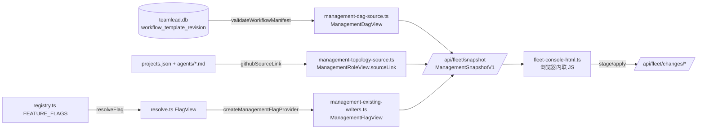

# FLY-2257 管理台 UX 落地 — 调研

Issue: FLY-2257 (https://linear.app/geoforge3d/issue/FLY-2257/管理台ux-fly-2071-实现-dag模板统一框尺寸花名册sourcelink链接删项目面板flag语义化删governance)
日期: 2026-09-03
基于: exploration.md

## 1. 数据从哪来、到哪去(现状链路)

每一层的关键事实:

| 层 | 文件 | 现状 | 本单要动 |
|---|---|---|---|
| manifest | `workflow-template.ts` | `WorkflowManifestNode{id,label?,type,execution?}`,`WorkflowManifestLoop{id,from,to,max_iterations?}`;`type ∈ design/implement/qa/gate/land/generic/review` | 不动 |
| DAG 投影 | `management-dag-source.ts` `projectDag()` | `nodes` 过滤掉 `gate` 与 `execution==="engine"`;只带 `id/nodeId/name/dispatch` | **加 `graph`**(全部节点 + type + loops) |
| 角色 | `management-topology-source.ts` `githubSourceLink()` | `https://github.com/<repo>/blob/main/<encoded agent_file>`;路径不安全 ⇒ `null + error` | 不动 |
| flag 视图 | `resolve.ts` `resolveFlag()` | 拷贝 `category/description/valueKind/default/…`,**没拷 `polarity`** | 加 `polarity`、`onMeans` 透传 |
| 管理台 flag | `management-existing-writers.ts` | `ManagementFlagView{id,name,description,category,global,projectOverrides}` | 去 `category`,加 `polarity/default/valueKind/onMeans` |
| 页面 | `fleet-console-html.ts` | `renderRoles` / `renderDagPanel` / `renderFlags` | 三个渲染函数换成定义文档的形态 |

## 2. 参考实现里哪些能直接搬、哪些不能

来源:分支 `flywheel-FLY-2071` @ `c79090583`,文件 `packages/teamlead/src/bridge/console-next-html.ts`。

| 原型片段 | 行号(原型) | 结论 |
|---|---|---|
| CSS:`.dag-chip*` `.lay*` `.ic*` `.seg*` `.squad*` `.lay-note` `.flag-sum` `.flag-legend` `.flag-head` `.flag-read*` `.lock-chip` `.ov-*` `.why-tip` | 100–205 | **搬**,去掉 `.lay-v1` / `.ic-strip`(V1 已废)与 `.prow/.pn/.pc`(项目面板已删) |
| `sideOf()` 分类 | 356–366 | **搬**,但改成读 `dag.graph.nodes[].type`,并把类型名单提成常量 `ENG_NODE_TYPES` 与 `layNote()` 共用 |
| `tplShape()` | 565–590 | **搬**,改读 `dag.graph`;去掉 `m.roster[x.role]`(schema 2 无 role,原型自己也承认恒为 undefined) |
| `maxChainLen` / `nodeMetrics` / `dagGraph` | 597–660 | **搬**,`nodeMetrics` 拆成纯函数进 `MANAGEMENT_CONSOLE_STATE_JS` 便于单测 |
| `roleHref` / `icCard` / `rosterBox` | 663–690 | **搬** |
| `columns` / `splitByKind` / `squadCard` | 691–730 | **搬**,`squadCard` **补回**每节点 `dag-row + modelControl` 行(见 exploration 2.3) |
| `renderDagLayout(v2)` | 731–740 | **搬** v2 分支,删 v1 分支与 `layoutMode()` |
| `renderDetail` 里的一次性重排钩子 + `resize` 监听 | 836–850, 1096–1106 | **搬**,去掉 `layoutMode()!=="current"` 守卫 |
| `flagReading()` | 878–905 | **搬**,`isKill=/_disabled$/` 换成 `flag.onMeans==="disables"`;`meta` 改读 `flag.polarity/default/valueKind`;拆成纯函数进 STATE_JS |
| `renderFlags()` 单列表 + lock 图例 + 覆盖折叠 | 906–960 | **搬** |
| `/api/console-next/*` 两个 fetch、`loadTemplates` / `loadFlagMeta` | 343–353 | **不搬**(数据并进 snapshot) |
| `getConsoleNextHtml(layout)`、`/console-next` 路由、`plugin.ts` 两个新路由 | 1141–1155 + plugin.ts | **不搬** |
| `renderRoles()` 角色卡网格 | 452–465 | **删**(被花名册替代;链接逻辑已在 `icCard`) |
| `bindTag()` 模板绑定小标 | 507–512 | 可选;不属于四个区,默认**不搬** |

## 3. 「打开代表什么」三种做法比较

| 方案 | 前端要猜吗 | 新反向 flag 命名不带 `_disabled` 时 | 改动面 |
|---|---|---|---|
| A 原型:`/_disabled$/` 启发式 | 要 | **读反且不报错**(定义文档 4.4 明说的风险) | 0 |
| B registry 加自由文本 `whenOn: string` | 不猜 | 作者必须写;但「关」的一句还要再写一句或前端推 | 21 条各写 1–2 句 |
| C registry 加结构字段 `onMeans: "enables" \| "disables"` + 4 句模板 | 不猜 | 作者必须填;守卫测试 `_disabled ⇒ disables` 兜底 | 21 条各加 1 行;7 句模板一处 |

**选 C**。定义文档给了 7 句现成文案(可照抄),它们只依赖 {是不是停用开关, polarity, 当前值, 默认值} 四个量,
C 的结构字段恰好补上第一个量;自由文本(B)反而让 21 条文案分散到 21 处。
非 bool flag(3 个:`summary_absorption_cadence_ms` / `node_dwell_threshold_hours` / `skill_framework_mode`)不填 `onMeans`,
注册表测试断言「bool 必填、非 bool 不填」。

现有 21 条的取值(按 registry 逐条核):`cmux_watcher_rebuild_disabled`、`cmux_rebind_disabled` ⇒ `disables`;
其余 16 个 bool ⇒ `enables`;3 个非 bool 不填。

## 4. `governance_gate` 删除的连锁(逐文件)

| 文件 | 改法 |
|---|---|
| `packages/config/src/feature-flags/registry.ts` | `FlagCategory = "feature" \| "kill_switch"`;头注释去掉「governance-gate hard exemptions」那句,改指 runbook 新规矩 |
| `store-policy.ts` L163 | 删 `governance_gate` 资格分支(`project_scope` / `not_store_managed` 两条保留) |
| `store-policy.ts` L271 | project-store 作者校验去掉 `spec.category === "governance_gate"` 条件,报错文案去掉 non-governance |
| `direct-toggle.ts` L43 | 删 `metadata.category !== "governance_gate"` |
| `resolve.ts` | `FlagView.category` 类型随 `FlagCategory` 收窄,无代码改动 |
| `feature-flag-render.ts` | `categoryLabel` / `categoryDefinition` / `categoryClass` / `renderFlagCard` 删 governance 分支;`renderCategoryLegend` 两张卡;`effectSentence` 删治理门句 |
| `management-existing-writers.ts` L247 | 删 `governance flag is readonly` 分支 |
| 测试 | `feature-flags-registry.test.ts`「governance gates are ALWAYS readonly」整条删、L201 断言删;`feature-flags-store-policy.test.ts` L253 表项删、L297「self-exempt」整条删、L503「keeps retired governance env flags out」整条删;`feature-flags-direct-toggle.test.ts` L120 表项改;`feature-flag-render.test.ts` L56–60 / L221 用例改 |
| `doc/engineer/implementation/flag-authoring-runbook.md` | 新增小节:**治理性策略不做成 flag,写死在代码里,要改走 PR** |

⚠️ 上表里有 3 条测试是「防止有人用 `governance_gate` 自我豁免」—— 类型一删它们**在类型层就不可能发生**,所以删测试不是降低守卫,是守卫上移到了编译器。

## 5. 现有测试地基(实现时要跟着动的)

| 测试文件 | 环境 | 会受影响的断言 |
|---|---|---|
| `fleet-console-html.test.ts` | node | 「只用 aggregate read 端点」(保持);「DAG 模板」字样(保持);单 `<script>` 语法可 `Function()`(保持);禁词表(保持) |
| `management-console-dom.test.ts` | happy-dom | fixture 的 `dags[]` 要补 `graph`,`flags[]` 要补 `polarity/default/valueKind/onMeans`;新增花名册 / 分类 / 语义句用例 |
| `management-console-ui-contract.test.ts` | node(直接 `eval` STATE_JS) | 新增 `nodeMetrics` 与 `flagReading` 纯函数用例 |
| `management-console-visual-regression.test.ts` | node | 引用 FLY-2054 `capture.mjs`,不受影响;本单的真浏览器证据另起 harness(见 plan) |
| `management-console-contract.test.ts` / `-snapshot.test.ts` | node | flag fixture 去 `category` 加新字段 |
| `feature-flag-render.test.ts` 等 4 个 config 测试 | node | 见 §4 |

环境注意:本 worktree 没有 `node_modules`;实现节点先 `pnpm install --frozen-lockfile`(或 `--offline`),
测试命令 `pnpm --filter flywheel-teamlead test -- <文件>`、`pnpm --filter flywheel-config test`。

## 6. 真浏览器证据怎么做(给 QA 节点的尺子)

复用 FLY-2054 的做法(`engineering/doc/FLY-2054-dashboard-visual-alignment/evidence/harness.mjs` 起 loopback 页 + 内存 fixture,
`capture.mjs` 用 CDP 驱动 Chrome),本单新写 `evidence/harness.mjs` + `evidence/capture.mjs`,fixture 含:
产品 3 张卡(3 节点)+ 工程 2 张卡(5 / 4 节点)、一个 `sourceLink=null` 的角色、21 个 flag 里含 2 个 `disables`、3 个非 bool。

按定义文档 §5.2 / §5.3 与 process-log §13–18 的尺子:

1. **冷路径**:每档宽度(1024 / 1280 / 1440)**新开**一个 tab 直接落到目标宽度,页面里 `window.addEventListener("resize")` 前置一个计数器,报告 `resizeCount`;要求 0。
2. **跨 tab 取样**:每档宽度下分别点产品 / 工程,收集全部 `.dag-chip` 的 `getBoundingClientRect()` 宽高 ⇒ 集合大小必须为 1。
3. **不裁切**:每个 `.dag-scroll` `scrollWidth <= clientWidth`;每个 `.dag-chip` 的 right ≤ 所属 `.squad` 的 right(容差 1px)。
4. **最坏偏差**:fixture 里再加一张 8 节点的卡,断言它换行(`rows>1`)而 NW 仍等于其它卡。
5. **链接**:`a.ic-link[href]` 与 fixture `sourceLink` 逐字相等;`sourceLink=null` 的那项没有 `href` 且带说明 `title`。
6. **flag 值零变化**(生产验法,不是 fixture):`curl /api/fleet/snapshot | node -e '投影 name→current(+overrides)'` 改前改后 diff 为空。

## 7. 风险与取舍

- **搬 CSS/JS 约 300 行进生产页**:不是新机制,是把已被 founder 看过的形态搬回来;风险在于漏掉写路径(已列 D6)与漏掉 `esc()`(所有后端字符串仍走 `esc()`;`sourceLink` 只在 `https://github.com/` 前缀通过时进 `href`)。
- **snapshot 合同加字段**:`ManagementSnapshotV1` 的 `schemaVersion` 是否要升?加可选字段不破坏旧读者;`category` 删除会破坏读它的人 —— 已核只有页面与 fixture 读,页面同 PR 改。
- **`onMeans` 加到 registry**:21 条各加一行;registry 的 digest(`flags:<sha>`)会变 ⇒ snapshot 的 `source.revision` 变,这是**元数据**变化,值不变;验法 §6.6 只比值。
