# FLY-2259 Raya 脑迁入受管常驻体制 — 探索
Issue: FLY-2259 (https://linear.app/geoforge3d/issue/FLY-2259/cutoverraya-raya-脑迁入受管常驻体制-补三样激活前提注册工作区summary样本pr激活新脑活了再退旧脑2239-的)
日期: 2026-09-02
基于: 无

> 成色标记:✅ founder/Lead 已拍 · 【实核】本机读码/实测(命令见 research.md)· ⬜ 工程判断 · ❓ 待 Lead/founder 裁。

## 1. 这单到底要交付什么

FLY-2239 把「所有 Codex Lead 迁入 FLY-2216 的名册驱动常驻体制」切成两半:mufasa 半段已在 2026-09-02 16:00 PT 的全舰重启里完成(`growth/mufasa-lead` 与 `flywheel/codex-infra-bot-lead` 都已 `codexResidencyPatrol:true`,heartbeat 在跑)。本单是 raya 半段。

raya 与 mufasa 形状不同:mufasa 的 launchd job 早就在跑,cutover 只是翻名册;raya 的 job `com.flywheel.lead.raya-raya` **从未出生过**,而它的出生被 FLY-2131 的激活门 `raya-activation-preflight.sh`(fail-closed)挡着。所以本单的真实交付 = **一次有界的生产激活窗口 + 它的前提物料 + 激活后的真机验收**,而不是新机制。代码层零改动(边界:不改 2216 机制)。

## 2. 现状实核(2026-09-02 20:10 PT 本机)

| 对象 | 实核结果 | 含义 |
|---|---|---|
| `~/.flywheel/projects.json` | 无 `raya` 项目行;mufasa/infra-bot 已 opt-in | 前提 ① 缺 |
| `~/Dev/raya-lead-workspace` | 不存在 | 前提 ② 缺;launcher 与 preflight 都硬查 `state/` + `memory/MEMORY.md` |
| `xrliAnnie/raya` 的 `summaries/` | 只有 `README.md`;14 张 PR 里零张 summary PR | 前提 ③ 缺;preflight 强制 `RAYA_SUMMARY_FIXTURE_PR` 指向一张合规 PR(open 或 merged 均可) |
| `~/.flywheel/raya/codex-home/packages/standalone/current/codex` | **不存在** | 隐藏前提 ④:TUI/daemon 后端要求 standalone codex,`ensure-home` fail-loud 且不自动装(mufasa/infra-bot 在 0.153.0-aarch64) |
| 注册 raya 行后的 `summaryAssignmentDigest` | 实测由 `b4be7ea6…` 变为 `643403c6…`,`verify-activation` 报 `summary_registry_projection_mismatch` | 隐藏前提 ⑤:`restart-services.sh` 第 1827 行据此 fail-closed;注册必须与 `migrate-summary-registry.sh` 刷新回执同事务,否则下一班车被挡 |
| ProjectConfig 校验 | 候选行按 FLY-2131 检查单 B 原样注册被拒:`leads[0].match: must be an object with labels[]` | 检查单 B 漏了 `match`;需补一个不与 Linear 现有 69 个标签冲突的占位标签 |
| `com.xrli.raya.brain`(pid 20817,8-31 17:43 起) | 是 **语音/会议网关 + 资源采样器**:discord.js 网关监听 `/voice`、`/endvoice`、「进入/退出语音模式」→ `launchctl kickstart` 语音 job;会议命令(现因 `RAYA_MEETING_SHARED_CHANNEL_ID` 未配置而停用);60 秒资源采样;`voice_down/voice_recovered` 告警。**零自然语言回复逻辑** | 「退旧脑」的字面对象不是聊天脑(见 §4) |
| Raya 文本聊天进程 | 本机 **没有任何**在跑的 Raya Codex 对话进程(ps / tmux 均无);`bin-raya-watch.sh` 只是 tail 最新 rollout 的观察窗 | 新 Lead 上线后不存在「双脑」;当前 #raya 文本面实际是空的 |
| `~/.flywheel/raya/codex-home/config.toml` | 只含 148 条 `[projects.*]` 信任表;被 `com.xrli.raya.voice` 的 CodexLeg 共用 | launcher 的 `ensure-home` 会整体重写它(见 §5) |
| `~/.flywheel/raya/memory` | 是 `raya-memory` 的 canonical checkout,分支 `fly-2029-raya-v1-foundation`(远端 main 只有 README);干净 | 前提 ② 的 memory 来源就是它:整体移动,不开二克隆(FLY-2131 R1 决定) |
| `~/.flywheel/state/host-tmux/` | 有 `codex-mufasa.json`、`codex-infra-bot.json`,无 `codex-raya.json` | 无妨:wrapper 先 `gate codex-raya` 写回执再 `verify`,首启自足 |
| Bridge | `findResidentCodexLeadTargets(projects)` 与 summary-absorption rider 的 `resolveRaya(projects)` 都在插件构造时读一次名册 | 注册后 **必须一次 Bridge 重启**(00:00/12:00 班车或 founder 单次授权票)patrol/巡视触发才覆盖 raya;job 本身的出生不依赖 Bridge |
| 告警路由 | `.env` 已设 `FLYWHEEL_UNIFIED_ALERT_CHANNEL_ID=1518793447165661254`(#flywheel-alerts);shell 与 TS 两条链在统一模式下都不看 `alertChannel` | raya 行不需要 `alertChannel`;`tui_window_lost` 与 `codex_lead_residency_stalled` 都能到达 |

## 3. 激活序(FLY-2131 D + FLY-2216 Batch A 的 operator 序,本单只是把它排成一次窗口)

```mermaid
flowchart LR
  P0["前提物料<br/>①名册行 ②工作区 ③summary PR<br/>④standalone codex ⑤回执刷新"] --> P1["preflight<br/>raya-activation-preflight.sh<br/>只读 fail-closed"]
  P1 --> P2["converge<br/>converge-flywheel-bin.sh<br/>装 wrapper + recover 到 state/bin"]
  P2 --> P3["plist<br/>copy + plutil -lint<br/>templates/com.flywheel.lead.raya-raya.tui.plist"]
  P3 --> P4["launchd 拉起<br/>exact label com.flywheel.lead.raya-raya"]
  P4 --> P5["新脑活了<br/>pane raya-raya + heartbeat.json<br/>+ gateway_poll_ok"]
  P5 --> P6["Bridge 班车重启<br/>patrol 覆盖 raya"]
  P6 --> P7["真机验收<br/>SIGSTOP 假死→告警→自愈<br/>pane 关→重建"]
  P7 --> P8["退应急面<br/>(产品 job 不动,见 §4)"]
```

每一步都是既有脚本,本单不新增脚本;窗口里的每一步都要有可留档的证据(命令输出、文件 digest、Discord 消息链接)。

## 4. 「退旧脑」的对象问题(❓ 已 ask Lead,question 466d7262)

issue 与 Tadashi 的派工令都把 `com.xrli.raya.brain` 当「旧脑」。实核它是语音/会议网关(§2),没有文本聊天功能;FLY-2216 exploration §6 假设 2 也明写「`com.xrli.raya.brain` 继续负责 voice/meeting 产品面;本单的『Raya 脑常驻』指新注册的 canonical Codex Lead conversation runtime」,该假设随 FLY-2216 设计评审一起通过。

按字面退掉它的后果:founder 失去语音模式入口(`/voice` 与文本触发都在它里面)、会议命令、`voice_down` 告警 —— 这是 raya 产品行为变更,与本单边界「raya 产品行为零改」直接冲突。

两个方向:

- **A(建议)**:「退旧脑」= 退应急面(`bin-raya-watch.sh` 观察窗、任何手拉的 Raya codex 会话);`com.xrli.raya.brain` 原样保留,它与新 Lead 是「网关 vs 对话」两层,不是双脑。唯一重叠:文本触发语「进入语音模式」两边都能看到——网关拉起语音,新 Lead 可能同时用文字回一句。`/voice` 斜杠命令是 interaction,新 Lead 的 REST poll 看不到,零重叠。记为已知边界,不为此加机制。
- **B**:仍退产品 job。需 founder 明确接受语音入口丢失,并另立 raya 侧单把语音入口再宿主到新 Lead(IDENTITY.md + `launchctl` 权限),不在本单。

plan 按 A 写;若 Lead/founder 裁 B,plan 的「退」步骤替换为「退产品 job + 明记功能丢失」并加 founder 在场门。

## 5. 共享 CODEX_HOME 的 config.toml 重写(❓ 同一 ask)

launcher 非 dry-run 会跑 `codex-lead-tui-home.sh ensure-home`;full-access 分支 `write_full_access_config` 把 `~/.flywheel/raya/codex-home/config.toml` **整体重写**(`sandbox_mode=workspace-write`、`approval_policy=never`、`network_access=true`、`writable_roots=[<workspace>]`,只保留 trusted `[projects.*]`),再追加 `[mcp_servers.lead_actions]`。同一 CODEX_HOME 被 `com.xrli.raya.voice` 的 CodexLeg 共用,而它的 `thread/start` 只传 `cwd + writableRoots`、不 pin sandbox/MCP ⇒ 语音 Codex 线程会继承新 sandbox/approval,并在工具列表里看到 `lead_actions`(其 env 无 `DISCORD_BOT_TOKEN`,调用会失败)。

FLY-2131 plan §2.10 写「不动 CODEX_HOME」,机制上做不到——它只是没重写 auth/sessions,config.toml 一定会被重写。

- **保持共享 home(建议)**:2131/2216 已审形状,不改 2216 机制。激活前 `cp -p` 备份 config.toml,激活后 `diff` 留证,再做一次语音冒烟(founder 一次 `/voice` 或 FLY-2126 harness),把「语音线程多出 `lead_actions` 工具」记为诚实边界,另立 raya 侧小单(voice `thread/start` 显式关 MCP / pin sandbox)。
- **分 home**:给 Lead 独立 CODEX_HOME。要改 launcher 默认值、`resident-codex-lead-recover.sh` 的 `EXPECTED_CODEX_HOME` 映射与 carrier 测试(= 改 2216 机制),还要第二次 `codex login`(refresh token 不能两 home 共用,复制 auth.json 会互相作废)。本单否决,除非 Lead 反向裁定。

## 6. 三样前提的「来源」决定

- **① 名册行**:FLY-2131 检查单 B 的 JSON + `codexResidencyPatrol:true` + `match.labels`(占位 `raya-lead`,Linear 现有 69 个标签里无此名 ⇒ 永不路由;`canSpawnRunners:false` 本来也派不了工)。写入必须走 `flywheel-config-lock.sh` 持锁 + 原子替换,并同事务跑 `migrate-summary-registry.sh` 刷新回执(§2 ⑤)。
- **② 工作区**:`~/Dev/raya-lead-workspace/{state,memory}`,memory = 整体 `mv ~/.flywheel/raya/memory`;同事务改 `raya.env` 两处(`RAYA_MEMORY_FILE`、`RAYA_WORKSPACE_ROOTS_JSON` 的 memory 根)——brain `parseConfig` 会 `realpathSync.native` 每个 root、缺目录即拒起(config.ts:63-72),只改一处 = 产品 job 下次重启即挂。这是本单唯一一处碰 raya 产品配置的动作,按 founder 派工令 ④ 先在 thread 报一句、等她在场。改完 `launchctl kickstart -k` 产品 job 让新路径生效(它 KeepAlive.Crashed=true,不重启不会自己读新配置)。⬜ 曾考虑用 `~/.flywheel/raya/memory → ~/Dev/raya-lead-workspace/memory` 符号链接免改 raya.env:未选——brain 的 realpath 会把 root 解析到 `~/Dev` 下,等于隐性改了产品 root 却没有人看见,且 path-hygiene 扫描会把跨根符号链接当异常。
- **③ summary PR**:必须是真 summary,不是假 fixture。由有 summary duty 的 Lead(Tadashi,`flywheel/flywheel-eng-lead`,`summaryRole=producer`,粒度 per-lead)在自己的 Lead 会话里写 `Facts + Judgment` 后跑 `flywheel-comm summary --file <md> --project flywheel --period <start>/<end>`,命令自己开 PR 到 `summaries/flywheel/<date>--flywheel-eng-lead--01.md`。Judgment 必须由 Lead 本人写(summary-inflow.md 合同),design/implement 节点不得代笔。PR 保持 open 即可满足 preflight;它同时就是 Raya 上线后第一轮吸收的真实未读队列。
- **④ standalone codex**:`CODEX_HOME=~/.flywheel/raya/codex-home CODEX_INSTALL_DIR=~/.flywheel/raya/codex-home/.local/bin sh -c 'curl -fsSL https://chatgpt.com/codex/install.sh | sh'`,装完检查全局 `~/.local/bin/codex` 未被改指(现指向 mufasa home 的 0.153.0,是既有 FLY-513 已知形状,本单不碰)。
- **⑤ 回执刷新**:`scripts/migrate-summary-registry.sh <projects.json> <assignments.json> <receipt> <expected-sha256>`,assignments 清单 = 现回执的 16 条 + `raya/raya=recipient`。

## 7. 「新脑活了」与「自愈真机验证」的判据

- **活了** = 三件同时成立:`launchctl print gui/$(id -u)/com.flywheel.lead.raya-raya` 有唯一 pid;tmux `flywheel:raya-raya` 窗口里是真 `codex resume --remote`;`~/.flywheel/state/codex-lead/raya/brain/heartbeat.json` 出现 `state=online` 且 `lastGatewayPollStatus=ok` 持续推进。再加一条 founder 在 #raya 发消息、Raya 回复(REST poll 首启 baseline 到最新消息,不会回放历史)。
- **自愈真机**(需 Bridge 重启后 patrol 覆盖 raya):对 exact pid `kill -STOP`(可逆,`kill -CONT` 随时中止)→ heartbeat 停更 → patrol 归类 `poll_loop_stalled/heartbeat_stalled` → 连败阈值 3 × 60s → `codex_lead_residency_stalled` 到 #flywheel-alerts → helper 写 pre-mutation 回执 → bounded `kickstart -k` → 新 pid + 新 generation heartbeat → `recovery-receipts.jsonl` 有行。全程 helper 调用日志零 `com.xrli.raya.brain`。⬜ 选 SIGSTOP 不选 kill:kill 会被 launchd KeepAlive 直接拉回,patrol 看不到「假死」;SIGSTOP 才是 2216 要治的那种活体假死。
- **pane 告警对齐**:`tui-window-alert.ts` 的 allowlist 已含 `(raya,raya)`,launcher 已 `export FLYWHEEL_ROOT` ⇒ 首启日志应出现 guard armed。真机只验「关窗 → 20s 内重建」;不在生产上故意让重建失败去逼告警(需要拆 tmux server),告警投递由 FLY-2216 hermetic 测试 + 本单 armed 证据覆盖,如实记录。

## 8. 否决的方向

| 方向 | 否决理由 |
|---|---|
| 写一个 `raya-activate.sh` 把五步串起来 | 「只删不加」;五步各有 fail-closed 门,串起来反而把人从判断里赶走;窗口就跑五次,手工留证 |
| 给 raya 行加 `alertChannel` 指 #raya | 统一告警通道已生效,加了也不读;把 infra 告警发进 founder 的 #raya 是噪音 |
| 用 fixture/伪造 summary PR 过 preflight | 它会成为 Raya 第一轮真实吸收的输入;假内容会进 MEMORY.md |
| 在 raya 仓改 IDENTITY.md 处理触发语重叠 | raya 产品行为零改;重叠本身只有「多回一句话」的代价 |
| 拆掉 `com.xrli.raya.brain` 让新 Lead 接管语音入口 | 产品变更,另立单 |
| 跳过 Bridge 重启、只靠 job 出生就宣布「受管」 | patrol 目标列表在插件构造时固定;不重启 = 没人巡视,正是 2216 的病案形状 |

## 9. 待 Lead / founder 裁定(非阻塞,已 ask)

1. 「退旧脑」取 A(保留产品 job,退应急面)还是 B。
2. CODEX_HOME 保持共享(+ config.toml 备份/diff/语音冒烟)还是分 home。
3. InfraBot 纳入决策的 founder 原话与消息链接(2239 遗留验收项;registry 已 `codexResidencyPatrol:true`,Tadashi 9-2 台账有「InfraBot 纳入+拆 R3」转述)。
4. 窗口时机与 founder 在场(派工令 ④):动 raya.env / 产品 job 那一步必须她在场。

## 10. Lead 交接令补记(2026-09-03,重起设计体接续)

- founder 06:44Z 原话「有个重点 我希望不是为raya专门写一套 而是每个codex lead都是generic的」⇒ §5 的「分 home」不再是 raya 专属的两个常量,而是全部 Codex Lead 共用的一条派生规则(`~/.codex-<key>`,单一来源在 `scripts/lib/lead-address.sh`),raya 只是首个套用的配置;详见 research §2、plan §2.1。
- 顺带实核:`~/.flywheel/bin/resident-codex-lead-recover.sh` 因 state-bin `lib/` 缺 `lead-restart-lifecycle.sh` 恒 rc=10;patrol 用的是仓库路径。runbook 全部改用仓库路径;缺口属 FLY-2216,本单只记录。
- 否决表补一行:「为 raya 单独改两个常量」——否决,理由同上(founder 原话)。
