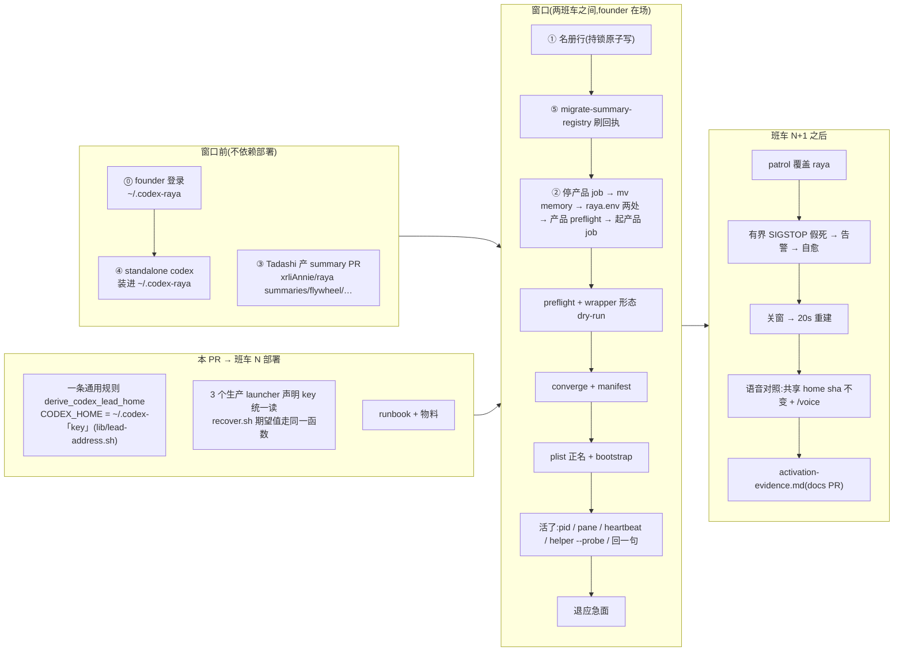
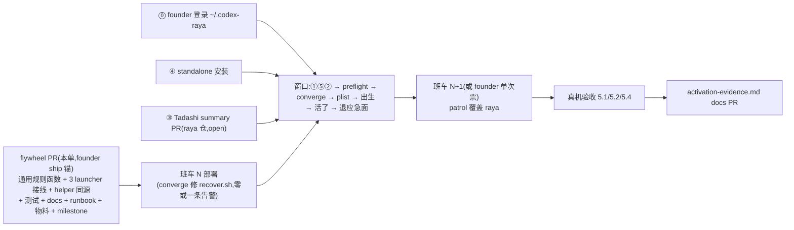

# FLY-2259 Raya 脑迁入受管常驻体制 — 实施计划
Issue: FLY-2259 (https://linear.app/geoforge3d/issue/FLY-2259/cutoverraya-raya-脑迁入受管常驻体制-补三样激活前提注册工作区summary样本pr激活新脑活了再退旧脑2239-的)
日期: 2026-09-02
基于: research.md

> 成色标记:✅ founder/Lead 已拍 · 【实核】本机读码/实测(命令在 research.md)· ⬜ 工程判断。
> ⛔ 本 plan 通过 design review 前不写实现码。

## 0. 目标 · 非目标 · 授权 · 裁定

- **目标**:让 canonical `raya/raya` 以 `com.flywheel.lead.raya-raya` 出生并进入 FLY-2216 的名册驱动常驻体制(常驻 pane、业务心跳、假死自愈、告警可达),交付 = ①一条对**全部 Codex Lead 通用**的独立 CODEX_HOME 派生规则 + 三个生产 launcher 与恢复 helper 同源接线(raya 只是首个套用的配置)②窗口前提物料与逐字 runbook ③窗口内的生产激活与真机验收证据。
- **非目标**:不改 FLY-2216 机制(patrol/observer/helper/告警 kind/wrapper 一律不动);不改 raya 产品行为(`com.xrli.raya.brain` 原样,`~/.flywheel/raya/codex-home` 原样,IDENTITY.md 不动);不做 pane 告警名册化(2239 遗留,本单只记录对齐状态);不清理 FLY-2031 QA 残留 job;不动 raya-memory 的分支形状。
- **授权边界**:实现节点不做任何生产 mutation(不注册、不移 memory、不改 raya.env、不 bootstrap、不重启);生产窗口由 Lead(Tadashi)按 §4 runbook 手工执行,founder 在场(派工令 ④);Bridge 重启只走班车或 founder 单次 `request-restart.sh` 票;raya 仓 PR(summary PR)merge 是 Raya 自己的 read-receipt 豁免,其它 raya 仓事务归 founder(派工令 ③);本 flywheel PR 是 founder ship 卡的 `__main__` 锚(派工令 ②)。
- **裁定承接(✅ ask 466d7262)**:A(保留产品 job,「退旧脑」= 退应急面)· 分 home(`~/.codex-raya`)· 隐藏前提 ⓪④⑤ 入清单 · 占位标签 `raya-lead`(Linear 无合适真实标签,research §3.1)· InfraBot 原话两条链接(research §0)。
- **通用化承接(✅ founder 2026-09-03 06:44Z 原话「有个重点 我希望不是为raya专门写一套 而是每个codex lead都是generic的」;Lead 交接令 53fa4838 ①)**:机制层不为 raya 单写——CODEX_HOME 的派生规则、helper 的期望值、结构测试,都是全部 Codex Lead 共用的一条规则(§2.1);raya 专有的只剩**配置**(codex home key、plist、wrapper、名册行)与**产品侧一次性迁移物料**(raya.env 两键、memory 搬家)。裁定 A 与分 home 已五轮 Keep,不重议。
- **修正承接(✅ ask 6a8358fb)**:§4.7/§4.10 调恢复 helper 一律用仓库路径 `~/Dev/flywheel/scripts/resident-codex-lead-recover.sh`(patrol 同款);【实核 2026-09-02】state-bin 副本因 `~/.flywheel/bin/lib/` 缺 `lead-restart-lifecycle.sh` 恒 rc=10,属 FLY-2216 既有缺口,只记录不修、不扩其他。

## 1. 架构



稳定身份(全文只用这些名字):launchd label `com.flywheel.lead.raya-raya` · **plist 安装路径 `~/Library/LaunchAgents/com.flywheel.lead.raya-raya.plist`**(模板文件名带 `.tui`,安装时正名;helper 与 restart 采集都按 `com.flywheel.lead.<key>.plist` 定位)· manifest `~/.flywheel/manifests/raya-raya.json` · tmux `flywheel:raya-raya` · cmux `cmux-raya-raya` · lead key `raya-raya` · CODEX_HOME `~/.codex-raya`(通用规则 `~/.codex-<key>` 在 key=`raya` 的实例)· codex home key `raya` · workspace `~/Dev/raya-lead-workspace` · 状态目录 `~/.flywheel/state/codex-lead/raya` · 告警:脑 stall = `codex_lead_residency_stalled@machine/codex-lead-residency`,pane = `tui_window_lost`(标题「Raya brain」),都投 #flywheel-alerts(统一通道)· 产品 job `com.xrli.raya.brain`(不动)。

## 2. 工作分解

### 2.1 代码:所有 Codex Lead 通用的独立 CODEX_HOME 规则(唯一代码改动;TDD)

✅ founder 06:44Z:「不是为 raya 专门写一套,而是每个 codex lead 都是 generic 的」。【实核】现状:三个生产 Codex Lead 的 launcher 各写一个字面量(`run-codex-lead-mufasa-tui-fullaccess.sh:65` `~/.codex-mufasa`、`run-codex-infra-bot-tui.sh:67` `~/.codex-infra-bot`、`run-codex-lead-raya-tui-fullaccess.sh:32` `~/.flywheel/raya/codex-home`),helper `scripts/resident-codex-lead-recover.sh:91-101` 另有一张 wrapper→home 字面量表;三个 launcher 都已 `. "${TEAMLEAD_ROOT}/scripts/lib/canonical-lead-identity.sh"`,raya(:10)与 infra-bot(:49-50)已导出 `FLYWHEEL_ROOT`,mufasa 未导出;`scripts/lib/lead-address.sh` 已是「每 Lead 确定性寻址」的共享库(`derive_lead_socket`),在 converge `FILES` 闭包(`converge-flywheel-bin.sh:81`)、`package-onboard.sh` 白名单与 `packaged-seams`/`converge-flywheel-bin` 测试里,state-bin `~/.flywheel/bin/lib/lead-address.sh` 已存在。

**规则(唯一来源)**:`derive_codex_lead_home <codex-home-key> [home-root]` → 打印 `<home-root>/.codex-<key>`,放进 `scripts/lib/lead-address.sh`(与 `derive_lead_socket` 同风格:纯函数、不读 registry/环境;key 必须匹配 `^[a-z][a-z0-9-]{0,31}$`、home-root 缺省 `$HOME` 且必须是绝对路径,否则 rc 2 + stderr 一句话,stdout 空)。**所有生产 Codex Lead launcher 只声明自己的 key 再统一读规则;helper 的 wrapper 允许表只保留 wrapper→key,期望 home 由同一函数算出。** raya 的 key = `raya`(= leadId);mufasa/infra-bot 的 key = `mufasa`/`infra-bot`,算出的路径与今天字节相同——两位活体 Lead 零行为变化,由测试断言而不是口头保证。

⬜ 规则的输入为什么是「key」而不是 registry `agentId`:`growth/mufasa-lead` 与 `flywheel/codex-infra-bot-lead` 的既有 home 是 `~/.codex-mufasa`、`~/.codex-infra-bot`(【实核】`ls -d ~/.codex-*`),严格按 agentId 派生要搬两位在跑 Lead 的凭证目录——生产 mutation,越出本单授权。约定:**新 Lead 的 key = leadId**(raya 即如此),两位存量 Lead 的 key 是历史配置。若 Lead 要求严格 leadId,是另一张 fleet 单(搬两个 home + 改两处 key)。

RED → GREEN → REFACTOR:

1. **RED**(先写,先看红):
   - 新增 `scripts/__tests__/codex-lead-home-rule.test.sh`——对**整个生产 Codex Lead 集合**的通用结构测试,不是对 raya:
     (a) 单元:`derive_codex_lead_home raya /h` = `/h/.codex-raya`、`derive_codex_lead_home mufasa /h` = `/h/.codex-mufasa`、`derive_codex_lead_home infra-bot /h` = `/h/.codex-infra-bot`;非法 key(`Raya`、`raya/x`、空)与相对 home-root 都 rc≠0 且 stdout 空;
     (b) 对固定集合 {`run-codex-lead-mufasa-tui-fullaccess.sh`, `run-codex-infra-bot-tui.sh`, `run-codex-lead-raya-tui-fullaccess.sh`} 逐个断言源码:恰一行 `export FLYWHEEL_CODEX_LEAD_HOME_KEY=<key>`、`CODEX_HOME` 默认经 `derive_codex_lead_home "$FLYWHEEL_CODEX_LEAD_HOME_KEY"` 取得、全文不含 `CODEX_HOME:-${HOME}/` 字面量默认、不含 `raya/codex-home`;
     (c) helper 源里三个 wrapper 行各自的 `codex_home_key=<key>` 与对应 launcher 的 key 相等,helper 含 `derive_codex_lead_home` 且不再含任何 `.codex-` 字面量。
     改前:(a) 函数不存在红;(b)(c) 三个 launcher 与 helper 都是字面量,红。
   - `scripts/__tests__/resident-codex-lead-recover.test.sh`:raya fixture 的 codex home 改为 `$t/home/.codex-raya`,`--probe` 断言精确为 `.codexHome == $T/home/.codex-raya`;mufasa 格保持 `$T_MUFASA/home/.codex-mufasa`(它证明规则复现存量路径);**新增负例**(用既有 `CODEX_RESIDENCY_FAKE_CODEX_HOME` seam):进程 env 里 `CODEX_HOME=$t/home/.flywheel/raya/codex-home`(旧共享 home)⇒ `--probe` 与 `--recover` **都** rc=21;fake launchctl 调用记录**只含**只读 `print`(取 pid 是证据采集,必然发生),**零** `kickstart`、零 bounded-run 调用、零 `recovery-receipts.jsonl`。改前:raya probe 断言红、负例红(现映射就是旧 home,rc=0/进入 mutation 路径)。
   - `packages/teamlead/scripts/__tests__/raya-activation-preflight.test.sh`:新增一格结构断言——raya launcher 用 `FLYWHEEL_CODEX_LEAD_HOME_KEY=raya` + `derive_codex_lead_home` 取默认 home,全文不再含 `raya/codex-home`;改前红。
   - 三份 launcher 直跑测试:raya 的 fixture 已是仓库形(`REPO=$T/repo; RT=$REPO/packages/teamlead`,`TEAMLEAD_ROOT/../..` 落在 `$REPO`),只加一行 `ln -s <repo>/scripts/lib/lead-address.sh $REPO/scripts/lib/lead-address.sh`;**mufasa/infra-bot 两份的假根是 `$T/teamlead`,`../..` 落到 `$T` 的父目录,链放在 fixture 里够不着**(Codex R6-3)——所以先把两份 fixture 改成与 raya 同形(`REPO=$T/repo; RT=$REPO/packages/teamlead`,假 `flywheel-comm/dist` 随之搬到 `$REPO/packages/flywheel-comm/dist`),再加同一行链;三份测试的 ambient scrub 都补 `unset CODEX_HOME FLYWHEEL_CODEX_BIN FLYWHEEL_CODEX_LEAD_HOME_KEY`(launcher 有意保留这三者的覆盖,不 scrub 则默认值断言不 hermetic——评审环境就带着 ambient `CODEX_HOME`);mufasa/infra-bot 两份各加一格断言 envdump 里 `CODEX_HOME` 精确等于 `$HOME/.codex-mufasa`/`$HOME/.codex-infra-bot`(回归护栏:改前也绿,它证的是「接线后字节不变」),可选再加一格「显式 `CODEX_HOME=<x>` 注入仍被保留」。
2. **GREEN**:
   - `scripts/lib/lead-address.sh`:加 `derive_codex_lead_home`;
   - 三个生产 launcher:mufasa 先补 `export FLYWHEEL_ROOT="$(cd "${TEAMLEAD_ROOT}/../.." && pwd)"`(与 raya:10 同形);三者在 `canonical_lead_identity_resolve` 之后 `. "${FLYWHEEL_ROOT}/scripts/lib/lead-address.sh"`,`export FLYWHEEL_CODEX_LEAD_HOME_KEY=<key>`,`export CODEX_HOME="${CODEX_HOME:-$(derive_codex_lead_home "$FLYWHEEL_CODEX_LEAD_HOME_KEY")}"`;`FLYWHEEL_CODEX_BIN` 默认(`$CODEX_HOME/packages/standalone/current/codex`)不变;
   - `scripts/resident-codex-lead-recover.sh`:与 `lead-restart-lifecycle.sh` 同形 `[ -r "$SCRIPT_DIR/lib/lead-address.sh" ] || fail 10 "lead address library is unavailable"` 后 source;`case "$WRAPPER"` 三行改为 `codex_home_key=mufasa` / `infra-bot` / `raya`,esac 后 `EXPECTED_CODEX_HOME="$(derive_codex_lead_home "$codex_home_key" "$HOME_ROOT")" || return 1`。
3. **REFACTOR**:无。⛔ 不从 registry 读 CODEX_HOME、不把 wrapper 允许表换成动态发现——允许表是 helper 的安全边界(wrapper 名 → 唯一合法身份,Codex R1-11),通用化只在「路径形状」这一层。⛔ 不改 `packages/teamlead/src/bridge/__tests__/resident-codex-lead-patrol.test.ts` 的路径字面量(patrol 只透传证据,纯 churn)。⛔ 不改 mufasa 的四个非生产 launcher(`run-codex-lead-mufasa.sh`/`-tui.sh`/`-fullaccess.sh`/`-writecapable.sh`:FLY-398 保留的低层/回滚形态,不在 wrapper→launcher 的生产集合里;`lead-restart-lifecycle.sh:588-591` 也把 `mufasa-tui.sh` 载体列为 retired)——这是**有意的边界**,写进 §6 与 evidence「已知边界」。

不动:三个 wrapper(不引用 home;⬜ 曾按 Codex R1-2 考虑在 raya wrapper 里 pin `CODEX_HOME`/`FLYWHEEL_CODEX_BIN`,未选:那会让 raya 成为唯一 pin 的载体、动一个受 converge/host gate/package 三处闭包管理的文件,而 `~/.flywheel/.env` 与 launchd 环境今天都没有 `CODEX_HOME`(【实核】`grep -c ^CODEX_HOME= .env`=0、`launchctl getenv CODEX_HOME` 为空);改用 §4.0/§4.4 的**有效 home 停止线**:开窗前证明两处无覆盖,并用「wrapper 形态」dry-run 断言 runtime 实际拿到的 `CODEX_HOME` 行 = `~/.codex-raya`)、plist 模板、preflight 脚本(不查 home;preflight 合同是只读 dry-run,home 装配由 `ensure-home` fail-loud 覆盖)、`codex-lead-tui-home.sh`(按 `FLYWHEEL_CODEX_TUI_HOME` 装配,不推导路径)。

聚焦门(顺序固定;先 build 再跑 shell,preflight 测试会 import `packages/teamlead/dist/.../tui-window-alert.js`,无 build 则假红——Codex R1-8):
```bash
pnpm --filter flywheel-teamlead build
bash scripts/__tests__/codex-lead-home-rule.test.sh                          # 新:规则单元 + 三 launcher 结构 + helper key 对齐
bash scripts/__tests__/resident-codex-lead-recover.test.sh                   # 18 → 19 格(含新负例)
bash packages/teamlead/scripts/__tests__/raya-activation-preflight.test.sh   # 6 → 7 格
bash packages/teamlead/scripts/__tests__/run-codex-lead-raya-tui-fullaccess.test.sh
bash packages/teamlead/scripts/__tests__/run-codex-lead-mufasa-tui-fullaccess.test.sh   # 新纳入:接线后 CODEX_HOME 字节不变
bash packages/teamlead/scripts/__tests__/run-codex-infra-bot-tui.test.sh                # 同上
bash scripts/__tests__/raya-resident-carrier.test.sh                         # 12
bash scripts/__tests__/converge-flywheel-bin.test.sh                         # 15(recover.sh 与 lib/lead-address.sh 仍在闭包)
bash scripts/__tests__/packaged-seams.test.sh                                # lib/lead-address.sh 在 package 白名单
```

部署副作用(明文):班车 N 部署后 `converge-flywheel-bin.sh` 会发现两份漂移——`~/.flywheel/bin/resident-codex-lead-recover.sh`(【实核】adoption 标记 `~/.flywheel/state/converge-adoptions/resident-codex-lead-recover.sh` 存在,2026-09-01 ⇒ 走「drift repaired」路径发**一条** `bin_integrity_drift` severe 告警)与 `~/.flywheel/bin/lib/lead-address.sh`(【实核】`converge-adoptions/` 下**无**其标记 ⇒ 静默首次采纳、零告警);合计仍是「零或一条」(Codex R1-9)。runbook 让操作者记录「有则链接、无则 adoption 标记内容」,两者都不是部署前提。mufasa/infra-bot 的 launcher 从 checkout 直跑(wrapper `exec` 仓库路径),两位下次出生(班车重启或 KeepAlive 拉起)用新字节,解析出的 `CODEX_HOME` 与今天相同(测试断言);§4.0 开窗前多一条停止线核两位 heartbeat 仍推进。

### 2.2 物料(随本 PR 进仓,docs)

`engineering/doc/FLY-2259-raya-brain-cutover/` 下新增:
- `activation-runbook.md`:§4 逐字操作手册(`set -euo pipefail`;每步命令、断言、证据落点、停止线与对应回滚层级)。
- `materials/projects.raya-row.json`:research §3.1 的名册行;
- `materials/assignments.json`:现回执 16 条 + `raya/raya=recipient`(research §3.5);
- `materials/register-codex-lead.py <projects.json> <row.json>`:**通用**的名册行持锁原子写脚本(读 → 断言 row 的 `projectName` 不在名册 → append → 同目录 tmp + 保留原 mode + rename);raya 只是传入 `projects.raya-row.json`;只被 `flywheel-config-lock.sh` 调用;
- `materials/edit-raya-env.py`:对 `raya.env` 做**两键各恰一次**的替换(`RAYA_MEMORY_FILE`、`RAYA_WORKSPACE_ROOTS_JSON`),先读全文、断言两键各出现恰一行、写 tmp、保留 0600 + owner、rename;任一断言失败零写。附 `--verify <备份> <现文件>` 模式:断言两文件除这两个键外逐行相同、两键从备份值变为期望值、现文件 mode 600 且 owner 相同;它是 §4.3 的判定谓词(`diff` 只出证据)。
⬜ 这些是**物料不是机制**:没有新 CLI 子命令、没有新守卫,不进 `scripts/`、不进 bin 闭包、不进 CI 枚举;它们只把「手工编辑生产配置」固化成可审、幂等、失败零写的原子写。

### 2.3 前提清单(窗口前必须齐;谁做、怎么证)

| # | 前提 | 谁 | 证据(进 evidence) |
|---|---|---|---|
| ⓪ | **Raya Lead 独立 CODEX_HOME 需要 founder 登一次 Codex**:`~/.codex-raya` 存在(0700)且 `auth.json` 已登录。具体操作(✅ Lead 要求写成可直接转给 founder 的一段):在**生产 Mac(MacBook-Pro,跑 Bridge/全部 Lead 的那台)**她自己的终端里跑 `install -d -m 700 ~/.codex-raya` 与 `CODEX_HOME=~/.codex-raya codex login`(`codex` = PATH 上现有的 `~/.local/bin/codex`;会弹浏览器选账号;账号按「一体一号」由 founder 指定,同一 ChatGPT 账号可在多个 home 各登一次);登完验:`CODEX_HOME=~/.codex-raya codex login status` 打印 `Logged in using ChatGPT`,`stat -f '%Lp %Su' ~/.codex-raya/auth.json` 为 `600 xiaorongli`(【实核】空 home 下 `login status` 只报 `Not logged in`,不撞受管 requirements 的载入错误) | **founder**(Lead 在 plan 出来后申请) | 两条验证命令输出 + 账号别名 + 时间;⛔ 永不复制 `auth.json`(两 home 共用 refresh token 会互相作废) |
| ① | 名册行物料就绪 | implement 节点(物料);Lead 窗口内写入 | 写入后 `lead-identity resolve` JSON 与 research §3.1 逐字段一致 |
| ② | memory checkout 干净、`raya.env` 改法就绪、语音未在会话中 | Lead 窗口内 | `git status --porcelain` 空;raya.env 两行 diff;`com.xrli.raya.voice` `state = not running` 且无 `run/voice.pid` |
| ③ | 一张合规 summary PR(open) | **Tadashi** 在自己会话里写 Facts+Judgment 后跑 `flywheel-comm summary --file … --project flywheel --period …` | PR 号 + `summary verify-pr --pr <n>` 通过 |
| ④ | `~/.codex-raya/packages/standalone/current/codex -V` 与 mufasa/infra-bot 同版 | operator(Lead 或 founder),窗口前任意时间 | 版本输出;`readlink ~/.local/bin/codex` 前后相同;shell profile 无新增 PATH 行 |
| ⑤ | assignments 物料**新鲜**:非 raya 的 16 条 `{project,lead,role}` 与 `projectAggregators` 逐条等于**当下** `migration-receipt.json`,且当下 registry 每个 managed Lead 在物料里恰出现一次 | Lead 窗口开始时(Codex R1-10) | `jq` 对比输出为空;漂移 ⇒ 不开窗,回 PR 重生成物料(⛔ 不现场手改 JSON) |
| ⑥ | 代码已部署:`~/Dev/flywheel` HEAD 含本 PR merge SHA;`grep -F derive_codex_lead_home` 命中 raya launcher 源、`~/Dev/flywheel/scripts/resident-codex-lead-recover.sh` 与 `~/.flywheel/bin/resident-codex-lead-recover.sh`;`cmp ~/Dev/flywheel/scripts/lib/lead-address.sh ~/.flywheel/bin/lib/lead-address.sh` 静默 | 班车 N | `cat ~/.flywheel/deployed-sha`、三条 grep、一条 cmp |
| ⑦ | **有效 home 无覆盖**:`~/.flywheel/.env` 无 `CODEX_HOME=`/`FLYWHEEL_CODEX_BIN=` 行;`launchctl getenv CODEX_HOME` 与 `launchctl getenv FLYWHEEL_CODEX_BIN` 均为空;wrapper 形态 dry-run 报告里 `CODEX_HOME    : ` 前缀后的值 = `/Users/xiaorongli/.codex-raya`、`codex bin     : ` 后的值 = `/Users/xiaorongli/.codex-raya/packages/standalone/current/codex`、`spawn cmd     : ` 以 `CODEX_HOME=/Users/xiaorongli/.codex-raya /Users/xiaorongli/.codex-raya/packages/standalone/current/codex app-server` 开头(§4.4;【实核】`dryRunReport` 三行的精确形状见 `codex-lead-runtime.ts:1963-1970`,`CODEX_HOME` 行尾带 ` (isolated per-Lead — not the host ~/.codex)` 附注,所以按前缀取值,不整行匹配) | Lead 窗口内 | 四条命令输出 + dry-run 全文 |
| ⑧ | 窗口时机与零残留:两班车之间(避开 00:00/12:00 ±30min),founder 在场,无 QA 台架占用 raya 相关路径;`~/.flywheel/manifests/raya-raya.json`、`~/Library/LaunchAgents/com.flywheel.lead.raya-raya.plist`、`~/Library/LaunchAgents/com.flywheel.lead.raya-raya.tui.plist`、`~/.flywheel/state/codex-lead/raya/`、`~/.flywheel/logs/lead-raya-raya.log`(plist 把 stdout/stderr 都写到这个固定文件,旧尝试的成功/失败行会污染 §4.6 判定——Codex R3-3)**五者都不存在**(任一存在 = 残留;开窗前由操作者归档到 `~/.flywheel/state/FLY-2259-window/residue-<epoch>/` 并记录,窗口内不处理残留);`~/.flywheel/raya/retired-2259/bin-raya-watch.sh` 亦不存在 | founder/Lead | thread 里的原话与时间;六条 `test ! -e` |

**⑥⑦⑧ 是硬停止线**:没部署或有覆盖就出生 = Lead 落进共享 home 并重写它的 config.toml,正是 Lead 裁定禁止的形状;残留会让 helper 的三方 authority 或采集键失配。

### 2.4 窗口 runbook(§4 详列)与出生判据
见 §4。「活了」= research §4 三件 + helper `--probe` 精确身份 + founder 一句话回一句。

### 2.5 班车 N+1 之后的真机验收(research §5;有界版见 §4.10)
- 5.1 有界 SIGSTOP 假死 → `codex_lead_residency_stalled` 告警(#flywheel-alerts 真消息)→ helper `recovery-receipts.jsonl` 行 → 新 pid + 新 generation;全程 `grep -c com.xrli.raya.brain` 于 receipt/日志 = 0。
- 5.2 关窗 → ≤20s 重建;记录「`tui_window_lost` 已 armed(allowlist + 首启无 DISABLED 日志 + 2216 测试),投递未在生产触发」。
- 5.4 语音对照:`~/.flywheel/raya/codex-home/config.toml` sha256 激活前后相同;founder 一次 `/voice` 开关成功(或 `scripts/qa/raya-voice-529.mjs` c0 control)。
- 证据落 `activation-evidence.md`,docs-only PR(FLY-2264→FLY-2274 同构),由窗口执行者写。

### 2.6 退应急面(✅ A)
research §6:`bin-raya-watch.sh` 停用并挪到 `~/.flywheel/raya/retired-2259/`;窗口里再查一次 ps/tmux 无手拉 Raya codex 会话;产品 job 不动;触发语重叠记入 evidence「已知边界」。

### 2.7 2239 遗留两项(只记录)
- InfraBot 纳入:founder 原话 06:37Z「InfraBot(Claw)纳入」、06:38Z「go + InfraBot 纳」(链接见 research §0),registry 已 `codexResidencyPatrol:true`,heartbeat 在跑。写进 evidence 与 founder HTML。
- pane 告警对齐:`tui_window_lost` 仍是 exact allowlist(InfraBot + Raya),未名册化;raya 在 allowlist 内所以**对 raya 生效**;其它未来 opt-in Lead 不自动获得——如实记录,不在本单改。

## 3. PR 形状与依赖



- 本 PR 不含任何 `~/.flywheel`、`~/Dev/raya-lead-workspace`、`~/.codex-raya`、raya.env、launchd 的 mutation;diff 只有 §2.1 的代码面(规则函数、三个生产 launcher 各三行、helper 允许表值侧、测试与 fixture)+ docs。
- QA 节点验:§2.1 聚焦门 + 全仓门;runbook 在临时 HOME 里 dry-run 走通(registry 物料 → `lead-identity resolve` → materialize manifest → 假 launchctl 出生序 → 物料脚本的零写负例);断言 diff 不含生产 mutation。真机验收不在 QA 节点,在窗口后(§2.5)。
- 里程碑:`engineering/doc/milestones/FLY-2259.md` 作 literal last commit,⛔ 不碰 CLAUDE.md。

## 4. 窗口 runbook(implement 节点逐字落成 `activation-runbook.md`;这里是合同)

每一步的**断言**都是 fail-closed 谓词(`set -euo pipefail`;launchctl 输出先捕获到变量再分别断言 state 与唯一 pid;所有命令输出 `tee` 进证据目录);**失败处置**一律指向 §4.11 的回滚层级,「停窗」= 该层级回滚完成并验证,不是操作者停手。runbook 落地规则(Codex R2-6):本节的每条中文断言在 `activation-runbook.md` 里都必须是可执行谓词——`jq -e` 查字段、`[[:space:]]` 而非 `\s`(系统 awk/grep 不认 `\s`)、`grep -c … || true` 处理零匹配、有界 `for … sleep` 等待、预期返回非零的命令(`diff`、`cmp`)只用来生成证据不参与 `set -e` 判定;凡「日志不得出现 X」写成 `! grep -F 'X' <log>`。

### 4.0 开窗停止线(任一不成立即不开)
- 前提 ⓪③④⑥⑦⑧ 全部有证据;`~/.flywheel/projects.json` 无 `raya`;`launchctl print gui/$(id -u)/com.flywheel.lead.raya-raya` 不存在;⑧ 的五个残留路径 + 退役脚本目标路径 `test ! -e` 全过;`git -C ~/.flywheel/raya/memory status --porcelain` 为空;`com.xrli.raya.brain` `state = running` 且恰一个 pid;`com.xrli.raya.voice` `state = not running` 且 `~/.flywheel/raya/data/metrics/run/voice.pid` 不存在。
- 存量 Codex Lead 未被接线影响(本 PR 触及 mufasa/infra-bot 的生产 launcher):`~/.flywheel/state/codex-lead/mufasa-lead/brain/heartbeat.json` 与 `~/.flywheel/state/codex-lead/codex-infra-bot-lead/brain/heartbeat.json` 间隔 10s 两次采样 `updatedAt` 推进且 `state=online`;两位当前进程的 `ps eww` 里 `CODEX_HOME=` 分别为 `/Users/xiaorongli/.codex-mufasa`、`/Users/xiaorongli/.codex-infra-bot`(不论它们出生于班车 N 前后,值都必须是这个)。
- 前提 ⑤ 新鲜度:`jq` 比较 `materials/assignments.json`(去掉 raya 行)与 `~/.flywheel/state/summary-registry/migration-receipt.json` 的 `assignments`/`projectAggregators`,输出必须为空;再比较物料 assignment 键集与当下 registry 所有 `botTokenEnv` Lead 键集(加 raya)相等。
- 记录 + 备份(0700 目录 `~/.flywheel/state/FLY-2259-window/`,`cp -p` 保留 mode/owner,逐个记 sha256 与 mode):`projects.json`、`migration-receipt.json`、`~/.flywheel/raya/raya.env`(0600)、`~/.flywheel/raya/codex-home/config.toml`。
- **持久化产品 job 的 T0 身份**(Codex R3-2;回滚可能在新 shell 里跑,不能依赖 §4.3 的临时变量):从 `launchctl print gui/$(id -u)/com.xrli.raya.brain` 取恰一个 pid,`LC_ALL=C ps -p <pid> -o lstart=` 取 lstart,写 `<证据>/product-brain.T0.json` = `{"pid":…,"lstart":"…","at":"<ISO>"}`(0600);§4.3 与 R2 都从这个文件重新装载,并在 bootout 前再比对一次活体。
- **在产品 job 还活着时验证并保存它的重启物**(Codex R4-1;否则拆了网关才发现 plist 起不来,而回滚无物可起):两份产品 plist `~/Library/LaunchAgents/com.xrli.raya.brain.plist`、`com.xrli.raya.voice.plist` 都必须是可读、非 symlink 的普通文件;`plutil -lint` 通过;`plutil -extract ProgramArguments.0 raw` 取到的 node 可执行、`ProgramArguments.1` 取到的入口文件可读;把 brain plist `cp -p` 进证据目录,其 sha256 与 mode 写进 `product-brain.T0.json` 的 `brainPlistSha256`/`brainPlistMode` 字段。§4.3 在 bootout 前再比对一次 brain plist 的 sha256;R2 若发现安装位置的 plist 缺失或 sha 漂移,就从这份验证过的副本 `cp -p` 回去再 bootstrap。

### 4.1 ① 注册(持锁原子写)
```bash
bash ~/Dev/flywheel/scripts/flywheel-config-lock.sh ~/.flywheel/projects.json.cfglock 5 \
  python3 <物料>/register-codex-lead.py ~/.flywheel/projects.json <物料>/projects.raya-row.json
node ~/Dev/flywheel/packages/flywheel-comm/dist/index.js lead-identity resolve \
  --projects-file ~/.flywheel/projects.json --project raya --lead raya --format json
```
断言:resolve 的 `role/botUserId/model/effort/modelContextWindow/summaryRole/hasSummaryDuty/summaryGranularity` 与 research §3.1 逐字段一致。失败 ⇒ §4.11 层 R1。

### 4.2 ⑤ 刷新回执(同事务,紧接 4.1;两步之间不得跨班车边界)
```bash
bash ~/Dev/flywheel/scripts/migrate-summary-registry.sh ~/.flywheel/projects.json \
  <物料>/assignments.json ~/.flywheel/state/summary-registry/migration-receipt.json \
  "$(shasum -a 256 ~/.flywheel/projects.json | awk '{print $1}')"
cd ~/Dev/flywheel && TMPDIR=/tmp pnpm exec tsx packages/flywheel-comm/src/bin/summary-registry.ts verify-activation \
  --projects-file ~/.flywheel/projects.json --receipt-file ~/.flywheel/state/summary-registry/migration-receipt.json
```
断言:`{"ok":true,"granularity":"per-lead",…}`;projects.json 内容逐字节等于 4.1 之后。失败 ⇒ §4.11 层 R1(否则下一班车 `restart-services.sh:1827` 拒绝重启)。

### 4.3 ② 工作区 + raya.env(founder 在场;本窗唯一碰产品的步骤;按 FLY-2131 检查单 C 的「停 → 搬 → 改 → 产品 preflight → 起」)
```bash
# 0. 从 4.0 持久化的 T0 装载旧身份(产品在干净退出时会删自己的 pid 文件,bootout 之后取不到),并与活体再比对一次
old_pid="$(jq -er '.pid' <证据>/product-brain.T0.json)"; old_lstart="$(jq -er '.lstart' <证据>/product-brain.T0.json)"
out="$(launchctl print gui/$(id -u)/com.xrli.raya.brain)"
grep -qE '^[[:space:]]*state = running' <<<"$out"
[ "$(grep -cE '^[[:space:]]*pid = [0-9]+' <<<"$out")" -eq 1 ]
[ "$(awk '/^[[:space:]]*pid = [0-9]+[[:space:]]*$/ {print $3}' <<<"$out")" = "$old_pid" ]
[ "$(LC_ALL=C ps -p "$old_pid" -o lstart= | sed -e 's/^[[:space:]]*//' -e 's/[[:space:]]*$//')" = "$old_lstart" ]
[ "$(shasum -a 256 ~/Library/LaunchAgents/com.xrli.raya.brain.plist | awk '{print $1}')" = "$(jq -er '.brainPlistSha256' <证据>/product-brain.T0.json)" ]   # 重启物仍是 4.0 验证过的那份
[ "$(stat -f %Lp ~/Library/LaunchAgents/com.xrli.raya.brain.plist)" = "$(jq -er '.brainPlistMode' <证据>/product-brain.T0.json)" ]                          # mode 也纳入(Codex R5-2)
# 1. 语音未在会话中(4.0 已证);停产品网关(plist 留在盘上,只卸载 job);有界等待旧 pid 消失
launchctl bootout gui/$(id -u)/com.xrli.raya.brain
for i in $(seq 1 30); do kill -0 "$old_pid" 2>/dev/null || break; sleep 1; done
! kill -0 "$old_pid" 2>/dev/null
! launchctl print gui/$(id -u)/com.xrli.raya.brain >/dev/null 2>&1
# 无进程持有 checkout:只接受 lsof 的「无匹配」形状(rc=1、stdout 空、stderr 空);rc=0 有输出 = 有持有者;其它任何形状(命令缺失/权限/遍历错误)= 探针失败,停窗(Codex R3-1)
set +e; lsof_out="$(/usr/sbin/lsof +D ~/.flywheel/raya/memory 2><证据>/lsof.stderr)"; lsof_rc=$?; set -e
printf '%s\n' "$lsof_out" > <证据>/lsof.stdout; printf 'rc=%s\n' "$lsof_rc" > <证据>/lsof.rc
[ "$lsof_rc" -eq 1 ] && [ -z "$lsof_out" ] && [ ! -s <证据>/lsof.stderr ]
# 2. 搬 + 建
install -d -m 700 ~/Dev/raya-lead-workspace ~/Dev/raya-lead-workspace/state
mv ~/.flywheel/raya/memory ~/Dev/raya-lead-workspace/memory
[ -r ~/Dev/raya-lead-workspace/memory/MEMORY.md ] && [ ! -e ~/.flywheel/raya/memory ]
# 3. 两键各恰一次(失败零写);验证器只认「恰好这两个键从旧值到新值」,其它行逐字节相同;diff 只做证据不参与判定
python3 <物料>/edit-raya-env.py ~/.flywheel/raya/raya.env \
  RAYA_MEMORY_FILE=/Users/xiaorongli/Dev/raya-lead-workspace/memory/MEMORY.md \
  'RAYA_WORKSPACE_ROOTS_JSON=["/Users/xiaorongli/.flywheel/raya/code","/Users/xiaorongli/Dev/raya-lead-workspace/memory"]'
python3 <物料>/edit-raya-env.py --verify <备份>/raya.env ~/.flywheel/raya/raya.env   # 恰两键转换,mode 600,owner 同
diff <备份>/raya.env ~/.flywheel/raya/raya.env > <证据>/raya.env.diff || true
# 4. 产品自己的 preflight:用 plist 里的精确 node/entry 与 launchd 等价的最小环境(避免 operator shell 里残留的 RAYA_* 覆盖 env 文件,runtime-env.ts 会用进程 env 覆盖文件值)
brain_node="$(plutil -extract ProgramArguments.0 raw ~/Library/LaunchAgents/com.xrli.raya.brain.plist)"
brain_entry="$(plutil -extract ProgramArguments.1 raw ~/Library/LaunchAgents/com.xrli.raya.brain.plist)"
voice_node="$(plutil -extract ProgramArguments.0 raw ~/Library/LaunchAgents/com.xrli.raya.voice.plist)"
voice_entry="$(plutil -extract ProgramArguments.1 raw ~/Library/LaunchAgents/com.xrli.raya.voice.plist)"
env -i HOME="$HOME" PATH=/usr/bin:/bin:/usr/sbin:/sbin RAYA_ENV_FILE=/Users/xiaorongli/.flywheel/raya/raya.env "$brain_node" "$brain_entry" preflight
env -i HOME="$HOME" PATH=/usr/bin:/bin:/usr/sbin:/sbin RAYA_ENV_FILE=/Users/xiaorongli/.flywheel/raya/raya.env "$voice_node" "$voice_entry" preflight
# 5. 起产品网关;新 pid ≠ 旧 pid
launchctl bootstrap gui/$(id -u) ~/Library/LaunchAgents/com.xrli.raya.brain.plist
for i in $(seq 1 30); do out="$(launchctl print gui/$(id -u)/com.xrli.raya.brain 2>/dev/null || true)"; grep -qE '^[[:space:]]*state = running' <<<"$out" && break; sleep 1; done
grep -qE '^[[:space:]]*state = running' <<<"$out"
[ "$(grep -cE '^[[:space:]]*pid = [0-9]+' <<<"$out")" -eq 1 ]
new_pid="$(awk '/^[[:space:]]*pid = [0-9]+[[:space:]]*$/ {print $3}' <<<"$out")"; [ "$new_pid" != "$old_pid" ]
# stderr 负例:先证日志是可读普通文件,再把重启后的尾部存成证据,对保存下来的内容做谓词(否定式管道在 tail 失败时会假绿——Codex R4-3)
sleep 5; BLOG=~/.flywheel/raya/data/logs/brain.stderr.log; [ -f "$BLOG" ] && [ -r "$BLOG" ] && [ ! -L "$BLOG" ]
tail -n 20 "$BLOG" > <证据>/brain.stderr.post-restart.log
[ "$(grep -vF 'RAYA_MEETING_SHARED_CHANNEL_ID is not configured' <证据>/brain.stderr.post-restart.log | grep -ciE 'error|invalid|missing|ENOENT' || true)" -eq 0 ]
```
失败 ⇒ §4.11 层 R2(按当时已完成到哪一步逆序还原,再 bootstrap 旧形状并证 running)。⬜ 曾考虑不停网关直接 mv:未选——FLY-2131 R2-1 与检查单 C 明确要求「停、证无持有、改两处、preflight、再起」,且 `voice` 若在会话中会持有 memory 根。

### 4.4 preflight(只读)+ 有效 home 断言
```bash
RAYA_SUMMARY_FIXTURE_PR=<③ 的 PR 号> RAYA_LEAD_WORKSPACE=/Users/xiaorongli/Dev/raya-lead-workspace \
  bash ~/Dev/flywheel/packages/teamlead/scripts/raya-activation-preflight.sh
# wrapper 形态 dry-run:像 wrapper 一样 set -a source .env,再以 dry-run 跑真 launcher,按前缀取值断言 runtime 拿到的 home / bin / spawn 前缀
bash -c 'set -a; source ~/.flywheel/.env; set +a; FLYWHEEL_LEAD_DRY_RUN=1 \
  FLYWHEEL_TEAMLEAD_ROOT=~/Dev/flywheel/packages/teamlead \
  RAYA_LEAD_WORKSPACE=/Users/xiaorongli/Dev/raya-lead-workspace \
  bash ~/Dev/flywheel/packages/teamlead/scripts/run-codex-lead-raya-tui-fullaccess.sh' > <证据>/launcher-dryrun.txt
home_line="$(grep -F 'CODEX_HOME    : ' <证据>/launcher-dryrun.txt)"; [ "$(grep -c '' <<<"$home_line")" -eq 1 ]
[ "${home_line#CODEX_HOME    : }" = '/Users/xiaorongli/.codex-raya (isolated per-Lead — not the host ~/.codex)' ]
bin_line="$(grep -F 'codex bin     : ' <证据>/launcher-dryrun.txt)"
[ "${bin_line#codex bin     : }" = '/Users/xiaorongli/.codex-raya/packages/standalone/current/codex' ]
grep -qF 'spawn cmd     : CODEX_HOME=/Users/xiaorongli/.codex-raya /Users/xiaorongli/.codex-raya/packages/standalone/current/codex app-server' <证据>/launcher-dryrun.txt
[ "$(grep -cE '^(CODEX_HOME|FLYWHEEL_CODEX_BIN)=' ~/.flywheel/.env || true)" -eq 0 ]
[ -z "$(launchctl getenv CODEX_HOME)" ] && [ -z "$(launchctl getenv FLYWHEEL_CODEX_BIN)" ]
```
断言:preflight 末行 `[raya-activation-preflight] PASS: summary latch, canonical identity, workspace, and TUI launcher`;dry-run 报告三行按前缀取值精确相等(【实核】`codex-lead-runtime.ts:1963-1970`,`CODEX_HOME` 行尾带附注,整行匹配会假红——Codex R2-1);`.env` 与 launchd 环境两处对 `CODEX_HOME`/`FLYWHEEL_CODEX_BIN` 都无覆盖。任一 `FAIL:` ⇒ 按其文案修前提或 §4.11 层 R2;⛔ 不改 preflight 绕过。

### 4.5 converge(从主 checkout)+ manifest
```bash
bash ~/Dev/flywheel/scripts/converge-flywheel-bin.sh; echo rc=$?
cmp ~/Dev/flywheel/scripts/flywheel-codex-lead-wrapper-raya-tui-fullaccess.sh ~/.flywheel/bin/flywheel-codex-lead-wrapper-raya-tui-fullaccess.sh
cmp ~/Dev/flywheel/scripts/resident-codex-lead-recover.sh ~/.flywheel/bin/resident-codex-lead-recover.sh
[ "$(stat -f %Lp ~/.flywheel/bin/flywheel-codex-lead-wrapper-raya-tui-fullaccess.sh)" = 555 ]
grep -Fq 'derive_codex_lead_home' ~/.flywheel/bin/resident-codex-lead-recover.sh
cmp ~/Dev/flywheel/scripts/lib/lead-address.sh ~/.flywheel/bin/lib/lead-address.sh
grep -Fq 'derive_codex_lead_home' ~/.flywheel/bin/lib/lead-address.sh
# manifest:4.0 已证不存在(残留在开窗前处理;⛔ 不用 --force,它会重写全部 manifest)。materialize 会为名册里所有缺 manifest 的 Lead 各写一份,所以先证「除 raya 外全都已有」,后证「恰写了 raya 这一份」(Codex R3-4)
[ ! -e ~/.flywheel/manifests/raya-raya.json ]
jq -r '.[] | .projectName as $p | .leads[] | "\($p)-\(.agentId)"' ~/.flywheel/projects.json | grep -vx 'raya-raya' \
  | while read -r key; do [ -f ~/.flywheel/manifests/"$key".json ] || { echo "missing manifest: $key"; exit 1; }; done   # 与 materializer 遍历集完全一致:所有 .leads[],不按 botTokenEnv 过滤(Codex R4-2)
ls ~/.flywheel/manifests/*.json | sort > <证据>/manifests.before
# materializer 可能写到一半退 1;在 set -e 下那会让 after 快照永远写不出来、R3 没输入(Codex R5-1)。所以:显式收 rc → 无条件写 after 快照 → 再断言
set +e; bash ~/Dev/flywheel/scripts/materialize-lead-manifests.sh | tee <证据>/materialize.log; pipe_rc=("${PIPESTATUS[@]}"); set -e   # 整数组一次捕获:第一条赋值本身就是命令、会重置 PIPESTATUS,分两次读在 set -u 下必炸 unbound variable(Codex R6-1)
[ "${#pipe_rc[@]}" -eq 2 ]; mat_rc="${pipe_rc[0]}"; tee_rc="${pipe_rc[1]}"
ls ~/.flywheel/manifests/*.json | sort > <证据>/manifests.after     # 无条件:失败形状也要有 after 快照供 R3 用
printf 'materialize_rc=%s tee_rc=%s\n' "$mat_rc" "$tee_rc" > <证据>/materialize.rc
[ "$mat_rc" -eq 0 ] && [ "$tee_rc" -eq 0 ]
[ "$(grep -c '^materialize: wrote ' <证据>/materialize.log)" -eq 1 ]
grep -qF 'materialize: wrote /Users/xiaorongli/.flywheel/manifests/raya-raya.json' <证据>/materialize.log
[ "$(comm -13 <证据>/manifests.before <证据>/manifests.after)" = "/Users/xiaorongli/.flywheel/manifests/raya-raya.json" ]   # 新增集合恰为这一份;R3 按 before/after 之差删
jq -e '.projectName=="raya" and .leadId=="raya" and .projectDir=="/Users/xiaorongli/Dev/raya-lead-workspace" and .workspace==.projectDir and .projectsFile=="/Users/xiaorongli/.flywheel/projects.json" and .leadBackend.backendId=="codex-app-server"' ~/.flywheel/manifests/raya-raya.json
```
断言:rc=0、三 cmp 静默、mode 555、helper 与 `lib/lead-address.sh` 都含通用规则且与仓库源同字节(state-bin 副本是 converge 的完整性镜像,运行权威见 4.7)、materialize 恰写一份且是 raya、manifest 五字段精确(helper authority 三方之一;label 必须等于 `com.flywheel.lead.<projectName>-<leadId>`)。失败 ⇒ §4.11 层 R3。

### 4.6 plist 正名 + 出生
```bash
[ ! -e ~/Library/LaunchAgents/com.flywheel.lead.raya-raya.plist ] && [ ! -e ~/Library/LaunchAgents/com.flywheel.lead.raya-raya.tui.plist ]   # 4.0 已证;cp 前再证,绝不覆盖
cp ~/Dev/flywheel/packages/teamlead/scripts/templates/com.flywheel.lead.raya-raya.tui.plist \
   ~/Library/LaunchAgents/com.flywheel.lead.raya-raya.plist            # 正名:去 .tui(helper/采集按此路径)
[ ! -e ~/Library/LaunchAgents/com.flywheel.lead.raya-raya.tui.plist ]  # 不许有带 .tui 的副本
plutil -lint ~/Library/LaunchAgents/com.flywheel.lead.raya-raya.plist
LOG=~/.flywheel/logs/lead-raya-raya.log; [ ! -e "$LOG" ]     # 4.0 残留门已证;本次出生的日志从字节 0 开始,所有谓词只看本次
launchctl bootstrap gui/$(id -u) ~/Library/LaunchAgents/com.flywheel.lead.raya-raya.plist
for i in $(seq 1 60); do out="$(launchctl print gui/$(id -u)/com.flywheel.lead.raya-raya 2>/dev/null || true)"; grep -qE '^[[:space:]]*state = running' <<<"$out" && [ -f "$LOG" ] && grep -qF 'tui-window: real TUI up (raya-raya' "$LOG" && break; sleep 2; done
grep -qE '^[[:space:]]*state = running' <<<"$out"
[ "$(grep -cE '^[[:space:]]*pid = [0-9]+' <<<"$out")" -eq 1 ]
grep -qF 'WINDOWED FULL-ACCESS' "$LOG"
grep -qF 'tui-window: real TUI up (raya-raya' "$LOG"
! grep -qF 'guard DISABLED' "$LOG"
! grep -qF 'standalone codex install missing' "$LOG"
! grep -qF 'auth.json missing' "$LOG"
[ -f ~/.codex-raya/config.toml ] && grep -qF '[mcp_servers.lead_actions]' ~/.codex-raya/config.toml
cp -p "$LOG" <证据>/lead-raya-raya.first-start.log     # 整个文件就是本次首启(残留门保证)
```
若同一窗口内因 R4 回滚后要再次出生:R4 已把该日志归档并删除,再次出生仍从字节 0 开始;⛔ 不在残留日志上叠加判定(Codex R3-3)。
断言(首启日志顺序):`host-tmux-selection-gate` 通过 → `[run-codex-lead-raya-tui-fullaccess] WINDOWED FULL-ACCESS … dryRun=0` → `ensure-home` 在 `~/.codex-raya` 写 `config.toml`(full-access + lead_actions)→ `tui-window: real TUI up (raya-raya, thread …)`;**不得出现** `tui-window-alert: … DISABLED`、`standalone codex install missing`、`auth.json missing`。
失败形态:gate 失败 = wrapper `exit 0` + meta-alert 且 KeepAlive 每 30s 重试;launcher 硬查失败 exit 1 同样循环 ⇒ 立即 §4.11 层 R4 止损再查;⛔ 不加 break-glass。

### 4.7 活了(四件 + 一句)
```bash
tmux -L default capture-pane -p -t flywheel:raya-raya | tail -n 20
h1="$(cat ~/.flywheel/state/codex-lead/raya/brain/heartbeat.json)"; sleep 10; h2="$(cat ~/.flywheel/state/codex-lead/raya/brain/heartbeat.json)"
tail -n 5 ~/.flywheel/state/codex-lead/raya/brain/lifecycle.jsonl
bash ~/Dev/flywheel/scripts/resident-codex-lead-recover.sh --project raya --lead raya --probe | tee <证据>/probe.json   # 仓库路径 = patrol 调用的那份(resident-codex-lead-patrol.ts:758-768);【实核 2026-09-02】state-bin 副本因 ~/.flywheel/bin/lib/ 缺 lead-restart-lifecycle.sh 恒 rc=10「restart authority library is unavailable」——2216 既有缺口,本单只记录不修
[ "$(shasum -a 256 ~/.flywheel/raya/codex-home/config.toml | awk '{print $1}')" = "<4.0 记录>" ]
```
断言:pane 是真 `codex resume --remote`;h1/h2 `updatedAt` 推进、`state=online`、`lastGatewayPollStatus=ok`;lifecycle 有 `online → gateway_poll_attempt → gateway_poll_ok`;`--probe` 返回 `state=exact`、`label=com.flywheel.lead.raya-raya`、`wrapper=flywheel-codex-lead-wrapper-raya-tui-fullaccess.sh`、`codexHome=/Users/xiaorongli/.codex-raya`、pid 等于 launchctl 的 pid;共享 home config.toml sha 不变。然后 founder 在 #raya 发一句,Raya 回一句(REST poll 首启 baseline 到最新,不回放历史)。cmux:`cmux-raya-raya` workspace 出现。任一不成立 ⇒ §4.11 层 R4。

### 4.8 退应急面(所有独立断言先于 mv;mv 后只验源/目标)
```bash
[ -z "$(pgrep -f '[b]in-raya-watch.sh' || true)" ]                      # 自排除模式;非空 = 先停(founder 在场)再继续
[ "$(tmux -L default list-windows -a -F '#S:#W' | grep -ci 'raya' || true)" -eq 1 ]   # 现在就只有 flywheel:raya-raya
[ "$(tmux -L default list-windows -a -F '#S:#W' | grep -cx 'flywheel:raya-raya' || true)" -eq 1 ]
[ -f ~/.flywheel/raya/bin-raya-watch.sh ] && [ ! -L ~/.flywheel/raya/bin-raya-watch.sh ]
[ ! -e ~/.flywheel/raya/retired-2259/bin-raya-watch.sh ] && [ ! -L ~/.flywheel/raya/retired-2259/bin-raya-watch.sh ]   # 目标必须不存在,绝不覆盖(否则 R5 还不回两份)
install -d -m 700 ~/.flywheel/raya/retired-2259
mv ~/.flywheel/raya/bin-raya-watch.sh ~/.flywheel/raya/retired-2259/bin-raya-watch.sh
[ ! -e ~/.flywheel/raya/bin-raya-watch.sh ] && [ -f ~/.flywheel/raya/retired-2259/bin-raya-watch.sh ]
```
mv 后验证失败 ⇒ §4.11 层 R5(把脚本移回)再视情况级联。

### 4.9 关窗
记录 `deployed-sha`、四份 sha、PR 号、pid/lstart、消息链接、converge 告警链接或 adoption 标记;在 thread 报「出生完成,patrol 待班车 N+1 覆盖(或申请单次票)」。

### 4.10 班车 N+1 之后:真机验收(有界 SIGSTOP;Codex R1-6)
前置:Bridge 重启后 `/health` 正常。**T0 tuple 由三处证据拼成并互证**(Codex R2-3:helper `--probe` 只返回进程身份 `pid/lstart/argv/codexHome/label/wrapper`,generation/carrier 在 heartbeat 与 observed 标记里):
```bash
probe="$(bash ~/Dev/flywheel/scripts/resident-codex-lead-recover.sh --project raya --lead raya --probe)"   # 仓库路径,同 4.7
T0_pid="$(jq -er '.pid' <<<"$probe")"; T0_lstart="$(jq -er '.lstart' <<<"$probe")"
hb=~/.flywheel/state/codex-lead/raya/brain/heartbeat.json; ob=~/.flywheel/state/codex-lead/raya/brain/patrol-observed-generation.json
T0_gen="$(jq -er '.generationId' "$hb")"; T0_car="$(jq -er '.carrierInstanceId' "$hb")"
jq -e --argjson pid "$T0_pid" '.processPid == $pid and .state == "online"' "$hb" >/dev/null
jq -e --argjson pid "$T0_pid" --arg ls "$T0_lstart" --arg g "$T0_gen" --arg c "$T0_car" \
  '.pid == $pid and .lstart == $ls and .generationId == $g and .carrierInstanceId == $c' "$ob" >/dev/null   # patrol 已看见这一代
rc=~/.flywheel/state/codex-lead/raya/brain/recovery-receipts.jsonl
rc_lines0="$( [ -f "$rc" ] && wc -l < "$rc" || echo 0 )"; T0_at="$(date -u +%Y-%m-%dT%H:%M:%SZ)"   # 基线:演练前的 receipt 行数与时刻(Codex R3-5)
deadline=$(( $(date +%s) + 720 ))                       # 12 分钟上限:120s stale + 3×60s + kickstart 收敛 + 余量
kill -STOP "$T0_pid"
# 每 30s 采样,三种终态之一出现即停:
#   a) 收敛:新探针 (pid,lstart) ≠ (T0_pid,T0_lstart);heartbeat.processPid == 新 pid 且 generationId ≠ T0_gen 且 carrierInstanceId ≠ T0_car;
#      recovery-receipts.jsonl 行数 > rc_lines0,且**新追加的**行满足 phase=="pre_mutation" && old.pid==T0_pid && old.lstart==T0_lstart && at ≥ T0_at;
#      #flywheel-alerts 有时间戳 ≥ T0_at 的 codex_lead_residency_stalled(lead key raya-raya)⇒ 成功(历史行/历史告警不算)
#   b) 超时:now ≥ deadline 而 a 未出现 ⇒ 进入中止
#   c) 告警出现但 helper 失败(无 receipt 行 / Bridge 日志有 fail 码)⇒ 进入中止
# 中止(b/c):仅当「launchctl 的 pid == T0_pid 且 LC_ALL=C ps -p T0_pid -o lstart= 逐字等于 T0_lstart」时才 kill -CONT "$T0_pid"(⛔ 绝不对复用的 pid 发信号);
#   随后断言 heartbeat.updatedAt 恢复推进(两次采样递增);把失败形态原样写进 evidence,不宣称自愈通过。
```
断言:a 的四个子谓词全部成立(与 helper 自己的收敛定义一致:pid 或 lstart 变 + 新 generation + 新 carrier,`resident-codex-lead-recover.sh:256-270`);`grep -c com.xrli.raya.brain` 于 receipt/日志 = 0。⬜ 选 SIGSTOP 不选 kill:被 kill 的进程 launchd KeepAlive 直接拉回,patrol 看不到假死。patrol 每 identity episode 只自愈一次,所以中止路径必须由操作者收尾,不能把 founder 面的 Lead 留在 STOPPED。
随后 5.2 关窗重建、5.4 语音对照,证据入 `activation-evidence.md`。

### 4.11 回滚层级(逆序;**每一步都是「存在才做」的幂等谓词**,从任何失败点起跑都不会因缺件而自炸——Codex R2-4)
| 层 | 触发点 | 动作(逆序累加:R5 含 R4 含 R3 含 R2 含 R1;每个动作前先测存在/状态) | 验证 |
|---|---|---|---|
| R1 | 4.1/4.2 失败 | 持锁:若 `projects.json` 含 raya ⇒ `cp -p` 还原备份;若 `migration-receipt.json` sha ≠ 4.0 记录 ⇒ `cp -p` 还原备份 | `verify-activation` ok;`jq` 无 raya 项目;两份 sha 等于 4.0 记录 |
| R2 | 4.3/4.4 失败 | 从 `<证据>/product-brain.T0.json` 装载 `old_pid` 与 `brainPlistSha256`(新 shell 也能跑);若产品 job 已 loaded ⇒ `launchctl bootout`;若 `raya.env` sha ≠ 备份 ⇒ `cp -p` 还原(mode 600);若 `~/Dev/raya-lead-workspace/memory` 存在且 `~/.flywheel/raya/memory` 不存在 ⇒ `mv` 回;若安装位置的 brain plist 缺失、sha ≠ 4.0 记录或 mode ≠ 4.0 记录 ⇒ 从证据目录的验证副本 `cp -p` 回 `~/Library/LaunchAgents/com.xrli.raya.brain.plist`(`cp -p` 保留 mode);`launchctl bootstrap` 该 plist 并有界等 running → 再做 R1 | 产品 job running、恰一 pid 且 ≠ T0 的 `pid`;`git -C ~/.flywheel/raya/memory status --porcelain` 空;raya.env sha 等于备份;brain plist sha **与 mode** 都等于 4.0 记录 |
| R3 | 4.5 失败 | 先自建本次尝试的 0700 归档目录 `<窗口目录>/attempt-<N>-<epoch>/`(不依赖 R4 是否跑过;目标必须不存在);若 `manifests.after` 缺失(materializer 在 4.5 断言前就炸)⇒ 现算当前集合 `ls ~/.flywheel/manifests/*.json \| sort` 当作 after;对 `comm -13 manifests.before <after>` 得到的**每一个**新增 manifest(正常只有 `raya-raya.json`):归档到尝试目录后删除;bin 里的 wrapper/helper 不动(由 converge 与仓库源一致管理,不是本窗产物)→ 再做 R2 | 现算集合与 `manifests.before` 逐行相同(新增为空);R2 验证 |
| R4 | 4.6/4.7 失败 | 先建本次尝试的 0700 归档目录 `<窗口目录>/attempt-<N>-<epoch>/`(N 递增;目标必须不存在,绝不覆盖上一次尝试的取证——Codex R4-4);若 `launchctl print` 该 label 存在 ⇒ `launchctl bootout gui/$(id -u)/com.flywheel.lead.raya-raya` 并有界等 label 消失;若 `~/Library/LaunchAgents/com.flywheel.lead.raya-raya.plist` 存在 ⇒ 归档后删除;若 `~/.flywheel/state/codex-lead/raya` 存在 ⇒ 整目录归档(取证);若 `~/.flywheel/logs/lead-raya-raya.log` 存在 ⇒ 归档后删除(下次出生从字节 0 开始);若 tmux 有 `flywheel:raya-raya` ⇒ `tmux kill-window` → 再做 R3 | `launchctl print` 该 label 不存在;两种 plist 文件名都不存在;日志文件不存在;tmux 无 `raya-raya`;尝试目录里有归档件;R3 验证 |
| R5 | 4.8 mv 后验证失败 | 若 `~/.flywheel/raya/retired-2259/bin-raya-watch.sh` 存在且原路径不存在 ⇒ `mv` 回原路径;应急面回滚**不**级联(新脑已活,不因观察窗脚本搬失败而拆新脑);只有当 4.7 的活体判据同时失效才级联 R4 | 脚本回到原路径;新脑 4.7 断言仍成立 |
| — | `~/.codex-raya` | 保留(founder 登录成果;首启若已写 config.toml 也保留,下次出生会重写);需要时 founder 自己 `codex logout` | — |
| — | 产品 job | R2 之外无需回滚(本单不改它的字节) | — |

**为什么必须回到 R1**:名册里留下 `codexResidencyPatrol:true` 却没有可用载体,下一次 Bridge 重启会为它构造 patrol,helper 探针失败归类 `uncertain_identity` 持续告警(Codex R1-5)。

## 5. 顺序与门

1. §2.1 RED→GREEN→REFACTOR,每批更新 `progress.md`。
2. §2.2 物料 + runbook 落文件;runbook 在临时 HOME 里走一遍「注册物料 → resolve → materialize → 假 launchctl」+ **一格失败演练**:假 materializer 写出一份 manifest 后退 1 ⇒ 4.5 的 rc 断言红、after 快照仍写出、R3 删掉每一份新增并一路到达 R2/R1 的验证谓词(Codex R5-1);演练跑的必须是 §4.5 那段**原样命令**(`set -euo pipefail` 下的整数组 `PIPESTATUS` 捕获),不是改写版(Codex R6-1);+ 物料脚本的负例:`register-codex-lead.py` 名册已有该 `projectName` ⇒ 零写;`edit-raya-env.py` 键不唯一 ⇒ 零写;`edit-raya-env.py --verify` 对「无关行被改」「某键目标值错」「mode 非 600」逐个返回非零(owner 不符一格在测试环境允许时也做)——它是 §4.3 的判定谓词,负例必须齐(Codex R3-6)。
3. 全仓门:`pnpm --filter flywheel-teamlead build` → §2.1 聚焦门 → `pnpm lint` · `pnpm -r build` · `pnpm test:packages:run`;CI 全绿于 exact head。
4. `stage set code_review` → codex code review(xhigh)循环至 approved;advisories 经 `ask --report` 转 Lead。
5. inbox 复查 → `engineering/doc/milestones/FLY-2259.md` 作 literal last commit → push → PR(body 含 Linear 链接、测试计划、「本 PR 零生产 mutation」声明、converge「零或一条」告警说明)→ `complete --route needs_review --pr <n>`。不 merge、不 deploy、不开窗。

## 6. 风险

| 风险 | 处置 |
|---|---|
| 未部署先注册/出生 ⇒ Lead 落进共享 home(裁定禁止) | 前提 ⑥ 硬停止线:两条 grep + deployed-sha |
| `.env`/launchd 环境里出现 `CODEX_HOME` 覆盖 ⇒ 默认值被抢占 | 前提 ⑦ 三条断言(含 wrapper 形态 dry-run 的精确行);任一失败不开窗 |
| plist 按模板名 `.tui.plist` 安装 ⇒ helper 找不到、采集键成 `raya-raya.tui` | 4.6 正名 + 不许 `.tui` 副本;4.7 `--probe` 必须 exact |
| 残留 `raya-raya.json` manifest 被 materialize 保留 ⇒ authority 三方失配;残留日志污染出生判定 | 前提 ⑧ 五个残留路径开窗前处理;4.5 只断言不存在 + 「恰写一份」+ 五字段断言;4.6 只看本次日志 |
| 注册后没刷回执 ⇒ 下一班车被 `restart-services.sh:1827` 拒绝,全舰不部署 | 4.1/4.2 同事务 + `verify-activation` 断言;失败即 R1 |
| 物料 assignments 与当下回执漂移 ⇒ migrate 在写完 raya 行后才拒绝 | 前提 ⑤ 新鲜度门在 4.1 之前 |
| raya.env 只改一处 ⇒ 产品 job 下次重启拒起(config.ts realpath) | 物料脚本两键各恰一次、失败零写;产品 preflight 先跑;失败即 R2 |
| 半途停窗留下 `codexResidencyPatrol:true` 无载体 ⇒ 下次 Bridge 重启持续 `uncertain_identity` 告警 | §4.11 逆序回滚到 R1 是「停窗」的定义 |
| gate/ensure-home 失败进入 KeepAlive 30s 循环刷 meta-alert | 4.6 明写立即 R4;⓪④ 在窗口前就证 |
| SIGSTOP 演练中 helper 失败 ⇒ Lead 被留在 STOPPED | 4.10 12 分钟上限 + tuple 复核后才 SIGCONT;绝不对复用 pid 发信号 |
| 出生到班车 N+1 之间假死无人巡视(≤12h) | 明文记录;founder 可选单次票;job 崩溃仍由 KeepAlive 管 |
| 触发语「进入语音模式」两边都回 | 已知边界(裁定 A);`/voice` 斜杠零重叠 |
| 占位标签 `raya-lead` 日后被人在 Linear 建出来 ⇒ 开始路由给不能派工的 raya | runbook 与 evidence 注明;registry 行注释不可写(JSON),靠文档 |
| converge drift 告警被当事故 | §2.1 明写「零或一条」,台账记链接或 adoption 标记 |
| 首轮吸收把 Tadashi 的 summary PR merge 掉 ⇒ ③ 的「open」证据消失 | 产品正确行为;preflight 接受 merged(`would-reconcile`),evidence 记 merge 后 SHA |
| 通用规则接线触及 mufasa/infra-bot 的生产 launcher ⇒ 两位活体 Lead 下次出生形状变 | 规则是纯函数、不读外部输入;三份 launcher 直跑测试断言解析出的 `CODEX_HOME` 与今天字节相同;4.0 开窗前核两位 heartbeat 推进与 `ps eww` 里的 `CODEX_HOME=`;mufasa 四个非生产 launcher 有意不动(§2.1 REFACTOR) |
| state-bin 的 helper 副本跑不起来(`~/.flywheel/bin/lib/` 缺 `lead-restart-lifecycle.sh`,【实核】rc=10) | runbook 全部用仓库路径调 helper(与 patrol 一致);state-bin 副本只做 cmp 完整性;2216 既有缺口写进 evidence「已知边界」,不在本单修 |
| founder 登录账号选择(一体一号) | 由 founder 定、Lead 申请;本 plan 不假设账号 |

## 7. 验收矩阵(对 issue 五条 + 裁定)

| # | 格 | 证据 |
|---|---|---|
| 1 | preflight PASS(三样齐 + ⓪④⑤⑦) | 4.4 输出 + 四份 sha + dry-run 精确行 |
| 2 | 常驻 pane 活 + 假死自愈真机 + 告警可达(真 Discord) | 4.7 + 4.10:capture-pane、heartbeat 前后、`--probe` exact、告警消息链接、`recovery-receipts.jsonl` 行、新旧 pid/lstart |
| 3 | 不存在双脑;旧脑(应急面)已退;产品 job 保留(✅ A) | 4.8 清单 + ps/tmux/launchctl 快照 + 裁定引用 |
| 4 | `tui_window_lost` 对 raya 生效 | 首启无 DISABLED 日志 + 关窗重建日志 + 2216 测试引用;投递未在生产触发,如实记 |
| 5 | InfraBot 决策 founder 原话 | research §0 两条链接 |
| 6 | 语音零影响(分 home) | 共享 home config.toml sha 前后相同 + 一次 `/voice` |
| 7 | 代码门 | §2.1 聚焦门(含 build 前置与 launcher 直跑套件)+ 全仓门 + CI 于 exact head |

## 8. 会过期的结论
见 research §8。窗口开始时全部重取。

## 9. Codex design review 处理记录

**R1(2026-09-02,plan blob d953da59,反馈 `/tmp/codex-rescue-design-feedback-flywheel-FLY-2259-plan-round1.md`)= CHANGES REQUESTED,6 阻塞 + 5 建议,全部采纳(R1-2 部分采纳):**

| # | 处置 |
|---|---|
| 1 plist 文件名 `.tui` 与 manifest 权威欠核 | ✅ 4.6 安装时正名为 `com.flywheel.lead.raya-raya.plist` 且断言无 `.tui` 副本;4.5 残留 manifest 归档(⛔ 不 `--force`)+ 五字段断言;4.7 加 helper `--probe` exact 断言 |
| 2 「独立 home」只是默认值,`.env` 可覆盖 | ⚠️ 部分采纳:不在 wrapper 里 pin(与 mufasa/infra-bot wrapper 同形、避免动三处闭包管理的载体文件,理由见 §2.1);采用其备选:前提 ⑦ 三条断言(`.env` 无 `CODEX_HOME=`、`launchctl getenv` 空、wrapper 形态 dry-run 打印精确 `CODEX_HOME    : ~/.codex-raya` 行)作硬停止线 |
| 3 负例测试写法不可达(probe/recover 必先 `launchctl print`) | ✅ 2.1 改为:两模式 rc=21;允许只读 `print`;零 kickstart / 零 bounded-run / 零 receipt;用既有 `CODEX_RESIDENCY_FAKE_CODEX_HOME` seam |
| 4 记忆仓搬迁不是 FLY-2131 批准的事务且不可完全回滚 | ✅ 4.3 重写为「证语音未活 → bootout 网关 → 证无持有 → mv → 两键各恰一次(物料脚本,失败零写)→ brain/voice preflight → bootstrap → 新 pid + running」;4.0 备份 raya.env 含 mode/sha;R2 定义 |
| 5 「停窗」不回滚已激活层 | ✅ §4.11 逆序回滚层级 R1–R4,「停窗」= 回滚完成并验证;风险表写明残留 opt-in 的 `uncertain_identity` 后果 |
| 6 SIGSTOP 无有界中止 | ✅ 4.10 12 分钟上限、三终态、tuple 复核后才 SIGCONT、绝不对复用 pid 发信号 |
| 7 断言是观察不是谓词 | ✅ §4 总则 `set -euo pipefail`、launchctl 输出捕获后分别断言 state 与唯一 pid、pid 前后比较、`pgrep -f '[b]in-raya-watch'` 自排除、`install -d -m 700` |
| 8 聚焦门缺 build 前置与 launcher 套件 | ✅ §2.1 聚焦门固定顺序:`pnpm --filter flywheel-teamlead build` 先行;加入 `run-codex-lead-raya-tui-fullaccess.test.sh` |
| 9 converge 告警不是必然 | ✅ 「零或一条」,记链接或 adoption 标记,不作前提 |
| 10 assignments 物料无新鲜度门 | ✅ 前提 ⑤ 在 4.1 之前做 `jq` 对比;漂移不开窗、回 PR 重生成 |
| 11 patrol fixture 纯 churn | ✅ 删除该项,fixture 不动 |

**R2(2026-09-02,plan blob 42364b1a,反馈 `/tmp/codex-rescue-design-feedback-flywheel-FLY-2259-plan-round2.md`)= CHANGES REQUESTED,4 阻塞 + 2 建议,全部采纳:**

| # | 处置 |
|---|---|
| 1 dry-run 整行匹配假红(行尾有附注) | ✅ 4.4 改为按 `CODEX_HOME    : `/`codex bin     : `/`spawn cmd     : ` 前缀取值精确比对,并把 `FLYWHEEL_CODEX_BIN` 纳入 `.env`/launchd 无覆盖断言(前提 ⑦) |
| 2 §4.3 在 `set -e` 下必炸(diff rc=1、`$old_pid` 未赋值、`\s` 不可移植、pid 文件在干净退出时被删) | ✅ 4.3 重写:bootout 前取 `old_pid`+`old_lstart`;`[[:space:]]`;有界等待旧 pid 消失;物料脚本 `--verify` 做「恰两键转换」判定,diff 只出证据;新 pid ≠ 旧 pid |
| 3 T0 tuple 归因错误(probe 无 generation/carrier) | ✅ 4.10:T0 由 probe(pid/lstart)+ heartbeat(processPid/generationId/carrierInstanceId)+ observed 标记三方互证拼成;收敛 = (pid,lstart) 变 + heartbeat 绑新 pid 且 generation 与 carrier 都变 + receipt 行 + 告警,与 helper 自己的收敛定义一致 |
| 4 回滚层不幂等、缺 plist 覆盖停止线、manifest 归档无人还原、退应急面无回滚 | ✅ 前提 ⑧ 改为四个残留路径都不存在(残留开窗前处理);4.5 只断言不归档;4.6 cp 前再证两种文件名都不存在;§4.11 每步「存在才做」;新增 R5(应急面脚本移回,不级联) |
| 5 产品 preflight 应用 launchd 等价环境 | ✅ 4.3 用 `plutil -extract` 取 plist 里的 node/entry,`env -i` 最小环境只带 `RAYA_ENV_FILE`(runtime-env.ts 会用进程 env 覆盖文件值) |
| 6 叙述性检查在 runbook 里要成为谓词 | ✅ §4 总则加 runbook 落地规则(`jq -e`、`[[:space:]]`、零匹配安全、有界等待、预期非零命令只出证据、`! grep -F`) |

**R3(2026-09-02,plan blob 0e5ae9ac/b2b7c844,反馈 `/tmp/codex-rescue-design-feedback-flywheel-FLY-2259-plan-round3.md`)= CHANGES REQUESTED,3 阻塞 + 3 建议,全部采纳:**

| # | 处置 |
|---|---|
| 1 `lsof … \|\| true` 把探针失败静音成「无持有者」 | ✅ 4.3 用 `/usr/sbin/lsof`,分别捕获 rc/stdout/stderr,只接受 rc=1 + 空 stdout + 空 stderr;rc=0 有输出 = 有持有者;其它形状 = 探针失败停窗;三者留证 |
| 2 `old_pid` 只是临时变量,R2 在新 shell 跑不了;4.8 未证目标不存在 | ✅ 4.0 把产品 T0(pid/lstart/at)写成 0600 JSON;4.3 与 R2 都从文件装载并在 bootout 前与活体再比对;4.8 加目标不存在 + 非 symlink 谓词,残留即停 |
| 3 出生判定读整个固定日志文件,旧尝试污染 | ✅ 前提 ⑧ 把 `~/.flywheel/logs/lead-raya-raya.log` 列为第五个残留路径;4.6 在 bootstrap 前断言日志不存在,所有谓词只看本次;R4 归档并删除该日志 |
| 4 materialize 会为所有缺 manifest 的 Lead 写文件 | ✅ 4.5 先证除 raya 外全有 manifest,后证 `materialize: wrote` 恰一行且是 raya |
| 5 演练证据未与 T0 绑定 | ✅ 4.10 记 receipt 行数基线与 T0 时刻;收敛要求新追加行 + `at ≥ T0_at` + 告警时间戳 ≥ T0_at |
| 6 `--verify` 缺负例;风险表措辞过期 | ✅ §5.2 列出四个负例;风险表改为「开窗前处理残留 / 只断言不归档」 |

**R4(2026-09-02,plan blob 2cbc6143,反馈 `/tmp/codex-rescue-design-feedback-flywheel-FLY-2259-plan-round4.md`)= CHANGES REQUESTED,1 阻塞 + 3 建议,全部采纳;按 Lead 三轮阀裁定(ask d0ba48a7)不自开 R5,原文与处置交 Lead 裁:**

| # | 处置 |
|---|---|
| 1 拆产品网关前未验证/保存它的重启物(plist、node、入口) | ✅ 4.0 在产品 job 还活着时:两份产品 plist 普通文件 + `plutil -lint` + node 可执行 + 入口可读,brain plist `cp -p` 进证据并记 sha/mode 写入 `product-brain.T0.json`;4.3 bootout 前再比对 sha;R2 缺失/漂移时从验证副本还原再 bootstrap |
| 2 manifest 预检集合应与 materializer 遍历集一致 | ✅ 4.5 去掉 `botTokenEnv` 过滤;记录 before/after 集合,`comm -13` 恰为 raya 一份;R3 删 before/after 之差的每一份 |
| 3 产品 stderr 否定式管道在 tail 失败时假绿 | ✅ 4.3 先证日志可读普通文件,尾部存证据,对保存内容做 `grep -c … \|\| true` 计数谓词 |
| 4 同窗二次 R4 覆盖取证;§4.0「四个残留路径」措辞过期 | ✅ R4 用 `attempt-<N>-<epoch>/` 0700 目录且目标不存在;§4.0 改为「五个残留路径 + 退役脚本目标路径」 |
| +(Lead d0ba48a7)前提 ⓪ 明写 founder 登录的机器/命令/验法 | ✅ §2.3 ⓪ 重写(与 research §2、founder HTML §2 同文) |

**R5(2026-09-02,plan blob b62741c6,纯确认轮,反馈 `/tmp/codex-rescue-design-feedback-flywheel-FLY-2259-plan-round5.md`)= CHANGES REQUESTED,1 阻塞 + 1 建议(均为 R4 修正的次生项);按 Lead 裁定 b0392c96 采纳并做最后一轮 rev7 纯确认:**

| # | 处置 |
|---|---|
| 1 materializer 半途退 1 ⇒ after 快照未写、R3 无输入、回滚链断 | ✅ 4.5 改为 `set +e` 跑 + 存 `PIPESTATUS` → 无条件写 after 快照 → 再断言 rc/恰一行/集合差;R3 自建 attempt 目录、after 缺失时现算当前集合;§5.2 加假 materializer 失败演练一格 |
| 2 记录了 `brainPlistMode` 却未纳入谓词 | ✅ 4.3 预检、R2 还原条件与终验都同时比 sha 与 mode(`cp -p` 保 mode) |

**R6 前置修订(2026-09-03,Lead 交接令 53fa4838;不是 Codex 轮,是进入最后一轮确认前的改稿;前任设计体 81b955d2 在 rev6 后被杀,本轮由重起设计体 3c81ab90 接续):**

| # | 处置 |
|---|---|
| ① founder 06:44Z「不是为 raya 专门写一套,每个 codex lead 都是 generic 的」 | ✅ §2.1 重写为通用规则 `derive_codex_lead_home`(`scripts/lib/lead-address.sh`)+ 三个生产 launcher 声明 key 统一读 + helper 允许表值侧走同一函数 + 对整个生产集合的结构测试;§0/§1/§2.2/§2.3 ⑥/§3/§4.0/§4.5/§6 同步;raya 专有只剩配置与产品侧物料;`register-raya.py` → 通用 `register-codex-lead.py`;key≠agentId 的理由与边界明写(⬜) |
| 自核:§4.7/§4.10 用 state-bin 路径调 helper | ✅ 改为仓库路径(patrol 同款);【实核】state-bin 副本 rc=10「restart authority library is unavailable」(`~/.flywheel/bin/lib/` 只有 `bounded-run.sh`、`lead-address.sh`),记为 2216 既有缺口,不在本单修 |

**R6(2026-09-03,plan blob a7df7dc6,确认轮,反馈 `/tmp/codex-rescue-design-feedback-flywheel-FLY-2259-plan-round6.md`)= CHANGES REQUESTED,3 阻塞 + 1 建议(全部字面/测试 fixture 级;通用规则、helper 仓库路径、mufasa/infra-bot 字节不变均被列为 Keep);按 Lead 裁定 6682a185 采纳并做 rev2 确认:**

| # | 处置 |
|---|---|
| 1 §4.5 分两次读 `PIPESTATUS`,第一条赋值即重置数组,`set -u` 下必炸,after 快照永远写不出 | ✅ 改为 `pipe_rc=("${PIPESTATUS[@]}")` 整数组一次捕获 + 断言两个元素;§5.2 演练必须跑原样命令 |
| 2 §4.1 仍调已改名的 `register-raya.py` | ✅ 改为 `register-codex-lead.py`;全文 grep 无旧名 |
| 3 mufasa/infra-bot 测试假根 `$T/teamlead` 的 `../..` 落到 `$T` 父目录,一条链够不着;默认 home 断言不 hermetic | ✅ 两份 fixture 改成 raya 同形仓库根;三份 scrub 补 `unset CODEX_HOME FLYWHEEL_CODEX_BIN FLYWHEEL_CODEX_LEAD_HOME_KEY` |
| 4 patrol 源码行号引用过期 | ✅ 411-415 → 758-768 |
