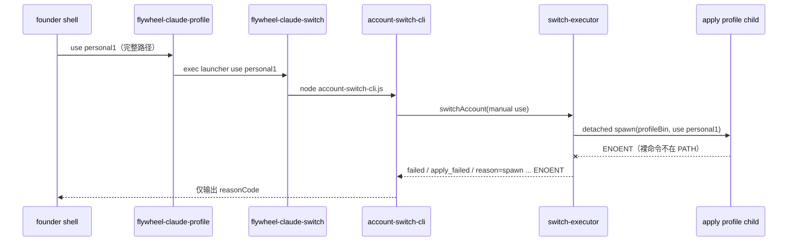

# FLY-2265 切号器 apply 失败 — 调研
Issue: FLY-2265 (https://linear.app/geoforge3d/issue/FLY-2265/切号器-flywheel-claude-profile-use-name-在凭证两侧健康时仍-flywheel-manual-switch)
日期: 2026-09-02
基于: exploration.md

## 调用链



FLY-2240 之前，`use` 在第一层 Bash 内直接执行，因此用完整路径启动即可。FLY-2240 之后，同一个命令多了一次“Node 再启动 Bash”的回调；这个新边界必须显式携带 Bash primitive 的路径。

## 根因证据

### 版本与凭证对照

| 对照 | 命令 | 结果 |
|---|---|---|
| pre-FLY-2240 | `verify personal1 --source pool` | rc=0, match |
| deployed | `verify personal1 --source pool` | rc=0, match |
| pre-FLY-2240 | `verify business --source keychain` | rc=0, match |
| deployed | `verify business --source keychain` | rc=0, match |

只读 A/B 未复现版本差异，说明身份锚、pool 读取和 Keychain 读取不是这次回归点。

### 生产调用环境

- `FLYWHEEL_CLAUDE_PROFILE_BIN`: absent
- `command -v flywheel-claude-profile`: absent
- founder 通过 repo 内完整路径启动第一层脚本；完整路径不会自动加入子进程 PATH。
- `claudeProfileBinPath()` 在 env 缺失时返回裸命令。

### 隔离 executor probe

使用临时 `claude-accounts.json`、临时 lock/pool 路径和真实 `switchAccount` + `makeClaudeProfileSwitchDeps`，将 `binPath` 保持为生产缺省裸名；没有读取或写入生产凭证。结果稳定为：

```json
{"outcome":"failed","reason":"spawn flywheel-claude-profile ENOENT","reasonCode":"apply_failed"}
```

这个失败发生在 apply Bash 进程创建之前，因此它不可能执行 `begin_authenticated_switch_audit` 或 `begin_audit`。这与生产“无本次 entry”完全一致。

## 诊断丢失点

`switch-executor.ts` 已把未知异常的 `err.message` 放入 `SwitchResult.reason`。真正吞掉它的是 `runAccountSwitchCli()`：失败输出只插值 `result.reasonCode`。因此最小诊断修复是在公共 CLI 同时输出经过单行、长度限制处理的 `result.reason`，保留稳定的 `reason=<reasonCode>` 机器字段。

若 apply Bash 已启动但以非类型化错误退出，`runDetachedProfile()` 把 stderr 放在错误对象的 `stderr` 属性，通用 catch 只保留 `Error.message`。为了让后续 Keychain/verify 类未知失败同样可诊断，adapter 应把受限、无控制字符的 child stderr 摘要加入新错误的 message，再交给 executor。

## 审计所有权

现有成功/已启动 apply 的审计由 Bash primitive 维护：

- `begin_audit()` 先追加 `phase=entry`, `exitCode=null`；
- EXIT trap 再追加 `phase=exit`, 实际 exit code；
- 文件要求同 owner、普通文件、0600、非 symlink，并通过 named/opened inode 对照后 append + fsync。

spawn 级失败没有 Bash 进程，必须由外层 Node CLI 提供 failure fallback。新 helper 应复用相同安全合同，追加：

```json
{
  "cmd": "use",
  "profile": "personal1",
  "phase": "entry",
  "probeSummary": "apply_failed",
  "exitCode": 1,
  "details": {
    "reasonCode": "apply_failed",
    "reason": "spawn flywheel-claude-profile ENOENT"
  }
}
```

审计失败不能掩盖原始 apply 失败；CLI 额外输出稳定 warning，并仍以原始 rc 返回。helper 不接触 credential、access token、refresh token 或 child stdout。

## 测试缺口

1. public-use 集成测试显式设置 `FLYWHEEL_CLAUDE_PROFILE_BIN=PROFILE_BIN`，没有覆盖 founder 的完整路径调用形状。
2. `account-switch-cli` 的 failed-result 单测只断言 reasonCode，没有要求 reason 文本或 failure audit。
3. 没有 Node fallback audit 的文件安全、JSON shape 或拒绝 symlink/wide-mode 测试。
4. 未知 apply child stderr 没有穿过 adapter → executor → public CLI 的断言。
5. 自动切号与手动切号共享 `switchAccount` / adapter；修复不能改变已类型化的 11 类错误或 daemon 的通知/账本行为。

## 结论

采用双层、各自单一职责的修复：

1. Bash trampoline 导出自身绝对路径，消除真实 ENOENT 根因；
2. Node CLI 公开并持久化失败原因，覆盖 Bash 尚未启动和未来非类型化 apply 异常。

该方案不改变切换策略或安全门，只补齐新进程边界遗漏的路径与可观测性合同。
