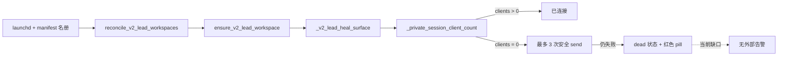

# FLY-2266 Lead 面板重连可见性 — 探索
Issue: FLY-2266 (https://linear.app/geoforge3d/issue/FLY-2266/cmux-先于全舰重启时v2-lead-面板会全体孤儿且无自愈-昨夜-1115-冻结-12h45m-无人发现潜伏缺口非每日发作)
日期: 2026-09-04
基于: 无

## 结论

事故不是 Lead 进程死亡，也不是 cmux workspace 缺席，而是已有 workspace 与新生的 per-Lead tmux server 之间没有活客户端。当前 watcher 已能直接读取私有 socket 的 `main` session 客户端数；问题是重连预算耗尽后只在面板内显示红色状态，不向外告警，也没有一行整舰对账日志说明期望数、实连数和缺席名单。

## 事故映射到现有代码

当前 v2 Lead 显示链：

- 名册权威：`derive_lead_roster()` 从已加载 plist 与 manifest 得到 `claude-private|label|title|socket`，不是从 cmux 画面猜名字。
- 非画面存活判据：`_private_session_client_count()` 对该 Lead 的规范私有 socket 执行 `has-session '=main'` 与 `list-clients -t '=main'`。它不读取历史 scrollback。
- 重连：`_v2_lead_heal_surface()` 只有在该 socket 客户端数为 0 时才进入安全恢复；clean bare shell 最多发送 `FLYWHEEL_CMUX_ATTACH_RETRIES` 次。
- 静默终局：`recover_attach_surface()` 的 `bare` 分支耗尽预算后写 `phase=dead` 和“连接失效 · 点击重连”，随后返回成功；这一分支没有 `_alert_cmux_cleanup` 或 episode 告警。
- 缺汇总：`reconcile_v2_lead_workspaces()` 遍历整份 `claude-private` 名册，但不记录 expected、attached、missing。

## 为什么残影会骗过旧巡检，但不应骗过修复

死 surface 可以保留重启前的 Lead 名称与 context 数字；因此 `read-screen` 中出现 `⚡flywheel-eng-lead` 只能证明历史内容存在。真实问题是新私有 tmux server 的 `main` session 没有任何显示客户端。实现与回归均应以规范 socket 的客户端数为真值，不把画面文字当作健康证据。

`surface_looks_like_bare_shell()` 仍可用于决定“能否安全注入一次重连命令”，但不能用于宣告健康；健康只能由客户端计数的正证据产生。

## 最小改动方向

1. 在 v2 Lead 的 bare-shell 重连预算进入 `dead` 时，复用现有 `roster_alert_unhealthy()` episode 通道主动告警；恢复到 `clients > 0` 时复用 `roster_mark_healthy()` 重置 episode。
2. 在每次 `reconcile_v2_lead_workspaces()` 结束时，用同一私有 socket 客户端判据输出一行 `expected=N attached=M missing=...` 对账日志。
3. 用 hermetic shell 回归模拟顺序：cmux 先重启且两格连接正常 → 全舰 Lead server 换代导致两格客户端归零 → 一格恢复、一格耗尽预算；断言最终日志为 `2/1`、缺席名单精确且告警一次。恢复后再次失败必须形成新 episode。

## 明确不做

- 不修改 cmux 本体或它的重连算法。
- 不增加 daemon、依赖、配置开关、并行健康数据库或画面 OCR。
- 不把同一私有 server 上的 Lead 进程健康等同于 Founder 可见性健康。
- 不重启 Bridge、Lead 或生产 cmux；真实重启顺序由独立 QA 节点执行。

## 假设与风险

- v2 Claude Lead 的规范形态是一 Lead 一私有 tmux server、一个 `main` session；该 server 的显示客户端代表 Founder 面板连接。仓内 FLY-1663 设计与现有实现均锁定此合同。
- 临时重启窗口不应立刻报警；已有三次持久重连预算充当 debounce，只有进入 dead 终局才发声。
- client-count 读取失败属于不可判定，不可虚报“已连接”；对账日志将它列入 missing，而 mutation 仍保持 fail-closed。
