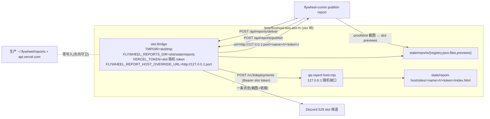

# FLY-2270 529 房台架缺口:报告链隔离发布 + Bridge TMPDIR 固定 — 探索

Issue: FLY-2270 (https://linear.app/geoforge3d/issue/FLY-2270/529-房台架缺口-slot-bridge-结构上没有-vercel-token报告卡片链在隔离房覆盖不到-runner-环境-tmpdir)
日期: 2026-09-03
基于: 无

## 1. 问题陈述

FLY-2215 QA 在 529 隔离房做真机验收时撞到两处台架(test harness)缺口,都不属于被测单:

| # | 现象 | 被测链路 | 后果 |
|---|------|----------|------|
| 1 | `publish-report` 在隔离房返回 501 `report publishing not available — VERCEL_TOKEN not configured` | publish → Vercel 托管 → Discord 报告卡片 | 这条链在 529 房**永远**覆盖不到,只能桩掉 |
| 2 | 从 runner 环境直接跑 `scripts/test-deploy.sh`,slot Bridge 起不来,tsx 报 IPC socket `EINVAL` | Bridge 启动 | 必须手工 `TMPDIR=/tmp` 才能起;违反 529 playbook「不要加内联环境变量」 |

验收标准(issue 原文):
- 在 runner 环境**不改 env** 直接跑 `test-deploy.sh` 能起 slot Bridge;
- 隔离房内 `publish-report` 能走完发布链并投到 529 频道;
- 约束:**不得写生产 previews 目录**。

## 2. 现状审计(代码事实)

### 2.1 Bridge 启动合同(FLY-2237)

`scripts/test-deploy.sh:1766-1935` 三条分支(generalized / reply-by-issue / 默认)都走同一条路:

```
env [-u …] KEY=VAL … node scripts/lib/qa-slot-bridge-spec.mjs capture … -- npx tsx scripts/run-bridge.ts
  → 写 ${SLOT_DIR}/bridge-launch.json(0600)
qa_slot_bridge_exec_spec → python `env -i` 清空环境,只装回 spec.environment + spec.secretEnvironment,再 exec 命令
```

关键事实:
- `capture` 把**当时整个 `process.env`** 快照进 spec(`qa-slot-bridge-spec.mjs:282`),名字匹配 `/(TOKEN|KEY|SECRET|PASSWORD|PASSWD|BEARER|CREDENTIAL|AUTH)/i` 的进 `secretEnvironment`(0600 文件),其余明文进 `environment`。
- 所以 **caller 的 TMPDIR 会原样进 spec**,除非 launch 命令里显式覆盖。
- 三条分支只有 generalized 那条显式写了 `TMPDIR="${GENERALIZED_CHILD_TMPDIR}"`(`test-deploy.sh:1820`);另外两条什么都不写 → 继承 runner 的 TMPDIR。
- `BRIDGE_EXTRA_ENV` 数组在三条分支**都**被展开(`${BRIDGE_EXTRA_ENV[@]+…}`),是唯一一处「一改三处生效」的位置。

### 2.2 缺口 2 根因:tsx IPC socket 路径

tsx 4.20.6(`node_modules/tsx/dist/temporary-directory-*.mjs` + `get-pipe-path-*.mjs`):

```
pipe = path.join(os.tmpdir(), `tsx-${geteuid()}`, `${pid}.pipe`)
```

macOS `sun_path` 上限 104 字节(含 NUL,实际可用 103)。本 runner 环境:

```
TMPDIR=/Users/xiaorongli/.flywheel/runner-state/<36 位 execId>/browser-tmp   → 89 字符
+ "/tsx-501/" (9) + "12345.pipe" (10) = 108 > 103 → bind() EINVAL
```

这个 TMPDIR 是 `TmuxAdapter.ts:636-665`(FLY-766)给每个 runner pane 注入的 `browser-tmp`,长度由 `~/.flywheel/runner-state/<uuid>/browser-tmp` 决定,**结构上恒为 89 字符**,与 worktree 路径无关。

既有的 `qa_generalized_safe_tmpdir`(`scripts/lib/qa-generalized.sh:141`)只在 `--generalized` 模式生效,而且判据是 tmux 的 `tmux-<uid>/default`(+18 > 100 才回落 `/tmp`),tsx 的路径碰巧比它短 1 字符,generalized 模式是**靠巧合**安全的。FLY-2174 exploration 第 50 行写「已同时投影给 Lead 与 Bridge」——那只对 generalized 模式成立,FLY-2215 QA 用的模式撞了这个洞。

### 2.3 缺口 1 根因:报告链的三个硬编码

报告链(FLY-203)当前形状:

```
flywheel-comm publish-report
  1. POST {FLYWHEEL_BRIDGE_URL}/api/reports/publish      (需要 master 或 ingest 凭证)
       → ReportRegistry.stagePublish  (registry 目录 = FLYWHEEL_REPORTS_DIR ?? ~/.flywheel/reports)
       → deployFilesToVercel(token, "fw-reports-<hex>", 全量保留集)   fetch("https://api.vercel.com/v13/deployments")
       → commit  (写 registry.json + files/)
       → 返回 url = `https://${vercelProjectName}.vercel.app/r/${token}/`
  2. proofshot 截图 → 写 {FLYWHEEL_REPORTS_DIR ?? ~/.flywheel/reports}/previews/<reportId>.png
  3. POST /api/reports/deliver {url, projectName, channelId|issueIdentifier, screenshotPath}
       → Bridge 校验 screenshotPath 必须在它自己的 previewsDir 里
       → 一条 Discord 消息(截图 + 链接)到 channelId / issue thread / project.generalChannel
```

三个硬编码/缺省决定了 slot 无法安全接入:

| 位置 | 硬编码 | 对 slot 的影响 |
|------|--------|----------------|
| `plugin.ts:5642` | `VERCEL_TOKEN` 只从 `process.env` 读;`test-deploy.sh` 从不注入 | 501,链路桩掉 |
| `plugin.ts:4313` | `reportsBaseDir = FLYWHEEL_REPORTS_DIR ?? ~/.flywheel/reports`;`test-deploy.sh` 从不注入 `FLYWHEEL_REPORTS_DIR` | **只要给 slot 一个 token,它就会写生产 `registry.json`、`files/`、`previews/`,并把生产 `fw-reports-xxxx` 项目整套重部署一遍**(这正是 issue 的「不得写生产 previews 目录」约束) |
| `vercel-deploy.ts:63` / `reports-route.ts:315` | `https://api.vercel.com` 与 `https://<name>.vercel.app/r/<token>/` 写死 | 没有任何缝可以把发布目标指向隔离的地方 |

另一个前置条件:`/api/reports/*` 在 Bridge 没有 `apiToken` 时**永远 503**(`plugin.ts:4309-4311` 的设计决定)。`test-deploy.sh` 只在 `--generalized` 或 `TEST_REPLY_BY_ISSUE=1` 时铸造 `TEAMLEAD_API_TOKEN`;默认模式 `env -u TEAMLEAD_API_TOKEN`。所以「报告链在隔离房可验」只对带 API token 的模式有意义,默认模式的 503 是既有设计,不在本单范围。

### 2.4 生产侧事实(只查存在性,不读值)

- `~/.flywheel/.env` 里 `VERCEL_TOKEN=` 存在一行,**不带 `export`**;`test-deploy.sh:50` 用 `source` 加载 → 它只是 shell 变量,不会进子进程。这解释了为什么 slot Bridge 是 501 而不是「拿生产 token 去部署」。但这是**偶然**的安全:任何 `set -a; source .env` 的调用方都会把生产 token 送进 slot Bridge 的 spec。
- `~/.flywheel/reports/` 有 `registry.json`、`files/`、`previews/`,是生产报告注册表。

### 2.5 相关既有单

- FLY-2174(529 QA room env contracts):把 alerts / ingest token 的身份源收敛到 slot tree;exploration 明确「TMPDIR 除非聚焦测试证明仍有未覆盖的启动边界,本节点不重复改造」——本单就是那个证据。
- FLY-2237:Bridge 启动合同(launch spec),本单**沿用**它,不另起炉灶。
- FLY-2215:发现者;它自己的 plan 用「本地 HTTP stub 替代 publish/deliver 外部写入」做单测,说明 stub 思路在本仓已有先例。
- FLY-2283 记忆:Vercel 每日 100 次部署配额是全局共享的,QA 耗掉会直接影响 founder 面产物。

## 3. 方案空间

### 缺口 2(TMPDIR)

| 方案 | 做法 | 评价 |
|------|------|------|
| A. 把 `qa_generalized_safe_tmpdir` 推广到三条分支 | 保留「太长才回落 `/tmp`」的启发式 | 仍依赖调用方 env;判据是 tmux 长度,tsx 靠巧合;`/tmp` 是全机共享目录,slot 之间不隔离 |
| **B. 固定 Bridge TMPDIR = `${SLOT_DIR}/tmp`** | 每个 slot 一个短的、自有的 tmp,进 `BRIDGE_EXTRA_ENV` | 路径恒 ≤ 30 字符;不看调用方 env;teardown `rm -rf $SLOT_DIR` 顺手清掉;一处改三处生效 |
| C. 给 tsx 传 `--no-ipc` 之类 | tsx 4.20 没有关 IPC 的开关(dist 里只有 `TSX_DEBUG/TSX_DISABLE_CACHE/TSX_TSCONFIG_PATH`) | 不可行 |
| D. 不用 tsx,先 build 再 `node dist/` | 改变被测字节形态,与 529 「用当前仓字节装房」原则冲突 | 超范围 |

选 **B**。`GENERALIZED_CHILD_TMPDIR` 改为对所有模式统一取 `${SLOT_DIR}/tmp`,generalized 分支的 Lead / clone watchdog 继续沿用同一变量;`qa_generalized_safe_tmpdir` 随之无人引用(见 §5 dead code)。

### 缺口 1(报告链)

| 方案 | 做法 | 评价 |
|------|------|------|
| A. 独立 Vercel token + 独立 project | 给 slot 另一个真 token | ① registry 每次新建都会 `fw-reports-<随机>`,一房一个新 Vercel 项目,账号被污染;② 吃全局 100 次/日部署配额(FLY-2283 已经 402 过);③ 需要第二个真秘密进 `.env`;④ 同一个 api host,只靠 token 不同,**没有结构性证据**说 slot 不会碰生产项目;⑤ 依赖外网 |
| **B. slot 自带本地 stub 托管服务** | 一个 slot 作用域的 Node HTTP 进程,实现 Bridge 用到的 Vercel API 子集并静态托管上传的页面;Bridge 通过一个回环地址(loopback)覆盖开关把 API 与公开 URL 都指到它 | 零外部依赖、零配额、零真秘密;slot token 随机铸造,stub 只认它;生产路径在开关未设时**字节不变**;QA 能真的打开链接、截图、投 Discord |
| C. 只桩 `deployFiles`,URL 仍是 vercel.app | 不托管页面 | 链接打不开,截图必失败,QA 只能验「发了一条消息」,不算端到端 |

选 **B**。

## 4. 目标形态(一句话)

slot 起来时顺带起一个只听 127.0.0.1 的「假 Vercel」,Bridge 拿着 slot 自己铸的随机 token 往它上面发布,报告目录、previews 目录、tmp 目录全部落在 `${SLOT_DIR}` 下;生产 Bridge 一行行为都不变。



## 5. 假设与待确认

1. **runner pane 不继承 Bridge 的 `FLYWHEEL_REPORTS_DIR`**(research §4 已核实:pane 走 `env -i` 白名单)。这与授权模型一致:runner 只有 ingest 凭证,CLI 强制 `--publish-only`;**投递所有者是 Lead / QA 操作者**,验收配方按此执行,不把报告目录穿透进 runner。
2. **只在带 API token 的模式起 stub**(`--generalized` 或 `TEST_REPLY_BY_ISSUE=1`):默认模式 `/api/reports` 本来就是 503,起了也没用;这与既有「默认 slot 保持原字节路径」原则一致。`FLYWHEEL_REPORTS_DIR` 与 `TMPDIR` 则对**所有模式**注入(纯隔离,无副作用)。
3. **`-u VERCEL_TOKEN`** 加进三条 launch 边界:让 slot Bridge 能看到的 `VERCEL_TOKEN` **只可能**是 slot 铸的那个。这是把 §2.4 的偶然安全变成结构安全。
4. **Dead code**:方案 B 落地后 `qa_generalized_safe_tmpdir` 与 `test-deploy-generalized.test.sh:564-569` 无人引用。plan 里列出并连同删除(单一真源:slot tmp),不静默留着。
5. 本单**不改**:`publish-report` CLI、`report-registry.ts` 的保留/TTL 语义、Discord 投递、Lead 的 TMPDIR(非 generalized 模式)、默认模式的 503。

## 6. 非目标

- 不给生产 Bridge 加任何新的运行时行为;开关未设时 `vercel-deploy.ts` / `reports-route.ts` 的调用与返回字节不变。
- 不解决 `~/.flywheel/runner-state/<uuid>/browser-tmp` 本身过长的问题(那是 FLY-766 的归属契约,runner 的 agent-browser 依赖它)。
- 不处理 FLY-2215 单本身。
