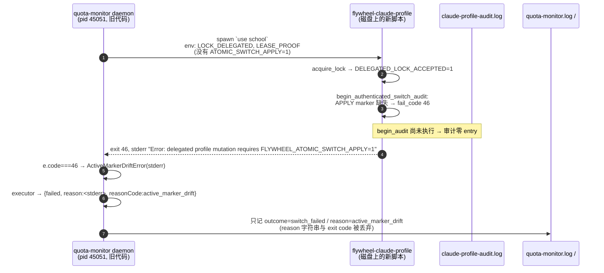
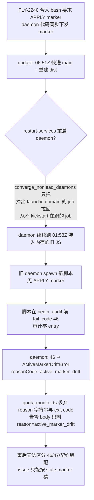

# FLY-2271 daemon 自动切号失败零证据 — 探索
Issue: FLY-2271 (https://linear.app/geoforge3d/issue/FLY-2271/切号器daemon-自动切号在-token-轮转后必失败委托模式对-stale-active-marker不修复直接-46)
日期: 2026-09-02
基于: 无

## 0. 一句话结论

12:46Z 那次自动切号失败**不是** token 轮转把 marker 判成 stale,而是**运行中的 quota-monitor daemon 还跑着 FLY-2240 之前的代码**:它 spawn 出的 `flywheel-claude-profile use` 子进程没带 FLY-2240 新增的 `FLYWHEEL_ATOMIC_SWITCH_APPLY=1` marker,脚本在写审计 entry **之前**就以 46 拒绝,daemon 又把一切 46/47 一律映射成 `active_marker_drift`。issue 提出的 4 条要求里,「证据保全」「两路径一致」「隔离复现」仍然成立且必须做;「委托模式 stale-active 不修复」这一条的**触发条件**需要按真因重写。

## 1. 现象回放(带证据)

所有时间为 UTC;本机时区 PDT = UTC-7。

| 时刻 | 事件 | 证据来源 |
|---|---|---|
| 09-01 16:14Z | main 在 `3ca253271`(9-01 12:00 PDT pull) | `git -C ~/Dev/flywheel reflog` |
| 09-02 01:53:29Z | quota-monitor daemon 启动,pid 45051,入口 `~/Dev/flywheel/packages/teamlead/dist/account-heal/quota-monitor-cli.js` | `~/.flywheel/quota-monitor.pid`、`ps -o lstart` |
| 09-02 05:47Z | FLY-2240 `155e1e78a` 合入 origin/main:bash `use/next` 新增「委托子进程必须带 `FLYWHEEL_ATOMIC_SWITCH_APPLY=1`,否则 `fail_code 46`」;daemon 侧 `claude-profile-cli.ts` 同步开始下发该 marker | `git log -S FLYWHEEL_ATOMIC_SWITCH_APPLY` |
| 09-02 06:16:39Z | daemon(actor `ppid:45051`)自动 `use business` 成功,审计 entry/exit 齐全 | `~/.flywheel/claude-profile-audit.log` |
| 09-02 06:51:08Z | updater 把 main 快进到 `e3554c812`(含 FLY-2240),磁盘上的 bash 脚本从此要求 APPLY marker;**daemon 进程未重启** | reflog;`ps` 起始时间不变 |
| 09-02 12:46:40Z | personal 5h 到 90% → daemon 切号 → `outcome=switch_failed`;告警 `reason=active_marker_drift; degraded=false`;审计日志**零记录** | `~/.flywheel/logs/quota-monitor.log:1406`、audit log |
| 09-02 12:49:37Z | Lead 手动 `use school` rc=0,审计正常(actor `ppid:28427` = 手动 CLI 的 Node 进程) | audit log |
| 09-02 18:46:41Z | business 到 90% → daemon 再次 `switch_failed`,同样零审计 | `quota-monitor.log:1427` |
| 09-02 18:47:32Z | Lead 手动 `use personal` rc=0 | audit log |
| 09-02 23:00Z | 磁盘 dist 重建(`claude-profile-cli.js` mtime 9-02 16:00 PDT),含 3 处 `FLYWHEEL_ATOMIC_SWITCH_APPLY`;daemon 仍是 01:53Z 那个进程 | `ls -la dist/`、`grep -c` |

两个硬事实决定了方向:

1. **daemon actor 在 06:51Z 之后再无任何审计 entry**(`grep -c 'ppid:45051'` = 2,全在 06:16Z)。审计 entry 由 `begin_audit` 写,而 `use_profile()` 的顺序是 `acquire_lock → begin_authenticated_switch_audit → active_marker_structural_gate → … → reconcile_stale_active_locked`。所有 stale-active 的 46/47 都发生在 `begin_audit` **之后**,必然留下 entry + exit 两行。零 entry 只可能是脚本在 `begin_audit` 之前就退出了。
2. 在委托模式下,`begin_audit` 之前唯一的 46 出口就是 `begin_authenticated_switch_audit` 里的 `[[ FLYWHEEL_ATOMIC_SWITCH_APPLY != 1 ]] → fail_code 46`。

## 2. issue 假设为何不成立

issue 的机制假设:「Claude 长会话轮转 OAuth token → keychain live token ≠ 池内 personal 副本 → marker 被判 stale → 委托路径直接 46」。读代码与日志,三条独立反证:

| # | 反证 | 出处 |
|---|---|---|
| R1 | stale 判定比的是**账号身份**(identity probe 返回的 uuid+email vs 槽 anchor),不是 token 字节。token 轮转不改身份 → 走 `o_uuid == a_uuid` 的 match 分支 | `flywheel-claude-profile:1854` |
| R2 | match 分支在**委托模式同样允许**:`capture_live_credential_strict` 把 live token 保鲜进池 + `emit_apply_freshened_report` 把 freshened 事实回传 Node。这正是 FLY-1201 §2.3 设计的「display-stale/保鲜分支两种模式都允许」 | `flywheel-claude-profile:1855-1868`;FLY-1201 plan L161 |
| R3 | daemon **每 tick** 已有机器见证:live keychain digest ≠ 池副本 digest 时调用非委托的 `flywheel-claude-profile reconcile`(strict 修复,20 分钟节流)。9-01 它真的修过一次 `reconciled_business_to_shopping`;而 **9-02 全天审计里 0 条 reconcile** → 当天没有任何 tick 观察到 live≠池,即没有发生 issue 假设的轮转分歧 | `quota-monitor-runtime.ts:340-390`;audit log `cmd:reconcile` 计数 |

另外一个反证来自手动路径本身:FLY-2240 之后手动 `use` 也是 trampoline 到 Node CLI → 拿锁 → spawn **委托模式**的 bash 子进程。如果 12:46Z marker 真的 stale,12:49Z 的手动子进程会撞同一条 `delegated switching performs no repair` 46,再由 CLI 跑一次 `reconcile` 重试——审计里会有 `cmd:reconcile` 行。没有。

> 结论:「委托不修复 → 切号失败 → 人肉兜底」这条链在 9-02 并未发生。但它作为**潜在**失效模式仍然存在(见 §5.2),且 issue 要求两路径一致,本设计保留对它的处理。

## 3. 真因链

三个层次的缺陷,缺一个都不会「零证据」:

1. **部署层**:`scripts/lib/converge-nonlead-daemons.sh` 的设计目标(FLY-1830)是「掉出 domain 的 job 放回去」,它明确不做 kickstart。Bridge / Leads / cmux-watcher 都在部署波次被替换,quota-monitor 没有。daemon 因此跨过 06:51Z、07:52Z、22:24Z 三个波次仍跑旧码。
2. **契约层**:bash 把「委托子进程没带 APPLY marker」(一个契约/版本错配)与「marker 无法证明描述 live token」(FLY-1201 语义)共用 exit 46;daemon 又只按数字映射。分类错了,告警文案就把人引向错误方向。
3. **证据层**:bash 侧 `begin_audit` 排在 APPLY 门之后 → 该拒绝不进审计;Node 侧 executor 已经把子进程 stderr 放进 `reason`,但 `quota-monitor.ts:1531` 只取 `reasonCode` 开 episode,`reason` 与 exit code 既不进 `quota-monitor.log` 也不进告警 body,report 目录随即 `rmSync`。

## 4. 现有机制盘点(不要重复造)

| 机制 | 位置 | 与本单关系 |
|---|---|---|
| bash 三态 stale-active 对账(46 零 mutation / 47 前缀可收敛 / 47-uncertain) | `flywheel-claude-profile:1656-1895`,FLY-1201 | **保持不动**。issue「不做」项:不改安全边界 |
| 委托模式 match 分支 strict 保鲜 + freshened report | 同上 L1855-1868 | 已覆盖 token 轮转;设计里作为「已有能力」写明 |
| daemon 每 tick 机器见证 → `reconcile`(20 min 节流) | `quota-monitor-runtime.ts:340-390` | 已是「预对账」;缺:成功不落日志、节流窗内切号触发时不会重试 |
| 手动 CLI 对 `active_marker_drift` 的一次性 `reconcile` + 重试(`FLYWHEEL_MANUAL_RECONCILE_RACE` 防环) | `account-switch-cli.ts:245-256` | daemon 缺同款;这是「两路径一致」的最小补法 |
| `reconcileClaudeProfile()` 只返回 boolean,吞掉 `outcome/from/to` | `claude-profile-cli.ts:250-290` | 需返回结构化结果供日志 |
| FLY-2265 `applyFailureDiagnostic` 把未知 exit 的 stderr 归一进 `Error.message`;`manual-switch-audit.ts` 为「子进程未启动」写 fallback 审计 | `claude-profile-cli.ts:80-110`,`manual-switch-audit.ts` | 已到 ship 卡,**不扩范围**;本单在其之上,只消费它已提供的 `reason` |
| daemon health marker 已写 `runtimeTreeSha256`(启动时自算的 dist 树哈希) | `quota-monitor-cli.ts:246,288`;`~/.flywheel/quota-monitor.health.json` | 现在没人拿它跟磁盘比;是部署层检测「在跑的进程是否过期」的现成信号 |
| `restart_cmux_watcher` 状态机(healthy/parked/…,不把降级当部署失败) | `scripts/lib/restart-cmux-watcher.sh` | 部署层重启 quota-monitor 的模板 |
| `account_switch_failed` 告警路由 `mention:false, severe:false` | `quota-monitor-alert.ts:82` | 不改;但在 founder HTML 的诚实边界里写明「这类失败不 @ 人」 |

## 5. 设计方向

### 5.1 必做(对应 issue 要求 1、3)

**A. 证据保全(两端)**
- bash:`begin_authenticated_switch_audit` 在 `DELEGATED_LOCK_ACCEPTED=1` 已判定后**先** `begin_audit`,再检查 APPLY marker。被拒的委托子进程留下 entry + exit(summary 独立)。公开 trampoline 路径不受影响(它在 `begin_audit` 之前就 `exec` 走了,不产生孤儿 entry——这是 FLY-2240 把 `begin_audit` 后移的唯一动机,依然成立)。
- Node:typed error(至少 `ActiveMarkerDriftError` 与新错误)携带 `exitCode`;`SwitchResult.failed` 增加 `applyExitCode?: number`;`quota-monitor.ts` 在 `switch_failed` 前写一条结构化日志 `{event:"account_switch_failed", reasonCode, exitCode, childStarted, detail}`,并把 `exit=<n>; detail=<截断的 stderr 标记行>` 放进告警 body;`pendingSwitchFailure` 存 `detail`(有界,非 secret),再告警时也带上。detail 只取 stderr 里 `FLYWHEEL_*` 标记行与 `Error:` 行,去控制字符,上限约 600 字节,**永不**包含 token(bash 从不把 token 写 stderr,这是既有红线,加一条测试锁住)。

**B. 契约错配单独分类**
- bash:APPLY marker 缺失 → 新 stderr 标记 `FLYWHEEL_ATOMIC_APPLY_CONTRACT_MISMATCH` + 新 exit **48**(46/47 回归纯 FLY-1201 语义;48 在脚本现有 exit 集合 `0 1 2 10 20 30-33 36 37 39 44 46 47 86-88 130 143` 里空闲)。
- Node:`ApplyContractMismatchError` → `reasonCode: "apply_contract_mismatch"`,环境类、fail-closed、不轮候选;告警文案直说「daemon 运行的构建早于磁盘上的切号脚本,需要重启 quota-monitor」。

**E. 隔离台架复现**(要求 3):三场景,手动/委托各跑一遍,修前修后对照。修前基线用 `git archive origin/main` 造树,不脏 worktree。
- S1 token 轮转(同身份、不同字节):**修前修后两路径都成功**——这是对 issue 假设的诚实否定,必须写进证据。
- S2 真 drift(`.active`→business,live token 属 shopping):修前 daemon 路径 46 / 手动 CLI 0;修后两路径 0,daemon 日志含 reconcile 结论。
- S3 契约错配(委托子进程不带 APPLY):修前 46 + 零审计 + `active_marker_drift`;修后 48 + 审计 entry/exit + `apply_contract_mismatch` + 日志/告警含 exit 与标记行。

### 5.2 要求 2 的落点(两路径一致,写死最严档)

issue 给了两个选项:daemon 侧允许同样的 strict 修复,或切号前预对账。对照现状:

- 「预对账」已存在于每 tick 的机器见证,只是成功不落日志、有 20 分钟节流。
- 手动 CLI 已经实现「executor 返回 `active_marker_drift` → 锁外跑一次非委托 `reconcile`(identity probe + anchor 唯一匹配 + strict capture + strict store sync + 原子改 marker)→ 重新 snapshot → 重试恰好一次」。

**C. daemon 采用与手动 CLI 同一套一次性 reconcile + 重试**。这满足「与手动路径同一套校验」,不加开关,不碰 bash 的委托模式边界(FLY-1201 的「delegated 零 mutation」原样保留,修复动作永远由持锁的非委托 `reconcile` 完成)。实现上把 CLI 里的 drift-recovery 抽成共享 helper,CLI 与 daemon 都用它,避免两份镜像逻辑。reconcile 的结构化结果(`outcome/from/to`、exit、stderr 标记)进 `quota-monitor.log`;重试后仍 drift → `active_marker_drift` + detail `drift persisted after reconcile`,不循环。

### 5.3 结构缺口(issue 未列,但它是 12:46Z 的第一因)

**D. 部署波次重启过期的 quota-monitor**。新 lib `scripts/lib/restart-quota-monitor.sh`(仿 `restart-cmux-watcher.sh` 的 state/detail 合同),在 `converge_nonlead_daemons` 之后执行:读 `~/.flywheel/quota-monitor.health.json` 的 `runtimeTreeSha256`,与磁盘 dist 树哈希(daemon CLI 新增 `--runtime-tree-sha` 打印自身算法结果,单一算法来源)比对;不一致或 marker 缺失/不可读 → `launchctl kickstart -k`,等待新 pid 且 `processStartTime` 变化;一致 → 不动。同-SHA 波次因此零动作;降级只报告不阻断部署(与 cmux-watcher 同一姿态)。

已向 Lead 非阻塞提问 D 是否纳入本单(question `310f97fc`);默认纳入,plan 里作为可摘除的独立 Task。

### 5.4 否决的替代方案

| 方案 | 否决理由 |
|---|---|
| bash 委托模式直接做 marker/store 修复 | FLY-1201 Codex R1#4 明确否决:委托子进程在 Node 持锁的 CAS 事实(`working/observedAccount/generation`)之内改 marker/store 会让 executor 的提交覆盖修复;要做就得重做 Bash→Node 结构化结果与 authority。锁外 `reconcile` + 重新 snapshot 已经拿到同样效果 |
| daemon 每 tick 自比 runtime tree 哈希,漂移即自退出让 launchd 重拉 | daemon 自己决定「何时采用新代码」= 自行部署,违反「merge 与 deploy 分离、只有 updater 在窗口部署」;且 build 中途的半成品 dist 会被它立刻采用。部署波次持有完整上下文(build 完成、deployed-sha 已推进),应由它做 |
| 每个部署波次无条件 `kickstart -k` quota-monitor | 同-SHA 波次(converge 也会跑)白白打断在飞的 tick;哈希比对让重启只在真过期时发生,且顺手把「为何重启」写进证据 |
| 切号前每次先跑 bash `reconcile`(网络 probe) | 委托 match 分支已经在每次切号做一次 identity probe + strict capture;再加一次是双倍网络与双倍审计行,只为覆盖极少数「live==池副本但身份属他槽」的畸形态;反应式 reconcile+重试同样覆盖且零常态开销 |
| 把 exit code 与 stderr 全文塞进告警 | Discord 消息与 lead-alert 都不适合长文;且 stderr 全文可能含路径。只取标记行 + `Error:` 行,有界截断;全文进 `quota-monitor.log` |
| 保留 46 只加 stderr 标记区分契约错配 | daemon 的 `code===46` 先于标记匹配;两处都要改的话不如给独立 exit code,数值与标记互为备份(execFile 可能只给 signal 字符串) |

## 6. 假设(需被推翻请指出)

1. daemon 与 bash 脚本永远部署在同一棵树(`~/Dev/flywheel`),不存在跨树混用;契约错配只会由「进程未重启」造成。
2. `launchctl kickstart -k` 对 quota-monitor 是安全的:daemon 的 SIGTERM 处理是「打断计时器、不打断 poll」,当前 tick(含切号)会跑完;launchd `ExitTimeOut=30` 大于一次切号的 ~5s。
3. 手动 CLI 的 drift-recovery 抽成共享 helper 后,CLI 行为逐字节不变(现有 `account-switch-cli.test.ts` 的两条 drift 测试原样通过)。
4. `pendingSwitchFailure.detail` 作为可选键加入 state v2,不升版本;旧 state 缺该键时解析为 `undefined`。
5. 告警 body 长度上限:lead-alert 未见截断逻辑,按 Discord 2000 字符保守,detail ≤ 600 字节。

## 7. 与 FLY-2265 的边界

FLY-2265 修的是手动入口 `spawn flywheel-claude-profile ENOENT` 与「apply 失败时 stderr 进 message + fallback 审计」。它已在 ship 卡。本单:
- 只消费它已经放进 `SwitchResult.reason` 的诊断字符串,不改 `applyFailureDiagnostic` 的截断策略;
- 不改 `manual-switch-audit.ts`;daemon 的「零审计」由 bash 侧 `begin_audit` 前移解决,不需要 daemon 写 fallback 审计;
- 若 FLY-2265 先合入,本单 rebase 后仅在 `claude-profile-cli.ts` 的 catch 块新增分类分支,无重叠改动。
