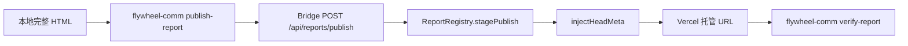

# FLY-2276 托管交互报告自动 CSP nonce — 调研
Issue: FLY-2276 (https://linear.app/geoforge3d/issue/FLY-2276/publish-report-托管页注入的-csp-默认-default-src-none-无-script-src作者不写-csp)
日期: 2026-09-03
基于: exploration.md

## 1. 当前链路



- `packages/flywheel-comm/src/commands/publish-report.ts` 校验文件、大小、凭据与参数，然后原样把 `html` 发给 Bridge；它不改 HTML。
- `packages/teamlead/src/bridge/reports-route.ts` 在 deploy 前调用 `ReportRegistry.stagePublish`。`ReportHtmlInvalidError` 映射为 HTTP 400，因此 HTML hardening 可以在任何远端写入前 fail loud。
- `packages/teamlead/src/bridge/report-registry.ts` 的 `injectHeadMeta` 负责 `noindex`、CSP 和 nonce 替换；这是唯一实际改变托管 HTML 的位置。
- `packages/flywheel-comm/src/commands/verify-report.ts` 拉回托管页，现有检查是 HTTP、`__CSP_NONCE__` 残留、每个 `<script>` opening tag 是否有 nonce、预期子串，以及可选截图。

## 2. 根因

`injectHeadMeta` 当前只用一个全局条件进入脚本模式：HTML 任意位置包含 `__CSP_NONCE__`。进入后生成随机 nonce、全局替换占位符，并选择带 `script-src 'nonce-…'` 的 CSP；否则选择不含 `script-src` 的默认 CSP。

所以无 CSP meta、无占位符但有 inline script 的普通交互报告会落入静态分支。发布 API、deploy 和截图都可成功，浏览器才在运行时静默阻止脚本。

这段 opt-in 机制来自 commit `1f410eb9f`（PR #307），其兼容合同有三点：

1. 纯静态页继续使用 no-script CSP。
2. `__CSP_NONCE__` 被替换为每次发布的新 nonce。
3. 作者输入中的不可信内容必须由生成器 HTML-escape；旧机制依赖 placeholder，只授权显式 opt-in 的 script。

本单的自动化会刻意改变第 3 条的后半句：发布端无法从一份最终 HTML 判定某个真实 script 元素的 provenance，又必须按需求让无 placeholder 的作者脚本执行，所以它会授权无 CSP 报告内的每个可执行 inline script。相应地，前半句从“现有生成器约定”升格为所有 `publish-report` 消费者的硬安全前置。转义后的 `&lt;script&gt;` 仍只是文本；未转义的动态 `<script>` 不再享受 CSP 的第二道拦截。

## 3. 第二个验证缺口

`verify-report` 的 `scriptNonce` 只观察 script tag。下面的托管 HTML 当前会被错误判定为通过：

```html
<meta http-equiv="Content-Security-Policy" content="default-src 'none'">
<script nonce="abc">interactive()</script>
```

标签有 nonce 不代表 CSP 授权了它；没有 `script-src` 时仍继承 `default-src 'none'`。这正是“两种状态留下同一个痕迹”：DOM 元素、nonce 属性、HTTP 200 都在，但 JavaScript 不执行。

## 4. 自动补齐的安全边界

### 4.1 只在发布端注入 CSP 时自动化

先在真实 `<head>` 内检测 CSP meta。只有“无自带 CSP”时才启用 inline-script 自动 nonce；作者自带 CSP 时保持原行为，避免发布端擅自放宽或破坏作者策略。

### 4.2 受信任 HTML 与转义前置

自动 nonce 是 publish-time 文档级授权：最终 HTML 中当刻存在的真实可执行 inline script 会获得执行权。托管页此后是冻结静态文档、URL 不可猜且没有注入通道，所以这等价于作者逐块 opt-in；动态创建的新 script 不会自动获得 nonce。代码里的 SECURITY 注释必须同步为：调用者负责 HTML-escape 所有不可信动态值，发布端只负责 CSP/nonce 对齐，不是 sanitizer。回归测试用 `&lt;script&gt;...&lt;/script&gt;` 证明正确转义的数据仍惰性。

### 4.3 inline 与 external 必须分开

- inline：`<script>` opening tag 无 `src` 属性。自动生成一次 nonce，并把所有 inline script 的 nonce 归一为该真值。
- external：opening tag 有真实 `src` 属性。自动路径绝不添加本次 nonce。

原因：nonce 不只是 inline 标记；把正确 nonce 加到 `<script src>` 上可能授权该外链。安全实现不能先给所有 script 加 nonce、再依赖 `default-src 'none'`。

### 4.4 不扫描 script body 里的伪标签

直接全局替换 `/<script\b[^>]*>/` 会把 JavaScript 字符串或 template 中的 `"<script>"` 误认为真实 opening tag，修改代码内容。实现应按完整 `<script ...>...</script>` 元素匹配，每个真实元素只处理第一个 opening tag；这与浏览器遇到首个 `</script>` 即结束 raw-text script 元素的规则一致，也覆盖本项目生成器产出的完整 script 元素。

### 4.5 引号感知的 tag / 属性识别

`src` / `nonce` 必须是独立属性名，而不是 `data-src` / `data-nonce`。opening tag 的结束位置必须通过小型引号感知 scanner 找到，不能用 `[^>]*`：`<script data-x="foo>" src="https://x">` 中第一个 `>` 仍在属性值内，若提前截断就会把 external script 错当 inline 并给它授权。scanner 同时跳过 HTML comment，并支持双引号、单引号和无引号属性值，不增加 HTML parser 依赖。

### 4.6 只给浏览器可执行类型开策略

`type` 缺失/为空、`module` 或 JavaScript MIME 才触发自动 nonce/CSP。`application/ld+json`、`text/template` 等 data block 本身不执行，不能让原本的静态页面从 no-script CSP 变成 script-enabled。

## 5. 验证策略

`verify-report` 新增一个稳定的 `scriptCsp` check 字段：

- 页面没有 inline script：`skipped`。
- 有可执行 inline script，真实 `<head>` 的每条 CSP meta 都含独立 `script-src` directive，且每个 script tag nonce 都属于策略 nonce 集：`pass`。
- 有可执行 inline script，但无 CSP meta、没有 `script-src`、没有 nonce source，或 tag/policy nonce 不匹配：`fail`，并提示重新用新版 `publish-report` 发布；手工修复则在 CSP 与每个 inline script 中使用同一个 `__CSP_NONCE__`。

该检查不声称执行 JavaScript；最终验收仍需在真实托管 URL 上点击按钮，观察明确的 DOM 状态变化。

## 6. 选型

采用集中、无新依赖的最小改动：

- TeamLead：扩展现有 `injectHeadMeta`，不改 route、registry transaction 或 deploy。
- flywheel-comm：扩展现有 `verifyReport` body 检查，不改 CLI 参数和截图生命周期。
- durable consumer doc：窄 sweep 找到 `.claude/skills/diagram-design/SKILL.md` 的旧合同；按 Lead 裁定不在本 PR 修改，只在 PR body/交接中逐文件列出，交 Lead 同步其跨仓来源。
- 测试：在现有两个测试文件中各加一个先红后绿的主行为测试，再补安全边界回归。

不采用以下方案：

- 不要求所有作者学习/复制 `__CSP_NONCE__` 模板；这正是本单要消除的隐形前置知识。
- 不加入 `'unsafe-inline'`；它会放宽所有 inline script，违背 nonce 隔离。
- 不给外链脚本补 nonce或增加 host allowlist。
- 不在 `publish-report` CLI 侧预改 HTML；服务端才是所有发布消费者共用的最终 hardening 边界。
