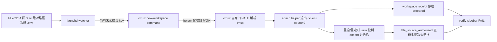

# FLY-2281 Codex v2 cmux 座位持续死行 — 探索
Issue: FLY-2281 (https://linear.app/geoforge3d/issue/FLY-2281/cmux-codex-v2-%E5%BA%A7%E4%BD%8Dflywheel-codex-infra-bot-lead-growth-mufasa-leadcmux)
日期: 2026-09-02
基于: 无

## 现象与锁定目标

两个 windowed Codex Lead `flywheel-codex-infra-bot-lead`、`growth-mufasa-lead`
的 Codex 进程和 `flywheel` tmux window 持续存活，但 cmux 行没有稳定附着：

- `/tmp/flywheel-cmux-watcher.log` 对两个标题反复出现
  `reconcile-<title>-view-dead`，随后出现
  `title stock topology proof refused source=flywheel`；
- 同一日志累计 13,501 条 `title stock topology proof refused`，其中 infra Lead 13 条、
  Mufasa 35 条；这是 watcher restart 后全量重新报 episode 的放大结果；
- 当前 tmux 事实仍是 `flywheel:@1/@2`，两 pane `pane_dead=0`，且两个
  `cmux-<title>` view 都已回到严格 A0B1 拓扑；
- 当前 ledger 对应 `workspace:72` / `workspace:71` 却停在 `prepared`；
- 用生产 `_verify_sidebar_once`（只把 sandbox 禁止的进程出生时间与 birth census
  换成固定只读边界）重放，两个标题都稳定得到
  `client-count=0`、`render=unavailable`、`receipt=prepared,count:1`。

锁定终态：新建/重建普通 view workspace 时必须把 FLY-2264 写入 `.env` 的原生
tmux 绝对路径带进 cmux surface；helper 能附着同一 3.7c server；title transaction
完成为 `committed`；`--verify-sidebar` 对两个 Codex TUI Lead 全 PASS。

## 已确认的公共 seam

行为 seam 是只读 CLI：

```bash
scripts/flywheel-cmux-sync.sh --verify-sidebar \
  --target flywheel-codex-infra-bot-lead \
  --target growth-mufasa-lead --json
```

回归 seam 是现有 `scripts/__tests__/*.test.sh` shell harness：只在 OS 边界 stub
cmux/tmux/process census，真实 source `scripts/flywheel-cmux-sync.sh` 并断言生成的
surface command、reconcile receipt 与 verifier 报告。该 seam 已由任务中的
`--verify-sidebar` 验收和仓库现有 cmux shell tests 共同锁定。

## 假设

1. FLY-2264 写入的 `FLYWHEEL_CMUX_ATTACH_TMUX_BIN` 是生产 attach-client 权威，
   watcher 必须以受校验的 key-value 读取，不应 source 整份 `.env`。
2. cmux workspace 与 tmux view 的创建/修复必须继续 fail-closed；不能因 title 相同
   就接管 founder workspace。
3. `title_source_authorized` 对缺失 view 返回失败是正确安全行为，不扩大它的授权面。
4. 本 implement 节点不重启 watcher、不修改生产 pane、不部署；生产 PASS 由合入后的
   部署/独立 QA 证明，本节点用 executable hermetic verifier 覆盖同一终态。

## 问题分解



## 不做的事

- 不放宽 `title_source_authorized`，不让“只有同名 row”成为 mutation authority；
- 不把 3.7c 路径硬编码到脚本；
- 不 source 全量 `.env`，避免把无关配置/secret 注入 cmux surface；
- 不通过 pin、静默忽略 receipt 或修改 verifier 来制造假绿；
- 不在本节点执行生产重启、部署、merge 或 QA 派工。

