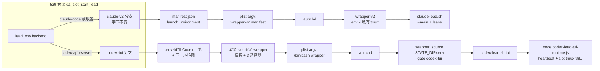
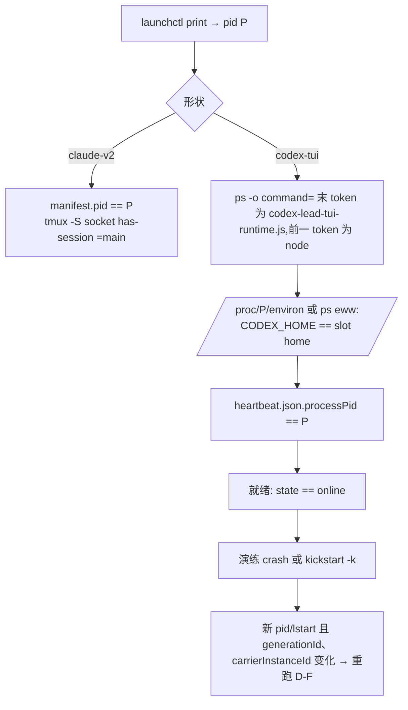
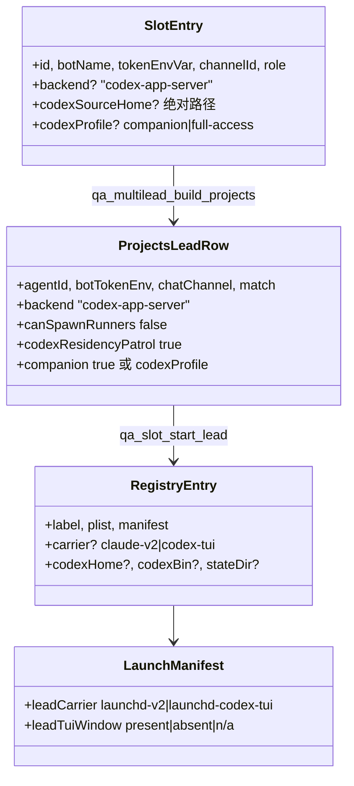

# FLY-2301 529 房台架支持 Codex 形状常驻 Lead — 实施计划
Issue: FLY-2301 (https://linear.app/geoforge3d/issue/FLY-2301/529-房台架能力-slot-常驻-lead-台架支持-codexcloud-形状raya-脑一族plist-argvenv)
日期: 2026-09-03
基于: research.md

> **执行合同:** 在 implement DAG 节点内按任务顺序执行;每个行为改动 RED → GREEN → REFACTOR;节点边界禁止派发 successor、merge、deploy。**全单不加任何开关 / 旋钮**(founder 直令 2026-09-03);形状只由 Lead 身份数据决定。

## 0. Lead 要求落点(question eb231cf9,2026-09-03)

| Lead 要求 | 落在哪 |
|---|---|
| ① 缺省 claude-code 逐字节不变要有守卫,且守卫要有**变异体阳性对照**;`codexSourceHome` 拒绝名单要有负向测试 | T1(黄金快照 + 变异体必红)、T5(拒绝名单负向) |
| ② `codex-lead.sh` state root 改动要有「同一输入下改前改后路径完全相同」的**实测** | T7(`git show HEAD:` 旧版 vs 工作副本,同 fixture 双跑比对日志行) |
| ③ 自愈边界到 launchd 层是「决定不做」,plan 原地写明 Bridge 侧 RayaBrainPatrol 不在本单 + 承接去处 | §2.2 |
| ④ 不加开关;验收必须含「既有 Claude Lead slot 房启动 + 验活回归全绿」 | §1 验收 A7、T12 |

## 1. 目标与验收标准

**Goal:** 529 slot 常驻台架按 Lead 载体形状分支(`claude-v2` 既有 / `codex-tui` 新增),plist argv、env 注入集、验活、就绪、拆除、自愈演练各自成立;新增形状只加分支,不改既有分支语义与字节。

**验收(全部必须成立):**

- A1 `~/.flywheel/test-slots.json` 某 slot 条目声明 `backend:"codex-app-server"` + `codexSourceHome` 后,`scripts/test-deploy.sh <slot>` 在 529 房起出一个 Codex 形状受管常驻 Lead:plist argv 恰 `/bin/bash <slot wrapper>`,launchd `RunAtLoad`+`KeepAlive` 生效。
- A2 隔离:CODEX_HOME 在 `${SLOT_DIR}/cdxh/<agent>`,state 在 `${SLOT_DIR}/q/<slot>/state/codex-lead/<key>`,tmux 窗口在 slot server;生产 `~/.flywheel/state/codex-lead/`、生产 tmux `flywheel` session、三个生产 Codex home 零写入(验收时前后 `find -newer` 对照)。
- A3 验活通过:launchd pid = `node …codex-lead-tui-runtime.js` 进程且环境 `CODEX_HOME` 精确匹配,`brain/heartbeat.json.processPid` 一致;就绪 = heartbeat `state=="online"`。
- A4 自愈演练:`crash`(kill -9)与 `kickstart`(`launchctl kickstart -k`)两式后,新 pid/lstart 且 heartbeat `generationId`/`carrierInstanceId` 变化,验活再次通过。
- A5 拆房:`test-teardown.sh <slot>` 后 label 不在 launchd 域、runtime/daemon 进程不存在、slot tmux 窗口不存在、SLOT_DIR 已删。
- A6 守卫:Claude plist 黄金快照测试通过,且其变异体对照(改坏缺省分支一处)必红;`codexSourceHome` 命中拒绝名单必拒。
- A7 **Claude 回归全绿**:`fly1663-qa-launchd.test.sh`、`test-deploy-fly1389.test.sh`、`test-deploy-multilead.test.sh`、`test-deploy-qa-room.test.sh` 全绿;真 529 房 Claude 形状 slot(`test-deploy.sh 2 --mode slot`)启动 + 验活 + 拆除全绿,其 plist / `.env` / manifest 与改动前渲染逐字节相同。
- A8 `codex-lead.sh` 改动前后,同 fixture 下 dry-run 日志中的 `state:` 路径逐字节相同(生产条件:`FLYWHEEL_STATE_DIR` 未设)。

## 2. 非目标与「决定不做」

### 2.1 非目标
- 退旧脑 / 生产单实例切换(FLY-2259 B)。
- 529 房造 Codex **工人**(FLY-2224 域)。
- 改 `flywheel-daemon.sh::classify_plist_lead_carrier`、`restart-services.sh`、`host-tmux-selection-gate.sh` census、`lead-restart-lifecycle.sh` 的闭合 carrier 集。
- full-access 层级的真机验收(只做 hermetic 环境投影断言;真机跑 companion 层,Mufasa 同形)。

### 2.2 决定不做(不是遗漏):Bridge 侧 RayaBrainPatrol 自愈
`raya-brain-patrol`(GatePoller rider)→ `scripts/resident-codex-lead-recover.sh` 这条链的权威绑在真 HOME 下的 `~/.flywheel/projects.json` + `~/.flywheel/manifests/<key>.json` + `~/Library/LaunchAgents/<label>.plist` + 三个固定 wrapper basename 各自硬编码的 `EXPECTED_CODEX_HOME`(`resident-codex-lead-recover.sh:60-95`)。让它对 slot 身份生效等于给生产自愈权威开一条按 env 改路径的口子,与 FLY-2216「不能从 manifest/env 注入路径」的安全决策对撞。**本单只到 launchd 层**:KeepAlive 崩溃重生 + `kickstart -k`(patrol 分类后执行的正是这一步)+ 生产同式收敛判据。**承接去处:** 若 FLY-2259 B 路线需要在 529 房演练 patrol 分类本身,由 FLY-2259 QA 用 Bridge 单测 fixture(`raya-brain-recover.test.sh` 已有 fake home / plist / launchctl / ps 替身)覆盖;若要真机演练,另立 issue 讨论「patrol 权威根可否随 FLYWHEEL_STATE_DIR」,不在本单夹带。

## 3. 架构

### 3.1 两种形状的启动链



### 3.2 验活 / 就绪 / 收敛判据



### 3.3 数据模型



## 4. 文件职责

| 文件 | 动作 | 责任 |
|---|---|---|
| `scripts/lib/qa-launchd-lead.sh` | 修改 | plist 渲染拆为外壳 + 形状片段;新增 codex 验活 / 就绪 / 探针 / home 铸造 / 演练;registry v2 |
| `scripts/lib/qa-codex-lead-wrapper.template.sh` | 新增 | slot 固定 Codex wrapper 模板(镜像生产 Codex wrapper 骨架) |
| `scripts/lib/qa-multilead.sh` | 修改 | slot 字段带出 `backend/codexSourceHome/codexProfile`;projects 行按形状渲染(缺省字节不变) |
| `scripts/test-deploy.sh` | 修改 | `qa_slot_start_lead` 形状分派、`.env` 投影、就绪分支、dev-channels 跳过、launch-manifest / room-info 字段、campaign manifest |
| `scripts/test-teardown.sh` | 修改 | 通过 registry v2 停 daemon(仅 codex 条目) |
| `packages/teamlead/scripts/codex-lead.sh` | 修改 1 处 | state root = `${FLYWHEEL_STATE_DIR:-$HOME/.flywheel}` |
| `scripts/__tests__/fly1663-qa-launchd.test.sh` | 修改 | 黄金快照 + 变异体对照 + codex 形状单元断言 |
| `scripts/__tests__/fly1663-qa-launchd-mutant.test.sh` | 新增 | 变异体阳性对照(独立进程跑坏版 lib,断言快照测试必红) |
| `scripts/__tests__/test-deploy-multilead.test.sh` | 修改 | 新 slot 字段 / projects 渲染正负例 |
| `scripts/__tests__/test-deploy-fly1389.test.sh` | 修改 | codex 形状 hermetic E2E;Claude slot 产物逐字节快照 |
| `scripts/__tests__/codex-lead-state-root.test.sh` | 新增 | Lead 要求②:旧版 vs 新版同 fixture 双跑比对 |
| `scripts/lib/path-hygiene.sh`、`scripts/__tests__/host-tmux-selection-s0-scope.test.sh` | 修改 | 新模板加入 PATH 声明清单 |
| `.github/workflows/ci.yml` | 修改 | 两个既有 step 各加新测试文件 |
| `doc/qa/framework/529-room-playbook.md` | 修改 | slot 条目新字段与 Codex 形状运行手册(含 auth 前置、演练命令) |
| `scripts/qa-fly-2301-codex-lead-drill.sh` | 新增 | 真机演练入口:读 room-info,跑 `crash`/`kickstart` 两式并输出证据 JSON |
| `engineering/doc/milestones/FLY-2301.md` | 新增 | PR 前作为 last commit |

## 5. 任务(TDD 顺序)

### T1 — Claude 形状黄金快照守卫 + 变异体阳性对照(Lead ①)
**RED**:`fly1663-qa-launchd.test.sh` 新增用例:固定输入(label / wrapper / manifest / home / state / projects / env / log / summary_home 全部为确定字符串)调用 `qa_launchd_render_plist`,与内嵌期望全文 `diff` 逐字节相同;`.env` 与 manifest 由 test-deploy 生成,放到 T10 快照。此用例在当前代码上即应 **绿**(它是守卫)。
**阳性对照**(新文件 `fly1663-qa-launchd-mutant.test.sh`):把 `qa-launchd-lead.sh` 拷到临时目录,`sed` 改坏 claude 片段一处(例如把 `<key>ThrottleInterval</key><integer>3</integer>` 改成 `4`),用环境变量 `FLY1663_QA_LAUNCHD_LIB_OVERRIDE=<mutant>` 让快照测试加载变异体,断言其退出码非 0 且输出含 `FAIL: claude plist golden snapshot`;再对 codex 片段做同样一处变异(T3 后生效)。变异体测试自身进 CI。
**GREEN**:无生产改动;若快照测试因输入不确定而抖动,先固定输入。

### T2 — plist 渲染拆分(行为不变)
**RED**:T1 快照。
**GREEN**:`qa_launchd_render_plist` 保持签名与全部校验,内部拆成 `_qa_launchd_plist_open`(前 3 行 + Label)、`_qa_launchd_plist_argv_claude`(原 `:81` 一行)、`_qa_launchd_plist_env_claude`(原 `:82-92`)、`_qa_launchd_plist_close`(原 `:93-97`)。**不新增参数**。快照必须仍绿(证明搬运零字节漂移)。

### T3 — codex 形状 plist + slot wrapper 渲染
**RED**:
- `qa_launchd_render_codex_plist plist label wrapper home state log slot_dir` 渲染出:argv 恰 `<string>/bin/bash</string><string>$wrapper</string>`;env 恰 5 键 `HOME PATH FLYWHEEL_DIR FLYWHEEL_STATE_DIR TMUX_TMPDIR`;其余(RunAtLoad/KeepAlive/Throttle/日志)与 claude 外壳同函数;不含 `manifest`、`FLYWHEEL_WRAPPER_ENV_FILE`、`FLYWHEEL_PROJECTS_FILE`。
- `qa_launchd_render_codex_wrapper template out project lead project_dir`:占位符仅 `@@PROJECT@@ @@LEAD_ID@@ @@PROJECT_DIR@@`;三者分别过 `^[A-Za-z0-9][A-Za-z0-9._-]*$`、同上、绝对路径且无控制字符;输出 mode 700;渲染后 `grep -c '@@'` 必为 0;`bash -n` 通过;含 `source "${FLYWHEEL_STATE_DIR}/.env"`、`gate codex-tui`、`exec /bin/bash "${FLYWHEEL_DIR}/packages/teamlead/scripts/codex-lead.sh" <project> <lead> <project-dir>`。负例:`project='../x'`、`lead` 含空格、`project_dir` 相对路径各自拒绝。
**GREEN**:新模板 `scripts/lib/qa-codex-lead-wrapper.template.sh`:
```bash
#!/bin/bash
# FLY-2301: slot-rendered Codex TUI Lead carrier (mirrors production Codex wrapper skeleton).
set -euo pipefail
FLYWHEEL_STATE_DIR="${FLYWHEEL_STATE_DIR:?}"
FLYWHEEL_DIR="${FLYWHEEL_DIR:?}"
ENV_FILE="${FLYWHEEL_STATE_DIR}/.env"
[ -f "$ENV_FILE" ] || { echo "[qa-codex-wrapper] ERROR: env file missing: $ENV_FILE" >&2; exit 1; }
set -a; # shellcheck source=/dev/null
source "$ENV_FILE"; set +a
export PATH="${HOME}/.local/bin:${HOME}/.npm-global/bin:/opt/homebrew/bin:/usr/local/bin:${PATH}"
# host tmux selection gate: same sequence as production Codex wrappers, carrier=codex-tui
… (gate/verify 段与 flywheel-codex-lead-wrapper-raya-tui-fullaccess.sh:26-95 同形,carrier 与 mount point 换名) …
exec /bin/bash "${FLYWHEEL_DIR}/packages/teamlead/scripts/codex-lead.sh" "@@LEAD_ID@@" "@@PROJECT_DIR@@" "@@PROJECT@@"
```
渲染用 `sed` 对已校验字面量替换(校验保证无 `/ & \` 等元字符),并用 `printf %s` 写临时文件后 `mv`。

### T4 — codex 进程探针 / 验活 / 就绪
**RED**(stub `launchctl` 复用既有;新增 stub `ps`、fixture heartbeat):
- `qa_launchd_process_env pid`:存在 `/proc/$pid/environ` 时 `tr '\0' '\n'`,否则 `ps eww -p pid -o command= | tr ' ' '\n'`;两者都不可用时返回 2 并打印 `probe unavailable`(显式失败,不静默)。
- `qa_launchd_codex_lead_verify label codex_home state_dir` → 成功输出 `pid<TAB>state_dir`:`ps -p P -o command=` 分词后恰一个 token 以 `/packages/teamlead/dist/lead-backends/codex/codex-lead-tui-runtime.js` 结尾且前一 token basename 为 `node`;探针含 `CODEX_HOME=$codex_home`;`$state_dir/brain/heartbeat.json`(拒绝 symlink,≤64KB)`.v==1 && .processPid==P`。轮询 / 间隔复用既有两个默认常量;pending 时同样不打 launchctl(沿用 T1 前的节流测试形状)。
- `qa_launchd_codex_lead_ready state_dir pid` → heartbeat `.state=="online" && .processPid==pid`。
- `qa_launchd_codex_state_dir state_root project lead` → 与 `codex-lead.sh:78-81` 同式(`tr -c`、`od -An -v -tx1`),单测用已知输入对照期望 hex。
**GREEN**:实现;既有 `qa_launchd_lead_verify` **一字不动**(快照与既有用例保证)。

### T5 — CODEX_HOME 铸造(含 Lead ① 负向)
**RED**:
- `qa_launchd_mint_codex_home source dest`:`source` 必须绝对、存在、含 `auth.json` 与 `packages/standalone/current/codex`;拒绝名单(realpath 比对)`$HOME/.codex-mufasa`、`$HOME/.codex-infra-bot`、`$HOME/.flywheel/raya/codex-home` → 返回 1 并输出 `refusing production Lead codex home`(三条各一负例);`dest` 必须在 `/tmp/flywheel-test-slot-*` 下;`${dest}/app-server-control/app-server-control.sock` 字节数 >100 → 拒绝(负例用超长 dest);成功后 `dest/auth.json`(mode 600)、`dest/packages/standalone/releases/<ver>`(先 `cp -Rc`,失败回落 `cp -R`)、`dest/packages/standalone/current` 为**相对** symlink `releases/<ver>`;`dest/packages/standalone/current/codex` 的 realpath 以 `dest/` 开头;不拷 `history.jsonl`/`sessions`/`goals_*.sqlite`/`logs_*`。
**GREEN**:实现;fixture 用几十字节的假 standalone 目录。

### T6 — registry v2、拆除、自愈演练
**RED**:
- `qa_launchd_register registry label plist manifest [carrier codexHome codexBin stateDir]`:4 参调用输出与今日 **逐字节相同**(既有用例 + 快照);8 参写入新键。
- `qa_launchd_stop_registry`:对含 `codexHome` 的条目 bootout 后执行 `CODEX_HOME=<home> <codexBin> remote-control stop --json`(stub `codex` 记录调用),失败只告警不中断后续条目;无新键条目路径不变(stub 断言 `codex` 未被调用)。
- `qa_launchd_lead_respawn_drill label carrier mode(crash|kickstart) [codex_home state_dir manifest]`:记录旧 `pid/lstart`(codex 再记 heartbeat `generationId/carrierInstanceId`);`crash` → `kill -9 P`;`kickstart` → `launchctl kickstart -k <domain>/<label>`;然后按 carrier 重跑对应 verify,断言 pid 或 lstart 变化,codex 再断言两 id 均变化;输出 JSON `{mode,oldPid,newPid,converged:true}`。stub launchctl 增加 `kickstart` 分支(换 pid);stub 心跳文件由测试改写模拟新 generation。
**GREEN**:实现。

### T7 — `codex-lead.sh` state root(Lead ②:实测而非推理)
**RED**(新 `scripts/__tests__/codex-lead-state-root.test.sh`):
1. 造 fixture:假 `FLYWHEEL_COMM_CLI`(`lead-identity resolve` 返回固定 canonical JSON)、假 projects、`FLYWHEEL_LEAD_DRY_RUN=1`、`FLYWHEEL_CODEX_LEAD_MODE=tui`、stub `node`(把收到的 argv 与 `FLYWHEEL_CODEX_LEAD_STATE_DIR` 写入 dump)。
2. `git show HEAD:packages/teamlead/scripts/codex-lead.sh > $T/old.sh`;工作副本为 `new.sh`;**同一 fixture、`FLYWHEEL_STATE_DIR` 未设**(生产条件)下各跑一次,断言两次 dump 的 `FLYWHEEL_CODEX_LEAD_STATE_DIR` 与 stderr 中 `Starting codex TUI Lead … state: <path>` 行**逐字节相同**;再设 `FLYWHEEL_STATE_DIR=$T/slot` 跑 `new.sh`,断言路径以 `$T/slot/state/codex-lead/` 开头,且 `old.sh` 在同输入下仍指向 `$HOME/.flywheel/...`(证明差异只来自本改动)。
**GREEN**:`codex-lead.sh:81` 改为
```bash
STATE_ROOT="${FLYWHEEL_STATE_DIR:-${HOME}/.flywheel}"
STATE_DIR="${STATE_ROOT}/state/codex-lead/${SAFE_PROJECT}__${SAFE_LEAD}-${IDENTITY_HEX}"
```
并在注释写明 FLY-2301 与字节兼容依据。

### T8 — slot 字段与 projects 行渲染
**RED**(`test-deploy-multilead.test.sh`):
- A1/A2 既有字节守卫不动;新增:`qa_multilead_build_projects` 第 12 参 `main_backend_json`(缺省 `{}`)为 `{"backend":"codex-app-server","codexProfile":"companion"}` 时,主 Lead 行多出 `backend/canSpawnRunners:false/codexResidencyPatrol:true/companion:true` 且其余键序不变;`codexProfile:"full-access"` 时写 `codexProfile:"full-access"` 不写 `companion`;非法 profile 拒绝。extra lead 走同一 jq 片段(字段来自 `qa_multilead_slot_fields` 新增的 `backend/codexSourceHome/codexProfile`,缺省空串)。
- `qa_multilead_slot_fields`:声明 `backend` 但缺 `codexSourceHome` → 失败并指名字段;`backend` 非 `codex-app-server` → 失败。
**GREEN**:实现。

### T9 — `test-deploy.sh` / `test-teardown.sh` 接线
**RED**:T10 的 hermetic E2E。
**GREEN**:
- `qa_slot_start_lead` 增参 `lead_backend lead_codex_source lead_codex_profile`(主 Lead 从 slots 文件读,extra Lead 从 EXTRA_LEADS_JSON 读);`case "$lead_backend"` 分派:
  - 缺省 / `claude-code`:现有代码**原样**(唯一差异是 registry 调用仍传 4 参)。
  - `codex-app-server`:`codex_home=${SLOT_DIR}/cdxh/${agent}` ← `qa_launchd_mint_codex_home`;`state_dir` ← `qa_launchd_codex_state_dir "$state" "$TEST_PROJECT_NAME" "$agent"`;`.env` = token 行 + `qa_slot_launch_env_json` 每个键值 `printf '%s=%q\n'` + Codex 一族(research 2.1;`FLYWHEEL_LEAD_SYSTEM_PROMPT_FILES="${identity},${REPO_ROOT}/packages/teamlead/lead-rules-base/companion-safety-contract.md"`;profile=full-access 时追加 research 2.2 五键);渲染 wrapper → codex plist → registry 8 参 → start → `qa_launchd_codex_lead_verify`;输出 `pid<TAB><state_dir><TAB>label<TAB><codex_home><TAB>pid_file`(第 2、4 列语义随形状,调用方按形状解读)。
- 步骤 2 就绪:claude 分支不变;codex 分支轮询 `qa_launchd_codex_lead_ready`,同一 `LEAD_READY_TIMEOUT_SEC` 预算;`confirm_dev_channels_prompt` 只在 claude 分支调用。
- 就绪后(codex):`tmux -S ${SLOT_DIR}/tmux-$(id -u)/default list-windows -t =flywheel -F '#{window_name}'` 含 `${TEST_PROJECT_NAME}-${agent}` → `leadTuiWindow=present`,否则 `absent`(不失败;写 log);claude 为 `n/a`。
- launch-manifest / room-info:`leadCarrier` 取 `launchd-v2|launchd-codex-tui`;新增 `leadTuiWindow`、`leadCodexHome`(codex 时)。
- campaign manifest 的 `leadManifest` 对 codex extra Lead 写空串;`qa_multilead_teardown_extra_leads` 对空串跳过(已是 `rm -f`,无需改)。
- `test-teardown.sh`:无改动即可(stop 走 registry v2);仅在 registry 停失败日志里带 carrier。

### T10 — hermetic E2E(Claude 快照 + Codex 形状)
**RED**(`test-deploy-fly1389.test.sh`):
- **Claude 快照**:对既有 `LEAD_SLOT` 部署产物 `launchd/<agent>/lead.plist`、`q/<slot>/.env`、`manifest.json`(去掉随机 token / 端口 / 时间字段后)与测试内嵌期望逐字节比对。期望文本先在**未改动的 main** 上生成一次并固化进测试(实施第一步即固化,作为改动前基线)。
- **Codex slot**:`make_slots_json` 新增 slot(`backend:"codex-app-server"`, `codexSourceHome:"$SB/codex-src"`,fixture 内含 `auth.json` + 假 standalone `packages/standalone/releases/0.0.0-test/codex` 可执行 + `current` 链接);假仓加 `packages/teamlead/scripts/codex-lead.sh` 替身(校验收到 3 个位置参数、`FLYWHEEL_CODEX_LEAD_MODE=tui`、`CODEX_HOME` 在 SLOT_DIR 下,然后 `exec node "$FR/packages/teamlead/dist/lead-backends/codex/codex-lead-tui-runtime.js"`)与假 runtime JS(启动即在 `${FLYWHEEL_STATE_DIR}/state/codex-lead/<key>/brain/heartbeat.json` 原子写 `{v:1,processPid,generationId:random,carrierInstanceId:random,state:"online",...}`,`setInterval` 驻留,SIGTERM 退出);stub `codex` 记录 `remote-control stop`。断言:plist argv 2 项、env 5 键;`.env` 含 Codex 一族且不含 `LEAD_ID=`/`PROJECT_NAME=`;验活输出 pid 等于 launchctl 替身 pid;room-info `leadCarrier=launchd-codex-tui`;演练 `crash` 后新 pid 且 generation 变(python launchctl 替身在 `print` 发现 pid 死亡时按 KeepAlive 语义重新 `Popen`);teardown 后 `codex` stub 记录到 `remote-control stop`,进程与目录消失。
- 负例:slot 声明 `codexSourceHome` 指向 `$FH1/.codex-mufasa` → test-deploy 在起 Lead 前失败,输出含 `refusing production Lead codex home`,无 plist 落盘。
**GREEN**:T9。

### T11 — CI / 清单 / 文档
- `ci.yml:352` 步骤追加 `fly1663-qa-launchd-mutant.test.sh`、`codex-lead-state-root.test.sh`;`:592` 步骤无需新增文件(fly1389 已在)。
- `path-hygiene.sh` 清单与 `host-tmux-selection-s0-scope.test.sh` 的 `PATH_DECLARATIONS` 加 `scripts/lib/qa-codex-lead-wrapper.template.sh`(模板含 native-first PATH 声明)。
- `doc/qa/framework/529-room-playbook.md`:slot 条目新字段、Codex 形状前置(隔离 home 需 `auth.json` 有效:`CODEX_HOME=<home> codex login`)、演练命令、证据文件位置。

### T12 — 真机验收脚本与 Claude 回归(Lead ④)
- `scripts/qa-fly-2301-codex-lead-drill.sh <slot> <crash|kickstart>`:读 `room-info.json`(`leadCarrier` 必须为 `launchd-codex-tui`,否则拒绝),调用 `qa_launchd_lead_respawn_drill`,输出证据 JSON 到 `${SLOT_DIR}/evidence/fly-2301-drill-<mode>.json`。
- 验收执行顺序(QA 节点):① 全部 shell 测试;② 真 529 房 Claude slot(`test-deploy.sh 2 --mode slot`)起 / 验 / 拆,并把渲染的 plist / `.env` 与 main 上同命令产物 `diff`(A7);③ 在 test-slots.json 给 slot 4 声明 codex 形状(`codexSourceHome=~/.codex-259-qa`,先 `codex login` 校验 auth),`test-deploy.sh 4 --mode slot` 起 / 验(A1–A3),两式演练(A4),隔离对照(A2),拆(A5);④ 恢复 slot 4 条目。**先拷证据再拆房**(`bridge.log`、`lead.log`、heartbeat 快照、drill JSON)。

## 6. 回滚边界

- 台架侧:全部改动在 `scripts/lib/*`、`scripts/test-deploy.sh`、`scripts/test-teardown.sh`、测试与文档;回滚 = revert PR,slot 条目不声明 `backend` 时新代码与旧代码产物逐字节相同(T1/T10 守卫)。
- 生产侧:唯一改动 `codex-lead.sh:81`;`FLYWHEEL_STATE_DIR` 未设时路径不变(T7 实测);回滚 = 恢复那两行。
- 运行时残留:拆房失败时 `launchd-leads.json` 仍是唯一 teardown 权威;`cdxh/<agent>` 随 SLOT_DIR 删除;daemon 若 `remote-control stop` 失败,日志指出 `CODEX_HOME` 与 pid 文件位置(`<home>/app-server-daemon/app-server.pid`)供手工处理。

## 7. 安全与边界核查

- 外部输入(slots 文件字段、模板占位符、路径)全部在 `qa_launchd_*` 入口校验:字符集、绝对路径、无控制字符、slot 目录前缀、socket 长度。
- 凭据:`auth.json` 只从显式 `codexSourceHome` 拷贝到 mode 600,拒绝三个生产 Lead home;`.env` mode 600;token 值不进 JSON / 日志。
- 身份不可 env 注入:选择器烘焙进 wrapper;`.env` 不含 `LEAD_ID/PROJECT_NAME/FLYWHEEL_PROJECTS`(runtime 与 resolver 双重拒绝)。
- 生产隔离:`TMUX_TMPDIR=${SLOT_DIR}` 钉住窗口;state / home / 日志 / registry 全在 SLOT_DIR;A2 验收用 `find -newer` 对照生产目录。
- 无 HTML / SQL 面。

## 8. 依赖与前置

- 机器上需要一个非生产、含有效 `auth.json` 与 standalone 的 Codex home(现成候选 `~/.codex-259-qa`,0.140.0)。
- `packages/teamlead` 已 build(`dist/lead-backends/codex/codex-lead-tui-runtime.js`、`lead-actions-main.js`)。
- FLY-2174 已在线(slot Bridge 收割器隔离),否则 slot Bridge 可能误伤;本单不依赖其 ingest token 部分。
