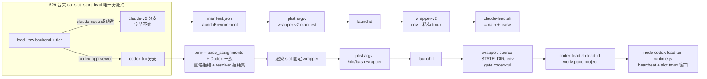
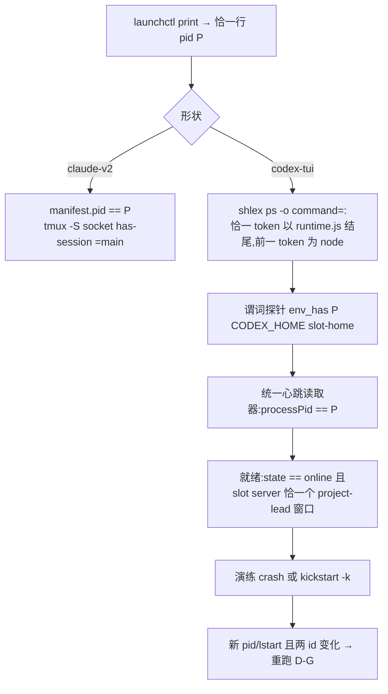

# FLY-2301 529 房台架支持 Codex 形状常驻 Lead — 实施计划
Issue: FLY-2301 (https://linear.app/geoforge3d/issue/FLY-2301/529-房台架能力-slot-常驻-lead-台架支持-codexcloud-形状raya-脑一族plist-argvenv)
日期: 2026-09-03
基于: research.md

> **执行合同:** 在 implement DAG 节点内按任务顺序执行;每个行为改动 RED → GREEN → REFACTOR;节点边界禁止派发 successor、merge、deploy。**全单不加任何开关 / 旋钮 / env 覆盖**(founder 直令 2026-09-03):载体形状只由 Lead 身份数据决定;测试不得为自己开任何环境变量选路(既有 `FLYWHEEL_QA_LEAD_WRAPPER` 等前置知识点不动也不新增同类)。**既有 Claude 形状的一切可见产物逐字节不变**:per-Lead plist / `.env` / manifest.json、全局 `launch-manifest.json` 与 stdout JSON(命名易变叶子除外)、既有日志行、teardown 行为与返回码。**生产代码只改 `codex-lead.sh` 一行。**

## 0. 评审要求落点

### 0.1 Lead 要求(question eb231cf9 / aa9cf4d4 / d57af923)
| Lead 要求 | 落在哪 |
|---|---|
| ① 缺省 claude-code 逐字节不变要有守卫,守卫要有**变异体阳性对照**;`codexSourceHome` 拒绝名单要有负向测试 | T1、T5 |
| ② `codex-lead.sh` state root 改动要有实测 | T7 |
| ③ 自愈边界是「决定不做」,写明承接 | §2.2 |
| ④ 不加开关;验收含 Claude 房回归全绿 | 执行合同、A7、T12 |
| ⑤ 任何为测试而生的开关都不许留;sentinel 覆盖日志与 stdout;不动 Claude 谓词写成决定不做 + 承接 | 执行合同、T9、§2.3 |
| ⑥(d57af923)净删除优先于给机制打补丁;每个变异体先自证改变字节否则自身判失败;Claude 键集与顺序进 T2 前基线并配变异 | §0.2 R2-H1、T1 |

### 0.2 Codex 三轮处置摘要
R1(13)与 R2(10)全部纳入(见 git 历史 rev2 / rev3 的 §0.2)。**R3(9,全部纳入,两处收窄)**:H1 生产改动回到**一行**(T7);H2 Codex `.env` 漏了固定基础赋值(含 `FLYWHEEL_PROJECTS_FILE`)→ 先建 `base_assignments` 向量再双投影,并断言进程只解析 slot projects 文件(T9/T10);H3 身份拒绝集扩为 canonical resolver 所有/断言/清理的全部变量(T9);H4 真房比对对全局 manifest / stdout 走命名叶子规范化(A7/T12),**收窄**:不做日志全文基线,只对既有 Claude 日志两行做逐字基数断言 + 一处变异(T1);H5 纯 Claude registry 走**逐字节相同的旧循环**,新收敛路径只在含 Codex 条目时启用(T6);M6 生产者接缝 = 纯搬运的 `scripts/lib/qa-lead-artifacts.sh`(T1);M7 形状元组校验器同时服务主 slot 与 extra(T8);M8 铸造事务子 shell 化、父目录与顺序写死(T5);M9 输出 / registry / 演练三方合同冻结(T9/T12)。

## 1. 目标与验收标准

**Goal:** 529 slot 常驻台架按 Lead 载体形状分支(`claude-v2` 既有 / `codex-tui` 新增),plist argv、env 注入集、验活、就绪、拆除、launchd 演练各自成立;新增形状只加分支,不改既有分支语义与字节。

- A1 slot 条目声明 `backend:"codex-app-server"` + `codexSourceHome` 后,`test-deploy.sh <slot> --mode slot` 起出 Codex 形状受管常驻 Lead:plist argv 恰 `/bin/bash <slot wrapper>`,`RunAtLoad`+`KeepAlive` 生效。
- A2 隔离:CODEX_HOME 在 `${SLOT_DIR}/cdxh/<agent>`,state 在 `${SLOT_DIR}/q/<slot>/state/codex-lead/<key>`;TUI 窗口只在 slot tmux server;默认 server `flywheel` 窗口清单前后 `cmp` 相同;生产 `~/.flywheel/state/codex-lead/`、`~/.flywheel/projects.json`(不被读取)、三个生产 Codex home 零写入 / 零读取。
- A3 验活:恰一行 launchd pid = `node …codex-lead-tui-runtime.js`,进程环境 `CODEX_HOME` 精确等于 slot home,心跳 `processPid` 一致;就绪 = 心跳 `state=="online"` 且字段有界,且 slot server 上恰一个该窗口。
- A4 launchd 演练:`crash` 与 `kickstart` 两式后新 pid/lstart、心跳两 id 均变、A3 重新成立、窗口恰一个;证据 JSON 含 T6 字段。
- A5 拆房收敛(Codex):label 不在域、runtime 与 daemon 进程消失、控制 socket 消失、窗口消失、SLOT_DIR 已删;失败 → 非零并保留 SLOT_DIR 与 registry。纯 Claude registry 的 teardown 行为、日志与返回码与今日逐字节相同。
- A6 守卫:Claude 五面基线各有专属变异体,且每个变异先自证改变字节;Claude 既有两行日志逐字基数断言 + 变异;Codex plist、去 `TMUX_TMPDIR`、去 stale-kill 各有必红变异;三个生产 home 拒绝各一负例;身份拒绝集表驱动负例。
- A7 Claude 回归全绿:四个既有 shell 套件 + 真 529 Claude slot 起 / 验 / 拆;plist / `.env` / per-Lead manifest 原始 `cmp -s` 相同;全局 manifest / stdout 经命名叶子规范化后 `cmp` 相同(原始 sha256 留档);产物在拆房前拷到外部目录。
- A8 `codex-lead.sh`:legacy 变体 vs 新脚本,`FLYWHEEL_STATE_DIR` 未设时逐字节相同;设了只有新脚本移动。

## 2. 非目标与「决定不做」

### 2.1 非目标
退旧脑 / 生产单实例切换(FLY-2259 B);529 房造 Codex 工人(FLY-2224);改 `flywheel-daemon.sh::classify_plist_lead_carrier`、`restart-services.sh`、host-tmux census、`lead-restart-lifecycle.sh` 闭合 carrier 集;full-access 真机验收;roundtable 模式下的 Codex 形状(产物前显式拒绝并声明);Claude 日志全文基线(见 T1 收窄)。

### 2.2 决定不做:Bridge 侧 RayaBrainPatrol
`raya-brain-patrol` → `scripts/resident-codex-lead-recover.sh` 的权威绑在真 HOME 下的 projects / manifests / LaunchAgents plist + 三个固定 wrapper basename 各自硬编码的 `EXPECTED_CODEX_HOME`(`:60-95`)。让其对 slot 身份生效等于给生产自愈权威开一条按 env 改路径的口子,与 FLY-2216「不能从 manifest/env 注入路径」对撞。本单只做 **launchd 重生 / 重启演练**:crash 覆盖 KeepAlive;`kickstart -k` 覆盖 patrol 分类后的执行器与共同后置条件;**不**覆盖 patrol 检测、权威复核、pre-mutation 收据、Bridge 触发。**承接:** FLY-2259 QA 用既有 `scripts/__tests__/resident-codex-lead-recover.test.sh` 与 `raya-resident-carrier.test.sh`;真机演练 patrol 本身另立 issue。

### 2.3 决定不做:既有 Claude PID 解析器 `qa_launchd_lead_pid`
它取第一行 `pid =`,比生产恢复脚本的「恰一行」宽。**不改**:只服务 Claude 分支,受「行为与字节逐位不变」合同约束;Claude 侧有 manifest pid 二次校验兜底。**承接:** 另立小单在 Claude 台架合同内收紧并补双 pid 行负例。Codex 分支用新的恰一行解析器(T4)。

## 3. 架构





```mermaid
classDiagram
  class SlotEntry { +backend? +codexSourceHome? +codexProfile? }
  class ProjectsLeadRow { +backend codex-app-server +canSpawnRunners false +codexResidencyPatrol true +companion true 或 codexProfile }
  class RegistryEntry { +label, plist, manifest 空串 +carrier codex-tui +codexHome, codexBin, stateDir, runtimePidFile }
  class LaunchManifest { +既有 Claude 键原样 +leadCarrier launchd-codex-tui +codexLead{label,stateDir,codexHome,tmuxSocket,tuiWindow} }
  SlotEntry --> ProjectsLeadRow
  ProjectsLeadRow --> RegistryEntry
  RegistryEntry --> LaunchManifest
```

## 4. 文件职责

| 文件 | 动作 | 责任 |
|---|---|---|
| `scripts/lib/qa-launchd-lead.sh` | 修改 | plist 外壳 + 形状片段;codex 探针 / 验活 / 就绪 / 心跳读取器 / home 铸造 / registry v2 / 收敛拆除(仅 Codex 路径) / 演练 |
| `scripts/lib/qa-lead-artifacts.sh` | 新增(纯搬运) | 从 `test-deploy.sh` 搬出:`qa_slot_launch_env_json`、per-Lead manifest jq、`.env` 写者、launch-manifest 组装、stdout JSON 渲染;`test-deploy.sh` source 后调用;搬运零字节漂移由 T1 基线守卫 |
| `scripts/lib/qa-codex-lead-wrapper.template.sh` | 新增 | slot 固定 Codex wrapper 模板 |
| `scripts/lib/qa-codex-lead-render.py` | 新增 | 精确占位符渲染 + 静态 exec 行校验 |
| `scripts/lib/qa-launchd-env.py` | 新增 | `.env` 赋值向量校验 / 投影(重名、resolver 拒绝集) |
| `scripts/lib/qa-multilead.sh` | 修改 | 形状元组校验器(主 slot 与 extra 共用);slot 字段;projects 行按形状渲染 |
| `scripts/test-deploy.sh` | 修改 | source 产物库;主 slot 形状校验;`base_assignments`;`lead_row` 分派;两个调用方形状感知解包;就绪 + 窗口硬门;Codex-only 输出字段 |
| `scripts/test-teardown.sh` | 修改 | 仅在 Codex 路径失败时补 `carrier= step=` 日志;Claude 路径日志不变 |
| `packages/teamlead/scripts/codex-lead.sh` | 修改 **1 行** | `:81` state 路径赋值 |
| `scripts/__tests__/fly1663-qa-launchd.test.sh` | 修改 | 基线 P + codex 单元断言 |
| `scripts/__tests__/qa-lead-artifact-fixtures.test.sh` | 新增 | source 产物库,不起房,渲染五面产物并比对基线;既有日志两行基数断言 |
| `scripts/__tests__/fly1663-qa-launchd-mutants.test.sh` | 新增 | 镜像目录变异体(先自证变字节,再证只红对应基线) |
| `scripts/__tests__/qa-codex-lead-layers.test.sh` | 新增 | 真 resolver / ProjectConfig / roster / `codex-lead.sh` / runtime parser / tui-home;projects 文件解析断言;拒绝集表驱动 |
| `scripts/__tests__/qa-codex-tmux-isolation.test.sh` | 新增 | 私有 TMPDIR 回落根双 server 判别 |
| `scripts/__tests__/codex-lead-state-root.test.sh` | 新增 | legacy 变体双跑 |
| `scripts/__tests__/test-deploy-multilead.test.sh` | 修改 | 形状元组校验器正负例(主 / extra 镜像表) |
| `scripts/__tests__/test-deploy-fly1389.test.sh` | 修改 | 一条未变异 Codex E2E(含 extra-Lead);纯 Claude registry teardown 转录 / 返回码断言 |
| `scripts/lib/path-hygiene.sh`、`host-tmux-selection-s0-scope.test.sh` | 修改 | 模板加入 PATH 声明清单 |
| `.github/workflows/ci.yml` | 修改 | `:352` 步骤追加新测试 |
| `doc/qa/framework/529-room-playbook.md` | 修改 | slot 字段、Codex 前置、roundtable 不支持、演练与证据 |
| `scripts/qa-fly-2301-codex-lead-drill.sh` | 新增 | `<slot> <crash|kickstart> <evidence-dir>` |
| `engineering/doc/milestones/FLY-2301.md` | 新增 | PR 前 last commit |

## 5. 任务(TDD 顺序)

### T1 — 五面 Claude 基线 + 生产者接缝 + 镜像变异体
**顺序:先冻结基线,再搬运,再加变异。**
1. **基线冻结**(未改动 main 上生成一次固化):P(`fly1663-qa-launchd.test.sh` 固定输入 → `qa_launchd_render_plist` 全文 `cmp`);P'/E/M/L/S 由一次既有 `LEAD_SLOT` hermetic 部署产物固化(per-Lead plist、`.env`、manifest.json、全局 `launch-manifest.json`、stdout JSON)。规范化只替换**命名易变叶子**:token 值、`TEAMLEAD_API_TOKEN`、端口、`SLOT_DIR` 前缀、`bridgePid`、`distSha`、`branchSha`、`runnerStartPoint`、`tempBranch`、时间戳;比对前断言键集合、键序与类型未变。`.env` fixture token 用含 `'` 与空格的敌意值,脱敏前先断言其 `%q` 原始编码。同时固化既有 Claude 日志两行的逐字形态:`Lead launchd label: <label>; private socket: <socket>` 与 extra Lead 的 `Extra Lead <agent> background PID:`(基数恰 1)。
2. **纯搬运**:把 `qa_slot_launch_env_json`、per-Lead manifest jq、`.env` 写者、launch-manifest 组装(现有 `qa_multilead_launch_manifest` + 追加 jq)、stdout JSON heredoc 提炼进 `scripts/lib/qa-lead-artifacts.sh`(函数签名 = 现有实参),`test-deploy.sh` source 后调用;搬运后五面基线与两行日志必须仍绿(这就是零漂移证明)。
3. **生产者级 fixture**(`qa-lead-artifact-fixtures.test.sh`):source 产物库,以固定输入渲染五面产物并 `cmp`;不起房、不需 built packages。
4. **变异体**(`fly1663-qa-launchd-mutants.test.sh`):镜像 `scripts/lib` + `scripts/__tests__` + `scripts/test-deploy.sh`;每个变异:替换计数恰 1 → **在镜像里生成产物并与基线比对,必须不同(否则该变异测试自身失败 `non-discriminating mutant`)** → 运行镜像 fixture,断言恰好对应基线失败、其余仍绿。变异集:Claude-only argv 行、Claude-only env 行、`.env` 写者(`%q`→`%s`)、manifest 写者(`launchEnvironment` 键名)、launch-manifest(`mainLeadLabel` 键名)、stdout JSON(`leadSocket` 键名)、Claude 日志行(`private socket:` 文案);T3 后追加 Codex argv;T10 后追加去 `TMUX_TMPDIR`、去 stale-kill(在真 tmux 测试里)。**E2E 只保留一条未变异。** CI 预算:fixture + 变异 < 60s;新 E2E 用例 ≈ 1–2 分钟;层测试 < 60s。

### T2 — plist 渲染拆分(行为不变)
`qa_launchd_render_plist` 签名与校验不变;内部拆为 open / argv_claude / env_claude / close。基线 P/P' 仍绿。

### T3 — codex plist + slot wrapper 渲染
- `qa_launchd_render_codex_plist plist label wrapper home state log slot_dir`:argv 恰 `<string>/bin/bash</string><string>$wrapper</string>`;env 恰 5 键 `HOME PATH FLYWHEEL_DIR FLYWHEEL_STATE_DIR TMUX_TMPDIR`;其余复用外壳。
- 渲染器 `qa-codex-lead-render.py render|check`:`lead_id` ~ `^[a-z0-9][a-z0-9-]*$`(`codex-lead.sh:30`);`project_name` ~ `^[A-Za-z0-9][A-Za-z0-9._-]*$`;`project_dir` 绝对、存在、匹配 `tui-window.ts:66` `SAFE_PATH` `^[A-Za-z0-9_./-]+$`(含空格 / `&` / `\` / `'` 是负例);占位符 `@@LEAD_ID@@ @@PROJECT_DIR@@ @@PROJECT@@` 各恰一次,值经 `shlex.quote`;输出 700,temp + rename;`check` 用 `shlex.split` 读 exec 行(**不执行**)断言 argv == `[/bin/bash, ${FLYWHEEL_DIR}/packages/teamlead/scripts/codex-lead.sh, lead_id, project_dir, project_name]`;`bash -n`。`project_dir` = 该 Lead 的 `workspace` 参数(主 `${SLOT_DIR}/lead-workspace`,extra `${XDIR}/lead-workspace`),与 `FLYWHEEL_CODEX_TUI_CWD` 同值。
- 模板骨架同 `flywheel-codex-lead-wrapper-raya-tui-fullaccess.sh`(`set -a; source "${FLYWHEEL_STATE_DIR}/.env"; set +a`、native-first PATH、`gate codex-tui`/`verify codex-tui`、exec 行)。无模板路径 env 覆盖。

### T4 — codex 探针 / 验活 / 就绪 / 心跳读取器
- `qa_launchd_lead_pid_exact label`:`^[[:space:]]*pid = [0-9]+[[:space:]]*$` 恰一行(同 `resident-codex-lead-recover.sh:115-122`);仅 Codex 路径。
- `qa_launchd_process_env_has pid name expected` → 0/1/2;`/proc` 存在且可读则 NUL 分词,否则 `ps eww -p pid -o command=`;≤64KB;不打印 env;诊断仅 `probe=<proc|ps|unavailable> match=<0|1>`。
- `qa_launchd_codex_process_matches pid`:python `shlex.split`;恰一 token 以 `/packages/teamlead/dist/lead-backends/codex/codex-lead-tui-runtime.js` 结尾、非 index 0、前一 token basename `node`;`ps -o stat=` 首字母 `Z` 视为不存活。
- `qa_launchd_read_heartbeat path`:lstat 拒 symlink、≤64KB、object、`v==1`、`processPid` 正整数、三个 id 非空 ≤256、`updatedAt` 非空 ≤64 → TSV;三处共用。
- `qa_launchd_codex_lead_verify label codex_home state_dir` → `pid<TAB>state_dir`。
- `qa_launchd_codex_lead_ready state_dir pid project lead tmux_socket`:心跳 online ∧ pid 一致 ∧ `tmux -S $tmux_socket list-windows -t =flywheel -F '#{window_name}'` 中 `${project}-${lead}` 恰一行。
- `qa_launchd_codex_state_dir state_root project lead`:同 `codex-lead.sh:78-81`。
- 负例:双 pid 行、node 前驱错、CODEX_HOME 异、symlink / 超大心跳、zombie、窗口 0 或 2 个。`qa_launchd_lead_verify` 一字不动。

### T5 — CODEX_HOME 铸造(事务在子 shell 内)
`qa_launchd_mint_codex_home source dest slot_root`(函数体 = `( set -e; trap cleanup EXIT INT TERM; … )` 子 shell,trap 只在子 shell 内,不触碰调用方 trap 表):
1. 词法与 canonical 校验:`slot_root` ∈ `/tmp/flywheel-test-slot-<n>` 或 `/private/tmp` 拼写;`dest` 已存在最近祖先 realpath 在 `realpath(slot_root)` 边界内;`dest` 不存在;source/dest realpath 互不包含;`source/auth.json` 非 symlink 常规文件;`source/packages/standalone/current` 解析为 `source/packages/standalone/releases/<name>` 的一个直接子目录(`<name>` ~ `^[A-Za-z0-9][A-Za-z0-9._-]*$`),其中 `codex` 可执行;拒绝名单(realpath)`$HOME/.codex-mufasa`、`$HOME/.codex-infra-bot`、`$HOME/.flywheel/raya/codex-home` → 1,stderr `refusing production Lead codex home`(fixture 结构完整;拒绝时 dest / stage 均不存在)。
2. `umask 077`;`mkdir -p "$(dirname dest)"`(即 `${SLOT_DIR}/cdxh`,由本函数创建,mode 700),创建后**复核**其 realpath 仍在 slot 边界内且非 symlink。
3. `stage=$(mktemp -d "$(dirname dest)/.cdxh-stage.XXXXXX")`(700);trap 在非成功退出时 `rm -rf "$stage"`。
4. 先克隆 release:`cp -Rc` 失败 → 清空 stage 内容后 `cp -R`;写 `current` 相对 symlink;校验 `stage/packages/standalone/current/codex` realpath 以 `stage/` 开头且可执行;`LC_ALL=C` 字节数 `len("$dest/app-server-control/app-server-control.sock") ≤ 100`。
5. **最后**拷 `auth.json`(600)。
6. `mv "$stage" "$dest"`(原子 rename)后清空 `stage` 变量使 trap 成为空操作;子 shell 正常退出。不拷 `history.jsonl / sessions / goals_* / logs_* / app-server-*`。
- 负例:dest 已存在、symlink 祖先逃逸、`current` 指向 releases 外、auth.json 为 symlink、socket 过长、**镜像变异删除 rename 行**(auth 已拷)→ 无 stage 残留、无 dest;成功与全部失败路径在 `/bin/bash`(3.2)与 CI bash 各跑一遍。

### T6 — registry v2、拆除(Claude 路径不变)、launchd 演练
- `qa_launchd_register registry label plist manifest [carrier codexHome codexBin stateDir runtimePidFile]`:4 参逐字节同今日;9 参写新键(Codex 条目 `manifest` 为**显式空串**)。
- `qa_launchd_stop_registry registry`:
  - **legacy 快路径**:registry 中**每个**条目都只有今日三键(`label/plist/manifest`)且无 `carrier` 键 → 执行**与今日逐字节相同的循环**(`qa-launchd-lead.sh:198-204`:逐 label `qa_launchd_lead_stop`,首个失败即 `return 1`),既有 `test-teardown.sh` 日志文案与返回码不变。测试:纯 Claude registry 的 stop 调用序列、日志、返回码转录与今日相同 + 一处变异。
  - **v2 路径**(存在任一 `carrier=codex-tui` 条目):逐条、聚合失败、末尾非零。Claude 条目仍只做既有 `qa_launchd_lead_stop`;Codex 条目:校验(`codexHome` realpath 在 registry 所在 slot 根内;`codexBin` realpath 以 `codexHome/packages/standalone/` 开头且可执行;否则记失败且不执行二进制)→ 记 launchd pid+lstart(label 已不在域时改读 `runtimePidFile` 的 pid 并以 `ps -o lstart=` 取 lstart,取不到则视为已消失)→ `bootout` → 等 `launchctl print` 不存在且 pid+lstart 消失(`Z` 视为消失)→ 读 `codexHome/app-server-daemon/app-server.pid` → `${FLYWHEEL_DIR}/scripts/lib/bounded-run.sh 30 env CODEX_HOME=<home> <codexBin> remote-control stop --json` → 等 daemon pid+lstart 消失且 `app-server-control/app-server-control.sock` 不存在 → 任一步超时/非零记失败继续下一条。`test-teardown.sh:734-738` 既有分支保留 SLOT_DIR 与 registry;仅 Codex 失败时追加 `carrier=codex-tui step=<…>` 日志行。
- `qa_launchd_lead_restart_drill label carrier mode(crash|kickstart) codex_home state_dir tmux_socket project lead`(Codex 形状全部必填;调用前逐个校验:label 匹配 `com.flywheel.qa.lead.slot-<n>.<agent>`,`codex_home`/`state_dir` 为 slot 内绝对路径,`tmux_socket` == `${SLOT_DIR}/tmux-$(id -u)/default` 且为 socket;任一缺失/畸形 → 在任何 `kill`/`launchctl` 之前返回 1):记旧 pid/lstart/两 id/心跳 sha256;`crash` → `kill -9`;`kickstart` → `launchctl kickstart -k <domain>/<label>`;重验 verify + ready(恰一窗);断言 pid 或 lstart 变化且两 id 均变;证据 JSON `{mode,label,domain,old:{pid,lstart,generationId,carrierInstanceId},new:{…},heartbeatPath,heartbeatSha256,tmuxSocket,predicates:{pidExact,processMatches,envHas,heartbeatPid,tuiWindowExactlyOne},startedAt,convergedAt}`,无 env / 凭据。
- 替身:`launchctl` 增 `kickstart -k`;`codex` 替身可配置「返回 0 但 pid 文件仍活」「非零」;用例:bootout 失败、stop 非零、stop 0 但 daemon 活、runtime 延迟退出、后续条目仍处理、`codexBin` 越界拒执行、label 已消失走 `runtimePidFile`。

### T7 — `codex-lead.sh` state root(一行)
新 `codex-lead-state-root.test.sh`:python 对工作副本做精确反向变异生成 `legacy.sh`(把 `STATE_DIR="${FLYWHEEL_STATE_DIR:-${HOME}/.flywheel}/state/codex-lead/${SAFE_PROJECT}__${SAFE_LEAD}-${IDENTITY_HEX}"` 这一行替换回 `STATE_DIR="${HOME}/.flywheel/state/codex-lead/${SAFE_PROJECT}__${SAFE_LEAD}-${IDENTITY_HEX}"`),断言替换计数恰 1 且 `diff` 恰一行;fixture(假 `FLYWHEEL_COMM_CLI` 返固定 canonical JSON、假 projects、`FLYWHEEL_LEAD_DRY_RUN=1`、`FLYWHEEL_CODEX_LEAD_MODE=tui`、`FLYWHEEL_CODEX_TUI_CWD`、dump-only runtime JS 放假仓 dist 路径、真 node);`FLYWHEEL_STATE_DIR` 未设:两者 dump 的 `FLYWHEEL_CODEX_LEAD_STATE_DIR` 与 stderr `state:` 行逐字节相同;设 `$T/slot`:仅新脚本移动。**GREEN**:`codex-lead.sh:81` **一行**改为上式。

### T8 — 形状元组校验器与 projects 行渲染
- `qa_multilead_validate_lead_shape backend codexSourceHome codexProfile` → 输出规范化 JSON `{backend, codexSourceHome, codexProfile}` 或失败(stderr 只含字段名):`backend` 缺省或 `claude-code` → 两个 Codex 字段必须都为空(否则 `orphan codex metadata`),输出 `{}`(显式 `claude-code` 与缺省等价,不产生任何新键);`backend=codex-app-server` → `codexSourceHome` 非空,`codexProfile` ∈ {空→companion, companion, full-access},其它值拒绝;其它 backend 拒绝。**主 slot 读取(`test-deploy.sh:636-650` 处)与 `qa_multilead_slot_fields` 都调用它**;主 / extra 各一张镜像负例表,失败时无 projects / Lead 产物。
- `qa_multilead_build_projects` 第 12 参 `main_lead_shape_json`(缺省 `{}`;A1/A2 不动):companion → `backend/canSpawnRunners:false/codexResidencyPatrol:true/companion:true`;full-access → `codexProfile:"full-access"`;extra lead 同 jq 片段。`codexSourceHome` 永不进入 projects JSON(断言)。

### T9 — `test-deploy.sh` 接线与三方合同
- **校验时点**:`qa_slot_start_lead` 开头先从 `$FLYWHEEL_PROJECTS` 字符串选定 `lead_row`,读 `backend/tier`;Codex 时立即取 `codexSourceHome`(主 Lead 来自已校验的主 slot 形状 JSON,extra 来自 `EXTRA_LEADS_JSON`)并校验存在性 / 拒绝名单 / roundtable(`MODE == mirror` 或 `ROUNDTABLE_CHANNEL_ID` 非空 → `codex carrier is not supported in roundtable mode`)—— 全部在 `mkdir`/写 projects/写 `.env` 之前;Claude 分支进入既有代码体,顺序不变。
- **一份赋值向量**:`base_assignments=("DISCORD_GUILD_ID=…" "BRIDGE_URL=…" "AGENT_SOURCE=…" "TEAMLEAD_API_TOKEN=…" "FLYWHEEL_PROJECTS_FILE=${projects}" "TEAMLEAD_DB_PATH=…" "FLYWHEEL_STATE_DIR=${state}" "FLYWHEEL_WRAPPER_ENV_FILE=${env_file}" "FLYWHEEL_DELIVERY_SECRET_PATH=…" "LEAD_WORKSPACE=${workspace}" "$@")`(顺序与今日 `:1442-1452` 完全一致);Claude:`qa_slot_launch_env_json "${base_assignments[@]}"`(行为不变);Codex:`qa-launchd-env.py` 输入 = token 行 + `base_assignments` + Codex 一族。
- **`.env` 规则**(`qa-launchd-env.py`):名字 ~ `^[A-Za-z_][A-Za-z0-9_]*$`;**任一重名即拒**(含 token 名与任何后续名撞名);**resolver 拒绝集**(canonical-lead-identity.sh 所断言 / 导出 / 清理者):`LEAD_ID PROJECT_NAME FLYWHEEL_LEAD_ID FLYWHEEL_PROJECT_NAME FLYWHEEL_LEAD_KEY FLYWHEEL_LEAD_BACKEND FLYWHEEL_LEAD_BOT_USER_ID FLYWHEEL_LEAD_ROLE FLYWHEEL_LEAD_MODEL FLYWHEEL_LEAD_EFFORT FLYWHEEL_LEAD_MODEL_CONTEXT_WINDOW FLYWHEEL_LEAD_SUMMARY_ROLE FLYWHEEL_LEAD_HAS_SUMMARY_DUTY FLYWHEEL_SUMMARY_GRANULARITY FLYWHEEL_SUMMARY_ASSIGNMENT_DIGEST FLYWHEEL_LEAD_IDENTITY_DIGEST FLYWHEEL_LEAD_PROJECTS_DIGEST FLYWHEEL_CANONICAL_IDENTITY_RESOLVED FLYWHEEL_CODEX_LEAD_ID FLYWHEEL_CODEX_LEAD_PROJECT FLYWHEEL_CODEX_LEAD_BOT_TOKEN_ENV DISCORD_STATE_DIR DISCORD_EXPECTED_BOT_USER_ID DISCORD_IDENTITY_MODE DISCORD_BOT_TOKEN FLYWHEEL_PROJECTS FLYWHEEL_SUMMARY_CONFIG_HOME FLYWHEEL_CODEX_LEAD_STATE_DIR FLYWHEEL_LEAD_DRY_RUN`;**无白名单**;报错只印变量名;输出 `NAME=<shlex.quote>`,600,temp+rename。Codex 一族值 = research 2.1(`FLYWHEEL_LEAD_CHAT_CHANNEL_ID=$CHAT_CHANNEL_ID`、`FLYWHEEL_COMM_DB=${HOME}/.flywheel/comm/${TEST_PROJECT_NAME}/comm.db`、`FLYWHEEL_COMM_CLI=${REPO_ROOT}/packages/flywheel-comm/dist/index.js`、`CODEX_HOME`、`FLYWHEEL_CODEX_BIN=$codex_home/packages/standalone/current/codex`、`FLYWHEEL_CODEX_LEAD_MODE=tui`、`FLYWHEEL_CODEX_TUI_CWD=$workspace`、`FLYWHEEL_CODEX_LEAD_OUTBOUND=direct`、`FLYWHEEL_LEAD_SYSTEM_PROMPT_FILES=${identity},${REPO_ROOT}/packages/teamlead/lead-rules-base/companion-safety-contract.md`;full-access 追加 research 2.2 五键)。表驱动负例:逐个注入拒绝集每个名字(含动态 token 名撞名)→ 产物前拒绝,stderr 不含值。
- Codex 分支流程:`codex_home` ← T5;`state_dir` ← T4;`.env`;渲染 wrapper(`project_dir=$workspace`)→ codex plist → registry 9 参(`manifest=""`,`runtimePidFile=${runtime}/pid`)→ start → verify;输出 `pid<TAB>state_dir<TAB>label<TAB>codex_home<TAB>pid_file`。
- **五列形状感知解包**(两个调用方):Claude:`LEAD_SOCKET=$raw2`、`_lead_manifest=$raw4`,既有日志 / `confirm_dev_channels_prompt` / 输出字节不变;Codex:`LEAD_STATE_DIR=$raw2`、`LEAD_CODEX_HOME=$raw4`,`LEAD_SOCKET=""`,打印 `Lead state dir: … ; codex home: …` 而非 `private socket` 行;extra 同理。
- 就绪:Codex 轮询 `qa_launchd_codex_lead_ready`(`tmux_socket=${SLOT_DIR}/tmux-$(id -u)/default`,同 `LEAD_READY_TIMEOUT_SEC`);失败走既有 stop + exit 1。`confirm_dev_channels_prompt` 只在 Claude。
- **输出合同(冻结)**:`launch-manifest.json` / stdout JSON 既有键、键序、值逐字节不变(Codex 时 `mainLeadSocket`/`leadSocket` 为空串,与 `--no-lead` 同形);顶层 `leadCarrier` 取 `launchd-codex-tui`;仿 `GENERALIZED_OUTPUT_FIELDS` 先例**条件追加** `codexLead:{label,stateDir,codexHome,tmuxSocket,tuiWindow:"present"}`;不出 `n/a`。
- sentinel:向量塞入 `QA_SENTINEL_SECRET=<随机>`(非拒绝集名,会被投影)与合法 token;断言二者的值不出现在 stdout、`launch-manifest.json`、`lead.log`、`bridge.log`、演练 JSON、测试自身输出中;`codexSourceHome` 也不得出现在 projects / manifests / stdout / 日志。

### T10 — hermetic 真实性(分层 + 一条 E2E + 隔离)
**`qa-codex-lead-layers.test.sh`**(CI 该 job 已 `pnpm build`;本地先 build;fake HOME 下**不存在** `~/.flywheel/projects.json`):
1. projects → 真 `flywheel-comm lead-identity resolve`:成功,`backend=="codex-app-server"`、`role=="companion"`。
2. 真 `ProjectConfig` + 真 roster:恰一项;删 `codexResidencyPatrol` → 0 项(阳性对照)。
3. 真 `codex-lead.sh` 到 exec 前一刻(真 comm dist、真 `canonical-lead-identity.sh`、真 node、dump-only runtime JS 在假仓 dist 路径、`FLYWHEEL_LEAD_DRY_RUN=1`),环境 = T9 `.env` 投影经 `set -a; source`:断言 dump 含 canonical 导出;`FLYWHEEL_CODEX_LEAD_STATE_DIR` 在 `FLYWHEEL_STATE_DIR` 下;`FLYWHEEL_PROJECTS_FILE` == slot projects 文件且解析成功(fake HOME 无生产 projects ⇒ 回落必失败,构成阳性对照:把 `FLYWHEEL_PROJECTS_FILE` 从投影中删除 → 解析失败);`base_assignments` 每个键与 Codex 一族每个键在 dump 中精确等于投影值。
4. full-access 按权威拆分:(a) 投影器输出恰含五键;(b) 真 `parseCodexLeadRuntimeConfig(env)`:companion 与 full-access 各通过;改 `FLYWHEEL_CODEX_LEAD_SANDBOX=read-only`、删 `FLYWHEEL_CODEX_LEAD_PROJECT_DIR`、改 `FLYWHEEL_LEAD_KEY`、删 `FLYWHEEL_LEAD_CHAT_CHANNEL_ID` → 各抛错;(c) 真 `codex-lead-tui-home.sh ensure-home`(fixture home,`FLYWHEEL_CODEX_LEAD_PROFILE=full-access`)删 `FLYWHEEL_LEAD_ACTIONS_MAIN_JS` 或 `FLYWHEEL_LEAD_ACTIONS_STATE_DIR` → `die`(`:530-533`);(d) 删 `FLYWHEEL_LEAD_ACTIONS_NODE_BIN` → 渲染 config 使用缺省 `node`。
5. 拒绝集表驱动(T9)在此文件执行。
**`test-deploy-fly1389.test.sh`**(一条未变异 Codex E2E + 一条 Codex extra-Lead + 纯 Claude teardown 转录):假仓补真 `codex-lead.sh`、真 `lib/canonical-lead-identity.sh`、真 `lead-rules-bundle.sh`,`packages/flywheel-comm/dist` symlink 真 dist,`codex-lead-tui-home.sh` 替身,假 runtime JS(启动校验 `FLYWHEEL_LEAD_KEY == ${FLYWHEEL_PROJECT_NAME}-${FLYWHEEL_LEAD_ID}`、`FLYWHEEL_LEAD_BACKEND==codex-app-server`、`CODEX_HOME` 与 state dir 在 slot 下、`FLYWHEEL_PROJECTS_FILE` 在 slot 下、三坐标非空,否则 `exit 78`;然后真 tmux 按 `tui-window.ts` 序列 `new-session -Ad -s flywheel` → `kill-window -t =flywheel:=<project>-<lead>` → `new-window`;写心跳(每次新随机两 id);SIGTERM 时 kill 窗口退出)。整个 harness 设私有 `TMPDIR=$SB/tmpdir`、清空 `TMUX`/`TMUX_TMPDIR`,launchctl 替身把 `TMPDIR` 传给子进程;替身 `launchctl`:持久化 job 规格,`print` 按 `ps -o stat=` 的 `Z`/不存在判死,`KeepAlive` 为 true 才重生(`start_new_session`,回收交宿主 init),实现 `kickstart -k`,`bootout` 后不再重生。用例:起 / 验 / 就绪(恰一窗)/ `crash` 与 `kickstart`(新 pid、新 id、仍恰一窗)/ 拆房收敛(`codex` 替身记录 stop,pid 文件与 socket 被替身删除后才收敛);extra Codex Lead 与主 Lead 的 workspace / home / state / label / 窗口五坐标两两不同;负例:`codexSourceHome` → 结构完整假 `.codex-mufasa` 在起 Lead 前失败、无任何产物;roundtable 模式 → 产物前拒绝;**纯 Claude registry teardown**:stop 调用序列 / 日志 / 返回码与冻结转录相同。
**`qa-codex-tmux-isolation.test.sh`**(真 tmux):整测 `TMPDIR=$T/default-root`、`TMUX`/`TMUX_TMPDIR` 清空;哨兵 `flywheel` 会话经回落根创建并记窗口清单;假 runtime 以 `TMUX_TMPDIR=$T/slot` 运行 → 窗口只在 `$T/slot/tmux-<uid>/default`,哨兵清单 `cmp` 相同;变异:去 `TMUX_TMPDIR` → 窗口落到哨兵,`cmp` 必不同;去 stale kill → crash 后 2 窗(必红);断言 `/tmp/tmux-<uid>` mtime 不变;结束 kill 两个私有 server。

### T11 — CI / 清单 / 文档
`ci.yml:352` 步骤追加 `qa-lead-artifact-fixtures.test.sh`、`fly1663-qa-launchd-mutants.test.sh`、`codex-lead-state-root.test.sh`、`qa-codex-lead-layers.test.sh`、`qa-codex-tmux-isolation.test.sh`;`path-hygiene.sh` 与 s0-scope 清单加模板;playbook:slot 字段、`codexSourceHome` 前置(`CODEX_HOME=<home> codex login`)、roundtable 不支持、演练命令与外部证据目录、双 server 清单对照法。

### T12 — 真机验收
- `scripts/qa-fly-2301-codex-lead-drill.sh <slot> <crash|kickstart> <evidence-dir>`:`evidence-dir` 必填且在 SLOT_DIR 外;读 `${SLOT_DIR}/launch-manifest.json`,要求 `leadCarrier == launchd-codex-tui` 且 `codexLead.{label,stateDir,codexHome,tmuxSocket}` 齐全,校验 `tmuxSocket == ${SLOT_DIR}/tmux-$(id -u)/default`、`stateDir`/`codexHome` 在 SLOT_DIR 内(缺失/畸形 → 在任何信号或 `launchctl` 前拒绝);调用 `qa_launchd_lead_restart_drill "$label" codex-tui "$mode" "$codexHome" "$stateDir" "$tmuxSocket" "$projectName" "$agentId"`(project/agent 来自同一 manifest);证据 JSON + 当时 `launch-manifest.json` + 心跳快照 + 两个 tmux server 窗口清单原子写入 `evidence-dir`。
- 顺序:① 全部 shell 测试;② 真 529 Claude slot(`test-deploy.sh 2 --mode slot`)起 / 验 / 拆:plist / `.env` / per-Lead manifest 与 main 同命令产物原始 `cmp -s`;全局 manifest / stdout 先断言键序类型再做 T1 同一规范化后 `cmp`;原始 sha256 留档;全部产物拆房前拷到外部目录;③ slot 4 声明 codex 形状(`codexSourceHome=~/.codex-259-qa`,先 `codex login` 校验),记录默认 tmux server 清单、`~/.flywheel/projects.json` atime/mtime、生产目录 mtime 基线;`test-deploy.sh 4 --mode slot`;A1–A3;两式演练(A4);拆房(A5);对照 A2 基线;④ 证据已在外部目录;⑤ 恢复 slot 4 条目。

## 6. 回滚边界
台架侧全部在 `scripts/lib/*`、`scripts/test-deploy.sh`、`scripts/test-teardown.sh`、测试与文档;不声明 `backend` 时五面产物、日志两行、teardown 行为逐字节相同(T1/T6 守卫)。生产侧唯一改动 `codex-lead.sh` 一行(T7)。拆房失败时 SLOT_DIR、registry、`cdxh/<agent>` 保留。

## 7. 安全与边界核查
外部输入入口校验(字符集、绝对路径、`SAFE_PATH`、canonical 包含性、socket 长度);凭据只从显式 `codexSourceHome` 拷到 600 且子 shell 事务性 staging;`.env` 600、重名拒绝、resolver 拒绝集;身份不可 env 注入;探针不打印 env;演练 / manifest / stdout / 日志无 token 与 `codexSourceHome`;`TMUX_TMPDIR` 硬门 + 私有回落根双 server 测试;`codexBin` 包含性校验后才执行;进程只解析 slot projects 文件。

## 8. 依赖与前置
非生产、含有效 `auth.json` 与 standalone 的 Codex home(候选 `~/.codex-259-qa`);`pnpm build` 后的 dist(CI 该 job 已 build 并装 tmux);FLY-2174 已在线。
