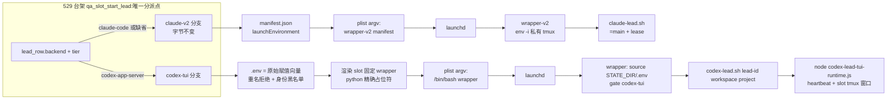
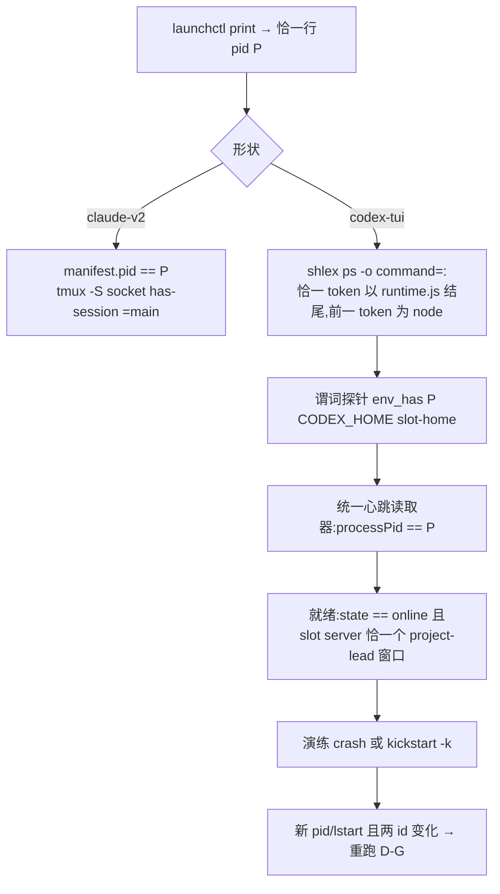
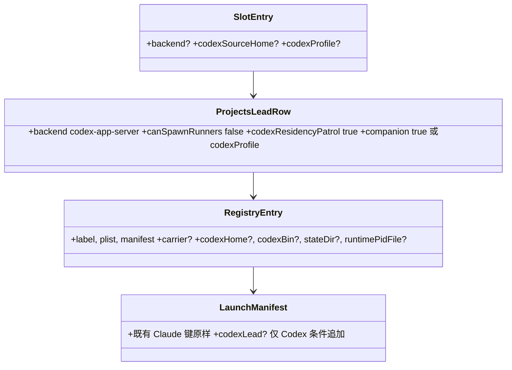

# FLY-2301 529 房台架支持 Codex 形状常驻 Lead — 实施计划
Issue: FLY-2301 (https://linear.app/geoforge3d/issue/FLY-2301/529-房台架能力-slot-常驻-lead-台架支持-codexcloud-形状raya-脑一族plist-argvenv)
日期: 2026-09-03
基于: research.md

> **执行合同:** 在 implement DAG 节点内按任务顺序执行;每个行为改动 RED → GREEN → REFACTOR;节点边界禁止派发 successor、merge、deploy。**全单不加任何开关 / 旋钮 / env 覆盖**(founder 直令 2026-09-03):载体形状只由 Lead 身份数据决定;测试不得为自己开任何环境变量选路(既有 `FLYWHEEL_QA_LEAD_WRAPPER` 等前置知识点不动也不新增同类)。**既有 Claude 形状的一切可见产物逐字节不变**:per-Lead plist / `.env` / manifest.json、全局 `launch-manifest.json`、stdout JSON、日志行。

## 0. 评审要求落点

### 0.1 Lead 要求(question eb231cf9 / aa9cf4d4)
| Lead 要求 | 落在哪 |
|---|---|
| ① 缺省 claude-code 逐字节不变要有守卫,守卫要有**变异体阳性对照**;`codexSourceHome` 拒绝名单要有负向测试 | T1(五份基线 + 逐产物变异体,镜像目录法,变异必须先证明「确实改变字节」)、T5 |
| ② `codex-lead.sh` state root 改动要有「同一输入下改前改后路径完全相同」的**实测** | T7 |
| ③ 自愈边界到 launchd 层是「决定不做」,写明 RayaBrainPatrol 不在本单 + 承接去处 | §2.2;全文称「launchd 重生 / 重启演练」 |
| ④ 不加开关;验收必须含「既有 Claude Lead slot 房启动 + 验活回归全绿」 | 执行合同、A7、T12 |
| ⑤(aa9cf4d4)任何「为测试而生的开关」都不许留;sentinel 断言覆盖日志与 stdout 两侧;不动既有 Claude 谓词要写成「决定不做 + 承接」 | 执行合同、T9 sentinel、§2.3 |

### 0.2 Codex R1(13 条)→ 全部纳入;R2(10 条)→ 全部纳入
R1:H1 镜像目录法无 env 覆盖(T1);H2 只从 `lead_row` 分派(T9);H3 真实 argv 位置序 + launcher 正则 + python 精确占位符(T3);H4 反向变异 legacy 变体(T7);H5 分层真实性(T10);H6 窗口硬门 + 双 server 判别(T4/T10);H7 谓词探针 + 单一 map(T4/T9);H8 收敛拆除(T6);M9 恰一行 pid 等(T4/T10,Claude 谓词不动 → §2.3);M10 演练读 `launch-manifest.json`(T9/T12);M11 铸造包含性(T5);M12 变异覆盖(T1);M13 改名 + 证据字段(T6)。
R2:H1 白名单撞死现有环境 → **删掉白名单**(它是本单新长出来的机制),只保留重名拒绝 + 身份命名空间黑名单;先建原始赋值向量再投影;roundtable 模式下 Codex 形状在产物前显式拒绝(T9)。H2 层测试消费者错配 → 假 runtime JS 放真实路径、全程真 node;full-access 断言按权威拆分(T10)。H3 双 server 变异体不安全 → 私有 `TMPDIR` 回落根(T10)。H4 Claude 全局 manifest / stdout 被改 → 条件追加 Codex-only 字段,无 `n/a`,纳入基线(T1/T9)。H5 假变异 + 全房重跑 → 变异先证明改变字节;生产者级 fixture;一条未变异 E2E;CI 预算(T1)。H6 `project_dir` 钉死 + 文法冲突 → 用各 Lead 的 `workspace` 参数;对齐 `SAFE_PATH`;`shlex.split` 静态校验;extra-Lead 用例(T3/T10)。M7 假 runtime 缺 stale kill、替身 reap 不实 → 真序列 + 恰一窗;按 `Z` 判死(T10)。M8 五列解包 / 校验时点 / 孤儿字段 / 不序列化(T9/T8)。M9 staging 清理与权限(T5)。L10 引用修正(T4/§2.2)。

## 1. 目标与验收标准

**Goal:** 529 slot 常驻台架按 Lead 载体形状分支(`claude-v2` 既有 / `codex-tui` 新增),plist argv、env 注入集、验活、就绪、拆除、launchd 演练各自成立;新增形状只加分支,不改既有分支语义与字节。

- A1 slot 条目声明 `backend:"codex-app-server"` + `codexSourceHome` 后,`test-deploy.sh <slot> --mode slot` 起出 Codex 形状受管常驻 Lead:plist argv 恰 `/bin/bash <slot wrapper>`,`RunAtLoad`+`KeepAlive` 生效。
- A2 隔离:CODEX_HOME 在 `${SLOT_DIR}/cdxh/<agent>`,state 在 `${SLOT_DIR}/q/<slot>/state/codex-lead/<key>`;TUI 窗口 `<project>-<agent>` **只**在 slot tmux server;默认 server `flywheel` 会话窗口清单前后 `cmp` 相同;生产 `~/.flywheel/state/codex-lead/`、三个生产 Codex home 零写入。
- A3 验活:恰一行 launchd pid = `node …codex-lead-tui-runtime.js`(shlex 分词),进程环境 `CODEX_HOME` 精确等于 slot home(谓词探针),心跳 `processPid` 一致;就绪 = 心跳 `state=="online"` 且 id/时间字段非空有界,**且** slot server 上恰有一个该窗口(QA 硬门)。
- A4 launchd 演练(不是 patrol 自愈):`crash` 与 `kickstart` 两式后新 pid/lstart、心跳两 id 均变化、A3 重新成立、窗口恰一个;证据 JSON 含 T6 字段。
- A5 拆房收敛:label 不在域、runtime 与 daemon 进程消失、控制 socket 消失、窗口消失、SLOT_DIR 已删;任一步失败 → 非零,SLOT_DIR 与 registry 保留。
- A6 守卫:Claude 五面基线(plist / `.env` / manifest.json / 规范化 `launch-manifest.json` / 规范化 stdout JSON)各有专属变异体必红,且每个变异先被证明改变了产物字节;Codex plist 变异、去 `TMUX_TMPDIR` 变异、去 stale-kill 变异各必红;三个生产 home 拒绝各一负例。
- A7 Claude 回归全绿:四个既有 shell 套件 + 真 529 Claude slot 起 / 验 / 拆,五面产物与 main 同命令产物 `cmp -s` 相同(hash 报告,不 diff 凭据文件)。
- A8 `codex-lead.sh`:legacy 变体 vs 新脚本,`FLYWHEEL_STATE_DIR` 未设时逐字节相同;设了只有新脚本移动。

## 2. 非目标与「决定不做」

### 2.1 非目标
退旧脑 / 生产单实例切换(FLY-2259 B);529 房造 Codex 工人(FLY-2224);改 `flywheel-daemon.sh::classify_plist_lead_carrier`、`restart-services.sh`、host-tmux census、`lead-restart-lifecycle.sh` 闭合 carrier 集;full-access 真机验收;**roundtable 模式(`--mode mirror` / roundtable env)下的 Codex 形状**(本单在产物前显式拒绝并声明:Codex 常驻 Lead 的 roundtable 参与是 FLY-2259 / Raya 侧行为,不是台架形状问题)。

### 2.2 决定不做:Bridge 侧 RayaBrainPatrol
`raya-brain-patrol` → `scripts/resident-codex-lead-recover.sh` 的权威绑在真 HOME 下的 projects / manifests / LaunchAgents plist + 三个固定 wrapper basename 各自硬编码的 `EXPECTED_CODEX_HOME`(`:60-95`)。让其对 slot 身份生效等于给生产自愈权威开一条按 env 改路径的口子,与 FLY-2216「不能从 manifest/env 注入路径」对撞。本单只做 **launchd 重生 / 重启演练**:crash 覆盖 KeepAlive;`kickstart -k` 覆盖 patrol 分类后的执行器与共同后置条件;**不**覆盖 patrol 检测、权威复核、pre-mutation 收据、Bridge 触发。**承接:** patrol 分类与恢复脚本由 FLY-2259 QA 用既有 `scripts/__tests__/resident-codex-lead-recover.test.sh` 与 `raya-resident-carrier.test.sh` fixture 覆盖;真机演练 patrol 本身需另立 issue 讨论「patrol 权威根可否随 FLYWHEEL_STATE_DIR」。

### 2.3 决定不做:既有 Claude PID 解析器 `qa_launchd_lead_pid`
它取 `launchctl print` 第一行 `pid =`,比生产恢复脚本的「恰一行」宽。**不改**:它只服务 Claude 分支,而 Claude 分支受「行为与字节逐位不变」合同约束;Claude 侧已有 manifest pid 二次校验兜底。**承接:** 若要收紧,另立小单在 Claude 台架合同内做,并同步 `fly1663-qa-launchd.test.sh` 的双 pid 行负例。Codex 分支一律用新的恰一行解析器(T4)。

## 3. 架构

## 4. 文件职责

| 文件 | 动作 | 责任 |
|---|---|---|
| `scripts/lib/qa-launchd-lead.sh` | 修改 | plist 外壳 + 形状片段;codex 探针 / 验活 / 就绪 / 心跳读取器 / home 铸造 / registry v2 / 收敛拆除 / 演练 |
| `scripts/lib/qa-codex-lead-wrapper.template.sh` | 新增 | slot 固定 Codex wrapper 模板 |
| `scripts/lib/qa-codex-lead-render.py` | 新增 | 精确占位符渲染 + 静态 exec 行校验 |
| `scripts/lib/qa-launchd-env.py` | 新增 | `.env` 原始向量校验 / 投影(重名、黑名单) |
| `scripts/lib/qa-multilead.sh` | 修改 | slot 字段;projects 行按形状渲染;孤儿字段拒绝 |
| `scripts/test-deploy.sh` | 修改 | 原始赋值向量;`lead_row` 分派;两个调用方的形状感知解包;就绪 + 窗口硬门;Codex-only 输出字段 |
| `scripts/test-teardown.sh` | 修改 | 日志补 carrier/step(既有失败分支已保留目录) |
| `packages/teamlead/scripts/codex-lead.sh` | 修改 2 行 | state root |
| `scripts/__tests__/fly1663-qa-launchd.test.sh` | 修改 | 基线 P + codex 单元断言 |
| `scripts/__tests__/qa-lead-artifact-fixtures.test.sh` | 新增 | 生产者级 fixture:不起房,渲染五面产物并与基线比对 |
| `scripts/__tests__/fly1663-qa-launchd-mutants.test.sh` | 新增 | 镜像目录变异体(先证变字节,再证只红对应基线) |
| `scripts/__tests__/qa-codex-lead-layers.test.sh` | 新增 | 真 resolver / ProjectConfig / roster / `codex-lead.sh` / runtime parser / tui-home |
| `scripts/__tests__/qa-codex-tmux-isolation.test.sh` | 新增 | 私有 TMPDIR 回落根双 server 判别 |
| `scripts/__tests__/codex-lead-state-root.test.sh` | 新增 | legacy 变体双跑 |
| `scripts/__tests__/test-deploy-multilead.test.sh` | 修改 | slot 字段 / projects 渲染 / 孤儿字段 |
| `scripts/__tests__/test-deploy-fly1389.test.sh` | 修改 | 一条未变异 Codex 生命周期 E2E(含 extra-Lead) |
| `scripts/lib/path-hygiene.sh`、`host-tmux-selection-s0-scope.test.sh` | 修改 | 模板加入 PATH 声明清单 |
| `.github/workflows/ci.yml` | 修改 | `:352` 步骤追加新测试 |
| `doc/qa/framework/529-room-playbook.md` | 修改 | slot 字段、Codex 前置、演练与证据、roundtable 不支持声明 |
| `scripts/qa-fly-2301-codex-lead-drill.sh` | 新增 | `<slot> <crash|kickstart> <evidence-dir>` |
| `engineering/doc/milestones/FLY-2301.md` | 新增 | PR 前 last commit |

## 5. 任务(TDD 顺序)

### T1 — 五面 Claude 基线 + 生产者级 fixture + 镜像变异体
**基线冻结(T2 之前,未改动 main 上生成一次固化)**:
- P:`fly1663-qa-launchd.test.sh` 固定输入 → `qa_launchd_render_plist` 全文 `cmp`。
- 新 `qa-lead-artifact-fixtures.test.sh`(**不起房**):把 `test-deploy.sh` 中的产物生成函数(`qa_slot_launch_env_json`、manifest jq、`.env` 写者、launch-manifest jq、stdout JSON heredoc)以固定输入驱动 —— 实现时把 stdout JSON heredoc 与 launch-manifest 组装提炼为可调用函数(**纯搬运,输出字节不变,由本基线本身守卫**)。五面:plist(P')、`.env`(E)、manifest.json(M)、launch-manifest.json(L)、stdout JSON(S)。规范化只替换**命名叶子**(token 值、`TEAMLEAD_API_TOKEN`、端口、`SLOT_DIR` 前缀、`branchSha`、时间戳),比对前断言键集合、键序与类型未变;`.env` 的 fixture token 用含 `'` 与空格的敌意值,并在脱敏前断言其 `%q` 原始编码。
**变异体(`fly1663-qa-launchd-mutants.test.sh`)**:复制 `scripts/lib` + `scripts/__tests__` + `scripts/test-deploy.sh` 到临时镜像(生产者级 fixture 不需要 built packages,闭合就是这三处);每个变异:① 断言替换计数恰 1;② **先在镜像里生成产物并与基线比对,必须不同**(否则该变异体测试自身失败:`non-discriminating mutant`);③ 运行镜像里的 fixture 测试,断言恰好对应基线失败、其余基线仍绿。变异集:Claude-only argv 行(少一个 `<string>`)、Claude-only env 行(`FLYWHEEL_WRAPPER_ENV_FILE` 键名)、`.env` 写者(`%q` → `%s`,敌意 token 保证字节变化)、manifest 写者(`launchEnvironment` 键名)、launch-manifest(`mainLeadLabel` 键名)、stdout JSON(`leadSocket` 键名);T3 后追加 Codex argv(去 `/bin/bash`);T10 后追加去 `TMUX_TMPDIR`、去 stale-kill(这两条在真 tmux 的隔离 / 生命周期测试里做)。**E2E 只保留一条未变异**。CI 预算:fixture + 变异 < 60s;新 E2E 用例 ≈ 既有 fly1389 单用例耗时 ×1(约 1–2 分钟);层测试 < 60s。

### T2 — plist 渲染拆分(行为不变)
`qa_launchd_render_plist` 签名与校验不变;内部拆为 open / argv_claude / env_claude / close。基线 P/P' 仍绿。

### T3 — codex plist + slot wrapper 渲染
**RED**:
- `qa_launchd_render_codex_plist plist label wrapper home state log slot_dir`:argv 恰 `<string>/bin/bash</string><string>$wrapper</string>`;env 恰 5 键 `HOME PATH FLYWHEEL_DIR FLYWHEEL_STATE_DIR TMUX_TMPDIR`;其余复用外壳。
- 渲染器 `qa-codex-lead-render.py render template out lead_id project_dir project_name` 与 `qa-codex-lead-render.py check out lead_id project_dir project_name`:
  - `lead_id` ~ `^[a-z0-9][a-z0-9-]*$`(`codex-lead.sh:30`);`project_name` ~ `^[A-Za-z0-9][A-Za-z0-9._-]*$`;`project_dir` 绝对、存在、且匹配 `tui-window.ts:66` 的 `SAFE_PATH` `^[A-Za-z0-9_./-]+$`(TUI cwd 与 codexHome 都要过它;含空格 / `&` / `\` / `'` 的路径是**负例**)。
  - 占位符 `@@LEAD_ID@@ @@PROJECT_DIR@@ @@PROJECT@@` 各恰一次;值经 `shlex.quote`;输出 mode 700,temp + rename;`check` 读回 exec 行 `shlex.split`(**不执行**),断言 argv == `[/bin/bash, ${FLYWHEEL_DIR}/packages/teamlead/scripts/codex-lead.sh, lead_id, project_dir, project_name]`(`codex-lead.sh` 真实位置序 `:25-26,55`)且无 `@@`;`bash -n` 通过。
  - `project_dir` = **该 Lead 的 `workspace` 参数**(`qa_slot_start_lead` 第 8 参:主 Lead `${SLOT_DIR}/lead-workspace`,extra Lead `${XDIR}/lead-workspace`),与 `FLYWHEEL_CODEX_TUI_CWD` 同值。
**GREEN**:模板(骨架同 `flywheel-codex-lead-wrapper-raya-tui-fullaccess.sh`:`set -a; source "${FLYWHEEL_STATE_DIR}/.env"; set +a`、native-first PATH、`gate codex-tui`/`verify codex-tui`、exec 行)。无模板路径 env 覆盖;hermetic 假仓在同一相对路径放自己的模板。

### T4 — codex 探针 / 验活 / 就绪 / 心跳读取器
- `qa_launchd_lead_pid_exact label`:`^[[:space:]]*pid = [0-9]+[[:space:]]*$` 恰一行(与 `resident-codex-lead-recover.sh:115-122` `launchd_pid` 同式);仅 codex 路径用。
- `qa_launchd_process_env_has pid name expected` → 0/1/2;`/proc/$pid/environ` 存在且可读则 NUL 分词,否则 `ps eww -p pid -o command=`;输入 ≤64KB;**不打印 env**,诊断仅 `probe=<proc|ps|unavailable> match=<0|1>`。
- `qa_launchd_codex_process_matches pid`:python `shlex.split(ps -p pid -o command=)`,恰一 token 以 `/packages/teamlead/dist/lead-backends/codex/codex-lead-tui-runtime.js` 结尾、非 index 0、前一 token basename `node`;`ps -o stat=` 首字母 `Z` 视为不存活。
- `qa_launchd_read_heartbeat path`:lstat 拒 symlink、≤64KB、object、`v==1`、`processPid` 正整数、`generationId/carrierInstanceId/threadId` 非空 ≤256、`updatedAt` 非空 ≤64 → TSV。三处共用。
- `qa_launchd_codex_lead_verify label codex_home state_dir` → `pid<TAB>state_dir`。
- `qa_launchd_codex_lead_ready state_dir pid project lead tmux_socket` → 心跳 online ∧ pid 一致 ∧ `tmux -S $tmux_socket list-windows -t =flywheel -F '#{window_name}'` 中 `${project}-${lead}` **恰一行**。
- `qa_launchd_codex_state_dir state_root project lead`:同 `codex-lead.sh:78-81`。
- 负例:双 pid 行、node 前驱错、CODEX_HOME 异、symlink / 超大心跳、zombie、窗口 0 或 2 个。`qa_launchd_lead_verify` 一字不动。

### T5 — CODEX_HOME 铸造
`qa_launchd_mint_codex_home source dest slot_root`:
- `slot_root` ∈ `/tmp/flywheel-test-slot-<n>` 或 `/private/tmp` 拼写;`dest` 已存在最近祖先 realpath 在 `realpath(slot_root)` 边界内;`dest` 不存在;source/dest realpath 互不包含。
- `source/auth.json` 非 symlink 常规文件;`source/packages/standalone/current` 解析为 `source/packages/standalone/releases/<name>` 的一个直接子目录,`<name>` ~ `^[A-Za-z0-9][A-Za-z0-9._-]*$`,其中 `codex` 可执行。
- 拒绝名单(realpath):`$HOME/.codex-mufasa`、`$HOME/.codex-infra-bot`、`$HOME/.flywheel/raya/codex-home` → 1,stderr `refusing production Lead codex home`;三条负例 fixture 结构完整,拒绝时 dest 与任何 stage 目录不存在。
- 复制事务:`umask 077`;stage = `mktemp -d "$(dirname dest)/.cdxh-stage.XXXXXX"`(mode 700);安装 `trap` 于 RETURN/ERR/INT/TERM 删除 stage,仅在 `mv stage dest` 成功后解除;`cp -Rc` 克隆 release,失败清空 stage 内容后 `cp -R`;`auth.json` 600;`current` 相对 symlink;校验 `stage/packages/standalone/current/codex` realpath 以 `stage/` 开头且可执行;`LC_ALL=C` 字节数 `len("$dest/app-server-control/app-server-control.sock") ≤ 100`;通过后原子 rename。不拷 `history.jsonl / sessions / goals_* / logs_* / app-server-*`。
- 负例:dest 已存在、symlink 祖先逃逸、`current` 指向 releases 外、auth.json 为 symlink、socket 过长、**auth 拷贝后 rename 前强制失败(含 sentinel 凭据)→ 无 stage 残留**。

### T6 — registry v2、收敛拆除、launchd 演练
- `qa_launchd_register registry label plist manifest [carrier codexHome codexBin stateDir runtimePidFile]`:4 参逐字节同今日;9 参写新键。
- `qa_launchd_stop_registry registry`(逐条、聚合失败、末尾非零):校验条目(`carrier` ∈ {缺省, claude-v2, codex-tui};codex 条目 `codexHome` realpath 在 registry 所在 slot 根内,`codexBin` realpath 以 `codexHome/packages/standalone/` 开头且可执行,否则记失败且不执行二进制)→ 记 pid+lstart → `bootout` → 等 `launchctl print` 不存在且 pid+lstart 消失(`Z` 视为消失)→ codex:读 `codexHome/app-server-daemon/app-server.pid`,`CODEX_HOME=<home> <codexBin> remote-control stop --json`(有界 30s),等 daemon pid+lstart 消失且 `app-server-control/app-server-control.sock` 不存在 → 任一步超时/非零记失败继续下一条。`test-teardown.sh:734-738` 既有分支保留 SLOT_DIR 与 registry;日志补 `carrier= step=`。
- `qa_launchd_lead_restart_drill label carrier mode(crash|kickstart) [codex_home state_dir manifest tmux_socket project lead]`:记旧 `pid/lstart`(codex 加两 id、心跳 sha256);`crash` → `kill -9`;`kickstart` → `launchctl kickstart -k <domain>/<label>`;重验(codex 含就绪与恰一窗);断言 pid 或 lstart 变化,codex 两 id 均变;证据 JSON `{mode,label,domain,old:{pid,lstart,generationId,carrierInstanceId},new:{…},heartbeatPath,heartbeatSha256,predicates:{pidExact,processMatches,envHas,heartbeatPid,tuiWindowExactlyOne},startedAt,convergedAt}`,无 env / 凭据。
- 替身:`launchctl` 增 `kickstart -k`;`codex` 替身可配置「返回 0 但 pid 文件仍活」「非零」;用例:bootout 失败、stop 非零、stop 0 但 daemon 活、runtime 延迟退出、后续条目仍处理、`codexBin` 越界拒执行。

### T7 — `codex-lead.sh` state root(不依赖 git 历史)
新 `codex-lead-state-root.test.sh`:python 对工作副本做精确反向变异生成 `legacy.sh`(把 `STATE_ROOT=…` + `STATE_DIR="${STATE_ROOT}/…"` 两行替换回 `STATE_DIR="${HOME}/.flywheel/state/codex-lead/…"`),断言替换计数恰 1 且 `diff` 只含这两行;fixture(假 `FLYWHEEL_COMM_CLI` 返固定 canonical JSON、假 projects、`FLYWHEEL_LEAD_DRY_RUN=1`、`FLYWHEEL_CODEX_LEAD_MODE=tui`、`FLYWHEEL_CODEX_TUI_CWD`、假 runtime JS 放在 `dist/.../codex-lead-tui-runtime.js` 位置 dump env,用真 node);`FLYWHEEL_STATE_DIR` 未设:两者 dump 的 `FLYWHEEL_CODEX_LEAD_STATE_DIR` 与 stderr `state:` 行逐字节相同;设 `$T/slot`:仅新脚本移动。**GREEN**:`codex-lead.sh:81` 两行。

### T8 — slot 字段与 projects 行渲染
`qa_multilead_slot_fields` 新增 `backend/codexSourceHome/codexProfile`(缺省空);校验:`backend` 只能是 `codex-app-server`;声明 `backend` 必须有 `codexSourceHome`;**无 `backend` 却有 `codexSourceHome` 或 `codexProfile` → 失败**(孤儿字段)。`qa_multilead_build_projects` 第 12 参 `main_lead_shape_json`(缺省 `{}`;A1/A2 不动):companion → `backend/canSpawnRunners:false/codexResidencyPatrol:true/companion:true`;full-access → `codexProfile:"full-access"`;extra lead 同 jq 片段。**`codexSourceHome` 永不进入 projects JSON**(断言)。

### T9 — `test-deploy.sh` 接线
- **原始赋值向量**:`qa_slot_start_lead` 现有 `"$@"`(token 行之外的 `NAME=value` 列表)在折叠为 JSON **之前**先保存为数组 `raw_env=("$@")`;Claude 分支继续走 `qa_slot_launch_env_json`(行为不变);Codex 分支把 `raw_env` 原样交给 `qa-launchd-env.py`。
- **校验时点**:函数开头先从 `$FLYWHEEL_PROJECTS` 选定 `lead_row`(jq 只读字符串,不需先落盘),读 `backend/tier`;Codex 时立即查 `codexSourceHome`(主 Lead 从 `SLOTS_FILE`,extra 从 `EXTRA_LEADS_JSON`)并校验存在性 / 拒绝名单 / roundtable 模式(`MODE == mirror` 或 `ROUNDTABLE_CHANNEL_ID` 非空 → 失败 `codex carrier is not supported in roundtable mode`)—— **全部在 `mkdir`/写 projects/写 `.env` 之前**;Claude 分支进入既有代码体,顺序不变。
- Codex 分支:`codex_home` ← T5;`state_dir` ← T4;`.env` ← `qa-launchd-env.py`(输入 = token 行 + `raw_env` + Codex 一族;规则 = 名字合法、**任一重名即拒**(含 token 名)、黑名单 `LEAD_ID PROJECT_NAME FLYWHEEL_LEAD_ID FLYWHEEL_PROJECT_NAME FLYWHEEL_LEAD_KEY FLYWHEEL_LEAD_BACKEND FLYWHEEL_LEAD_BOT_USER_ID FLYWHEEL_PROJECTS DISCORD_BOT_TOKEN FLYWHEEL_SUMMARY_CONFIG_HOME FLYWHEEL_CODEX_LEAD_STATE_DIR`;**无白名单**;输出 `NAME=<shlex.quote>` 行,600,temp+rename);Codex 一族值 = research 2.1(`FLYWHEEL_LEAD_CHAT_CHANNEL_ID=$CHAT_CHANNEL_ID`、`FLYWHEEL_COMM_DB=${HOME}/.flywheel/comm/${TEST_PROJECT_NAME}/comm.db`、`FLYWHEEL_COMM_CLI=${REPO_ROOT}/packages/flywheel-comm/dist/index.js`、`CODEX_HOME=$codex_home`、`FLYWHEEL_CODEX_BIN=$codex_home/packages/standalone/current/codex`、`FLYWHEEL_CODEX_LEAD_MODE=tui`、`FLYWHEEL_CODEX_TUI_CWD=$workspace`、`FLYWHEEL_CODEX_LEAD_OUTBOUND=direct`、`FLYWHEEL_LEAD_SYSTEM_PROMPT_FILES=${identity},${REPO_ROOT}/packages/teamlead/lead-rules-base/companion-safety-contract.md`;full-access 追加 research 2.2 五键);渲染 wrapper(`project_dir=$workspace`)→ codex plist → registry 9 参 → start → verify。
- **五列记录形状感知解包**(两个调用方):`IFS=$'\t' read -r raw1 raw2 raw3 raw4 raw5`;Claude:`LEAD_SOCKET=$raw2`、`_lead_manifest=$raw4`,既有日志 / `confirm_dev_channels_prompt` / 输出字节不变;Codex:`LEAD_STATE_DIR=$raw2`、`LEAD_CODEX_HOME=$raw4`,`LEAD_SOCKET` 保持空串,不打印「private socket」日志行而打印 `Lead state dir:`;extra Lead 同理。
- 就绪:Codex 轮询 `qa_launchd_codex_lead_ready`(同 `LEAD_READY_TIMEOUT_SEC`);失败走既有 stop + exit 1。
- 输出:`launch-manifest.json` 与 stdout JSON 的既有键、键序、值**逐字节不变**(Claude 时 `mainLeadSocket`/`leadSocket` 照旧;Codex 时二者为空串,与 `--no-lead` 同形);Codex 时仿 `GENERALIZED_OUTPUT_FIELDS` 先例**条件追加** `codexLead:{label,stateDir,codexHome,tuiWindow:"present"}`;**不出 `n/a`**。
- sentinel:`raw_env` 塞入 `QA_SENTINEL_SECRET=<随机>` 与合法 token;断言二者的值不出现在 stdout、`launch-manifest.json`、`lead.log`、`bridge.log`、演练 JSON、测试自身输出中(**stdout 与日志两侧**)。`codexSourceHome` 也不得出现在 projects / manifests / stdout / 日志。

### T10 — hermetic 真实性(分层 + 一条 E2E + 隔离)
**`qa-codex-lead-layers.test.sh`**(CI 该 job 已 `pnpm build`;本地先 build):
1. projects → 真 `flywheel-comm lead-identity resolve`:成功,`backend=="codex-app-server"`、`role=="companion"`。
2. 真 `ProjectConfig` + 真 roster:`findResidentCodexLeadTargets(loadProjects())` 恰一项;删 `codexResidencyPatrol` → 0 项(阳性对照)。
3. 真 `codex-lead.sh` 到 exec 前一刻:真 comm dist、真 `canonical-lead-identity.sh`、**真 node 全程**;dump-only runtime JS 放在 `packages/teamlead/dist/lead-backends/codex/codex-lead-tui-runtime.js` 的**假仓**位置(真 dist 其余文件不需要);`FLYWHEEL_LEAD_DRY_RUN=1`;断言 dump 含 canonical 导出且 `FLYWHEEL_CODEX_LEAD_STATE_DIR` 在 `FLYWHEEL_STATE_DIR` 下、`FLYWHEEL_CODEX_TUI_CWD==workspace`、`CODEX_HOME`/`FLYWHEEL_CODEX_BIN`/`FLYWHEEL_LEAD_CHAT_CHANNEL_ID`/`FLYWHEEL_COMM_DB`/`FLYWHEEL_LEAD_SYSTEM_PROMPT_FILES` 精确等于 T9 投影值。
4. **full-access 按权威拆分**:(a) 投影器输出恰含五键;(b) 真 `parseCodexLeadRuntimeConfig(env)`:companion 与 full-access 各通过;把 `FLYWHEEL_CODEX_LEAD_SANDBOX` 改 `read-only`、删 `FLYWHEEL_CODEX_LEAD_PROJECT_DIR`、改 `FLYWHEEL_LEAD_KEY`、删 `FLYWHEEL_LEAD_CHAT_CHANNEL_ID` → 各抛错;(c) 真 `codex-lead-tui-home.sh` 的 `append_full_access_lead_actions_mcp`(通过 `ensure-home` 在 fixture home 上跑,`FLYWHEEL_CODEX_LEAD_PROFILE=full-access`)删 `FLYWHEEL_LEAD_ACTIONS_MAIN_JS` 或 `FLYWHEEL_LEAD_ACTIONS_STATE_DIR` → `die`(`:530-533`);(d) 删 `FLYWHEEL_LEAD_ACTIONS_NODE_BIN` → 渲染的 config 使用缺省 `node`(验默认值,不期望拒绝)。
**`test-deploy-fly1389.test.sh`**(一条未变异 Codex E2E + 一条 Codex extra-Lead):假仓补真 `codex-lead.sh`、真 `lib/canonical-lead-identity.sh`、真 `lead-rules-bundle.sh`,`packages/flywheel-comm/dist` symlink 真 dist,`codex-lead-tui-home.sh` 替身(记录并成功),假 runtime JS(启动校验 `FLYWHEEL_LEAD_KEY == ${FLYWHEEL_PROJECT_NAME}-${FLYWHEEL_LEAD_ID}`、`FLYWHEEL_LEAD_BACKEND==codex-app-server`、`CODEX_HOME` 与 state dir 在 slot 下、三个坐标非空,否则 `exit 78`;然后**真 tmux**按 `tui-window.ts` 序列:`new-session -Ad -s flywheel` → `kill-window -t =flywheel:=<project>-<lead>`(stale)→ `new-window`;写心跳(每次新随机两 id);SIGTERM 时 kill 窗口退出)。整个 harness 设私有 `TMPDIR=$SB/tmpdir`、清空 `TMUX`/`TMUX_TMPDIR`,launchctl 替身把 `TMPDIR` 传给子进程。替身 `launchctl`:持久化 job 规格,`print` 时按 `ps -o stat=` 的 `Z`/不存在判死,`KeepAlive` 为 true 才重生(重生用 `start_new_session` 子进程,回收交给宿主 init),实现 `kickstart -k`,`bootout` 后不再重生。用例:起 / 验 / 就绪(恰一窗)/ `crash` 与 `kickstart`(新 pid、新 id、仍恰一窗)/ 拆房收敛(`codex` 替身记录 stop,pid 文件与 socket 由替身删除后才收敛);extra Codex Lead 与主 Lead 的 workspace / home / state / label / 窗口五坐标两两不同;负例:`codexSourceHome` → 结构完整假 `.codex-mufasa` 在起 Lead 前失败、无任何产物;roundtable 模式 → 产物前拒绝。
**`qa-codex-tmux-isolation.test.sh`**(真 tmux):整测 `TMPDIR=$T/default-root`、`TMUX`/`TMUX_TMPDIR` 清空;哨兵 `flywheel` 会话经**回落根**创建并记窗口清单;假 runtime 以 `TMUX_TMPDIR=$T/slot` 运行 → 窗口只在 `$T/slot/tmux-<uid>/default`,哨兵清单 `cmp` 相同;**变异**:去掉 `TMUX_TMPDIR` 再跑 → 窗口落到哨兵 server,`cmp` 必不同(必红);变异「去掉 stale kill」→ crash 后窗口 2 个(必红);全程不触碰 `/tmp/tmux-<uid>`(断言其 mtime 不变);结束 kill 两个私有 server。

### T11 — CI / 清单 / 文档
`ci.yml:352` 步骤追加 `qa-lead-artifact-fixtures.test.sh`、`fly1663-qa-launchd-mutants.test.sh`、`codex-lead-state-root.test.sh`、`qa-codex-lead-layers.test.sh`、`qa-codex-tmux-isolation.test.sh`;`path-hygiene.sh` 与 s0-scope 清单加模板;playbook:slot 字段、`codexSourceHome` 前置(`CODEX_HOME=<home> codex login`)、roundtable 不支持、演练命令与外部证据目录、双 server 清单对照法。

### T12 — 真机验收
- `scripts/qa-fly-2301-codex-lead-drill.sh <slot> <crash|kickstart> <evidence-dir>`:`evidence-dir` 必填且在 SLOT_DIR 外;读 `${SLOT_DIR}/launch-manifest.json` 的 `mainLeadLabel` 与 `codexLead.*`(缺 `codexLead` → 拒绝);调用 `qa_launchd_lead_restart_drill`;证据 JSON + 当时 `launch-manifest.json` + 心跳快照 + 两个 tmux server 窗口清单原子写入 `evidence-dir`。
- 顺序:① 全部 shell 测试;② 真 529 Claude slot(`test-deploy.sh 2 --mode slot`)起 / 验 / 拆,五面产物与 main 同命令产物 `cmp -s` + sha256 报告;③ slot 4 声明 codex 形状(`codexSourceHome=~/.codex-259-qa`,先 `codex login` 校验),记录默认 tmux server 清单与生产目录 mtime 基线;`test-deploy.sh 4 --mode slot`;A1–A3;两式演练(A4);拆房(A5);对照 A2 基线;④ 证据已在外部目录;⑤ 恢复 slot 4 条目。

## 6. 回滚边界
台架侧全部在 `scripts/lib/*`、`scripts/test-deploy.sh`、`scripts/test-teardown.sh`、测试与文档;不声明 `backend` 时五面产物逐字节相同(T1 守卫)。生产侧唯一改动 `codex-lead.sh` 两行(T7)。拆房失败时 SLOT_DIR、registry、`cdxh/<agent>` 保留。

## 7. 安全与边界核查
外部输入入口校验(字符集、绝对路径、`SAFE_PATH`、canonical 包含性、socket 长度);凭据只从显式 `codexSourceHome` 拷到 600 且事务性 staging;`.env` 600、重名拒绝、身份黑名单;身份不可 env 注入;探针不打印 env;演练 / manifest / stdout / 日志无 token 与 `codexSourceHome`;`TMUX_TMPDIR` 硬门 + 私有回落根双 server 测试;`codexBin` 包含性校验后才执行。

## 8. 依赖与前置
非生产、含有效 `auth.json` 与 standalone 的 Codex home(候选 `~/.codex-259-qa`);`pnpm build` 后的 dist(CI 该 job 已 build 并装 tmux);FLY-2174 已在线。
