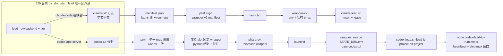
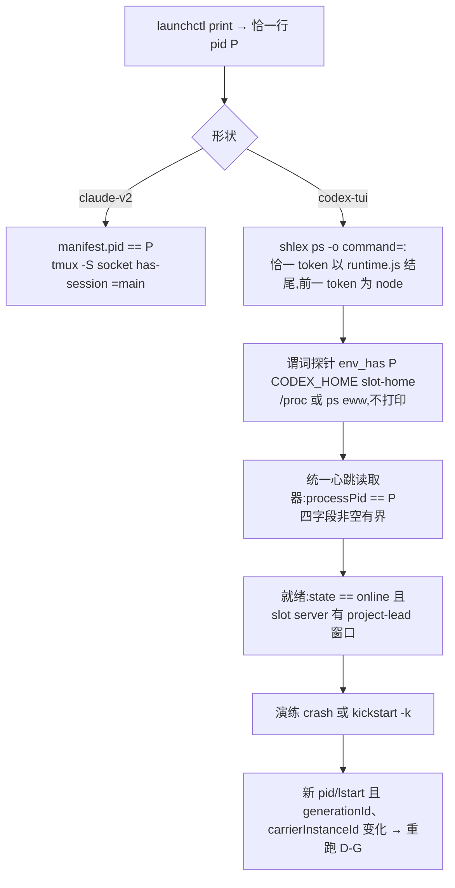
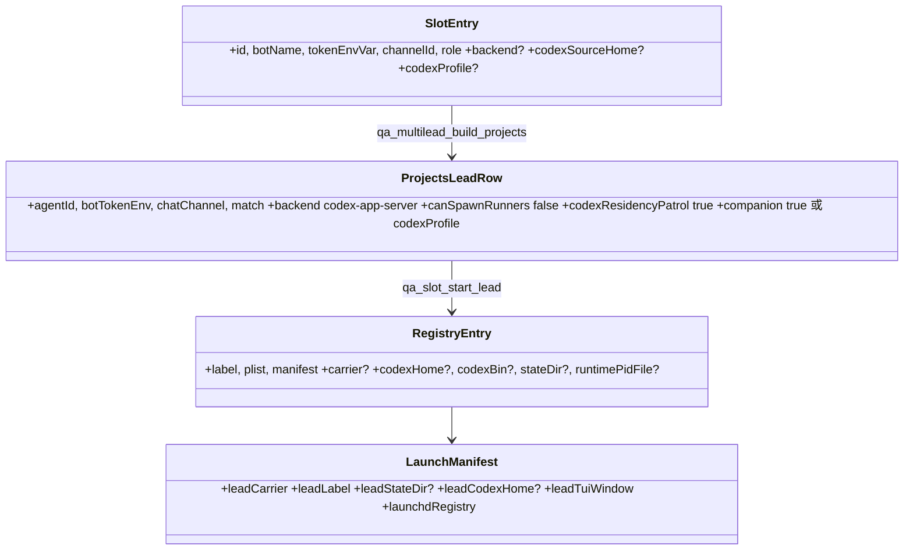

# FLY-2301 529 房台架支持 Codex 形状常驻 Lead — 实施计划
Issue: FLY-2301 (https://linear.app/geoforge3d/issue/FLY-2301/529-房台架能力-slot-常驻-lead-台架支持-codexcloud-形状raya-脑一族plist-argvenv)
日期: 2026-09-03
基于: research.md

> **执行合同:** 在 implement DAG 节点内按任务顺序执行;每个行为改动 RED → GREEN → REFACTOR;节点边界禁止派发 successor、merge、deploy。**全单不加任何开关 / 旋钮 / env 覆盖**(founder 直令 2026-09-03):载体形状只由 Lead 身份数据决定;测试不得为自己开任何环境变量选路(既有 `FLYWHEEL_QA_LEAD_WRAPPER` 等前置知识点不动也不新增同类)。

## 0. 评审要求落点

### 0.1 Lead 要求(question eb231cf9)
| Lead 要求 | 落在哪 |
|---|---|
| ① 缺省 claude-code 逐字节不变要有守卫,守卫要有**变异体阳性对照**;`codexSourceHome` 拒绝名单要有负向测试 | T1(三份黄金基线 + 逐产物变异体必红,镜像目录法,无 env 覆盖)、T5 |
| ② `codex-lead.sh` state root 改动要有「同一输入下改前改后路径完全相同」的**实测** | T7(从新脚本精确反向变异出 legacy 变体,双跑比对,不依赖 git 历史) |
| ③ 自愈边界到 launchd 层是「决定不做」,写明 Bridge 侧 RayaBrainPatrol 不在本单 + 承接去处 | §2.2;全文改称「launchd 重生 / 重启演练」 |
| ④ 不加开关;验收必须含「既有 Claude Lead slot 房启动 + 验活回归全绿」 | 执行合同、A7、T12 |

### 0.2 Codex R1(CHANGES REQUESTED,13 条)处置
H1 变异体 env 覆盖=开关 → 镜像目录法(T1);并明令不引入模板/形状 env 覆盖(T3/T9)。H2 形状从平行参数分派 → 只从已选定 `lead_row` 分派(T9)。H3 wrapper argv 顺序/正则/`sed` → 真实位置序、复用 launcher 正则、python 精确占位符 + `shlex.quote`(T3)。H4 `git show HEAD:` 提交后失效 → 反向变异 legacy 变体(T7)。H5 E2E 自造成功 → 分层:真 resolver / 真 ProjectConfig / 真 roster / 真 `codex-lead.sh` 到 exec 前一刻;替身 runtime 先校验 canonical 导出(T10)。H6 TMUX_TMPDIR 未成门 → QA 部署把窗口设为硬门 + 真 tmux 双 server 判别测试 + 负向变异(T4/T9/T10)。H7 探针泄密 / `.env` 无碰撞控制 → 不打印谓词 + 单一 map + 身份命名空间黑名单 + 坐标白名单 + sentinel 不泄漏断言(T4/T9)。H8 拆房不证收敛 → 有序收敛事务、聚合失败返非零、`codexBin` 包含性校验(T6)。M9 谓词与 CI 替身 → 恰一行 pid 解析(仅新路径)、python `shlex`、统一心跳读取器、替身持久化 job/reap/KeepAlive/kickstart(T4/T10);**部分接受**:既有 `qa_launchd_lead_pid` 不动(改它是 Claude 行为变更,超范围;Claude 侧靠 manifest pid 二次校验)。M10 room-info 仅 generalized → 演练读总是写的 `launch-manifest.json`(补字段);证据目录为演练命令的必填外部参数(T9/T12)。M11 铸造包含性 / 原子拷贝 → 全部纳入(T5)。M12 变异集覆盖 → 三基线三变异 + Codex-only 变异 + 命名叶子规范化 + `cmp`/hash 比对(T1/T10/T12)。M13 用词与证据 → 改名 + 证据 JSON 字段(T6/T12/A4)。

## 1. 目标与验收标准

**Goal:** 529 slot 常驻台架按 Lead 载体形状分支(`claude-v2` 既有 / `codex-tui` 新增),plist argv、env 注入集、验活、就绪、拆除、launchd 演练各自成立;新增形状只加分支,不改既有分支语义与字节。

**验收(全部必须成立):**
- A1 slot 条目声明 `backend:"codex-app-server"` + `codexSourceHome` 后,`scripts/test-deploy.sh <slot> --mode slot` 起出 Codex 形状受管常驻 Lead:plist argv 恰 `/bin/bash <slot wrapper>`,`RunAtLoad`+`KeepAlive` 生效。
- A2 隔离:CODEX_HOME 在 `${SLOT_DIR}/cdxh/<agent>`,state 在 `${SLOT_DIR}/q/<slot>/state/codex-lead/<key>`;TUI 窗口 `<project>-<agent>` **只**出现在 slot tmux server(`${SLOT_DIR}/tmux-<uid>/default`),默认 server 的 `flywheel` 会话窗口清单前后 `cmp` 相同;生产 `~/.flywheel/state/codex-lead/`、三个生产 Codex home 零写入(`find -newer` 对照)。
- A3 验活:launchd pid = `node …codex-lead-tui-runtime.js`(shlex 分词、恰一个匹配 token、前一 token basename `node`),进程环境 `CODEX_HOME` 精确等于 slot home(谓词式探针),心跳 `processPid` 一致;就绪 = 心跳 `state=="online"` 且四个 id/时间字段非空有界,**且** slot server 上存在该窗口(QA 硬门)。
- A4 launchd 演练(不是 patrol 自愈):`crash`(强杀,证 KeepAlive 重生)与 `kickstart`(`launchctl kickstart -k`,证执行器 + 共同后置条件)两式后,新 pid/lstart,心跳 `generationId`/`carrierInstanceId` 均变化,A3 重新成立;证据 JSON 含 §T6 字段。
- A5 拆房收敛:label 不在域、runtime pid/lstart 消失、daemon pid 与控制 socket 消失、窗口消失、SLOT_DIR 已删;任一步失败 → 非零、SLOT_DIR 与 registry 保留。
- A6 守卫:三份 Claude 黄金基线(plist / `.env` / manifest)各有专属变异体必红;Codex plist 变异体必红;去 `TMUX_TMPDIR` 变异必红;三个生产 home 拒绝各一负例(结构完整 fixture,拒绝发生在任何目标产物之前)。
- A7 Claude 回归全绿:`fly1663-qa-launchd.test.sh`、`test-deploy-fly1389.test.sh`、`test-deploy-multilead.test.sh`、`test-deploy-qa-room.test.sh`;真 529 房 Claude slot(`test-deploy.sh 2 --mode slot`)起 / 验 / 拆全绿,其 plist / `.env` / manifest 与 main 同命令产物 `cmp -s` 相同(hash 报告,不 diff 凭据文件)。
- A8 `codex-lead.sh`:legacy 变体 vs 新脚本,`FLYWHEEL_STATE_DIR` 未设时 state 路径与日志行逐字节相同;设了只有新脚本移动到 slot 根。

## 2. 非目标与「决定不做」

### 2.1 非目标
退旧脑 / 生产单实例切换(FLY-2259 B);529 房造 Codex 工人(FLY-2224);改 `flywheel-daemon.sh::classify_plist_lead_carrier`、`restart-services.sh`、host-tmux census、`lead-restart-lifecycle.sh` 的闭合 carrier 集;full-access 层级真机验收(hermetic 过真 parser,见 T10)。

### 2.2 决定不做(不是遗漏):Bridge 侧 RayaBrainPatrol
`raya-brain-patrol` → `scripts/resident-codex-lead-recover.sh` 的权威绑在真 HOME 下的 projects / manifests / LaunchAgents plist + 三个固定 wrapper basename 各自硬编码的 `EXPECTED_CODEX_HOME`(`:60-95`)。让其对 slot 身份生效等于给生产自愈权威开一条按 env 改路径的口子,与 FLY-2216「不能从 manifest/env 注入路径」对撞。本单只做 **launchd 重生 / 重启演练**:crash 覆盖 KeepAlive;`kickstart -k` 覆盖 patrol 分类后的执行器与共同后置条件;**不**覆盖 patrol 检测、权威复核、pre-mutation 收据、Bridge 触发。**承接:** patrol 分类由 FLY-2259 QA 用既有 `raya-brain-recover.test.sh` fixture 覆盖;真机演练 patrol 本身需另立 issue 讨论「patrol 权威根可否随 FLYWHEEL_STATE_DIR」。

## 3. 架构

### 3.1 两条启动链

### 3.2 验活 / 就绪 / 收敛判据

### 3.3 数据模型

## 4. 文件职责

| 文件 | 动作 | 责任 |
|---|---|---|
| `scripts/lib/qa-launchd-lead.sh` | 修改 | plist 外壳 + 形状片段;codex 探针 / 验活 / 就绪 / 心跳读取器 / home 铸造 / registry v2 / 收敛拆除 / 演练 |
| `scripts/lib/qa-codex-lead-wrapper.template.sh` | 新增 | slot 固定 Codex wrapper 模板 |
| `scripts/lib/qa-codex-lead-render.py` | 新增 | 精确占位符渲染器(每个占位符恰一次,值 `shlex.quote`,拒绝 NUL/换行) |
| `scripts/lib/qa-launchd-env.py` | 新增 | `.env` 单一 map 构建 / 校验 / 投影(重名、身份命名空间、白名单) |
| `scripts/lib/qa-multilead.sh` | 修改 | slot 字段 `backend/codexSourceHome/codexProfile`;projects 行按形状渲染 |
| `scripts/test-deploy.sh` | 修改 | 从 `lead_row` 分派;`.env` 投影;就绪 + 窗口硬门;launch-manifest 字段 |
| `scripts/test-teardown.sh` | 修改 | 收敛拆除失败 → 保留目录并返非零(既有分支已如此,补日志字段) |
| `packages/teamlead/scripts/codex-lead.sh` | 修改 1 处 | state root = `${FLYWHEEL_STATE_DIR:-$HOME/.flywheel}` |
| `scripts/__tests__/fly1663-qa-launchd.test.sh` | 修改 | 三基线快照 + codex 形状单元断言 |
| `scripts/__tests__/fly1663-qa-launchd-mutants.test.sh` | 新增 | 镜像目录变异体阳性对照(每个基线一变异,只红自己) |
| `scripts/__tests__/qa-codex-lead-layers.test.sh` | 新增 | H5 分层:真 resolver / 真 ProjectConfig / 真 roster / 真 `codex-lead.sh` dry-run / 真 runtime parser(full-access 突变) |
| `scripts/__tests__/qa-codex-tmux-isolation.test.sh` | 新增 | 真 tmux 双 server 判别 + 去 `TMUX_TMPDIR` 变异 |
| `scripts/__tests__/codex-lead-state-root.test.sh` | 新增 | Lead ②:legacy 变体双跑 |
| `scripts/__tests__/test-deploy-multilead.test.sh` | 修改 | slot 字段 / projects 渲染正负例 |
| `scripts/__tests__/test-deploy-fly1389.test.sh` | 修改 | Claude 三基线 `cmp`;Codex slot 生命周期(真 `codex-lead.sh` + 替身 runtime);替身 launchctl 升级 |
| `scripts/lib/path-hygiene.sh`、`scripts/__tests__/host-tmux-selection-s0-scope.test.sh` | 修改 | 模板加入 PATH 声明清单 |
| `.github/workflows/ci.yml` | 修改 | `:352` 步骤追加新测试(该 job 已 `pnpm build` 并装 tmux) |
| `doc/qa/framework/529-room-playbook.md` | 修改 | slot 字段、Codex 前置、演练与证据 |
| `scripts/qa-fly-2301-codex-lead-drill.sh` | 新增 | 真机演练入口 `<slot> <crash|kickstart> <evidence-dir>` |
| `engineering/doc/milestones/FLY-2301.md` | 新增 | PR 前 last commit |

## 5. 任务(TDD 顺序)

### T1 — 三份 Claude 黄金基线 + 镜像目录变异体(Lead ①、R1 H1/M12)
**基线冻结(在 T2 之前、任何生产改动之前)**:
- `fly1663-qa-launchd.test.sh`:固定输入调用 `qa_launchd_render_plist`,与内嵌期望全文 `cmp`(基线 P)。
- `test-deploy-fly1389.test.sh`:既有 `LEAD_SLOT` 部署后,`launchd/<agent>/lead.plist`、`q/<slot>/.env`、`manifest.json` 与内嵌期望比对(基线 P'/E/M)。规范化只替换**命名叶子**:`.env` 的 token 值、manifest 的 `TEAMLEAD_API_TOKEN`/端口/`SLOT_DIR` 前缀;比对前断言键集合与类型未变。基线文本在未改动的 main 上生成一次并固化。
**变异体(新 `fly1663-qa-launchd-mutants.test.sh`)**:把仓库 `scripts/`(lib + tests)整目录复制到临时镜像,对镜像里的 `qa-launchd-lead.sh` / `test-deploy.sh` 做**一处**变异(每个变异先断言替换计数恰 1),在镜像里按正常相对路径运行对应测试,断言退出非 0 且失败名恰为对应基线、其他基线仍绿。变异集:① Claude-only argv 行(`<string>%s</string><string>%s</string>` 少一个 `<string>`);② Claude-only env 行(`FLYWHEEL_WRAPPER_ENV_FILE` 键名);③ `.env` 写者(`printf '%s=%q\n'` 改 `%s=%s`);④ manifest 写者(`launchEnvironment` 键名);T3 后追加 ⑤ Codex argv 行(去掉 `/bin/bash`)。**不引入任何环境变量选路。**

### T2 — plist 渲染拆分(行为不变)
`qa_launchd_render_plist` 签名与校验不变;内部拆为 `_qa_launchd_plist_open` / `_qa_launchd_plist_argv_claude` / `_qa_launchd_plist_env_claude` / `_qa_launchd_plist_close`。基线 P 必须仍绿。

### T3 — codex plist + slot wrapper 渲染(R1 H3)
**RED**:
- `qa_launchd_render_codex_plist plist label wrapper home state log slot_dir`:argv 恰 `<string>/bin/bash</string><string>$wrapper</string>`;env 恰 5 键 `HOME PATH FLYWHEEL_DIR FLYWHEEL_STATE_DIR TMUX_TMPDIR`(`TMUX_TMPDIR=$slot_dir`);其余复用外壳函数;不含 manifest / `FLYWHEEL_WRAPPER_ENV_FILE` / `FLYWHEEL_PROJECTS_FILE`。
- 渲染器 `qa-codex-lead-render.py template out lead_id project_dir project_name`:
  - `lead_id` 必须匹配 `^[a-z0-9][a-z0-9-]*$`(与 `codex-lead.sh:30` 相同);`project_name` 匹配 `^[A-Za-z0-9][A-Za-z0-9._-]*$`(canonical resolver 合同);`project_dir` 绝对、存在、无 NUL/换行/回车。
  - 占位符 `@@LEAD_ID@@ @@PROJECT_DIR@@ @@PROJECT@@` 各**恰出现一次**,替换值经 `shlex.quote`;输出 mode 700,临时文件 + rename;渲染后再读回断言无 `@@`、`bash -n` 通过。
  - **exec 行精确断言**:`exec /bin/bash "${FLYWHEEL_DIR}/packages/teamlead/scripts/codex-lead.sh" <lead_id> <project_dir> <project_name>`(codex-lead.sh 真实位置序 `<lead-id> <project-dir> [project-name]`,`:25-26,55`)。`project_dir` = `${SLOT_DIR}/lead-workspace`(与 `FLYWHEEL_CODEX_TUI_CWD` 同一目录;companion 层它只是 cwd,full-access 层它是唯一可写根)。
  - 负例:lead 含大写 / 下划线 / 空格;project_dir 相对路径;含 `&`、反斜杠、空格、`'` 的 project_dir 正例必须渲染出可被 `bash -n` 接受且 `bash -c 'source <(sed -n "/^exec/p" wrapper | sed s/^exec//)'` 分词后第 4-6 参与输入逐字节相同的 wrapper。
**GREEN**:模板 `scripts/lib/qa-codex-lead-wrapper.template.sh`(骨架与 `flywheel-codex-lead-wrapper-raya-tui-fullaccess.sh` 同形:`set -a; source "${FLYWHEEL_STATE_DIR}/.env"; set +a`,native-first PATH,host tmux 门 `gate codex-tui` / `verify codex-tui`,mount point 为模板路径,最后 exec 行)。**不提供模板路径 env 覆盖**;hermetic 测试通过假仓在同一相对路径放自己的模板。

### T4 — codex 探针 / 验活 / 就绪 / 心跳读取器(R1 H6/H7/M9)
**RED**(替身 `launchctl`、`ps`;fixture 心跳):
- `qa_launchd_lead_pid_exact label`:`launchctl print` 输出中 `^[[:space:]]*pid = [0-9]+[[:space:]]*$` **恰一行**(与 `resident-codex-lead-recover.sh:99-106` 同式);0/2 行 → 失败。**仅新 codex 路径使用**;既有 `qa_launchd_lead_pid` 不动。
- `qa_launchd_process_env_has pid name expected` → 0 匹配 / 1 不匹配 / 2 探针不可用;实现:`/proc/$pid/environ` 存在**且可读**时 NUL 分词,否则 `ps eww -p pid -o command=` 空白分词;输入截断 ≤64KB;**不打印任何 env 内容**,诊断只输出 `probe=<proc|ps|unavailable> match=<0|1>`。
- `qa_launchd_codex_process_matches pid runtime_suffix`:python `shlex.split(ps -p pid -o command=)`,恰一个 token 以 `/packages/teamlead/dist/lead-backends/codex/codex-lead-tui-runtime.js` 结尾且不在 index 0,前一 token basename == `node`。
- `qa_launchd_read_heartbeat path`:lstat 拒 symlink、≤64KB、JSON object、`v==1`、`processPid` 正整数、`generationId/carrierInstanceId/threadId` 非空 ≤256、`updatedAt` 非空 ≤64;输出 TSV `pid gen carrier state`。验活 / 就绪 / 演练三处共用。
- `qa_launchd_codex_lead_verify label codex_home state_dir` → `pid<TAB>state_dir`:pid_exact ∧ process_matches ∧ env_has(CODEX_HOME) ∧ heartbeat.pid==P。轮询复用既有两常量;pending 不打 launchctl。
- `qa_launchd_codex_lead_ready state_dir pid project lead tmux_socket` → heartbeat `state=="online"` ∧ pid 一致 ∧ `tmux -S $tmux_socket list-windows -t =flywheel -F '#{window_name}'` 恰含 `${project}-${lead}`(QA 硬门)。
- `qa_launchd_codex_state_dir state_root project lead`:与 `codex-lead.sh:78-81` 同式;已知输入对照期望 hex。
- 变异/负例:duplicate pid 行、node 前驱错误、CODEX_HOME 不同、symlink / 超大心跳、zombie 旧 pid、窗口缺失 → 各自失败。
**GREEN**:实现;`qa_launchd_lead_verify` 一字不动。

### T5 — CODEX_HOME 铸造(Lead ①、R1 M11)
**RED**:`qa_launchd_mint_codex_home source dest slot_root`:
- `slot_root` 必须是 `/tmp/flywheel-test-slot-<n>` 或其 `/private/tmp` 拼写;`dest` 的**已存在最近祖先**经 `realpath` 后必须在 `realpath(slot_root)` 边界内(前缀 + 分隔符判定);`dest` 必须不存在;`source` 与 `dest` realpath 互不包含。
- `source/auth.json` 必须是非 symlink 常规文件;`source/packages/standalone/current` 必须解析为 `source/packages/standalone/releases/<name>` 的**一个直接子目录**,`<name>` 匹配 `^[A-Za-z0-9][A-Za-z0-9._-]*$`;其中 `codex` 可执行。
- 拒绝名单(realpath 比对):`$HOME/.codex-mufasa`、`$HOME/.codex-infra-bot`、`$HOME/.flywheel/raya/codex-home` → 返回 1,stderr `refusing production Lead codex home`;三条负例 fixture **结构完整**(有 auth.json 与 standalone),并断言拒绝时 `dest` 及其 staging 兄弟目录不存在。
- 复制:在 `dest` 的兄弟 staging 目录(`dest.stage.$$`)先 `cp -Rc` 克隆 release 目录,失败则整体删除 staging 后 `cp -R`;拷 `auth.json`(mode 600);`current` 写为相对 symlink `releases/<name>`;校验 `stage/packages/standalone/current/codex` 的 realpath 以 `stage/` 开头且可执行;`LC_ALL=C` 字节数 `len("$dest/app-server-control/app-server-control.sock") ≤ 100`;全部通过后 `mv stage dest`(原子 rename)。不拷 `history.jsonl / sessions / goals_* / logs_* / app-server-*`。
- 负例:dest 已存在、dest 经 symlink 祖先逃出 slot、source `current` 指向 releases 之外、auth.json 为 symlink、socket 路径过长(用长 slot 子路径)。

### T6 — registry v2、收敛拆除、launchd 演练(R1 H8/M13)
**RED**:
- `qa_launchd_register registry label plist manifest [carrier codexHome codexBin stateDir runtimePidFile]`:4 参输出与今日逐字节相同;9 参写新键。
- `qa_launchd_stop_registry registry`(有序收敛事务,逐条执行、**聚合失败**、最后返非零):
  1. 读取条目并校验:`carrier` ∈ {缺省, claude-v2, codex-tui};codex 条目要求 `codexHome` realpath 在 registry 所在 slot 根内,`codexBin` realpath 以 `codexHome/packages/standalone/` 开头且可执行,否则该条目记失败、不执行任何二进制。
  2. 记录 launchd pid + lstart(若有);`bootout`;轮询直到 `launchctl print` 不存在 **且** 该 pid+lstart 消失(zombie 视为消失需 `ps -o stat=` 非 `Z` 才算存活)。
  3. codex 条目:读 `codexHome/app-server-daemon/app-server.pid`(若存在,记 pid+lstart);`CODEX_HOME=<home> <codexBin> remote-control stop --json`(有界 30s);轮询直到 daemon pid+lstart 消失且 `codexHome/app-server-control/app-server-control.sock` 不存在。
  4. 任一步骤超时/非零 → 该条目失败,继续下一条;函数末尾任一失败 → 返回 1。`test-teardown.sh:734-738` 既有分支因此保留 SLOT_DIR 与 registry;日志补 `carrier=<…> step=<…>`。
- `qa_launchd_lead_restart_drill label carrier mode(crash|kickstart) [codex_home state_dir manifest]`(改名自「自愈演练」):记录旧 `pid/lstart`(codex:加旧 `generationId/carrierInstanceId`、心跳 sha256);`crash` → `kill -9`;`kickstart` → `launchctl kickstart -k <domain>/<label>`;按 carrier 重验;断言 pid **或** lstart 变化,codex 再断言两 id 均变化;输出证据 JSON:`{mode, label, domain, old:{pid,lstart,generationId,carrierInstanceId}, new:{…}, heartbeatPath, heartbeatSha256, predicates:{pidExact,processMatches,envHas,heartbeatPid,tuiWindow}, startedAt, convergedAt}`,**不含任何 env 或凭据**。
- 替身:`launchctl` 增 `kickstart -k`;`codex` 替身记录调用并可配置为「返回 0 但 pid 文件仍活」「非零」;测试:bootout 失败、stop 非零、stop 返 0 但 daemon 活、runtime 延迟退出、后续条目仍被处理。

### T7 — `codex-lead.sh` state root(Lead ②、R1 H4)
**RED**(新 `codex-lead-state-root.test.sh`,不依赖 git 历史):
1. 读取工作副本 `codex-lead.sh`,用 python 做**精确反向变异**生成 `legacy.sh`:把 `STATE_ROOT="${FLYWHEEL_STATE_DIR:-${HOME}/.flywheel}"` + `STATE_DIR="${STATE_ROOT}/state/codex-lead/…"` 两行替换回 `STATE_DIR="${HOME}/.flywheel/state/codex-lead/…"`;断言替换计数恰 1,且 `diff legacy.sh new.sh` 只含这两行。
2. fixture:假 `FLYWHEEL_COMM_CLI`(`lead-identity resolve` 返固定 canonical JSON)、假 projects、`FLYWHEEL_LEAD_DRY_RUN=1`、`FLYWHEEL_CODEX_LEAD_MODE=tui`、stub `node`(dump argv + `FLYWHEEL_CODEX_LEAD_STATE_DIR`)、`FLYWHEEL_CODEX_TUI_CWD`。
3. `FLYWHEEL_STATE_DIR` **未设**:legacy 与 new 各跑一次,dump 的 `FLYWHEEL_CODEX_LEAD_STATE_DIR` 与 stderr `state: <path>` 行逐字节相同。
4. `FLYWHEEL_STATE_DIR=$T/slot`:new 的路径以 `$T/slot/state/codex-lead/` 开头;legacy 仍 `$HOME/.flywheel/...`。
**GREEN**:`codex-lead.sh:81` 两行改动(见 research 2.3)。

### T8 — slot 字段与 projects 行渲染
**RED**(`test-deploy-multilead.test.sh`):A1/A2 不动;`qa_multilead_build_projects` 第 12 参 `main_lead_shape_json`(缺省 `{}`):`{"backend":"codex-app-server","codexProfile":"companion"}` → 主 Lead 行追加 `backend/canSpawnRunners:false/codexResidencyPatrol:true/companion:true`,其余键序不变;`"full-access"` → `codexProfile:"full-access"` 不写 `companion`;非法 profile / backend 拒绝。extra lead 走同一 jq 片段(字段来自 `qa_multilead_slot_fields` 新增 `backend/codexSourceHome/codexProfile`,缺省空)。`qa_multilead_slot_fields`:声明 `backend` 但缺 `codexSourceHome` → 失败指名字段;`backend` 非 `codex-app-server` → 失败。

### T9 — `test-deploy.sh` 接线(R1 H2/H6/H7/M10)
- `qa_slot_start_lead` **签名不变**;分派只看已选定 `lead_row`:`backend=$(jq -r '.backend // "claude-code"')`,`tier`(`companion==true` → companion;`codexProfile` → 其值)。`codexSourceHome` 是供给元数据:主 Lead 从 `SLOTS_FILE` 读,extra Lead 从 `EXTRA_LEADS_JSON` 读,**仅在行选中 codex 后**查找;缺失 → 在写任何 wrapper / plist / registry 之前失败。
- claude 分支:现有代码原样(registry 仍 4 参)。
- codex 分支:`codex_home=${SLOT_DIR}/cdxh/${agent}` ← T5;`state_dir` ← T4;`.env` 经 `qa-launchd-env.py`:输入 = token 行 + `qa_slot_launch_env_json` map + Codex 一族(research 2.1;tier=full-access 追加 research 2.2 五键);规则 = 名字合法、**重名即拒**(含 `tokenEnvVar` 与任一其它键重名)、黑名单 `LEAD_ID PROJECT_NAME FLYWHEEL_LEAD_ID FLYWHEEL_PROJECT_NAME FLYWHEEL_LEAD_KEY FLYWHEEL_LEAD_BACKEND FLYWHEEL_LEAD_BOT_USER_ID FLYWHEEL_PROJECTS DISCORD_BOT_TOKEN FLYWHEEL_SUMMARY_CONFIG_HOME`、白名单 = 文档化坐标集(plan 附录 A,generalized scrub 名单以空值允许);输出 `NAME=<shlex.quote>` 行,mode 600,temp+rename。渲染 wrapper → codex plist → registry 9 参 → start → `qa_launchd_codex_lead_verify`;输出 `pid<TAB>state_dir<TAB>label<TAB>codex_home<TAB>pid_file`。
- 步骤 2:codex 分支轮询 `qa_launchd_codex_lead_ready`(含窗口硬门),同一 `LEAD_READY_TIMEOUT_SEC`;失败 → 与 Claude 同路径 stop + exit 1。`confirm_dev_channels_prompt` 只在 claude 分支。
- `launch-manifest.json`(总是写):`leadCarrier ∈ {launchd-v2, launchd-codex-tui, none}`,新增 `leadLabel`、`leadStateDir`、`leadCodexHome`、`leadTuiWindow ∈ {present, n/a}`、`launchdRegistry`(已有);无 token 值。stdout JSON 同步新增字段。campaign manifest 的 `leadManifest` 对 codex extra Lead 写空串。
- sentinel 测试:launch env 塞一个 `QA_SENTINEL_SECRET=...`(白名单外 → 被拒)与合法 token,断言 token 值不出现在 stdout / launch-manifest / lead.log / 演练 JSON。

### T10 — hermetic E2E:分层真实性(R1 H5/H6/M9/M12)
**新 `qa-codex-lead-layers.test.sh`**(CI 该 job 已 `pnpm build`;本地先 `pnpm build`):
1. **projects → 真 resolver**:`qa_multilead_build_projects … codex` 产物写文件,`node packages/flywheel-comm/dist/index.js lead-identity resolve --projects-file … --project test-slot-9 --lead flywheel-test-9 --format json` 成功,`backend=="codex-app-server"`、`role=="companion"`。
2. **真 ProjectConfig + 真 roster**:node 一行脚本 import `packages/teamlead/dist/ProjectConfig.js`(`FLYWHEEL_PROJECTS_FILE` 指向产物)与 `dist/resident-codex-lead-roster.js`,`findResidentCodexLeadTargets(loadProjects())` 恰一项且 `leadKey=="test-slot-9-flywheel-test-9"`;把行里 `codexResidencyPatrol` 删掉 → 0 项(阳性对照)。
3. **真 `codex-lead.sh` 到 exec 前一刻**:用步骤 1 的 projects + 真 comm dist + `FLYWHEEL_LEAD_DRY_RUN=1` + stub `node`(dump env)+ stub `codex-lead-tui-home.sh`(dry-run 本不调用),断言 dump 含 canonical 导出(`FLYWHEEL_LEAD_KEY/BACKEND/IDENTITY_DIGEST/DISCORD_EXPECTED_BOT_USER_ID`)且 `FLYWHEEL_CODEX_LEAD_STATE_DIR` 在 `FLYWHEEL_STATE_DIR` 下。
4. **真 runtime config parser**:node 脚本 import `dist/lead-backends/codex/codex-lead-runtime.js` 的 `parseCodexLeadRuntimeConfig(env)`,env = 步骤 3 dump + T9 投影;companion 通过;full-access 投影通过;逐个删除五键之一或把 sandbox 改 read-only → 抛错(阳性对照)。
**`test-deploy-fly1389.test.sh` 增补**:
- Claude 三基线 `cmp`(T1)。
- 假仓补:`packages/teamlead/scripts/codex-lead.sh`、`lib/canonical-lead-identity.sh`、`lead-rules-bundle.sh` 为**真文件**(cp),`packages/flywheel-comm/dist` symlink 到真 dist,`codex-lead-tui-home.sh` 替身(ensure-home/ensure-daemon 记录并成功),假 runtime JS 放在 `$FR/packages/teamlead/dist/lead-backends/codex/codex-lead-tui-runtime.js`:启动先校验 `FLYWHEEL_LEAD_KEY == ${FLYWHEEL_PROJECT_NAME}-${FLYWHEEL_LEAD_ID}`、`FLYWHEEL_LEAD_BACKEND==codex-app-server`、`CODEX_HOME` 与 `FLYWHEEL_CODEX_LEAD_STATE_DIR` 均在 `FLYWHEEL_STATE_DIR` 所在 slot 下、`FLYWHEEL_LEAD_CHAT_CHANNEL_ID/FLYWHEEL_COMM_DB/FLYWHEEL_CODEX_TUI_CWD` 非空,任一不满足 `exit 78`;然后用**真 tmux**在 `TMUX_TMPDIR` 路由的 server 上 `new-session -Ad -s flywheel` + `new-window -n <project>-<lead>`(与 `tui-window.ts` 同形),写心跳(每次启动新随机 `generationId/carrierInstanceId`),SIGTERM 时 kill 窗口并退出。
- 替身 `launchctl` 升级:持久化 job 规格(plist 路径、argv、env、log)、reap 子进程、`print` 发现死亡且 `KeepAlive` 为 true 才重生、实现 `kickstart -k`、`bootout` 后不再重生。
- 用例:codex slot 起 / 验 / 就绪(窗口硬门经真 tmux)/ `crash` 与 `kickstart` 演练(新 pid、新 id)/ 拆房收敛(`codex` 替身记录 `remote-control stop`、pid 文件与 socket 被替身删除后才收敛)。负例:`codexSourceHome` 指向结构完整的假 `.codex-mufasa` → 起 Lead 前失败、无 plist;去掉 `TMUX_TMPDIR` 的镜像变异 → 就绪门必红。
**新 `qa-codex-tmux-isolation.test.sh`**(真 tmux):默认 server 用私有 `TMUX_TMPDIR=$T/default-root` 建哨兵 `flywheel` 会话并记录窗口清单;以 `TMUX_TMPDIR=$T/slot` 运行假 runtime;断言窗口只在 `$T/slot/tmux-<uid>/default`,默认 server 清单 `cmp` 相同;结束 kill 两个 server。

### T11 — CI / 清单 / 文档
`ci.yml:352` 步骤追加 `fly1663-qa-launchd-mutants.test.sh`、`codex-lead-state-root.test.sh`、`qa-codex-lead-layers.test.sh`、`qa-codex-tmux-isolation.test.sh`;`path-hygiene.sh` 与 `host-tmux-selection-s0-scope.test.sh` 加模板路径;playbook:slot 字段、`codexSourceHome` 前置(`CODEX_HOME=<home> codex login`)、演练命令与证据目录、双 server 清单对照法。

### T12 — 真机验收(Lead ④、R1 M10/M12/M13)
- `scripts/qa-fly-2301-codex-lead-drill.sh <slot> <crash|kickstart> <evidence-dir>`:`evidence-dir` 必填且必须在 SLOT_DIR 之外;读 `${SLOT_DIR}/launch-manifest.json`(`leadCarrier` 必须 `launchd-codex-tui`),调用 `qa_launchd_lead_restart_drill`,证据 JSON 原子写入 `evidence-dir/fly-2301-drill-<mode>-<ts>.json`;同时把当时的 `launch-manifest.json`、心跳快照、两个 tmux server 的窗口清单拷进去。
- 顺序:① 全部 shell 测试;② 真 529 Claude slot(`test-deploy.sh 2 --mode slot`)起 / 验 / 拆,产物与 main 同命令产物 `cmp -s` + sha256 报告(不打印 `.env` 内容);③ slot 4 条目声明 codex 形状(`codexSourceHome=~/.codex-259-qa`,先 `codex login` 校验),记录默认 tmux server `flywheel` 窗口清单与三个生产 home、`~/.flywheel/state/codex-lead/` 的 mtime 基线;`test-deploy.sh 4 --mode slot`;A1–A3;两式演练(A4);拆房(A5);对照 A2 基线;④ 证据在拆房前已在外部目录;⑤ 恢复 slot 4 条目。

## 6. 回滚边界
台架侧全部在 `scripts/lib/*`、`scripts/test-deploy.sh`、`scripts/test-teardown.sh`、测试与文档;不声明 `backend` 时新旧产物逐字节相同(T1/T10 三基线守卫)。生产侧唯一改动 `codex-lead.sh` 两行,`FLYWHEEL_STATE_DIR` 未设时路径不变(T7);回滚 = 恢复该两行。拆房失败时 SLOT_DIR、registry、`cdxh/<agent>` 保留,日志给出 `CODEX_HOME` 与 `app-server-daemon/app-server.pid` 位置。

## 7. 安全与边界核查
外部输入(slots 字段、占位符值、路径)入口校验:字符集、绝对路径、无控制字符、canonical 包含性、socket 长度;凭据只从显式 `codexSourceHome` 拷贝到 600,拒绝三个生产 home;`.env` 600 且经单一 map 校验;身份不可 env 注入(选择器烘焙 + 黑名单 + resolver/runtime 双重拒绝);探针不打印 env;演练与 manifest 无 token;`TMUX_TMPDIR` 钉住窗口并以硬门 + 双 server 测试证明;`codexBin` 只在包含性校验通过后执行。无 HTML / SQL 面。

## 8. 依赖与前置
非生产、含有效 `auth.json` 与 standalone 的 Codex home(候选 `~/.codex-259-qa`,0.140.0);`pnpm build` 后的 `packages/teamlead/dist` 与 `packages/flywheel-comm/dist`(CI 该 job 已 build 并装 tmux);FLY-2174 已在线。

## 附录 A — `.env`(codex 形状)白名单坐标
token 行(`tokenEnvVar`);`DISCORD_GUILD_ID BRIDGE_URL AGENT_SOURCE TEAMLEAD_API_TOKEN FLYWHEEL_PROJECTS_FILE TEAMLEAD_DB_PATH FLYWHEEL_STATE_DIR FLYWHEEL_WRAPPER_ENV_FILE FLYWHEEL_DELIVERY_SECRET_PATH LEAD_WORKSPACE TMPDIR`;告警隔离 env(`qa_room_alert_iso_env` 输出名集合);generalized scrub 名集合(值为空);Codex 一族 `CODEX_HOME FLYWHEEL_CODEX_BIN FLYWHEEL_CODEX_LEAD_MODE FLYWHEEL_CODEX_TUI_CWD FLYWHEEL_CODEX_LEAD_OUTBOUND FLYWHEEL_LEAD_CHAT_CHANNEL_ID FLYWHEEL_LEAD_SYSTEM_PROMPT_FILES FLYWHEEL_COMM_DB FLYWHEEL_COMM_CLI`;full-access 追加 `FLYWHEEL_CODEX_LEAD_PROFILE FLYWHEEL_CODEX_LEAD_SANDBOX FLYWHEEL_LEAD_ACTIONS_MAIN_JS FLYWHEEL_LEAD_ACTIONS_NODE_BIN FLYWHEEL_LEAD_ACTIONS_STATE_DIR`。白名单外任何名字 → 拒绝。
