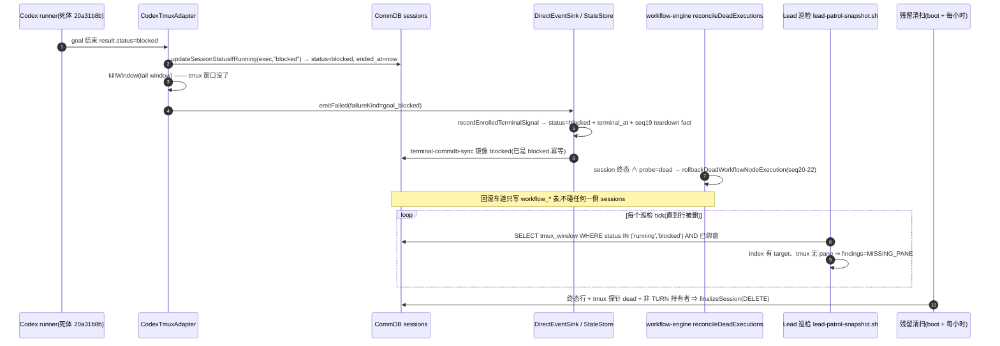

# FLY-2302 死体回滚后 CommDB 注册行残留 — 探索

Issue: FLY-2302 (https://linear.app/geoforge3d/issue/FLY-2302/病根-死体被引擎回滚换体后-sessionsstatusblocked-永不终结巡检名册每-tick-假报-missing-pane且是)
日期: 2026-09-03
基于: 无

## 0. 一句话

引擎把死体（20a31b8b, FLY-2145 implement, Codex 体）回滚换体时,StateStore 一侧其实**已经是终态并盖了 `terminal_at` 戳**;
真正残留的是 **CommDB `sessions` 注册行**:Codex 适配器把它写成 `blocked`、随手 kill 了自己的 tmux 窗口,
却没有人 finalize 这条注册(注册行只能靠 DELETE 离场),于是它带着一个已死的 `tmux_window` 目标继续躺在
巡检 owner index(`status IN ('running','blocked')`)里,每个巡检 tick 都被报成 `MISSING_PANE`,直到一小时一次的
残留清扫(或本例中的 Bridge 重启)把它删掉。

## 1. 真库取证(只读,2026-09-03 20:1x UTC)

### 1.1 StateStore (`~/.flywheel/teamlead.db`) — 与 issue 描述不符的一半

| execution | issue | status | terminal_at | session_stage | 备注 |
|---|---|---|---|---|---|
| `20a31b8b` | FLY-2145 | `blocked` | `2026-09-03 18:20:42` | implement | 死体。**有** terminal 戳 |
| `470e0afd` | FLY-2145 | `running` | NULL | implement | 替换体,现持 TURN(epoch 3) |
| `b2e32f68` | FLY-2291 | `failed` | `2026-09-03 16:53:57` | completed | issue 里的对照体 |

结论:issue 写「CommDB 与 StateStore 两处都停在 blocked、无 terminal 戳」—— StateStore 这一半不成立。
`blocked` 在 StateStore 的三套词表里都是终态:`OUTCOME_STATUSES` / `TERMINAL_STATUSES` /
`ZOMBIE_IRREVERSIBLE_TERMINAL_STATUSES`(`workflow-ledger-states.ts:14`),写入路径
`recordEnrolledTerminalSignal`(`StateStore.ts:32505`)走 `applyTerminalTimestamp` 盖戳。

### 1.2 CommDB (`~/.flywheel/comm/flywheel/comm.db`) — 现在已经没有这条行

```
SELECT execution_id, status, ended_at, tmux_window FROM sessions WHERE execution_id LIKE '20a31b8b%';
-- (空)   ← 已被 19:01:44Z Bridge 重启的 boot 清扫删除
SELECT status, count(*) FROM sessions GROUP BY status;
-- completed 2 · running 24 · timeout 1  (blocked 0)
```

Bridge 日志(`/tmp/flywheel-bridge.log.1`,重启后第一个 tick):
`[Bridge] CommDB terminal prune (flywheel): scanned=5 pruned=1 kept=4`。
巡检 finding 首见 `18:45:01Z`,Bridge 重启 `19:01:44Z` —— **残留存活约 41 分钟**,不是「永不终结」。

### 1.3 workflow_run_event(FLY-2145 run)

```
seq 18  issue_delivery                 implement  20a31b8b  16:25:17
seq 19  generalized_teardown_recorded  implement  20a31b8b  18:20:42   ← DirectEventSink.emitFailed(goal_blocked)
seq 20  writer_replacement             implement  470e0afd  18:20:43   ┐
seq 21  resume_target_unrecoverable    implement            18:20:43   │ rollbackDeadWorkflowNodeExecution
seq 22  execution_dead_rolled_back     implement  20a31b8b  18:20:43   ┘ reason=terminal_session_and_dead_probe
seq 25  activation_turn_granted        implement  470e0afd  18:20:45
seq 28  turn_granted                   implement  470e0afd  18:20:49   ← TURN 从死体移到替换体
```

Bridge 日志同刻:
```
[CodexTmuxAdapter] runner-tail-window: killed (FLY-2145-implement-codex-G-2132-A1-Lead)
[CodexTmuxAdapter] 20a31b8b failed: goal ended non-complete: blocked
[RunDispatcher] 20a31b8b resolved with failure for issue FLY-2145: goal ended non-complete: blocked
```

## 2. 谁写了什么 —— 完整因果链



### 2.1 各方对 `blocked` 的语义(不是词表不一致,是 pane 保留合同不一致)

| 消费者 | `blocked` 算什么 | 依据 |
|---|---|---|
| StateStore FSM / 引擎回滚车道 | 不可逆终态 | `ZOMBIE_IRREVERSIBLE_TERMINAL_STATUSES`;`reconcileDeadExecutions` 用它判「session 已终态」 |
| CommDB `sessions.status` CHECK | 终态(`ended_at` 被写) | `db.ts:117` 词表 `running/completed/timeout/blocked/failed`;`listSessions` 终态集含 blocked |
| `close-runner.ts` | **CRASH_PRESERVE**:终态但 tmux 窗口/tab 默认保留取证 | `CRASH_PRESERVE_STATES = {failed, blocked}` |
| `commdb-fsm-reconcile.ts` | 只扫 CommDB `running` 行;`failed/blocked` 明确排除(保留的窗口必须留着 teardown 目标) | 文件头注释 |
| `commdb-session-prune.ts` | 终态;**仅当 tmux 目标探针=dead** 才删(含 `includeCrashPreserve`) | `pruneDeadTerminalCommDbSessions` |
| 巡检 owner index(shell + Bridge `activePatrolTargets`) | **名下活目标**(pane 可能仍在,要盯) | FLY-2118 沿用 #895:`status IN ('running','blocked')` |

关键矛盾:巡检把 `blocked` 放进名下集,前提是「blocked 体的 pane 被保留」(Claude 体的 CRASH_PRESERVE 合同)。
**Codex 适配器不遵守这个前提** —— 它在 blocked 时也 kill 自己的 tail 窗口(`CodexTmuxAdapter.ts:1646`),
却不 finalize 注册行。而系统里每一处「kill 窗口」的现有路径(`close-runner`、`crash-reaper`、`lifecycle-closeout`)
都在 kill 后同事务 `finalizeCommDbSession`。Codex 适配器是唯一「kill 了不封账」的写点。

### 2.2 为什么引擎回滚车道「本来就」不写 session 行

`rollbackDeadWorkflowNodeExecution`(`StateStore.ts:41274`)入口用
`isStateStoreIrreversibleTerminalForZombie(session.status) || hasWorkflowExecutionTeardownFact(...)`
作为前置,即它**消费**终态,不**生产**终态;事务内只动 `workflow_run_node` / credential 撤销 /
`workflow_run_event` / launch ordinal。这一点 issue 说对了。但「给死体写 failed+terminal_at」这个修法不对:
- StateStore 行已经 `blocked` + `terminal_at`,再改成 `failed` 是覆盖 runner 自己申报的结局(goal_blocked),
  且撞 FLY-1427「无出边终态免疫」规则(`recordEnrolledTerminalSignal` 里 `statusPreserved` 分支)。
- 它对 CommDB 残留毫无作用:CommDB 行离场唯一方式是 DELETE。

### 2.3 残留为什么能活到被巡检看见

已存在的三层收敛全部够不到它,或够到得太慢:

1. Layer 1 `terminal-commdb-sync`:只镜像 status,不删行。
2. `commdb-fsm-reconcile`(running 面):只扫 `running` 行。
3. `pruneDeadTerminalCommDbSessions`(终态面,含 blocked):只在 **boot 与每小时的 residue full pass**
   跑(`residueMaintenanceEveryNTicks` = 3600000 / `stuckCheckIntervalMs`(默认 300000)= 12 tick)。
   Lead 巡检默认 60 分钟一次(`DEFAULT_PATROL_INTERVAL_MINUTES = 60`),两者相位随机 ⇒ 每个 Codex
   blocked 死体都有一个最长约 1h 的假 `MISSING_PANE` 窗口;本例 41 分钟内恰好撞上一次。

另一个约束:**TURN 持有者否决**。`finalizeSessionUnlessTurnHolder` / `finalizePaneLossResidue`
遇到 `three_stage_turn.holder_exec_id = 死体` 一律拒删。本例死体 18:20:42 结束,替换体 18:20:49 才拿到 TURN
—— 适配器结束那一刻死体还是 TURN 持有者,所以**适配器自己 finalize 也会被否决**。这决定了修补点不能放在适配器。

## 3. 与 FLY-2091 的关系(诚实边界)

issue 称本残留是「FLY-2091 类永不终结 session 行封不了通信账」的上游。本节点无法读 Linear
(MCP `linear-api` 401),仓内 `engineering/doc`、milestones、memory 均无 FLY-2091 文本,**无法核对**。
能从代码确认的只有:ship 收尾 `lifecycle-closeout.ts` 的 `communicationsFinalized` 来自
`closeRunner → finalizeCommDbSession`(`close-runner.ts:506`),而 finalize 的第一步就是删 `sessions` 行;
若行早已被每小时清扫删掉,走 `no_session_row_communications_finalized` 也算 done。所以本残留最多在那 ≤1h
窗口内让 closeout 多一次 `closeRunner` 路径,不构成「永不终结」。这点写进边界,不当结论。

## 4. 备选方案

### 方案 A(推荐)引擎回滚车道之后,用现有「证明已死才删」谓词定点封账

在 `reconcileDeadExecutions` 每 tick 增加一步:对活跃 run 里每条 `execution_dead_rolled_back` 事件,
若其 `deadExecutionId` 在该项目 CommDB **仍有注册行**,调用从 `pruneDeadTerminalCommDbSessions` 循环体
**抽出来**的单行函数 `finalizeDeadTerminalCommDbSession(projectName, executionId)`:
终态 status ∧ `probeTmuxWindowLiveness(tmux_window) === "dead"` ∧ 非 parked 声明 ∧ 非 TURN 持有者 ⇒
`finalizePaneLossResidue`(目标未变才删)⇒ `store.recordCommDbFinalizeOutcome(source="bridge.workflow-engine.dead-rollback")`。

- 幂等:行没了就无事可做;被 TURN 否决就下 tick 再来(替换体 6 秒后拿 TURN)。
- 单一事实来源:删行谓词与每小时清扫**同一个函数**,不新造词表。
- 回退边界:失败只记日志,每小时清扫仍是兜底(Layer 2 不变)。
- 不动 StateStore 行、不动 `blocked` 语义、不动巡检脚本。

### 方案 B 把 `blocked` 踢出巡检 owner index(issue 的第二个建议)—— 否决

Claude 体的 blocked 行 pane 是被保留的取证现场,踢出后:(1) 巡检不再盯它;(2) Bridge
`patrol-orphan-sweeper` 用同一集合判「谁是名下」,保留 pane 会变成 orphan 候选,可能被当孤儿处理。把一个假阳性换成真阴性。

### 方案 C 回滚车道给死体写 `failed + terminal_at`(issue 的第一个建议)—— 否决

见 §2.2:StateStore 已终态已盖戳;改写结局撞 FLY-1427;对 CommDB 残留无效。

### 方案 D Codex 适配器 kill 窗口后自己 finalize —— 否决

见 §2.3:适配器结束时死体仍是 TURN 持有者,finalize 必被否决;且 claude-runner 包没有 StateStore 审计写点。

### 方案 E 把每小时清扫改成每 tick(5 分钟)—— 备选,不推荐

一行常量改动,把窗口从 ≤60 分钟压到 ≤5 分钟,但每 5 分钟对全部终态行做 tmux 探针,且仍不消灭窗口。
可作为 A 的补充,但 A 已把窗口压到「一个引擎 tick」,不需要。

### 方案 F 让 Codex 适配器在 blocked 时不 kill 窗口(对齐 Claude 的 CRASH_PRESERVE)—— 否决

改变 founder 可见行为(cmux 里堆积死 Codex tail 窗口),且引入新的窗口回收责任。

## 5. 顺带观察(不在本 issue 范围,不修)

- `bridge.codex-runner-orphan-reaper` 对 20a31b8b(pgid 48722)与 b2e32f68(pgid 15998)每 5 分钟写一条
  `codex_app_server_orphan_identity_mismatch`(evidence: argvSocket=false, pgidFresh=false, socketHolder=false),
  从 18:23 持续到现在。这是 FLY-2169 reaper 的 fail-closed 形状,属另一张单。
- 巡检规则文档把 `MISSING_PANE` 定为「Lead 判断项」,未区分「blocked 体 pane 被回收」这种无需动作的形状;
  A 落地后该形状消失,不再需要文档补丁。

## 6. 待研究(进入 research.md)

1. 引擎 tick 周期与 `reconcileDeadExecutions` 的调用频率(决定 A 的收敛时延)。
2. `probeTmuxWindowLiveness` 对已 kill 窗口返回 `dead` 的判据(`isTmuxAbsenceMessage`)在 Codex tail 窗口场景是否成立。
3. 从 `pruneDeadTerminalCommDbSessions` 抽单行函数的可行性与现有测试覆盖。
4. 活跃 run 中 `execution_dead_rolled_back` 事件的枚举成本与去重方式(不新增事件种类)。
5. 阳性对照:一个「blocked + pane 仍活(Claude 体)」的行,A 必须**不删**。
