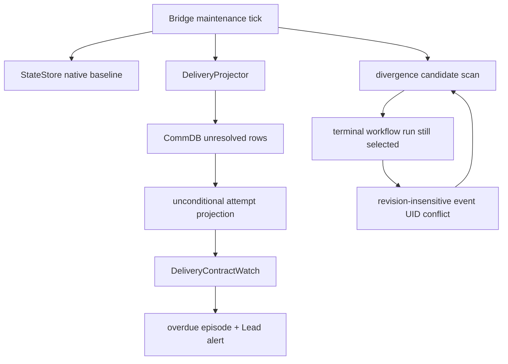

# FLY-2324 投递告警风暴收敛 — 探索
Issue: FLY-2324 (https://linear.app/geoforge3d/issue/FLY-2324/引擎告警-部署后-bridge-启动-baseline-全量铸-796-条陈年投递契约-episode35min-内-362)
日期: 2026-09-04
基于: 无

## 问题边界

2026-09-04 紧急部署后，Bridge 第一次投递契约维护把历史 CommDB 投递源投影成活跃
`workflow_delivery_attempt`，随后 watch 为已过期阶段打开 episode 并发告警。与此同时，工作流发散
扫描持续选择已终止 run；第二次观察同一 node attempt 的新 lifecycle revision 时仍复用旧 event UID，
事务因 identity conflict 回滚，检查点永远无法前移。

本 issue 只修这两条 Bridge 内部放大路径：

1. 历史不可达投递在进入 watch 前收口；存量 attempt/episode 原子关闭且可重放。
2. 发散扫描不再选择完成/终止 run；非终态 run 的不同 lifecycle revision 各自只记一次。

不改变邮箱 ACK 语义、不删除历史行、不重启或部署 Bridge，并保留 active/held run 的既有
reroute/hold 策略。

## 生产证据快照

只读查询 `~/.flywheel/teamlead.db` 与 `~/.flywheel/comm/flywheel/comm.db`（2026-09-04
约 01:00 PDT）得到：

- `opened_at=2026-09-04T07:30:48.286Z` 当前有 795 个 episode；源库在事件期间仍在变化，和发现时
  的 796 差 1 条。
- 其中 mailbox 749、phase_wake 41、rework 5；747 个 `run_id IS NULL`。
- mailbox 中 740 个收件 execution 在 StateStore 已终态或不存在；41 个 phase_wake 全部如此。
- 同批 791 个 episode 尚未关闭，348 个已经写入 `severe_alerted_at`。
- `workflow_run` 当前含 terminated 285、completed 211，而
  `listWorkflowDivergenceCandidates` 只约束 `engine_owned=1`，没有 run status 条件。

这里必须以 StateStore `sessions.status` 判断 runner 是否仍可收件。CommDB 的 session status 词汇较窄，
parked runner 在 CommDB 仍可能显示 running，不能作为完整的活性来源。

## 当前路径

`baselineWorkflowDeliveryContracts` 自身已把 rework/carrier/launch/land/gate-holder 限制在
`run.status IN ('active','held')`。大量 mailbox/phase-wake episode 来自同一 maintenance tick 中随后运行的
`DeliveryProjector`，因此回归尺必须覆盖 projector → watch，而不能只测 baseline 方法。

## 公开测试缝

1. `DeliveryProjector.runPass(now)` + `DeliveryContractWatch.runPass(now)`，通过公开 StateStore 查询与
   episode 持久状态观察“历史行不会新开 episode、存量 episode 被幂等关闭、活跃投递仍被观察”。
2. `StateStore.listWorkflowDivergenceCandidates()` +
   `StateStore.commitWorkflowDivergenceObservation(...)`，观察候选、事件与检查点收敛。

测试不验证私有 helper 调用次数；CommDB/StateStore 均使用真实内存或临时 SQLite。

## 假设排序与可证伪预测

1. **projector 无 reachability 前置判断是 episode 风暴主因。** 若正确，加入前置判断后，同一历史
   fixture 的 `minted/opened/alerted` 都为 0；同 issue 的活跃 run + live recipient 仍会正常投影。
2. **发散候选缺 run status 过滤，event UID 又缺 lifecycle revision。** 若正确，SQL 增加
   active/held 条件会排除 terminated/completed；revision 进入 UID 后，活跃 run 的第二个 revision 会成功
   记账一次并推进 `workflow_divergence_check`。
3. **boot baseline 只是触发边界，不是 mailbox 放大量来源。** 若正确，已有 baseline 单测对 terminal
   workflow run 本就返回零，而 projector/watch 新测试在当前代码上会红。
4. **`severe_alerted_at` 已阻止同 episode 重发 severe，真正缺口是旧 episode 没有关闭。** 若正确，
   legacy 收口后该字段原样保留，重复 pass 不新增 alert/outbox。

## 约束与待确认项

- Engineering Lead 已裁定 N=7 天，并要求命名常量、无 flag/env 开关。
- run 归属优先：attempt 已绑定或 issue 当前存在 active/held run 时，保留 FLY-2278 的
  terminal-unacked reroute；仅 terminal run，或无 run 且 recipient terminal/missing、issue terminal、
  age > 7 天时，判 `legacy_unreachable`。
- issue terminal 仅使用 StateStore 已有 `linear_state_observations`，不在同步 maintenance tick 中增加
  Linear 网络调用。identifier/UUID alias 必须从已有 session 行解析，无法确认时 fail-open。
- 所有 SQL 继续使用参数绑定；不引入 schema 删除、历史清除或秘密。
