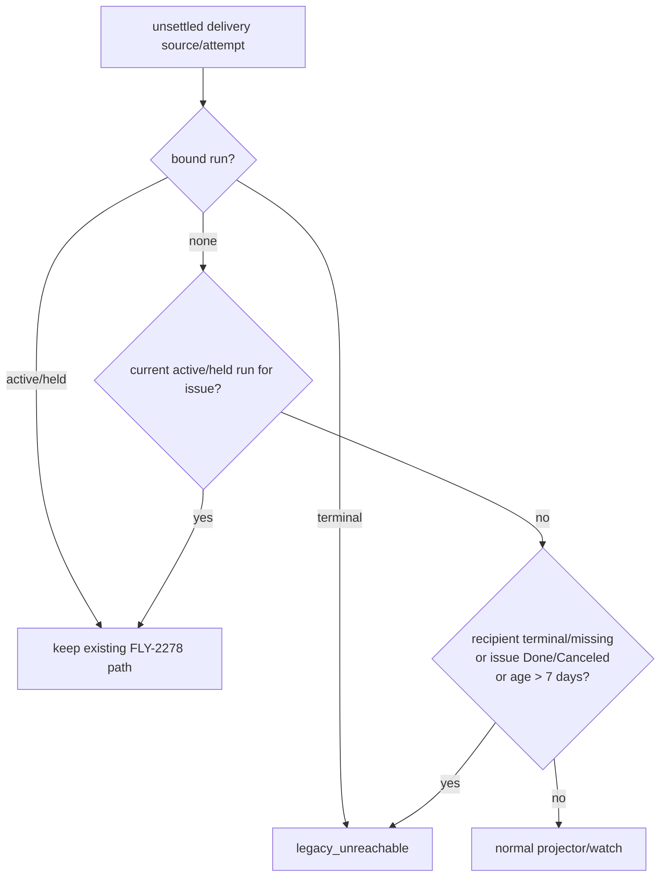

# FLY-2324 投递告警风暴收敛 — 调研
Issue: FLY-2324 (https://linear.app/geoforge3d/issue/FLY-2324/引擎告警-部署后-bridge-启动-baseline-全量铸-796-条陈年投递契约-episode35min-内-362)
日期: 2026-09-04
基于: exploration.md

## 结论

修复应放在两个现有持久化边界，而不是加定时器、日志限流或部署脚本：

1. 在每次 `DeliveryProjector` / `DeliveryContractWatch` pass 内建立一个带缓存的 legacy reachability
   guard。它先保护 active/held run，再把 terminal-bound 或无 run 且不可达的 attempt 以
   `legacy_unreachable` 原子 settlement 收口。新历史源不投影；已有 attempt/episode 关闭。
2. `listWorkflowDivergenceCandidates` 在 SQL 中只选择 active/held run；divergence event UID 纳入
   `observedLifecycleRevision`，使同一活跃 node attempt 的后续 revision 是新事实，不与旧事实冲突，且
   `workflow_divergence_check` 能在同一事务推进。

不需要 schema migration。一次性存量收口就是同一 guard 在部署后第一次 maintenance pass 对现有
attempt 的幂等应用，不维护第二份 migration 清单。

## 投递路径审计

### StateStore-native baseline

`StateStore.baselineWorkflowDeliveryContracts(now)` 只扫描五类 StateStore-native source：rework、
carrier、launch、land、gate_holder。当前 SQL 已对每一类要求 `run.status IN ('active','held')`，所以它
不会直接为 terminal run 新铸 attempt。

### CommDB projector

`DeliveryProjector.runPass(now)` 当前遍历：

- `CommDB.listRunnerDeliveryProjectionRows()`：所有未 ACK/supersede 的 instruction/response，不限行龄；
- `listRunnerPhaseWakeProjectionRows()`：所有未 finished phase wake，不限行龄；
- `listRunnerTurnWakeProjectionRows()`：所有 pending/sent turn wake，不限行龄。

它在检查收件 execution、issue、workflow run 之前就调用 `projectWorkflowDeliveryAttempt`。因此，旧的
CommDB 行被恢复为 live attempt。随后 `DeliveryContractWatch` 对所有 live attempt 做 overdue 分类并开
episode。incident 中 mailbox/phase_wake 的数量与这条路径完全吻合。

### watch 和既有 active-run recovery

watch 已实现 FLY-2278：active run 的 terminal-unacked recipient 会变成 `undeliverable` episode，随后
`DeliveryOperations` 可改派 successor 或 hold/operator-required。这个能力不能被“terminal recipient”
的粗粒度 guard 吞掉。

Engineering Lead 的最终裁定是 run 归属优先：

`7 days` 必须是有名字的代码常量，来源注释指向 FLY-2324；不提供 feature flag/env 开关。

## Reachability 证据来源

### run 归属

- 旧 attempt 若已有 episode `run_id`，`getWorkflowDeliveryAttemptRun(attemptId)` 是最强绑定；该 run
  active/held 时保护，其他状态视为 terminal-bound 并直接收口。
- 未绑定 attempt 按 `projectName + issue aliases` 查询最新 active/held workflow run。
- issue aliases 从 StateStore session 的 `issue_id` / `issue_identifier` 双向扩展；不能只按 CommDB 的
  `sessions.status` 或单一 FLY identifier。

### recipient 状态

- mailbox: `row.to_agent`；phase wake / turn wake: `row.execution_id`。
- 权威状态来自 StateStore `sessions`。`CMUX_LIVE_SESSION_STATUSES` 内为 live；
  `isOperationalTerminalStatus` 为 terminal；明确 execution id 但 StateStore 无行是 missing。
- 无法从 source/contract 解析 execution id 是 unknown，不等同于 missing；只可依赖 issue/run/age
  其他证据。

### issue terminal

复用 `linear_state_observations.last_state_type IN ('completed','canceled')`。由于该表以 Linear UUID 为键，
先用 session alias 把 `FLY-123` 扩到 UUID。没有本地 observation 时 fail-open；同步 maintenance tick 不
新增网络 I/O，也不把“没缓存”误判为 Done。

### age

以 attempt/source 的 immutable `minted_at` / `created_at` / `queued_at` 计算，解析失败 fail-open。
阈值为 `LEGACY_UNREACHABLE_AFTER_MS = 7 * 24 * 60 * 60_000`，`age >= threshold` 时成立。

## 存量关闭语义

`settleWorkflowDeliveryAttemptTx` 已把 attempt settlement 和 open episode closure 放在一个 SQLite
transaction 内。新增 legacy close seam 应复用这个事务，并保持：

- `workflow_delivery_attempt.settlement_reason = 'legacy_unreachable'`；
- `workflow_delivery_contract_episode.closed_at = caller now`；
- `closed_reason = 'legacy_unreachable'`（精确值，便于生产验收查询）；
- `alerted_at`、`severe_alerted_at` 原样保留，绝不清空或重发；
- 重放时 attempt 已 settlement，返回 no-op；不会重铸同 root 的 g1/a1。

如果 episode update 被 trigger/SQLite 错误拒绝，attempt settlement 同事务回滚。没有数据删除，也没有
自动 reopen；代码回滚只停止后续 guard，已正确收口的历史行保持 closed。

## 发散路径审计

`listWorkflowDivergenceCandidates` 当前条件为：engine-owned run、node `done`、session 是不可逆终态、
session lifecycle revision 尚未 check。它没有约束 run status，所以已 terminated/completed run 仍被每
tick 选择。

`commitWorkflowDivergenceObservation` 的 UID 是
`divergence:<run>:<node>:<attempt>`。当同一个 session 的 lifecycle revision 后续变化时，payload 改变但
UID 不变，`appendWorkflowRunEventCheckedTx` 抛 `workflow_event_uid_conflict`；transaction 回滚意味着
`workflow_divergence_check` 也不前移，于是下一 tick 选择同一 candidate。

两层收敛：

1. 候选 SQL 加 `r.status IN ('active','held')`，在数据库边界排除 terminal run。
2. UID 改为 `divergence:<run>:<node>:<attempt>:<lifecycleRevision>`。同一 revision 重放仍 dedupe；新的
   revision 可追加一条事实，并在同事务写 check。无需吞异常或加内存退避。

## 方案对比

| 方案 | 结果 | 取舍 |
|---|---|---|
| 只在日志层对 uid_conflict 限流 | 日志变少但 transaction 仍回滚、candidate 不收敛 | 拒绝 |
| 只给 divergence 加 try/catch backoff | 重启丢失，且 terminal run 仍被扫描 | 拒绝 |
| projector 只按 CommDB recipient status 过滤 | parked 状态词汇不完整，会误杀活 runner | 拒绝 |
| 给 legacy cleanup 建一次性 migration/清单 | 新旧判据会漂移，第二次历史风暴仍可能发生 | 拒绝 |
| 同一持久 guard 同时覆盖新投影与存量 attempt | 一套判据、幂等、restart-safe | 采用 |

## 回归矩阵

投递 integration fixture（真实 CommDB + StateStore）：

1. unbound + terminal recipient：当前代码会 mint/open，修复后 `minted=0`、`opened=0`。
2. 同形状但 active run：仍 mint，并保留 FLY-2278 的 undeliverable episode + successor reroute 阳性对照。
3. unbound + live recipient + recent：正常投影，防止 guard 过宽。
4. unbound + live recipient + age exactly 7d：legacy close；边界前 1ms 正常。
5. issue UUID observation Done/Canceled，经 identifier alias 后 legacy close。
6. 已有 warning/severe episode：first pass 原子关闭且 timestamp 保留；second pass 0 新 alert/episode。
7. 注入 episode close failure：attempt settlement 回滚。

发散 StateStore fixture：

1. terminated/completed run + stale revision：候选为空。
2. active run + failed done-node：第一 revision 记账，check 后候选为空。
3. session lifecycle revision 再增长：第二条 revision-scoped event 成功记账一次，随后候选为空且不抛
   `workflow_event_uid_conflict`。

执行任何 vitest/full-repo gate 时排除 `**/tmux-viewer.macos.test.ts`；该真机用例会控制
Terminal.app，Engineering Lead 已明确禁止在 founder 机器上执行。
