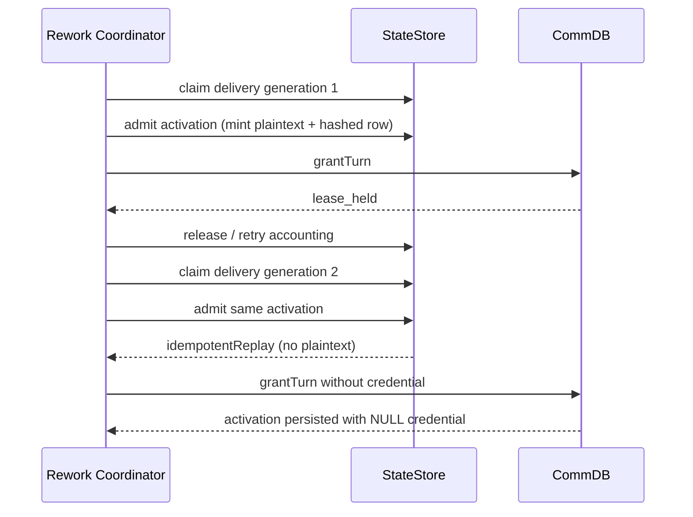

# FLY-2332 重放凭据轮换 — 探索
Issue: FLY-2332 (https://linear.app/geoforge3d/issue/FLY-2332/引擎urgent-rework-coordinator-重试-admit-走-idempotent-replay-时不-rotate)
日期: 2026-09-04
基于: 无

## 问题边界

rework coordinator 在同一个 activation 的首次 admission 成功、TURN grant 失败后，会释放 delivery claim。下一次 claim 再调用 admission 时得到 `idempotentReplay: true`，但 admission 不重发只存在于首次返回值中的明文 output/submission credential。coordinator 仍把 admission 返回值直接送进 `grantTurn`，于是 CommDB 的新 activation 行可能没有 credential。

本次只修复“admission 已落库、grant 尚未成功”的 replay 窗口：

- decision contract 节点恢复 submission credential；
- `produces_output` 节点恢复 output credential；
- rotation 失败继续走现有 retry accounting，并以 `engine_submission_rotation_<reason>` / `engine_output_rotation_<reason>` fail closed；
- 不改变 rework route、delivery 状态机、authority、claim schema，不回填已经交付的历史 wake。

## 现状数据流

## 约束与关键发现

1. `admitGeneralizedWorkflowExecution` 的 replay 语义刻意不返回明文，不能把凭据从哈希反解。
2. dispatcher 已在 pre-launch replay 上调用 `rotateGeneralizedWorkflowOutputCredential` / `rotateGeneralizedWorkflowSubmissionCredential`。
3. 这两个 rotation API 当前通过 legacy `getWorkflowExecutionBinding(executionId)` 解析上下文；actor re-entry 后同一 execution 有多个 activation，该 getter会 fail closed。
4. 两个 API 当前只接受未提交 launch owner fence；rework wake 的合法 writer fence 是 `workflow_rework_delivery.owner_id + generation + live lease`，原 actor 的 launch owner通常已经 committed。
5. 因此仅在 coordinator 复制 dispatcher 调用不够，必须让同一 rotation API 能以 exact activation 解析绑定，并在 wake activation 上验证当前 rework delivery claim。

## 方案比较

### A. 只在 coordinator 复制 dispatcher 调用

改动最少，但真实 reused actor 会因多 activation 或 committed launch owner而 fail closed，无法修复生产故障。拒绝。

### B. admission replay 自动重新铸造凭据

调用点简单，但会扩大所有 replay admission 的副作用，削弱 admission 的幂等合同，也缺少明确 delivery writer fence。拒绝。

### C. coordinator 显式 rotation + exact activation/rework claim fence（采用）

coordinator 只在 replay 且 admission 未返回相应明文时轮换。rotation API 增加可选 exact activation identity；如果该 binding 是 rework wake，则验证当前 delivery claim 的 owner、generation、lease、route/execution/attempt 一致性。dispatcher 的 launch-owner 路径保持原样。

## 验收形状

- 首次 reconcile admission 成功，`grantTurn` 抛 `lease_held`；第二次 reconcile 轮换并把新明文写入 CommDB activation。
- CommDB credential 明文哈希后等于 StateStore 最新未撤销 credential row。
- submission 与 output 两条用例分别覆盖。
- rotation owner/activation 不匹配时不 grant TURN，返回现有 engine rotation 前缀的 retryable reason。
