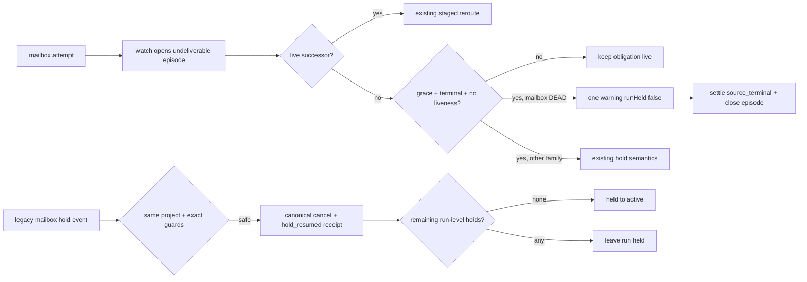

# FLY-2337 死信终结不冻结活 Run — 实施计划
Issue: FLY-2337 (https://linear.app/geoforge3d/issue/FLY-2337/引擎urgent-发给终态体的死信不得把活-run-打-heldundeliverable-hold-降级为告警bridge-重启)
日期: 2026-09-04
基于: research.md

## 锁定设计

本修复不把 terminal-recipient mailbox 从 delivery contract 提前删除。它仍先进入
`undeliverable` episode，让 `DeliveryOperations` 在物理终结前有机会把原信 reroute 到同一
workflow node 的活 successor；只有在 successor 不存在、grace 已过、recipient 已终态且
没有近期 liveness 时，mailbox family 才把 terminal source 记录为 `runHeld:false` 的告警
结果，随后在同一个 StateStore 事务中以 `source_terminal` settle attempt 并关闭 episode。
告警是审计结果，不是可重扫 obligation；Bridge restart/maintenance 因而看不到这条已终结
episode，也不会重铸 hold。真正有活 recipient 或尚在 grace/liveness 窗口内的投递继续保持
live。



关键不变量：

- `DeliveryProjector` 继续先把未 ACK、未 supersede 的 DEAD mailbox 还原成 delivery
  obligation；不在 projector 中猜 recipient/liveness，也不新增第二个 QUEUED/LEASED → DEAD
  writer。只有 operations 通过既有 safety gates 后才 atomically warning + settle/close。
- mailbox 物理 DEAD 仍只由现有 `RunnerMailboxLane` / `MailboxQueue.reconcileExpiredLeases`
  产生；该路径已经复用 `StateStore.resolveRunnerRecipientState()` 的 tri-state，跳过
  `unknown`，并用本地 gate-response guard 与 fail-closed
  `isTerminalDeliveryObligation` probe 保护 founder/design-review obligation。
- no-successor 分支统一进入 `holdWorkflowUndeliverable()`，因此 DEAD 也必须通过 successor、
  grace、recipient-terminal、liveness 四道门。mailbox 结果以 `runHeld:false` 写一次 event +
  warning，绝不改 `workflow_run.status`；若物理 source 已 DEAD，则同一事务 settle attempt 并
  关闭 episode。物理 source 尚为 QUEUED/LEASED 或 projection 暂缺时，不提前写 terminal
  warning。其他 family、活 recipient、grace、reroute-cap 与 successor 语义不变。
- 任何 `mailbox.state='DEAD'` 都属于此 non-hold 分支，不按 `dead_reason` 缩小范围；
  `delivery_attempts_exhausted` / `delivery_unconfirmed_exhausted` 仍产生 warning，但不能
  冻结 run。告警保留实际 exhausted reason；settlement 统一为 `source_terminal`。
- live successor 在 terminal warning 之前仍走原 staged reroute。terminal warning 已提交后，
  attempt/episode 已终结，晚到 successor 不得复活旧信；这同时是 maintenance 幂等 fence。
  对升级前已经写 warning 但仍 open 的 episode，maintenance 通过相同 safety gates 后只补
  settle/close，不重复告警，也不重新开放 late-reroute。
- 存量错误 hold 的 reconciler 固定使用 canonical `cancel`，不得自动 reroute。response mailbox
  的 `ref_id` 受 partial unique index `mailbox_unique_response` 约束；从 DEAD response 自动复制
  successor child 会撞唯一键，也超出了本单只终结无意义旧投递的授权边界。
- legacy cancel 若源 attempt 已 settled、superseded 或 missing，仍是 operator 可见且可 resume
  的 terminal no-op；标准 operation/receipt 关闭旧 hold。live source projection 缺失仍 fail
  closed。失败 generation 最多两次；第二次失败后写一条 deduped
  `legacy_dead_mail_reconcile_exhausted` warning，不再每 tick 无限新建 operation。
- schema 只保留本单确需的 `workflow_delivery_operation.resolution_reason`，允许
  `already_settled|superseded_or_missing`。不新增 reroute authority 字段、不改 approval/claim
  authority 表，也不放宽显式 operator reroute 的既有 cap 语义。caller 提交的 source
  resolution 必须与 StateStore 权威状态完全一致，不能用 terminal hint 跳过 live cancel。

## TDD 批次

### 1. DEAD cancel 幂等

先扩展 `packages/flywheel-comm/src/__tests__/fly2278-mailbox-cancel.test.ts`：

- 预先把 mailbox 行置为 `DEAD/recipient_terminal`。
- 调用 `cancelMailboxDelivery()`，期望成功且为 foreign-terminal no-op：
  `{ok:true,idempotentReplay:false,noop:true}`。
- 断言 DEAD 原因、dead timestamp 与其他字段不被改写。
- 保留现有 QUEUED/LEASED cancellation 和“同一 cancellation 已提交”的 exact replay
  `{idempotentReplay:true,noop:false}` 测试。

验证红后，最小修改 `packages/flywheel-comm/src/db.ts`，让任何 runner DEAD 行按已终结
成功返回；ACK 语义不变。`idempotentReplay` 只表示这一次 cancellation 本身已经提交，
不把其他 dead reason 冒充为 cancellation replay。

| source 当前状态 | `ok` | `idempotentReplay` | `noop` | 含义 |
| --- | --- | --- | --- | --- |
| ACKED | true | false | true | 已被收件，cancel 无事可做 |
| DEAD / `dead_reason=cancelled_by_operator:<operationId>` 且 `superseded_by=cancelled:<operationId>` | true | true | false | 本 operation 已提交，精确重放 |
| DEAD / 其他 reason（含已有 reroute fence） | true | false | true | 已由别的终结路径完成，foreign-terminal no-op；原字段不改写 |
| QUEUED/LEASED 可取消 | true | false | false | 本次 CAS 首次提交 |

### 2. terminal recipient、successor reroute 与 restart baseline

新增 teamlead 单包回归测试
`packages/teamlead/src/__tests__/fly2337-dead-mail-terminalization.test.ts`，通过真实
projector → watch → operations public chain 覆盖：

1. terminal recipient + 活 successor：在 warning/settlement 之前，operations 按既有 staged
   operation 产生 successor child mailbox；run 保持 active。
2. 先变成 DEAD、首个合资格 tick 尚无 successor并写一次 warning；attempt 以
   `source_terminal` settle、episode 关闭。数个 tick 后才创建同 node successor，旧信也不得
   重生或 reroute。
3. terminal recipient + 无 successor：先保留 QUEUED/LEASED obligation；由既有
   `RunnerMailboxLane` 以 tri-state/obligation guards 物理写成
   `DEAD/recipient_terminal`；grace 内不告警，grace 后 operations 记录一次
   `runHeld:false` warning，并原子 settle/close，run 保持 active。
4. founder-gate response 与 current design-review manifest obligation 不得被 terminalize；
   `unknown` recipient state 也不得被 terminalize。
5. 参数化已有 `DEAD/recipient_terminal`、`DEAD/lease_expired_unacked`，并加入生产已见
   `delivery_attempts_exhausted` 和可达的 `delivery_unconfirmed_exhausted`：DEAD 即物理
   terminal，任何 reason 都只能 warning/no-hold，然后成为 terminal obligation。
6. 活 recipient 和近期 liveness 两个 broken-guard fixture 必须零 warning、attempt 保持 live、
   episode 保持 open；防止 DEAD 快路绕过既有安全门。
7. 同一完整 pass 重跑模拟 Bridge restart/maintenance baseline：第二次 `examined=0`，不新增
   episode、operator-required event、workflow warning 或任何 run-level hold。
8. 断言 delivery-contract alert outbox 对同一 episode 只有一条 warning，并保留
   `delivery_attempts_exhausted` 的 reason；不得出现 `runHeld:true` 事件。

验证红后，把 `DeliveryOperations` 的 no-recipient DEAD 分派收敛到既有
`holdWorkflowUndeliverable()` 事务门。该门先重检 successor/grace/recipient/liveness，再写
non-holding event + warning；只有调用方观察到 mailbox source 为 DEAD 时，事务才追加
`settleWorkflowDeliveryAttemptTx(... reason=source_terminal)`。不新增 CommDB terminalization
API，不改变 projector active-source 集合；settlement 只发生在所有 guards 通过之后。

### 3. 存量错误 hold reconcile

在同一 teamlead 回归文件加入生产四形状参数化 fixture：

- FLY-2332：单 `review` node。
- FLY-2324：`review` node，带旧 terminated sibling run 不影响当前 run。
- FLY-2259：多轮 done 后最新 `review` node。
- FLY-2146：`running` implement node。

新增 project-scoped 的 legacy reconcile scanner。它只负责筛选安全候选并通过
`StateStore.canonicalizeHoldResume()` + `resumeWorkflowHold()` 复用现有 hold-resume
state machine，绝不直接写平行 ledger。scanner 仅处理 `listWorkflowHolds()` 中满足
以下条件的 open hold：

- shape 为 `delivery_undeliverable_no_recipient`，payload `family=mailbox` 且
  `runHeld=true`；候选按原 `holdEventUid` 身份处理。
- run 当前属于传入 `projectName` 且为 held，并至少有一个 `running|review` node。
- 无 `held|needs_lead` rework delivery。
- 无任何 `held|needs_lead` carrier delivery；包括 `last_error LIKE 'run_inactive:%'`
  的 held carrier，均阻止自动 reconcile，留给 operator 先处理。
- 除本次同一 run 的 legacy mailbox hold 集合外，不存在任何其他 open run-level hold。
  `run_held_by_operator`、land/retry/environment/loop/completion/gate 等任一 hold 都必须
  fail closed。

scanner 逐项复用并在测试中锁定 `resumeWorkflowHold()` 的真实前置条件：

1. canonical 只能含 `runId/shape/holdEventUid/decision/reason/principal/clientRequestId`；
   run、shape、hold UID、reason、client request ID 均非空，reason ≤ 500，client request
   ID ≤ 240，principal 必须为 `master`。
2. shape 必须存在于 registry，`delivery_undeliverable_no_recipient` 的 decision 必须匹配
   required decision；本 reconcile 固定为 `cancel`。
3. `now` 是 finite timestamp，调用者提交的 digest 必须等于重新 canonicalize 的 digest。
4. 相同 `clientRequestId` 若已存在，只允许 operation ID 与 canonical digest 都完全相同；
   否则 `request_conflict`。同一 `(runId,shape,holdEventUid)` 不得另有 staged/applied
   operation，否则 `hold_resume_in_progress`。
5. `listWorkflowHolds(runId)` 必须找到完全相同 shape + hold UID；hold 尚无
   `hold_resumed` receipt、run 存在且仍 held、hold 为 run-level/resumable，所有
   precondition 均为 true。
6. hold event payload 必须为 object，含非空 `attemptId/rootId/physicalId` 且
   `family=mailbox`。live cancel 时，同 run + attempt 必须仍有
   `stage=undeliverable AND closed_at IS NULL` episode；mailbox 支持 cancel，且 target 必须
   为 null。
7. project、run held、running/review node、rework/carrier、other run-level hold、retry cap
   等本批额外 guards 全部在 operation insert 的 StateStore 事务内重检；任一变化均 fail
   closed，不写 operation/receipt、不激活 run。physical cancel 完成后、`applied → projected`
   激活事务内再次复核相同 guards；若期间状态变化，operation 保持 applied，待 blocker
   清除后可重试 projection。

对通过 guard 的每个 hold，构造 canonical cancel：`decision=cancel`、
`principal=master`、`reason=fly2337_legacy_reconcile`，`clientRequestId` 由
`(runId, holdEventUid, failedGeneration)` 确定。live source 的 `resumeWorkflowHold()` 先 stage；
随后既有 `DeliveryOperations` 调 `cancelMailboxDelivery()` →
`applyWorkflowDeliveryCancellation()` → `projectWorkflowHoldResume()`。最后一步按原
`holdEventUid` 写标准
`hold_resumed:delivery_undeliverable_no_recipient:<holdEventUid>` receipt，重新计算
remaining run-level holds，仅为零且事务内 reconcile guards 仍全部通过时才 CAS
`held → active`。这个标准 receipt 同时是审计留痕和按
hold-event UID 的幂等 fence。

canonical resume 内部用显式 SELECT 区分三种 source 状态，不用一个 boolean 混淆：

- `live_attempt`：attempt 存在、未 settlement、未 supersede，且 open episode/CommDB row
  均存在；走现有 staged physical cancel。
- `already_settled`：attempt 存在且 `settlement_reason IS NOT NULL`；physical/attempt 均不
  再写，canonical operation 以 projected no-op 成功，并把 reason
  `already_settled` 带入标准 receipt。
- `superseded_or_missing`：StateStore attempt 已 supersede 或不存在；physical/attempt 均不写，
  canonical operation 以 projected no-op 成功，并把 reason
  `superseded_or_missing` 带入标准 receipt。

为让真实的 settled/closed legacy hold 可经过同一正门并继续支持人工处置，
`workflowHoldAuthoritativePrecondition()` 与 `resumeWorkflowHold()` 对上述两个明确 terminal
no-op 状态向 operator 显示 `resumable=true`；但 live attempt 缺 open episode 或 CommDB
physical projection 仍 fail closed，不得误激活 run。
三个分支都必须经过同一 operation insert、canonical `hold_resumed`、remaining-holds
重算和 run CAS；不得从 scanner 直接 append receipt。`applyWorkflowDeliveryCancellation()`
只处理 `live_attempt`，不放宽其 settlement CAS。

维护接线在 `plugin.ts` 的 per-project heartbeat block 中、带独立 try/catch，先执行
project-scoped scanner 来 stage canonical cancel，再执行 projector/watch/operations
推动现有 operation state machine；scanner 的单次失败不能跳过当前项目的正常 delivery
pass。它可每 tick 安全重放：相同 `(runId,holdEventUid)` 命中同一
`clientRequestId`/receipt，未来不同 hold UID 仍可独立收敛。failed operation 使用下一
generation 的 client request 重试，最多两次；到达上限后写一次 deduped warning，候选继续
held 且不再 stage 新 operation。

测试逐项断言：四个 fixture 经完整 scanner → operations 链后 active、open legacy hold
消失、DEAD attempt cancellation projected、每个原 hold UID 恰好一个 `hold_resumed`
receipt；双 pass no-op。另以独立 fixture 锁定 live、already_settled、superseded 和
missing attempt 四种输入，后三者分别投影为明确的 `already_settled` 或
`superseded_or_missing` no-op，均不触发 settlement CAS；另以 live-attempt + missing
physical projection 锁定 fail-closed。负控覆盖 rework blocker、
独立 held carrier、`run_inactive:*` held carrier、无 running/review node、run 非 held、
其他 project、每一种代表性其他 run-level hold。另以扫描后插入 blocking rework 与 physical
cancel 后插入 blocking rework 两个 race fixture，分别锁定 stage 事务和 activation 事务的
fail-closed / 可重试行为。

### 真库只读核验（2026-09-04）

实现前用 `sqlite3 -readonly` 将 `workflow_run_event.payload.attemptId/physicalId` 分别
LEFT JOIN `workflow_delivery_attempt`、open/closed
`workflow_delivery_contract_episode`，再用 physicalId 查询
`~/.flywheel/comm/flywheel/comm.db.mailbox`。未执行任何写入。

probe 固定 run 为 Lead 指定的 `bbe45c78`、`5bcae752`、`05991b32`、`ec0499a3`，执行：

```sql
ATTACH DATABASE 'file:<expanded-home>/.flywheel/comm/flywheel/comm.db?mode=ro' AS comm;
WITH h AS (
  SELECT r.issue_id, r.run_id, r.status AS run_status, e.seq,
         json_extract(e.payload,'$.attemptId') AS attempt_id,
         json_extract(e.payload,'$.physicalId') AS physical_id
  FROM workflow_run_event e JOIN workflow_run r ON r.run_id=e.run_id
  WHERE r.run_id IN ('bbe45c78-fd82-4cc2-98fd-1f99763ad9f0',
                     '5bcae752-0339-41a5-9af4-c34bc0068b9a',
                     '05991b32-0c86-4ae1-95ac-03c5cf7cfb08',
                     'ec0499a3-a5cd-47ca-8c0a-6dc763d4d6f3')
    AND e.kind='delivery_reroute_operator_required'
    AND json_extract(e.payload,'$.runHeld')=1
)
SELECT h.issue_id, substr(h.run_id,1,8) AS run8, h.run_status, h.seq,
       substr(h.physical_id,1,8) AS mail8,
       CASE WHEN a.attempt_id IS NULL THEN 'missing'
            WHEN a.settlement_reason IS NOT NULL THEN 'settled:'||a.settlement_reason
            WHEN a.superseded_by_attempt_id IS NOT NULL THEN 'superseded'
            ELSE 'live' END AS attempt_state,
       CASE WHEN ep.episode_id IS NULL THEN 'missing'
            WHEN ep.closed_at IS NULL THEN 'open:'||ep.stage
            ELSE 'closed:'||ep.closed_reason END AS episode_state,
       COALESCE(m.state||':'||COALESCE(m.dead_reason,''),'missing') AS mailbox_state
FROM h
LEFT JOIN workflow_delivery_attempt a ON a.attempt_id=h.attempt_id
LEFT JOIN workflow_delivery_contract_episode ep
  ON ep.attempt_id=h.attempt_id AND ep.stage='undeliverable'
LEFT JOIN comm.mailbox m ON m.id=h.physical_id
ORDER BY h.issue_id,h.seq;
```

原始输出（长 cancellation operation hash 仅缩写为 `<hold-resume-hash>`）：

```text
FLY-2146|ec0499a3|terminated|13|641c84a3|live|open:undeliverable|DEAD:recipient_terminal
FLY-2146|ec0499a3|terminated|17|fb072169|live|open:undeliverable|DEAD:lease_expired_unacked
FLY-2146|ec0499a3|terminated|20|b8ef6fbd|live|open:undeliverable|DEAD:delivery_attempts_exhausted
FLY-2259|05991b32|active|83|220e837a|settled:source_terminal|closed:terminal:settled:source_terminal|DEAD:cancelled_by_operator:<hold-resume-hash>
FLY-2259|05991b32|active|87|47402bca|live|open:undeliverable|DEAD:recipient_terminal
FLY-2259|05991b32|active|89|4f45a571|live|open:undeliverable|DEAD:recipient_terminal
FLY-2259|05991b32|active|91|c07b70b9|live|open:undeliverable|DEAD:recipient_terminal
FLY-2324|5bcae752|active|51|4b9f9f37|live|open:undeliverable|LEASED:
FLY-2332|bbe45c78|active|30|7121d803|live|open:undeliverable|DEAD:recipient_terminal
FLY-2332|bbe45c78|active|34|e7bb6223|live|open:undeliverable|DEAD:recipient_terminal
```

| issue / authoritative run | legacy hold 对应 attempt/episode | CommDB source | reconcile 预期 |
| --- | --- | --- | --- |
| FLY-2332 / active | 2 个 live attempt，2 个 open undeliverable | 2 个 DEAD/recipient_terminal | live canonical cancel |
| FLY-2324 / active | 1 个 live attempt，1 个 open undeliverable | 1 个 LEASED source | live canonical cancel；cancel CAS 负责终结 |
| FLY-2259 / active | 3 个 live/open；另 1 个 source_terminal + closed episode | live 三个均 DEAD/recipient_terminal；settled 一个已是 exact cancellation DEAD | 三个 live cancel；settled 一个走 canonical projected no-op |
| FLY-2146 / current active | 当前 run 已无 legacy hold；受影响的前序 run 有 3 个 live/open，但现为 terminated | DEAD reasons 分别为 recipient_terminal、lease_expired_unacked、delivery_attempts_exhausted | scanner 必须跳过 terminated；fixture 仍复刻其 running-node 形状验证 held 正例 |

该对照锁定两种真实兼容路径（live/open + present source、settled/closed + present source）
并证明 settled fallback 不是手工构造的不可达状态。missing source 仍作为负控/fallback 测试，
不在未核实的情况下直接关闭 hold。

### 4. 交叉路径回归

- 扩展 `packages/teamlead/src/__tests__/fly2278-hold-cancel.test.ts`：staged cancel 面对预先
  DEAD mailbox 时仍 applied → projected，且 canonical `hold_resumed` receipt 关闭 hold。
- 保留 FLY-2278 successor reroute、grace、live-recipient、reroute-cap、state-family
  symmetry 与 settle 测试；只更新“terminal/no-successor 最终必须 hold”的旧断言为
  单 warning/no hold；物理 DEAD 时 attempt/episode 同事务终结。
- 保留 FLY-2248 projector recovery 断言：DEAD mailbox attempt 在 operations 判断
  successor 之前仍为 live，证明 baseline 不会抢跑丢信。
- `fly2278-m0-schema` 覆盖 `resolution_reason` 的 legacy table rebuild/default；
  `fly-2006-database-retention-sweep` 与 `bridge-child-process-census` 作为受本分支主线同步影响的
  guard 一并执行，避免迁移列与 maintenance 接线破坏仓库级不变量。

## 精确验证命令

所有 Vitest 命令固定：`VITEST_MAX_THREADS=1 VITEST_MIN_THREADS=1`，仅运行单包且排除
`packages/core/test/tmux-viewer.macos.test.ts`。

```bash
VITEST_MAX_THREADS=1 VITEST_MIN_THREADS=1 pnpm --filter flywheel-comm exec vitest run --pool=forks --poolOptions.forks.maxForks=1 --poolOptions.forks.minForks=1 src/__tests__/fly2278-mailbox-cancel.test.ts src/__tests__/mailbox-queue-capabilities.test.ts --exclude ../../packages/core/test/tmux-viewer.macos.test.ts
VITEST_MAX_THREADS=1 VITEST_MIN_THREADS=1 pnpm --filter flywheel-teamlead exec vitest run --pool=forks --poolOptions.forks.maxForks=1 --poolOptions.forks.minForks=1 src/__tests__/fly2337-dead-mail-terminalization.test.ts src/__tests__/fly2278-mailbox-event-flow.test.ts src/__tests__/fly2278-hold-cancel.test.ts src/__tests__/fly2278-undeliverable-hold.test.ts src/__tests__/fly2278-comm-reroute-flow.test.ts src/__tests__/fly2278-settle.test.ts src/__tests__/fly2278-r4-symmetry.test.ts src/__tests__/fly2248-r6-projector-recovery.test.ts src/__tests__/fly2248-delivery-transition-table.test.ts src/__tests__/fly2278-hold-writers.test.ts src/__tests__/StateStore.workflow-holds.test.ts src/__tests__/fly2278-m0-schema.test.ts src/__tests__/fly-2006-database-retention-sweep.test.ts src/__tests__/bridge-child-process-census.test.ts --exclude ../../packages/core/test/tmux-viewer.macos.test.ts
pnpm --filter flywheel-comm build
pnpm --filter flywheel-teamlead build
pnpm lint
```

根据 Lead 对本机 kill storm 的明确约束，本节点不运行 `pnpm -r build`、
`pnpm test:packages:run` 或任何 packages-wide suite；PR test plan 明确记录该受控偏差。

## 提交与评审

- 文档与每个 TDD 行为批次分小 commit；`progress.md` 每批更新。
- plan commit 后注册 design review，APPROVED 前不写实现代码。
- 早开 draft PR 到 `main`，body 含 Linear 链接与精确 test plan。
- code review 通过受支持的 rescue 路径运行；review 执行期间不 push，blocking fixes
  批量后一次 push 并开新 review。
- milestone 文件作为 code review 前的 literal last commit。code review APPROVED 后不再
  移动 head，不运行会提交 ledger 的 progress 命令；只编辑 PR body并执行
  `complete --route needs_review --pr <number>`。
