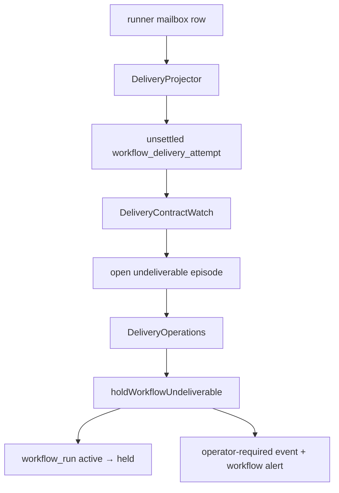

# FLY-2337 死信终结不冻结活 Run — 调研
Issue: FLY-2337 (https://linear.app/geoforge3d/issue/FLY-2337/引擎urgent-发给终态体的死信不得把活-run-打-heldundeliverable-hold-降级为告警bridge-重启)
日期: 2026-09-04
基于: exploration.md

## 当前执行链

`packages/teamlead/src/bridge/plugin.ts` 在 heartbeat maintenance 中按 `baseline → projector → watch → operations` 顺序执行。Bridge 重启后的首个 tick 会立即走这条链。

## 代码证据

- `packages/flywheel-comm/src/db.ts`
  - `listRunnerDeliveryProjectionRows()` 包含所有 `DEAD` 且未 ack/supersede 的 runner mailbox 行。
  - `cancelMailboxDelivery()` 只把同一 cancellation operation 写出的 DEAD 视为 replay；其他 DEAD 返回 `mailbox_source_changed`。
- `packages/teamlead/src/bridge/delivery-contract/projector.ts`
  - `activeSources` 把未 ACK 且未 supersede 的 DEAD 行也当成 active。
  - settlement 分支只识别 ACK/superseded，不识别 DEAD terminal reasons。
- `packages/teamlead/src/bridge/delivery-contract/sources/mailbox.ts`
  - DEAD 或 terminal recipient 被分类成 `undeliverable`，但没有同步结算 delivery attempt。
- `packages/teamlead/src/StateStore.ts`
  - `observeWorkflowDeliveryContract()` 为 `undeliverable` 打开 episode。
  - `holdUndeliverableTx()` 在 grace 到期后把 run CAS 到 held，并写 `delivery_reroute_operator_required` 与 `workflow_alert_outbox`。
  - `settleProjectedWorkflowDeliveryAttempt()` 已提供结算 attempt 并关闭 open episode 的事务边界，可直接复用。
- `packages/teamlead/src/bridge/lead-inbox-runtime.ts`
  - mailbox DEAD 已通过 dead-letter cursor/intent/receipt 形成独立、幂等的单条告警链；无需再由 delivery-contract 生成第二条告警。

## 生产只读对照（2026-09-04）

从 `teamlead.db` 与 flywheel CommDB 只读查询得到：

| Issue | 活 run 形状 | 错误 hold 形状 | rework/carrier 阻断 |
|---|---|---|---|
| FLY-2332 | `founder_gate/review` | mailbox operator-required | 无 |
| FLY-2324 | `founder_gate/review`（另有旧 terminated run） | mailbox operator-required | 无 |
| FLY-2259 | 两轮 `founder_gate/review` | 多个 mailbox operator-required | 无 |
| FLY-2146 | `implement/running` | 多个 mailbox operator-required | 无 |

四种形状共同说明：run 是否仍有工作必须由 `workflow_run_node.state IN ('running','review')` 判断；不能因收件 execution 已终态而把整个 run 终结或冻结。生产存量中还存在旧 `delivery_attempts_exhausted` 行被同一错误 hold 覆盖，因此一次性 reconcile 按旧 hold 事件与 run 保护条件收敛；forward/restart 分类仍严格只放行 `recipient_terminal` 和 `lease_expired_unacked`。

## 方案比较

### 仅修改 hold writer

让 `holdUndeliverableTx()` 对 mailbox 返回 non-holding 可以避免状态 CAS，但 attempt 与 episode 仍保持 open，maintenance 会永久重复扫描，且 cancel/reconcile 债务不消失。

### 在 projector 终结物理与投影状态（采用）

projector 同时掌握 CommDB row 与 StateStore attempt：

1. 对未 ack 且收件 session 已终态的 QUEUED/LEASED 行，调用 CommDB 的幂等 terminalization CAS，写成 `DEAD/recipient_terminal`。
2. 对 `DEAD/recipient_terminal|lease_expired_unacked` 不加入 active source 集，并用原 dead reason 结算 attempt。
3. watch 随后只会看到仍真正未结的 attempts，因此不会打开新的 undeliverable episode。

该位置保留真正活收件人的所有原 reroute 行为，也天然覆盖 restart 重扫。

### 存量恢复

projector maintenance 同轮调用 StateStore 的幂等 legacy reconcile。StateStore 只依据自身事务内的 run/event/node/rework/carrier 权威行恢复，结算旧 attempts、关闭 episodes、写单个确定性 `delivery_undeliverable_hold_reconciled:<runId>` 事件，再把 held CAS 为 active。重复 tick 因状态与 event uid 双重围栏成为 no-op。
