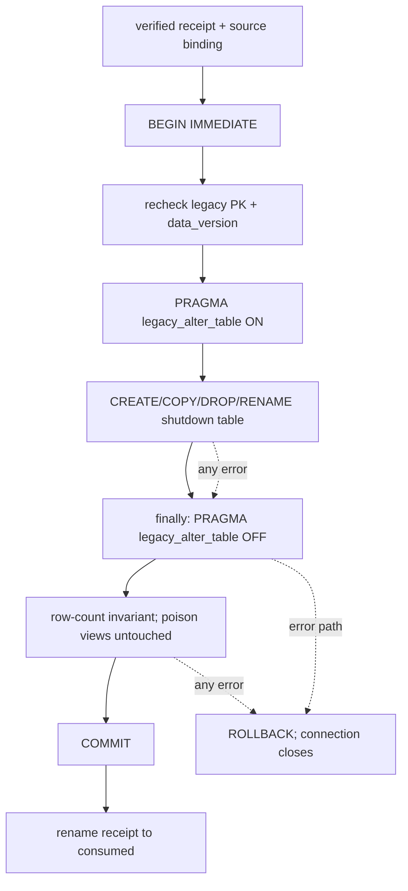

# FLY-2349 shutdown-controls 重建与 poison view 冲突 — 实施计划
Issue: FLY-2349 (https://linear.app/geoforge3d/issue/FLY-2349/p0main-fly-2268-的-runner-shutdown-controls-重建在-database-open-阶段跑-ddl撞)
日期: 2026-09-04
基于: research.md

## 1. 目标与锁定范围

修复 FLY-2268 `runner_shutdown_controls` receipt-gated rebuild 与 FLY-1572 poison views
的启动时序冲突，使已经迁移 mailbox、但仍是 legacy shutdown PK 的 CommDB 能在 receipt
发布后完成首次及重复可写打开。

只改两处：

1. `packages/flywheel-comm/src/commdb-open-gate.ts`
2. `packages/flywheel-comm/src/__tests__/db.fly2268.test.ts`

不改 Bridge 启动/preflight、receipt 格式、source binding、backup、stale fallback、
`CommDB` migrations、`MailboxQueue` public API、生产数据库或 deploy/rollback 运维流程。

## 2. TDD 实施顺序

### Step A — RED：生产形状 fixture

在 `db.fly2268.test.ts`：

- 从 `mailbox-schema.ts` 引入 `MAILBOX_POISON_VIEWS`；
- 把现有 `downgradeShutdownSchema()` 的默认 fixture 改为：完成 legacy 表构造后、同一
  connection 的 `wal_checkpoint(TRUNCATE)` 之前恢复两个真实 poison views；保留显式
  `poisonViews: false` 只给一个无-view 兼容用例；
- 新增测试
  `rebuilds a legacy shutdown table with both FLY-1572 poison views present`；
- fixture 前置断言 legacy PK、两个 `sqlite_master.type='view'` 以及两条 sentinel 引用，
  防止测试因 fixture 未装上而假绿；
- 发布真实 receipt 后调用 `new CommDB(dbPath)`；修复前必须得到
  `phase: database-open / error in view messages / fly1572_poison_messages_use_mailbox`。

RED 命令：

```bash
pnpm --filter flywheel-comm test:run --pool=forks --poolOptions.forks.maxForks=1 --poolOptions.forks.minForks=1 src/__tests__/db.fly2268.test.ts -t "rebuilds a legacy shutdown table with both FLY-1572 poison views present"
```

### Step B — GREEN：transaction-scoped legacy ALTER 语义

在 `commdb-open-gate.ts`：

- 保持两个 poison views 原样存在，不执行任何 view DDL；
- 在 `rebuildRunnerShutdownControls(db)` 原 table create/copy/drop/rename batch 前设置
  `PRAGMA legacy_alter_table = ON`；
- 用 `try/finally` 在 batch 成功或失败时都执行 `PRAGMA legacy_alter_table = OFF`，再进行
  row-count 后置断言；
- 不移动 `BEGIN IMMEDIATE`、receipt 验证、data-version 复验、commit/rollback 和 receipt
  rename 的边界。

本方案已用 production-shape 临时 fixture 实测：完整 create/copy/drop/rename exit 0，复合
PK 正确，shutdown 行逐字段保留，两个 view 的 `sqlite_master.sql` byte-identical，且 reset
后 `PRAGMA legacy_alter_table = 0`。它比 view 手术更小，也天然避开同名 legacy table 的
`DROP VIEW` 错误。

最小改动后重跑同一测试，必须变绿。

### Step C — REFACTOR / 回归收紧

在同一测试继续断言：

- shutdown 行内容保留且 `settlement_reason=null`；
- PK 为 `(execution_id, request_id)`，新列存在；
- 两个 view 在首次打开完成后仍是原 poison view；
- receipt 原路径消失并存在 `.consumed-*` 记录；
- 连续三次 `CommDB` 可写打开均成功，schema 不再触发 rebuild。

另用独立 fixture 直接调用 `openCommDbWritable(dbPath)` 触发 rebuild，断言返回 connection
上的 `PRAGMA legacy_alter_table = 0`，证明 finally reset 发生在 connection 交还 caller 前。

另加一个 path-based `MailboxQueue` 用例：从默认 poison + legacy fixture 发布 receipt，
直接 `new MailboxQueue(dbPath)`，断言 rebuild 完成、两个 view 的定义完全不变，关闭后
再次打开成功。这个用例把“选择共享 gate 而非仅 CommDB migrations”的核心 writer-parity
理由变成可执行证据。

随后运行整个 FLY-2268 文件，确保 stale/no receipt/concurrency 负向 guard 未回归：

```bash
pnpm --filter flywheel-comm test:run --pool=forks --poolOptions.forks.maxForks=1 --poolOptions.forks.minForks=1 src/__tests__/db.fly2268.test.ts
```

## 3. 事务与失败路径不变量



- `rebuildRunnerShutdownControls()` 仍只由 legacy-PK + verified receipt 分支调用。
- pragma scope 包含在调用方已经持有的 transaction 中；不新增嵌套 transaction。
- 失败时普通 SQLite error 继续 fail-loud；只保留既有
  `CommDbPreflightStaleError` 的兼容行为。
- receipt 只在 commit 后消费；失败或 rollback 时原 receipt 保留。
- `MAILBOX_POISON_VIEWS` 不被 drop、改写或重建，继续作为 FLY-1572 legacy API 的
  fail-loud guard。
- pre-FLY-1572 同名 tables 同样不被触碰；本单不改变它们现有的 generation/migration
  处置路径。

## 4. 验收矩阵

| 要求 | 证据 |
|---|---|
| legacy + poison 能触发旧故障 | 新测试先 RED，错误匹配 exact database-open symptom |
| gate 修复首次 open | 同一测试 GREEN，真实 `CommDB` constructor 完成 |
| 两个 view 都恢复 | `sqlite_master` 对两个 name/type/sql 的断言 |
| shutdown 数据守恒 | exact request row 与 PK/column 断言 |
| receipt 不永久重放 | receipt consumed 断言 + 连续三次 reopen |
| path-based writer 同样修复 | poison + receipt fixture 经 `new MailboxQueue(path)`，view SQL byte identity + reopen 断言 |
| 无 receipt/stale/concurrent 不回归 | 默认 poison fixture 下的全 `db.fly2268.test.ts` |
| 无-view 兼容 | 唯一显式 `poisonViews:false` fixture |
| package 行为稳定 | 指定的单文件 forks=1 测试 + build，不跑整包 Vitest |
| 静态/构建无回归 | `pnpm lint`、`pnpm -r build` |
| PR CI | push 后读取 exact head checks；本地不跑全仓测试 |

本单不新增 `scripts/__tests__/*.test.sh`，因此没有额外 shell test 命令。

不得在本机运行 `pnpm test:packages:run`：它包含
`packages/core/test/tmux-viewer.macos.test.ts`，会真实打开 founder 的 Terminal.app，且仓库
没有默认 exclude。按 Lead ruling，本节点本地验收仅运行上面的本单单文件 forks=1、
`pnpm -r build`、`pnpm lint`；全仓测试由 PR CI 承担并在 exact head 上读取结论。

## 5. Commit、评审与交付

1. 提交 exploration/research/plan（progress 由 ledger 命令独立 path-only 提交）。
2. 完成 RED→GREEN 后提交最小 code+test commit，commit message 写明正确假设：SQLite
   在 shutdown DDL 时重解析 FLY-1572 poison views。
3. 运行 focused/package/full-repo gates，并记录结果到 progress。
4. 运行 `codex:rescue` code review；再按 runner contract 开
   `review_code` gate + `request-review --type code`。任何 blocking finding 修复后用新 gate
   重新评审。
5. 新建 `engineering/doc/milestones/FLY-2349.md`，它必须是 PR 前的字面最后一个 commit。
6. push feature branch、创建 PR，不 merge、不 deploy、不 dispatch QA。
7. 更新 implement role memory（若有可复用新判断），通过唯一 report channel 向 Lead 报告，
   最后执行 `complete --route needs_review --pr <NUMBER>`。

## 6. 回滚

代码回滚只需 revert 本单 code+test commit；没有 schema 反向迁移，因为本单不改变目标 schema
或 receipt 格式。若部署后二进制回滚，沿用 FLY-2268 已批准的 backup/restore 边界；本节点
不执行生产停机、恢复或部署。
