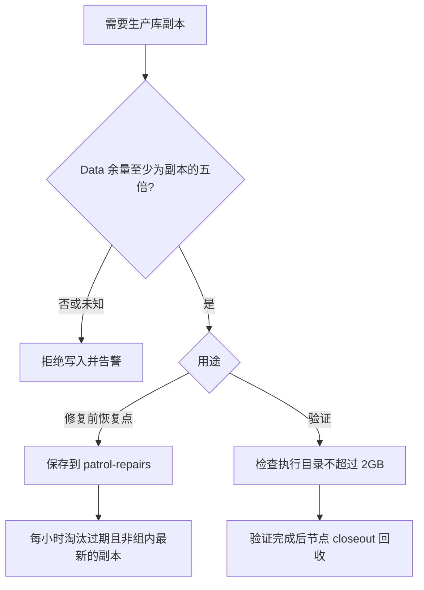

# FLY-2351 快照与磁盘护栏 — 实施计划
Issue: FLY-2351 (https://linear.app/geoforge3d/issue/FLY-2351/运维磁盘-满盘事故-9-5-0130patrol-repairs-库快照无上限127-份55gb-qa-体往-tmp-拷生产库不回收)
日期: 2026-09-08
基于: research.md

状态：R1 CHANGES_REQUESTED 后修订，待 R2 design review。范围：设计交付；以下代码改动由 implement 节点执行。

## 1. Founder 概览

修复备份留下需要的恢复点，验证副本用完归还空间；任何新副本生成前，先确认真正写入的 Data 卷有足够余量。

三个可观察结果：①旧修复备份自动淘汰且有“将删/已删/保留原因”记录；②验证副本只在执行专属目录里，节点交接即回收；③余量低于 20GB 时，巡检与容量接口同时显示事实。



关键取舍：保留规则是“24 小时内”和“每 issue 每类最新”的并集。因此随着 issue 增多，总量仍可能增长；本 issue 不擅自删每组最后一份，也不承诺全盘永不满。20GB 是告警线，不新增 runner 调度暂停条件。

## 2. 单一合同与单位

1. `GB = 1,000,000,000 bytes`，2GB=2,000,000,000 bytes，20GB=20,000,000,000 bytes。所有判断使用整数 bytes；界面可保留两位小数，不能以舍入后的 20.00 判断健康。
2. macOS 路径固定 `/System/Volumes/Data`。读取 `fs.statfs(...,{bigint:true})` 的 `bavail*bsize`，不用 bfree，不从 `/` 推断。不支持的平台报告 `structural: data_volume_unsupported`；macOS 目标路径缺失报告 `structural: data_volume_missing`，读失败为 `transient: data_volume_unreadable`。不静默 fallback。
3. 保留 issue 明确要求的顶层 `disk_avail_gb`（不舍入的 GB 派生值）；新增 `disk: {volume, availBytes, observedAt, unavailable?}`，其元数据沿用 CapacitySnapshot 的嵌套 camelCase 形状。availBytes 是唯一阈值事实，JSON 输出前校验非负安全整数；内部 BigInt 超出安全范围时 unavailable，禁止丢精度。容量读取失败时 availBytes、disk_avail_gb、observedAt 为 null。容量失败不让 HTTP 500 或隐藏其他已有指标。
4. 修复快照分组键 `(issueIdentifier, databaseKind, project)`：`databaseKind ∈ teamlead | comm`，teamlead 的 project 用固定 `global`；comm 必须用实际 project。显示名称“FLY-xxxx · 调度库”或“FLY-xxxx · <project> 通信库”。修复动作、request id、runner vendor 不参与分组。
5. workflow runner 身份使用既有 `(executionId, runId, nodeId, attempt, activationId)`；普通非 DAG session 使用 `(executionId, sessionStartedAt)`。人工分析使用本次分析的 `operator-<randomUUID>` 与 UID/PID，不冒充任何 runner。不要新造 phase 状态词；workflow 最终完成证据来自 `workflow_node_completion` 或已接受的 `workflow_founder_gate_verdict`/节点 decision，不能相信请求文字或 HTTP 200。TURN 只约束共享 worktree，不是临时副本的身份/准入源。

## 3. 最小实现落点与接口

新增 `packages/flywheel-comm/src/snapshot-storage.ts`，包导出 `flywheel-comm/snapshot-storage`。这里放小型共享函数，不建立 class/通用 storage provider。teamlead 已依赖 flywheel-comm；两者已安装 better-sqlite3，无需改依赖图或加 npm 包。再新增 `commands/snapshot.ts` 作为 CLI 参数/执行上下文边界；Bridge 直接调用共享函数。

| 接口/入口 | 输入与输出 |
|---|---|
| `readDataDisk()` | 返回 §2.3 的 disk 元数据、原始 bytes 与派生 disk_avail_gb；同一实现服务 CLI/Bridge |
| `createRepairSnapshot({source,issueIdentifier,databaseKind,project})` | 只读源，返回 final path/bytes/createdAt/group；失败不留下 final DB |
| `createManagedSnapshot({source,owner,databaseKind,project})` | owner 为 §3.0 的 workflow/session/operator 身份；返回受管 path/bytes/owner；三者共享预算/写入算法，不接受任意 destination |
| `withOperatorSnapshots({label}, use)` | 当前分析进程创建 operator owner，把同一预算/写入 helper 交给 use；await use 后 finally 回收，本地审计记录 owner/label/result |
| `pruneRepairSnapshots({dryRun,now})` | 扫描顶层规范 final 和经确认的 legacy 映射，返回逐项 reason 与汇总 bytes |
| `cleanupRunnerSnapshots({executionId,expectedOwner,authorize})` | 路径在函数内部推导；锁内 fresh authorize，owner mismatch 返回 skipped；失败返回 retryable error |
| `flywheel-comm snapshot disk` | JSON，只读、不依赖 Bridge 在线；patrol shell 用这个读取值 |
| `snapshot repair --source <path> --issue <id> --kind teamlead\|comm [--project <key>]` | 仅允许修复用途；source 是实际配置库的规范路径；更新巡检配方用它获取 BACKUP_PATH |
| `snapshot runner --source <path> --kind teamlead\|comm [--project <key>]` | 仅取调用者 FLYWHEEL_EXEC_ID，经只读 owner endpoint 解析 workflow/session；不接受别的 exec 覆盖，未知/已结束 owner 拒绝；不检查 TURN |
| `snapshot prune [--dry-run]` | 人工预演默认 dry-run；`--apply` 才删除；Bridge 自动回调明确 apply 并先生成同算法 dry-run 记录 |
| `snapshot release` | 仅释放调用者 owner 的目录；短脚本 finally 使用，跨 exec 不可指定 |

生产调用不提供 root/clock/probe override CLI 参数；测试直接注入函数依赖和小型 fixture 根。纯测试 fixture 保留自己的临时测试根。

### 3.0 三类调用方有各自可执行路径

新只读 `GET /api/sessions/:executionId/snapshot-owner` 复用现有 tokenAuthMiddleware（缺配置503、错误token401），由 `teamlead/src/bridge/snapshot-closeout.ts` 中唯一 owner resolver 实现。CLI 不导入 StateStore、不加反向包依赖、不复制其 workflow SQL；通过该 endpoint 读取 owner，Bridge 清理直接调用同一 resolver。

- **workflow runner**：StateStore `resolveCurrentWorkflowActivation(execId)` 返回 current，且对应最新 node attempt 未结束、未有完成凭据时，使用 binding 五元组。resolver 的 current 不自动等于未终态：另读 `workflow_run_node.ended_at/state` 及 completion。ambiguous/有历史但无当前绑定一律拒绝，不降级为普通 session。此查询不读 TURN，因此合法的临时只读工作不受其他节点持有 worktree 影响。`CommDB.resolveRunnerWorkflowActivation()` 实际仍依赖 TURN，不能拿它代替此 resolver。
- **非 DAG runner**：只有 resolver 返回 none、StateStore 明确不存在 workflow enrollment，且 session 未终止/结束时，使用 execId + started_at。`no-turn` 不拒绝；丢失/不可读 session 拒绝。仍禁止覆盖为其他 execution。
- **人工/Lead 分析**：三个迁移脚本（cycle-time-report、fly2396-retro-report、fly-2006-retention-rehearsal）在自己的 main/run 函数中显式选择：存在 FLYWHEEL_EXEC_ID → runner owner；变量不存在 → `withOperatorSnapshots({label:固定脚本名}, async context => ...)`。后者创建随机 operator exec 根，记录 `kind=operator,executionId,uid,pid,createdAt,label`，保存/使用/关闭所有数据库句柄后 finally 回收。原有无 exec 的人工命令继续可执行，不要求捏造登记 execution，不把 Lead 的身份写入 runner 表。已有但无效的 runner context 绝不回退 operator。
- operator owner 只绑定**仍在运行的分析脚本进程**，不是瞬间退出的 CLI 子进程；只能扫描原 UID 的根。进程崩溃后 maintenance 对记录 PID 作原生存活探测：明确 ESRCH 才回收，alive/EPERM/unknown 均保留并告警。PID 复用只导致保留，不能成为删除别人的目录依据。人工模式不参与 workflow completion 回收。

获取、publish 前、release/cleanup 锁内都重验 owner；Bridge owner endpoint 不可用时 runner 获取拒绝，repair 和无 runner context 的 operator 分析仍使用本地明确归属与磁盘门槛。fixture 验证 HTTP 鉴权、current/none/ambiguous、无 TURN 的普通 session、三个无 exec 入口、invalid runner 不降级 operator，以及子进程结束但父分析仍使用副本的负例。

### 3.1 文件布局：一处身份，禁止镜像词表

- repair final：`<stateRoot>/patrol-repairs/<ISSUE>__<teamlead-global|comm-PROJECT>__<UTC-milliseconds>__<randomUUID>.db`。strict parser 是规范文件的唯一身份来源；不要另存可漂移的 sidecar 分组。
- repair 进行中：`patrol-repairs/.partial/<randomUUID>/snapshot.db`，完成前不能成为“最新一份”。
- runner/operator：`/tmp/flywheel-snapshots/<executionId>/`，里面 `.owner.json`（version=1 + kind=workflow/session/operator 与 §3.0 对应身份字段）和随机唯一命名的 DB；WAL、SHM、临时、衍生 DB、metadata 都计入目录预算。macOS 仅接受系统已知的 `/tmp → /private/tmp` 别名，根规范化为 `/private/tmp/flywheel-snapshots`。受管根本身及其下每段都 lstat 拒绝 symlink；已存在根必须 st_uid=当前 euid 且 mode=0700，不符合就拒绝/告警，不能 chmod 或跟随抢占者目录。核对 canonical parent 为 `/private/tmp` 且锁内根 dev/inode 不变；不能把系统 `/tmp` symlink 本身当违规而永久禁用功能。
- legacy：`patrol-repairs/legacy-map.json` 只映射非规范历史文件。每条含 basename、size、mtimeNs、device/inode、issue/kind/project、createdAt、归属证据。重新 lstat 不一致即停止该项。新规范文件不复制进此表。
- 共用互斥：`<stateRoot>/state/snapshot-storage.lock/`，mkdir 原子获取，保存 PID、进程开始身份与随机 nonce。创建、删除、legacy adopt 串行；不新增数据库锁表。共享函数每次等待最多 5s，Bridge busy 留到下一 tick。一次性 CLI 在总体等待预算 90s 内以 1s/2s/4s/5s（之后保持5s）退避重试，不超过 12 次；预算到期退出75，JSON `ok:false,reason:snapshot_lock_busy,retryable:true`。参数/owner错误退出64，不足空间/目录预算退出73，读取或备份失败退出74。巡检配方将 busy 记 transient unavailable，本 tick 不做依赖该备份的库修复，下 tick 重试；不得无限循环或绕开锁。锁从 preflight 持到发布/partial 清理结束。死锁回收必须证明持有进程已死且身份未变；年龄本身不能授权抢锁，未知保留并告警。

### 3.2 写入前检查与完整性

1. 先验证 source：真实普通文件、来源配置一致，不是目录/symlink/hardlink 替身，不接受路径穿越、控制字符。issue/project/exec 按现有安全 key 约束并拒绝 `.`/`..`/分隔符。所有 StateStore 查询参数化；数据库内容不进入 shell 命令拼接。
2. 使用已有 better-sqlite3 打开源 `readonly:true,fileMustExist:true`；只读事务固定一个读取快照。读取 `page_count`、`page_size` 并取 `S=max(source stat.size, page_count*page_size)`；这覆盖 WAL 中已提交但主文件未增长的页。S 必须是合法正整数。禁止直接 cp 活库。
3. 取得共享锁，重验根、source/owner，读取新鲜 Data avail。若 `avail < 5*S` 或读取未知，拒绝且告警；等号允许。空间检查在创建任何大文件前完成；metadata 也纳入 runner budget。
4. runner 扫整个 execution 目录的普通文件逻辑大小（含隐藏文件/SQLite companions/子目录，拒绝链接和未知类型），`existingBytes + S + boundedMetadataBytes > 2e9` 拒绝。metadata 实际序列化 bytes 入账，不用任意宽松近似。为小量 SQLite 临时写入预留并实测上限；不能按稀疏文件实际 blocks 欺骗预算。
5. 用源上已固定的只读事务执行在线 `backup()`，默认每批 100 页且限定总时长 60s；备份 progress 验证总页数仍在预约内，异常/timeout 关闭连接中止。实现前在小型 WAL fixture 上证明固定读取事务不会让备份无声扩张；若库行为不满足，必须修正获取算法并补测，不能改成完成后才检查。
6. 所有写入落 0700 工作目录/0600 文件。输出 quick_check=ok 且实际大小≤预约，连接关闭后以同目录原子、不覆盖方式发布 final。失败、ENOSPC、信号中止尽力删本次 partial；失败记录 cleanup_pending，不抛掉原始错误。
7. 不因磁盘告警自动压缩/删除生产库或绕过留存。并发由共享锁避免两个 managed copy 同时通过旧余量；其他进程仍可耗盘，运行时 ENOSPC 必须安全失败。

2GB 是所有受管副本获取/衍生生成的硬准入预算，不是操作系统给任意 shell 写入设的配额。runner 规则禁止绕过、禁止在目录外再复制生产库；会增长的验证操作要事先预算，空间不足则改用小 fixture 或顺序释放/验证。维护扫描发现外部违规增长必须报 over_budget，不能把主动超量后删除当作准入成功。Lead 已于 2026-09-08 通过问题 `ec87d39f-aa63-49cb-b098-e96790a1077b` 明确同意该预算边界、§2 的分组键和 inventory+显式映射；映射不上的库一律不删。

## 4. 修复保留算法与历史迁移

同一锁下固定 now，先排除 incomplete/链接/归属不明文件，再按 group 选最新完整文件。时间顺序用规范创建时间；相同时间按文件名做稳定 tie-break。保留条件：`createdAt >= now-24h OR file == latest[group]`。恰好 24h 保留；未来时间保留并报 clock_skew。取并集而非交集，绝不把 UUID 当 class。

每次 apply 先输出 dry-run 决策：mode、path（仅受管相对名）、group、bytes、action/reason、candidate count/bytes，以及 `patrol_repairs_total_bytes`、`retained_group_count`、`unmapped_bytes`。这些统计每轮输出，供 Lead 看清“每组最后一份”长期累积量；不增加未经任务授权的保留年龄上限。删除前重验文件 device/inode/size/mtime 与根身份；变化就 skip。删除逐文件 unlink，不用 glob rm、不递归整个 patrol-repairs。失败计数/残留可见，其它独立候选可继续；下一 tick 重试。不要复制整库作为“删除前备份”。

在 Bridge `plugin.ts` 已有 detached maintenance callback 中每小时执行（tick 0 开机执行；真实时间间隔，不假设 heartbeat 固定），放在 `if (!worktreeAutocleanEnabled()) return` 之前；独立 try/catch。使用异步目录读取和分批 yield，文件操作失败不使 Bridge 退出。不新增 timer。自动路径默认启用；手动 dry-run 零删除。

历史首次上线：

1. 生成元数据 inventory 与 dry-run，包含所有旧 DB 和 unresolved bytes。
2. 实施/QA 从已有 repair 记录/请求映射确认 issue、source database kind、comm project。不是从 `FLY-2080` 配方号猜目标 issue；多 issue/ambiguous 名称提交 Lead 归属，未决不删。
3. 经确认写 legacy map，保留原 inode 文件，不额外复制/重命名数 GB 数据。按同一保留算法回收它们；附首轮 selected/kept/deleted/unresolved 清单。未决数量不得归零造假。
4. 旧任意 `/tmp/qa2341` 等只报告候选与持有进程/执行映射；无权威归属不自动搬/删。明确认领到终态执行后才由同一受限回收入口处理一次性迁移清单，清单必须绑定规范路径+inode 且不得是 `/tmp` 根或活库。
5. 清除失败后的 `.partial` 只在没有持锁/活跃创建者、身份核对通过后处理；不把 partial 当恢复点，遇到 owner 不可读保留并告警。

## 5. 节点 closeout：正常完成即回收，关闭为兜底

暂存数据库不能当长期 QA 证据。runner 先关闭打开的副本句柄，把必要的计数、散列和小型验证结果保存到 issue evidence，再提交完成/verdict。提交意味着该 owner 不再使用副本；常驻 TUI 继续活着不影响这个文件使用合同。

| 路径 | 精确 hook 与删除依据 |
|---|---|
| generalized completion | `event-route.ts:1209` 的 `commitEnrolledCompletion` 成功并确认确实有当前 owner 的 `workflow_node_completion` 后，DB transaction 外调用清理（按符号与成功分支定位） |
| QA pass/fail decision | `workflow-decision-routes.ts:769/:880` 两处 `submitWorkflowDecisionByCredential` 真正接受之后；验证已提交的节点终态与 owner |
| complete marker replay | 已走同一 accepted HTTP 路径，不加 raw marker 删除分支 |
| legacy/终止/取消/崩溃 | `close-runner.ts` 的成功关闭/独立 execution-death 分支，以及 `lifecycle-closeout.ts` per-node 确认后调用同一 helper；活跃/unknown/crash-preserve 不删 |
| 延迟失败/Bridge 重启 | 每次现有 detached maintenance tick 扫受管 exec 根（生产默认约5min，取决于 TEAMLEAD_STUCK_INTERVAL；没有1min SLA）；workflow 对照 completion/decision 或终态+强死亡证据，session 对照终态+强死亡证据，operator 按 §3.0 的 PID 明确死亡规则；没有新事件也能重试 |

锁内先核对 `.owner.json` 与 expected owner，再 fresh 读取完成与 current activation。旧 attempt 的异步回调不得删新 attempt 文件。新 attempt 创建副本前先收口旧 owner：仅旧 owner 有完成/死亡证据且无使用者才清理、更换 owner；否则返回 previous_owner_pending。清理整个 exec 目录前重新验证无链接、不跨根、当前 owner 未变化。

`snapshot release` 与正式 closeout 幂等：根/目录不存在视为 already_absent，但权限错误不是 absent。清理失败不得回滚已接受的 workflow receipt；记录 `snapshot_cleanup_pending` 并靠扫描重试，最终成功记录 bytes released。issue 终态 closeout 的报告增加存储项，残留使结果 partial，不能 claim complete。永久错误保持 operator finding；不删除节点身份来遮蔽它。

强制阴性：单纯 park/not-yours、HTTP 200 stale/superseded completion、普通 stage completed 字符串、原始 DirectEventSink signal、当前 attempt 活跃、新 activation、claimInFlight、进程 alive/unknown、丢失 owner、authority reopen、受管根或其子目录为符号链接、未知 exec 都不能删除。operator 不接受任何 workflow completion 作为删除理由；session 不接受其它 started_at 的结果。目录名/mtime 不是归属和死亡证明。这里的 park/not-yours 只是“不能单独授权删除”，不会反过来禁止合法临时只读获取。

## 6. 巡检、API、告警

- `CapacitySnapshot` 使用 §2.3 精确形状：`disk_avail_gb:number|null` + `disk:{volume,availBytes:number|null,observedAt:string|null,unavailable?:string[]}`。GB 不舍入，界面自行格式化；API 消费者按整数 availBytes 判断。Bridge builder 与 `snapshot disk` 共享 readDataDisk；`capacityProbes` 加可注入磁盘读取用于测试。
- `hook-payload.ts` 显示“Data 可用 x.xx GB”；严格校验有限非负值/时间/固定 volume/token。把 §2.2 三个 data_volume token 加入 `machine-free-pct.ts` 的现有闭合 `CAPACITY_UNAVAILABLE_TOKENS`；分别测试合法 unavailable 三项仍保留内存/额度，而未登记 token 不能进入提示。旧 schema=1 envelope 缺磁盘字段只显示磁盘未知，不使其他容量栏全失效。
- 新可执行源码 `scripts/flywheel-snapshot-control.mjs` 仿照 node-dwell-control 的 trusted launcher：realpath 自身定位所属 checkout，只加载该 checkout 的 `packages/flywheel-comm/dist/commands/snapshot.js` 的 `runSnapshotCommand`，无 env executable override。巡检用 Node `fs.realpathSync(BASH_SOURCE[0])` 的 dirname 找到这个同目录源码 helper，再通过 `node <helper> disk` 调用。这样 source 调用和已安装的 `flywheel-patrol-snapshot` symlink 调用都落同一受信任 checkout，无需新增全局 binary，也不假设 Claude Lead 有 FLYWHEEL_COMM_CLI。Node/helper/dist/subcommand 缺失时报 `UNAVAILABLE(structural: snapshot_helper_missing)`，不读0；测试真实双入口、symlink、缺 dist 和错误导出。既有 converge-flywheel-bin 继续保证 patrol symlink 指向受信任 checkout，不改变该合同。
- STEP 5 从 JSON 的 disk 元数据与顶层 GB 输出 `disk_volume=/System/Volumes/Data disk_avail_gb=<value> disk_avail_bytes=<integer> disk_below_threshold=yes|no`；unknown 列 token，不输出 0。
- `<20e9` 原始 bytes 强制最终 STEP 5 FINDING。gh/Raya unavailable 同时存在时，保留每项 `UNAVAILABLE_CAUSE`，低盘量 FINDING 不能被后写状态吞掉；需扩展最终 awk gate，使“低盘量事实+STEP 5 OK”失败。数值 unavailable 时 STEP 5 按现有不可用流程，不能记 OK。
- `runner-patrol-rules.md` STEP 5 追加精确低盘量处置和语法合法 FINDING detail；利用现有 Lead告警去重，低盘量事件每小时同机最多一次，恢复后下次低盘量是新事件。不重复创建新告警服务。
- 写入拒绝立即 stderr JSON + 既有告警 sink（Bridge）/`meta-alert.sh`（CLI；argv 参数传递，禁止把 derived text 拼 shell）。告警发送失败仍拒绝写入，记录 stderr，不把失败当成功，也不为了告警继续写大日志。
- 运维规则与脚本中磁盘命令统一 `df -h /System/Volumes/Data`。历史事故文档引用原命令保留但明确其错误；不批量篡改历史事实。当前源码 sweep 未发现 `df -h /` 活跃命令，不把“没有旧命令”当可跳过新增说明的理由。

## 7. 实施分块（每块：失败测试 → 最少实现 → 通过 → commit）

| 块 | 文件与动作 | 验证 |
|---|---|---|
| A 存储原语 | 新 `flywheel-comm/src/snapshot-storage.ts`、`src/__tests__/snapshot-storage.test.ts`；package.json 子路径 export | 数据卷读取、5×与2GB边界、保留并集、路径/锁/partial 故障矩阵 |
| B CLI/调用方 | 新 `commands/snapshot.ts`；`src/index.ts`；巡检附录；`scripts/fly-2006-retention-rehearsal.mjs`、`cycle-time/cycle-time-report.mjs`、`cycle-time/lib/collect.mjs`/`extract.mjs`、`fly2396-retro-report.mjs` | 小库集成，从采集到 finally 回收；三个无 exec 入口用 operator owner；无效 runner 不降级；证据不引用已删 DB；error path 也释放 |
| C closeout/重试 | 新 `teamlead/src/bridge/snapshot-closeout.ts` 作唯一 StateStore 身份适配；plugin 注册只读 snapshot-owner endpoint；event-route、workflow-decision-routes、close-runner、lifecycle-closeout | endpoint 鉴权/owner 三态；真 receipt/node 状态 + 临时目录断言；同 exec 新 attempt 不被旧 callback 删；失败重启重试；operator 进程死亡回收 |
| D 容量/巡检 | capacity-snapshot、types、plugin makeCapacitySnapshotDeps、hook-payload、machine-free-pct.ts 既有 token Set、lead-patrol-snapshot.sh、runner-patrol-rules、department-lead-rules | API 鉴权不变；原始 bytes 可用；三种合法 disk unavailable 不吞其它指标；旧 envelope 兼容；gh坏+低盘仍 FINDING；awk gate 阴性 |
| E 注入/交付 | 新 `scripts/flywheel-snapshot-control.mjs` 和其 launcher 集成测试；`packages/claude-runner/agents/codex-runner-contract.md` 与 `packages/edge-worker/src/Blueprint.ts` 通用 prompt 注入段；QA framework README；新增运维 runbook | Claude/Codex implement/QA prompt fixture 含统一规则；source/已安装symlink巡检均找到同版 helper，Claude Lead 无 FLYWHEEL_COMM_CLI 也成功 |

**A 详细用例**：23h59m、24h、24h+1ms、单文件 old 仍最新、多 issue、多 comm project、相同时间、未来时间；legacy 未映射/篡改；已有 DB/WAL/partial 加总；5*S-1 拒绝、5*S 允许；2e9 恰好允许（包括 metadata）、+1 拒绝；两创建者争用、创建vs清理；空 source/非法值/statfs 抛错；WAL pending 主文件偏小；中途失败/timeout/ENOSPC；source 和非受管 sentinel 始终未改；根/子路径 symlink、hardlink、权限错误、路径穿越、锁 owner unknown。

**C 详细用例**：accepted completion、QA pass、QA fail、重复 receipt、拒绝 receipt、stale 但 HTTP200、closeout killed、进程 death、live crash-preserve、unknown probe、claim in flight、new activation、reopen、删除权限失败后维护 tick 成功、Bridge 重建后仅扫描磁盘+原 receipt 重试、不重复创建 workflow verdict。

**D 详细用例**：19,999,999,999 bytes 显示可能 20.00 但 API availBytes 保留原数且仍 FINDING；20e9 不触发低盘；0 合法低盘；null/NaN/negative/Infinity/超过安全整数不可用；macOS 不允许退到 `/`；认证缺失503/错误401合同保持；三种 data_volume unavailable 逐个通过允许表且保留其它指标，未知 token 注入不污染提示；gh unavailable 与 disk finding 双事实保留；没有磁盘字段的旧 capacity 仍显示其他事实。A/B 增补：已有根 UID/mode 错误拒绝、不改权限；系统 `/tmp` 别名成功；CLI busy 90s/12次上限与退出75；operator main 活跃/崩溃/存活探测未知矩阵。

建议命令（实现后执行，本设计不声称已跑这些尚不存在的测试）：

```sh
pnpm --filter flywheel-comm build
pnpm --filter flywheel-comm exec vitest run src/__tests__/snapshot-storage.test.ts src/__tests__/snapshot.test.ts
pnpm --filter flywheel-teamlead exec vitest run src/bridge/__tests__/snapshot-closeout.test.ts src/bridge/__tests__/capacity-snapshot.test.ts src/__tests__/capacity-route.test.ts src/__tests__/patrol-tick-render.test.ts src/__tests__/event-route.test.ts src/__tests__/workflow-decision-routes.test.ts src/__tests__/close-runner.test.ts src/bridge/__tests__/lifecycle-closeout.test.ts src/__tests__/fly369-patrol-rule.test.ts
bash scripts/__tests__/lead-patrol-snapshot.test.sh
node --test scripts/cycle-time/__tests__/*.test.mjs
pnpm --filter flywheel-comm typecheck
pnpm --filter flywheel-teamlead typecheck
```

确认 package 名和新增测试实际路径后执行；集成脚本扩展自身现有 fixture 测试，不拿生产库作测试材料。最终按仓库 CI 要求构建与测试，重型 GUI 用例 `**/tmux-viewer.macos.test.ts` 必须排除；不得弹 founder 授权窗。QA 收集真实文件删除前后 bytes、触发身份和 API/巡检输出，不能仅“spy called”。

## 8. 上线、回滚与不做事项

合入与部署分离，独立 updater 按窗口部署；design 节点不重启 Bridge。先 fixture 验证和 legacy dry-run，部署后检查 tick 与节点清理的真实日志；生产首轮不造额外大副本来演练。规范新写入立即使用受管入口；旧任意路径遗留逐项确认后迁移处理，未解决量显式留账。

代码回滚停止新增自动删除、恢复旧 API；已按规则 unlink 的文件无法凭回滚代码复原。保留的 latest/24h 是恢复边界，必须在上线前由 dry-run 验证；不假称“删除可逆”。受管目录和规范命名无需 DB schema migration，旧版本不会主动读取它们；新版本重新启用可从磁盘和原有 receipts 重建重试。

不扩张到全磁盘清扫、日志轮转、生产库 retention/VACUUM、调度 admission 刹车、账号/权限体系或任意进程硬配额。任意 shell 能绕开工具是明示的执行合同边界，不能用本方案宣称 OS 强制隔离。

**低盘修复顺序**：先只读 inventory，按已批准规则清理可删旧快照/已结束的受管副本；若仍不足五倍，停止会修改库的修复并把 measured avail/required bytes 与不可删除项汇报 Lead，由运维扩容或按各自既有合同清理其它存储。再测达标才建恢复点/修改库。不能降到2×、不能裸 sqlite 绕过门槛，也不能把需要更多空间的 db-maintenance 备份/VACUUM 当紧急腾空命令。

R1 的独立运行期开关建议属于非阻塞 advisory，未擅自新增配置：现有 worktreeAutocleanEnabled 实际是恒 true，不能承诺它可止血。新删除器默认自动执行仍按任务要求；紧急停止依靠受控停用维护/回滚部署，需由有该权限的 Lead/运维执行。该操作边界与新增独立 prune 开关的后续建议已向 Lead 汇报，不能宣传为已有开关。

## 9. 需求—证据映射

| 原要求 | 计划与验收证据 |
|---|---|
| 24h + 最新每 issue 每类 | §4/A fixtures + 首轮 legacy inventory/prune 清单，未知归属显式列账 |
| 自动清理、dry-run日志 | §4 Bridge tick + apply 前与实际删除记录，重启后续跑 |
| 写前 5×，不足告警 | §3.2/A exact-byte 用例、源未变、失败告警投递证据 |
| exec 根与2GB | §3/B 所有生产验证副本消费者 sweep；加总边界和并发证据 |
| 节点终态 closeout | §5/C accepted completion/QA decision/terminal death + 文件不存在，park/new attempt 负例保留 |
| STEP5 与 capacity | §6/D 接口、提示投影、shell事实、最终 FINDING gate 全链证据 |
| Data卷文档 | §6/E 活跃脚本/规则 sweep + 新 runbook，并验证实际路径参数 |
| design-node 完成 | exploration/research/plan + APPROVED effective verdict + committed/pushed 可评论 HTML + publish-only URL + Lead report + phase_design_complete 后 park；两张图按任务明确允许的本地渲染失败 fallback 显示 DIAGRAM PENDING LOCAL RENDER，图像/像素验证未完成，不算已渲染 SVG |
