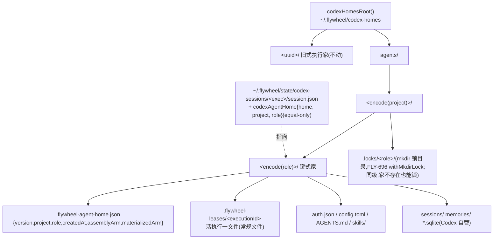

# FLY-2358 任务级 Codex home 改键 (agent, 项目) — 实施计划
Issue: FLY-2358 (https://linear.app/geoforge3d/issue/FLY-2358/2355b1-ic-层地基任务级-codex-home-改键-executionid-agent)
日期: 2026-09-05
基于: research.md

> **执行合同:** 在 implement DAG 节点内按任务顺序执行;每个行为改动 RED → GREEN → REFACTOR;节点边界禁止派发 successor、merge、deploy。**改键与删家保护同一个 PR 上线**(PRD §5.5.3 / §5.3.3 硬条,不允许拆成两次)。**不加任何新开关 / env 旋钮**:键式家只由「身份能否解析」决定;解析不出就走今天的执行级家。旧式执行家(UUID 名)的一切既有行为**逐字节不变**(provision / scrub / 启动清扫 / reaper / 删除)。⛔ 不清理旧家、不动 `~/.codex` 与 `~/.codex-*`、不改节流闸、不改 `cli_auth_credentials_store`。**不移动 Blueprint 的 agent dispatch 位置**(R1 #5:改可观察顺序的风险大于收益)。**不新造锁原语**:每家的互斥复用仓内 FLY-696 的 `withMkdirLock`(R2 #3)。**兼容面精确到**:`provisionCodexHome`、`scrubCodexHomeCredential`、`scrubOrphanedCodexHomes` 三个函数的参数、同步语义、行为与既有测试逐字节不变;`removeCodexHome` 的返回值从 `void` 变为结果对象(唯一调用方 `removeCodexSessionState` 是测试用途,随之透传);键式家一律走新增的异步入口。**reown 永不迁移部署前起跑的执行**(R3 #2)。

## 0. 裁定与评审落点

### 0.1 并发裁定(设计段必答)
**选 (a) 共享持久家。** 证据与代价见 exploration.md §4-5;一句话:Codex 自己的记忆流水线只在「同一家的下一次启动」抽取上一轮会话,(a) 让这件事零机制发生,(b) 要新造回流并动节流闸。Codex 侧并发由三处独立证据支撑(旧:09-02 合成锁 + 真会话两臂;本轮:E1 真二进制双 app-server 同家、E2 锁复现、E3 软链锁);我们这一侧的执行级状态冲突用「每家一把 mkdir 锁 + 原子准入(返回句柄)+ 租约计数 + 每执行一份的持久反查」收口(research §4)。⇒ [2355·B2] 缩成「种回去 + 验收」。

### 0.2 Lead 要求落点
| Lead 要求 | 落在哪 |
|---|---|
| 99a2e4f7:引用 09-02 真凭据臂旧证据,不重跑;裁定写清新旧证据来源;偏最小形状 | exploration §4 表「来源」列;本 plan 无新开关、无新运维 API |
| d7ba5d3c:技能臂为家级属性;**实际生效臂必须写进 A/B 读的同一字段并带可过滤标记** | T5(准入在 `emitStarted` 之前决定臂 ⇒ `sessions.skill_framework_mode` = 实际装进家的臂,`skill_framework_mode_via = "inherited"`) |

### 0.3 Codex R1 处置(10 条:4 HIGH / 5 MEDIUM / 1 LOW,全部纳入)
| # | 处置 | 落点 |
|---|---|---|
| H1 租约≠互斥 | 每家一把短锁 L0 + 临时文件原子写 + 失败释放租约;并发测试用子进程栅栏 | research L0/L1b;T2、T3 |
| H2 started 行的臂可能为假 | 准入(L1)搬到 `emitStarted` 之前且是唯一决定;provision 只消费;准入后失败释放租约 | research A1/A3;T5、T2 |
| H3 四值模式 vs 三值装配臂 | 家级属性 = `assemblyArm: SkillAssemblyBaseArm`;有效四值模式按确定性规则推出;加 `bare` vs `bare-ponytail` 用例 | research §5;T5 |
| H4 启动清扫活集合漏 `design_done`/`approved_to_ship` | 键式租约活集合单独一个参数,由 reown 候选状态集算出;旧式参数不变 | research L4;T4 |
| M5 准入点没有 agentName | 身份只取 `workflow node id`;无节点 ⇒ 旧式家 + 带原因日志;不动 dispatch 位置 | research A2;T1、T5、T7 |
| M6 编码器依赖环 | `encode/decodeMemoryPathComponent` 搬到 `flywheel-config`,edge-worker 再导出 | T1 |
| M7 scrub 后无法识别键式家 | 反查改用 session.json 的持久 `codexHome` 字段;结构兜底拒删;砍掉 `removeCodexAgentHome({force})` | research L2/D1;T3、T6 |
| M8 反查要有 unknown/ambiguous | L2 三态(keyed / legacy / unknown),破坏性消费者 `unknown` 即 fail-closed;租约文件只认常规非 symlink 合法名 | research L2/L5;T3、T4 |
| M9 回滚不安全 | 回滚改为条件式:先排空键式执行再 revert | §4 |
| L10 QA 断言假结论 | 受控并发一幕比对 started 行/marker/文件;A10 检查点写明;给出精确排除命令 | §5 |

### 0.4 Codex R2 处置(7 条:3 HIGH / 3 MEDIUM / 1 LOW,全部纳入)
| # | 处置 | 落点 |
|---|---|---|
| H1 继承臂缺装配产物 | 探针段抽成 `probeCodexAssembly(arm)`;继承后为生效臂重探并替换 disableNames / matt 源;探针失败 ⇒ 释放句柄、派发失败、不回落;默认请求写成 `skillAssemblyBaseArm(skillFramework?.mode ?? "superpowers")` | research A1;T5、A7 |
| H2 租约释放无定位者 / 所有权交接未定义 | 准入返回句柄 `{home, executionId, token}`,`releaseCodexAgentHomeLease(handle)` 只认句柄;交接点 = 调用 adapter 那一刻;adapter 进入即发布 `codexHome`(set-once)并整段 try/finally 归 `retireCodexExecutionHome` | research L1/L1a/L2/L3;T2、T3、T5、T7 |
| H3 裸锁文件不 crash-safe | 复用 `withMkdirLock`(持有者标记 + 进程启动时间 + 精确 inode 释放);`mkdir-lock.ts`+`pidfile.ts` 原样搬到 flywheel-config,teamlead 原路径再导出;等待异步;启动清扫按家隔离失败 | research L0;T1、T2、T4 |
| M4 skills 树替换对运行中进程不原子 | marker 记 `assemblyArm`(决定)与 `materializedArm`(已物化);只有两者不等才物化,相等零变动;臂只在活租约为 0 时改变 | research L1/L1b;T2 |
| M5 并发测试断言不证明单一决定 | 收集每个子进程的准入结果断言同一生效臂与 inherited;新增临界区占用度测试(enter/exit 记录,最大占用=1,去锁变异必红);臂从三值域轮取 | T2、A4 |
| M6 反查需 set-once / 精确路径 / 先分类再删 | `codexHome` equal-only;L2 只认精确 `codexAgentHomeDir(project, role)` 且 marker 身份互相匹配、不跟随 symlink;`removeCodexSessionState` 先分类再删状态目录 | research L2/D1;T3、T6 |
| L7 文档矛盾 / 不可执行判据 | K1 改节点 id 唯一来源;反查改「三态」;回滚判据 3 给出 `ps eww` 命令;T9 给唯一 vitest 命令(3.1.4 支持 `--exclude`) | research K1/L2;§4、T9 |

### 0.6 Codex R4 残余(6 条:3 HIGH / 2 MEDIUM / 1 LOW)—— 按 Lead 指令 [lead-instruction 2358-scope-cap-20260905T0921] 不开 R5,全部作为实现约束写入,交 Lead 裁 leadAcceptance
| # | 处置(不新增机制、不加子系统) | 落点 |
|---|---|---|
| H1 被拒的重复所有权不得删活主的租约 | 准入结果带 `createdLease`;`retireOnce` 只归还本次调用新建的租约;A4 改为两主用例:被拒者保留租约与 token,只有被接受者完成才删除 | research L1a;T3、A4 |
| H2 准入后、记录发布前崩溃的租约会被活集合永久保留 | L2 新增 `prepublished` 态:无记录但精确租约存在 ⇒ reown 在锁内核对后**收养**(幂等准入 + 立即发布记录),不塌成 legacy;「无记录且无精确租约」才是部署前 legacy;kill 测试覆盖两个崩溃点 | research L2/§7;T3、T7 |
| H3 期望身份未贯穿 retire 与清扫 | `retireCodexExecutionHome(exec, expected, env)` 必填;清扫函数输入改为 StateStore 快照映射(状态 + 可信身份),无行 ⇒ 孤儿删,活行身份不符 ⇒ fail-closed 告警,终态行核身份后删 | research L3/L4;T3、T4 |
| M4 reown 缺省臂无效 | 请求臂 = `skillAssemblyBaseArm(snapshot.launchContext.skillFrameworkMode ?? "superpowers")`;加快照为 null 的用例 | research §7;T7 |
| M5 retireOnce 无失败态 | 状态机 `idle/pending/succeeded/failed`,并发共享 pending,磁盘成功才 succeeded;失败记 teardownError、禁止成功 ack、外层最多重试一次,再失败交 L4 并告警;测锁超时与受管写失败 | research L1a;T3 |
| L6 两处措辞 | T4 GREEN 改为新函数;T7 GREEN 列 `plugin.ts`;L3 签名带 expected;记录统一叫 `codexAgentHome` | T4、T7、research |

### 0.5 Codex R3 处置(7 条:3 HIGH / 3 MEDIUM / 1 LOW,全部纳入)
| # | 处置 | 落点 |
|---|---|---|
| H1 公共入口的租约所有权未闭合 | `retireOnce` 闭包在 `execute` / `resumeExistingExecution` 入口创建:记录发布前按句柄释放、之后按记录+期望身份退休;所有权拒绝、快照读取失败、记录发布失败等每条返回路径恰好一次;测试断言磁盘状态 | research L1a;T3、A4 |
| H2 reown 无条件准入会迁移旧家执行 / 与不可变快照漂移 | 先分类再准入:legacy 永不迁移;keyed 只回记录里那个家且生效臂必须等于快照臂,否则恢复 fail-closed;调用点在 `plugin.ts` 的 `runtime.resume` 之前 | research §7 恢复行;T7 |
| H3 自洽的错家无法被拒绝 | 记录改为 `{home, project, role}` equal-only;破坏性消费者必须传来自 session 行的期望身份;四类漂移用例 | research L2/D1;T3、T6 |
| M4 锁父目录不存在 | 锁移到同级 `<root>/agents/<project>/.locks/<role>/`,准入前 `mkdir -p` 引导并逐段 lstat 校验;敌意文件/symlink 拒绝 | research L0;T2 |
| M5 清扫函数签名冲突 | 旧 `scrubOrphanedCodexHomes(live, env?)` 不动;新增 `scrubOrphanedCodexAgentHomes(keyedLive, env?)`;启动时各调一次 | research L4;T4 |
| M6 退休顺序与恰好一次 | `retireOnce` 幂等闭包在两个既有 scrub 点直接调用(保住 FLY-1269 先退凭据再 ack),外层 finally 兜底;扩展 FLY-1269 测试 | research L1a;T3 |
| L7 导出与措辞 | T1 补 `packages/config/src/index.ts` 导出;core 的 `adapter-types.ts` 用内联联合类型 `"superpowers" \| "matt" \| "bare"`(不给 core 加依赖);R1 表「四态」改三态;兼容面精确列出 | T1、§0.3、执行合同 |

## 1. 目标与验收标准

**Goal:** Codex runner 的 `CODEX_HOME` 按 `(project, role)` 解析到 `<root>/agents/<project>/<role>`,第一次准入才建,同对同家、异对异家;键式家不随任务删除且删家函数有可见保护;同家并发由「mkdir 锁 + 原子准入 + 租约计数 + 持久反查」管住令牌擦除、启动清扫、reaper 身份与装配臂;旧式家零行为变化。

- **A1 同对同家**:同一 `(implement, flywheel)` 两次准入(不同 executionId)返回同一路径;四组对照:`(implement, flywheel)` vs `(qa, flywheel)`、vs `(implement, joycon-typeless)`、vs `(design, flywheel)`、vs 大小写不同的 role(`Implement`)—— 全部不同路径,且都在 `codexHomesRoot()/agents/` 下(`FLYWHEEL_CODEX_HOMES_ROOT` 覆盖时随之移动)。
- **A2 懒建**:根目录下没有任何预建的 `agents/**`;**第一次被准入的键式运行**才 mkdir;`.flywheel-agent-home.json` 记 `{version:1, project, role, createdAt, assemblyArm, materializedArm}`;文件内容走临时文件 + rename;建家沿用现有「技能目录递归拷入 + 写 AGENTS.md」路径(同一函数)。
- **A3 删家保护**:对键式家的 executionId 调 `removeCodexHome(exec, env, expected)` ⇒ `{removed:false, reason:"agent_home_protected"}`、目录仍在、`console.error` 一行含 `refuse_remove_agent_home`;**真实顺序**:provision → 终态 retire(租约已删)→ `removeCodexSessionState` ⇒ 家仍在(它先分类再删状态目录);记录只有 `home` 漂移、只有身份漂移、或整条记录自洽但指向别的合法键式家(期望身份不符)⇒ `unresolved` 不删;不传 `expected` 而记录存在 ⇒ 拒删;对旧式家 ⇒ 仍删除;`rmSync` 抛错 ⇒ `console.warn` 含 `remove_home_failed`;session.json 畸形 ⇒ 不删 + `remove_home_unresolved`。
- **A4 租约计数 + 互斥**:两个执行共享一家,A 终态 scrub 后 config.toml 仍含 GH_TOKEN 且日志含 `keyed_home_scrub_deferred live_leases=1`;B scrub 后 GH_TOKEN 消失、租约目录为空。**并发准入**:子进程栅栏让 8 个执行同时首次准入同一家(请求臂从 `superpowers/matt/bare` 轮取)⇒ **每个子进程返回的** `effectiveAssemblyArm` 全部相同、`inherited` 恰与「请求 ≠ 生效」一致、租约恰好 8 个、marker 恰好一份且 `materializedArm === assemblyArm`、config.toml 可解析、trust 块含全部 8 条路径、skills 物化恰发生 1 次;**临界区占用度**:锁内记录 enter/exit,最大占用 = 1;provision-vs-retire 同时 ⇒ 令牌只在租约归零时消失;第二个同臂活准入的 provision ⇒ skills 零变动;**根目录不存在**时 8 进程同时首次准入同样成立(锁父目录由准入引导);家路径或 `<project>` 路径上预置文件/symlink ⇒ 准入拒绝。**所有权**:adapter 公共入口的五条返回路径(快照读取失败、记录发布失败、preflight 失败、provision 失败、正常终态)之后,磁盘上该执行的租约都不在,且令牌只在其它租约为 0 时剥离;正常终态时租约释放先于 FLY-1269 的 ack;**两主用例**:第一个 owner 活着时第二次调用被进程内所有权拒绝 ⇒ 租约与 token 原样保留,只有第一个 owner 完成才删除;`retireOnce` 遇锁超时 / 受管写失败 ⇒ 结果带 teardownError、不发成功 ack、租约状态如实(仍在),日志 `keyed_home_retire_failed`。
- **A5 启动清扫**:`scrubOrphanedCodexAgentHomes(sessionsSnapshot)`:无 session 行的租约被删、归零才剥;行状态在 `design_done` / `approved_to_ship` 等 reown 候选集 ⇒ 租约与令牌保留;活行身份与家不符 ⇒ 不动 + 告警;终态行核身份后删;一家抛错不影响其余家;`scrubOrphanedCodexHomes` 的函数、签名、MED #3 用例不改一字。
- **A6 reaper / 探针**:`defaultListCodexHomeExecutionIds` 返回旧式目录名 ∪ 键式家常规租约名(不含 `agents`、不含 symlink、不含非法名);`agents/` 不可读 ⇒ 探针 `unknown`;`probeCodexRolloutMtime` 对键式家执行能 `found`;ledger 指向键式家的执行不再 `identityMismatchSkipped`。
- **A7 家级装配臂 + A/B 字段**:家里有其它活租约且请求 base 臂不同 ⇒ started 信封 `skillFrameworkMode` = 家的臂、`skillFrameworkModeVia = "inherited"`,ctx `codexAgentHome.assemblyArm` = 家的臂,且 ctx 的 `codexSkillDisableNames` / `codexMattSkillsSourceDir` 是**为家的臂重探**得到的(矩阵:default→matt、bare→matt、matt→bare、default→bare,四组同时断言 adapter 入参、marker、config、skills、信封);生效臂探针失败 ⇒ 句柄被释放、派发失败、不发 started;请求 `bare-ponytail` 而家是 `bare` ⇒ 信封逐字节不变(不算继承);无其它活租约 ⇒ marker 更新为请求臂、信封逐字节不变;claude-tmux ⇒ 准入函数零调用。
- **A8 身份回落**:无 `workflow node id` ⇒ 不准入、走 `codexHomeDir(executionId)`,Blueprint/reown 打 `identity_unresolved reason=no_role`;既有 `provisionCodexHome` 测试不改一字全绿。
- **A9 trust 累加**:同家先后 provision 两个 worktree ⇒ 受管 trust 块含两条;其中一条路径被删除后再 provision ⇒ 该条被剪;FLY-1961 旧式用例零改动。
- **A10 真机/529 房**:Codex runner spawn → Bridge 重启 reown → daemon 换体,三条路径各至少一次通过,三次都落在同一个键式家;部署前起跑的旧式执行经 Bridge 重启 reown 后仍在 `<root>/<executionId>`(不迁移);在「started 行已落、adapter 未入口」与「adapter 已入口、记录未 rename」两个点 kill Bridge 再起 ⇒ 清扫不删该租约、reown 收养并发布记录、无钉死的孤儿租约;**检查点**:执行存活时 `find <root>/agents -type f -path '*/.flywheel-leases/<exec>'` 恰 1 个;终态 retire 后为 0 个且 session.json 仍含 `codexHome`。
- **A11 零回归**:`pnpm -r test`、`pnpm typecheck`、`biome check` 绿(排除命令见 §5);`packages/claude-runner/test/codex-home.test.ts` 既有用例零改动(新增用例另起 describe)。

## 2. 设计

### 2.1 核心流程

```mermaid
sequenceDiagram
    participant BP as Blueprint(派发)
    participant HM as codex-home.ts
    participant FS as codex-homes/agents/
    participant SS as StateStore.sessions
    participant AD as CodexTmuxAdapter
    BP->>BP: 身份 = (projectName, workflow node id)
    BP->>HM: admitCodexAgentHome(project, role, exec, requestedAssemblyArm)
    HM->>FS: mkdir -p agents/<project>/.locks 引导;withMkdirLock(.locks/<role>/)
    HM->>FS: 家不存在 ⇒ mkdir + marker;活租约>0 ⇒ 臂=marker;否则 marker.臂=请求
    HM->>FS: 写租约 .flywheel-leases/<exec>;放锁
    HM-->>BP: {handle, effectiveAssemblyArm, inherited}
    Note over BP: inherited ⇒ 为家臂重探装配产物, via="inherited";失败 ⇒ release(handle)
    BP->>SS: emitStarted(skill_framework_mode 已是实际臂)
    BP->>AD: ctx.codexAgentHome{project, role, assemblyArm, home, token}(所有权交接:入口建 retireOnce)
    AD->>FS: session.json += codexAgentHome{home, project, role}(set-once)
    AD->>HM: provisionCodexAgentHome(handle)
    HM->>FS: 锁内:trust 合并、config 原子写;skills 仅在 materializedArm≠assemblyArm 时物化
    AD->>AD: 跑任务(同家可有多个 app-server)
    AD->>HM: retireOnce(既有两个 scrub 点 + 外层 finally 兜底)
    HM->>FS: 锁内:删自己租约 → 计数 → 0 才剥 GH_TOKEN
```

### 2.2 目录与数据结构



### 2.3 消费者改动矩阵

| 消费者 | 文件 | 改动 |
|---|---|---|
| 编码器 | `packages/config/src/runner-memory-path.ts`(新)、`packages/config/src/index.ts`(导出)、`packages/edge-worker/src/runner-memory.ts` | `encode/decodeMemoryPathComponent` 搬到 flywheel-config(claude-runner 已依赖它),edge-worker 原名再导出,既有测试零改动 |
| 锁 | `packages/config/src/mkdir-lock.ts`、`packages/config/src/pidfile.ts`(新,原样搬入)、`packages/config/src/index.ts`(导出)、`packages/teamlead/src/account-heal/mkdir-lock.ts` / `pidfile.ts`(改为再导出) | teamlead 8 个消费者与其测试零改动 |
| ctx 字段 | `packages/core/src/adapter-types.ts` | 新增 `codexAgentHome?: { project: string; role: string; assemblyArm: "superpowers" \| "matt" \| "bare"; home: string; token: string }`(内联联合,不给 core 加 flywheel-config 依赖) |
| 家 | `packages/claude-runner/src/codex-home.ts`(键式部分可拆到 `codex-agent-home.ts`) | 新增 `codexAgentHomeDir`、`admitCodexAgentHome`(async,返回句柄)、`releaseCodexAgentHomeLease(handle)`、`provisionCodexAgentHome(handle, opts)`(async)、`retireCodexExecutionHome`(async)、`resolveExecutionCodexHome`(三态);新增 `scrubOrphanedCodexAgentHomes`(async,L4);改 `removeCodexHome`(D1,加 `expected`);`provisionCodexHome` / `scrubCodexHomeCredential` / `scrubOrphanedCodexHomes` 不动,内部 helper 共享 |
| 导出 | `packages/claude-runner/src/index.ts` | 导出新函数 |
| 首次派发 | `packages/edge-worker/src/Blueprint.ts` | 探针段抽成 `probeCodexAssembly(arm)`;951 后:codex-tmux 且有 node id ⇒ 准入 → 继承时为生效臂重探并替换 `skillFramework`;准入后到 `adapter.execute` 之前的任何失败释放句柄;2835 ctx 装配加 `codexAgentHome`;身份回落打日志 |
| reown | `packages/teamlead/src/bridge/plugin.ts:7488-7594`、`codex-session-reown.ts` | 在 `runtime.resume` 之前:L2 分类(expected 来自 session 行)→ legacy 不准入 / keyed 重新准入到记录里的家并核对快照臂 / unknown 拒绝;ctx 加 `codexAgentHome`;准入后到 `runtime.resume` 之前失败 ⇒ 释放句柄 |
| adapter | `packages/claude-runner/src/CodexTmuxAdapter.ts:707-827,1671,1766,2483` | 公共入口 `execute` / `resumeExistingExecution` 创建 `retireOnce`(句柄 → 记录两阶段);`executeOwned` 键式分支先 `mergeSessionState({codexAgentHome})`(equal-only)再 `provisionCodexAgentHome`;两个既有 scrub 点调用 `retireOnce`,外层 finally 兜底;`scrubCredential` 接缝放宽为可 await;`removeCodexSessionState` 先分类再删 |
| 探针 | `packages/claude-runner/src/codex-rollout-probe.ts:40` | `resolveExecutionCodexHome`,`unknown` ⇒ 探针 `unknown` |
| 启动清扫调用 | `packages/teamlead/src/bridge/run-infra.ts:1204` | 旧调用不动;紧随其后 `await scrubOrphanedCodexAgentHomes(keyedLeaseLiveExecutionIds(store))`(reown 候选状态集),分别记数 |
| reaper | `packages/teamlead/src/bridge/codex-runner-orphan-reaper.ts:238-256,748,790` | 身份集合含合法租约名;候选 `codexHome` 经 L2(expected 来自 session 行,`activeExecutionIds` 的来源同一个 store),`unknown` 跳过并审计 |
| via 注释 | `packages/config/src/skill-framework-mode.ts:56` | 注释改为「FLY-2358 键式 Codex 家臂继承时发出」(值不变) |

### 2.4 决定不做(含承接)
- 不做运行中孤儿租约判活(L6,交 Bridge 启动清扫)。
- 不做 keyring 凭据存储、不做 truncate 窗口消除(exploration §4.1,交后续单)。
- 不接 Lead 启动器(PRD §5.5.2 说 Lead 家改配置即可)。
- 不给非 DAG(无 node id)的 Codex 运行建键式家(A2 身份来源;历史 4 行 `main`);要覆盖它们需要先把 dispatch 提前,另开单。
- 不写「种回去」(旧家 `memories/` 迁入键式家)—— [2355·B2]。
- 不新增任何删键式家的 API。

## 3. 任务(TDD 顺序)

### T1 编码器与锁搬家 + 路径与身份
- 文件:`packages/config/src/runner-memory-path.ts`、`packages/config/src/mkdir-lock.ts`、`packages/config/src/pidfile.ts`(原样搬入)、`packages/config/src/index.ts`(导出三者)、teamlead `account-heal/mkdir-lock.ts` / `pidfile.ts`(再导出)、`runner-memory.ts`(再导出)、`codex-home.ts`、claude-runner `index.ts`;`packages/core/src/adapter-types.ts` 的臂类型用内联联合。
- RED(`packages/config` 新测试 + `codex-home.test.ts` 新 describe "FLY-2358 agent home path"):A1 四组对照;`encode` 大小写单射;`project`/`role` 不过 `SAFE_IDENTIFIER_RE` 或超长 ⇒ throw;runner-memory 与 mkdir-lock/pidfile 既有测试零改动全绿(搬家不变行为;teamlead 的 mkdir-lock 测试继续从原路径导入)。
- GREEN:实现;`codexHomeDir` 一字不改。

### T2 准入(句柄)+ 键式 provision + 锁
- RED:A2(懒建;marker 原子写;第二次准入不改 `createdAt`);准入语义:无活租约 ⇒ marker 臂=请求;活租约>0 ⇒ 返回 marker 臂且 `inherited` 正确;同 exec 重复准入幂等且 token 相同;活租约>0 但 marker 缺失/畸形 ⇒ 准入抛错且不写任何文件;`provisionCodexAgentHome` 无租约 / token 不符 / ctx 臂 ≠ marker ⇒ 抛错;`releaseCodexAgentHomeLease(handle)` 归零剥令牌、token 不符拒删;skills:`materializedArm ≠ assemblyArm` 才物化,相等零变动(用 fs spy 断言零 rm/cp),第一次物化失败后第二个准入补完。锁:复用 `withMkdirLock` 的既有测试覆盖算法本身;本任务只测「预置活锁 ⇒ 准入等待并在 10s 超时抛错」、「死 pid 锁被立即回收」两条接线用例,加**引导**用例:根目录不存在时准入自行建出 `agents/<project>/.locks` 并成功;`<project>` 或家路径上预置常规文件 / symlink ⇒ 准入拒绝且不写任何文件。**并发栅栏**(A4):fork 8 个子进程,各自 `admit + provision` 同一家(臂从三值域轮取),fifo 栅栏同时放行;收集每个子进程返回的 `{effectiveAssemblyArm, inherited}` 断言全同一臂、inherited 正确;磁盘:marker 1 份、租约 8、config 可解析、trust 8 条、物化 1 次。**占用度**:锁内 enter/exit 追加到共享日志,断言最大占用 = 1;变异体:把 `withMkdirLock` 换成直接执行 ⇒ 占用度用例**必**红(确定性,不靠调度)。
- GREEN:`admitCodexAgentHome` + `provisionCodexAgentHome` + `releaseCodexAgentHomeLease`。

### T3 反查(L2)+ 退休(L3)+ retireOnce
- RED:`resolveExecutionCodexHome(exec, expected?)` 三态(keyed;legacy;unknown:畸形 JSON、指向根外、指向 symlink、只有 home 漂移、只有身份漂移、整条自洽但指向别的合法键式家且 expected 不符;不传 expected 时自洽记录可作只读解析);记录 set-once:已有任一字段不等 ⇒ `mergeSessionState` 抛错;A4 两执行先后 retire;provision-vs-retire 并发(子进程栅栏)⇒ 令牌只在归零时消失;既有 `scrubCodexHomeCredential removes the live token but keeps the home` 不改;adapter 公共入口六条返回路径(进程内所有权拒绝、快照读取失败、记录发布失败、preflight 失败、provision 失败、正常终态)之后**磁盘上**租约不在、令牌按计数规则;扩展 FLY-1269 用例:键式退休先于 ack,且每条分支恰好一次(闭包计数 + 磁盘状态双证);session.json 现有断言逐字节保留,只多一个键。
- GREEN:实现。

### T4 启动清扫(L4)与 reaper/探针(L5)
- RED:A5(新函数 `scrubOrphanedCodexAgentHomes`:含 `design_done` / `approved_to_ship` 保留;`keyedLeaseLiveExecutionIds` 对每个 reown 候选状态 + 一个终态对照;一家抛错其余照常;旧函数与 MED #3 用例零改动);A6(集合内容:symlink 租约、非法名、`agents` 目录名都不进;`agents/` 不可读 ⇒ `unknown`;reaper 既有 harness 不改,新增用例:ledger 指向键式家 ⇒ 不再 `identityMismatchSkipped`;`unknown` 候选被跳过并审计);`probeCodexRolloutMtime` 键式 `found`、`unknown` 返回 `unknown`。
- GREEN:`scrubOrphanedCodexAgentHomes(sessionsSnapshot, env?)`(旧函数不动)、`defaultListCodexHomeExecutionIds`、reaper `:748,:790`、探针。

### T5 Blueprint 准入 + 生效臂重探(A1/A2/A3)
- RED(`Blueprint.fly2358-agent-home.test.ts` 新文件,照 `Blueprint.fly1356-skill-framework.test.ts` harness,准入函数与探针经构造参数注入):A7 矩阵(default→matt、bare→matt、matt→bare、default→bare:信封 mode/via、ctx `codexSkillDisableNames`/`codexMattSkillsSourceDir` 来自生效臂的探针、ctx `codexAgentHome` 五字段;生效臂探针失败 ⇒ 释放句柄一次、不发 started、run 失败;`bare-ponytail` 遇 `bare` 不继承、信封逐字节等于基线;无活租约信封逐字节等于基线;claude-tmux 零调用);A8 无 node id ⇒ 零调用 + `identity_unresolved reason=no_role` 日志;准入后、`adapter.execute` 前任一步抛错(worktree、prompt)⇒ `releaseCodexAgentHomeLease(handle)` 恰一次。
- GREEN:抽 `probeCodexAssembly(arm)`;Blueprint 951 后插入;失败路径 try/catch 释放。

### T6 删家保护(D1)
- RED:A3 全部情形(真实顺序 provision → retire → `removeCodexSessionState(exec, expected)`:家仍在、状态目录已删;旧式仍按今天顺序删;rmSync 失败 ⇒ warn;记录畸形 / 只有 home 漂移 / 只有身份漂移 / 自洽但 expected 不符 ⇒ `unresolved` 两者都不删;不传 expected 而记录存在 ⇒ 拒删;结构兜底:伪造记录指向 `agents/` 下任意路径 ⇒ 仍拒删)。变异体:去掉结构兜底 + 去掉 L2 分支 ⇒ 键式家被删 ⇒ 必红;把「先分类再删」顺序调回今天 ⇒ 真实顺序用例必红(先自证变异落地)。
- GREEN:实现;`removeCodexSessionState` 透传。

### T7 reown 与 ctx 类型
- RED(`codex-session-reown.test.ts` + `plugin.ts` 恢复段的既有测试文件新用例):**部署前旧式执行**(无记录)⇒ 不准入、ctx 无 `codexAgentHome`、恢复仍指向 `<root>/<exec>`;keyed 且租约在 ⇒ 幂等准入返回 marker 臂、ctx 五字段;keyed 且租约被清 ⇒ 以 `skillAssemblyBaseArm(snapshot.launchContext.skillFrameworkMode ?? "superpowers")` 重新准入(含快照为 `null` 的用例 ⇒ `superpowers`);`prepublished`(无记录、精确租约在)⇒ 锁内核对后收养并发布记录;keyed 但生效臂 ≠ 快照臂 ⇒ 恢复失败 + `keyed_home_reown_arm_mismatch`,租约已释放;`unknown` 记录 ⇒ 恢复拒绝;`workflow_node_id` 空 ⇒ 零调用 + `identity_unresolved`;准入后、`runtime.resume` 前抛错 ⇒ 释放句柄恰一次(磁盘断言);既有 ctx `toEqual` 断言若需加字段,逐条列出改动、不放宽。
- GREEN:`plugin.ts:7488-7594`(分类 + 准入 + 释放)与 `codex-session-reown.ts:190-240`(ctx 字段)。

### T8 trust 累加(A9)
- RED:`renderCodexHomeConfig` 新选项 `trustedProjectPaths: string[]`(旧 `trustedProjectPath` 保留、语义不变,FLY-1961 用例零改动);键式 provision 合并已有受管块路径;不存在的路径被剪;并发 8 路径(T2 栅栏用例复用)。
- GREEN:实现。

### T9 全量与文档
- 全量命令(排除会开真 Terminal 的用例;仓库 vitest 3.1.4 支持 `--exclude <glob>`):`pnpm -r test -- --exclude '**/tmux-viewer.macos.test.ts'`、`pnpm typecheck`、`biome check`。
- `codex-home.ts` 头注释补 FLY-2358 段;`skill-framework-mode.ts:56` 注释。
- 里程碑:`engineering/doc/milestones/FLY-2358.md`(ship 时)。

## 4. 上线与回滚
- 一个 PR;合并后由独立 updater 部署。首个键式家在下一次 DAG 的 Codex 派发时准入建家;旧式家一个不动。
- **回滚是条件式的**(R1 #9):revert 之前必须 (1) 排空键式执行 —— `sqlite3 -readonly ~/.flywheel/teamlead.db "select execution_id from sessions where adapter_type='codex-tmux' and status in ('running','ship_parked','awaiting_review','design_done','approved_to_ship')"` 为空,或这些执行的 session.json 都没有 `codexHome`;(2) `find <root>/agents -type f -path '*/.flywheel-leases/*'` 为 0;(3) `ROOT=${FLYWHEEL_CODEX_HOMES_ROOT:-$HOME/.flywheel/codex-homes}; ps eww -ax | grep -F 'codex app-server' | grep -F "CODEX_HOME=$ROOT/agents/" | grep -v grep | wc -l` 为 0(macOS `ps eww` 在命令后打印进程环境)。三条都成立才 revert;家留在磁盘。不满足就不能 revert(旧代码不认识键式家:探针、reaper、清扫都会漏掉它们)。
- 部署后观察(QA 段,只作补充证据不作判据):`grep -c 'keyed_home_' <bridge-log>`(路径读 launchd plist 的 StandardOutPath,不硬编码);`agents/flywheel/implement/.flywheel-leases/` 常规文件数 = 当时 reown 候选状态的 implement Codex 会话数。

## 5. QA 段判据(implement 段交付命令,QA 段执行)
1. A1-A9:`pnpm --filter flywheel-claude-runner test -- codex-home`、`pnpm --filter flywheel-config test`、`pnpm --filter flywheel-teamlead test -- codex-runner-orphan-reaper codex-session-reown run-infra`、`pnpm --filter flywheel-edge-worker test -- fly2358 runner-memory`,并对 T2(去锁)与 T6(去守卫)变异体各跑一次必红(把变异 diff、`assert old not in file` 的落地证明与红输出一起贴)。
2. A10:529 房 `scripts/test-deploy.sh <slot> --mode slot` 起 Codex 形状 runner(FLY-2301 台架)→ 重启 slot Bridge 触发 reown → 用 `qa-529-generalized-codex-stub.mjs` 的退出栅栏触发换体;每步后按 A10 检查点查租约与 session.json。真机替代:任一 `(implement, flywheel)` Codex 单存活时与结束后各查一次。
3. A7 数据:**受控并发一幕** —— 同一 (role, project) 先起一单(臂 X),它存活期间再起一单(请求臂 Y≠X),对第二单比对 `sessions.skill_framework_mode/_via` 与家里 marker 与 `skills/` 实况(三者一致且 via=inherited);**不**用历史行与当前 marker 比(租约排空后臂可合法改变)。
4. 负控:对一个旧式 UUID 家跑 `removeCodexHome` 仍删除;对键式家(scrub 之后)跑 ⇒ 拒。
5. 全量:§3 T9 的三条命令,贴 exact head 的 CI 结论。

## 6. 已知限制(诚实边界)
- 孤儿租约到下次 Bridge 启动才清;混账号并发下 `auth.json` 来回翻(各进程自洽,只记 `keyed_home_identity_switch`);truncate 空文件窗口与 refresh_token 高频兑换未证。
- 非 DAG 的 Codex 运行暂不进键式家(A2)。
- 锁是 mkdir 锁(FLY-696 同一实现),等待上限 10s;跨机共享根目录不在支持范围(与 `FLYWHEEL_CODEX_HOMES_ROOT` 的单机语义一致)。
- 继承臂时会为生效臂重跑一次装配探针;活 matt 家在 matt 源缺失的机器上会让新派发失败(fail-closed),不回落。
- Codex 侧 FLY-1395 A/B:并发期的行带 `via="inherited"`,分析方按此过滤;这一条由本单落地(T5),不再是「静默污染」。
