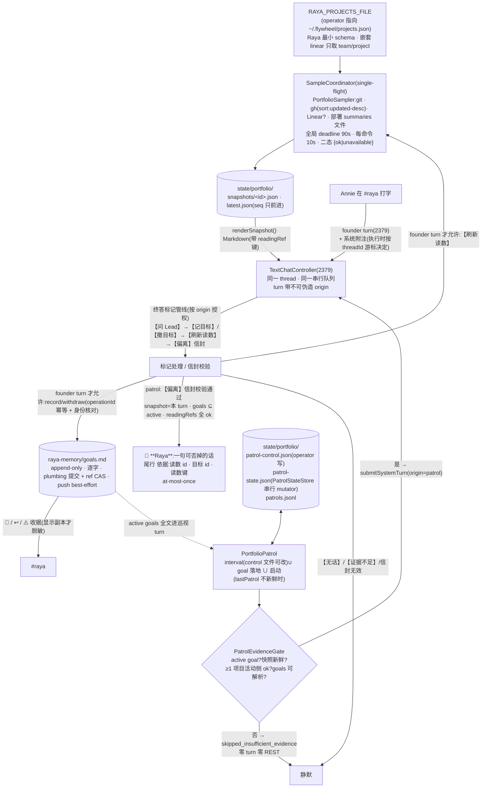

# FLY-2381 Raya 大脑:读各仓 + goal 两阶段 + 偏离探测 — 实施计划
Issue: FLY-2381 (https://linear.app/geoforge3d/issue/FLY-2381/raya大脑-自己去各仓读状态-goal-两阶段-偏离探测prd-1846-51-7-102030-声明过从未交付的那一半)
日期: 2026-09-06
基于: research.md

> 成色:✅ founder/Lead 已拍(issue、PRD、ask 7bfca58d 五条默认全部接受)· 【实核】见 research.md · ⬜ 工程判断 · R1-n / R2-n = Codex design review 第一/二轮第 n 条的处置。
> ⛔ 本 plan 通过 design review 前不写实现码。代码全部在 **raya 仓**(xrliAnnie/raya);分支 `fly-2381-raya-brain-drift`,**基线 = `fly-2379-raya-text-chat` 当时 head**(【实核 2026-09-06】2379 已进 implement,worktree 有未提交的 `apps/brain/src/text-chat/controller.ts`;本单 implement 必须等 2379 接口落定后再起分支,2379 已合入则自 main);PR base = main,**必须在 2379 合入之后 merge**;⛔ 不碰 `~/.flywheel/raya/code`。
> **规范唯一来源 = 本 plan**;research.md 只保留实核事实与命令,凡与本 plan 重叠的接口/状态机以本 plan 为准(R2-8)。R3-n / R4-n / R5-n = 第三/四/五轮处置。

## 0. 目标 · 非目标 · 授权

- **目标**(issue「要做」四条 + 验收两条):① brain 按 `RAYA_PROJECTS_FILE` 逐仓采样(git / GitHub / Linear / 部署 checkout 的 summaries 文件),读不到的明写;② goal 阶段一:她说的目标**逐字**落 raya-memory `goals.md`,有收据、可撤、幂等;③ 偏离探测:读数 × 活跃 goal → 一句她能当场否掉的话,走 2379 的 #raya 通路;沉默项目是信号;证据不足或无偏离 = **机械地**不开口(fail-closed 信封);④ 上线 = 合入 raya main **且**部署到 `~/.flywheel/raya/code` + brain 重启 + 部署确认(9-6 教训)。
- **非目标**(issue 第 4 条 + exploration §7):不做排序表、硬规则、跨项目依赖机制、新 daemon、自动校准、每日 Report、语音控制电脑;不改 summaries 合同、IDENTITY.md 本体、2379 的 thread/ask/**attestation 降级**/REST 语义;不做「summary 未读/已读」状态(2131 的 merge-receipt 合同,本单只观测部署 checkout 里的文件,R1-8);**巡视(patrol)回合不主动追问 Lead**(R3-1,决定:2379 的 ask 生命周期要求 founder 消息 id 作 source,patrol 没有;不另造 patrol-ask 状态机 —— PRD §5.3「读完追问」在阶段一只在**她发起的对话**里成立(2379),主动巡视看不清时回 `【证据不足】` 静默,这是本单明写的未满足面,已报 Lead ask 5578107a)。
- **授权**:merge founder-gated;部署与 brain 重启归 Lead;env 由 operator 填(§7)。
- ✅ Lead 裁定(7bfca58d):注册表经 `RAYA_PROJECTS_FILE` + Raya 自己的最小 schema;分支挂 2379 之上;goal = 标记行 + goals.md + 📌 收据、校准不自动;巡视无偏离默认静默;Linear 可选、缺 = 明写读不到;采样由 brain 确定性代码做;6 h 计时器在 brain 进程内、间隔落 state 文件运行期可改。
- R1-1 处置:删掉 `heartbeatLine`(HL 附带项,founder 未表态;阶段一不做任何「到点必发」的输出)。

## 1. 架构



稳定身份(全文只用这些名字):采样协调器 `SampleCoordinator` · 采样器 `PortfolioSampler` · 巡视 `PortfolioPatrol` · 证据门 `PatrolEvidenceGate` · 信封校验 `validateDriftEnvelope` · 状态存储 `PatrolStateStore` · goal 存储 `GoalStore` · 状态目录 `<RAYA_STATE_DIR>/portfolio/` · 文件 `snapshots/<id>.json` / `latest.json` / `patrol-control.json` / `patrol-state.json` / `patrols.jsonl` · memory 仓文件 `goals.md` · env `RAYA_PROJECTS_FILE` / `RAYA_GH_BIN` / `RAYA_GIT_BIN` / `RAYA_LINEAR_API_KEY` / `RAYA_PORTFOLIO_OPTIONS_JSON` · turn 来源 `origin ∈ founder | lead_answer | ask_timeout | patrol | refresh` · 标记行 `【记目标】<原话>` / `【撤目标】<goalId>` / `【刷新读数】` · 巡视信封 `【无话】` / `【证据不足】` / `【偏离】`+`依据:` 行 · Discord 前缀 `🔔 **Raya**:` / `📌` / `↩️` / `📊` / `⚠️`。

## 2. 工作分解(每块 RED → GREEN → REFACTOR;raya 仓门 `pnpm lint && pnpm typecheck && pnpm build && pnpm test`)

### 2.1 contracts:注册表 + goal 文件 + 标记/信封解析(TDD,纯函数)

- `packages/contracts/src/projects-registry.ts`(R1-6):`parseProjectsRegistry(json: unknown): RegisteredProject[]`。schema(R3-6):`projectName` 非空、`^[A-Za-z0-9_-]{1,64}$`(**不含点**:既是单一路径段,也让 readingRef `<projectName>.<path>` 在第一个点处唯一切分;`.`/`..` 天然被拒)、唯一;`projectRoot` 绝对路径;`projectRepo?` 两段各合 `^[A-Za-z0-9][A-Za-z0-9._-]{0,99}$`(不以 `-`/`.` 开头,不能被当成 gh 选项);`linear?`:`null`/缺 ⇒ null;对象 ⇒ **投影**只取 `team`、`project`(非空 string),**其余键(含现有 `label`)忽略**;顶层多余键忽略。非数组 / 空数组 / 重名 / 类型不符 ⇒ fail-loud(错误信息只含键名与 projectName)。`loadProjectsRegistry(path)` = 读 + parse。**contract test 用一份去敏的真实 `~/.flywheel/projects.json` fixture**(六项目、flywheel 带 `label`)必须加载成功,`count=6`。
- `packages/contracts/src/goals.ts`(R1-3/R1-4/R2-3):`Goal {id, operationId, recordedAt, sourceUrl, status, text, withdrawnAt?, withdrawnSourceUrl?, withdrawOperationId?}`;`parseGoalsFile(text): Goal[]`(格式 §3;任一段缺必填字段 / id 或 operationId 重复 / 状态非法 ⇒ throw `GoalsFileCorrupt`);`renderGoalsFile(goals)` 确定性(round-trip 测试);`nextGoalId(goals, date)` = `g-YYYYMMDD-NN`;`findByOperationId(goals, opId)`;`operationMatches(goal, {kind, text|goalId, sourceUrl})`。
- `packages/contracts/src/portfolio-marks.ts`(R1-3):`parseGoalLines(text): {records: {text, ordinal, line}[], withdrawals: {goalId, ordinal, line}[], invalid: {line, reason}[], rest}`。协议识别用 NFKC+trim 后的**副本**匹配 `^【记目标】\s*(.+)$` / `^【撤目标】\s*(g-\d{8}-\d{2})$`;**payload 从原始行按 code point 索引切出,不做任何规范化**(首尾空白保留;1–500 code points);`ordinal` = 该 turn 内同类标记序号;near-miss 与 2379 `parseLeadAskLines` 同款(candidate 以 `【记目标`/`【撤目标`/`[记目标`/`[撤目标` 开头,不合语法 ⇒ `invalid`,reason ∈ `empty_text|too_long|bad_goal_id|malformed`)。`parseRefreshLines(text): {requested, rest}`(`^【刷新读数】$`,多次算一次)。`looksSecretLike(text)`:复用 2379 `sanitizeDiscordText` 的 redact 正则集。
- `packages/contracts/src/drift-envelope.ts`(R2-1,**正向 fail-closed**):巡视终答(标记管线后的 `rest`)只接受三种精确形态:
  1. 整体 NFKC+trim `=== "【无话】"` ⇒ `{kind:"silent_no_divergence"}`;
  2. `=== "【证据不足】"` ⇒ `{kind:"silent_insufficient"}`;
  3. 第一行 `=== "【偏离】"`,第二行 `^依据:\s*snapshot=(\S+)\s+goals=(\S+)\s+readings=(\S+)$`(`goals`/`readings` 逗号分隔,`readings` 元素形如 `<projectName>.<path>`,path ∈ 固定白名单:`checkoutHead.lastCommit`、`checkoutHead.lastNonChoreCommit`、`checkoutHead.branch`、`canonical.lastCommit`、`prActivity.updatedAt`、`openPrs.returnedCount`、`openPrs.newestUpdatedAt`、`activity.daysSinceLatestObservedActivity`、`linear.activeIssues`;projectName 在第一个点前,按注册表精确匹配),**goals 1–5 个、readings 1–8 个、均不得重复**(R3-5),第三行起为正文(1–1500 code points)⇒ `{kind:"drift", snapshotId, goalIds, readingRefs, body}`;
  4. 其它一切(空、多余行、解释版「证据不足」、缺 `依据:`、未知 path)⇒ `{kind:"invalid", reason}`。
  `validateDriftEnvelope(env, {snapshot, activeGoalIds})`:`snapshotId === snapshot.snapshotId`、`goalIds` ⊆ active、每个 `readingRef` 在快照里解析到 `ok:true` 的字段 ⇒ 再组装最终消息(`🔔 **Raya**:` + `sanitizeDiscordText(body)` + 尾行)并断言 **≤ 1900 code points**(R3-5;`sendPlain` 单条不分片,超限 ⇒ `invalid: too_long`,零 REST)⇒ `valid {content}`;否则 `invalid {reason ∈ snapshot_mismatch|goal_not_active|reading_missing|reading_unavailable|too_many|duplicate|too_long}`。尾行只列校验通过的 id/键。
- **负测**:全角/半角括号;原话首尾空格、NFKC 会改变的字符存储后与输入 payload **code point 逐一相等**;原话内换行不吞下一行;501 code points;`【撤目标】` 非法 id;secret-like ⇒ true;注册表多余键/`linear.label` 被丢、缺 team ⇒ fail、重名、空数组、`projectName` 含空格 / 含点 / `.` / `..`、repo 段以 `-` 开头 ⇒ fail;summaries 目录 `join(cwd,'summaries',projectName)` 后 containment 断言;信封:`【无话】` 后多一句 ⇒ `invalid`;「证据不足,因为…」散文 ⇒ `invalid`;`【偏离】` 缺 `依据:` ⇒ `invalid`;snapshot 是上一份 ⇒ `snapshot_mismatch`;goal 已撤 ⇒ `goal_not_active`;reading 指向 `unavailable` 字段 ⇒ `reading_unavailable`;reading path 不在白名单 ⇒ `invalid`;伪造日期出现在正文但 readings 合法 ⇒ `valid`(正文自由,依据受控——这是边界,写进 README);6 个 goals / 9 个 refs / 重复 ref ⇒ `invalid`;64 字 projectName × 8 refs + 1500 字正文 ⇒ `too_long`;`prActivity.newestUpdatedAt`(不存在的 path)⇒ `invalid`。

### 2.2 config:五个 env(TDD)

- `RayaConfig` 增:`projectsFile`(必填,`canonicalFile`,加入 `sensitive` 列表标签 `projects registry`)· `ghBin`(默认 `/opt/homebrew/bin/gh`,`absolutePath`;存在性采样时查)· `gitBin`(`RAYA_GIT_BIN`,`absolutePath`,默认 `/usr/bin/git`;R3-7)· `linearApiKey: string | null`(可选;**不进 Codex 子进程 env、不进快照/事件/日志**)· `portfolio: {patrolIntervalMs, startupDelayMs, minProactiveGapMs | null, sampleDeadlineMs, commandTimeoutMs, sampleConcurrency, injectStaleAfterMs}`(`RAYA_PORTFOLIO_OPTIONS_JSON`,默认 21600000 / 300000 / null(跟随生效 interval)/ 90000 / 10000 / 2 / 3600000;上下界 10min–7d / 0–1h / 0–7d 或 null / 30s–10min / 3s–60s / 1–3 / 5min–24h;未知键、非对象、越界 fail-loud;`commandTimeoutMs ≤ sampleDeadlineMs`)。
- `config.test.ts`:缺 `RAYA_PROJECTS_FILE` ⇒ fail;workspace root 覆盖 projectsFile ⇒ `workspace/cwd overlaps projects registry`;每键越界;`commandTimeoutMs > sampleDeadlineMs` ⇒ fail。

### 2.3 `PortfolioSampler` + `SampleCoordinator`(TDD,fake `run(argv, {timeoutMs, signal})`、fake fetch、fake clock)

- `SampleCoordinator.sample(trigger): Promise<Snapshot>`(R1-10):**single-flight**(in-flight 共享同一 promise);项目间 bounded concurrency = `sampleConcurrency`,项目内命令串行;整份快照 `sampleDeadlineMs` 全局 deadline(到期 ⇒ 未完成字段一律 `deadline`,快照仍产出;R2-4:**唯一** reason,不再用 `timeout` 表示全局到期;单命令超时才是 `timeout`);`stop()` abort 所有命令/fetch 并 await in-flight settle。
- `ProjectReading`(每字段 `Reading<T> = {ok:true, value:T, at:ISO} | {ok:false, reason}`;**不含 `projectRoot`**,只含 `projectName / repo / linearBinding | null`):
  - `checkoutHead`(R1-5,checkout-local,始终带分支):`branch`(detached ⇒ `HEAD@<sha7>`;unborn ⇒ `unavailable: unborn`)· `lastCommit {sha7, committedAt(%cI), authoredAt(%aI), author, subject}` · `lastNonChoreCommit | null`(`-E -i --invert-grep --grep='^chore(\(|:|!)'`,标 heuristic;research §2 实核 BRE 会报错)· `commits30d` / `nonChoreCommits30d` · `dirtyCount` · `worktreeCount`。
  - `canonical`(来自 GitHub):`defaultBranch`(`gh repo view --json defaultBranchRef`)· `lastCommit {sha7, committedAt, subject}`(`gh api repos/<repo>/commits?sha=<default>&per_page=1`)。无 `projectRepo` ⇒ `not_configured`。
  - `prActivity`(R2-4,**有排序保证**):`gh pr list -R <repo> --state all --search "sort:updated-desc" --limit 1 --json number,state,updatedAt,mergedAt` ⇒ `{number, state, updatedAt, mergedAt|null} | null`(gh 返回 `[]` = 仓从未有 PR ⇒ `ok:true, value:null`,不算 unavailable,不进 activity;R3-7)= 全仓最近被更新的 PR(【实核】search `sort:updated-desc` 生效;默认顺序对 merged 是错的:flywheel `--state merged --limit 1` 给 #1100 18:04Z,而 #1063 21:58Z 才是最新)。**这是 GitHub 侧唯一进入 activity 的字段。**
  - `openPrs`(有界样本,**不进 activity**):`gh pr list --state open --search "sort:updated-desc" --limit 50 --json number,title,updatedAt,isDraft` ⇒ `{returnedCount, truncated: returnedCount === 50, newestUpdatedAt(有排序保证,页首), oldestUpdatedAt: truncated ? unavailable("truncated") : 页尾, sample[≤5]{number,title}}`。**删除** `lastMergedPr`(无法证明「最新 merge」;R2-4)。
  - `linear`(R1-7;规范在此,research §2.2 只是实核背景):`RAYA_LINEAR_API_KEY` 缺或 `linearBinding` null ⇒ `not_configured`;否则一次 `POST https://api.linear.app/graphql`,header `Authorization: <key>`,body `{query, variables:{team, project}}`,**variables 传值不拼字符串**:
    ```graphql
    query($team: String!, $project: String!) {
      teams(filter: { key: { eq: $team } }) { nodes {
        projects(filter: { name: { eq: $project } }) { nodes {
          id name state updatedAt
          issues(first: 50, orderBy: updatedAt,
                 filter: { state: { type: { nin: ["completed", "canceled"] } } }) {
            pageInfo { hasNextPage } nodes { identifier updatedAt state { name } } } } } } }
    }
    ```
    恰一 team × 恰一 project 才命中(0 ⇒ `linear_not_found`,>1 ⇒ `linear_ambiguous`);`activeIssues {returnedCount, truncated: hasNextPage, latestUpdatedAt}`(页首即最新,truncated 时 `latestUpdatedAt` 仍 ok)、`projectState`、`projectUpdatedAt`;HTTP 非 2xx ⇒ `linear_http:<status>`;200 但 `errors` ⇒ `linear_graphql_error`;形状不符 ⇒ `parse_error`;超时 ⇒ `timeout`;不分页;响应只取白名单字段,issue 标题不取。
  - `deployedCheckoutSummaryFiles`(R1-8,非决策性):`{count, latestDate|null, checkoutSha}`;渲染明写「部署 checkout 里的 summary 文件,不代表未读/已读」;不进证据门、不进 activity。
  - `activity`(派生):`latestObservedActivityAt` = max over 可用来源 {checkoutHead.lastNonChoreCommit.committedAt, canonical.lastCommit.committedAt, prActivity.updatedAt, linear.activeIssues.latestUpdatedAt(**truncated 时仍可用**——页首就是最新,排序有保证)};`coverage[]`;`daysSinceLatestObservedActivity`;coverage 空 ⇒ `unavailable: no_activity_source`。
- `reason` 闭合 union:`not_a_git_repo | dir_missing | unborn | git_missing | git_failed:<exit> | gh_missing | gh_failed:<exit> | timeout | deadline | parse_error | not_configured | truncated | no_non_chore_commit | no_activity_source | linear_http:<status> | linear_graphql_error | linear_not_found | linear_ambiguous`。stderr 不进快照。
- `Snapshot {v:1, snapshotId: "<ISO 去符号>-<6 位随机>", seq, sampledAt, trigger, projects[], activityAvailable, all: {git|gh|linear: ok|partial|unavailable}}`;写 `snapshots/<id>.json` 后 `latest.json` **只在 seq 更大时前进**;保留最近 50。
- `renderSnapshot(snapshot)`:Markdown,每项目一节,**每个可引用字段行尾带其 readingRef 键**(如 `(ref: flywheel.canonical.lastCommit)`),让模型能在 `依据:` 行原样引用;`unavailable` ⇒ `读不到:<reason>`;末尾汇总「读不到的项目/来源」;不含路径、不含 dirty 文件名。
- **测试**:全 ok fixture 快照;gh 缺 ⇒ canonical/prActivity/openPrs 全 `gh_missing`;git 缺 ⇒ checkoutHead 全 `git_missing`;`rev-parse` 非零 ⇒ `not_a_git_repo` + coverage 少一项;detached;unborn;feature 分支原样渲染;`--invert-grep` 空 ⇒ null;`Chore:`/`choreography:` 边界;**反例**:fake gh 返回「长寿 PR 晚 merge」——`prActivity` argv 必须含 `--search sort:updated-desc`,activity 取其 `updatedAt`;openPrs 50 条 ⇒ `truncated` 且 oldest unavailable、newest 仍来自页首;Linear:未配置 ⇒ fetch 零调;同名跨 team 只命中 team;两个同名 ⇒ `linear_ambiguous`;200+errors;500;`hasNextPage` ⇒ truncated 但 `latestUpdatedAt` 仍 ok;全局 deadline ⇒ 剩余字段 `deadline`;single-flight;out-of-order 不覆盖 latest;prune 50;`stop()` 后无写。

### 2.4 `GoalStore`(TDD,fake fs + fake git runner)

- 共用结果类型(R5-3):`GoalOpResult = {goal, outcome:"recorded"|"withdrawn"|"replayed", push:"pushed"|"local_only"|"unknown", externalWrite: boolean, indexSync:"ok"|"failed"}`;`record({operationId, text, sourceUrl, now}) → GoalOpResult` / `withdraw({operationId, goalId, sourceUrl, now}) → GoalOpResult`。memory 目录 = `dirname(config.memoryFile)`。
- **Git 命令 cwd 合同**(R5-2):除首次 `git -C <memoryDir> rev-parse --show-toplevel` 外,**所有 git 命令 `cwd = toplevel`,所有路径参数 = `relpath`**(`ls-files`/`status` 的 pathspec 是 cwd 相对,`HEAD:<path>` 是仓根相对——统一到仓根后两者一致;Codex 在 `repo/memory/goals.md` 实跑证明从子目录跑 `-- memory/goals.md` 会取空/走错目录);文件系统原子写仍用绝对路径 `goalsFile`。
- 事务(每步失败有固定类别;R1-4/R2-2/R2-3):
  1. 进程内 mutex(串行化 brain 自己的调用;**不声称能挡外部写**,R2-3)。
  2. `toplevel = git rev-parse --show-toplevel` 必须覆盖 memory 目录,否则 `goal_repo_missing`;`relpath = relative(toplevel, goalsFile)`(R4-2:memory 目录不必是仓根;下文所有 `HEAD:<relpath>` / cacheinfo 路径均用它)。
  3. **自偏斜对账**(R5-1,窄谓词,不是通用修复器):先算 `headBlob = rev-parse HEAD:<relpath>`、`worktreeBlob = hash-object <goalsFile>`、`indexBlob = ls-files -s -- <relpath>`、`parentBlob = rev-parse HEAD^:<relpath>`(无 parent 或 parent 无此文件 ⇒ missing)。**当且仅当**:HEAD 提交信息匹配 `^goal: (record|withdraw) g-\d{8}-\d{2} \S+:(record|withdraw):\d+ \(FLY-2381\)$` ∧ `HEAD:<relpath>` 可 `parseGoalsFile` ∧ `worktreeBlob === headBlob` ∧ `indexBlob === parentBlob`(首条则 index 无此 entry)⇒ 这是「CAS 成功后、index 同步前崩溃」的自偏斜 ⇒ `update-index --add --cacheinfo 100644,<headBlob>,<relpath>` + 事件 `goal_index_reconciled`,继续;其它任何 dirty 形状 ⇒ `goal_dirty_tree` fail-loud。随后 `git status --porcelain -- <relpath>` 必须为空。`GoalStore.preflight` 跑同一谓词(能修则修,否则 78)。
  4. 读 + parse(缺文件 ⇒ 空;corrupt ⇒ 改名 `.corrupt-<ts>` + 事件 + throw `goals_corrupt`,不覆盖);记 `preimageBlob = hash-object <goalsFile>`(缺文件 ⇒ null)。
  5. **幂等 + 身份核对**(R2-3):`findByOperationId` 命中 ⇒ `operationMatches(goal, {kind, text|goalId, sourceUrl})` 相等 ⇒ 返回 `replayed`(零写零 git);不相等 ⇒ throw `goal_operation_conflict`。
  6. `looksSecretLike(text)` ⇒ throw `goal_rejected_secret_like`。
  7. 追加/改状态 → 渲染新内容 `content` → 原子写工作树文件(tmp+fsync+rename)→ **提交走 plumbing,不经工作树**(R3-2,消除 hash→commit 的 TOCTOU):`oldHead = rev-parse HEAD`(unborn ⇒ null)→ `blob = git hash-object -w --stdin < content` → 临时 index(`GIT_INDEX_FILE=<tmp>`):`git read-tree <oldHead 或空>` → `git update-index --add --cacheinfo 100644,<blob>,<relpath>` → `tree = git write-tree` → `newHead = git commit-tree <tree> -p <oldHead> -m "goal: <record|withdraw> <id> <operationId> (FLY-2381)"`(无 parent 时省 `-p`)→ **CAS**:`git update-ref -m <msg> refs/heads/<branch> <newHead> <oldHead>`(20 s 总预算;branch = `symbolic-ref --short HEAD`,detached ⇒ `goal_repo_detached` fail)。提交的 tree 精确等于 brain 写的 blob;外部进程改工作树只会让它以后显成 dirty,进不了这次 commit。
  8. **提交后验证**(R3-2):`rev-parse HEAD === newHead` ∧ `rev-parse HEAD^ === oldHead`(或无 parent)∧ `rev-parse HEAD:<relpath> === blob` ∧ `log -1 --format=%B` 含 `operationId`;任一不成立 ⇒ **不 push、不发成功收据**,若 `rev-parse refs/heads/<branch> === newHead` 则 `update-ref refs/heads/<branch> <oldHead> <newHead>`(CAS 回退)+ 工作树恢复 preimage ⇒ throw `goal_commit_verify_failed`(此时「没记下」为真);CAS 本身失败(oldHead 已被推进)⇒ `goal_head_moved`,不动 ref,工作树文件保持 brain 内容(下一次会 `goal_dirty_tree`,operator 看)。
     - 步骤 7 任一命令非零 ⇒ 无 ref 变化(plumbing 直到 update-ref 才动 ref)⇒ 原子恢复工作树 preimage(null ⇒ 删文件)⇒ throw `goal_commit_failed`(通道干净,下一条能成功)。
     - 步骤 7 超时/进程退出(未知结果)⇒ 跑步骤 8 的同一套验证:通过 ⇒ 视为成功;`HEAD === oldHead` ⇒ 按非零处理;其它 ⇒ `goal_head_moved`。
  8b. **主 index 同步**(R4-2;Codex 实跑证明缺这步会留下 `MM goals.md`,下一次 step 3 自锁):验证通过后、push 前,对真实 index 做 path-scoped 更新 `git update-index --add --cacheinfo 100644,<blob>,<relpath>`(不带 `GIT_INDEX_FILE`;只动这一个 entry,其它 staged 文件保持 staged)→ 核 `git ls-files -s -- <relpath>` 的 blob === expected → 若工作树仍是 brain 内容,`git status --porcelain -- <relpath>` 必须为空;若工作树已被外部改 ⇒ 保留其内容为可见 dirty,本次结果加 `externalWrite: true`(收据加一句「memory 仓 goals.md 工作树有外部改动,已提交的是我写的版本」),事件 `goal_external_write`。同步本身非零 ⇒ **commit 保留**(ref 已推进,事实不可否认),结果 `indexSync:"failed"`、`push:"unknown"`(不 push),事件 `goal_index_sync_failed`;收据**不说「没记下」**(R5-1),而是 `📌 记下目标 <id>…(本地已 commit;index 未同步,下次操作自动对账)`;下一次 step 3 的自偏斜谓词会修好它。
  9. `git push`(20 s):成功 ⇒ `push: "pushed"`;非零 ⇒ `"local_only"` + 事件 `goal_push_failed`;超时/未知 ⇒ `"unknown"`(R3-3);不 throw。`replayed` 返回 `push: "unknown"`(goals.md 无 push 回执,不猜)。
- 撤销不存在 / 已撤 ⇒ `goal_not_active`。
- **外部写围栏的真实边界**(R2-3/R3-2,写进 README):Codex writable roots 是目录级,`goals.md` 在 memory 仓内**能**被模型裸写;brain 的保证是「提交内容 = brain 写的 blob(plumbing,不读工作树)+ ref CAS + 提交后三重验证」,外部改动只会在下一次显成 `goal_dirty_tree`,不是互斥。
- **测试**:首条 `g-20260906-01`、同日第二条 `-02`;存储文本与 payload code point 相等;同 `operationId` 同 payload ⇒ `replayed` 零 git;同 `operationId` 不同 text ⇒ `goal_operation_conflict`;marker 重排(ordinal 0/1 互换)⇒ conflict 而非错认;撤销后 withdrawn 段保留;dirty tree ⇒ 不写;**无关文件(MEMORY.md)已 staged ⇒ 提交 tree 只改 `<relpath>`(`read-tree oldHead` 基底不含它的 staged 版本),成功后它仍 staged**;**成功后紧接第二条 goal 仍成功(index 已同步,`status --porcelain -- <relpath>` 为空)**;**真 Git 集成测试(不是 fake argv)**:memory 位于 `repo/memory/` 子目录时连续两次 record,断言 commit tree、主 index、工作树、`status` 全部一致且全部 git 命令 `cwd === toplevel`;**自偏斜**:CAS 后立即 crash(index 未同步)→ 重启 preflight 对账 `goal_index_reconciled` → 同 operationId replay 返回 `replayed`;验证后、index 前 crash 同上;index update 非零 ⇒ `indexSync:"failed"` 零 push、收据不说「没记下」,下一条自动对账后成功;index blob ≠ parent blob(非自偏斜的 dirty)⇒ 不自动修,`goal_dirty_tree`;外部在 rename 后改工作树 ⇒ 提交仍是 brain blob、工作树保持外部内容且 `externalWrite:true`;index 同步失败 ⇒ 零 push;corrupt ⇒ 改名 + throw;secret-like ⇒ 零写;**外部写在 rename→commit 窗口(fake 工作树被改)⇒ 提交 tree 仍等于 brain blob(argv 断言临时 index 的 `update-index --add --cacheinfo 100644,<blob>,<relpath>`,零 `git add`,零 `git commit`)**;commit-tree 非零 ⇒ ref 未动、preimage 恢复、随后第二条 goal 成功;`update-ref` CAS 失败(oldHead 被推进)⇒ `goal_head_moved` 零 push;**验证:HEAD message 对但 `HEAD:<relpath>` blob 错 ⇒ `goal_commit_verify_failed` + CAS 回退 + 零 push;commit 后出现 intervening HEAD ⇒ 不回退、`goal_head_moved`**;超时且验证通过 ⇒ 成功;超时且 HEAD===oldHead ⇒ 按失败;push 非零 ⇒ `local_only`;push 超时 ⇒ `unknown`;replay ⇒ `push:"unknown"`;detached HEAD ⇒ `goal_repo_detached`;**withdraw 同样覆盖** `local_only` / `unknown` / `externalWrite` / replay(R5-3);memory 目录不在 git 仓 ⇒ `goal_repo_missing`。

### 2.5 turn origin + 标记授权 + 系统 turn + 读数注入(2379 扩展点 E1/E2/E3 精确合同;TDD)

**E1 `TextChatController.submitSystemTurn(req)`**:

```ts
interface SystemTurnRequest {
  origin: "patrol" | "refresh";               // brain 侧构造,模型文本无法改变
  input: string;
  clientUserMessageId: string;                // "portfolio:patrol:<snapshotId>" / "portfolio:refresh:<snapshotId>"
  replyToMessageId: string | null;            // refresh = 触发它的 founder 消息 id;patrol = null
  deliver(result: { rest: string; effects: MarkerEffect[]; threadId: string; turnId: string }): Promise<void>;
}
// commentary 策略按 origin(R4-1):origin=="patrol" ⇒ 该 turn 内所有 item/completed{phase:"commentary"} 只记事件 patrol_commentary_suppressed{turnId, byteCount},**绝不**调用 Discord REST(active turn context 携带 origin,通知处理器在副作用前判定);origin=="refresh" ⇒ 沿 2379 的 💭 镜像(她发起的)。
// 入同一串行队列;受同一 queueLimit(超限 ⇒ reject {category:"queue_full"});
// ensureThread / runTurn / 失败分类与 founder turn 一致;失败 ⇒ reject({category}),不向 #raya 发 ⚠️;
// 终答走 E2 管线后把 rest 与 effects 交给 deliver;deliver 抛错 ⇒ 事件 system_turn_deliver_failed。
```

founder turn 与 2379 既有的 `lead_answer` / `ask_timeout` turn 同样带必填 `origin`(2379 现有调用点各填一个;**只加字段,不改其语义**)。

**E2 标记管线与授权矩阵**(R1-2):终答 → `parseLeadAskLines` → `parseGoalLines` → `parseRefreshLines` → `rest`(patrol 的 `rest` 再进信封校验)。

| 标记 | founder | lead_answer / ask_timeout | patrol | refresh |
|---|---|---|---|---|
| `【问 Lead】` | ✅(2379) | ✅(2379 既有) | ❌(R3-1:阶段一决定,见 §0 非目标) | ❌ |
| `【记目标】` / `【撤目标】` | ✅(`sourceMessageId` = #raya founder 消息) | ❌ | ❌ | ❌ |
| `【刷新读数】` | ✅ | ❌ | ❌ | ❌ |
| `【偏离】` 信封(**不是标记,是 patrol deliver 对整个 `rest` 的解析**;其它 origin 不解析,`rest` 原样按各自路径处理) | — | — | ✅ | — |

未授权标记:行被消费、不执行、事件 `marker_unauthorized {origin, kind}`;不发任何 Discord 文本。**near-miss / invalid 标记同样按 origin 走**(R3-7):founder turn ⇒ 2379/本单的 ⚠️ 提示;patrol / refresh / lead_answer / ask_timeout ⇒ 只记事件 `marker_invalid {origin, kind, reason}`,零 Discord 文本(不让格式错误穿透静默)。

**E3 系统附注(读数注入;R2-5 时点修正)**:注入判断**在队列槽真正执行、`ensureThread` 返回 threadId 之后**(不在入队时):`PatrolStateStore.read().injected` 与 `{threadId, latest.snapshotId}` 不同且快照年龄 ≤ `injectStaleAfterMs` ⇒ 输入头后拼 `「系统附注:读数已更新(snapshot <id>,采样于 <ISO>)」 + renderSnapshot`;该 turn `completed` 后经 `PatrolStateStore.update` 提交 `injected = {threadId, snapshotId}`;失败 ⇒ 不提交(下一条重注);两条排队的 founder turn ⇒ 第二条执行时读到已提交的游标,不重注。快照过期或缺 ⇒ 拼一行 `「系统附注:没有新鲜读数(最近一次 <ISO> 或 无);需要时写 【刷新读数】」`。

**标记执行**(founder turn):
- `【记目标】`:`operationId = "<sourceMessageId>:record:<ordinal>"` → `record` → `📌 记下目标 <id>:「<显示副本>」;`replayed` ⇒ 同收据但 push 段固定「push 状态未确认」;`push:"local_only"` ⇒ `(本地已 commit,未 push)`;`"unknown"` ⇒ `(本地已 commit,push 状态未确认)`;`externalWrite:true` ⇒ 追加「memory 仓 goals.md 工作树有外部改动,已提交的是我写的版本」;`goal_operation_conflict` ⇒ `⚠️ 这条和之前同一消息记的目标对不上,没记`;其它失败 ⇒ `⚠️ 没记下目标:<类别>`(secret-like ⇒ 「原话像含凭据,我不记」);`invalid` ⇒ `⚠️ 目标没记下:<reason>`。**仅 `outcome === "recorded"` 时** `patrol.schedule("goal_recorded")`;`replayed` 不排(R3-3,宁漏勿重:commit→schedule 之间崩溃最多延到下一次 interval,风险表明写)。
- `【撤目标】`:`operationId = "<sourceMessageId>:withdraw:<ordinal>"` → `withdraw` → `↩️ 已撤目标 <id>` + **与 record 同一套降级后缀映射**(`push` 三态 / `externalWrite` / `indexSync:"failed"`;R5-3);`goal_not_active` ⇒ `⚠️ <id> 不是活跃目标`。
- `【刷新读数】`:`sendPlain("📊 正在读各仓…")` → `coordinator.sample("refresh")` → `!activityAvailable` ⇒ `⚠️ 各仓都读不到(<原因汇总>)`;否则 `submitSystemTurn({origin:"refresh", input: 「读数已刷新(snapshot <id>):」+renderSnapshot, replyToMessageId: founder 消息 id, deliver: 2379 founder 输出路径})`;同 turn 多次只刷一次;refresh turn `completed` 后提交注入游标。
- **测试**:终答含 `【问 Lead】` + `【记目标】` + 正文 ⇒ 圆桌 POST、`record.operationId === "<msgId>:record:0"`、两种标记行都不在正文、📨 与 📌 各一;第二条 `:record:1`;501 字 ⇒ ⚠️ 零 GoalStore;patrol 终答含 `【记目标】` ⇒ 零 GoalStore + `marker_unauthorized`;patrol 含 `【刷新读数】` ⇒ 零 coordinator;refresh 含 `【刷新读数】` ⇒ 零调用;lead_answer 含 `【撤目标】` ⇒ 零调用;founder 终答含 `【偏离】` ⇒ 原样当正文发 💬(不校验信封);founder `【刷新读数】` ⇒ 📊 → sample 一次 → 系统 turn `origin="refresh"`、`replyToMessageId` = founder id;**注入时点**:两条 founder 消息同时排队、第一条 completed 后第二条执行 ⇒ 只注一次;ensureThread 返回新 threadId ⇒ 重注;turn 失败 ⇒ 游标不变;`queue_full` ⇒ reject;deliver 抛错 ⇒ 事件。

### 2.6 `PatrolStateStore` + `PortfolioPatrol` + `PatrolEvidenceGate`(TDD,fake clock/coordinator/controller/REST)

- **`PatrolStateStore`**(R2-5):进程内唯一实例;`read()`;`update(mutator: (s) => s)` **串行**(promise 链)执行 read-latest → mutator → 原子写;调用方**禁止**缓存后整对象回写;corrupt ⇒ 改名 + 空。文件 `patrol-state.json` `{v:1, lastPatrol?: {at, snapshotId, outcome}, lastProactive?: {at, messageId}, injected?: {threadId, snapshotId}, attempt?: {attemptId, snapshotId, status:"posting"|"posted"|"abandoned", at}, startupProbe?: {processStartId, at, outcome}}`。
- `patrol-control.json`:**operator 写,brain 只读** `{v:1, enabled?, intervalMs?}`;缺 ⇒ env 默认;corrupt ⇒ `patrol_control_corrupt` + 默认,不改名不覆盖。生效:`enabled = control.enabled ?? true`;`intervalMs = control.intervalMs ?? env`;`minProactiveGapMs = env ?? intervalMs`。
- **启动闸门**(R3-4):`start()` 置 `startupReady=false`;**interval tick 与 goal 触发在闸门打开前一律不评估 due**(goal 触发只记 `pending`,闸门开后合并跑一次);探针完成并做完 startup 巡视决策后 `startupReady=true`。
- **启动探针**(R2-7,每次进程起都跑,**不投 turn**):`startupDelayMs` 后 `coordinator.sample("startup_probe")` → 写 latest(seq 前进)→ `update(startupProbe = {processStartId: <pid+启动 ISO>, at, outcome: activityAvailable ? "ok" : "no_activity_readings"})` → 事件 `startup_probe {processStartId, snapshotId, outcome, gh: all.gh}`。这就是部署确认要等的 daemon 证据。随后**是否投巡视 turn**按 fresh 规则:`lastPatrol` 缺或 `now - lastPatrol.at ≥ intervalMs` ⇒ `runPatrol("startup", snapshot)`(复用探针快照,不重采);否则等 interval。
- 触发语义:`enabled=false` ⇒ interval / startup 巡视 / goal 全不跑(探针仍跑;记 `patrol_disabled`);interval:每分钟 tick;goal:`schedule("goal_recorded")` ⇒ 下一 tick 强制;in-flight 合并为「跑完再跑一次」。
- `runPatrol(reason, snapshot?)`:事件 `patrol_started` → `snapshot ?? coordinator.sample("patrol")` → **`PatrolEvidenceGate.check({snapshot, goals, now})`**:

  | 条件 | 结果 |
  |---|---|
  | goals corrupt | `skip: goals_corrupt` |
  | 无 `active` goal | `skip: no_active_goal` |
  | `snapshot.activityAvailable === false` | `skip: no_activity_readings` |
  | 快照年龄 > `injectStaleAfterMs` | `skip: stale_snapshot` |
  | 否则 | `proceed` |

  skip ⇒ `patrol_skipped_insufficient_evidence {reason}`,零 turn 零 REST,`update(lastPatrol = {at, snapshotId, outcome:"skipped:<reason>"})`。
  proceed ⇒ `submitSystemTurn({origin:"patrol", input: 巡视提示(§2.7)+ renderSnapshot + active goals, replyToMessageId: null, deliver})`;**`lastPatrol.outcome` 终态**(R2-5,防每分钟重试):`queue_full` ⇒ `"rejected:queue_full"`;turn 失败 ⇒ `"turn_failed:<类别>"`;deliver 完成 ⇒ `"silent:<kind>" | "invalid:<reason>" | "throttled" | "posted" | "post_failed"`;每个终态都写 `lastPatrol`。
- `deliver({rest, effects, threadId, turnId})`:`parseDriftEnvelope(rest)` → `silent_*` ⇒ `patrol_silent {kind}`;`invalid` ⇒ `patrol_envelope_invalid {reason}`,**零 REST**;`drift` ⇒ `validateDriftEnvelope`(快照 = 本 turn 的、goals ⊆ active、readings 全 ok)⇒ 不通过 ⇒ `patrol_envelope_invalid`,零 REST;通过 ⇒ 节流(`reason !== "goal_recorded"` 且 `now - lastProactive.at < minProactiveGapMs` ⇒ `patrol_throttled` + 正文落 jsonl,不发)⇒ **at-most-once**:`update(attempt = {attemptId, snapshotId, status:"posting"})` → `sendPlain(validated.content)`(R4-3:**唯一渲染路径** = validator 返回的 `content`,deliver 不再重拼;`sendPlain` 的二次 sanitize 必须对该 content 幂等,测试断言 REST `body.content === validated.content`)→ 成功 ⇒ `update(attempt.status="posted", lastProactive)` + `patrol_posted`;失败 ⇒ `attempt.status="abandoned"` + `patrol_post_failed`,不重试;重启见 `posting` ⇒ `abandoned` + `patrol_attempt_unknown`,不重发。patrol 终答里的 `【问 Lead】` 按矩阵为未授权:消费 + 事件,零 REST(R3-1)。
- `stop()`:清 timer、abort coordinator、await in-flight。
- **测试**:6 h 未到不跑;到点跑一次;control 改 interval 后生效且 min gap 跟随;`enabled:false` ⇒ 三种巡视不跑但探针仍跑;fresh `lastPatrol` 时 startup 不投 turn 但 `startup_probe` 事件在;goal 触发强制跑且不受节流;in-flight 合并;证据门四条零 turn 零 REST;`【无话】`/`【证据不足】` ⇒ 零 REST;patrol 回复带 `【问 Lead】` + `【无话】` ⇒ **圆桌零 POST、#raya 零、`marker_unauthorized`**;**信封**:散文 ⇒ 零 REST + `invalid`;`【偏离】` 但 snapshot 是上一份 ⇒ 零 REST;goal 已撤 ⇒ 零 REST;reading 指向 unavailable ⇒ 零 REST;只涉及 tidal-echo 的目标 + tidal-echo 全读不到 + 模型引用 flywheel 读数 ⇒ **valid(依据真实)**,这是设计边界;通过 ⇒ 🔔 body `{content, allowed_mentions:{parse:[]}}`、尾行含 snapshotId/goalIds/readingRefs;节流 ⇒ 不发 + 正文在 jsonl;POST 失败 ⇒ abandoned;重启 `posting` ⇒ 不重发;**commentary 抑制**(controller 级,R4-1):依次注入 patrol commentary 通知 + `【无话】` / `【证据不足】` / 散文终答 ⇒ #raya 与圆桌 REST 全零、`patrol_commentary_suppressed` 事件在;valid drift 前的 commentary 同样零 REST,全程只有最终一条 🔔;refresh turn 的 commentary 仍 💭 镜像;**内容单一来源**(R4-3):🔔 的 REST `body.content === validated.content`、长度 ≤ 1900、`allowed_mentions.parse === []`;**启动闸门**(fake clock 从空 state 推进 1/4/5 min):5 min 前零采样零 turn;5 min 探针一次并复用其快照投一次 startup 巡视;探针 in-flight 时 goal 触发合并到闸门开后;**状态交错**:injected 提交与 attempt 写并发 ⇒ 两者都保留(mutator 串行);`queue_full` ⇒ `lastPatrol.outcome="rejected:queue_full"` 且下一 tick 不重跑;control corrupt ⇒ 默认 + 事件、文件未动;`stop()` 后无写。

### 2.7 提示段 + `cli.ts` 启动顺序 + `preflight` + README

- `baseInstructions` 追加「读数 / 目标 / 偏离」段:读数以系统附注为准并带采样时间与 `ref` 键引用;checkout 与 canonical、最近提交与非 chore 提交都要引;summary 文件数只是部署 checkout 观测;她说出目标时用 `【记目标】` **逐字**记;要撤用 `【撤目标】`;需要新读数写 `【刷新读数】`;**巡视回合只能回三种之一**:`【无话】` / `【证据不足】` / `【偏离】` + `依据: snapshot=<id> goals=<g-…> readings=<ref,…>` + 正文(引用具体日期/PR/目标原话,末尾二选一问题);不排序不填表;不得说「已记下/已提醒/已刷新」。巡视提示原文放本节(research §5 已删,R2-8)。
- `cli.ts` 启动顺序(R1-11 / R2-6 修正):`loadRuntimeEnv → parseConfig → botToken → assertTriggerDoesNotIncludeSelf` **→ `loadProjectsRegistry` → `GoalStore.preflight`**(memory 目录在 git 仓内、goals.md 可解析或缺、git identity 可读)—— 这两项失败 ⇒ `RayaConfigurationError`(exit 78,在 Discord 登录前);**2379 attestation 保持其 run 语义不变**(失败 ⇒ 文字聊天 `attestation_failed`,语音/会议继续;**portfolio 随文字聊天一起 disabled**:不起 `PortfolioPatrol`、founder 文字得到 2379 的固定文案;事件 `portfolio_disabled {reason:"attestation_failed"}`);之后 `startVoiceModeGateway` → 2379 controller → `PortfolioPatrol.start()`。SIGTERM ⇒ `patrol.stop()` → `coordinator.stop()` → `controller.close()`。
- `preflight` 追加 `portfolio: {registry: {count, names}, github: "ok"|"unavailable:<reason>"(`gh auth status`), linear, memoryRepo: {status, goals: {count, active}}, sampleProbe: {activityAvailable, unavailableSources[]}(真跑一次采样,不写 latest)}`;exit 78:registry 失败 / memoryRepo 非 ok / goals corrupt(与 2379 的 78 条件并列)。
- README「Portfolio」一节:五 env、两个 state 文件读写方、三标记 + 信封三形态与长度上限、origin 授权矩阵(含 patrol 不追问 Lead)、goals.md 提交 = plumbing + CAS 的真实边界、push 三态、运行期改间隔、回滚。

### 2.8 顺序与 PR

1. 等 2379 接口稳定(其 `controller.ts` 落分支)后起 `fly-2381-raya-brain-drift`。
2. commit 1–2 = §2.1 → §2.2;commit 3–7 = §2.3 → §2.4 → §2.5 → §2.6 → §2.7。
3. 一张 PR 到 raya main,**等 2379 合入后 rebase 再 merge**;PR body 附 issue 链接、验收清单、§7 runbook。
4. QA 节点:单测全绿 + 真机 E2E(§6);founder 亲测为准。

## 3. 数据与持久化

| 文件 | 形状 | 写法 | 回滚 |
|---|---|---|---|
| `state/portfolio/snapshots/<id>.json` / `latest.json` | `Snapshot`(§2.3,含 `seq`) | 原子写 0600;latest 只前进;保留 50 | 可删 |
| `state/portfolio/patrol-control.json` | `{v:1, enabled?, intervalMs?}` | **operator 手写**;brain 只读 | 删 = env 默认 |
| `state/portfolio/patrol-state.json` | `{v:1, lastPatrol?, lastProactive?, injected?, attempt?, startupProbe?}` | `PatrolStateStore` 串行 mutator 原子写;corrupt 改名 | 删 = 启动探针后按 fresh 规则 |
| `state/portfolio/patrols.jsonl` | `startup_probe/patrol_started/patrol_disabled/patrol_skipped_insufficient_evidence/patrol_silent/patrol_envelope_invalid/patrol_posted/patrol_post_failed/patrol_attempt_unknown/patrol_throttled/patrol_turn_failed/marker_unauthorized/goal_recorded/goal_replayed/goal_withdrawn/goal_operation_conflict/goal_commit_verify_failed/goal_head_moved/goal_repo_detached/goal_index_sync_failed/goal_index_reconciled/patrol_commentary_suppressed/goal_push_failed/goal_commit_failed/marker_invalid/goal_dirty_tree/goals_corrupt/snapshot_pruned/refresh_requested/system_turn_deliver_failed/patrol_control_corrupt/portfolio_disabled`;**只有 `patrol_throttled` 含正文** | append | 可删 |
| `raya-memory/goals.md` | 见下 | 工作树原子写 + plumbing 提交(hash-object → 临时 index → commit-tree → update-ref CAS)+ 三重验证 + push best-effort(三态) | git revert;撤销走 `【撤目标】` |

`goals.md` 格式(**唯一规范**;research §3 只留实核事实):

```markdown
# Raya goals(阶段一:她说的;append-only,撤销用状态行,不删)

## g-20260906-01
- 操作: 1414000000000000000:record:0
- 记于: 2026-09-06T23:40:12-07:00
- 来源: https://discord.com/channels/<guild>/<channel>/<messageId>
- 状态: active
- 原话: 「<逐字,可含首尾空白与任意 Unicode;不含换行>」

## g-20260906-02
- 操作: 1414000000000000001:record:0
- 记于: …
- 来源: …
- 状态: withdrawn
- 原话: 「…」
- 撤于: 2026-09-07T01:02:03-07:00
- 撤销来源: https://discord.com/channels/<guild>/<channel>/<messageId>
- 撤销操作: 1414000000000000002:withdraw:0
```

必填五行(操作/记于/来源/状态/原话);withdrawn 段再加三行;`原话` 用「」包裹,内容按 code point 原样。

## 4. 安全与边界守卫

- `RAYA_LINEAR_API_KEY` 只在 brain 进程;Codex 子进程 env 不变;不进快照/事件/日志;GraphQL 用 variables。
- 快照与事件不含文件路径、dirty 文件名、stderr、PR body、Linear issue 标题;所有发 #raya 的文本一律 `sanitizeDiscordText` + `sendPlain`;goals.md 原话不脱敏(逐字合同),secret-like 拒收。
- 外部输入校验:注册表、`gh --json`/`gh api` 输出、Linear 响应、`goals.md`、`patrol-control.json`、`patrol-state.json`、巡视信封。
- 命令注入:`execFile` 数组 argv;`projectRoot`/`projectRepo`/`defaultBranch` 校验后才进 argv;chore regex 与 `sort:updated-desc` 常量。
- 模型不能改注册表(`sensitive` 重叠)、不能改 state;goals.md 能被裸写,但提交内容来自 brain 的 blob(plumbing)+ ref CAS + 提交后验证,裸写只会在之后显成 dirty(提交后主 index 按 path 同步,R4-2)。patrol turn 的 commentary 永不出 REST(R4-1)。
- turn origin 不可伪造;`【偏离】` 信封的 snapshot/goals/readings 全部机械校验,正文自由(边界写进 README)。
- 效果声明禁令;§3 硬约束机械面:证据门 + 三形态信封 + 校验 + 节流 + at-most-once ⇒ 除「引用真实读数与活跃目标的偏离」外零输出。

## 5. 风险

| 风险 | 处置 |
|---|---|
| 2379 实现与 E1/E2/E3 有偏 | 三扩展点精确合同;implement 等 2379 接口落定再起分支 |
| launchd 下 gh keyring 不可用 | 启动探针事件 `startup_probe.gh` 是 daemon 证据;不可用 ⇒ GitHub 全 unavailable,git/summaries 仍在 |
| chore 启发式误判 | 两条读数并列 + canonical + heuristic 标注 |
| 信封太严,模型常 `invalid` | `patrol_envelope_invalid` 计数可观测;提示段给精确模板;宁静默勿乱说(§3) |
| 巡视 turn 与 founder 消息抢队列 | 同队列;6 h 罕见 |
| 打断过多(§9.2 ③) | 证据门 + 信封 + 节流 + at-most-once;jsonl 可数 |
| goals.md 被模型裸写 | plumbing 提交不读工作树;CAS;提交后验证;ref 未动的失败恢复 preimage;ref 已动的失败保留 commit + 诚实收据 + 自偏斜对账 |
| 采样最坏时延 | 全局 deadline 90 s |
| goal commit 后、schedule 前崩溃 ⇒ 即时巡视丢失 | 接受(R3-3,宁漏勿重):最多延到下一次 interval;她刚说的目标仍在 goals.md |
| 巡视看不清不能主动问 Lead | 阶段一决定(R3-1):回 `【证据不足】` 静默;她一问,2379 的追问通路就在 |

## 6. 真机验收(QA 节点执行,founder 亲测定案)

1. **部署确认**:`git -C ~/.flywheel/raya/code rev-parse HEAD` == 合入 SHA;`launchctl print gui/$(id -u)/com.xrli.raya.brain` 显示新 pid、`state = running`;`pnpm --dir ~/.flywheel/raya/code raya preflight` exit 0 且 `portfolio.registry.count == 6`、`memoryRepo.status == "ok"`;**等 daemon 的 `startup_probe` 事件**(≤ `startupDelayMs` + 90 s;`processStartId` 对应新 pid)及其 snapshot 文件,核 `gh` 为 `ok` 或明确 `unavailable:<reason>`。
2. founder 在 #raya:「接下来一周该推什么」→ 回答引用各仓真实读数(与 `latest.json` 逐项可对)与活跃目标;读不到的明说;QA 用 research §2 命令独立复采对数。
3. 她说一句目标(含首尾空格或全角字符)→ `📌 记下目标 g-…`;`git -C ~/.flywheel/raya/memory log -1 --stat` 只含 goals.md;原话 code point 一致;「撤掉」→ `↩️`。
4. 记下目标后 ≤ 5 min:`🔔 **Raya**:…` 引用具体日期/PR/目标原话、二选一问题、尾行 `依据:读数 <id> · 目标 <id> · 读数键 <ref…>`;每个 ref 在 `latest.json` 里是 `ok`;她回「不对,因为…」→ 接得上;`patrols.jsonl` 有 `patrol_posted`。
5. 无偏离 / 证据不足:撤光目标后触发 ⇒ `patrol_skipped_insufficient_evidence {no_active_goal}`,#raya 零消息;有目标但 `【无话】` ⇒ `patrol_silent`;若出现 `patrol_envelope_invalid` ⇒ 零消息且 QA 记录原因。
6. 语音三命令与 2379 文字聊天照常;重启 brain ⇒ `startup_probe` 新事件、fresh `lastPatrol` 时不投 turn。
7. `patrol-control.json` 改 `intervalMs` 不重启即生效。
8. 回滚演练:`enabled:false` ⇒ `patrol_disabled`;bootout → 旧 SHA → build → bootstrap ⇒ 旧版起来。

## 7. Activation / Operator(Lead 执行,QA 按此核)

**前提(同批,引用 2379 §7)**:2379 已部署且 `preflight.textChat.secretIsolation === "proven"`、Lead 目录已填、roundtable registry `raya.json` 已写。

**raya 侧(部署)** —— `RAYA=/Users/xiaorongli/.flywheel/raya/code`,`JOB=gui/$(id -u)/com.xrli.raya.brain`,`PLIST=~/Library/LaunchAgents/com.xrli.raya.brain.plist`:

1. 记旧 SHA:`git -C $RAYA rev-parse HEAD > ~/.flywheel/raya/data/logs/pre-FLY-2381.sha`。
2. 停 brain:`launchctl bootout $JOB`;等 `launchctl print $JOB` 报不存在。
3. memory 仓:`git -C ~/.flywheel/raya/memory status --porcelain` 为空;`git -C ~/.flywheel/raya/memory pull --ff-only`。
4. 代码:`git -C $RAYA fetch origin && git -C $RAYA checkout <合入 SHA>` → `pnpm --dir $RAYA install --frozen-lockfile && pnpm --dir $RAYA build`;失败 ⇒ 跳到「回滚」。
5. `raya.env` 追加 `RAYA_PROJECTS_FILE=/Users/xiaorongli/.flywheel/projects.json`;可选 `RAYA_GH_BIN` / `RAYA_LINEAR_API_KEY` / `RAYA_PORTFOLIO_OPTIONS_JSON`。
6. `pnpm --dir $RAYA raya preflight`:exit 0;记录 `portfolio.*`。
7. **起 brain(bootstrap-or-kickstart)**:`launchctl print $JOB >/dev/null 2>&1 && launchctl kickstart -k $JOB || launchctl bootstrap gui/$(id -u) $PLIST`;`launchctl print $JOB | grep -E 'pid|state'`。
8. **部署确认(必做)**:§6 第 1 条全部输出贴进 QA 记录,以 `startup_probe` 事件(带新 pid 的 `processStartId`)为准;**不要求** `patrol_started {reason:"startup"}`(fresh `lastPatrol` 时它合法地不出现,R2-7)。

**运行期改巡视间隔**:写 `~/.flywheel/raya/data/state/portfolio/patrol-control.json` `{"v":1,"intervalMs":21600000}`(或 `"enabled":false`),≤ 1 min 生效;brain 不写此文件。

**回滚**(R2-7,覆盖 bootout 路径):`launchctl bootout $JOB`(已停则跳过)→ `git -C $RAYA checkout $(cat ~/.flywheel/raya/data/logs/pre-FLY-2381.sha)` → `pnpm --dir $RAYA install --frozen-lockfile && pnpm --dir $RAYA build` → 步骤 7 同款 bootstrap-or-kickstart → `launchctl print $JOB`;goals.md 用 `git revert`;仅停主动开口用 `enabled:false`。

## 8. 会过期的结论

见 research.md §7;另加:

| 结论 | as-of | 复核 |
|---|---|---|
| 2379 设计已 R4 approved 并进入 implement;raya worktree 有未提交的 `text-chat/controller.ts`,`runTurn` 尚无 origin 字段 | 2026-09-06 | `git -C ~/.flywheel/raya/worktrees/raya-FLY-2379 status --short; grep -rn "origin" ~/.flywheel/raya/worktrees/raya-FLY-2379/apps/brain/src/text-chat/controller.ts` |
| 生产 brain 落后 origin/main | 2026-09-06 | `git -C ~/.flywheel/raya/code rev-list --count HEAD..origin/main` |
| `gh pr list` 默认 merged 顺序非按 mergedAt(#1100 先于 #1063) | 2026-09-06 | `gh pr list -R xrliAnnie/flywheel --state merged --limit 3 --json number,mergedAt` vs `--search "sort:updated-desc"` |
| `/etc/codex/requirements.toml` 尚未 deny_read raya.env(2379 实核) | 2026-09-06 | 2379 plan §7 2b 探针 |
