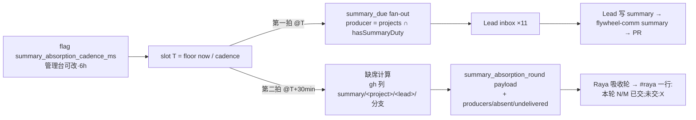

# FLY-2382 summary 写侧触发 + 缺席检测 — 探索
Issue: FLY-2382 (https://linear.app/geoforge3d/issue/FLY-2382/raya回流-summary-写侧触发-缺席检测按-prd-1846-872-的固定节奏6h运行期可改由机制叫-lead)
日期: 2026-09-06
基于: 无

## 0. 一句话

给 summary 回流补上「写侧的钟」和「缺席的眼」:复用既有 6h 节奏 flag,同一口钟敲两拍——第一拍 Bridge 向每个 producer Lead 的 inbox 投 `summary_due`,第二拍(半小时后)Raya 的吸收轮 payload 里带上「本轮谁交了、谁没交」,由 Raya 在 #raya 转述;不新增 daemon、launchd、crontab。

## 1. 现状审计(全部本机实核,2026-09-06 16:20–16:40 PT)

### 1.1 写侧:零触发 —— 证实

- `hasSummaryDuty` 全仓只出现在三处:身份投影(`packages/flywheel-comm/src/lead-identity.ts`、`summary-assignment-core.ts`)、Lead 启动 env `FLYWHEEL_LEAD_HAS_SUMMARY_DUTY`(`lead-lease.ts:2687/2772`)、`flywheel-comm summary` 的准入门(`commands/summary.ts:109`)。
- rules bundle 只在 duty=1 时把 `lead-rules-base/summary-inflow.md` 挂进去(`packages/teamlead/scripts/lead-rules-bundle.sh:379`、`claude-lead.sh:2810`)。该规则原文写「Produce a summary at the cadence configured … do not invent one, add reminders」——**规则要求 Lead 按一个从未有人向 Lead 传达过的节奏行动**。这就是 Ariel 9-6 说的「规则在场本身是假绿灯」。
- 没有任何代码路径按节奏对 producer 投递任何事件。今晚 xrliAnnie/raya 上 PR #15–#24 十份 summary(22:55–23:01Z 集中开出)是人肉推动的结果。

### 1.2 读侧:代码里有钟,生产从未响过 —— 比 issue 描述更糟

- 钟在:`packages/teamlead/src/bridge/summary-absorption-rider.ts` 挂在 GatePoller 的 `onSummaryAbsorptionTick`(每 20 tick × 3s = 60s 跑一次 pass),按 `summary_absorption_cadence_ms` flag 算 slot,给 `agentId === "raya"` 的 Lead 投 `summary_absorption_round`。
- 但 `resolveRaya()` 在生产 `~/.flywheel/projects.json` 里找不到 raya(6 项目 16 Lead,无 raya 行)⇒ **静默 `return`**。生产 `~/.flywheel/teamlead.db`:

  ```
  select count(*) from lead_events where event_type='summary_absorption_round'  → 0
  select count(*) from lead_events where lead_id='raya'                          → 0
  ```

- Raya 生产形态:launchd `com.xrli.raya.brain` 起的 `raya/code/apps/brain/dist/cli.js run`(独立 brain 进程)+ `com.xrli.raya.voice`。FLY-2131 设计的「Raya = Bridge 管的 Codex TUI Lead(M2-d)」尚未激活:`~/Dev/raya-lead-workspace` 不存在,activation-checklist B 段的 registry 行未加。raya brain 源码 `apps/brain/src/` 里没有任何 absorption / cadence 代码。
- ⇒ 今晚那十张 PR **当前没有机制读者**。这不是本单要修的(Raya 激活归 FLY-2131 检查单 / operator),但本单第二拍的可见性依赖它,必须在边界里写清。已用 ask `835d4294` 非阻塞上报 Lead。

### 1.3 缺席:不可见 —— 证实,且已发生

- producer 名单(projects.json ∩ per-lead granularity):product-lead、ops-lead、joycon-lead、belle-lead、mufasa-lead、rafiki-lead、reflection-lead、flywheel-eng-lead、flywheel-product-lead、tidal-echo-content-lead、sub-lead = 11,与 PRD §8.8.3 一致。
- 今晚已交 10/11,**未交:mufasa-lead**(Codex TUI Lead)。这条事实今天没有任何地方能读到,只能靠人数 PR。
- 附带观察(不归本单修):period 写法五花八门——`2026-09-06/2026-09-06`(date-only)、`2026-09-06T00:00:00-07:00/2026-09-06T23:59:59-07:00`、`2026-08-31/2026-09-06`(一周)。合同只校验 ISO 端点与 end date,不校验窗口长度。写侧钟上线后 Bridge 会在 `summary_due` 里**直接给出建议 period**,自然收敛。

### 1.4 投递通路:存在,但对 8/11 producer 未被证明

- 通路:`store.appendLeadEvent` → `registry.enqueueLeadEvent`(每个 projects.json Lead 都注册了 runtime,Bridge `/health` 的 `w2_delivery_loop` 16 个 Lead 全 fresh)→ Claude Lead 走 `ClaudeLeadDeliveryAdapter` 写 mailbox 文件;Codex Lead 走 `lead-inbox.sock`。
- 30 天内 `delivered_at IS NOT NULL` 的 Lead 只有:flywheel-eng-lead(31520)、flywheel-product-lead(3051)、belle-lead(54,最后 08-29)、flywheel-cos-lead(11)。其余 7 个 producer 30 天只各有 1 条 8 月 13 日的 `mailbox_dead_letter` 系统事件,从未投递。
- ⇒ **不能假定 `summary_due` 一定送达**。缺席报告必须把「机制没送到」与「送到了但没交」分开说,否则会把基础设施故障记在 Lead 头上(违反 FLY-913/Asha 9-6 的「静音失败」教训)。

### 1.5 节奏可改:已就位

- flag `summary_absorption_cadence_ms`(registry `packages/config/src/feature-flags/registry.ts:277`):默认 21600000(6h),codec 限 [60000, 2592000000] 整数毫秒,`toggleable: "direct"`;管理台经 `POST /api/fleet/flag/stage` → apply 写 flag store;`storeSummaryAbsorptionCadenceMs()` 是 call-time 读取(FLY-2131 R 轮已证「store 写入后下一轮生效」)。⇒ 本单**零新 flag**,复用即满足「运行期可改、无需重启」。

### 1.6 Bridge 已有的能力(不用新造)

- gh:`land-executor.ts`、`branch-cleanup.ts` 等已在 Bridge 进程内 `execFile("gh", …)`,凭证走 `GH_TOKEN`(`land-head-refresh-proof.ts:16`)。
- summary PR 的稳定分支命名:`summary/<project>/<leadId>/<sha256(project,author,period)[:16]>`(`summary-delivery.ts:64`)⇒ 按前缀 `summary/<project>/<leadId>/` 列 PR 就是该 Lead 的交付史,不用解析文件。
- 事件渲染:Claude Lead 侧通用 formatter 渲染 `summary`(截 300 码点)与 `notification_context`(不截),`patrol_tick` 有专用 formatter(`hook-payload.ts:945`)。
- 幂等原语:`lead_events` 上 `(lead_id, event_id)` 唯一索引;`StateStore.tryClaimLeadEvent` 区分「我刚写入」与「已存在」;`leadInboxRuntime.getLeadEventSettlement(project, deliveryId)` 可查一条投递是否落地(patrol 用它决定要不要重投)。
- 告警:`leadPendingAlertHolder.current.alert({...})` 走既有 alert sink;新增 kind 需在 `kind-contract.ts` + `alert-kind-copy.ts` 注册。

## 2. 问题定义

要交付的不是「一条提醒」,而是**把 summary 回流从「靠人记得」变成「机制自己会响、响了没人接也看得见」**。拆成三件事:

1. **叫**:到点让每个 producer Lead 收到一条带 period 的 due 事件——Lead 无需被 ping。
2. **看**:到点后半小时,机器算出「谁交了 / 谁没交 / 谁根本没收到」,交给 Raya 转述到 #raya。
3. **不多造钟**:节奏只有一口(§8.7.2),可在管理台改;不给任何 Lead 装本地定时器(R4)。

## 3. 方案空间

### 3.1 方案 A(建议)· 同一口钟两拍 —— 全部挂在既有 GatePoller rider 上



- 第一拍:rider 每 60s 跑一次 pass,发现进入新 slot T 就对每个 producer 投 `summary_due`,事件 id `summary_due:<project>/<lead>:<slotISO>` ⇒ 天然幂等(Bridge 重启、pass 重跑都不会重复)。payload 含 `period`(Bridge 按 founder 本地时区渲染的 `[T-cadence, T]`)、`last_delivered`(该 Lead 最近一张 summary PR 的编号/时间/状态,取自 gh)、以及一段自足的指令文本。
- 第二拍:同一个 rider,在 `now ≥ T + 30min` 才投 Raya 的 `summary_absorption_round`(roundId 仍是 slot T,形状不变),payload **新增** `producers[]`:每人 `delivered`(本轮有无 summary PR 活动)与 `due_delivery`(due 事件有没有真的落到 Lead inbox)。Raya 的指令文本追加一行固定格式:「本轮 N/M 份已交;未交:X、Y」,全员交齐时不列;有 `undelivered` 时另起一行「未送达(机制问题):Z」。
- Raya 未激活时:第一拍照常(叫 Lead 不依赖 Raya);第二拍算完缺席集后找不到 Raya,就以一行 warn 落 bridge.log 并跳过投递,不另开旁路。

### 3.2 方案 B · launchd plist 定时广播 —— 否决

- `ManagementCronWriter` 只能改既有 plist 的 schedule/enabled,不能创建;要新建 plist 就是一个新 daemon。
- launchd `disabled` 静默五周没人发现的事故就在眼前(Sub 三个 cron,Asha 9-6)。
- 节奏改动要落到 plist 而不是 flag,与 §8.7.2 的「运行期可改」多一层间接。

### 3.3 其他被否决的形状

| 形状 | 为什么不 |
|---|---|
| 各 Lead 自建 crontab / launchd | R4 founder-only-authority 硬禁;9 个 producer = 9 种静音失败 |
| 给 `summary_due` 单独一个 cadence flag | 变成两口钟,读写侧会漂;§8.7.2 说的是**一个**节奏 |
| Raya 自己 gh 列 PR 算缺席 | 名单逻辑(granularity/duty)在 Codex prompt 里复制一份,非确定性,且 Raya 未激活时什么都没有;Bridge 已有 gh 与名单,算一次给所有人用 |
| Bridge 直接发 #raya | 第二张嘴;Raya 是 #raya 的声音(FLY-2131 义务③)。Raya 未激活是 operator 前置,不用旁路掩盖 |
| Lead 回「本轮无更新」走新的 Lead→Bridge 写通路(新表 + 新 route + 新子命令) | 为一个 founder 未要求的第三态开一条写通路。若 Lead 想留痕,一份两行的极短 summary PR 就是「本轮无更新」,走既有命令、既有合同;不留痕就是沉默,沉默是一等信号(§10.5),Raya 轮报把它列出来是可见性,不是催促(§6.3 的「不凑」仍成立) |
| 第二拍偏移做成 flag | 多一个旋钮;§8.7.2 可改的是周期不是偏移。先做常量 30min,真要改是一行 |

## 4. 边界与不做

- 不改 summary 合同(`summaries/README.md` 路径、frontmatter、Facts+Judgment)、不改 `flywheel-comm summary` 的 PR 机制、不改 Raya 读侧的 merge/吸收逻辑;只给 Raya 的轮事件 payload **加字段**,并在指令文本追加一行。
- 不激活 Raya、不给 projects.json 加 raya 行(FLY-2131 activation-checklist / operator)。
- 不修今晚 period 写法不一致;`summary_due` 给出建议 period 后自然收敛。
- 不给 Lead 装本地定时器;不在圆桌口头通知。
- 无新 daemon、无新 flag、无新 launchd/crontab。

## 5. 待 Lead / founder 的点

- 方案 A/B 二选一 founder 尚未圈;本探索按 issue 建议的 A 展开,B 作为 rejected alternative 保留。
- Raya 未激活期间要不要 Bridge 直发 #raya 的兜底 —— 我默认「不要」,已 ask `835d4294`。
- 第一拍的 `last_delivered` 依赖 gh 列 PR;gh 不可用时 due 照发、字段标 `unavailable`,不阻断叫人。
