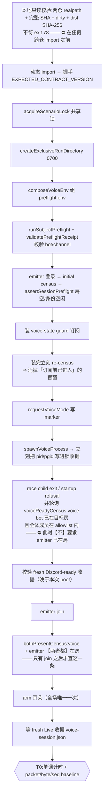

# FLY-2383 语音并发半小时实测 — 实施计划

Issue: FLY-2383 (https://linear.app/geoforge3d/issue/FLY-2383/raya语音实测-prd-1850-73-未量的那一半真实-runner-编排在跑-语音在流-半小时量级-不挂-founder工程自测)
日期: 2026-09-06
基于: research.md

> **v5** —— Codex 第 4 轮判 CHANGES REQUESTED,一条 P0 + 三条 minor 全部接受。实质改动:
> **识别结果不许决定自己进不进分母** —— v4 把「nonce 匹配」同时当作 eligibility 条件和命中判据,
> 构成循环定义,会把 miss 全部排除出分母、系统性抬高识别率(§1.8 已拆成两个正交阶段);
> 且 ON / OFF 两臂必须有**各自的**音频 eligibility(OFF 用 v4 的规则会全军覆没成 `not_in_bed_window`)。
>
> **v4** —— Codex 第 3 轮判 CHANGES REQUESTED,七条全部接受。实质改动:
> ①PCM 帧边界改用 raya 已导出的 `createPcmFrameTap`(decoder 的 `data` chunk **不等于**一帧);
> ②`prism` 必须从 pinned raya dependency root 解析(flywheel 根 resolve 不到);
> ③分类器 holdout 补 **bed→voice duck 过渡**这个最危险的边界;
> ④附录必须报 `unknown` 秒数,且只写可观测的错误;
> ⑤启动序列合并成**唯一一条**(图 = 文字);⑥research §4.3/§4.4 同步到 v3;
> ⑦Lead 要求的跨仓路径 + `CONTRACT_VERSION` 常量块写进 plan(§1.0)。
>
> **v3** —— Codex 第 2 轮判 CHANGES REQUESTED,六条全部接受。
> 仓库边界评审已裁:**方案 A(driver 住 flywheel 仓)通过**,lifecycle parity 不要求搬去 raya 仓。
> v3 的实质改动:①PCM 不再「按 atMs 去重」,改成**在解码器上直接挂旁路**(见 §1.5,游标问题从根上消失);
> ②分类器允许 `unknown` 并 fail-closed,bed 用 **BoxB 频谱模板**而不是「中间 RMS」;
> ③正场前必须先跑 OFF 负对照并冻结分类器(顺序改了);④整段播放窗排除 voice/barge overlap;
> ⑤lifecycle 的 ready/error/落盘顺序修正;⑥候选字段 `status` 不是 `session_status`。
>
> **v2** —— Codex 第 1 轮判 CHANGES REQUESTED,四条 P0 全部接受并重写。
> 被推翻的两条关键前提逐字留在 research.md §3 / §4.1,**不抹掉**:
> ① 「当前 HEAD 第一次抢话必崩」——**错的**,那一行已是 `appendText(note,"user")`;
> ② 「数 Opus 包能判 Raya 静默」——**错的**,下行连续流里 bed 和编码静音同样是包。

---

## 0. 评审存证

Codex 设计评审 **5 轮,2026-09-06,APPROVED**(第 5 轮零 blocking issue)。
反馈原文逐轮留档:

```
design-review/round1.md   CHANGES REQUESTED  四条 P0
design-review/round2.md   CHANGES REQUESTED  六条
design-review/round3.md   CHANGES REQUESTED  七条
design-review/round4.md   CHANGES REQUESTED  一条 P0 + 三条 minor
design-review/round5.md   APPROVED
```

(原文产出在 `/tmp/codex-rescue-design-feedback-flywheel-FLY-2383-plan-round{1..5}.md`,
已原样收进本文件夹 —— `/tmp` 会被清掉,存证不能只活在那儿。)

- Codex 持久线程:`01a07913-3d9b-7943-bd7b-bf420471d159`(1 次 Task + 4 次 Resume,五轮同一条线)
- 门收据:`.flywheel/runs/47b6b7cd-3424-432b-8d0d-cbf4457e464d/codex/design-review.json`
- **被评审的 plan blob**:`7821e0d6a267b504f9b3dcb1150cfbaf793352bf`
  ⚠️ 本节是评审**之后**追加的存证指针,**不是设计改动** —— 设计以那个 blob 为准。
- 二十条意见,**0 拒绝**。

---

## 0. 这个计划要交付的是**一场观测**,不是一个功能

⚠️ 产物是**数据**;代码只是取到数据的**尺子**。
验收看的是「**一次满足三条件的 30 分钟观测数据可查**」。
⛔ 尺子不许比被量的东西还复杂 —— 但**尺子的口径必须先立住**,否则跑出来的是一份
「看着齐全、其实量错了」的 manifest,那比没跑更糟。

### 0.1 三个条件各自怎么被满足(每条都要落到**可归因的收据**)

| §7.3 条件 | 本场怎么满足 | 判定用哪条收据 |
|---|---|---|
| ① 真实 agent turn 在语音在流时完成 | 周期性注入,**含带工具的**(读隔离 workspace 的 nonce) | 每轮一张 turn receipt:fixture hash → `onStarted` 时刻 → 匹配到的 user transcript → **assistant 回出 exact nonce** → generation |
| ② 半小时量级 | **一场连续会话**,`performance.now()` 单调差 **≥ 1,800,000 ms** | 单调计时 + 逐秒桶无不可解释空洞 |
| ③ 真实 runner 编排在跑 | `mode=live` 只做**候选发现**,再对候选打 `/status`,要求出现 **`status=executing`** 且与语音窗**有重叠区间** | 逐次 `/status` 原始收据 + 重叠时段 |

> ### 🔑 ③ 的判据被评审收紧过:`mode=live` 含 `pending / ship_parked / awaiting_review / design_done / approved_to_ship`
> (`packages/teamlead/src/operational-terminal-status.ts:15-22`)。
> ⇒ **一个 parked 会话的 `last_activity_at` 在动,不是「编排在跑」。**
> 已实测 `GET /api/sessions/:id/status` 会返回 `{"status":"executing","session_status":"running"}`
> (`tools.ts:332-371`),用它。

---

## 1. 尺子:`scripts/qa-voice-concurrency-soak.mjs`(flywheel 仓,单文件 Node)

> 仓库边界按 research.md §5 **方案 A**(已 ask Lead,question `c9d638ee`;未回则按 A 交付并在 PR 里写明)。

### 1.0 🔒 一处冻结常量块(Lead 要求 + 方案 A 的 drift contract)

driver 里**只有一个** frozen constants object,所有动态 import、握手、SHA 校验、
Prism 解析和**报告首页**都从这一处取值。⛔ 不许散落在各处。

```js
export const CROSS_REPO = Object.freeze({
  // 期望的 529 场景协议版本 —— 不等就 exit 78
  EXPECTED_CONTRACT_VERSION: "raya-voice-529/v1",

  // 期望的 raya 完整 SHA(本单基线);两仓都必须 clean 且 HEAD 等于它,否则 exit 78
  EXPECTED_RAYA_SHA: "b1b5a64f2f060349b95f39c6cf4b05b453a6a7f1",

  // 跨仓 import(相对 --harness-root)—— 逐字列出,⛔ 不许实现者自己猜
  IMPORTS: Object.freeze({
    orchestrator: "scripts/qa/lib/orchestrator.mjs",   // CONTRACT_VERSION / ScenarioError /
                                                       // acquireScenarioLock / createExclusiveRunDirectory /
                                                       // currentProcessIdentity
    envCompose:   "scripts/qa/lib/env-compose.mjs",    // composeVoiceEnv / loadOwnerPrivateEnv /
                                                       // assertQaChannel / assertSubjectDist /
                                                       // validatePreflightReceipt
    session:      "scripts/qa/lib/session.mjs",        // spawnVoiceProcess / assertSessionPreflight
    ttsFixture:   "scripts/qa/lib/tts-fixture.mjs",    // renderTtsFixture
    scenario:     "scripts/qa/raya-voice-529.mjs",     // runSubjectPreflight / assertArtifactSecretsAbsent
    emitter:      "probes/c9-voice-emitter.mjs",       // loginDiscordEmitter / createRayaAudioObserver /
                                                       // createPcmFrameTap
    contracts:    "packages/contracts/dist/index.js",  // requestVoiceMode / RAYA_STATE_PATHS
  }),

  // Prism 解析锚点 —— 见 §1.5.1a
  PRISM_ANCHOR: "apps/voice/package.json",
});
```

⚠️ **这个块的内容要原样出现在数据附录首页**(Lead 要求),
读者据此知道这份数据是**哪一份 harness、哪一个 SHA** 产出的。

### 1.1 生命周期:**不自己发明,能 import 的全部 import**

评审第 2 条说得对:只调 `spawnVoiceProcess` 会丢掉 529 路径负责的一整套契约,
而且**缺 `voice-mode.requested` 时进程直接以 `voice_mode_not_requested` 退出**
(`apps/voice/src/cli.ts:296-312`)—— 按 v1 那样跑,**根本起不来**。

已核过:需要的东西**基本都是导出的**,不用重写:

| 契约件 | 从哪来 | 已核 |
|---|---|---|
| 共享锁 `.raya-voice-529.lock` | `orchestrator.mjs` `acquireScenarioLock` | `:483`,导出;冲突抛 exit 75 |
| 排他 run 目录(0700) | `orchestrator.mjs` `createExclusiveRunDirectory` | `:271`,导出 |
| owner 身份 | `orchestrator.mjs` `currentProcessIdentity` | `:311`,导出 |
| subject `cli preflight` | `raya-voice-529.mjs` `runSubjectPreflight` | `:131`,**导出** |
| preflight 收据校验 | `env-compose.mjs` `validatePreflightReceipt` | 导出 |
| 房空 / 身份空闲 | `session.mjs` `assertSessionPreflight` | `:189`,导出 |
| **写 voice-mode marker** | `packages/contracts/dist` `requestVoiceMode` | `voice-mode.ts:55`,导出;原子写 + fsync + 0600 |
| 组 env | `env-compose.mjs` `composeVoiceEnv` | 导出 |
| spawn(detached,拥有进程组) | `session.mjs` `spawnVoiceProcess` | `:145`,导出 |
| 落盘前 secret 扫描 | `raya-voice-529.mjs` `assertArtifactSecretsAbsent` | `:86`,导出 |
| 耳朵 | `probes/c9-voice-emitter.mjs` `loginDiscordEmitter` | `:275`,导出 |
| TTS | `tts-fixture.mjs` `renderTtsFixture` | 导出 |

**只有四小件要在 driver 里自己实现**(私有函数,各 ~15 行,**都带单测**):
`voiceReadyCensus`(**pre-join**:voice bot 在目标房 + 全体成员在 allowlist 内,
⛔ **不**要求 emitter 已在房)、
`bothPresentCensus`(**post-join**:voice + emitter 两者都在)、
`validDiscordReadyReceipt` / `validLiveReceipt`(收据必须**晚于本次 boot**)。

⇒ **开工第一件事仍是握手**:`CONTRACT_VERSION === "raya-voice-529/v1"`,不等 exit 78。

### 1.2 启动顺序 —— **唯一一条规范序列**(fail-closed,任一步失败就作废本场)

> 🔴 **v3 有两套顺序**(评审第 3 轮):图里没有 `readyCensus`、没有装 guard 的节点,
> 正确顺序只活在图后的说明里。⇒ **图和文字合并成下面这一条,实现与 lifecycle 测试都以它为准。**

> ⚠️ **SHA 校验排在跨仓 import【之前】**(评审第 4 轮 minor):
> 用本地 git / 只读文件操作先校验 harness 的 realpath / SHA / dirty,
> **再执行任何跨仓模块** —— 否则一个已漂移模块的 top-level 代码会在我们拒跑之前就跑掉。



> 🔴 **两个 census predicate 必须分名**(评审第 4 轮 minor):
> 现有 pre-join 的 `readyCensus`(`session.mjs:210-216`)只要求
> **voice bot 在目标房 + 全体成员在 allowlist 内**,**并不要求 emitter 已在房**。
> ⇒ 若照「房里只有 voice+emitter 两个 bot」去实现 pre-join 那一步,
> **emitter 还没 join,它会永远等下去。**
> ⇒ 本 plan 里 pre-join 叫 `voiceReadyCensus`,post-join 才叫 `bothPresentCensus`。

> ⚠️ **`F2 → F3` 那一步是新的**:census 与 guard 之间若留缝,
> 「第三人在订阅之前就进来了、之后又没有任何 event」就会**漏报**。
> ⇒ 装完 guard **必须再 census 一次**。

⛔ **30 分钟计时从 T0 起**(fresh Live + emitter joined + arm 之后),
⛔ **不是从进程 spawn 起** —— 否则会把启动耗时算进「半小时」。

### 1.3 全场 guard(一旦触发,立刻收场并把本场标 **INVALID**)

| guard | 来源 |
|---|---|
| 第三人进房 | `emitter.onVoiceStateChange`,全程订阅(⛔ 不是只在开头查一次) |
| voice/emitter 身份离房 | 同上 |
| child 提前 exit | `child.exited` 竞速 |
| ~~receiver stream error~~ **删掉这条** | `audioError` 是 `createRayaAudioObserver` 的**私有变量**,`loginDiscordEmitter` **不暴露**;且 `packets>0` 后 `wait()` 会先返回 snapshot(`c9-voice-emitter.mjs:246-256`),后续 error 根本走不到那个检查。⇒ **改由「packet/PCM 停止推进 + 秒桶空洞」fail closed**,⛔ 不声称我们有一个并不存在的 guard |
| 不可解释的大 gap(时钟跳变 / 休眠) | 单调时钟 vs 挂钟偏移超阈 |
| cleanup census 不收敛 | 收尾时 |

### 1.4 收尾(`SIGINT/SIGTERM/异常` 全部走同一个 finally)

> 🔴 **v2 的顺序是错的**(评审第 4 条):v2 把「写 manifest + secret scan」排在
> **post-cleanup census 之前** ⇒ **cleanup 不收敛时,最终 manifest 可能已经写成 VALID**,
> 而且新增的 cleanup error 没经过 secret scan。

正确顺序:

```
① emitter.leave()            ← 公开 API 的一次幂等 teardown;它内部已经 destroy observer
                                (c9-voice-emitter.mjs:289-296)。⛔ 外部拿不到独立 observer handle,
                                不许写「leave → observer.destroy → emitter.destroy」三步
② SIGTERM 进程组 → 超时 SIGKILL → await child.exited
③ 读最终 events.jsonl(含收尾才吐的 audio_counters)
④ post-cleanup census,汇总【全部】cleanup errors
⑤ 才原子写最终 manifest(tmp + rename),verdict 由 ①–④ 的结果决定
⑥ assertArtifactSecretsAbsent(runDir)
   └─ scan 失败 → 另写一份【最小、无敏感内容】的顶层 INVALID receipt
⑦ 释放锁
```

> ### 🔑 **cleanup failure 必须能覆盖先前的 VALID。**
> 这条要有 lifecycle 级单测,⛔ 不是「纯函数测试」能覆盖的。

⚠️ **`caffeinate` 必须包住 driver 的整个生命周期**(由启动命令负责,不是 driver 内部起一个)。

#### 1.4.1 lifecycle 级单测(评审要求,单列)

至少覆盖:stale ready receipt · readyCensus 不收敛 · 第三人进房 / identity 离房 ·
child 提前 exit · **PCM 停止推进** · 信号中断 · cleanup census 失败 ·
**「cleanup failure 最终一定覆盖先前 VALID」**。

### 1.5 🔴 下行观测:**在解码器上挂旁路**,不做游标去重

评审第 1 轮推翻了「数包判静默」(research.md §4.1/§4.2);
第 2 轮又推翻了 v2 的「按 `atMs` 游标去重」——理由是硬的:

> `createRayaAudioObserver` 的 `nowMs` 默认就是 `Date.now`(`c9-voice-emitter.mjs:127-130`),
> 帧上**没有序号**,`atMs` **既不保证唯一也不保证单调**(同毫秒多帧;系统校时可回退)。
> ⇒ `> lastAtMs` 会**静默丢帧**,`>= lastAtMs` 会**重复消费**。**两种都不报错**,
> 却会同时污染秒桶、静默守卫和 bed eligibility。

#### 1.5.1 ⇒ 不去重,改成**源头就唯一** —— 但「一帧」必须是**真的一帧**

`loginDiscordEmitter` 的 `dependencies.createAudioObserver` 是**可注入的**
(`c9-voice-emitter.mjs:371`),`createRayaAudioObserver` 又接受 `options.createDecoder`
(`:131-134`)⇒ driver 自己造解码器,在它身上挂旁路。

> 🔴 **v3 的示例是错的**(评审第 3 轮):我在 `decoder.on("data", chunk)` 里直接 `seq++`
> 并把 `chunk` 叫「一帧」。**Node stream 不提供这个保证** —— 一个 `data` chunk 可能含多帧,
> 也可能切在半帧上。`frameSize: 960` 是 **Opus 解码器配置**,**不是** `data` 回调的边界契约。
>
> raya 已经把这件事解决过并**导出了**:`createPcmFrameTap(onFrame)`(`c9-voice-emitter.mjs:34-54`)
> 跨 chunk 累积,**只在凑满 3,840 字节(= 960 个 48kHz 立体声采样 = 20ms)时**才回调;
> 它自己的测试(`c9-voice-emitter.test.mjs:288-305`)专门覆盖了 split / coalesced 输入。

⇒ **用它,不自己再写一个 framer**:

```js
createAudioObserver: (receiver) => createRayaAudioObserver(receiver, {
  maxPcmFrames: 50,                     // observer 自己的环形缓冲我们不用,压到最小
  createDecoder: () => {
    const decoder = new prism.opus.Decoder({ rate: 48_000, channels: 2, frameSize: 960 });
    const tap = createPcmFrameTap((frame /* 恰好 3840 字节 */) => {
      sink.push({
        seq: nextSeq++,                 // 严格递增,driver 独占,【一帧一号】
        atMonoMs: performance.now(),    // 单调钟
        features: extractFeatures(frame),
      });
    });
    tap.resume();                       // 必须消费 tap 的输出,否则背压会卡住 decoder
    decoder.once("error", onDecoderError);   // 旁路要报 decoder error 就【两个都】听
    tap.once("error", onDecoderError);       // ⚠️ 漏听也不致命:PCM 停止推进仍会判本场 INVALID
    decoder.pipe(tap);
    return decoder;                     // observer 照常挂它自己的 data/error/close
  },
})
```

- ⛔ **`seq` 只在 `onFrame` 里分配**,partial 字节**永不**进入分类。
- 单测必须喂:**一次多帧 / 跨 chunk 半帧 / 末尾 partial**,并证明
  **每个完整 3,840 字节帧恰好产出一个连续 `seq`**,partial 不产出。
- 仍然 `arm(rayaBotId, { decodePcm: true })` **全场只一次**(`attachDecoder` 只在 `decodePcm` 为真时建解码器,`:164`)。
- ⛔ **不调用 `rayaPcmFrames()`**;每 60s 用 `wait(rayaBotId, 0)` 读**累计** packets/bytes 差分。
- **T0 记 baseline**(packet / byte / seq),⛔ join / Live 之前的帧一律丢弃。
- poll lag 上限事先写死,超限 ⇒ 本场 **INVALID**。

##### 1.5.1a Prism 从哪来 —— **必须锚在 pinned raya dependency root**

`prism-media` 是 **raya voice app 的依赖**,`c9-voice-emitter.mjs:15-31` 自己就是这么解析的:

```js
const requireVoiceDependency = createRequire(new URL("../apps/voice/package.json", import.meta.url));
const prism = requireVoiceDependency("prism-media");
```

> 🔴 **flywheel 根目录 `require.resolve("prism-media")` 是 NOT_FOUND**(评审实测)。
> ⇒ driver 里 bare `import "prism-media"` **跑不起来**。

⇒ driver 必须:

```js
const requireRayaDep = createRequire(pathToFileURL(join(harnessRoot, CROSS_REPO.PRISM_ANCHOR)));
const prism = requireRayaDep("prism-media");
```

`harnessRoot` 必须**先过 realpath + SHA + dirty 校验**(§1.10)再拿来做锚点。
⛔ **不许依赖开发机恰好 hoist 出来的 transitive 包。** 这个锚点也进 §1.0 常量块与 provenance。

##### 1.5.1b 立体声 → 单声道(Goertzel 的输入必须定死)

3,840 字节帧是 **interleaved stereo**(L,R,L,R…,960 采样/声道)。
BoxB 左右声道相同(`Bed.ts`),但 ⛔ **不许把 1,920 个交错采样当成 48kHz mono 序列** ——
那样五个目标频率的解释直接错掉。

⇒ 事先定死:**取一路 960 采样的 mono 序列**(校验 L/R 一致后取 L;
不一致则按明确定义的 `(L+R)/2` downmix 并记账)。Goertzel 的采样率 = **48,000 Hz**,N = 960。

#### 1.5.2 分类器:**四档**,`unknown` 是一等公民

评审第 2 轮说得对:「voice 最高 / bed 中间 / silence 最低」**源码不保证**——
BoxB 自带衰减包络(`Bed.ts:42-67`),`Mixer.mix` 还会在 voice 到来时把 bed **逐帧 duck**
(`Mixer.ts:13-15`,`bedGain *= 0.05`)⇒ **quiet 音素、语音停顿、bed 尾巴的 RMS 区间会重叠**。

⇒ 用**特征**分,不用单一 RMS,且**允许分不出来**:

| 特征 | 怎么算 |
|---|---|
| `energy` | 帧 RMS |
| `tonalRatio` | 对 BoxB 的五个音 `[261.63, 293.66, 329.63, 392, 440] Hz`(`Bed.ts:2`)做 Goertzel,能量占比 |

```
energy < silenceFloor                                  → silence
tonalRatio ≥ bedTonalMin  且 energy ≤ bedEnergyMax      → bed
energy ≥ voiceEnergyMin  且 tonalRatio ≤ voiceTonalMax  → voice
其余                                                    → unknown
```

⛔ **不许为了「好看」把 `unknown` 强行归档。** `unknown` 多本身就是数据。
⚠️ 但**大量 unknown 可以接受、要如实报告** —— ⛔ **不许用「漏报 voice」去换有效样本数。**

#### 1.5.3 标定与 holdout(**尺子资格,不是产品阈值**)

| 步 | 内容 |
|---|---|
| 标定窗 | 多个已知 voice / 已知 bed / 已知 silence 窗,**逐窗留原始特征** |
| **holdout** | 另留**未参与定阈值**的窗做验证;类别重叠 ⇒ 尺子 `INSTRUMENT_FAIL` |
| 🔴 **mixed / duck 过渡**(评审第 3 轮新增,**最危险的边界**) | `Mixer.ts:12-19` 会在 voice 到来时**逐帧压低 bed**(`bedGain *= 0.05`)⇒ 短窗内可能**同时**有 BoxB 音调能量和 voice。**已知 bed→assistant 起音的过渡帧只能判 `voice` 或 `unknown`,⛔ 绝不许落成 `bed` / `silence`** —— 否则 §1.8 的播放后复核会**漏掉真正的 voice overlap**。建议再加一组走**同一条 Opus 编解码链**的离线混合 fixture,真房 transition 作 holdout;误分类 ⇒ `INSTRUMENT_FAIL` |
| **quiet voice** | `energy < silenceFloor` 是第一优先级规则 ⇒ 必须用**低能量音素样本**验证它不会把 quiet voice 无条件吞成 `silence` |
| **负对照** | **臂 B(`bedEnabled:false`)下必须看不到 bed signature**;还看得到 ⇒ `INSTRUMENT_FAIL` |
| 冻结 | 阈值 / 特征 / 标定窗 / holdout 结果**在正场前冻结并进 bundle** |

> ### ⚠️ **顺序被评审改过,这一条是硬的**:
> ### **短 ON pilot → OFF 负对照(臂 B)→ 冻结分类器 → 才跑 A 正场。**
> ⛔ **不许先跑 30 分钟 A,再用一个失败的 B 去证明「A 的 bed 标签从来没成立过」。**

#### 1.5.4 附录里这个指标只能这么叫

> ### **「下行 Opus 包(含 voice/bed/编码静音)」**
> ⛔ **不许叫「声音连续」,不许叫「没有静音」。** 它证明的是**传输还在**。

**三句分开写,⛔ 不许合并**(评审第 3 轮:bed 也是**可听**的声音):

```
Raya 有没有在说话        →  voice 档的秒数
电话里有没有可听内容      →  至少是 voice + bed 的秒数
unknown                  →  照实报,⛔ 不外推成任何一档
```

### 1.6 注入:静默守卫改用 **voice 档**,不用包

```
连续 SILENCE_GUARD_MS(3000ms)内【无 voice 档帧,且无 unknown 帧】  →  才 unmute + play
超过 INJECT_WAIT_MAX_MS(45000ms)仍等不到  →  跳过本次,记 skipped{reason:"no_voice_free_window"}
```

⛔ **`unknown` 不算「安全」。** 分不出来就当它可能是 voice —— fail closed。

⚠️ 跳过要记账、要进附录 —— 「半小时里有几次插不进话」正是 §7 关心的体感。

> 📎 **理由已更正**(research.md §3.2):这不是**规避崩溃**(那条已修),
> 是**保证 turn 测量干净**(barge 会 cancel response,污染分子分母)+ **抢话语义仍归 FLY-2249**。
> ⇒ 附录逐字:**「本场只测不抢话的注入;抢话下的半小时未量。」**

### 1.7 🔴 每轮 turn 的可归因收据(评审第 4 条)

**先修一个字面错误**:`realtime_transcript` 落盘的 row **没有 `final` 字段**
(`runtime.ts:1740-1760`,只在 final chunk 时才写)⇒
⛔ **不许按 `(role=assistant, final)` 去筛,会一条都筛不到。**
正确说法:这些 row **本来就是 final-only**,靠 `kind / role / generation / 文本里的 nonce` 关联。

每轮一张收据,字段固定:

```
roundId, kind: "plain" | "tool" | "bed_probe"
sentence(逐字), nonce(每轮唯一), fixtureSha256
playbackStartedAtMs(emitter onStarted), playbackEndedAtMs
matchedUserTranscriptId / text / atMs        ← 上行有没有被听见
expectedAssistantNonce, matchedAssistantTranscriptId / text / atMs, generation
rttPlaybackToAssistantMs                      ← 主 RTT 定义
rttUserFinalToAssistantMs                     ← 次要指标,单独命名
outcome: completed | timeout | skipped | ineligible
```

- **工具题**照 C4 的做法:隔离 workspace + start instructions,答案必须回出
  **workspace 文件里的 exact nonce** ⇒ 证明**工具真的跑了**,不是随便一句 assistant final。
- **RTT 主定义 = `playbackStarted → matched assistant final`**,事先写死。
  ⛔ **不许事后挑一个更好看的起点。**

#### 1.7.1 普通 turn 也要**播放后复核**(评审第 3 条)

只靠「播放前 3 秒无 voice」不够 —— **Raya 可能在探针播到一半时突然开口**。
⇒ 每轮播放结束后再复核一次:`playbackStarted → playbackEnded + tail` 整段内
**无 voice 帧、无 unknown 帧、无该轮关联的 `barge_* acted` / response cancellation**。
不满足 ⇒ 记 `ineligible:voice_overlap | ambiguous_audio | barge_acted`,
⛔ **不进 turn 完成率的分子分母**(否则「它突然开口」那几轮会污染完成率)。

### 1.8 等待音那半格:**两个正交阶段**,识别结果**不许**决定自己进不进分母

> 🔴 **v4 在这里犯了一个会系统性抬高数字的错**(评审第 4 轮):
> 它把「user transcript 的 nonce 匹配」**同时**当作 eligibility 条件(d)**和**命中判据(④)。
> 于是:
>
> ```
> nonce 匹配      → eligible → hit
> nonce 不匹配    → ineligible → 不计 miss
> 完全没有 transcript → ineligible → 不计 miss
> ```
>
> ⇒ 「命中 / 有效 N」**不再是识别率**,而是「已经命中的样本里有多少命中」——
> ### **恒等于 100%。** 这正是本单明令禁止的「悄悄把数字说大」。

⇒ 拆成**两个正交阶段**,顺序不许颠倒:

#### 阶段一:**音频 / 仪器 eligibility** —— 与 STT 结果**完全无关**

| 臂 | 全部满足才算 audio-eligible |
|---|---|
| **A(bed 开)** | fixture **完整播完** · 播放窗内 bed-signature 帧数 ≥ **事先冻结**的下限 · 全窗**无 voice、无 unknown** · 无 barge/cancel · 采样与时钟正常 |
| **B(bed 关)** | fixture **完整播完** · **同类 busy 窗内确认 bed signature 缺席** · 全窗**无 voice、无 unknown** · 无 barge/cancel · 采样与时钟正常 |

> ⚠️ **两臂的规则必须不同**(评审):B 配的是 `bedEnabled:false`,
> 照 A 的规则去判,**B 的每一次正常探针都会变成 `not_in_bed_window`**,对照分母直接归零。
>
> 🔴 **OFF 臂若检测出 bed signature** ⇒ 按 §1.5.3 判 classifier / 负对照 **`INSTRUMENT_FAIL`**,
> ⛔ **不是**记一个普通的 `not_in_bed_window` 了事。

不满足 ⇒ 记明确原因:`incomplete_playback | voice_overlap | ambiguous_audio | barge_acted |
not_in_bed_window | bed_present_in_off_arm | sampling_fault`。

#### 阶段二:**recognition outcome** —— 只对已 audio-eligible 的那些播放判

```
固定 timeout 内出现【含本轮 nonce】的 user final   →  hit
没有 user final / 只有不匹配或错误的文本 / 超时      →  miss(并保存实际观察到的 transcript 原文)
```

> ### ⛔ **识别结果不得反过来改变 eligibility。**
> ### ⛔ **miss 必须永久留在分母里。**

#### 目标 N 与补打规则(**事先冻结**)

- 目标 N = **两臂各自预先冻结的 audio-eligible playback attempts 数**,
  ⛔ **不是**「成功识别的 N」。
- 因 voice overlap / unknown 等**音频混杂**导致 ineligible 而补打,必须**事先冻结**
  最大总 attempts 与调度规则。⛔ **不许一直补到凑出 N 个 hit。**
- 附录**四个数一起报**,少一个都不算:

```
忙窗探针识别(A:bed confirmed;B:bed absent confirmed)
attempted / audio-eligible / hit / miss   —— ineligible 按原因另列
```

#### 协议本身(不变)

```
① 抛【工具题】→ Raya 转忙 → bed 起(臂 A)/ 不起(臂 B)
② 忙窗内注入【探针句】(bed 不是 voice 帧 ⇒ 不触发 barge,已核 Downlink.ts:200-209)
③ 阶段一判 audio eligibility → ④ 阶段二判 hit / miss
```

| 臂 | 配置 | 时长 | 目的 |
|---|---|---|---|
| **A** | **默认**(bed 开) | **≥30 分钟** | 三条件正场 + bed ON 命中 |
| **B** | `RAYA_VOICE_OPTIONS_JSON: {"bedEnabled": false}` | **~10 分钟** | bed 对照臂 + 分类器负对照 |

**两臂事先冻结**:同一份句子表、同一配对顺序、同一目标 audio-eligible N。
> ⛔ **「可比」必须由【同句 + 同判定 + 实际 N】支撑,不是靠一句描述。**
> ⛔ **B 不是「另一场半小时」**,附录必须写明它是 ~10 分钟的对照臂。
> ⚠️ `bedEnabled` 是**启动期**配置 ⇒ **两臂必然是两场**,⛔ 不许写成「同一场内 A/B」。

### 1.9 ③ 编排证据的采样契约(评审第 5 条)

```
每 30s:  GET /api/sessions?mode=live        ← 只做候选发现
        候选筛选:candidate.status === "running" 且【非本 soak】
        对至少一个候选:GET /api/sessions/:id/status   ← 存原始 receipt
        合格判定:receipt.session_status === "running" && receipt.status === "executing"
```

> ### 🔴 **字段名是两套,不许混**(评审第 5 条):
> 列表响应的 `Session` 只有 **`status`**(`StateStore.ts:1228-1239`,路由 `tools.ts:145-161`);
> **`session_status` 只在单会话 `/status` 响应里被追加**(`tools.ts:362-370`)。
> ⇒ 照 v2 的字面写法去筛列表会得到**零候选**,再把一场可用观测误判成「无编排重叠」。
> **两种 JSON shape 各写一个 parser 单测。**

- **合格重叠** = 语音窗内出现过 `status === "executing"` 的采样点。
- 没有合格重叠 ⇒ **本场仍可作为观测保留,但 ⛔ 不算「三条件齐」**,要写明缺第三条件并重跑。
- HTTP / auth / parse 失败 ⇒ 记 **instrumentation failure**,⛔ **不许写成 `live=0`**。
- 附录写**实际重叠时段与样本数**,⛔ **不许把整场推定为 runner 忙**。

### 1.10 provenance / secret / 计时(评审第 7 条)

**manifest 必须冻结这些字段**:

```
harnessRoot / subjectRoot 的 realpath;两者的完整 git SHA + dirty bit
subject apps/voice/dist/cli.js 的 SHA-256;CONTRACT_VERSION
脱敏后的实际 CLI 参数与 voiceOptions;channelId / botAppId(非 token)
sentence-set 版本 + 每条 fixture 的 SHA-256
startedAtWall / endedAtWall;monotonicStartMs / EndMs / durationMs
每个 raw evidence 文件的相对路径 + SHA-256
本场 verdict:VALID | INVALID(+ 原因);instrumentation errors 全列
```

**secret 最小化**:
- child 的 `baseEnv` **只用 `loadOwnerPrivateEnv(~/.flywheel/raya/raya.env)`**
  —— 那是 Raya 自己的 env。⛔ **绝不把 `~/.flywheel/.env` 整包传给 child**
  (`composeVoiceEnv` 会 `...options.baseEnv` 原样展开)。
- Bridge token 与两个 bot token **各自最小读取**,只在需要的调用里用,不进 manifest。
- 落盘后跑 `assertArtifactSecretsAbsent(runDir, [...tokens])`。

**SHA 锁定(评审第 7 条,方案 A 的附加条件)**:

> ⚠️ research.md §5 曾写「握手不上就停,因此不会静默跑在漂过的 harness 上」——**说过强了**。
> `CONTRACT_VERSION` 是 **529 场景协议**的版本,**不保证**我们直接 import 的那些内部函数
> 在语义调整时一定 bump。路径/导出被删会 import 失败,但**签名兼容下的语义漂移不会**。

⇒ preflight 阶段**锁定**:harness 与 subject 的 realpath、**完整 git SHA**、dirty bit、dist SHA-256。
本单既然明确基于 `b1b5a64`:**两者必须 clean 且 HEAD 等于预期完整 SHA,否则 exit 78**。
要跑别的 SHA,必须显式传 `--expected-harness-sha` / `--expected-subject-sha` 更新声明,
⛔ **不许只在事后 manifest 里发现自己跑的是另一个 SHA。**

**计时**:
- ② 的资格 = `performance.now()` 单调差 **≥ 1,800,000 ms**,从 T0(§1.2)起算。
- 每个采样点记 timer lag;**不可解释的大 gap ⇒ 本场 INVALID**,⛔ 不许「继续补齐 30 格」。
- `caffeinate` 包住整个 driver 生命周期。

### 1.11 🔴 这根尺子**量不到**的(必须和数字一起写)

| 量不到 | 为什么 |
|---|---|
| 「她开外放、麦克风把等待音**回灌**」 | emitter 上行是**干净音频文件**,bed 永远进不了上行(FLY-1911 `decisions.md` 已标同一条边界) |
| **抢话**下的半小时 | §1.6 只测不抢话的注入 —— 这是**范围**,不是崩溃规避 |
| 产品内部 **reconnect** 逻辑 | 本场看的是「进程退没退 / 传输断没断」;`meeting_container_*` 在非 meeting 场是 **N/A**,⛔ 不是「0 次掉线」 |
| 真人声、founder 听感 | 529 自述就是 TTS 回归尺 |
| 超过 30 分钟 | ⛔ **不外推** |

---

## 2. 执行顺序

| 步 | 做什么 | 判成没成 |
|---|---|---|
| 0 | ✅ 已完成:`raya-FLY-2383` worktree @ `b1b5a64`,`pnpm install && pnpm build` | `apps/voice/dist/cli.js` 在 |
| 1 | 写 driver + 单测(纯函数:Goertzel/分类器、秒桶聚合、静默守卫、收据校验、nonce 匹配、两种 Bridge JSON shape、manifest 形状、参数校验)+ **lifecycle 级单测(§1.4.1)** | `pnpm lint` + `pnpm -r build` + 测试全绿 |
| 2 | **pilot-ON ~6 分钟**(bed 默认开):验通 + 采**已知 voice / 已知 bed / 已知 silence** 标定窗 | 无 `voice_exit`;≥1 轮 tool turn 回出 exact nonce |
| 3 | **臂 B / OFF 负对照 ~10 分钟**(`bedEnabled:false`) | **看不到 bed signature**;否则 `INSTRUMENT_FAIL`,回第 2 步重标 |
| 4 | **冻结分类器**:阈值 + 特征 + 标定窗 + holdout 结果写进 bundle | holdout 上类别不重叠 |
| 5 | **正场臂 A ≥30 分钟**(默认配置) | 三条件收据齐(含 `executing` 重叠);verdict=VALID |
| 6 | 写数据附录进 `product/doc/FLY-1850-headphone-voice-relay/` | 只写「量到了什么」 |
| 7 | `codex:rescue` 代码评审 → PR | — |

> ### 🔴 **顺序是被评审改过的,不是随手排的**:
> **OFF 负对照必须在 A 正场【之前】。** §1.5.3 写着「不做负对照就不许开正场」,
> v2 却把 B 排在 A 之后 —— 那等于**先跑 30 分钟,再回头发现 bed 标签从来没成立过**。

### 2.1 跑砸了怎么办(**先写死,免得事后找补**)

| 情况 | 处置 |
|---|---|
| 任一 §1.3 guard 触发 | 本场 **INVALID**,重跑。⛔ 不许把半场当整场 |
| 中途 `voice_exit` | **如实记录**并照原样再跑一次;**两次都进附录** |
| 无合格 `executing` 重叠 | 保留为观测,但标「缺第三条件」并重跑 |
| 时钟跳变 / 休眠断档 | 本场 INVALID,重跑 |
| Realtime 额度打光 | 停,写清已得的,**说明缺哪一臂**,⛔ 不补编 |

> ### 🔑 **凡作废场次,编号与作废原因都要进附录。**
> **只留跑通的那次 = 在制造一个不存在的稳定性。**

---

## 3. 产物

### 3.1 flywheel 仓

```
scripts/qa-voice-concurrency-soak.mjs                  尺子
scripts/__tests__/qa-voice-concurrency-soak.test.mjs   纯函数单测
engineering/doc/FLY-2383-voice-concurrency-30min/      exploration / research / plan / progress / run-log
product/doc/FLY-1850-headphone-voice-relay/
  measurement-appendix-FLY-2383.md                     ← 验收要的数据附录
```

⚠️ 附录**首页**原样带上 §1.0 的冻结常量块(Lead 要求)。

⚠️ raw run bundle(PCM 派生桶、events.jsonl 副本、Bridge 原始 receipt、fixture)
落在 `~/.flywheel/raya/qa/FLY-2383-runs/<run-id>/`(0700),
**附录里引用其相对路径 + SHA-256**,⛔ 不把 bundle 塞进 git。

### 3.2 数据附录的形状(⛔ **不写阈值**,§8.2)

```markdown
## 观测条件(三条件核对表 —— 每格必须指向一条收据)
## 数据
| 指标 | 臂 A(bed 开,≥30 分钟) | 臂 B(bed 关,~10 分钟) |
| agent turn 完成(含 tool turn 回出 exact nonce) | n/N | n/N |
| RTT playbackStarted→assistant final(ms) | 逐次 + min/中位/max | 同 |
| 下行 Opus 包(含 voice/bed/编码静音),每分钟 | 30 格 | 10 格 |
| **voice / bed / silence / unknown** 秒数 + 占比(分类器,阈值见标定) | | |
| 进程退出 / 传输断档:`voice_exit`、**driver 旁路看到的 decoder error**、**packet/PCM 停止推进**、秒桶空洞 | 逐条 | 同 |
| audio_clock_stall | 条数 + reason 分布 | 同 |
| 忙窗探针识别(A:bed confirmed;B:bed absent confirmed) | attempted / audio-eligible / hit / miss;ineligible 按原因另列 | 同 |
| 注入跳过(等不到无 voice 窗) | 次数 | 次数 |
| 窗内编排 executing 重叠 | 时段 + 样本数 | 同 |
## 🔴 边界(必须和数字一起读)
## 标定与对照(分类器阈值、正/负对照、mixed/duck holdout)
## 作废场次
## provenance(§1.0 常量块原样、两仓 SHA、dist hash、contract version、参数)
```

> ### ⛔ **不许出现「receiver stream error: 0」这一行。**
> §1.3 已经承认公开 API **不暴露** receiver stream error/end
> ⇒ **它是「没观测」,不是「0 次」。** 只报 driver 真能看见的三样:
> decoder error(旁路监听到的)、packet/PCM 停止推进、秒桶空洞。
>
> ⛔ 同理:`meeting_container_*` 标 **N/A**,⛔ 不许写成「掉线 0 次」。

⚠️ **附录里一句结论都不许超出数据。**
本单**唯一**被允许改写的口径,是把 §7.3 那三格从 ⬜ 改成「量了,量到 X」——
⛔ **仍然不许写「可以同时做」。**

---

## 4. founder 优先通道:**只记录,不做**

§7.1 第二条硬证据(「所有 Discord 聊天硬编码同一个优先级,和 runner 事件挤同一个队」)
是**设计题**,§7.3 已归「工程 + 她」。

⇒ 本单只做一件事:**若窗内数据显示它是真瓶颈,写进附录,并开一张设计题 issue 给 founder。**
⛔ 不在本单做任何优先级改造。
⚠️ 数据**没**显示是瓶颈就**不开**那张单 —— ⛔ 不为「有交代」去开一张没有证据的单。

---

## 5. 不做

- ⛔ 不改 `apps/voice/src` 任何一行(bed / barge / 管线)
- ⛔ 不动生产 Raya 身份、不做 launchd mutation(`com.xrli.raya.voice` 现在本就没在跑,也不去启它)
- ⛔ 不设阈值、不写 PASS/FAIL 判据 —— 本单不是回归门,是一次观测
  (§1.5.1 的分类阈值是**尺子的标定**,不是**产品阈值**,附录要写清这个区别)
- ⛔ 不外推(30 分钟不许推一小时;不抢话不许推抢话;N/A 不许写成 0)
