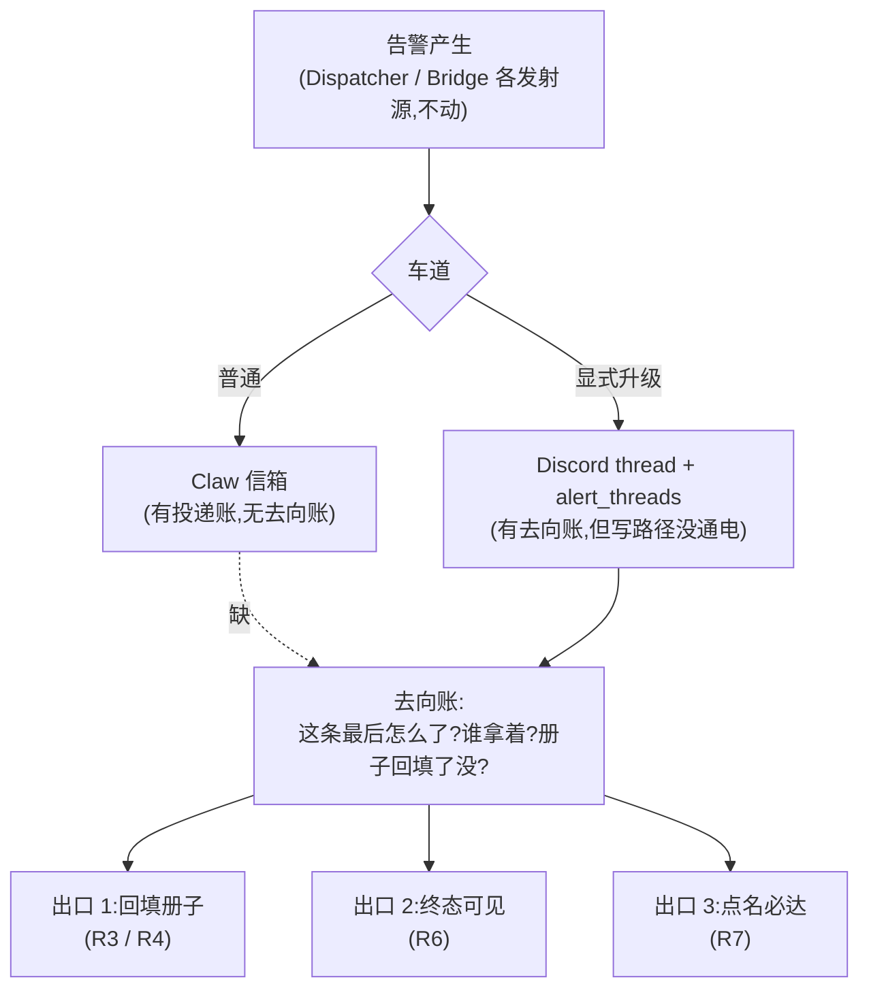

# FLY-2386 值守小版三件收口 — 探索
Issue: FLY-2386 (https://linear.app/geoforge3d/issue/FLY-2386/alerts值守小版-2073-收口后还在咬的-3-件判理册解法册沉淀-每件事有闭环终点-被-的人分档prd-2060)
日期: 2026-09-06
基于: 无

## 0. 一句话

2073 三张单把「席位、册子骨架、告警主管道」都立起来了,但生产里**值守写路径从未通电、普通告警车道没有账本、Lead 信箱被未点名的告警灌满** —— 三件「还在咬」的事,根子是同一个:告警只有「投递」没有「去向账」。本单补的就是这本去向账,以及挂在它上面的三个出口(回填册子、终态可见、点名必达)。

## 1. 审计:2073 合入后生产到底长什么样(全部实测,2026-09-06)

### 1.1 两条车道,只有一条有账本

FLY-2075 v9(founder 裁定)把告警切成两条车道:

| 车道 | 谁进 | 落在哪 | 有没有 thread | 有没有账本 | 2076 的 ack/handoff/resolve 管不管 |
|---|---|---|---|---|---|
| **A 普通告警** | 除显式升级外的一切 kind(含 9 种 informational) | Claw 的 durable 信箱(`comm.db` `mailbox`,`source_kind='infra_alert'`) | 无 | **无**(不写 `alert_threads`) | **不管**(`outstanding` 只读 `alert_threads`) |
| **B 显式升级** | `workflow_engine_escalation`(带 founder id)/ payload 自带合法 `mentionUserId` | `#flywheel-alerts` 根消息 → thread → `alert_threads` | 有 | 有(`ticket_status` / `acked_at` / `owner_ref` / `resolved_at`) | 管 |

2075 的计划里明写了这条接缝:「FLY-2076 T1 必须读取 Claw mailbox 的 durable `source_kind='infra_alert'` 行;若只读 `alert_threads`,普通告警会全部漏掉」。2076 最终只读了 `alert_threads`。⇒ **车道 A 的每一条告警,今天在制度上没有「去向」这个概念**:信箱行的状态只有 `QUEUED / LEASED / ACKED / DEAD`,`ACKED` 的意思是「已送进 Claw 的 pane」,不是「处理完了」。

近 10 天(08-27 起)车道 A 的量:

| 收件人 | 封数 | 主要 kind |
|---|---|---|
| `claude-infra-bot-lead` | 671 | zombie_session_backlog 182 · orphan_pane 130 · review_advisory_pass 121 · external_merge_suspect 69 · cmux_watcher_stalled 65 · bridge_abnormal_exit 65 |
| `flywheel-eng-lead` | **710** | workflow_engine_escalation **657** · review_job_failed 51 · flag_scan_* 2 |
| `flywheel-cos-lead` / `flywheel-product-lead` | 18 / 10 | workflow_engine_escalation |

每封信一个 `collapse_key`,一个 `source_ref`;**没有任何 episode 归并**(1409 封 = 1409 个 key)。

### 1.2 车道 B 的账本:170 行全 NEW,值守写路径没通电

`alert_threads` 08-27 之后 170 行:`ticket_status=NEW` 170,`acked_at` 非空 **0**,`resolved_at` 非空 **0**,`owner_ref` 全是 `infra_bot:claude`。09-01 后 123 条是 `workflow_engine_escalation`。

原因链(逐环实测):

1. `~/.flywheel/.env` 与 Bridge 的 launchd plist 里都**没有** `FLYWHEEL_ALERT_DUTY_TOKEN`。
2. 2076 的 `lead-duty-provision.sh` 在 token 未设时按合同 `gate=skipped:no_duty_token`,**不翻门控**。
3. Claw 的 `~/.claude/channels/discord-claude-infra-bot-lead/access.json` 里告警频道那组仍是 `requireMention:true, allowFrom:[]` —— 与 2 一致。
4. `/duty/*` 在 token 未配置时返回 503 `alert_duty_unconfigured` ⇒ Claw 角色文件要求的启动 `alert-ticket outstanding` 从上线起一直失败(退出码 5),角色文件没有对这个失败的处置规则,于是**静默**。

> 未证到:Bridge 启动横幅 `[Bridge] FLY-2076 alert duty token=unset` 那一行我没在 `/tmp/flywheel-bridge.log` 里找到(日志可能已轮转)。上面 1-3 是文件级证据,4 是代码合同,足以下结论;横幅留给实现 / QA 节点补。

⇒ **2076 交付的机器在生产是暗的。** 这不是本单要修的 bug(它是一条 `.env` 配置),但本单所有设计都建在它之上,所以它是本单的**上线前置**,并且本单要加一条负向守卫让「值守写路径未配置」**不能再静默**。

### 1.3 册子:骨架在,回填机制是零

* `doc/oncall/` 有 README、contact book(99 类)、模板、三页底稿(2077)。
* Claw 角色文件承诺 ① 解决后把草稿追加到 `$FLYWHEEL_STATE_DIR/oncall-drafts/<kind>.md`,「FLY-2077 会把草稿收进仓库」。
* 实测:`~/.flywheel/oncall-drafts/` **不存在**;2077 的计划与里程碑里**没有任何收割步骤**;仓库里没有读该目录的代码或命令。
* 2076 D2「runbook 草稿两步走(不给 Claw git 写权)」只定义了第一步。
* contact book 的回填(③ 兜底后 Tadashi 查明该找谁)**没有任何载体**:handoff 只写 `owner_ref`,不区分「册上有」和「册上无」,事后无法知道哪些 ③ 欠回填。

### 1.4 被 @ 分档:两头都不成立

| PRD R7 要求 | 生产现状 |
|---|---|
| 不被 @ 收不到 | Tadashi 10 天 710 封告警信;657 封来自 `plugin.ts` 三处 `enqueueInfraAlert(payload.leadId, …)` 直投(delivery-contract 无 runId 的升级、workflow source fallback、resident receiver stalled),**绕过 Claw 初审**,也没有任何 @ 语义 |
| 被 @ 必达 | Claw `handoff --to X` 只写 `owner_ref` + 重渲染 🎫 行 + 在 thread 发一帖 `<@X>`;**没有一个 Lead 的 Discord 插件订阅了告警频道**(19 份 access.json 无一有该组),所以 thread 里的 `<@X>` 没有任何机器收得到;车道 A 连 thread 都没有 |

FLY-2078(R7 原单)已 Canceled,仓库里零引用。

### 1.5 看板 / 巡检报告:不存在

仓库里 `alert_threads` 的非测试消费者只有 StateStore、duty 路由、Hub、rescue-runtime;`infra_alert` 的消费者只有 mailbox 格式化与 inbox runtime。没有任何按「终态」列告警的读面;Claw 的 `#flywheel-notify` digest 也不含告警终态。

## 2. 问题重述:三件事其实是一件事的三个出口

* 没有去向账,就没法回填(不知道哪次处置产生了哪条条目);
* 没有去向账,就没有终态(信箱 ACKED ≠ 解决);
* 没有去向账,「被 @」就只是 thread 里一段没人订阅的文字。

## 3. 方案空间

### 3.1 去向账放哪(核心决策)

| 方案 | 做法 | 优点 | 缺点 | 判 |
|---|---|---|---|---|
| **S1 新表 `alert_mailbox_ledger`**(车道 A 的 `alert_threads` 同构表) | Bridge 在给 Claw 投信的同时写一行(correlation_key 为主键、event_id 为当前 episode、`ticket_status / acked_at / owner_ref / resolved_at` 与 `alert_threads` **同一套词汇**);duty API 按 lane 分发到两张表 | 与 2076 合同零冲突;既有 Hub / ARC / rescue 的消费者一行不碰(它们只读 `alert_threads`);词汇只有一套,事实各只在一处 | 多一张表;两张表要靠同一个 StateStore 方法族保持词汇一致 | **选** |
| S2 把车道 A 也写进 `alert_threads` | 放宽 `thread_id / channel_id NOT NULL`,加 `lane` 列 | 一张表、`outstanding` 零改动 | 需要表重建迁移;Hub reconcile / ARC / rescue-runtime 全部遍历活跃行的循环都得学会跳过 lane=mailbox,隐藏消费者多、爆炸半径大 | 否 |
| S3 用信箱行自己的 `resolved_at / resolved_via` 当去向 | Claw 处置后写回 CommDB | 零新表 | 信箱是投递账(每封信一行、可清理、`ACKED` 已另有含义);去向要按 correlation key 归并而不是按封;两个 DB 两套语义搅在一起;回填欠账没有家 | 否 |
| S4 只做 Discord 侧(车道 A 也开 thread) | 回到 2075 v3–v8 的「只发 Discord」 | 一条车道一本账 | founder 2026-08-26 已裁「普通告警不进 Discord」;推翻裁定不在本单 | 否 |

### 3.2 「一件事」的粒度

信箱里 1409 封 = 1409 个 key,按封处置不现实;但 **按 correlation key(`project|lead|kind|session`)归并 + episode 递进**是 `alert_threads` 已经在用的身份规则(同 key 新 event 覆盖旧 episode)。车道 A 沿用同一规则:这是「同一个问题又响了」的**身份**判断,不是「这条是不是噪音」的判断(后者是第 2 层,本单不碰)。实测 `zombie_session_backlog` 182 封 → 1 个 key(无 session);`workflow_engine_escalation` 按 issue 的 session key 归并成十几个 key。

### 3.3 回填怎么从「承诺」变成「机制」

| 方案 | 判 |
|---|---|
| Claw 直接开 PR | 违反 D2(不给 Claw git 写权),否 |
| Bridge 自动开 PR | 新能力、新凭据面,与「小单」不符,否 |
| **草稿文件 + 一条命令收割 + 欠账上看板** | 草稿是处置的一部分(`resolve` 不带草稿就不成立);`flywheel-comm oncall-draft harvest` 把草稿确定性地写进 `doc/oncall/`,commit / PR 由跑它的人(Tadashi 或他派的 runner)负责;未收割的草稿在看板上是「册子欠账」。**选** |

contact book 的回填由 ③ 兜底触发:handoff 带 `--reason no_entry` ⇒ 看板上该 kind 标「兜底未回填」,直到有同 kind 的 contact-book 草稿被收割。

### 3.4 「被 @」到底是什么

| 候选 | 判 |
|---|---|
| Discord 真 @(FLY-898 那套:给每个 Lead 的告警组 `requireMention:true, mentionPatterns:[]`) | 要给 19 个 Lead 补告警频道订阅 + bot 入频道;车道 A 没有 thread 可以 @;2076 自己的门控翻转在生产都没生效。作为**送达机制**否;作为**人可读留痕**保留 |
| **一封 handoff 信**(Bridge 在 `handoff` 事务里给目标 Lead 投一封 `source_kind='infra_alert'`、内容头 `[alert_handoff]` 的信,deliveryId 按 `(lane, key, event, to)` 幂等) | 走既有 durable 信箱 → nudge → pane;有 QUEUED/ACKED/DEAD 三态可核;529 房两 Lead 对照可验。**选** |

「不被 @ 收不到」= 三处直投改投 Claw 队列;Lead 只收两类:Claw 的 handoff 信,以及合同上已声明 owner 的 kind(`review_job_failed` 归 issue owner、`flag_scan_*` 归旗标扫描 owner)—— 这两类的 `to_agent` 本身就是点名。

## 4. 选定方向(给 research / plan 的输入)

1. **去向账**:新表 `alert_mailbox_ledger`,与 `alert_threads` 同一套生命周期词汇;Bridge 投信时写入;duty API/CLI 按 lane 分发;`outstanding` 合并两条车道。
2. **回填**:`resolve` 必带 runbook 草稿;`handoff --reason no_entry` 标记兜底;`flywheel-comm oncall-draft add | list | harvest`;通用写法守卫(拒绝本机路径 / 账号 / snowflake / 凭据字样)。
3. **终态**:`GET /duty/alert-board` + `alert-ticket board`:每个 key 一行,四档 `未初审 / 值守处理中 / 已转出(信的送达态) / 已解决`,外加册子欠账与 duty 写路径配置态;Claw digest 一行指向它。
4. **分档**:三处直投改投 Claw;handoff 信必达;点名档白名单显式列出。
5. **上线前置(非代码)**:设 `FLYWHEEL_ALERT_DUTY_TOKEN`、重启 Claw、核 `[alert-duty] gate=changed`;席位探针 `/api/alert-duty/seat` 增 `dutyWritePath`,Claw 角色文件对 503 加处置规则。

## 5. 不做(边界,与 issue / PRD 一致)

* 不判噪音、不归并「相似」告警(只按既有 correlation key 身份归并)。
* 不设计 Infra bot 本身。
* 不动 Dispatcher / 各发射源 / D1 Router 的分类表;只改三处直投的**收件人**。
* 不加指标、考核、阈值、hard limit、全局 QA 门;看板上的数字是清单计数,不是目标。
* 不给 Lead 补 Discord 告警频道订阅。
* 不修 `workflow_engine_escalation` 每 15 分钟重发的源头(R8 根因线:另开单,见 §6)。

## 6. 待拍板 / 已问 Lead(非阻塞)

| # | 问题 | 我的假设 |
|---|---|---|
| Q1 | duty token 未设是否已知 / 已在处理 | 列为上线前置;设计加负向守卫 |
| Q2 | 改三处直投的收件人算不算「动告警转发组件」 | 算 Bridge 内部路由(2075 同层改过),不算 Dispatcher;若 Lead 判越界,退回只做 handoff 必达 |
| Q3 | `workflow_engine_escalation` 无 runId 分支 10 天 685 封(FLY-2366 一单每 15 分钟一封)—— 源头是否要单开 | 本单不修,R8 建议另开单 |
