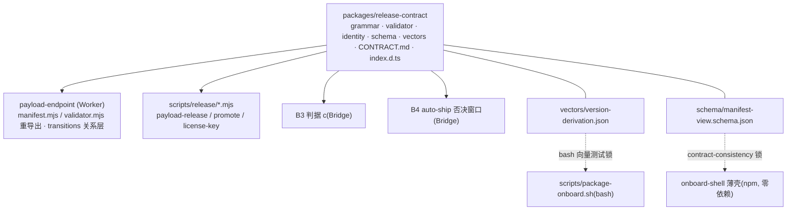

# FLY-2387 先锁合同:版本/channel/manifest — 实施计划

Issue: FLY-2387 (https://linear.app/geoforge3d/issue/FLY-2387/1143b0-先锁合同版本channelmanifestprd-1098-6-规范化版本-72-通道单一真相-73-发布不变量)
日期: 2026-09-06
基于: research.md

> **一句话**:新建零运行时依赖的合同包 `packages/release-contract/`,把版本语法、通道真相、manifest 校验器(形状 + 关系不变量)、§6.2 身份派生收成**一个**真相源;`payload-endpoint` 与 `scripts/release` 改为 import,bash 打包脚本与薄壳客户端由**共享测试向量 / 视图 schema** 锁住;补 9 个缺口(G1–G9,见 exploration §2)并加一条 Codex R1 发现的发布安全 fence(C-6b);写成 `CONTRACT.md` 合同文档 + `index.d.ts` 类型 + JSON Schema + 断言测试。**不新增 workflow、不动 broker/FLY-1323 姿态、不做任何发布动作。**
> **范围红线**:本单只改「合同与其消费者的引用方式」+ 两条合同层加固(C-1b 放宽、C-6b 收紧),不改其他既有断言语义;manifest `schemaVersion` 保持 1;PR2 客户端字节合同零改动。
> **评审记录**:Codex design R1 → CHANGES REQUESTED(8 项,全部接受);R2 → CHANGES REQUESTED(4 项,全部接受);R3 → CHANGES REQUESTED(2 项,全部接受);见 §10。

---

## 0. 全景



## 1. 合同 v1(正文;实施时以此为蓝本写成 `packages/release-contract/CONTRACT.md`,之后以 CONTRACT.md 为准)

### 1.1 版本(PRD §6 / §6.1)

| 项 | 合同 |
|---|---|
| **base** | `X.Y.Z`,每段 `0\|[1-9]\d*`;唯一来源 = `doc/VERSION` 规范化(去空白、去**一个**前导 `v`、然后必须匹配 base 正则,否则 fail-closed)。文件里**不得**出现预发布后缀或 build metadata |
| **payload semver** | `clean = X.Y.Z` 或 `beta = X.Y.Z-beta.N`,`N` 匹配 `[1-9]\d*`(≥1、无前导零)。其余(`rc`、`alpha`、四段、带 `v`、`+meta`、`beta.0`、`beta.01`)一律非法 |
| **派生谓词** | `isDerivationOf(base, ver) ⇔ parsePayloadVersion(ver).base === base` |
| **N 的唯一分配者** | `manifest.releaseLedger[base].nextBetaN`,经 B0-9 预约 CAS;脚本不得自算 N |
| **展示标签** | `toDisplayLabel(semver) = "v" + semver`,仅用于 UI / git tag / 通知;package.json、manifest、对象 key、版本目录一律不带 `v` |
| **clean 永不复用** | `versions` 只增、核心字段不可变(C-3);同一 clean 号换内容 = validator 拒 |
| **同 commit 双身份** | beta 与 clean 来自同一 `sourceCommit`,由 `derivedFromBeta` + lineage(C-6)保证 |

API(`grammar.mjs`,全部纯函数):`BASE_RE`、`CLEAN_SEMVER_RE`、`BETA_SEMVER_RE`、`parsePayloadVersion(v) → {kind:'clean'|'beta', base, betaN|null} | null`、`isCleanSemver`、`isBetaSemver`、`isPayloadSemver`、`baseOf(v)`(非法输入 **抛错**,不再静默返回原串)、`isDerivationOf(base, v)`、`normalizeVersionFile(text) → base`(非法抛错)、`toDisplayLabel(v)`、`payloadObjectKey(ver, sha256)`。

### 1.2 通道(PRD §7.2)

| 项 | 合同 |
|---|---|
| payload 通道真相 | `manifest.channels` 恰好两个指针:`internal-beta`、`customer-release`;指针值 = 一个 `versions` key 或 `null` |
| 固定映射 | `CHANNEL_OF_POINTER = {internal-beta: beta, customer-release: release}`;`ENTITLEMENT_POINTER = {internal: internal-beta, customer: customer-release}`;`POINTER_CAPABILITY = {internal-beta: beta-publish, customer-release: customer-release}` |
| 指针权威 | 客户端/更新器**只**按指针取 latest,不得 max(versions)(withdraw 会让指针后退) |
| beta 不外泄 | `customer` 视图只含 `channel=release ∧ status=active`;对不在可见集的版本 `GET /payload` 逐字节同形 404(现有 handler 规则,§1.7 引用) |
| npm dist-tag | 只描述薄壳 `@flywheel-ai/onboard`:默认 `latest`;版本带预发布后缀时**必须** `--tag next`;dist-tag 永不表达 payload 通道。薄壳版本与 `doc/VERSION` 无关(§7.3-4)。实现断言 = B1 |
| 不用 GitHub Release | 引用 PRD §7.2 |

### 1.3 manifest 合同(供 B1 CAS 切指针 / B4 否决窗口 / B5 更新器)

**两层、一个执行点**:
- **形状层**:`schema/manifest.schema.json`(draft 2020-12,`additionalProperties:false` 全开,key 语法由 `propertyNames.pattern` 锁)是**对外文档与外部消费者的机器可读产物**;运行时不装 ajv,由合同包 `validator.mjs` 内置的零依赖 **exact-key 形状检查**(根、channel、entry、op、ledger 记录的键集合必须逐字等于合同键集合;多一键少一键都拒)执行同一规则。测试断言两者对 `examples/` 与 `examples/invalid/shape/` 的判定**完全一致**(schema ⇔ 运行时形状检查不许漂移);关系层坏例 schema 必过、只由 validator 拒(见下)。
- **关系层**:`validator.mjs validateManifest(m) → string[]`,**迁入合同包并导出**(`payload-endpoint/src/validator.mjs` 只剩兼容重导出);handler 对形状/关系失败一律 422 且 manifest byte-unchanged(现有 `handler.mjs:265-269` 路径)。
- **错误码**:每条 violation 字符串以稳定编号开头 `C-<n>[<字母>]: <path>: <说明>`(如 `C-1: channels[customer-release]: latest 1.55.0 has no entry (dangling)`);测试按编号断言。

| # | 关系不变量 | 现落点 | 本单变更 |
|---|---|---|---|
| C-0 | 形状:exact keys、`schemaVersion===1`、hex/ISO/正整数/枚举类型 | validator 前半 | **新增 exact-key**(G4) |
| C-1 | `channels[ch].latest` 非 null ⇒ 指向存在、`status=active`、channel 匹配的 entry | validator 不变量 1 | 不变 |
| **C-1b** | `channels[ch].latest = null` ⇔ 该 channel **没有 `status=active` 的 entry**。两种子态按 **per-channel** 判定:`never-activated`(该 channel 无任何 entry)/ **`paused`**(有 entry 但全是 quarantined/expired;= PRD §8.2 `updates-paused / no-release-available`)。不得用全局 `isEmptyInitialManifest` 区分(beta-only 时 customer 侧就是 never-activated) | 现为「无任何 entry」 | **放宽**(G6);`isEmptyInitialManifest` 语义不变 |
| C-2 | `versions[v].key === payloadObjectKey(v, sha256)` | 不变量 2 | import 合同包 |
| C-3 | entry 只增不删;核心字段(`sha256,key,size,channel,sourceCommit,releaseId,derivedFromBeta`)不可变;`status` 单向 `active→quarantined→expired` / `active→expired`;时间戳 server-owned | transitions | 不变 |
| C-4 | `releaseLedger[base].nextBetaN` 整数 ≥1、单调不减(允许空洞);递增只能与同 CAS 的 beta 预约融合 | 不变量 4 + transitions | 不变 |
| C-5 | pointer-tenure:是 latest ⇒ `retentionSince=null`;active 非 latest ⇒ 非 null | 不变量 5 | 不变 |
| C-6 | lineage(静态):`channel=release` ⇒ `derivedFromBeta` 存在、是 beta、`baseOf(derivedFromBeta)===ver`、`sourceCommit` 逐字相等 | 不变量 6 | 不变 |
| **C-6b** | lineage(**mutation-time fence**,Codex R1#1):`addVersion(channel=release)` 与 `commitOp(kind=release)` 发生的那次 CAS,在**结果 manifest** 里 `derivedFromBeta` 的 entry 必须 `status=active`;否则整次 transition 拒绝(422),customer pointer / op byte-unchanged。静态层不能要求(beta 14 天后合法 expire、release 仍活 28 天),所以只在 transition 层做。客户端(B1 commit 的 mutate 回调)在**每次 CAS retry 的当前 manifest** 上按 op 状态分两条路(Codex R2#1,与 §7.3-3 幂等相容):**(a) op 为 `prepared`** → 重新 `deriveVetoBinding`(要求 beta active)后才写 mutation;**(b) op 已 `committed`**(并发执行者先提交、或冷启动重跑时已提交)→ 不重派生、不要求 beta active;B1 只有两参数输入,所以只核 `releaseId` 存在 ∧ `kind=release` ∧ `op.sha256 === expectedSha256`,一致 = 幂等成功且零写入,不一致 = fail-closed;committed op 的其余身份由 C-6/C-7 不可变关系担保,**完整双身份(`VetoBinding`)的核对属于 B4 在调用 commit 之前**(用 Bridge 决策记录对当前 manifest 重派生比对),不在 B1 的 commit 回调里;其他状态 = 停。`payload-promote.mjs commit` 接口保持 `{releaseId, expectedSha256}` 零改。单靠窗口关闭前的一次预检不算 fence | 无(可达 TOCTOU:先 quarantine 非 latest 候选 beta,再 commit 由它派生的 clean,现代码全部放行) | **新增** |
| C-7 | `releaseOps` ↔ `versions` 互指:entry.releaseId 唯一且对应 `state=committed`;committed 必有 entry;tuple 逐字相等;state 单向 `reserved→prepared→committed\|abandoned`,`reserved→abandoned` 合法;**op 身份字段 `kind/ver/betaVersion` 一经写入不可变;tuple `sourceCommit/sha256/objectKey` 只能在 `reserved` 态 write-once(null→值),之后不可变;`prepared`/`committed` 必须携带完整 tuple** | 不变量 7 + `transitions.mjs:121-137` | 文档补齐(Codex R1#2) |
| C-8 | tombstone 集合语义;只允许被终态记录引用;追加后禁一切新引用 | 不变量 8 | 不变 |
| C-9 | 版本 key 与 `channel` 形状一致:beta entry 必是 `X.Y.Z-beta.N`,release entry 必是 `X.Y.Z`(按 1.1 收紧后的正则) | validator | 正则来自合同包(G1) |
| C-10 | `schemaVersion === 1`;本单所有变更向后兼容;出现不兼容字段时升 2 并在 CONTRACT.md 写迁移规则 | validator | 文档化 |

**完整合法示例**(= `examples/release-committed.json`;下方代码块使用与 fixture 完全相同的真实测试值;测试从 CONTRACT.md 提取该代码块、`JSON.parse` 后与 fixture **语义相等**(deepEqual),必须同时通过 schema + validator):

```json
{ "schemaVersion": 1,
  "channels": { "internal-beta": { "latest": "1.55.0-beta.2" }, "customer-release": { "latest": "1.55.0" } },
  "versions": {
    "1.55.0-beta.2": { "sha256": "924356fadf749ede33bb35b16abe7c61a066352073d5a464d245cedf93b28367", "key": "payloads/1.55.0-beta.2/924356fadf749ede33bb35b16abe7c61a066352073d5a464d245cedf93b28367.tgz", "size": 1234,
      "publishedAt": "2026-09-01T00:00:00.000Z", "channel": "beta", "status": "active", "sourceCommit": "95400c4f1a7161ab32e84a5107befe5a0c78e7f3",
      "releaseId": "beta-95400c4f1a7161ab32e84a5107befe5a0c78e7f3", "derivedFromBeta": null, "retentionSince": null, "quarantinedAt": null },
    "1.55.0": { "sha256": "9544ebb90c27a285f59a03f3af5fe8bfeb04cea01b3f3ac6673542f29f43d541", "key": "payloads/1.55.0/9544ebb90c27a285f59a03f3af5fe8bfeb04cea01b3f3ac6673542f29f43d541.tgz", "size": 1234,
      "publishedAt": "2026-09-03T00:00:00.000Z", "channel": "release", "status": "active", "sourceCommit": "95400c4f1a7161ab32e84a5107befe5a0c78e7f3",
      "releaseId": "promo-1", "derivedFromBeta": "1.55.0-beta.2", "retentionSince": null, "quarantinedAt": null } },
  "releaseOps": {
    "beta-95400c4f1a7161ab32e84a5107befe5a0c78e7f3": { "kind": "beta", "state": "committed", "ver": "1.55.0-beta.2", "betaVersion": null,
      "sourceCommit": "95400c4f1a7161ab32e84a5107befe5a0c78e7f3", "sha256": "924356fadf749ede33bb35b16abe7c61a066352073d5a464d245cedf93b28367", "objectKey": "payloads/1.55.0-beta.2/924356fadf749ede33bb35b16abe7c61a066352073d5a464d245cedf93b28367.tgz", "createdAt": "2026-09-01T00:00:00.000Z" },
    "promo-1": { "kind": "release", "state": "committed", "ver": "1.55.0", "betaVersion": "1.55.0-beta.2",
      "sourceCommit": "95400c4f1a7161ab32e84a5107befe5a0c78e7f3", "sha256": "9544ebb90c27a285f59a03f3af5fe8bfeb04cea01b3f3ac6673542f29f43d541", "objectKey": "payloads/1.55.0/9544ebb90c27a285f59a03f3af5fe8bfeb04cea01b3f3ac6673542f29f43d541.tgz", "createdAt": "2026-09-03T00:00:00.000Z" } },
  "releaseLedger": { "1.55.0": { "nextBetaN": 3 } },
  "tombstones": [] }
```
(十六进制值 = 测试常量:sourceCommit = sha1("FLY-2387 fixture commit"),两个 sha256 = sha256("FLY-2387 fixture beta payload" / "… release payload");fixture 与文档共用同一组值,唯一真相 = fixture 文件。)

**示例集**(`examples/`,全部必须过 schema + validator):`empty.json`、`beta-only.json`(customer 侧 never-activated)、`release-committed.json`(上)、`withdraw-fallback.json`(A→B→withdraw B 回 A,A `retentionSince=null`)、`paused.json`(唯一 release 被 quarantine,`customer-release.latest=null`)、`prepared-candidate.json`(B4 输入态)。**坏例集分两层**(Codex R2#2):`examples/invalid/shape/`(违反 C-0 形状规则:多键/少键/类型错/key 语法错)—— 要求 **schema 与运行时 C-0 判定等价**(两者都拒);`examples/invalid/relations/`(键与类型全合法、恰好违反一条 C-1…C-9 静态关系)—— 要求 **schema 通过、`validateManifest` 恰好以目标 C-n 拒绝**。transition-only 规则(C-3 不可变、C-4 融合递增、C-6b、C-7 状态机)不进静态坏例集,由端点 `lifecycle` 测试覆盖。

**paused 态 wire**:`GET /manifest` → HTTP 503,body **逐字** `{"error":"no-release-available"}`(该 entitlement 的 channel 有 entry 但无 active);never-activated 保持逐字 `{"error":"not activated"}`;客户端现行为不变(非 2xx = 网络类错误),客户可见话术映射 = B5。paused 期间 `license-key issue` 对该 entitlement 拒发(现有前置检查)。

### 1.4 两个身份 + veto 绑定(PRD §6.2;`identity.mjs`)

| 类型 | 字段 | 派生规则(fail-closed,全部抛错而非返回 null) |
|---|---|---|
| `BetaCandidate` | `baseVersion, betaN, betaVersion, sourceCommit, betaPayloadSha256` | `deriveBetaCandidate(m, betaVersion)`:entry 存在 ∧ `channel=beta` ∧ `status=active` |
| `ReleaseArtifact` | `releaseId, releaseVersion, sourceCommit, releasePayloadSha256, objectKey` | `deriveReleaseArtifact(m, releaseId)`:op 存在 ∧ `kind=release` ∧ `state=prepared` ∧ tuple 三字段非 null ∧ `objectKey===payloadObjectKey(ver, sha256)` |
| `VetoBinding` | **两个身份都在**:`releaseId, betaVersion, betaPayloadSha256, releaseVersion, releasePayloadSha256, sourceCommit` | `deriveVetoBinding(m, releaseId)` = 上两者 join;断言 `op.betaVersion` 的 beta entry active、`baseOf(betaVersion)===releaseVersion`、两侧 `sourceCommit` 逐字相等;每个字段逐字来自 manifest,不做任何推断 |

约定:B4 的决策记录(who/when/触发方式)存 Bridge 侧账本,键 `releaseId`,内容含完整 `VetoBinding`;**不**镜像进 manifest。commit 时 B4 先用决策记录里的 `VetoBinding` 对**当前** manifest 重派生并逐字比对(不一致 = hold),再把 `releasePayloadSha256` 原样传给 `payload-promote.mjs commit --expected-sha256`(现有接口,零改);commit 回调内部按 C-6b 的 (a)/(b) 两条路处理(prepared 重派生并核 `releasePayloadSha256===expectedSha256`;committed 只核 releaseId/kind/sha256)。窗口内候选变 quarantined ⇒ 派生抛错 ⇒ B4 判 `hold`,不重开窗口(PRD §5.2);即便窗口预检已过、最终 CAS 前才被 quarantine,C-6b 服务端仍拒绝。

### 1.5 PRD §7.3 七条不变量 → 机器断言

| §7.3 | 合同谓词 | 现有测试 | 本单新增负例 | owner |
|---|---|---|---|---|
| 1 immutable key + 回读验 hash | `PUT` 已存在→409;readback 流式复验 | `handler-admin`、pipeline R2 | — | 已落 |
| 2 manifest 唯一 commit point,CAS | `POST /admin/manifest {baseEtag}` 412 冲突;失败=未发布 | `handler-admin` | — | 已落 |
| 3 releaseId 幂等 + 单飞 | C-7 状态机 + `concurrency: payload-release` | pipeline R1/R2a;结构 S2 | — | 已落 |
| 4 薄壳独立发布 | 壳版本不派生自 `doc/VERSION`;预发布版 ⇒ `--tag next` | preflight | 结构断言「shell-prepare / preflight 不读 doc/VERSION」 | B0(断言)/ B1(dist-tag) |
| 5 客户端版本目录、不互相覆盖、自更新单飞 | PR2 已落;单飞 | `onboard-shell-install` | — | B5(单飞) |
| 6 clean semver 永不复用 | C-3 只增不删 + 核心字段不可变 | `lifecycle` | 具名负例:同一 clean 号、不同 sha 再次 addVersion → 拒;expired 的 clean entry 改 sha → 拒 | B0 |
| 7 staging 清理 | B0-10 三步 + sweep | `payload-key-cleanup` | — | 已落 |

### 1.6 REQ-0 对照(PRD §2.1;§2.2 ship 段只引用 FLY-1063)

「授权源 / 触发器与守卫 / 代码来源前置」三者分开写(Codex R1#7):merge 到 main 在 FLY-1323 姿态下是薄壳与 beta 的**授权与代码来源**前置,**不是触发器**,也不读 🆒 / ship 账本;customer promote 的授权只来自 B4。

| 动作 | 门 | 授权源 | 触发器 + 守卫(实码) | 执行面 | 机器断言 | 违反项 |
|---|---|---|---|---|---|---|
| merge 到 main | ship | Discord 🆒(FLY-1063 Option B) | `issue_comment` 🆒 → cool-ship-gate | `ship-on-comment.yml` | 结构 S1/S4:ship 路径零 payload capability / vendor 凭据 | 无 |
| 薄壳 npm publish | release(壳) | FLY-1323:main 上的代码 + Environment `release`(merge = 授权与来源前置) | `workflow_dispatch` + `confirm=ACTIVATE` + `mode=publish` + main-only ref guard + `environment: release` | `payload-activation.yml` | S4c:npm 凭据只在 release-env workflow | 无 |
| beta 发布(`internal-beta` 前进) | release(内部) | FLY-1323:main 上的代码即授权;无人工门 | `schedule`(6h)+ `workflow_dispatch`;pre-activation guard;main-only | `payload-beta-release.yml` | 只持 `beta-publish`;`capabilityAllows` 拒其切 `customer-release` | 无 |
| promote prepare | release | 无人工门(可重跑/放弃) | `workflow_dispatch` + main-only dispatch guard | `payload-promote.yml` | 不切指针(op 停在 prepared) | 无 |
| **promote commit(切 `customer-release`)** | release(对外) | **B4 否决窗口沉默 / founder 显式 go**;不是 🆒,不是 merge,不读 ship 账本 | 今天不存在;B1 落 | B1 | 输入只有 `{releaseId, expectedSha256}`;零构建;C-6b;S4b 届时由 B1 显式重谈 | 无(今天不存在 commit workflow,不违反) |
| withdraw / paused | release(止血) | `customer-release` 能力持有者 | B5 | B5 | 同一 CAS 内摘指针 + 重钉 fallback 或进 paused(C-1b) | 无 |
| 三个 payload workflow 触发器 | — | — | 结构断言 **S13**(进现有 parsed-YAML 块):解析三份 workflow 的真实 trigger set,分别锁 `beta ⊆ {schedule, workflow_dispatch}`、`promote = {workflow_dispatch}`、`activation = {workflow_dispatch}` 且 `confirm` 输入存在;三者零 `push`/`pull_request`(release 绝不是 merge 副作用) | — | S13 | 无 |

### 1.7 客户视图 wire(B5 读取面,字节合同)
`GET /manifest`(Bearer `fwk_…`)→ `{ latest: string, versions: [{ver, sha256}] }`(`manifest-view.schema.json`,`additionalProperties:false`);排序按字符串升序(现行为);`GET /payload/<ver>` 只对可见集放行。**v1 wire 冻结**:200 响应没有版本字段,不能靠底层 manifest `schemaVersion` 升级在原路由就地扩字段;演进只能走**新路由或显式版本化协议**(B5 若需更多字段,开 `/v2/manifest` 并保留 v1)。

## 2. 代码结构

```
packages/release-contract/
  package.json        name flywheel-release-contract · private · type module · main src/index.mjs · types index.d.ts
                      devDependencies: ajv 8.17.1(仅测试)、typescript(仓库现有版本,仅 types 测试);dependencies: 无
  CONTRACT.md         以本 plan §1 为蓝本写成合同正文(唯一合同真相;plan 若与它不一致以它为准并回改 plan);示例代码块与 examples/ 同值,测试锁语义相等
  index.d.ts          手写类型:Manifest / VersionEntry / ReleaseOp(reserved tuple 可 null 的 union)/ Channel / Entitlement /
                      BetaCandidate / ReleaseArtifact / VetoBinding + 函数签名
  src/index.mjs       re-export grammar + validator + identity + constants + emptyManifest/latestSet
  src/grammar.mjs     §1.1 / §1.2 常量与纯函数(从 payload-endpoint/src/manifest.mjs 迁入并收紧)
  src/validator.mjs   从 payload-endpoint 迁入;新增 C-0 exact-key 形状检查、C-1b、错误码前缀
  src/identity.mjs    §1.4
  schema/manifest.schema.json · schema/manifest-view.schema.json
  examples/*.json · examples/invalid/shape/*.json · examples/invalid/relations/*.json
  vectors/version-derivation.json   [{input, base?, expect: {clean|beta|invalid, base, betaN}}]
  __tests__/grammar.test.mjs · validator.test.mjs · identity.test.mjs · schema.test.mjs · consumers-lint.test.mjs
  __tests__/types.fixture.ts        tsc --noEmit 合同夹具(empty/reserved/prepared/committed/paused 字面量、identity 返回值、@ts-expect-error 负例)
scripts/__tests__/release-contract-vectors.test.sh   bash 打包脚本 vs 同一向量文件(jq)
```

`payload-endpoint/src/manifest.mjs`、`validator.mjs` 保留文件名,内容变为 `export * from "flywheel-release-contract"`(+ 端点私有的 `MANIFEST_KEY`/`KEY_PREFIX`/`keyObjectKey`);`transitions.mjs` 留在端点(它是端点的写路径分类器,不是合同),但 C-6b 在其中实现并由合同文档编号。

## 3. 消费者改造清单(只改引用,不改行为;例外 = C-1b / C-6b / 503 body)

| 文件 | 行 | 改动 |
|---|---|---|
| `pnpm-lock.yaml` | importers | 新 workspace 包、endpoint 的 `workspace:*`、ajv/typescript devDeps 同步进 lockfile(否则 CI 与 activation 的 `--frozen-lockfile` 直接失败) |
| `packages/payload-endpoint/package.json` | — | `dependencies: {"flywheel-release-contract": "workspace:*"}`;注释说明「零 flywheel-* 依赖」放宽为「仅允许零依赖合同包」 |
| `packages/payload-endpoint/src/manifest.mjs` / `validator.mjs` | 全文 | 重导出(§2) |
| `packages/payload-endpoint/src/transitions.mjs` | `:267-270`;`addVersion`/`commitOp` 分类处 | 用 `POINTER_CAPABILITY`;**C-6b fence** |
| `packages/payload-endpoint/src/views.mjs` | `:23-25` | 用 `ENTITLEMENT_POINTER`;`manifestView` 返回 `{empty:true, reason:'never-activated'\|'paused'}`(per-channel 判定) |
| `packages/payload-endpoint/src/handler.mjs` | `:144-147`, `:454-457` | 用 `ENTITLEMENT_POINTER`;503 body 按 reason 区分 |
| `packages/payload-endpoint/__tests__/validator.test.mjs` | `:13-20` | 迁到合同包测试;改成 C-1b 语义(null + active entry → 拒;null + 仅 quarantined/expired → 合法) |
| `packages/payload-endpoint/__tests__/handler-customer.test.mjs` | `:314-353` | 断言 503 **body 逐字**;新增 paused 场景(见 §5-6) |
| `packages/payload-endpoint/__tests__/lifecycle.test.mjs` | 末尾 | C-6b barrier 负例 + §7.3-6 两条具名负例 |
| `scripts/release/lib/endpoint-client.mjs` | `:157-163` | 删 `payloadKeyOf`/`baseOf`,改 import(`payloadKeyOf` 名保留为别名以免改动调用点) |
| `scripts/release/payload-release.mjs` / `payload-promote.mjs` / `license-key.mjs` | 字面量处 | 通道名改常量 |
| `.github/workflows/payload-activation.yml` | `:205-213` heredoc | 在现有 `node --input-type=module` heredoc 内 `import { emptyManifest } from "./packages/release-contract/src/index.mjs"` 并 `const manifest = emptyManifest()`;删内联对象 |
| `scripts/package-onboard.sh` | `:165-181` | `po_version`:规范化后断言 base 正则(G7);`po_version_is_derivation`:先断言 base 是 clean,N 用 `^[1-9][0-9]*$` |
| `.github/workflows/ci.yml` | `:1200-1205` 注释;`:1228` 同 step;bash 枚举;新 step | 注释去掉「zero wrangler」;追加 `node --test packages/release-contract/__tests__/*.test.mjs`;枚举 `bash scripts/__tests__/release-contract-vectors.test.sh`;新增 step `pnpm exec tsc --noEmit -p packages/release-contract/__tests__/tsconfig.json`;新增 step `pnpm exec wrangler deploy --dry-run --outdir $RUNNER_TEMP/wk --metafile $RUNNER_TEMP/wk/meta.json --config packages/payload-endpoint/wrangler.toml` 并断言 metafile `inputs` 的每个 key **相对 wrangler config 所在目录解析**为仓库相对路径后,至少一个位于 `packages/release-contract/src/` 下(实测 key 形如 `../release-contract/src/index.mjs`,不能直接匹配 repo-root 前缀;也不 grep 包名,esbuild 会消掉 bare specifier) |
| `scripts/__tests__/release-workflows-structure.test.sh` | parsed-YAML 块 | 新增 **S13**(触发器集合,§1.6 末行) |

## 4. 迁移与回滚边界

- **数据迁移:无。** manifest 形状不变,`schemaVersion` 仍 1;语义变化两条:C-1b 放宽、C-6b 收紧(只影响新的 release commit)。收紧的语法与 exact-key 只影响**新写入**;B1 激活前置项:用合同包(自包含,`validateManifest` + schema 测试同一份代码)对生产 manifest 快照跑一次(预期为空 manifest,通过)。
- **回滚**:还原 PR 即可;manifest 字节不动;三个 workflow 行为不变(activation heredoc 的 `emptyManifest()` 输出与旧内联对象逐字相同,测试锁)。
- **不可回滚项:无**(本单零发布动作、零凭据动作)。

## 5. 测试策略(TDD:先红后绿)

RED 起点清单(每条先写测试看它红):
1. `grammar.test.mjs`:向量文件逐条(含 §1.1 收紧的 6 个负例);`baseOf("1.2.3-rc.1")` 抛错;`normalizeVersionFile("v1.56.0\n")==="1.56.0"`,`"v1.56.0-beta.2"` 抛错。
2. `release-contract-vectors.test.sh`:同一向量文件喂 `po_version_is_derivation` 与 `po_version`(fixture VERSION 文件),期望与 mjs 完全一致。**注意**:本 worktree 无 `node_modules`,`package-onboard-version-injection.test.sh` 在此不能运行;实现节点先 `pnpm install` 再跑,不得把「没跑」记为绿。
3. `schema.test.mjs`:`examples/*.json` 全过 schema **且** 过 `validateManifest`;`invalid/shape/*` 被 schema 与 C-0 一致拒绝;`invalid/relations/*` 过 schema、被 validator 恰好以目标 C-n 拒绝;`emptyManifest()` 过 schema;客户视图示例过 `manifest-view.schema.json`,多一个字段即拒;从 CONTRACT.md 提取的示例代码块 `JSON.parse` 后与 `examples/release-committed.json` deepEqual。
4. `validator.test.mjs`(合同包):C-0 exact-key(根/entry/op 各多一键 → 拒)、C-1b 三态(null+active → 拒;null+仅 quarantined → 合法;null+无 entry → 合法)。
5. `identity.test.mjs`:拒绝集(op 不存在 / kind=beta / state≠prepared / tuple 缺 / objectKey 不匹配 / beta quarantined / beta expired / base mismatch / sourceCommit 不等)+ 成功例断言 `VetoBinding` 每个字段逐字来自 manifest(含 `betaPayloadSha256`)。
6. 端点:`lifecycle` C-6b barrier(prepared release op 存在 → 同 CAS 或前一 CAS quarantine 其 beta → commit transition 被拒、pointer/op byte-unchanged;先 commit 再 quarantine beta → 合法);pipeline 竞态与冷幂等:初读 prepared → 另一执行者 commit 同一 sha → 当前 CAS retry 看到 committed → 幂等成功且零写入;committed 的 sha ≠ expectedSha256 → fail-closed;**冷启动**:进程启动时 op 已 committed 且其 beta 已合法 expire → 只凭 `{releaseId, expectedSha256}` 幂等成功、零写入、不查 beta active;`handler-customer` paused 场景:在**一次** customer-release 能力 CAS 里 quarantine 唯一 release 并把指针置 null → manifest 合法、两个 server-owned 时间戳已盖、customer `/manifest` 逐字 `{"error":"no-release-available"}`、`license-key issue customer` 拒发;beta-only 时 customer 侧逐字 `{"error":"not activated"}`。
7. `consumers-lint.test.mjs`:扫 `packages/payload-endpoint/src`、`scripts/release` 非注释行,通道名字面量 / `-beta\.` 正则字面量只允许出现在合同包。
8. `types.fixture.ts` + `tsc --noEmit`:五态字面量能赋给 `Manifest`;`deriveVetoBinding` 返回类型含两个身份;`@ts-expect-error`:reserved op 缺 tuple 赋给 prepared 类型、`channels` 多一键、`status: "paused"`。
9. 结构:S13;`lifecycle` §7.3-6 两条具名负例;`shell-prepare`/preflight 不读 `doc/VERSION`。
10. 回归:既有六套 hermetic 套件 + `contract-consistency.test.sh` + `customer-e2e-acceptance.test.sh` 全绿(不改断言)。
11. CI 证据:payload-distribution job 在 PR head 上全绿(含 tsc 与 wrangler dry-run metafile 断言)。

## 6. 验收矩阵(对 issue 三条验收)

| 验收 | 证据 |
|---|---|
| B1/B2 能仅依赖本合同并行开工 | `CONTRACT.md` + `index.d.ts` + schema + `validateManifest` 全在包内自包含;B1 需要的 `payloadObjectKey`/派生谓词/`VetoBinding`/C-6b 回调要求、B2 需要的视图 schema/`ENTITLEMENT_POINTER`/paused wire 全在包内;plan §1.6 写明 B1 落 commit 时要重谈的唯一断言(S4b) |
| manifest 示例通过 schema 校验 | `schema.test.mjs`(6 正例过 schema+validator;shape 坏例两者一致拒;relations 坏例 schema 过、validator 按 C-n 拒)在 CI |
| REQ-0 对照表无违反项 | §1.6 表 + 结构断言 S1/S4/S13 在 CI 绿 |

## 7. 实施分块(供 implement 节点的 progress chunk id)

| chunk | 内容 | 完成判据 |
|---|---|---|
| `c1-package` | 新包骨架 + grammar + vectors + grammar 测试 + bash 向量测试 + lockfile + CI 枚举 | 向量测试 mjs/bash 双绿;`pnpm install --frozen-lockfile` 绿 |
| `c2-validator-schema` | validator 迁入 + C-0/C-1b/错误码 + 两个 JSON Schema + examples + 两层坏例 + schema/validator 测试(ajv dev) | 正例两者过;shape 坏例两者一致拒;relations 坏例 schema 过、validator 按编号拒 |
| `c3-identity-types` | identity.mjs + index.d.ts + types.fixture.ts + tsc step | 用例绿、tsc 绿 |
| `c4-consumers` | endpoint/scripts/workflow 改 import;C-6b(服务端 fence + promote commit 两条路);views reason + 503 body;package-onboard.sh 收紧;S13;consumers-lint;wrangler dry-run metafile step(相对 config 目录解析);ci.yml 注释 | 全部既有套件 + 新套件绿 |
| `c5-contract-doc` | CONTRACT.md(以 plan §1 为蓝本,示例与 fixture 同值)+ payload-endpoint 依赖原则注释 + FLY-1062 pr3-pr4-plan 顶部加一行「合同正文已迁至 CONTRACT.md」 | 文档 diff 审过;内嵌 JSON 测试绿 |
| `c6-evidence` | PR body:验收矩阵三条证据链接 + CI run 链接 + 「未做」清单 | QA 可独立复核 |

## 8. 明确不做(边界)
- 不新增 promote-commit workflow、不改 S4b、不动 broker、不改 FLY-1323 凭据姿态。
- 不实现 dist-tag `next` 断言(B1)、withdraw-without-fallback CLI(B5)、客户端 paused 话术(B5)、B4 决策账本、`/v2/manifest`。
- 不改 PR2 客户端任何字节。
- 不做任何真发布 / 真 R2 / 真 npm 动作。

## 9. 待 Lead 的非阻塞问题(已通过 ask 发出,默认继续)
- Q1 合同包放 `packages/release-contract/`(默认)vs 塞进 `payload-endpoint`。
- Q2 C-1b 放宽落在 B0(默认)vs B5。

## 10. Codex design review 记录
- **R1(CHANGES REQUESTED,8 项,全部接受)**:#1 C-6b mutation-time fence(Codex 用现代码构造出可达 TOCTOU);#2 `VetoBinding` 含两身份 + C-7 补 op 身份不可变/tuple write-once;#3 validator 迁入合同包 + 运行时 exact-key + 错误码 + 删 C-11;#4 示例改成完整合法 fixture 并由测试锁文档内嵌;#5 paused 端到端断言(逐字 body、per-channel 判定);#6 CI 四处(lockfile、metafile 断言、S13 编号、heredoc import、注释);#7 REQ-0 表拆授权/触发/来源三列;#8 tsc 类型夹具 + v1 wire 冻结。
- **R2(CHANGES REQUESTED,4 项,全部接受)**:#1 C-6b 回调按 op 状态分 prepared(重派生)/ committed(核双身份、幂等、不查 beta active)两条路 + 竞态测试;#2 坏例分 `invalid/shape`(schema⇔C-0 等价)与 `invalid/relations`(schema 过、validator 按 C-n 拒);#3 示例改用与 fixture 相同的真实测试值,文档↔fixture 断言改为解析后语义相等,删「逐字」双真相;#4 metafile 断言相对 wrangler config 目录解析路径。
- **R3(CHANGES REQUESTED,2 项,全部接受)**:#1 committed 幂等路径改为最小方案:保留两参数接口,只核 `releaseId/kind/sha256`,完整 `VetoBinding` 比对归 B4 调用前;冷启动 committed 测试补上;删「每次 retry 重派生」残留;#2 结构树改两层坏例目录。
